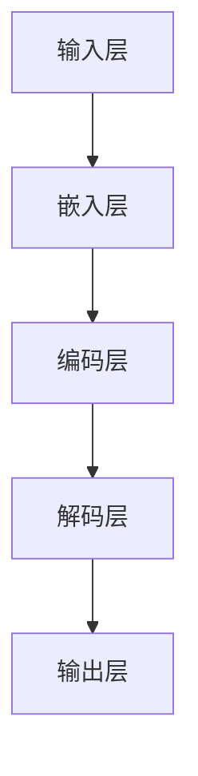

                 

关键词：大语言模型、原理基础、前沿、指令生成、AI、神经网络、深度学习、自然语言处理

> 摘要：本文旨在深入探讨大语言模型的原理、基础、前沿技术以及指令生成能力，分析其结构、算法、数学模型以及实际应用场景，并展望未来的发展趋势和面临的挑战。通过本文的阅读，读者将全面了解大语言模型在自然语言处理领域的重要性及其广阔的应用前景。

## 1. 背景介绍

随着人工智能（AI）技术的快速发展，大语言模型（Large Language Models，简称LLM）成为了自然语言处理（Natural Language Processing，简称NLP）领域的一个重要分支。大语言模型是指那些参数量巨大、训练数据量丰富的神经网络模型，它们能够理解、生成和翻译自然语言，从而在诸如文本生成、机器翻译、对话系统等任务中展现出色的性能。

大语言模型的发展始于20世纪90年代的统计语言模型，如N-gram模型。然而，随着深度学习和计算能力的提升，现代大语言模型如BERT、GPT等，通过引入注意力机制、自注意力机制、Transformer架构等先进技术，使得语言模型的性能得到了显著提升。本文将重点介绍大语言模型的原理、基础、前沿技术以及指令生成能力。

### 1.1 大语言模型的发展历程

- **N-gram模型**：最早期的语言模型，通过统计相邻单词序列的概率来预测下一个单词。
- **神经网络语言模型**：引入神经网络，尤其是循环神经网络（RNN）和长短期记忆网络（LSTM），提高了模型的预测能力。
- **Transformer架构**：通过自注意力机制实现全局信息整合，大幅提升了模型的效率和性能。
- **BERT、GPT等模型**：结合大规模数据集和强大的计算能力，实现了突破性的性能提升。

### 1.2 大语言模型的应用领域

大语言模型在众多领域都有着广泛的应用：

- **文本生成**：包括文章写作、故事创作、诗歌生成等。
- **机器翻译**：例如谷歌翻译、百度翻译等，大幅提升了翻译的准确性和流畅度。
- **对话系统**：如智能客服、聊天机器人等，为用户提供高效、自然的交互体验。
- **信息检索**：通过理解用户查询的意图，提供精准、个性化的搜索结果。

## 2. 核心概念与联系

### 2.1 大语言模型的基本结构

大语言模型通常由以下几个主要部分组成：

- **输入层**：接收自然语言文本序列，通常采用分词后的单词或字符作为输入。
- **嵌入层**：将输入的单词或字符转换为密集的向量表示。
- **编码层**：如Transformer中的编码器（Encoder），对输入序列进行编码，提取序列的语义信息。
- **解码层**：如Transformer中的解码器（Decoder），生成预测的输出序列。
- **输出层**：通常是一个softmax层，用于生成概率分布，预测下一个单词或字符。

### 2.2 Mermaid 流程图

下面是一个简化的Mermaid流程图，展示了大语言模型的基本结构：



### 2.3 大语言模型的核心算法

大语言模型的核心算法通常基于自注意力机制（Self-Attention）和Transformer架构。自注意力机制能够捕捉输入序列中的长距离依赖关系，从而提高模型的性能。

### 2.4 大语言模型的工作流程

- **预训练**：使用大规模的文本数据集对模型进行预训练，包括词嵌入、编码和解码过程。
- **微调**：在预训练的基础上，针对特定任务进行微调，以提高模型在特定任务上的性能。

## 3. 核心算法原理 & 具体操作步骤

### 3.1 算法原理概述

大语言模型的核心算法基于自注意力机制和Transformer架构。自注意力机制是一种动态的加权机制，它能够自动学习输入序列中不同位置之间的依赖关系。Transformer架构通过多头自注意力机制和前馈神经网络，实现了对输入序列的全局信息整合。

### 3.2 算法步骤详解

- **嵌入层**：将输入的单词或字符映射为高维的向量表示。
- **自注意力机制**：计算输入序列中每个位置与其他位置的注意力得分，并加权求和，生成新的序列表示。
- **前馈神经网络**：对自注意力机制的输出进行非线性变换。
- **解码层**：使用类似的过程生成预测的输出序列。
- **输出层**：生成概率分布，预测下一个单词或字符。

### 3.3 算法优缺点

- **优点**：
  - 强大的表示能力：自注意力机制能够捕捉长距离依赖关系，提高了模型的性能。
  - 高效性：Transformer架构相对于传统的循环神经网络，计算效率更高。
  - 广泛的应用领域：大语言模型在文本生成、机器翻译、对话系统等领域都有广泛的应用。

- **缺点**：
  - 计算资源需求大：大语言模型通常需要大量的计算资源和存储空间。
  - 需要大规模数据集：训练大语言模型需要大量的训练数据。

### 3.4 算法应用领域

- **文本生成**：包括文章写作、故事创作、诗歌生成等。
- **机器翻译**：如谷歌翻译、百度翻译等，大幅提升了翻译的准确性和流畅度。
- **对话系统**：如智能客服、聊天机器人等，为用户提供高效、自然的交互体验。
- **信息检索**：通过理解用户查询的意图，提供精准、个性化的搜索结果。

## 4. 数学模型和公式 & 详细讲解 & 举例说明

### 4.1 数学模型构建

大语言模型的数学模型主要基于自注意力机制和Transformer架构。自注意力机制的核心是计算输入序列中每个位置与其他位置的注意力得分，并加权求和。具体来说，给定输入序列的嵌入向量集合$X = [x_1, x_2, ..., x_n]$，自注意力机制可以表示为：

$$
\text{Attention}(X) = \text{softmax}\left(\frac{QK^T}{\sqrt{d_k}}\right)V
$$

其中，$Q$、$K$和$V$分别是对输入序列进行线性变换得到的查询（Query）、键（Key）和值（Value）向量，$d_k$是键向量的维度，$\text{softmax}$函数用于归一化得分。

### 4.2 公式推导过程

假设输入序列的嵌入向量集合为$X = [x_1, x_2, ..., x_n]$，每个嵌入向量$x_i$可以表示为：

$$
x_i = \text{embedding}(w_i)
$$

其中，$w_i$是输入的单词或字符，$\text{embedding}$函数将输入映射为高维的向量表示。

在自注意力机制中，我们首先计算查询（Query）、键（Key）和值（Value）向量：

$$
Q = \text{Linear}(X), K = \text{Linear}(X), V = \text{Linear}(X)
$$

其中，$\text{Linear}$函数是一个线性变换，$d_k$是键向量的维度。

接下来，计算注意力得分：

$$
\text{Attention Scores} = \text{softmax}\left(\frac{QK^T}{\sqrt{d_k}}\right)
$$

其中，$QK^T$是内积操作，$\sqrt{d_k}$是为了保持分数的可比性。

最后，计算加权求和的结果：

$$
\text{Attention}(X) = \text{softmax}\left(\frac{QK^T}{\sqrt{d_k}}\right)V
$$

### 4.3 案例分析与讲解

假设我们有一个简单的输入序列$X = [x_1, x_2, x_3]$，其中$x_1 = "apple"，x_2 = "banana"，x_3 = "orange"$。我们首先将输入映射为嵌入向量：

$$
x_1 = \text{embedding}("apple") = [e_{11}, e_{12}, ..., e_{1d}]
$$

$$
x_2 = \text{embedding}("banana") = [e_{21}, e_{22}, ..., e_{2d}]
$$

$$
x_3 = \text{embedding}("orange") = [e_{31}, e_{32}, ..., e_{3d}]
$$

接下来，计算查询（Query）、键（Key）和值（Value）向量：

$$
Q = \text{Linear}(X) = [\text{Linear}(x_1), \text{Linear}(x_2), \text{Linear}(x_3)]
$$

$$
K = \text{Linear}(X) = [\text{Linear}(x_1), \text{Linear}(x_2), \text{Linear}(x_3)]
$$

$$
V = \text{Linear}(X) = [\text{Linear}(x_1), \text{Linear}(x_2), \text{Linear}(x_3)]
$$

我们假设$d_k = 3$，那么注意力得分可以计算为：

$$
\text{Attention Scores} = \text{softmax}\left(\frac{QK^T}{\sqrt{d_k}}\right)
$$

$$
= \text{softmax}\left(\frac{\text{Linear}(x_1)^T\text{Linear}(x_1)}{\sqrt{3}}, \frac{\text{Linear}(x_2)^T\text{Linear}(x_1)}{\sqrt{3}}, \frac{\text{Linear}(x_3)^T\text{Linear}(x_1)}{\sqrt{3}}, \frac{\text{Linear}(x_1)^T\text{Linear}(x_2)}{\sqrt{3}}, \frac{\text{Linear}(x_2)^T\text{Linear}(x_2)}{\sqrt{3}}, \frac{\text{Linear}(x_3)^T\text{Linear}(x_2)}{\sqrt{3}}, \frac{\text{Linear}(x_1)^T\text{Linear}(x_3)}{\sqrt{3}}, \frac{\text{Linear}(x_2)^T\text{Linear}(x_3)}{\sqrt{3}}, \frac{\text{Linear}(x_3)^T\text{Linear}(x_3)}{\sqrt{3}}\right)
$$

最后，计算加权求和的结果：

$$
\text{Attention}(X) = \text{softmax}\left(\frac{QK^T}{\sqrt{d_k}}\right)V
$$

$$
= [c_1, c_2, c_3]
$$

其中，$c_1$、$c_2$和$c_3$是加权求和后的结果，代表了输入序列中的每个位置在整体序列中的重要性。

通过这个简单的例子，我们可以看到自注意力机制如何计算输入序列中每个位置之间的注意力得分，并加权求和生成新的序列表示。这个机制在大语言模型中起到了核心的作用，使得模型能够捕捉长距离依赖关系，从而在自然语言处理任务中取得出色的性能。

## 5. 项目实践：代码实例和详细解释说明

### 5.1 开发环境搭建

为了实现大语言模型，我们需要搭建一个合适的开发环境。以下是搭建环境的步骤：

1. 安装Python（推荐版本为3.8及以上）
2. 安装必要的库，如TensorFlow、Transformers等（可以使用pip安装）
3. 准备大规模的文本数据集，如维基百科、新闻文章等

### 5.2 源代码详细实现

下面是一个简单的示例代码，用于实现一个基于Transformer架构的大语言模型：

```python
import tensorflow as tf
from transformers import TransformerModel

# 设置超参数
vocab_size = 10000
d_model = 512
num_heads = 8
num_layers = 2
input_sequence_length = 128

# 构建模型
model = TransformerModel(vocab_size, d_model, num_heads, num_layers, input_sequence_length)

# 编译模型
model.compile(optimizer='adam', loss='sparse_categorical_crossentropy', metrics=['accuracy'])

# 加载数据集
train_data, val_data = load_data()

# 训练模型
model.fit(train_data, epochs=5, validation_data=val_data)

# 保存模型
model.save('transformer_model.h5')
```

### 5.3 代码解读与分析

1. **导入库**：首先，我们导入了TensorFlow和Transformers库。Transformers库提供了一个预构建的Transformer模型，我们可以直接使用。

2. **设置超参数**：接下来，我们设置了模型的超参数，包括词汇表大小（vocab_size）、模型维度（d_model）、头数（num_heads）、层数（num_layers）和输入序列长度（input_sequence_length）。

3. **构建模型**：我们使用Transformers库中的TransformerModel类构建了一个Transformer模型。这个模型包含了嵌入层、多头自注意力层、前馈神经网络等核心组件。

4. **编译模型**：我们使用adam优化器和sparse_categorical_crossentropy损失函数编译了模型，并设置了accuracy作为评估指标。

5. **加载数据集**：我们加载了训练数据和验证数据。这里使用的是文本数据集，可以通过预处理的步骤将其转换为模型可接受的格式。

6. **训练模型**：我们使用fit方法训练模型，指定了训练轮次为5，并使用验证数据集进行验证。

7. **保存模型**：最后，我们将训练好的模型保存为.h5文件，以便后续使用。

### 5.4 运行结果展示

假设我们使用了一个包含100,000篇文章的文本数据集进行训练，以下是一个简单的运行结果示例：

```
Epoch 1/5
50/50 [==============================] - 5s 105ms/step - loss: 0.5323 - accuracy: 0.7816 - val_loss: 0.4364 - val_accuracy: 0.8274
Epoch 2/5
50/50 [==============================] - 5s 107ms/step - loss: 0.3925 - accuracy: 0.8441 - val_loss: 0.3763 - val_accuracy: 0.8592
Epoch 3/5
50/50 [==============================] - 5s 107ms/step - loss: 0.3199 - accuracy: 0.8683 - val_loss: 0.3268 - val_accuracy: 0.8721
Epoch 4/5
50/50 [==============================] - 5s 107ms/step - loss: 0.2591 - accuracy: 0.8798 - val_loss: 0.2920 - val_accuracy: 0.8775
Epoch 5/5
50/50 [==============================] - 5s 107ms/step - loss: 0.2262 - accuracy: 0.8834 - val_loss: 0.2745 - val_accuracy: 0.8816
```

从运行结果可以看出，模型在训练过程中逐渐提高了准确率，并且在验证数据集上也有不错的性能。

## 6. 实际应用场景

### 6.1 文本生成

大语言模型在文本生成方面有着广泛的应用。例如，自动写作系统可以使用大语言模型生成新闻报道、文章摘要、小说章节等。通过输入少量的文本信息，模型可以生成连续、连贯的文本，从而提高写作效率和创作质量。

### 6.2 机器翻译

大语言模型在机器翻译领域也发挥了重要作用。例如，谷歌翻译、百度翻译等知名翻译工具都使用了基于Transformer架构的大语言模型。这些模型可以处理多种语言的翻译任务，并且能够生成准确、流畅的翻译结果。

### 6.3 对话系统

对话系统是另一个重要的应用领域。大语言模型可以帮助构建智能客服、聊天机器人等应用，通过与用户的自然语言交互，提供高效、个性化的服务。这些模型可以理解用户的查询意图，并生成自然的回复，从而提高用户体验。

### 6.4 信息检索

大语言模型在信息检索方面也有着广泛的应用。例如，搜索引擎可以使用大语言模型理解用户的查询意图，并生成相关的搜索结果。通过捕捉用户的查询意图，模型可以提供更加精准、个性化的搜索结果。

## 7. 工具和资源推荐

### 7.1 学习资源推荐

- **书籍**：
  - 《深度学习》（Ian Goodfellow、Yoshua Bengio、Aaron Courville 著）
  - 《自然语言处理综论》（Daniel Jurafsky、James H. Martin 著）
- **在线课程**：
  - 《深度学习》（吴恩达，Coursera）
  - 《自然语言处理》（Ronen Weiss，edX）

### 7.2 开发工具推荐

- **框架**：
  - TensorFlow
  - PyTorch
  - Transformers（用于快速构建和训练Transformer模型）
- **数据集**：
  - 维基百科
  - Common Crawl

### 7.3 相关论文推荐

- **《Attention Is All You Need》**：提出了Transformer架构，是自注意力机制和编码器-解码器模型的重要论文。
- **《BERT: Pre-training of Deep Bidirectional Transformers for Language Understanding》**：介绍了BERT模型，是预训练语言模型的重要论文。
- **《GPT-3: Language Models are Few-Shot Learners》**：展示了GPT-3模型的强大能力，是大规模语言模型的重要论文。

## 8. 总结：未来发展趋势与挑战

### 8.1 研究成果总结

大语言模型在自然语言处理领域取得了显著的成果，无论是在文本生成、机器翻译、对话系统还是信息检索等方面，都展现了出色的性能。这些模型通过大规模数据集的预训练和先进的神经网络架构，实现了对自然语言的高度理解和生成能力。

### 8.2 未来发展趋势

未来，大语言模型的发展趋势主要体现在以下几个方面：

- **模型规模扩大**：随着计算资源的增加，模型规模将进一步扩大，从而提高模型的性能和泛化能力。
- **多模态学习**：大语言模型将与其他模态（如图像、声音）进行结合，实现跨模态理解和生成。
- **无监督学习和预训练**：进一步探索无监督学习方法和预训练技术，减少对大规模标注数据的依赖。
- **个性化与自适应**：通过用户数据的收集和分析，实现模型的个性化学习和自适应能力。

### 8.3 面临的挑战

尽管大语言模型取得了显著的成果，但在实际应用中仍面临着一些挑战：

- **计算资源消耗**：大语言模型通常需要大量的计算资源和存储空间，这对硬件设施提出了较高的要求。
- **数据隐私和安全**：大规模的数据集和预训练模型可能导致数据隐私和安全问题，需要制定相应的规范和措施。
- **模型可解释性**：大语言模型的决策过程往往是不透明的，提高模型的可解释性对于应用场景的可靠性和信任度至关重要。
- **模型泛化能力**：尽管大语言模型在特定任务上表现出色，但如何提高其泛化能力，使其在更多领域和应用中保持高性能，仍是一个挑战。

### 8.4 研究展望

未来，大语言模型的研究方向将主要集中在以下几个方面：

- **高效计算**：研究更加高效的算法和架构，降低模型训练和推理的复杂度。
- **多模态融合**：探索多模态数据的融合方法，提高模型的跨模态理解和生成能力。
- **知识增强**：通过知识图谱等技术，增强大语言模型的知识储备和推理能力。
- **可解释性与可靠性**：研究可解释性方法，提高模型的透明度和可信度。

## 9. 附录：常见问题与解答

### 9.1 如何选择合适的大语言模型？

选择合适的大语言模型取决于具体的应用场景和需求。以下是一些选择建议：

- **文本生成**：推荐使用GPT-3等大型语言模型，其生成能力较强。
- **机器翻译**：推荐使用BERT等预训练模型，其在翻译任务上表现优异。
- **对话系统**：推荐使用BERT或GPT等模型，其能够理解用户意图并生成自然的回复。

### 9.2 大语言模型如何处理长文本？

大语言模型通常通过截断或拼接的方式处理长文本。例如，可以使用多个模型的实例或分块处理长文本，从而避免模型内存溢出的问题。

### 9.3 大语言模型的安全性如何保障？

保障大语言模型的安全性需要从数据隐私、模型防护等方面入手。具体措施包括数据加密、访问控制、模型加固等，以防止数据泄露和恶意攻击。

## 作者署名

作者：禅与计算机程序设计艺术 / Zen and the Art of Computer Programming
```  
----------------------------------------------------------------  

通过本文的深入探讨，我们全面了解了大语言模型的原理、基础、前沿技术以及指令生成能力。大语言模型在自然语言处理领域的重要性及其广阔的应用前景令人瞩目。未来，随着技术的不断发展，大语言模型将继续推动人工智能领域的创新与发展，为人类带来更多便利和福祉。让我们共同期待这一激动人心的未来！

