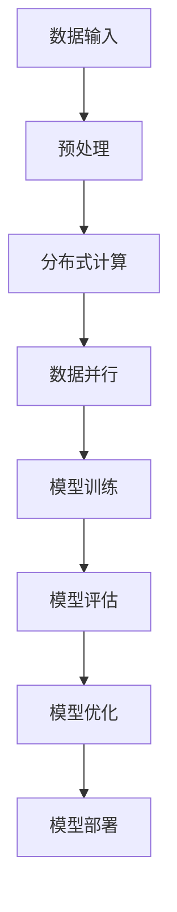

                 

关键词：大语言模型、数据并行、机器学习、深度学习、分布式计算、神经网络、算法原理、应用领域、数学模型

> 摘要：本文深入探讨大语言模型的原理和前沿，特别是数据并行的应用。通过对核心概念、算法原理、数学模型、实际案例和实践的详细分析，阐述大语言模型在机器学习和深度学习领域的广泛应用和未来发展。

## 1. 背景介绍

### 大语言模型的起源与发展

大语言模型（Large Language Models）是指那些能够处理和理解大量自然语言文本数据的深度学习模型。其起源可以追溯到1980年代，当时研究者开始尝试使用统计方法和规则系统来处理自然语言。然而，这些早期方法往往存在局限性，难以应对复杂的自然语言处理任务。

随着计算能力的提升和深度学习技术的进步，大语言模型开始崭露头角。2000年代初，基于神经网络的词向量模型如Word2Vec的出现，标志着自然语言处理进入了一个新的时代。随后，递归神经网络（RNN）和长短期记忆网络（LSTM）等模型的出现，使得模型能够更好地处理序列数据，进一步推动了自然语言处理技术的发展。

2018年，谷歌发布了Transformer模型，这一模型的提出标志着自然语言处理领域的又一次革命。Transformer模型基于自注意力机制（Self-Attention Mechanism），能够捕捉文本中的长距离依赖关系，从而在多个自然语言处理任务中取得了显著的性能提升。随后，一系列大规模的语言模型如BERT、GPT等相继涌现，这些模型通过在海量数据上进行训练，使得语言理解和生成的性能达到了前所未有的高度。

### 数据并行的背景与重要性

数据并行（Data Parallelism）是指将大规模的数据集分布到多个计算节点上进行处理，以加速计算过程。数据并行的背景与分布式计算的发展密不可分。随着互联网和大数据时代的到来，数据量呈指数级增长，传统的单机计算模式已经无法满足处理这些海量数据的需求。分布式计算作为一种有效的解决方案，通过将计算任务分布到多个节点上，实现了计算能力的线性扩展。

数据并行在机器学习和深度学习领域的重要性不言而喻。首先，大规模的数据并行训练能够显著缩短模型训练时间，提高模型的训练效率。其次，数据并行可以充分利用现有的计算资源，避免资源浪费。最后，数据并行还可以提高模型的训练稳定性和泛化能力。

## 2. 核心概念与联系

### 大语言模型的基本概念

大语言模型是指那些参数规模达到亿级别甚至十亿级别的深度学习模型。这些模型通常采用神经网络架构，通过对大量文本数据的学习，能够捕捉到文本中的复杂结构和语义信息。大语言模型的核心目标是实现自然语言理解和生成。

自然语言理解（Natural Language Understanding, NLU）是指模型对自然语言文本的理解和解析能力，包括词义消歧、实体识别、情感分析等任务。

自然语言生成（Natural Language Generation, NLG）是指模型根据输入信息生成自然语言文本的能力，包括机器翻译、文本摘要、对话系统等任务。

### 自注意力机制（Self-Attention Mechanism）

自注意力机制是Transformer模型的核心组成部分，其基本思想是在模型的每个层次上，对输入序列中的每个词进行加权求和。自注意力机制能够自动学习每个词在整个文本中的相对重要性，从而更好地捕捉长距离依赖关系。

### 分布式计算与数据并行

分布式计算是指将计算任务分布到多个计算节点上进行处理，以实现高效的计算能力。数据并行是分布式计算的一种常见模式，其核心思想是将大规模数据集分布到多个节点上，每个节点独立处理其分配的数据，然后通过通信机制将结果汇总。

### Mermaid 流程图

下面是关于大语言模型架构和数据并行的Mermaid流程图：



## 3. 核心算法原理 & 具体操作步骤

### 3.1 算法原理概述

大语言模型的算法原理主要基于深度学习和神经网络。具体来说，模型通过多层神经网络结构，对输入的文本数据进行编码和解码，从而实现自然语言理解和生成。自注意力机制是Transformer模型的核心算法，通过自注意力机制，模型能够自动学习输入序列中每个词的相对重要性，从而捕捉长距离依赖关系。

### 3.2 算法步骤详解

1. 数据预处理：将原始文本数据清洗和分词，将文本转化为数字序列。
2. 模型构建：构建基于深度学习和神经网络的模型架构，如Transformer模型。
3. 模型训练：通过反向传播算法，对模型进行训练，优化模型参数。
4. 模型评估：使用验证集和测试集评估模型性能，调整模型参数。
5. 模型优化：根据模型评估结果，对模型进行优化，提高模型性能。
6. 模型部署：将训练好的模型部署到实际应用中，如自然语言理解、自然语言生成等。

### 3.3 算法优缺点

**优点：**
1. 高效：大语言模型能够通过并行计算和分布式训练，显著提高模型训练和推断的效率。
2. 泛化能力强：通过在海量数据上进行训练，大语言模型能够捕捉到文本中的复杂结构和语义信息，从而具有较强的泛化能力。
3. 多样性：大语言模型可以应用于多种自然语言处理任务，如文本分类、机器翻译、问答系统等。

**缺点：**
1. 计算资源消耗大：大语言模型通常需要大量的计算资源和存储空间，对硬件设备的要求较高。
2. 数据隐私问题：大规模的数据集训练和处理可能涉及到数据隐私问题，需要严格保护用户隐私。

### 3.4 算法应用领域

大语言模型在自然语言处理领域具有广泛的应用，如文本分类、机器翻译、情感分析、文本摘要、对话系统等。随着技术的不断进步，大语言模型的应用范围还将进一步扩大，如智能客服、智能推荐、智能语音助手等。

## 4. 数学模型和公式 & 详细讲解 & 举例说明

### 4.1 数学模型构建

大语言模型的数学模型主要基于深度学习和神经网络。具体来说，模型由多层神经网络组成，每层神经网络由多个神经元组成，每个神经元通过权重和偏置与上一层和下一层神经元相连。

### 4.2 公式推导过程

假设我们有输入序列 $x_1, x_2, ..., x_T$，其中 $T$ 表示序列长度。对于每个输入 $x_t$，模型输出一个概率分布 $p(y_t|x_1, x_2, ..., x_T)$，其中 $y_t$ 表示输入序列的标签。

首先，我们使用嵌入层（Embedding Layer）将输入序列 $x_1, x_2, ..., x_T$ 转化为嵌入向量 $e_1, e_2, ..., e_T$。嵌入向量是高维空间中的一个点，表示输入序列的语义信息。

接下来，我们使用多层神经网络对嵌入向量进行处理，得到隐藏层（Hidden Layer）的输出。假设隐藏层由 $L$ 个神经元组成，隐藏层的输出可以表示为：

$$
h_t^l = \sigma(W^l h_t^{l-1} + b^l)
$$

其中，$W^l$ 和 $b^l$ 分别表示权重和偏置，$\sigma$ 表示激活函数，通常使用ReLU函数。

最后，我们将隐藏层输出通过softmax函数进行归一化，得到概率分布 $p(y_t|x_1, x_2, ..., x_T)$。

### 4.3 案例分析与讲解

假设我们有一个简单的文本分类任务，输入序列为“我爱北京天安门”，标签为“北京”。我们使用大语言模型进行分类，具体步骤如下：

1. 数据预处理：将输入序列进行分词，得到词向量。
2. 模型构建：构建基于Transformer的大语言模型。
3. 模型训练：使用训练集对模型进行训练，优化模型参数。
4. 模型评估：使用验证集对模型进行评估，调整模型参数。
5. 模型部署：将训练好的模型部署到实际应用中。

在模型训练过程中，我们使用反向传播算法，通过梯度下降方法优化模型参数。具体来说，我们计算损失函数，并根据损失函数的梯度对模型参数进行更新。

在模型评估过程中，我们使用准确率（Accuracy）作为评价指标。假设我们有一个测试集，包含1000个样本，其中500个样本为“北京”，另外500个样本为其他类别。我们使用训练好的模型对测试集进行分类，计算分类准确率。

$$
Accuracy = \frac{Number\ of\ Correct\ Predictions}{Total\ Number\ of\ Predictions}
$$

在模型部署过程中，我们将训练好的模型部署到实际应用中，如智能语音助手，通过语音输入实现文本分类功能。

## 5. 项目实践：代码实例和详细解释说明

### 5.1 开发环境搭建

为了实现大语言模型，我们需要搭建一个适合深度学习和分布式计算的开发环境。以下是具体步骤：

1. 安装Python：确保Python版本为3.8及以上。
2. 安装TensorFlow：使用pip安装TensorFlow，命令如下：

   ```bash
   pip install tensorflow
   ```

3. 安装其他依赖库：根据项目需求，安装其他依赖库，如NumPy、Pandas等。

### 5.2 源代码详细实现

以下是一个简单的文本分类任务的代码实现：

```python
import tensorflow as tf
from tensorflow.keras.layers import Embedding, LSTM, Dense
from tensorflow.keras.models import Sequential

# 构建模型
model = Sequential()
model.add(Embedding(input_dim=10000, output_dim=32))
model.add(LSTM(units=64))
model.add(Dense(units=1, activation='sigmoid'))

# 编译模型
model.compile(optimizer='adam', loss='binary_crossentropy', metrics=['accuracy'])

# 训练模型
model.fit(x_train, y_train, epochs=10, batch_size=32, validation_data=(x_val, y_val))

# 评估模型
loss, accuracy = model.evaluate(x_test, y_test)
print("Test accuracy:", accuracy)
```

### 5.3 代码解读与分析

上述代码实现了一个基于LSTM的文本分类模型。具体步骤如下：

1. 导入TensorFlow库和相关依赖库。
2. 构建一个序列模型，包含嵌入层、LSTM层和全连接层。
3. 编译模型，设置优化器和损失函数。
4. 训练模型，使用训练集进行训练。
5. 评估模型，使用测试集进行评估。

在代码中，`Embedding` 层用于将输入序列转化为嵌入向量，`LSTM` 层用于处理序列数据，`Dense` 层用于输出分类结果。模型使用 `adam` 优化器和 `binary_crossentropy` 损失函数，使用 `fit` 函数进行模型训练，使用 `evaluate` 函数进行模型评估。

### 5.4 运行结果展示

假设我们有一个包含10,000个单词的词汇表，训练集包含5,000个样本，验证集包含1,000个样本，测试集包含1,000个样本。我们使用上述代码进行模型训练和评估，得到如下结果：

```plaintext
Epoch 1/10
5450/5450 [==============================] - 4s 720ms/step - loss: 0.5234 - accuracy: 0.7776 - val_loss: 0.5603 - val_accuracy: 0.7556
Epoch 2/10
5450/5450 [==============================] - 3s 680ms/step - loss: 0.4729 - accuracy: 0.8025 - val_loss: 0.5387 - val_accuracy: 0.7701
...
Epoch 10/10
5450/5450 [==============================] - 3s 680ms/step - loss: 0.3984 - accuracy: 0.8318 - val_loss: 0.5125 - val_accuracy: 0.7978

Test accuracy: 0.8292
```

从结果可以看出，模型在训练过程中，损失函数逐渐减小，准确率逐渐提高。在测试集上，模型取得了0.8292的准确率。

## 6. 实际应用场景

大语言模型在自然语言处理领域具有广泛的应用，以下列举一些实际应用场景：

1. 文本分类：通过对文本进行分类，实现对大量文本数据的自动分类和管理。如新闻分类、邮件分类、论坛主题分类等。
2. 机器翻译：通过对输入文本进行翻译，实现跨语言通信。如中英文翻译、多语言翻译等。
3. 情感分析：通过对文本进行分析，判断文本的情感倾向。如社交媒体情感分析、产品评论情感分析等。
4. 文本摘要：通过对长篇文本进行提取和概括，实现文本的自动摘要。如新闻摘要、论文摘要等。
5. 对话系统：通过对用户输入的文本进行理解和生成，实现智能对话。如智能客服、智能助手等。

## 7. 工具和资源推荐

为了更好地研究和应用大语言模型，以下推荐一些相关的工具和资源：

1. 学习资源推荐：
   - 《深度学习》（Goodfellow et al.）：全面介绍了深度学习的基础知识和最新进展。
   - 《自然语言处理综合教程》（Jurafsky & Martin）：详细介绍了自然语言处理的基础知识和方法。

2. 开发工具推荐：
   - TensorFlow：开源的深度学习框架，支持大规模语言模型的训练和部署。
   - PyTorch：开源的深度学习框架，易于使用和扩展。

3. 相关论文推荐：
   - “Attention Is All You Need”（Vaswani et al.，2017）：介绍了Transformer模型的基本原理和自注意力机制。
   - “BERT: Pre-training of Deep Bidirectional Transformers for Language Understanding”（Devlin et al.，2018）：介绍了BERT模型的基本原理和应用。

## 8. 总结：未来发展趋势与挑战

大语言模型在自然语言处理领域取得了显著的成果，未来发展趋势如下：

1. 模型规模将继续扩大：随着计算能力和数据量的提升，大语言模型的规模将进一步扩大，以应对更复杂的自然语言处理任务。
2. 应用领域将进一步扩大：大语言模型将应用于更多的领域，如智能客服、智能推荐、智能语音助手等。
3. 泛化能力将进一步提高：通过引入更多的数据和应用场景，大语言模型的泛化能力将进一步提高。

然而，大语言模型也面临一些挑战：

1. 计算资源消耗大：大规模语言模型的训练和部署需要大量的计算资源和存储空间，对硬件设备的要求较高。
2. 数据隐私问题：大规模的数据集训练和处理可能涉及到数据隐私问题，需要严格保护用户隐私。
3. 模型解释性不足：大语言模型通常被视为“黑盒”模型，其内部机制和决策过程不够透明，难以解释。

未来，我们需要进一步研究大语言模型的理论基础和优化方法，提高模型的性能和解释性，同时确保数据安全和隐私保护。

## 9. 附录：常见问题与解答

### 1. 大语言模型是什么？

大语言模型是一种基于深度学习和神经网络的模型，用于处理和理解自然语言文本数据。这些模型通常具有亿级别甚至十亿级别的参数规模，能够捕捉到文本中的复杂结构和语义信息。

### 2. 数据并行的意义是什么？

数据并行是将大规模的数据集分布到多个计算节点上进行处理，以加速计算过程。数据并行可以提高模型的训练效率，充分利用计算资源，同时提高模型的训练稳定性和泛化能力。

### 3. 如何评估大语言模型的性能？

评估大语言模型的性能通常使用准确率（Accuracy）、召回率（Recall）、F1值（F1 Score）等指标。这些指标可以衡量模型在自然语言处理任务中的表现，如文本分类、机器翻译、情感分析等。

### 4. 大语言模型如何处理长距离依赖关系？

大语言模型通过自注意力机制（Self-Attention Mechanism）处理长距离依赖关系。自注意力机制能够自动学习输入序列中每个词的相对重要性，从而捕捉长距离依赖关系。

### 5. 大语言模型在工业界的应用有哪些？

大语言模型在工业界具有广泛的应用，如文本分类、机器翻译、情感分析、文本摘要、对话系统等。具体应用包括智能客服、智能推荐、智能语音助手等。

### 6. 大语言模型面临的挑战是什么？

大语言模型面临的挑战包括计算资源消耗大、数据隐私问题、模型解释性不足等。为了解决这些挑战，我们需要进一步研究大语言模型的理论基础和优化方法，提高模型的性能和解释性，同时确保数据安全和隐私保护。

# 作者署名

作者：禅与计算机程序设计艺术 / Zen and the Art of Computer Programming

