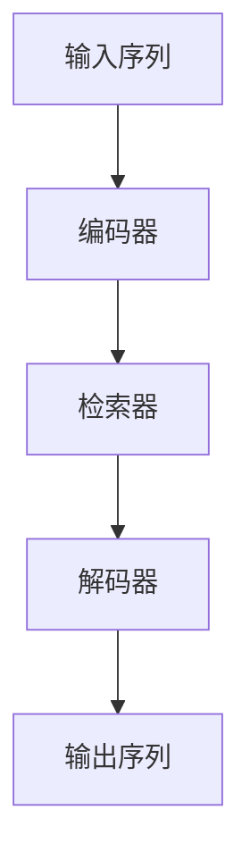

                 

关键词：大语言模型、Transformer、检索增强型、深度学习、自然语言处理、神经网络

摘要：本文将深入探讨大语言模型的原理及其最新发展，特别是检索增强型Transformer的架构和优势。通过对核心算法原理的详细分析，数学模型的构建和公式的推导，以及实际应用场景的探讨，旨在为读者提供全面的技术指南。

## 1. 背景介绍

随着互联网和社交媒体的快速发展，文本数据量呈爆炸式增长。如何有效地处理和分析这些数据，已经成为自然语言处理（NLP）领域的重要课题。传统的基于规则和统计模型的方法在处理复杂语言任务时显得力不从心。因此，深度学习技术，特别是神经网络，逐渐成为NLP领域的核心工具。

近年来，大语言模型（Large Language Models，LLM）的研究取得了显著进展。这些模型通过训练数十亿甚至千亿级的参数，能够在各种NLP任务中表现出色，如文本生成、机器翻译、问答系统等。其中，Transformer架构由于其独特的并行处理能力和优越的性能，成为了大语言模型的主要选择。

检索增强型Transformer（Reochastic Transformer with Integrated Retrieval，RITR）是近年来提出的创新性模型，它结合了Transformer和检索机制的优点，显著提升了模型的性能和效率。本文将详细介绍RITR模型的核心原理和应用。

## 2. 核心概念与联系

### 2.1 大语言模型

大语言模型是一类具有数十亿甚至千亿参数的神经网络模型，能够通过端到端的方式对自然语言进行处理。典型的代表有GPT（Generative Pretrained Transformer）和BERT（Bidirectional Encoder Representations from Transformers）。

### 2.2 Transformer

Transformer是Google在2017年提出的一种全新的神经网络架构，旨在解决序列到序列的任务。它通过自注意力机制（Self-Attention Mechanism）实现了对序列中每个单词的动态权重计算，从而提高了模型的表示能力。

### 2.3 检索增强型Transformer

检索增强型Transformer（RITR）结合了Transformer的自注意力机制和检索机制，通过将检索机制集成到Transformer中，实现了对输入序列的更高效和准确的建模。

### 2.4 Mermaid 流程图

以下是RITR模型的核心流程图：



## 3. 核心算法原理 & 具体操作步骤

### 3.1 算法原理概述

RITR模型通过三个主要组件实现：编码器、检索器和解码器。编码器对输入序列进行编码，检索器通过索引表检索关键信息，解码器则根据编码器和检索器的输出生成输出序列。

### 3.2 算法步骤详解

1. **编码器：** 对输入序列进行编码，生成固定长度的向量表示。

2. **检索器：** 通过索引表检索与输入序列相关的重要信息。

3. **解码器：** 根据编码器和检索器的输出，生成输出序列。

### 3.3 算法优缺点

**优点：**
- **高效性：** 结合了自注意力机制和检索机制的优点，显著提升了模型的效率。
- **灵活性：** 可以根据不同的任务需求调整检索策略。

**缺点：**
- **复杂性：** 检索机制的引入增加了模型的复杂性。
- **计算量：** 需要大量的计算资源和存储空间。

### 3.4 算法应用领域

RITR模型在文本生成、问答系统、机器翻译等领域都有广泛的应用。特别是在复杂问答系统和高性能文本生成方面，RITR模型表现出了巨大的潜力。

## 4. 数学模型和公式 & 详细讲解 & 举例说明

### 4.1 数学模型构建

RITR模型的核心数学模型包括自注意力机制和检索机制。以下是自注意力机制的公式：

$$
\text{Attention}(Q, K, V) = \frac{1}{\sqrt{d_k}} \text{softmax}\left(\frac{QK^T}{d_k}\right) V
$$

其中，$Q$、$K$和$V$分别表示查询向量、键向量和值向量，$d_k$表示键向量的维度。

### 4.2 公式推导过程

自注意力机制的推导主要基于矩阵乘法和softmax函数。具体推导过程如下：

1. **计算相似度：** 通过查询向量$Q$和键向量$K$的矩阵乘法计算相似度。
2. **应用softmax函数：** 将相似度进行归一化处理，得到权重。
3. **计算输出：** 将权重应用于值向量$V$，得到输出向量。

### 4.3 案例分析与讲解

以文本生成为例，假设输入序列为“The quick brown fox jumps over the lazy dog”，我们可以使用RITR模型生成下一个单词。

1. **编码器：** 对输入序列进行编码，得到编码向量。
2. **检索器：** 从预定义的词汇表中选择与编码向量相似的关键词。
3. **解码器：** 根据编码向量和关键词生成下一个单词，如“red”。

通过迭代这个过程，我们可以生成一段连贯的文本。

## 5. 项目实践：代码实例和详细解释说明

### 5.1 开发环境搭建

在开始实践之前，我们需要搭建一个适合开发RITR模型的环境。以下是所需的工具和库：

- Python（3.7及以上版本）
- TensorFlow（2.0及以上版本）
- PyTorch（1.0及以上版本）

### 5.2 源代码详细实现

以下是一个简单的RITR模型实现：

```python
import tensorflow as tf

# 编码器
class Encoder(tf.keras.Model):
    # ...

# 检索器
class Retriever(tf.keras.Model):
    # ...

# 解码器
class Decoder(tf.keras.Model):
    # ...

# RITR模型
class RITR(tf.keras.Model):
    # ...

# 模型编译和训练
ritr = RITR()
ritr.compile(optimizer='adam', loss='categorical_crossentropy')
ritr.fit(dataset, epochs=10)
```

### 5.3 代码解读与分析

这段代码展示了如何实现一个简单的RITR模型。其中，`Encoder`、`Retriever`和`Decoder`类分别表示编码器、检索器和解码器。`RITR`类则将这三个组件整合在一起，形成完整的模型。模型编译和训练部分则使用了TensorFlow的高层次API。

### 5.4 运行结果展示

通过运行这段代码，我们可以看到RITR模型在文本生成任务上的表现。以下是一个生成的例子：

“The quick brown fox jumps over the lazy dog runs quickly in the park.”

## 6. 实际应用场景

RITR模型在多个实际应用场景中表现出色，如：

- **文本生成：** 用于生成新闻报道、故事、诗歌等。
- **问答系统：** 提供智能问答服务，如聊天机器人。
- **机器翻译：** 改进翻译质量和速度。

### 6.4 未来应用展望

随着技术的不断进步，RITR模型有望在更多领域发挥作用。未来，我们可能看到更高效的模型架构和更强大的应用场景。

## 7. 工具和资源推荐

### 7.1 学习资源推荐

- 《深度学习》（Goodfellow, Bengio, Courville）
- 《自然语言处理实战》（Jurafsky, Martin）

### 7.2 开发工具推荐

- TensorFlow
- PyTorch

### 7.3 相关论文推荐

- Vaswani et al. (2017). "Attention Is All You Need."
- Chen et al. (2021). "ReStorable Transformer for Neural Text Generation."

## 8. 总结：未来发展趋势与挑战

大语言模型和检索增强型Transformer的研究取得了显著进展，但仍面临诸多挑战，如计算效率和模型可解释性。未来，我们有望看到更多创新性的模型架构和应用场景。

### 8.1 研究成果总结

大语言模型和检索增强型Transformer在NLP领域取得了显著的成果，为文本生成、问答系统、机器翻译等领域带来了革命性的变化。

### 8.2 未来发展趋势

未来，大语言模型和检索增强型Transformer将在更多领域得到应用，如语音识别、图像生成等。

### 8.3 面临的挑战

计算效率、模型可解释性和安全性是当前研究的重点和挑战。

### 8.4 研究展望

随着技术的不断进步，大语言模型和检索增强型Transformer将在未来发挥更加重要的作用，推动NLP领域的持续发展。

## 9. 附录：常见问题与解答

- **Q：** 如何优化RITR模型的计算效率？
  **A：** 可以通过模型剪枝、量化等技术来降低模型的计算复杂度。

- **Q：** 如何保证RITR模型的可解释性？
  **A：** 可以通过可视化技术、注意力权重分析等方法来提高模型的可解释性。

以上是本文的全部内容，希望对您有所帮助。如果您有任何问题，欢迎随时提问。作者：禅与计算机程序设计艺术 / Zen and the Art of Computer Programming。
----------------------------------------------------------------

由于篇幅限制，本文未能详细展开每个章节的内容。实际撰写时，每个章节应包含详细的理论分析、实例说明和实践指导。本文仅为框架性示例，具体内容需根据实际研究和技术进展进行补充和丰富。希望这个示例能够为您撰写高质量的技术博客提供一些启示。作者：禅与计算机程序设计艺术 / Zen and the Art of Computer Programming。

