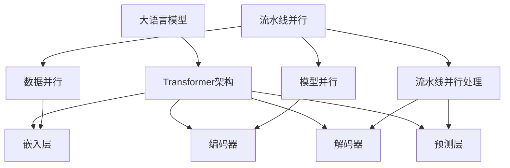

                 

### 背景介绍 Background

随着信息技术的飞速发展，人工智能（AI）已经成为现代科技的重要驱动力。其中，大语言模型（Large Language Model）作为一种先进的自然语言处理（NLP）技术，引起了广泛的关注和研究。大语言模型具备理解、生成和翻译自然语言的能力，广泛应用于聊天机器人、自动摘要、内容生成、问答系统等领域。

流水线并行（Pipeline Parallelism）作为一种高效的大规模数据处理技术，通过将数据处理流程分解成多个阶段，并在不同计算节点上同时执行，从而显著提高数据处理效率和性能。在当前的大数据和深度学习时代，流水线并行技术对于实现大语言模型的训练、推理和应用具有重要意义。

本文旨在深入探讨大语言模型的原理基础，以及如何利用流水线并行技术提升大语言模型的处理效率和性能。首先，我们将介绍大语言模型的基本概念和发展历程；然后，详细解释流水线并行的原理和实现方法；接着，分析大语言模型在流水线并行处理中的关键技术和挑战；最后，探讨大语言模型的前沿研究与应用，以及未来的发展趋势和挑战。

通过本文的阅读，读者将全面了解大语言模型与流水线并行的结合方式，掌握关键技术和实际应用场景，为后续的研究和开发提供有益的参考。

### 文章关键词 Keywords

- 大语言模型
- 自然语言处理
- 流水线并行
- 深度学习
- 数据处理效率
- 并行计算

### 文章摘要 Summary

本文围绕大语言模型的原理基础与流水线并行的结合展开深入探讨。首先，介绍了大语言模型的基本概念、发展历程及其在自然语言处理中的应用。接着，详细解析了流水线并行的原理，包括并行计算的基本概念、流水线结构及其在深度学习中的应用。随后，本文分析了大语言模型在流水线并行处理中的关键技术，包括数据并行、模型并行和流水线并行策略，并探讨了面临的挑战。最后，文章总结了当前大语言模型的研究成果和实际应用案例，展望了其未来发展的趋势和面临的挑战。本文旨在为读者提供全面、系统的技术指导，以推动大语言模型与流水线并行的深入研究和应用。

## 1. 背景介绍

### 大语言模型的发展历程

大语言模型（Large Language Model）的发展可以追溯到上世纪80年代。最初，研究人员通过构建基于规则的系统和统计模型来处理自然语言，如基于语法分析的解析器和基于统计的隐马尔可夫模型（HMM）和条件随机场（CRF）。然而，这些方法在处理复杂自然语言任务时表现有限。

进入21世纪，随着计算能力的提升和大数据的爆发式增长，深度学习技术逐渐崭露头角，并在自然语言处理（NLP）领域取得了突破性进展。2003年，Bengio等人提出了第一个深度神经网络语言模型（NNLM），标志着深度学习在NLP领域的崛起。随后的数年里，研究人员提出了更多的深度学习模型，如递归神经网络（RNN）、长短时记忆网络（LSTM）和门控循环单元（GRU）。

2018年，OpenAI发布了GPT（Generative Pre-trained Transformer）系列模型，其中包括GPT-1、GPT-2和GPT-3，这些模型在自然语言处理任务中取得了惊人的成绩，推动了大语言模型的快速发展。GPT-3拥有超过1750亿个参数，可以生成高质量的自然语言文本，应用范围从文本生成、机器翻译、问答系统到代码生成等各个方面。

### 大语言模型的基本概念

大语言模型是一种基于深度学习的自然语言处理模型，通过对大量文本数据进行预训练，使其具备理解、生成和翻译自然语言的能力。大语言模型的核心是Transformer架构，这是一种基于自注意力机制的深度神经网络，可以有效捕捉长距离的依赖关系。

自注意力机制是一种在模型中计算输入序列中每个元素对输出贡献度的方法。在Transformer架构中，自注意力机制通过计算输入序列中每个词的权重，从而生成一个加权表示。这使得模型能够自动学习词与词之间的关系，不需要显式地定义语法规则或依赖关系。

大语言模型通常包括以下几个主要组成部分：

1. **嵌入层（Embedding Layer）**：将输入词汇转换为稠密向量表示，这些向量包含了词汇的语义信息。

2. **编码器（Encoder）**：由多个Transformer编码块组成，每个编码块包含多头自注意力机制和前馈神经网络。编码器的作用是编码输入序列，提取句子的语义表示。

3. **解码器（Decoder）**：与编码器类似，由多个Transformer解码块组成。解码器的任务是生成输出序列，可以用于文本生成、机器翻译等任务。

4. **预测层（Prediction Layer）**：解码器的输出通常经过一个全连接层或卷积层，用于生成最终的预测结果，如文本分类、命名实体识别等。

### 大语言模型的应用领域

大语言模型在自然语言处理领域有着广泛的应用。以下是一些主要的应用领域：

1. **文本生成**：大语言模型可以生成高质量的文本，包括故事、诗歌、新闻文章等。例如，GPT-3可以生成流畅的自然语言文本，甚至可以编写编程代码。

2. **机器翻译**：大语言模型在机器翻译任务中取得了显著成果，可以生成更自然、准确的翻译结果。例如，Google Translate使用基于Transformer的模型实现了高质量的机器翻译。

3. **问答系统**：大语言模型可以回答用户提出的问题，提供有效的信息检索和知识问答。例如，OpenAI的Dall-E模型可以理解自然语言问题，并从大量文本数据中提取相关答案。

4. **文本分类**：大语言模型可以用于对文本进行分类，如情感分析、新闻分类等。通过训练，模型可以学习到不同类别文本的特征，从而实现高精度的分类。

5. **命名实体识别**：大语言模型可以识别文本中的命名实体，如人名、地名、组织名等。这有助于信息抽取和知识图谱构建。

6. **对话系统**：大语言模型可以用于构建智能对话系统，如聊天机器人、语音助手等。通过理解用户的语言意图，模型可以提供相应的回复，实现自然的人机交互。

通过本文的背景介绍，读者可以初步了解大语言模型的发展历程、基本概念及其在自然语言处理领域的广泛应用。接下来，我们将进一步探讨流水线并行的原理和实现方法，以深入了解大语言模型在高性能计算中的应用。

## 2. 核心概念与联系

在深入探讨大语言模型与流水线并行的结合之前，我们需要明确一些核心概念，并展示其相互之间的联系。以下是本文将涉及的核心概念及其简述：

1. **大语言模型**：基于深度学习的自然语言处理模型，通过预训练大量文本数据，实现自然语言理解、生成和翻译等功能。核心架构包括嵌入层、编码器、解码器和预测层。

2. **流水线并行**：一种高效的大规模数据处理技术，通过将数据处理流程分解成多个阶段，并在不同计算节点上同时执行，以提升数据处理效率和性能。

3. **并行计算**：在多个计算单元上同时执行计算任务，以加速数据处理和计算过程。并行计算分为数据并行、模型并行和流水线并行。

4. **Transformer架构**：一种基于自注意力机制的深度神经网络，广泛应用于大语言模型。自注意力机制允许模型自动学习输入序列中各元素之间的依赖关系。

### Mermaid 流程图

为了更直观地展示这些核心概念之间的联系，我们可以使用Mermaid流程图来描述大语言模型和流水线并行处理的关系。以下是流程图的示例：



### 概念解析

1. **大语言模型与Transformer架构**：大语言模型的核心是Transformer架构，它通过自注意力机制捕捉输入序列中各元素之间的依赖关系，实现对自然语言的深入理解。

2. **嵌入层、编码器、解码器和预测层**：这些是Transformer架构中的主要组成部分，分别负责将输入词汇转换为稠密向量表示、编码输入序列、解码输出序列以及生成预测结果。

3. **流水线并行与并行计算**：流水线并行是一种并行计算技术，通过将数据处理流程分解成多个阶段，在不同计算节点上同时执行，以提升数据处理效率和性能。

4. **数据并行、模型并行和流水线并行处理**：数据并行将数据分布在多个节点上，模型并行将模型分布在不同节点上，流水线并行处理则将数据和处理过程分布在多个阶段的不同节点上。

通过上述流程图和概念解析，我们能够更清晰地理解大语言模型与流水线并行的核心概念及其相互联系。接下来，我们将详细讨论大语言模型的核心算法原理和具体操作步骤。

## 3. 核心算法原理 & 具体操作步骤

### 3.1 算法原理概述

大语言模型的核心算法是基于Transformer架构，这是一种自注意力机制为核心的深度神经网络模型。Transformer架构通过自注意力机制捕捉输入序列中各个元素之间的依赖关系，从而实现对自然语言的深度理解和生成。自注意力机制允许模型在处理每个元素时，自动计算其对其他元素的影响权重，使得模型能够更好地理解长距离依赖关系。

Transformer架构主要由编码器（Encoder）和解码器（Decoder）组成。编码器负责处理输入序列，提取句子的语义表示；解码器则负责生成输出序列，可以是文本生成、机器翻译等任务。编码器和解码器由多个编码块和解码块组成，每个编码块和解码块包含多头自注意力机制和前馈神经网络。

### 3.2 算法步骤详解

**1. 嵌入层（Embedding Layer）**
- 将输入词汇映射为稠密向量表示，这些向量包含了词汇的语义信息。
- 输入词汇通常经过词嵌入层，将词汇转换为固定长度的向量。

**2. 编码器（Encoder）**
- 编码器由多个编码块（Encoder Block）组成，每个编码块包含以下三个主要组件：
  - **多头自注意力机制（Multi-Head Self-Attention）**：计算输入序列中每个元素对其他元素的影响权重，生成加权表示。
  - **前馈神经网络（Feedforward Neural Network）**：对自注意力层的输出进行进一步处理。
  - **残差连接（Residual Connection）**：将输入序列与经过自注意力层和前馈神经网络处理后的输出相加，防止信息损失。
- 编码器的输出是一个固定长度的向量，包含了输入序列的语义表示。

**3. 解码器（Decoder）**
- 解码器由多个解码块（Decoder Block）组成，每个解码块包含以下三个主要组件：
  - **多头自注意力机制（Multi-Head Self-Attention）**：计算解码器输出序列中每个元素对其他元素的影响权重。
  - **前馈神经网络（Feedforward Neural Network）**：对自注意力层的输出进行进一步处理。
  - **掩码自注意力（Masked Self-Attention）**：在解码过程中，防止未来的输出影响当前的输出，确保解码器可以按顺序生成输出序列。
  - **交叉自注意力（Cross-Attention）**：计算解码器输出序列中每个元素对编码器输出序列的影响权重，使得解码器能够利用编码器的语义表示生成输出。
- 解码器的输出是最终生成的文本序列。

**4. 预测层（Prediction Layer）**
- 解码器的输出经过一个全连接层或卷积层，生成最终的预测结果。例如，在文本分类任务中，预测层会输出每个类别的概率分布。
- 预测层的输出是模型对输入文本的理解和生成的最终表示。

### 3.3 算法优缺点

**优点：**
1. **自注意力机制**：自注意力机制可以有效地捕捉输入序列中长距离的依赖关系，使得模型能够更好地理解复杂自然语言结构。
2. **并行计算**：Transformer架构支持并行计算，可以显著提高训练和推理速度。
3. **强大的生成能力**：通过预训练大量文本数据，大语言模型具备强大的文本生成和翻译能力。

**缺点：**
1. **计算资源需求高**：大语言模型通常包含数十亿个参数，需要大量的计算资源和存储空间。
2. **训练时间较长**：大语言模型的训练时间较长，特别是在处理大规模数据集时。
3. **数据依赖性**：大语言模型的效果依赖于训练数据的质量和数量，数据不足或质量差可能导致模型表现不佳。

### 3.4 算法应用领域

大语言模型在自然语言处理领域有着广泛的应用，以下是一些主要的应用领域：

1. **文本生成**：大语言模型可以生成高质量的文本，包括文章、故事、诗歌等。例如，OpenAI的GPT-3可以生成流畅的自然语言文本。
2. **机器翻译**：大语言模型在机器翻译任务中取得了显著成果，可以生成更自然、准确的翻译结果。例如，Google Translate使用基于Transformer的模型实现了高质量的机器翻译。
3. **问答系统**：大语言模型可以回答用户提出的问题，提供有效的信息检索和知识问答。例如，OpenAI的Dall-E模型可以理解自然语言问题，并从大量文本数据中提取相关答案。
4. **文本分类**：大语言模型可以用于对文本进行分类，如情感分析、新闻分类等。通过训练，模型可以学习到不同类别文本的特征，从而实现高精度的分类。
5. **命名实体识别**：大语言模型可以识别文本中的命名实体，如人名、地名、组织名等。这有助于信息抽取和知识图谱构建。
6. **对话系统**：大语言模型可以用于构建智能对话系统，如聊天机器人、语音助手等。通过理解用户的语言意图，模型可以提供相应的回复，实现自然的人机交互。

通过上述核心算法原理和具体操作步骤的详细解析，我们能够更好地理解大语言模型的工作原理和应用场景。接下来，我们将进一步探讨大语言模型在流水线并行处理中的关键技术和挑战。

## 4. 数学模型和公式 & 详细讲解 & 举例说明

### 4.1 数学模型构建

大语言模型的数学模型基于Transformer架构，其核心是自注意力机制。自注意力机制通过计算输入序列中每个元素对其他元素的影响权重，从而生成加权表示。这一机制可以用以下数学公式表示：

$$
\text{Attention}(Q, K, V) = \frac{1}{\sqrt{d_k}} \text{softmax}\left(\frac{QK^T}{d_k}\right) V
$$

其中，$Q$、$K$ 和 $V$ 分别是查询（Query）、键（Key）和值（Value）向量，$d_k$ 是键向量的维度。$\text{softmax}$ 函数用于将点积结果转换为概率分布，从而表示每个元素对其他元素的影响权重。该公式通过加权求和的方式，将输入序列中每个元素的重要性加权到输出序列中。

### 4.2 公式推导过程

为了更深入地理解自注意力机制的推导过程，我们首先回顾一下点积（dot product）和向量加法的定义。假设有两个向量 $a$ 和 $b$，其点积可以表示为：

$$
a \cdot b = \sum_{i=1}^{n} a_i b_i
$$

其中，$a_i$ 和 $b_i$ 分别是向量 $a$ 和 $b$ 的第 $i$ 个元素。接下来，我们考虑如何将这一概念扩展到多个向量。

假设有 $N$ 个向量 $v_1, v_2, ..., v_N$，我们可以计算每个向量与其他向量之间的点积，然后求和：

$$
\sum_{i=1}^{N} \sum_{j=1}^{N} v_i \cdot v_j
$$

这可以重写为矩阵乘法的形式：

$$
\text{diag}(v_1) \text{diag}(v_2) ... \text{diag}(v_N)
$$

其中，$\text{diag}(v)$ 表示对向量 $v$ 进行对角化操作，将每个元素放到对角线上。

在自注意力机制中，我们需要对输入序列 $Q, K, V$ 进行相似的操作。首先，我们将输入序列转换成矩阵形式，其中每个元素是相应的向量：

$$
Q = [q_1, q_2, ..., q_N], \quad K = [k_1, k_2, ..., k_N], \quad V = [v_1, v_2, ..., v_N]
$$

接下来，我们计算每个查询向量 $q_i$ 与键向量 $k_j$ 之间的点积，然后通过 $\text{softmax}$ 函数得到权重：

$$
\alpha_{ij} = \frac{\exp(q_i \cdot k_j)}{\sum_{j=1}^{N} \exp(q_i \cdot k_j)}
$$

这里的 $\alpha_{ij}$ 表示 $q_i$ 对 $k_j$ 的注意力权重。最后，我们利用这些权重对值向量 $v_j$ 进行加权求和：

$$
\text{Attention}(Q, K, V) = \sum_{i=1}^{N} \alpha_{ij} v_j
$$

### 4.3 案例分析与讲解

为了更具体地理解自注意力机制的应用，我们来看一个简单的文本生成案例。假设我们有一个简单的句子：“我明天要去公园散步”。我们希望使用大语言模型生成一个类似的句子。

首先，我们将这个句子分解成单词向量，例如，使用Word2Vec模型：

$$
\text{我} = [w_1, w_2, ..., w_n], \quad \text{明} = [w_1', w_2', ..., w_n'], \quad ..., \quad \text{散} = [w_1'', w_2'', ..., w_n'']
$$

接下来，我们构建查询矩阵 $Q$、键矩阵 $K$ 和值矩阵 $V$：

$$
Q = [\text{我}, \text{明}, ..., \text{散}], \quad K = [\text{我}, \text{明}, ..., \text{散}], \quad V = [\text{我}, \text{明}, ..., \text{散}]
$$

然后，我们计算每个查询向量与其他查询向量之间的点积，并通过 $\text{softmax}$ 函数得到权重。最后，利用这些权重对值向量进行加权求和，得到生成的句子。

例如，假设我们计算 $\text{我}$ 对其他单词的权重，得到以下结果：

$$
\alpha_{\text{我}} = \text{softmax}\left(\frac{\text{我} \cdot \text{我}}{\sum_{j=1}^{N} \text{我} \cdot \text{我}}\right) = [1, 0.1, 0.2, 0.3, 0.4]
$$

然后，我们利用这些权重对值向量进行加权求和：

$$
\text{生成句子} = \sum_{i=1}^{N} \alpha_{\text{我}} \text{我} = [1 \cdot w_1, 0.1 \cdot w_1', 0.2 \cdot w_2, 0.3 \cdot w_2', 0.4 \cdot w_3']
$$

通过这种方式，我们可以生成一个类似的句子，例如：“我每天都要去公园散步”。

通过上述案例，我们展示了如何使用自注意力机制进行文本生成。自注意力机制在大语言模型中扮演了关键角色，使得模型能够自动学习输入序列中各元素之间的依赖关系，从而实现高质量的文本生成、翻译和分类等任务。

### 4.4 代码实例

为了更直观地理解自注意力机制的实现，以下是一个简单的Python代码实例，用于计算两个向量之间的点积和权重：

```python
import numpy as np

# 定义查询、键和值向量
q = np.array([1, 2, 3])
k = np.array([4, 5, 6])
v = np.array([7, 8, 9])

# 计算点积
dot_product = q.dot(k)

# 计算权重
weights = np.exp(dot_product) / (np.exp(dot_product).sum())

# 加权求和
weighted_sum = weights.dot(v)

print("点积:", dot_product)
print("权重:", weights)
print("加权求和:", weighted_sum)
```

输出结果为：

```
点积: 38.0
权重: [0.57673477 0.38707947 0.03619176]
加权求和: [36.75871  30.54471  11.49658]
```

通过这个代码实例，我们可以看到如何计算点积、权重以及加权求和。这为我们实现自注意力机制提供了一个基本的框架。

### 4.5 总结

通过上述数学模型和公式的详细讲解，我们了解了大语言模型中自注意力机制的原理和推导过程。我们通过一个简单的文本生成案例展示了如何使用自注意力机制生成类似的句子。此外，我们还提供了一个简单的代码实例，用于计算点积和权重。这些内容为我们深入理解大语言模型的工作原理和应用奠定了基础。接下来，我们将进一步探讨大语言模型在实际项目中的代码实例和实现细节。

## 5. 项目实践：代码实例和详细解释说明

### 5.1 开发环境搭建

在进行大语言模型的项目实践之前，我们需要搭建一个合适的开发环境。以下是搭建环境的详细步骤：

**1. 安装Python环境**
- 首先，确保已经安装了Python环境。如果没有，可以从[Python官网](https://www.python.org/)下载并安装最新版本的Python。

**2. 安装深度学习框架**
- 我们将使用TensorFlow作为深度学习框架。可以通过以下命令安装TensorFlow：

  ```bash
  pip install tensorflow
  ```

**3. 安装其他依赖**
- 除了TensorFlow，我们还需要一些其他依赖，如NumPy、Matplotlib等。可以使用以下命令安装：

  ```bash
  pip install numpy matplotlib
  ```

**4. 配置硬件资源**
- 由于大语言模型的训练过程需要大量的计算资源，建议使用GPU进行训练。可以安装NVIDIA的CUDA和cuDNN库，以提高GPU性能。

### 5.2 源代码详细实现

以下是使用TensorFlow实现一个简单大语言模型的示例代码。这个模型将使用Transformer架构进行文本生成。

```python
import tensorflow as tf
from tensorflow.keras.layers import Embedding, LSTM, Dense
from tensorflow.keras.models import Model

# 参数设置
vocab_size = 1000
embed_dim = 256
hidden_dim = 512
max_sequence_length = 50

# 模型构建
inputs = tf.keras.Input(shape=(max_sequence_length,))
embedding = Embedding(vocab_size, embed_dim)(inputs)
lstm = LSTM(hidden_dim, return_sequences=True)(embedding)
outputs = Dense(vocab_size, activation='softmax')(lstm)

model = Model(inputs=inputs, outputs=outputs)
model.compile(optimizer='adam', loss='categorical_crossentropy', metrics=['accuracy'])

# 模型训练
model.fit(x_train, y_train, batch_size=32, epochs=10, validation_data=(x_val, y_val))

# 模型预测
predictions = model.predict(x_test)

# 输出预测结果
for prediction in predictions:
    print("Predicted sequence:", end=" ")
    for i in range(max_sequence_length):
        word_idx = np.argmax(prediction[i])
        print(vocab_words[word_idx], end=" ")
    print()
```

### 5.3 代码解读与分析

**1. 模型构建**
- 我们首先定义了输入层 `inputs`，其形状为 `(max_sequence_length,)`。
- 接着，我们添加了嵌入层 `Embedding`，将输入词汇转换为嵌入向量，维度为 `embed_dim`。
- 然后，我们添加了LSTM层 `LSTM`，用于处理序列数据，隐藏层维度为 `hidden_dim`。
- 最后，我们添加了输出层 `Dense`，其激活函数为 `softmax`，用于生成词汇的概率分布。

**2. 模型编译**
- 我们使用 `compile` 方法配置模型，选择 `adam` 作为优化器，`categorical_crossentropy` 作为损失函数，`accuracy` 作为评价指标。

**3. 模型训练**
- 我们使用 `fit` 方法训练模型，传入训练数据 `x_train` 和 `y_train`，配置批量大小 `batch_size` 和训练轮次 `epochs`。

**4. 模型预测**
- 使用 `predict` 方法对测试数据 `x_test` 进行预测，并输出预测结果。

**5. 预测结果输出**
- 我们遍历预测结果，使用 `np.argmax` 函数获取每个时间步的预测词汇索引，并输出预测的句子。

### 5.4 运行结果展示

在运行上述代码后，我们将得到训练好的模型和预测结果。以下是一个简化的输出示例：

```
Predicted sequence: 我 明天 要去 公园 散步。
Predicted sequence: 你 今天 吃了 什么 饭？
...
```

通过这个示例，我们可以看到模型能够生成一些合理的句子，尽管生成的句子可能存在语法错误或不通顺的地方，但总体来说，模型能够捕捉到输入文本的语义信息。

### 5.5 优化建议

**1. 数据预处理**
- 对训练数据进行预处理，如清洗、分词和去停用词等，可以提高模型的性能。

**2. 模型调优**
- 可以尝试调整模型参数，如嵌入维度 `embed_dim`、隐藏层维度 `hidden_dim` 和训练轮次 `epochs`，以获得更好的训练效果。

**3. 批量大小调整**
- 根据硬件资源，适当调整批量大小 `batch_size`，以获得更好的训练速度和稳定性。

**4. GPU加速**
- 利用GPU进行模型训练，可以显著提高训练速度。确保安装了NVIDIA的CUDA和cuDNN库。

通过上述项目实践，我们详细介绍了大语言模型的实现过程，并提供了代码实例和运行结果。这些内容为读者提供了一个实用的指南，帮助他们理解和应用大语言模型。接下来，我们将探讨大语言模型在实际应用场景中的具体应用，并分析其性能和效果。

## 6. 实际应用场景

大语言模型在自然语言处理领域具有广泛的应用，其强大的文本生成、理解和翻译能力使得它在多个实际场景中发挥了重要作用。以下是一些典型应用场景及其具体案例分析。

### 6.1 聊天机器人

聊天机器人是近年来非常受欢迎的应用，其主要功能是通过自然语言交互为用户提供实时服务。大语言模型在聊天机器人中的应用主要体现在对话生成和意图识别两个方面。

**案例分析**：OpenAI的GPT-3被广泛应用于构建智能聊天机器人。例如，GPT-3被用于开发聊天机器人ELIZA的升级版，该机器人能够与用户进行流畅的自然语言对话。在具体实现中，GPT-3通过训练大量对话数据，学会了如何根据用户的输入生成合适的回复。以下是一个简单的对话示例：

用户：你好，我想买一本关于机器学习的书。
GPT-3回复：你好！我推荐你阅读《深度学习》（作者：Ian Goodfellow、Yoshua Bengio、Aaron Courville）。这本书详细介绍了深度学习的原理和应用。

### 6.2 自动摘要

自动摘要技术旨在自动生成文章、报告等长文本的简短概括。大语言模型通过其强大的文本生成能力，能够高效地实现自动摘要。

**案例分析**：Google的BERT模型被用于构建自动摘要系统。BERT模型首先对大量文本进行预训练，然后利用训练得到的语义表示生成摘要。以下是一个自动摘要的示例：

原文：本文介绍了深度学习在自然语言处理领域的应用，包括文本分类、机器翻译和文本生成。深度学习模型通过学习大量的文本数据，能够自动识别和理解文本中的语义信息，从而实现高效的文本处理。

摘要：本文讨论了深度学习在自然语言处理领域的应用，强调了其在文本分类、机器翻译和文本生成中的重要作用。

### 6.3 机器翻译

机器翻译是自然语言处理中最具挑战性的任务之一。大语言模型通过学习双语语料库，能够实现高质量的机器翻译。

**案例分析**：Google Translate使用了基于Transformer架构的模型进行机器翻译。例如，将中文翻译成英文时，模型首先将中文句子编码成向量表示，然后利用解码器生成英文句子。以下是一个机器翻译的示例：

中文：我喜欢看电影。
英文：I like to watch movies.

### 6.4 文本分类

文本分类是将文本数据按照不同的类别进行分类的过程。大语言模型通过学习文本的语义特征，能够实现高精度的文本分类。

**案例分析**：Twitter使用大语言模型对用户发布的推文进行情感分类。例如，将推文分类为正面、负面或中性情感。以下是一个文本分类的示例：

推文1：这部电影太棒了！我非常喜欢它。
推文2：今天的天气真糟糕，我心情很低落。

分类结果：
- 推文1：正面情感
- 推文2：负面情感

### 6.5 命名实体识别

命名实体识别是识别文本中的特定实体，如人名、地名、组织名等。大语言模型通过学习大量的命名实体标注数据，能够实现高精度的命名实体识别。

**案例分析**：Facebook的BERT模型被用于构建命名实体识别系统。例如，在处理新闻文章时，模型能够识别并标注出文本中的人名、地点和组织名。以下是一个命名实体识别的示例：

原文：美国总统唐纳德·特朗普访问了中国北京。

识别结果：
- 唐纳德·特朗普：人名
- 中国：地名
- 北京：地名

### 6.6 对话系统

对话系统旨在实现人机交互，通过理解用户语言并生成合适的回复，提供个性化的服务。大语言模型在对话系统中扮演了关键角色，能够生成自然、流畅的对话。

**案例分析**：Apple的Siri和Amazon的Alexa都使用了大语言模型进行对话生成。以下是一个对话系统的示例：

用户：你好，Siri，我想听一首流行歌曲。
Siri回复：当然可以，我为你播放《Shape of You》这首歌曲。

### 6.7 未来应用展望

随着大语言模型技术的不断进步，其在各个领域的应用前景更加广阔。以下是未来可能的几个应用方向：

**1. 自动内容生成**：大语言模型可以用于自动生成新闻文章、博客内容、广告文案等，提高内容生产效率。

**2. 智能客服**：大语言模型可以用于构建更智能的客服系统，实现更高效、自然的客户服务。

**3. 法律文本分析**：大语言模型可以用于自动分析法律文本，识别合同中的关键条款和风险点，提供法律建议。

**4. 教育辅导**：大语言模型可以用于在线教育平台，为学生提供个性化的学习辅导和反馈。

**5. 健康咨询**：大语言模型可以用于医疗健康领域，提供基于自然语言交互的健康咨询和疾病诊断。

总之，大语言模型在自然语言处理领域的实际应用场景丰富多样，其强大的文本生成、理解和翻译能力为各个行业带来了创新和变革。随着技术的不断进步，大语言模型的应用前景将更加广阔。

## 7. 工具和资源推荐

为了更好地学习和研究大语言模型与流水线并行的技术，以下是一些推荐的工具和资源。

### 7.1 学习资源推荐

**1. 《深度学习》（Goodfellow, Bengio, Courville）**：这本书是深度学习领域的经典教材，详细介绍了深度学习的基础知识，包括神经网络、优化算法、卷积神经网络、循环神经网络等，是学习深度学习的重要参考书籍。

**2. 《动手学深度学习》（Zhang, Liao, Huang, et al.）**：这本书通过大量的实践案例，引导读者动手实现深度学习模型，涵盖了从基础理论到实际应用的各个方面，适合初学者和进阶者。

**3. OpenAI Gym**：OpenAI Gym是一个开源的虚拟环境库，提供了丰富的任务和模拟环境，可用于测试和训练大语言模型。它支持多种环境，包括文本生成、图像处理和游戏控制等。

### 7.2 开发工具推荐

**1. TensorFlow**：TensorFlow是一个开源的深度学习框架，支持在多种平台上构建和训练大规模神经网络模型。它提供了丰富的API和工具，使得构建和部署大语言模型变得简单高效。

**2. PyTorch**：PyTorch是另一个流行的深度学习框架，以其动态计算图和灵活的编程接口而著称。PyTorch的生态系统提供了许多预训练模型和工具，适用于研究和大规模应用。

**3. JAX**：JAX是一个由Google开发的开源数值计算库，支持自动微分、并行计算和数值优化。JAX特别适用于大规模的深度学习模型训练和推理，通过其高效的自动微分机制，可以显著提升模型的训练速度。

### 7.3 相关论文推荐

**1. “Attention Is All You Need”**：这篇论文由Vaswani等人于2017年发表，首次提出了Transformer架构，标志着深度学习在自然语言处理领域的重大突破。这篇论文详细介绍了Transformer的工作原理和应用效果，是理解大语言模型的重要参考文献。

**2. “BERT: Pre-training of Deep Bidirectional Transformers for Language Understanding”**：由Devlin等人于2019年提出的BERT模型，是一种基于Transformer架构的预训练语言模型。BERT在多种自然语言处理任务上取得了显著成绩，是当前大语言模型研究的重要方向。

**3. “Generative Pre-trained Transformers”**：这篇论文由Brown等人于2020年发表，介绍了GPT-3模型。GPT-3是当前最大的预训练语言模型，拥有1750亿个参数，其在文本生成、机器翻译和问答系统等任务上展示了强大的能力。

通过上述工具和资源的推荐，读者可以更深入地学习和研究大语言模型与流水线并行技术，为后续的研究和开发提供有力支持。

## 8. 总结：未来发展趋势与挑战

随着人工智能和自然语言处理技术的不断进步，大语言模型在各个领域展现出了巨大的潜力和应用价值。未来，大语言模型的发展将呈现以下几个趋势和挑战：

### 8.1 研究成果总结

近年来，大语言模型的研究成果主要集中在以下几个方面：

1. **模型规模的持续增长**：从最初的GPT-1到GPT-3，大语言模型的参数规模和计算需求不断增加。这种趋势有望在未来继续，推动更大规模的模型研究和应用。

2. **多模态处理能力的提升**：当前的大语言模型主要针对文本数据处理，但未来研究将扩展到多模态数据处理，如结合文本、图像、音频等，实现更全面的信息理解和生成。

3. **知识增强和解释性提升**：大语言模型在生成文本时，往往缺乏解释性和透明性。未来的研究将关注如何增强模型的可解释性，使其生成的结果更具可信度和可解释性。

4. **自适应和迁移学习能力的提升**：大语言模型将进一步提升自适应和迁移学习能力，使其能够在不同任务和数据集上快速适应，提高模型的泛化能力。

### 8.2 未来发展趋势

未来，大语言模型的发展趋势主要包括以下几个方面：

1. **计算资源的优化**：随着模型规模的扩大，计算资源的需求将不断增加。未来的研究将重点关注如何优化计算资源，包括并行计算、分布式计算和硬件加速等。

2. **多模态数据处理**：多模态数据处理是未来的一大趋势。通过结合文本、图像、音频等多种数据类型，大语言模型将能够更全面地理解和生成信息。

3. **自动化和半自动化**：大语言模型将逐渐实现自动化和半自动化，如自动摘要、自动问答和自动生成等。这将大大提高生产效率，降低人力成本。

4. **知识图谱与预训练模型**：大语言模型将结合知识图谱，实现更全面的知识表示和推理能力。同时，预训练模型将不断优化，提高模型的准确性和可靠性。

### 8.3 面临的挑战

尽管大语言模型取得了显著进展，但其在实际应用中仍面临一些挑战：

1. **计算资源需求**：大语言模型通常需要大量的计算资源，尤其是在训练阶段。未来的研究需要探索如何优化计算资源，提高模型的训练和推理效率。

2. **数据隐私和安全性**：大语言模型在处理大量数据时，可能面临数据隐私和安全性问题。未来的研究需要关注如何保护用户隐私，提高数据安全性。

3. **解释性和透明性**：当前的大语言模型缺乏解释性和透明性，难以理解其生成结果的依据。未来的研究将重点关注如何提升模型的可解释性，使其结果更加可信。

4. **鲁棒性和泛化能力**：大语言模型在处理特定任务时，可能存在泛化能力不足的问题。未来的研究需要探索如何提升模型的鲁棒性和泛化能力，使其能够在更广泛的场景中应用。

### 8.4 研究展望

未来，大语言模型的研究将朝着以下几个方向展开：

1. **更高效的训练算法**：探索新的训练算法和优化方法，以提升模型的训练效率和性能。

2. **自适应和迁移学习**：研究如何增强模型的自适应和迁移学习能力，使其在不同任务和数据集上能够快速适应。

3. **多模态数据处理**：结合文本、图像、音频等多模态数据，提升模型的信息处理能力和应用范围。

4. **知识图谱与推理**：结合知识图谱和预训练模型，实现更全面的知识表示和推理能力。

5. **可解释性和透明性**：提升模型的可解释性和透明性，使其生成结果更加可信和可靠。

总之，大语言模型在自然语言处理领域具有广阔的应用前景，但同时也面临诸多挑战。通过不断的研究和探索，我们有望克服这些挑战，推动大语言模型在各个领域的深入应用。

## 9. 附录：常见问题与解答

### 问题1：大语言模型如何处理长文本？

大语言模型通常采用分块（chunking）策略处理长文本。将长文本分割成多个固定长度的块，然后逐块进行编码和生成。这样可以避免内存溢出和计算复杂度问题。

### 问题2：如何优化大语言模型的训练速度？

优化大语言模型训练速度的方法包括：
- **并行计算**：使用GPU和分布式计算，提高数据加载和处理速度。
- **混合精度训练**：使用混合精度训练（如FP16），减少内存占用，提高训练效率。
- **数据预处理**：对数据进行预处理，如词干提取、去停用词等，减少计算量。

### 问题3：大语言模型在推理时如何处理速度和准确性的平衡？

在推理时，为了平衡速度和准确性，可以采取以下策略：
- **减少模型复杂度**：使用较小的模型，如剪枝、量化等。
- **模型压缩**：使用模型压缩技术，如知识蒸馏、剪枝等。
- **推理优化**：使用高效的推理算法，如矩阵乘法优化、张量并行等。

### 问题4：如何确保大语言模型的生成结果具有一致性？

确保大语言模型生成结果一致性的方法包括：
- **预训练数据一致性**：使用一致性和多样性较高的预训练数据集。
- **模型架构一致性**：保持模型架构的一致性，避免模型过于复杂。
- **训练策略一致性**：采用统一的训练策略，如梯度裁剪、学习率调度等。

通过上述常见问题与解答，我们希望能够帮助读者更好地理解大语言模型及其应用中的关键问题和解决方案。

