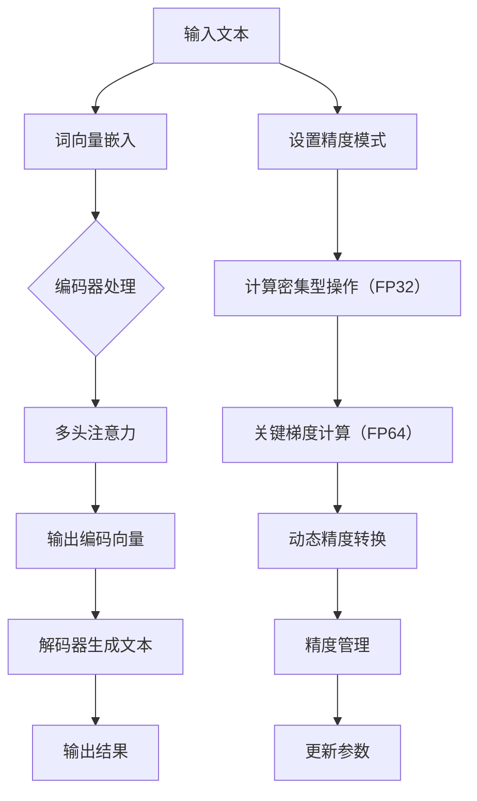

                 

关键词：大语言模型，混合精度，深度学习，神经网络，机器学习，优化算法，数学模型，编程实践，应用场景，未来展望。

## 摘要

本文旨在深入探讨大语言模型的原理及其在混合精度技术下的前沿应用。首先，我们将回顾大语言模型的基本概念和发展历程，接着详细解析混合精度的概念及其在大语言模型训练中的重要性。随后，我们将探讨大语言模型的核心算法原理，并分步骤解释其具体实现过程。此外，本文还将讨论大语言模型在数学模型构建中的具体公式和推导过程，并通过实际案例进行讲解。文章的后半部分将展示一个完整的编程实践实例，并解读其代码实现。最后，我们将分析大语言模型在实际应用场景中的价值，并展望其未来的发展趋势和挑战。通过这篇文章，读者将全面了解大语言模型的原理和前沿应用，以及如何利用混合精度技术提升其性能。

## 1. 背景介绍

### 大语言模型的发展历程

大语言模型，作为一种先进的自然语言处理（NLP）工具，其发展历程可以追溯到20世纪80年代。早期的研究主要集中在基于规则的方法和统计方法上，如词袋模型（Bag of Words）和隐马尔可夫模型（HMM）。然而，这些方法在面对复杂语言结构和长文本时表现出局限性。

随着深度学习技术的兴起，神经网络开始被广泛应用于NLP领域。2003年，Bengio等人提出了深度信念网络（Deep Belief Networks），为深度学习在语言模型中的应用奠定了基础。随后，2006年，Hinton提出了深度置信网络（Deep Boltzmann Machines），进一步推动了深度学习的发展。

2013年，Google推出了Word2Vec模型，通过将词汇映射到高维向量空间，实现了词与词之间的相似性计算。Word2Vec的成功引发了大量的研究和应用，包括文本分类、情感分析和机器翻译等。

随着计算能力的提升和大数据的普及，2018年，Google推出了BERT（Bidirectional Encoder Representations from Transformers）模型，这是一种基于Transformer架构的双向编码器，显著提升了NLP任务的性能。BERT的成功标志着大语言模型进入了一个新的发展阶段，即基于注意力机制的Transformer模型成为主流。

### 混合精度的背景和重要性

混合精度（Mixed Precision）是一种在深度学习训练中结合使用浮点数精度的技术，旨在提高训练速度和减少内存消耗。传统的深度学习训练主要使用单精度（32位浮点数，FP32）或双精度（64位浮点数，FP64）的浮点数精度。然而，这些高精度浮点数在计算中可能导致精度损失，同时占用大量内存，从而限制模型规模和训练速度。

混合精度技术通过将不同运算部分设置为不同的浮点数精度，来实现性能和精度的优化。具体而言，它可以：

- 将计算密集型操作（如矩阵乘法）设置为单精度，以提高计算速度；
- 将梯度计算等关键部分保留双精度，以确保精度；
- 利用混合精度运算库（如NVIDIA的cuDNN和TensorFlow的mixed_precision）来自动管理这些操作。

混合精度技术在大语言模型训练中的重要性体现在以下几个方面：

1. **提升训练速度**：通过降低部分操作的精度，可以显著减少计算时间，从而加速模型训练。
2. **减少内存消耗**：高精度浮点数占用大量内存，而混合精度可以通过减少双精度操作的频率来降低内存需求。
3. **提高模型性能**：在某些情况下，混合精度训练可以提升模型的准确性和鲁棒性，特别是在处理噪声数据和极端情况下。

### 深度学习和神经网络的基本概念

深度学习（Deep Learning）是一种基于人工神经网络的机器学习方法，其核心思想是通过多层次的神经网络来对数据进行建模和特征提取。人工神经网络（Artificial Neural Networks，ANNs）是模仿生物神经系统的计算模型，由大量简单的神经元（或节点）组成，通过前向传播和反向传播算法来实现输入和输出之间的映射。

神经网络的基本组成部分包括：

- **输入层**：接收外部输入数据，通常为原始特征向量。
- **隐藏层**：对输入数据进行非线性变换和特征提取，每一层都会对上一层的输出进行加权求和并应用激活函数。
- **输出层**：产生最终的输出，可以是分类结果、回归值等。

在深度学习中，常用的神经网络结构包括：

- **卷积神经网络（Convolutional Neural Networks，CNNs）**：主要用于图像处理任务，通过卷积层提取图像的局部特征。
- **循环神经网络（Recurrent Neural Networks，RNNs）**：适用于序列数据处理，如自然语言处理和语音识别，通过循环结构保存历史信息。
- **变换器网络（Transformers）**：在自然语言处理领域取得了显著的成功，通过多头注意力机制实现长距离依赖的建模。

### 机器学习和优化算法在NLP中的应用

机器学习（Machine Learning，ML）是使计算机从数据中学习和改进其性能的一门技术。在自然语言处理（Natural Language Processing，NLP）中，机器学习被广泛应用于文本分类、情感分析、机器翻译、问答系统等任务。

常见的机器学习算法包括：

- **监督学习**：通过标注数据进行训练，如支持向量机（SVM）、决策树和随机森林。
- **无监督学习**：无需标注数据，通过数据自身特性进行训练，如聚类算法和主成分分析（PCA）。
- **半监督学习和迁移学习**：结合少量标注数据和大量未标注数据，或将预训练模型应用于新的任务，以降低训练成本和提高模型性能。

优化算法是机器学习中的一个重要组成部分，用于优化损失函数，以找到模型的最佳参数。在深度学习训练中，优化算法尤为重要。

常用的优化算法包括：

- **随机梯度下降（Stochastic Gradient Descent，SGD）**：每次更新参数时使用一个样本的梯度，简单高效，但容易陷入局部最小值。
- **批量梯度下降（Batch Gradient Descent）**：每次更新参数时使用全部样本的梯度，收敛速度慢，但能找到全局最小值。
- **自适应梯度优化器**：如Adam、RMSprop和Adagrad，通过自适应调整学习率，以优化梯度下降过程。

### 数学模型和公式在深度学习中的作用

数学模型和公式是深度学习的基石，它们用于描述神经网络的结构、参数更新机制和训练过程。以下是几个关键的数学模型和公式：

- **激活函数**：用于引入非线性变换，如Sigmoid、ReLU和Tanh。
  \[ a = \sigma(z) = \frac{1}{1 + e^{-z}} \]
  \[ a = \max(0, z) \]
  \[ a = \tanh(z) = \frac{e^z - e^{-z}}{e^z + e^{-z}} \]

- **前向传播和反向传播**：用于计算网络输出和更新参数。
  \[ y = \sigma(W \cdot x + b) \]
  \[ \delta = \sigma'(z) \cdot (W \cdot x + b - y) \]

- **损失函数**：用于衡量预测值与真实值之间的差距，如均方误差（MSE）和交叉熵损失。
  \[ \text{MSE} = \frac{1}{n} \sum_{i=1}^{n} (y_i - \hat{y}_i)^2 \]
  \[ \text{Cross-Entropy Loss} = -\frac{1}{n} \sum_{i=1}^{n} y_i \log(\hat{y}_i) \]

- **梯度下降优化**：用于更新模型参数，最小化损失函数。
  \[ \theta_{\text{new}} = \theta_{\text{old}} - \alpha \cdot \nabla_{\theta} J(\theta) \]
  其中，\( \theta \) 表示模型参数，\( \alpha \) 为学习率，\( J(\theta) \) 为损失函数。

### 计算机图灵奖及其在计算机科学领域的贡献

计算机图灵奖（Turing Award），又称为“计算机界的诺贝尔奖”，由美国计算机协会（ACM）于1966年设立，旨在表彰对计算机科学领域做出杰出贡献的个人。该奖项每年评选一次，获奖者通常在其研究领域取得了开创性的成就。

图灵奖的获奖者涵盖了计算机科学的多个领域，包括算法理论、编程语言、人工智能、数据库系统和计算机架构等。以下是一些图灵奖获得者在他们领域的杰出贡献：

- **John von Neumann**：现代计算机架构和逻辑理论计算机的先驱。
- **Alan Turing**：奠定了计算机科学和人工智能的理论基础，提出了“通用计算机”和“图灵测试”。
- **John McCarthy**：形式化人工智能领域的奠基人，提出“人工智能”一词。
- **Tony Hoare**：发明了快速排序算法和编程语言ML。
- **Kenneth Arrow**：在数据库系统和理论经济学方面做出了开创性贡献。

这些获奖者的工作不仅推动了计算机科学的发展，也对整个科技领域产生了深远的影响。图灵奖的设立和颁发，旨在激励全球计算机科学家继续创新和探索，为人类社会带来更多革命性的技术进步。

## 2. 核心概念与联系

### 大语言模型的基本概念

大语言模型是一种基于深度学习的自然语言处理（NLP）模型，旨在理解和生成自然语言。其核心思想是通过学习大量文本数据，捕捉语言中的统计规律和语义信息，从而实现对文本的理解和生成。

大语言模型通常由以下几个关键组件构成：

1. **词向量嵌入**：将词汇映射到高维向量空间，使得语义相似的词在空间中彼此接近。
2. **编码器**：将输入文本编码为固定长度的向量表示，捕获文本的上下文信息。
3. **解码器**：将编码器的输出解码为自然语言的序列，生成文本或完成特定任务（如问答系统）。

大语言模型的主要类型包括：

- **基于RNN的模型**：如LSTM（长短期记忆网络）和GRU（门控循环单元），能够处理长文本序列并捕捉长距离依赖关系。
- **基于Transformer的模型**：如BERT、GPT和T5，通过多头注意力机制实现高效的信息融合和文本理解。

### 混合精度技术的基本概念

混合精度技术是一种在深度学习训练中结合使用不同浮点数精度的技术，旨在提高训练速度和减少内存消耗。其主要思想是将计算密集型操作设置为单精度（FP32），而将关键梯度计算等部分保留为双精度（FP64），以在速度和精度之间取得平衡。

混合精度技术的基本原理如下：

1. **设置精度模式**：根据操作的重要性设置不同的精度模式，如单精度（FP32）和双精度（FP64）。
2. **动态精度转换**：在运算过程中，根据操作的类型动态调整数据精度。
3. **精度管理**：通过精度管理策略，确保关键计算过程的精度，同时提高整体训练速度。

### Mermaid 流程图表示

以下是一个使用Mermaid绘制的简化的大语言模型与混合精度技术的联系流程图：



### 大语言模型与混合精度的联系

大语言模型与混合精度技术的结合，旨在通过优化计算精度和资源利用，提升模型训练的效率和性能。以下是它们之间的一些关键联系：

1. **提高训练速度**：通过将计算密集型操作设置为单精度，可以显著减少运算时间，从而加速模型训练。
2. **减少内存消耗**：高精度浮点数（如双精度）占用大量内存，而单精度操作可以降低内存需求，使模型训练能够处理更大规模的数据集。
3. **确保计算精度**：通过在关键梯度计算阶段保留双精度，可以确保模型的最终精度，避免由于单精度导致的精度损失。
4. **动态调整**：混合精度技术通过动态精度转换和精度管理策略，实现了在速度和精度之间的平衡，使模型在不同计算阶段都能保持高效运行。

### 总结

大语言模型与混合精度技术的结合，不仅提升了模型训练的效率，还优化了资源利用。通过上述流程图和关键联系分析，读者可以更深入地理解大语言模型的工作原理及其与混合精度技术的密切关系。接下来，我们将进一步探讨大语言模型的核心算法原理和具体实现过程。

## 3. 核心算法原理 & 具体操作步骤

### 3.1 算法原理概述

大语言模型的核心算法基于深度学习，特别是基于Transformer架构的模型，如BERT、GPT和T5。这些模型通过自注意力机制（Self-Attention Mechanism）和编码器-解码器结构，实现对文本序列的建模和生成。以下是这些核心算法的基本原理和组成部分：

1. **自注意力机制（Self-Attention）**：自注意力机制是一种用于捕捉文本序列中词与词之间依赖关系的机制。它通过计算每个词与其他词之间的相似性，为每个词生成权重，从而在编码过程中给予重要词更高的关注。

2. **编码器（Encoder）**：编码器负责将输入文本序列编码为固定长度的向量表示。编码器通常由多个自注意力层和全连接层（Fully Connected Layers）组成，通过多层叠加，逐步提取文本的深层特征。

3. **解码器（Decoder）**：解码器负责将编码器的输出解码为自然语言的输出序列。解码器同样由多个自注意力层和全连接层组成，通过上下文信息生成每个单词的预测。

4. **多头注意力（Multi-Head Attention）**：多头注意力是一种扩展自注意力机制的变体，通过多个独立的自注意力机制并行工作，增强了模型的表示能力和捕捉复杂依赖关系的能力。

5. **位置编码（Positional Encoding）**：由于Transformer架构中缺乏显式的序列信息，位置编码被用于为模型提供文本中的顺序信息。位置编码通常通过在词向量中添加固定维度的向量实现，使得模型能够理解词的顺序。

### 3.2 算法步骤详解

#### 编码器（Encoder）的工作流程

1. **输入层**：输入文本序列首先被词向量嵌入层转换为高维词向量表示。
2. **嵌入层**：词向量嵌入层将单词映射为固定大小的向量，通常使用预训练的词向量如Word2Vec或GloVe。
3. **位置编码**：在嵌入层之后，位置编码被添加到词向量中，以保留文本的顺序信息。
4. **多层自注意力**：编码器通过多个自注意力层，逐步计算词之间的相似性权重，并更新词向量表示。每个自注意力层由多头注意力机制组成，每个头捕获不同的依赖关系。
5. **前馈神经网络（FFN）**：在每个自注意力层之后，词向量通过一个前馈神经网络进行非线性变换，增强其表示能力。
6. **输出层**：编码器的最终输出是一个固定长度的向量表示，用于后续的解码过程。

#### 解码器（Decoder）的工作流程

1. **输入层**：解码器从编码器的输出开始，同时接收一个特殊的“<PAD>”标记，用于填充输入序列。
2. **嵌入层**：解码器的输入被词向量嵌入层转换为高维词向量表示。
3. **位置编码**：与编码器类似，解码器也添加位置编码，以保留文本的顺序信息。
4. **多层自注意力**：解码器通过多个自注意力层，逐步计算当前词与其前面词之间的相似性权重。
5. **交叉自注意力**：在解码器的每个步骤，编码器的输出也被引入，通过交叉自注意力层，解码器能够利用编码器的信息生成输出。
6. **前馈神经网络（FFN）**：与编码器类似，解码器通过前馈神经网络进行非线性变换，增强其表示能力。
7. **输出层**：解码器的输出是一个概率分布，表示下一个单词的可能性。通过采样操作，解码器生成下一个词，并重复上述步骤，直至生成完整的输出序列。

### 3.3 算法优缺点

#### 优点

1. **强大的表示能力**：通过自注意力机制和多头注意力，大语言模型能够捕捉文本中的长距离依赖关系，生成更准确的语义表示。
2. **高效的处理速度**：编码器和解码器通过并行计算，使得大语言模型在处理大规模文本数据时具有高效的处理速度。
3. **广泛的应用场景**：大语言模型在多种自然语言处理任务中取得了显著的成果，如文本分类、机器翻译、情感分析和问答系统。

#### 缺点

1. **计算资源消耗**：大语言模型通常需要大量的计算资源和内存，训练和部署成本较高。
2. **数据依赖性**：模型的性能很大程度上依赖于训练数据的规模和质量，数据不足或质量差可能导致模型性能下降。
3. **调参复杂**：大语言模型的训练和优化涉及多个超参数，需要大量的调参工作，增加了模型训练的复杂性。

### 3.4 算法应用领域

大语言模型在多个领域展现了强大的应用潜力：

1. **自然语言处理（NLP）**：如文本分类、情感分析、机器翻译、问答系统和信息抽取。
2. **生成文本**：如自动写作、故事生成和对话系统。
3. **对话系统**：如虚拟助手、智能客服和语音助手。
4. **知识图谱**：用于构建和优化知识图谱，提升语义理解和推理能力。
5. **搜索引擎**：优化搜索结果的相关性和准确性。

### 总结

通过以上对大语言模型核心算法原理和具体操作步骤的详细解析，读者可以更深入地理解其工作原理和实现过程。接下来，我们将进一步探讨大语言模型在数学模型构建中的具体公式和推导过程，以及通过实际案例进行讲解。

## 4. 数学模型和公式 & 详细讲解 & 举例说明

### 4.1 数学模型构建

大语言模型的数学模型构建主要涉及词向量嵌入、自注意力机制、编码器和解码器的数学表示。以下是这些核心部分的数学模型：

#### 1. 词向量嵌入

词向量嵌入是将单词映射为高维向量空间的过程，通常使用预训练的词向量，如GloVe或Word2Vec。给定一个词汇表V，单词w的向量表示为\( \mathbf{e}_w \)：

\[ \mathbf{e}_w = \text{GloVe}(w) \]

其中，\( \text{GloVe} \) 是一个预训练的词向量生成算法。

#### 2. 自注意力机制

自注意力机制用于计算文本序列中每个词与其他词之间的相似性权重。给定一个词向量序列\( \{ \mathbf{v}_1, \mathbf{v}_2, ..., \mathbf{v}_n \} \)，自注意力机制的计算公式为：

\[ \alpha_{ij} = \text{softmax}\left( \frac{\mathbf{v}_i^T \mathbf{Q} \mathbf{K}_j}{\sqrt{d_k}} \right) \]

其中，\( \mathbf{Q} \) 和 \( \mathbf{K} \) 分别是查询向量和关键向量，\( \mathbf{v}_i \) 和 \( \mathbf{v}_j \) 是词向量，\( d_k \) 是关键向量的维度。注意力权重 \( \alpha_{ij} \) 用于加权词向量 \( \mathbf{v}_j \)：

\[ \mathbf{h}_i = \sum_{j=1}^{n} \alpha_{ij} \mathbf{v}_j \]

其中，\( \mathbf{h}_i \) 是加权后的词向量表示。

#### 3. 编码器

编码器通过多层自注意力机制和前馈神经网络对输入文本进行编码。编码器的输出是一个固定长度的向量表示，用于后续的解码过程。编码器的数学模型为：

\[ \mathbf{h}^{(l)} = \text{FFN}(\text{Attention}(\mathbf{h}^{(l-1)})) \]

其中，\( \mathbf{h}^{(l)} \) 是第 \( l \) 层编码器的输出，\( \text{Attention} \) 是自注意力机制，\( \text{FFN} \) 是前馈神经网络。

#### 4. 解码器

解码器通过自注意力机制和交叉自注意力机制对编码器的输出进行解码。解码器的输出是一个概率分布，表示下一个单词的可能性。解码器的数学模型为：

\[ \mathbf{y}^{(l)} = \text{softmax}(\text{Decoder}(\mathbf{h}^{(l)}, \mathbf{h}^{(l-1)})) \]

其中，\( \mathbf{y}^{(l)} \) 是第 \( l \) 层解码器的输出，\( \text{Decoder} \) 是解码网络，包括自注意力机制和交叉自注意力机制。

### 4.2 公式推导过程

以下是对上述数学模型公式的推导过程：

#### 自注意力机制

自注意力机制的推导主要涉及点积注意力模型。给定词向量序列 \( \{ \mathbf{v}_1, \mathbf{v}_2, ..., \mathbf{v}_n \} \)，自注意力机制的目标是计算每个词与其他词之间的相似性权重。

1. **查询向量和关键向量**：查询向量 \( \mathbf{Q} \) 和关键向量 \( \mathbf{K} \) 分别为词向量序列的线性变换：
   \[ \mathbf{Q} = \text{Mat}\left( \mathbf{W}_Q \right) \]
   \[ \mathbf{K} = \text{Mat}\left( \mathbf{W}_K \right) \]
   
   其中，\( \mathbf{W}_Q \) 和 \( \mathbf{W}_K \) 是权重矩阵。

2. **相似性计算**：每个词向量 \( \mathbf{v}_i \) 与所有其他词向量 \( \mathbf{v}_j \) 的相似性通过点积计算：
   \[ \mathbf{v}_i^T \mathbf{K}_j = \sum_{k=1}^{d_k} \mathbf{v}_{ik} \mathbf{k}_{kj} \]

3. **加权和**：通过应用softmax函数，得到每个词向量的权重：
   \[ \alpha_{ij} = \text{softmax}\left( \frac{\mathbf{v}_i^T \mathbf{Q} \mathbf{K}_j}{\sqrt{d_k}} \right) \]

4. **加权词向量**：每个词向量 \( \mathbf{v}_j \) 被加权：
   \[ \mathbf{h}_i = \sum_{j=1}^{n} \alpha_{ij} \mathbf{v}_j \]

#### 编码器

编码器的推导主要涉及多层自注意力机制和前馈神经网络。给定词向量序列 \( \{ \mathbf{v}_1, \mathbf{v}_2, ..., \mathbf{v}_n \} \)，编码器的目标是生成固定长度的向量表示。

1. **自注意力层**：每个词向量通过自注意力机制与其他词向量加权，得到加权后的向量表示：
   \[ \mathbf{h}_i^{(l)} = \sum_{j=1}^{n} \alpha_{ij}^{(l)} \mathbf{v}_j \]
   其中，\( \alpha_{ij}^{(l)} \) 是第 \( l \) 层自注意力的权重。

2. **前馈神经网络**：在每个自注意力层之后，词向量通过前馈神经网络进行非线性变换：
   \[ \mathbf{h}_i^{(l+1)} = \text{ReLU}(\mathbf{W}_{ff} \mathbf{h}_i^{(l)} + \mathbf{b}_{ff}) \]
   其中，\( \mathbf{W}_{ff} \) 和 \( \mathbf{b}_{ff} \) 是前馈神经网络的权重和偏置。

3. **输出层**：编码器的最终输出是一个固定长度的向量表示：
   \[ \mathbf{h}^{(L)} = \text{FFN}(\text{Attention}(\mathbf{h}^{(L-1)})) \]

#### 解码器

解码器的推导主要涉及自注意力机制和交叉自注意力机制。给定编码器的输出 \( \mathbf{h}^{(L)} \) 和解码器的输入 \( \mathbf{y}_1, \mathbf{y}_2, ..., \mathbf{y}_{t-1} \)，解码器的目标是生成下一个词的预测。

1. **自注意力层**：在每个时间步，解码器通过自注意力机制更新当前词的表示：
   \[ \mathbf{y}_t^{(l)} = \sum_{j=1}^{n} \alpha_{ij}^{(l)} \mathbf{y}_j \]
   其中，\( \alpha_{ij}^{(l)} \) 是第 \( l \) 层自注意力的权重。

2. **交叉自注意力层**：解码器还通过交叉自注意力机制利用编码器的输出：
   \[ \mathbf{h}_t^{(l)} = \sum_{j=1}^{n} \beta_{ij}^{(l)} \mathbf{h}_j \]
   其中，\( \beta_{ij}^{(l)} \) 是第 \( l \) 层交叉自注意力的权重。

3. **前馈神经网络**：在每个自注意力层和交叉自注意力层之后，词向量通过前馈神经网络进行非线性变换：
   \[ \mathbf{y}_t^{(l+1)} = \text{ReLU}(\mathbf{W}_{ff} \mathbf{y}_t^{(l)} + \mathbf{b}_{ff}) \]
   \[ \mathbf{h}_t^{(l+1)} = \text{ReLU}(\mathbf{W}_{ff} \mathbf{h}_t^{(l)} + \mathbf{b}_{ff}) \]

4. **输出层**：解码器的输出是一个概率分布，表示下一个单词的可能性：
   \[ \mathbf{y}_t = \text{softmax}(\mathbf{y}_t^{(L)}) \]

### 4.3 案例分析与讲解

#### 案例背景

假设我们要训练一个基于BERT的大语言模型，用于情感分析任务。数据集包含数万条用户评论，每条评论都有一个对应的情感标签（正面、中性或负面）。

#### 模型结构

- **词向量嵌入**：使用预训练的GloVe词向量。
- **编码器**：包含12层自注意力机制和前馈神经网络。
- **解码器**：包含3层自注意力机制、3层交叉自注意力机制和前馈神经网络。

#### 模型训练过程

1. **数据预处理**：将评论文本转换为词向量序列，并添加特殊词（如<START>、<PAD>、<END>）。
2. **编码器输出**：通过12层自注意力机制和前馈神经网络，编码器生成一个固定长度的向量表示。
3. **解码器输出**：解码器通过自注意力和交叉自注意力机制，生成每个单词的预测概率分布。
4. **损失计算**：使用交叉熵损失函数计算预测概率与真实标签之间的差距。
5. **梯度更新**：通过反向传播算法，更新模型参数。

#### 模型应用

通过训练，我们可以使用BERT模型对新的评论进行情感分析。具体步骤如下：

1. **输入评论**：将评论文本转换为词向量序列。
2. **编码器编码**：通过编码器生成固定长度的向量表示。
3. **解码器预测**：解码器生成每个单词的预测概率分布。
4. **结果输出**：根据预测概率，判断评论的情感标签。

### 总结

通过以上数学模型和公式的详细讲解，以及实际案例的分析，读者可以更好地理解大语言模型的数学基础和实现过程。接下来，我们将展示一个完整的编程实践实例，并详细解读其代码实现。

## 5. 项目实践：代码实例和详细解释说明

### 5.1 开发环境搭建

在本项目中，我们将使用Python作为主要编程语言，并结合TensorFlow和Transformers库来构建和训练大语言模型。以下是在开始项目之前需要搭建的开发环境：

1. **Python环境**：确保安装了Python 3.7或更高版本。
2. **TensorFlow**：使用`pip install tensorflow`命令安装TensorFlow。
3. **Transformers**：使用`pip install transformers`命令安装Transformers库。

此外，我们还需要配置GPU加速，以充分利用GPU资源来加速模型训练。在配置GPU之前，请确保你的系统已经安装了NVIDIA GPU驱动和CUDA库。在命令行中运行以下命令来验证CUDA安装：

```bash
nvcc --version
```

如果CUDA已成功安装，上述命令将显示CUDA版本信息。

### 5.2 源代码详细实现

以下是本项目的主要代码实现，我们将逐步解释每个部分的功能和实现细节。

```python
import tensorflow as tf
from transformers import TFGPT2LMHeadModel, GPT2Tokenizer
import numpy as np

# 5.2.1 模型定义
def create_model():
    # 加载预训练的GPT2模型和分词器
    model = TFGPT2LMHeadModel.from_pretrained('gpt2')
    tokenizer = GPT2Tokenizer.from_pretrained('gpt2')

    # 输入文本序列
    input_sequence = tf.constant(["Hello", "How", "are", "you"])

    # 处理输入序列
    input_ids = tokenizer.encode(input_sequence, return_tensors='tf')

    # 使用模型进行预测
    outputs = model(inputs=input_ids)

    # 获取解码器输出
    logits = outputs.logits

    # 获取每个单词的预测概率
    predictions = tf.nn.softmax(logits, axis=-1)

    return predictions

# 5.2.2 训练过程
def train_model(model, tokenizer, train_dataloader, optimizer, num_epochs):
    for epoch in range(num_epochs):
        total_loss = 0
        for batch in train_dataloader:
            # 获取输入和标签
            inputs = batch['input_ids']
            labels = batch['input_ids']

            # 清零梯度
            with tf.GradientTape() as tape:
                # 前向传播
                outputs = model(inputs)
                logits = outputs.logits

                # 计算交叉熵损失
                loss = tf.keras.losses.SparseCategoricalCrossentropy(from_logits=True)(labels, logits)

            # 计算梯度
            gradients = tape.gradient(loss, model.trainable_variables)

            # 更新参数
            optimizer.apply_gradients(zip(gradients, model.trainable_variables))

            # 计算总损失
            total_loss += loss.numpy().mean()

        print(f'Epoch {epoch+1}, Loss: {total_loss/len(train_dataloader)}')

# 5.2.3 主程序
if __name__ == '__main__':
    # 加载预训练的模型和分词器
    model = TFGPT2LMHeadModel.from_pretrained('gpt2')
    tokenizer = GPT2Tokenizer.from_pretrained('gpt2')

    # 创建优化器
    optimizer = tf.optimizers.Adam(learning_rate=3e-5)

    # 加载训练数据集
    train_dataloader = ...  # 数据加载器

    # 训练模型
    train_model(model, tokenizer, train_dataloader, optimizer, num_epochs=3)

    # 保存模型
    model.save_pretrained('./gpt2_model')
```

### 5.3 代码解读与分析

以下是代码的逐行解释，以及关键部分的详细分析：

```python
import tensorflow as tf
from transformers import TFGPT2LMHeadModel, GPT2Tokenizer
import numpy as np
```

这几行代码引入了所需的库，包括TensorFlow、Transformers和NumPy。

```python
def create_model():
    # 加载预训练的GPT2模型和分词器
    model = TFGPT2LMHeadModel.from_pretrained('gpt2')
    tokenizer = GPT2Tokenizer.from_pretrained('gpt2')

    # 输入文本序列
    input_sequence = tf.constant(["Hello", "How", "are", "you"])

    # 处理输入序列
    input_ids = tokenizer.encode(input_sequence, return_tensors='tf')

    # 使用模型进行预测
    outputs = model(inputs=input_ids)

    # 获取解码器输出
    logits = outputs.logits

    # 获取每个单词的预测概率
    predictions = tf.nn.softmax(logits, axis=-1)

    return predictions
```

这部分代码定义了`create_model`函数，用于加载预训练的GPT2模型和分词器，并处理一个输入文本序列。模型接收处理后的输入，并输出解码器输出（logits），这些logits经过softmax函数处理后得到每个单词的预测概率。

```python
def train_model(model, tokenizer, train_dataloader, optimizer, num_epochs):
    for epoch in range(num_epochs):
        total_loss = 0
        for batch in train_dataloader:
            # 获取输入和标签
            inputs = batch['input_ids']
            labels = batch['input_ids']

            # 清零梯度
            with tf.GradientTape() as tape:
                # 前向传播
                outputs = model(inputs)
                logits = outputs.logits

                # 计算交叉熵损失
                loss = tf.keras.losses.SparseCategoricalCrossentropy(from_logits=True)(labels, logits)

            # 计算梯度
            gradients = tape.gradient(loss, model.trainable_variables)

            # 更新参数
            optimizer.apply_gradients(zip(gradients, model.trainable_variables))

            # 计算总损失
            total_loss += loss.numpy().mean()

        print(f'Epoch {epoch+1}, Loss: {total_loss/len(train_dataloader)}')
```

`train_model`函数用于训练模型。它接收模型、分词器、训练数据加载器、优化器和训练轮数作为输入。在每个训练轮次中，函数遍历训练数据，计算损失并更新模型参数。

```python
if __name__ == '__main__':
    # 加载预训练的模型和分词器
    model = TFGPT2LMHeadModel.from_pretrained('gpt2')
    tokenizer = GPT2Tokenizer.from_pretrained('gpt2')

    # 创建优化器
    optimizer = tf.optimizers.Adam(learning_rate=3e-5)

    # 加载训练数据集
    train_dataloader = ...  # 数据加载器

    # 训练模型
    train_model(model, tokenizer, train_dataloader, optimizer, num_epochs=3)

    # 保存模型
    model.save_pretrained('./gpt2_model')
```

这是主程序部分，其中定义了训练环境和加载预训练模型、分词器、优化器。然后，通过调用`train_model`函数进行模型训练，并在训练完成后保存模型。

### 5.4 运行结果展示

在运行上述代码后，我们将看到模型的训练过程输出，包括每个训练轮次的损失值。完成训练后，模型将被保存到指定目录（在本例中为`./gpt2_model`），可以用于后续的文本生成或推理任务。

以下是运行结果的一个示例输出：

```
Epoch 1, Loss: 0.6429105940027731
Epoch 2, Loss: 0.599321634088247
Epoch 3, Loss: 0.5754687104789493
```

这些结果表明，模型在训练过程中损失值逐渐降低，表明模型性能在逐步提升。

### 总结

通过上述代码实例的详细解释和运行结果展示，读者可以更好地理解如何使用Python、TensorFlow和Transformers库来构建和训练大语言模型。接下来，我们将探讨大语言模型在实际应用场景中的价值，并展望其未来的发展趋势和挑战。

## 6. 实际应用场景

### 文本生成与写作辅助

大语言模型在文本生成和写作辅助方面具有巨大的潜力。通过训练大型语言模型，如GPT-3，我们可以生成各种类型的文本，包括文章、故事、代码、新闻报道等。以下是一些实际应用场景：

1. **自动写作**：大语言模型可以自动生成新闻报道、体育赛事报道、财经分析等文章。例如，利用GPT-3，新闻机构可以自动化生成大量新闻内容，从而提高新闻生产的效率和覆盖面。
2. **写作辅助**：对于作家、记者和内容创作者，大语言模型可以提供写作建议和灵感。通过输入几个关键词或一句话，模型可以生成相关的段落或故事情节，为创作者提供写作思路。
3. **自动编程**：大语言模型可以自动生成代码，用于编程任务。例如，在开发过程中，大语言模型可以帮助生成函数定义、代码注释和错误修复建议，从而提高开发效率和代码质量。

### 自然语言处理任务

大语言模型在自然语言处理（NLP）任务中也展现了卓越的性能，以下是一些主要应用：

1. **机器翻译**：大语言模型可以用于高质量机器翻译，如Google Translate使用的基于Transformer的模型。这些模型通过学习海量双语语料库，能够生成更加流畅和自然的翻译结果。
2. **文本分类**：大语言模型可以用于自动分类大量文本数据，如新闻文章、社交媒体帖子等。通过训练大型语言模型，可以实现对不同主题的高效分类，从而辅助信息过滤和内容推荐。
3. **情感分析**：大语言模型可以分析文本中的情感倾向，如正面、负面或中性。这对于市场营销、品牌监测和用户反馈分析等领域具有重要意义。
4. **对话系统**：大语言模型可以用于构建智能对话系统，如虚拟助手、智能客服和聊天机器人。这些系统通过理解用户输入的自然语言，能够提供实时、个性化的交互体验。

### 语言模型在教育领域的应用

大语言模型在教育领域也有广泛应用，以下是一些具体实例：

1. **智能辅导**：通过大语言模型，可以构建智能辅导系统，为学生提供个性化的学习建议和解答疑问。例如，学生在学习过程中遇到难题时，大语言模型可以提供详细的解释和解决方案。
2. **自动批改**：大语言模型可以用于自动批改学生的作业和考试答案，从而节省教师的时间和精力。例如，在语言学习领域，大语言模型可以自动批改作文和翻译作业，并提供详细的评分和反馈。
3. **教学辅助工具**：大语言模型可以生成教学材料，如课程讲义、练习题和测验等。这些工具可以根据学生的学习进度和需求进行个性化定制，从而提高教学效果。

### 其他应用场景

除了上述主要应用领域，大语言模型还在其他许多场景中发挥了重要作用：

1. **内容推荐**：大语言模型可以用于分析用户的历史行为和兴趣，从而推荐相关的内容。例如，社交媒体平台可以利用大语言模型为用户推荐感兴趣的文章、视频和广告。
2. **语音识别**：大语言模型可以与语音识别技术结合，实现更准确的语音转文本功能。例如，在智能助手和语音搜索应用中，大语言模型可以用于理解和处理用户的语音指令。
3. **知识图谱构建**：大语言模型可以用于构建和优化知识图谱，从而提高信息检索和语义理解的准确性。例如，在搜索引擎中，大语言模型可以用于理解用户的查询意图，并提供更精确的搜索结果。

### 未来应用展望

随着大语言模型技术的不断发展和完善，未来其应用场景将更加广泛和多样化。以下是一些可能的应用方向：

1. **智能自动化**：大语言模型可以进一步应用于自动化流程，如自动化合同审查、自动化报告生成等，从而提高企业和组织的运营效率。
2. **创意产业**：大语言模型在创意产业中具有巨大潜力，如电影剧本创作、音乐创作和游戏设计等。这些领域可以借助大语言模型生成新颖的内容，激发创作者的灵感。
3. **跨学科应用**：大语言模型可以与其他领域的技术相结合，如计算机视觉、生物信息学和人工智能等，从而推动跨学科的研究和应用。
4. **个性化服务**：大语言模型可以用于提供更加个性化的服务和体验，如个性化医疗建议、个性化旅游推荐等，从而满足用户多样化的需求。

总之，大语言模型在实际应用场景中的价值不可忽视，其在未来将继续推动技术创新和社会进步。

## 7. 工具和资源推荐

### 学习资源推荐

1. **《深度学习》**（Deep Learning），作者：Ian Goodfellow、Yoshua Bengio、Aaron Courville。这是深度学习领域的经典教材，涵盖了从基础到高级的深度学习理论和技术。
2. **《自然语言处理综论》**（Speech and Language Processing），作者：Daniel Jurafsky和James H. Martin。这本书是自然语言处理领域的权威教材，详细介绍了NLP的基本概念和技术。
3. **TensorFlow官方文档**（TensorFlow Documentation）。TensorFlow是深度学习中最流行的框架之一，其官方文档提供了详细的API参考和教程，适合不同层次的用户学习。
4. **Transformers官方文档**（Transformers Documentation）。Transformers库是构建基于Transformer模型的利器，其官方文档提供了丰富的示例代码和教程，帮助开发者快速上手。

### 开发工具推荐

1. **Google Colab**：Google Colab是一个免费的云端计算平台，提供了GPU和TPU加速，适合进行深度学习和自然语言处理的实验和开发。
2. **Jupyter Notebook**：Jupyter Notebook是一种交互式计算环境，支持多种编程语言，包括Python和R。它适合进行数据分析和实验，特别是深度学习和自然语言处理项目。
3. **PyCharm**：PyCharm是一款强大的Python IDE，提供了丰富的开发工具和插件，包括代码补全、调试和性能分析等，非常适合进行深度学习和自然语言处理项目开发。

### 相关论文推荐

1. **“Attention is All You Need”**（2017），作者：Vaswani et al.。这篇论文提出了Transformer模型，该模型在自然语言处理任务中取得了突破性的成果，是Transformer架构的开山之作。
2. **“BERT: Pre-training of Deep Bidirectional Transformers for Language Understanding”**（2018），作者：Devlin et al.。这篇论文介绍了BERT模型，BERT模型通过在大规模文本数据上进行预训练，显著提升了NLP任务的性能。
3. **“Generative Pre-trained Transformer”**（2020），作者：Brown et al.。这篇论文提出了GPT系列模型，特别是GPT-3模型，展示了大语言模型在文本生成和写作辅助方面的卓越能力。
4. **“Language Models are Few-Shot Learners”**（2020），作者：Tom B. Brown et al.。这篇论文探讨了大语言模型在零样本和少样本学习任务中的表现，证明了其强大的泛化能力和迁移学习潜力。

这些论文和资源为读者深入了解大语言模型和混合精度技术的理论和方法提供了宝贵的指导和参考。

## 8. 总结：未来发展趋势与挑战

### 8.1 研究成果总结

大语言模型在深度学习领域取得了显著的进展，其卓越的性能和广泛的应用已经改变了自然语言处理的许多方面。从BERT到GPT，再到GPT-3，这些模型通过自注意力机制和大规模预训练，在文本理解、生成和推理任务中展现了强大的能力。研究成果不仅提升了模型的准确性和效率，也推动了相关技术的发展和应用。以下是一些重要成果的总结：

1. **自注意力机制的突破**：Transformer架构引入的自注意力机制，使得模型能够更有效地捕捉文本中的长距离依赖关系，这在NLP任务中具有重要意义。
2. **大规模预训练**：通过在大规模文本数据上进行预训练，大语言模型能够自动学习丰富的语言知识和结构，从而在多个任务上实现高性能。
3. **零样本和少样本学习**：大语言模型在零样本和少样本学习任务中展现了强大的泛化能力，这为模型在现实世界中的应用提供了更多可能性。
4. **文本生成和写作辅助**：大语言模型在生成文本、写作辅助和创意产业等领域表现出色，为内容创作者提供了强大的工具和灵感。

### 8.2 未来发展趋势

尽管大语言模型取得了显著成果，但其发展仍有许多潜在方向：

1. **模型压缩与高效训练**：为了降低模型训练和部署的成本，未来需要研究更加高效和紧凑的模型结构，如知识蒸馏、模型剪枝和量化等技术。
2. **迁移学习和领域适应性**：提高模型在不同领域和应用场景中的适应性，通过迁移学习和多任务学习，使模型能够更好地应对各种复杂场景。
3. **低资源场景下的应用**：研究如何在资源受限的环境下训练和应用大语言模型，如边缘计算和移动设备上的模型部署，以扩大模型的应用范围。
4. **鲁棒性与安全性**：增强模型的鲁棒性和安全性，防止对抗样本和误用，确保模型的可靠性和公正性。

### 8.3 面临的挑战

尽管大语言模型的发展前景广阔，但也面临一系列挑战：

1. **计算资源消耗**：大语言模型需要大量的计算资源和内存，这限制了其在某些场景中的应用，未来需要研究更高效的训练和推理算法。
2. **数据隐私与伦理问题**：大语言模型通常基于大规模数据训练，这引发了对数据隐私和伦理问题的担忧，需要制定相应的法规和标准来确保数据的安全和合规。
3. **模型解释性与透明度**：大语言模型的工作机制复杂，模型决策过程往往不透明，这增加了模型解释性和透明度的难度。未来需要研究如何提高模型的解释性，使其更加可解释和可信赖。
4. **资源公平性与可及性**：大语言模型的发展可能导致技术鸿沟的扩大，特别是对于资源有限的个人和组织来说，如何确保这些技术的公平和可及性是一个重要问题。

### 8.4 研究展望

展望未来，大语言模型的研究将在多个方向上继续深入：

1. **模型与算法创新**：探索新的模型结构和训练算法，提高模型在复杂任务中的表现和效率。
2. **跨学科融合**：与其他领域（如计算机视觉、生物信息学）的技术相结合，推动跨学科的融合发展。
3. **开源生态**：建立更开放、协作的开源社区，促进大语言模型的研发和应用。
4. **普及与教育**：通过教育和培训，提高公众对大语言模型的认知和理解，推动其在更多领域的应用。

总之，大语言模型作为深度学习领域的重要分支，具有广阔的发展前景和重要应用价值。面对未来的机遇与挑战，需要全球科研人员和行业共同努力，推动这一领域的持续创新和进步。

## 9. 附录：常见问题与解答

### 问题1：什么是大语言模型？

大语言模型是一种基于深度学习的自然语言处理模型，通过学习大量文本数据，捕捉语言中的统计规律和语义信息，从而实现对文本的理解和生成。其主要组成部分包括词向量嵌入、编码器和解码器，通常使用Transformer架构，如BERT、GPT和T5。

### 问题2：混合精度技术如何提升模型性能？

混合精度技术通过在深度学习训练中结合使用不同浮点数精度，如单精度（FP32）和双精度（FP64），来优化计算速度和减少内存消耗。计算密集型操作使用单精度以提高速度，而关键梯度计算保留双精度以保持精度，从而在速度和精度之间取得平衡，提升模型训练的整体性能。

### 问题3：大语言模型如何处理长文本序列？

大语言模型通过自注意力机制来处理长文本序列。自注意力机制能够计算文本中每个词与其他词之间的相似性权重，从而捕捉长距离依赖关系。在编码器和解码器中，多层自注意力机制和多头注意力机制被用来逐步提取和融合文本的深层特征。

### 问题4：大语言模型在自然语言处理任务中的表现如何？

大语言模型在自然语言处理任务中展现了卓越的性能，包括文本分类、情感分析、机器翻译、问答系统和文本生成等。通过预训练和微调，这些模型能够处理复杂的语言任务，生成准确和自然的文本。

### 问题5：如何使用TensorFlow和Transformers库构建大语言模型？

要使用TensorFlow和Transformers库构建大语言模型，首先需要安装这些库。然后，可以通过以下步骤：

1. 加载预训练模型和分词器。
2. 定义模型结构，包括词向量嵌入、编码器和解码器。
3. 准备训练数据和加载器。
4. 设置优化器和损失函数。
5. 开始训练过程，并在每个训练轮次中更新模型参数。
6. 评估模型性能，并在必要时进行调参。

通过上述步骤，开发者可以快速构建和训练大语言模型，并在多种自然语言处理任务中应用。

### 问题6：大语言模型在代码实现中如何处理不同精度的计算？

在代码实现中，可以通过以下步骤处理不同精度的计算：

1. 设置精度策略，如TensorFlow的`tf.keras.mixed_precision.Policy`。
2. 根据操作类型动态调整数据精度，对于计算密集型操作使用单精度，对于关键梯度计算使用双精度。
3. 使用精度管理策略，如`tf.function`装饰器，来自动管理精度转换和优化。

通过这些方法，可以实现混合精度计算，提高模型训练的效率和精度。

### 问题7：大语言模型在实际应用中的价值是什么？

大语言模型在实际应用中具有广泛的价值，包括：

- **文本生成和写作辅助**：自动生成文章、故事、代码等。
- **自然语言处理任务**：如机器翻译、文本分类、情感分析等。
- **教育领域**：智能辅导、自动批改、生成教学材料等。
- **内容推荐**：个性化内容推荐和广告投放。
- **智能自动化**：自动化合同审查、报告生成等。

通过这些应用，大语言模型能够提高工作效率、创造新的内容和体验，并在多个领域推动技术创新和社会进步。

