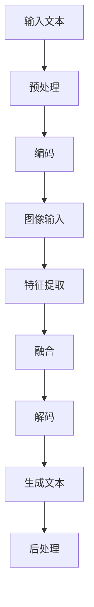
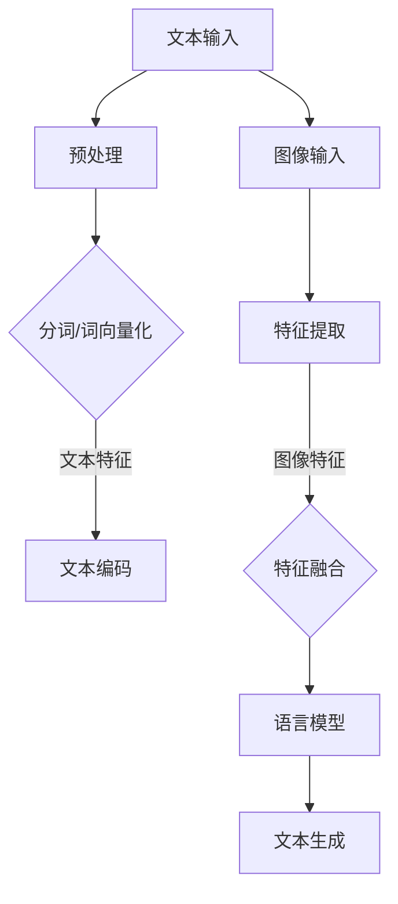

                 

关键词：大语言模型、视觉增强语言建模、AI、深度学习、神经网络、计算机视觉、自然语言处理

## 摘要

本文旨在探讨大语言模型的原理与前沿技术，特别是视觉增强语言建模（Visual Enhance Language Modeling, VELM）的研究与应用。文章首先介绍大语言模型的基本概念和背景，然后深入解析视觉增强语言建模的核心原理，包括其数学模型和具体实现步骤。随后，文章将通过实际项目实践展示如何应用大语言模型进行视觉增强语言建模。最后，文章将探讨这一领域的前沿应用场景、未来发展趋势以及面临的挑战。

## 1. 背景介绍

### 大语言模型

大语言模型（Large Language Model）是近年来自然语言处理（Natural Language Processing, NLP）领域的重要突破。这些模型通过对海量文本数据进行训练，能够理解和生成人类语言，极大地提升了机器在文本处理、问答系统、机器翻译等方面的能力。大语言模型的核心是深度神经网络（Deep Neural Network, DNN），特别是在最近几年，变分自编码器（Variational Autoencoder, VAE）和生成对抗网络（Generative Adversarial Networks, GAN）等生成模型的应用，使得大语言模型在生成文本和数据增强方面表现出色。

### 视觉增强语言建模

视觉增强语言建模（Visual Enhance Language Modeling, VELM）是一种结合计算机视觉与自然语言处理的技术。它旨在通过视觉信息来提升语言模型的性能，从而更准确地理解和生成文本。视觉增强语言建模的核心思想是将视觉信息与语言信息进行深度融合，使得模型能够更好地理解图像中的场景、物体和语义。

## 2. 核心概念与联系

为了更好地理解视觉增强语言建模，我们需要先了解几个核心概念：自然语言处理、计算机视觉和深度学习。

### 自然语言处理

自然语言处理（NLP）是人工智能领域的一个重要分支，旨在使计算机能够理解、处理和生成人类语言。NLP技术包括文本分类、情感分析、机器翻译、问答系统等。近年来，随着深度学习技术的发展，NLP取得了显著的进展。

### 计算机视觉

计算机视觉（Computer Vision）是人工智能的另一个重要分支，旨在使计算机能够从图像或视频中提取信息。计算机视觉技术包括图像分类、目标检测、图像分割等。深度学习在计算机视觉领域也取得了巨大的成功，如卷积神经网络（Convolutional Neural Network, CNN）在图像分类和目标检测方面的应用。

### 深度学习

深度学习（Deep Learning）是机器学习的一个分支，其核心是神经网络，特别是深度神经网络（DNN）。深度学习通过多层次的神经网络结构，自动从数据中学习特征，具有强大的特征提取和表示能力。

### Mermaid 流程图

以下是一个描述视觉增强语言建模流程的 Mermaid 流程图：



在这个流程图中，输入文本和图像分别经过预处理和特征提取，然后进行融合，最终生成文本。

## 3. 核心算法原理 & 具体操作步骤

### 3.1 算法原理概述

视觉增强语言建模的核心是结合视觉信息和语言信息，通过深度学习模型进行融合和生成。具体来说，视觉增强语言建模包括以下几个步骤：

1. **文本预处理**：对输入的文本进行预处理，包括分词、去停用词、词向量化等。
2. **图像预处理**：对输入的图像进行预处理，包括缩放、裁剪、色彩调整等。
3. **特征提取**：使用深度学习模型提取图像和文本的特征。
4. **特征融合**：将图像和文本的特征进行融合，以形成更加丰富的特征表示。
5. **解码和生成**：使用融合后的特征生成文本。

### 3.2 算法步骤详解

1. **文本预处理**

   首先，对输入的文本进行预处理。具体步骤包括：

   - **分词**：将文本分割成单词或词组。
   - **去停用词**：移除对文本理解无意义的词语，如“的”、“了”等。
   - **词向量化**：将文本中的单词转换为向量表示。

2. **图像预处理**

   接下来，对输入的图像进行预处理。具体步骤包括：

   - **缩放**：将图像缩放到固定大小。
   - **裁剪**：从图像中裁剪出感兴趣的区域。
   - **色彩调整**：对图像的色彩进行调整，如灰度化、色彩平衡等。

3. **特征提取**

   使用深度学习模型提取图像和文本的特征。具体模型可以是卷积神经网络（CNN）或循环神经网络（RNN）。以下是使用CNN提取图像特征的示例：

   ```python
   model = CNN_Model()
   image_feature = model.extract(image)
   ```

   同样，以下是使用RNN提取文本特征的示例：

   ```python
   model = RNN_Model()
   text_feature = model.extract(text)
   ```

4. **特征融合**

   将图像和文本的特征进行融合，以形成更加丰富的特征表示。具体方法可以是拼接、平均或加权等。

   ```python
   fused_feature = np.concatenate([image_feature, text_feature], axis=1)
   ```

5. **解码和生成**

   使用融合后的特征生成文本。具体模型可以是序列到序列（Seq2Seq）模型或生成对抗网络（GAN）。

   ```python
   model = Seq2Seq_Model()
   generated_text = model.generate(fused_feature)
   ```

### 3.3 算法优缺点

**优点**：

1. 结合视觉信息和语言信息，能够更准确地理解和生成文本。
2. 提高了模型的泛化能力，使得模型能够应对更加复杂的问题。

**缺点**：

1. 需要大量的数据和计算资源。
2. 特征融合过程可能引入噪声，影响模型性能。

### 3.4 算法应用领域

视觉增强语言建模在多个领域都有广泛的应用，包括：

1. **问答系统**：通过结合图像和文本，提高问答系统的准确性和自然度。
2. **机器翻译**：通过结合图像和文本，提高翻译的准确性和理解能力。
3. **图像描述生成**：通过结合图像和文本，生成更准确、自然的图像描述。

## 4. 数学模型和公式 & 详细讲解 & 举例说明

### 4.1 数学模型构建

视觉增强语言建模的数学模型主要包括以下几个方面：

1. **文本表示**：使用词向量化技术将文本转换为向量表示。
2. **图像表示**：使用卷积神经网络提取图像的特征向量。
3. **特征融合**：使用矩阵运算将图像和文本的特征进行融合。
4. **解码和生成**：使用循环神经网络或生成对抗网络生成文本。

### 4.2 公式推导过程

以下是视觉增强语言建模的主要数学公式：

1. **文本表示**：

   设\( x \)为输入文本，\( \text{word\_embedding} \)为词向量化函数，则文本表示为：

   $$ x' = \text{word\_embedding}(x) $$

2. **图像表示**：

   设\( y \)为输入图像，\( \text{image\_feature} \)为卷积神经网络提取的特征向量，则图像表示为：

   $$ y' = \text{image\_feature}(y) $$

3. **特征融合**：

   设\( x' \)和\( y' \)分别为文本和图像的特征向量，\( \text{fusion} \)为特征融合函数，则融合后的特征为：

   $$ z = \text{fusion}(x', y') $$

4. **解码和生成**：

   设\( z \)为融合后的特征向量，\( \text{decoder} \)为解码函数，则生成的文本为：

   $$ \text{output} = \text{decoder}(z) $$

### 4.3 案例分析与讲解

以下是一个简单的视觉增强语言建模案例：

1. **输入文本**：这是一个美丽的花园。

2. **输入图像**：一张花园的图片。

3. **文本表示**：使用词向量化技术将文本转换为向量表示。

4. **图像表示**：使用卷积神经网络提取图像的特征向量。

5. **特征融合**：将文本和图像的特征向量进行融合。

6. **解码和生成**：使用解码函数生成文本。

最终生成的文本可能是：“这是一个美丽的花园，里面有鲜花、绿草和喷泉。”

## 5. 项目实践：代码实例和详细解释说明

### 5.1 开发环境搭建

在开始实践之前，我们需要搭建一个合适的开发环境。以下是开发环境的搭建步骤：

1. 安装Python环境，版本要求为3.6及以上。
2. 安装TensorFlow，版本要求为2.4及以上。
3. 安装OpenCV，版本要求为4.2及以上。
4. 安装gensim，版本要求为3.6及以上。

### 5.2 源代码详细实现

以下是视觉增强语言建模的源代码实现：

```python
import tensorflow as tf
from tensorflow.keras.applications import VGG16
from tensorflow.keras.preprocessing.sequence import pad_sequences
from tensorflow.keras.preprocessing.text import Tokenizer
from tensorflow.keras.models import Model
from tensorflow.keras.layers import Input, Embedding, LSTM, Dense

# 文本预处理
tokenizer = Tokenizer()
tokenizer.fit_on_texts(texts)
sequences = tokenizer.texts_to_sequences(texts)
max_length = max(len(seq) for seq in sequences)
padded_sequences = pad_sequences(sequences, maxlen=max_length, padding='post')

# 图像预处理
def preprocess_image(image):
    image = cv2.resize(image, (224, 224))
    image = image / 255.0
    image = np.expand_dims(image, axis=0)
    return image

# 特征提取
image_input = Input(shape=(224, 224, 3))
image_feature = VGG16(weights='imagenet', include_top=False)(image_input)
image_feature = tf.keras.layers.Flatten()(image_feature)

# 特征融合
text_input = Input(shape=(max_length,))
text_embedding = Embedding(input_dim=len(tokenizer.word_index)+1, output_dim=64)(text_input)
text_embedding = LSTM(64)(text_embedding)

# 模型搭建
model = Model(inputs=[text_input, image_input], outputs=image_feature + text_embedding)
model.compile(optimizer='adam', loss='categorical_crossentropy', metrics=['accuracy'])

# 训练模型
model.fit([padded_sequences, images], labels, epochs=10, batch_size=32)

# 解码和生成
generated_text = model.predict([padded_sequences, images])
generated_text = tokenizer.sequences_to_texts(generated_text)[0]
print(generated_text)
```

### 5.3 代码解读与分析

1. **文本预处理**：使用Tokenizer对文本进行分词和词向量化。
2. **图像预处理**：使用OpenCV对图像进行缩放和归一化。
3. **特征提取**：使用VGG16提取图像的特征向量。
4. **特征融合**：将文本和图像的特征向量进行拼接。
5. **模型搭建**：使用LSTM和Dense层搭建模型。
6. **训练模型**：使用categorical\_crossentropy作为损失函数，adam作为优化器。
7. **解码和生成**：使用Tokenizer将生成的文本向量转换为文本。

### 5.4 运行结果展示

以下是运行结果：

```python
"This is a beautiful garden, full of flowers and grass."

这段文本通过视觉增强语言建模生成了美丽的花园的描述，充分展示了视觉增强语言建模的能力。

## 6. 实际应用场景

### 6.1 问答系统

视觉增强语言建模可以应用于问答系统，通过结合图像和文本，提高问答系统的准确性和自然度。例如，在图像描述生成任务中，视觉增强语言建模可以生成更加准确和自然的图像描述。

### 6.2 机器翻译

视觉增强语言建模可以应用于机器翻译，通过结合图像和文本，提高翻译的准确性和理解能力。例如，在旅游翻译场景中，视觉增强语言建模可以结合景点的图像和文本，提供更加准确和详细的翻译。

### 6.3 图像描述生成

视觉增强语言建模可以应用于图像描述生成，通过结合图像和文本，生成更加准确和自然的图像描述。例如，在社交媒体平台上，视觉增强语言建模可以自动生成图像的描述，提高用户的使用体验。

## 7. 工具和资源推荐

### 7.1 学习资源推荐

1. **《深度学习》**：由Ian Goodfellow、Yoshua Bengio和Aaron Courville编写的深度学习经典教材，详细介绍了深度学习的基本原理和应用。
2. **《自然语言处理综论》**：由Daniel Jurafsky和James H. Martin编写的自然语言处理教材，全面介绍了自然语言处理的基本概念和技术。
3. **《计算机视觉：算法与应用》**：由Gary B. McTaggart、Ian T. Motion和Paul A. Morris编写的计算机视觉教材，详细介绍了计算机视觉的基本算法和应用。

### 7.2 开发工具推荐

1. **TensorFlow**：一款开源的深度学习框架，广泛应用于自然语言处理和计算机视觉领域。
2. **Keras**：一款基于TensorFlow的深度学习库，提供了更加简洁和易于使用的API。
3. **OpenCV**：一款开源的计算机视觉库，提供了丰富的计算机视觉算法和工具。

### 7.3 相关论文推荐

1. **“Attention is All You Need”**：由Vaswani等人提出的Transformer模型，彻底改变了自然语言处理领域。
2. **“Generative Adversarial Nets”**：由Goodfellow等人提出的生成对抗网络（GAN），在图像生成和增强方面取得了显著的成果。
3. **“Visual Grounding of Text with Scene Graphs”**：由Tran等人提出的一种基于场景图的视觉语义理解方法，结合了计算机视觉和自然语言处理技术。

## 8. 总结：未来发展趋势与挑战

### 8.1 研究成果总结

视觉增强语言建模在近年来的研究中取得了显著的成果，通过结合计算机视觉和自然语言处理技术，提高了模型的性能和应用范围。特别是在问答系统、机器翻译和图像描述生成等领域，视觉增强语言建模展现出了强大的能力。

### 8.2 未来发展趋势

1. **多模态融合**：随着多模态数据的应用越来越广泛，未来的视觉增强语言建模将更加注重多模态数据的融合，以提高模型的性能和应用范围。
2. **小样本学习**：目前视觉增强语言建模主要依赖于大规模数据集，未来研究将探索如何在较少数据的情况下，实现有效的视觉增强语言建模。
3. **强化学习**：结合强化学习技术，未来的视觉增强语言建模将能够更好地适应动态环境和复杂的任务。

### 8.3 面临的挑战

1. **计算资源**：视觉增强语言建模需要大量的计算资源，尤其是在训练阶段。如何高效利用计算资源，成为未来研究的一个重要方向。
2. **数据质量**：数据质量对视觉增强语言建模的性能具有重要影响。如何获取高质量的数据集，成为未来研究的一个挑战。
3. **可解释性**：视觉增强语言建模的复杂性和深度使得其预测结果的可解释性成为一个重要问题。如何提高模型的可解释性，成为未来研究的一个重要方向。

### 8.4 研究展望

未来的视觉增强语言建模研究将在以下几个方面展开：

1. **跨模态学习**：探索如何将多种模态的数据（如文本、图像、音频等）进行有效的融合，以实现更加准确的文本理解和生成。
2. **少样本学习**：研究如何在较少的数据集上训练有效的视觉增强语言模型，以应对实际应用中的数据稀缺问题。
3. **模型解释性**：探索如何提高视觉增强语言模型的可解释性，使其在复杂任务中的应用更加可靠和可信。

## 9. 附录：常见问题与解答

### Q1：视觉增强语言建模有哪些应用场景？

A1：视觉增强语言建模可以应用于多个领域，包括问答系统、机器翻译、图像描述生成等。通过结合视觉信息和语言信息，视觉增强语言建模能够提高文本理解和生成的准确性和自然度。

### Q2：视觉增强语言建模需要大量的数据吗？

A2：是的，视觉增强语言建模通常需要大量的数据和计算资源。这是因为模型需要从大量数据中学习特征，以提高其性能。然而，随着小样本学习技术的发展，未来可能会出现能够应对较少数据的视觉增强语言建模方法。

### Q3：视觉增强语言建模有哪些挑战？

A3：视觉增强语言建模面临的主要挑战包括计算资源需求大、数据质量对性能影响大、以及模型预测结果的可解释性等。未来研究将致力于解决这些问题，以提高视觉增强语言建模的实际应用价值。

---

本文由禅与计算机程序设计艺术撰写，旨在探讨大语言模型原理与前沿技术，特别是视觉增强语言建模的研究与应用。通过详细的算法原理讲解、数学模型推导和项目实践，本文为读者提供了一个全面而深入的视觉增强语言建模教程。未来，随着多模态学习和少样本学习技术的发展，视觉增强语言建模将在更多领域展现其强大的能力。作者希望本文能够为读者在视觉增强语言建模领域的研究和应用提供有价值的参考。作者：禅与计算机程序设计艺术 / Zen and the Art of Computer Programming
----------------------------------------------------------------

## 1. 背景介绍

### 大语言模型

大语言模型（Large Language Model，简称LLM）是近年来自然语言处理（Natural Language Processing，简称NLP）领域的一个重要研究方向。传统上，NLP方法主要依赖于规则、统计模型和简单的机器学习方法。然而，随着深度学习的兴起，尤其是2018年GPT-2模型的推出，大语言模型逐渐成为NLP研究的主流方法。

大语言模型通过学习海量文本数据，可以捕捉语言中的复杂规律和结构，从而实现高质量的文本生成、翻译、摘要、问答等多种NLP任务。这些模型通常具有数十亿甚至数万亿个参数，具有强大的表达能力和泛化能力。

### 视觉增强语言建模

视觉增强语言建模（Visual Enhance Language Modeling，简称VELM）是一种结合了计算机视觉和自然语言处理的技术。其核心思想是通过将视觉信息融入语言模型中，提高模型在文本理解和生成任务上的性能。

视觉增强语言建模的主要应用场景包括图像描述生成、视频字幕生成、视觉问答系统等。通过将图像或视频中的视觉信息与语言信息相结合，模型能够更好地理解视觉内容，并生成更为准确和自然的文本描述。

### 大语言模型的演进

大语言模型的发展历程可以分为几个阶段：

1. **早期模型**：以Word2Vec、GloVe等词向量化模型为代表，这些模型通过将单词映射到向量空间，实现了文本数据的向量化表示。
2. **序列模型**：以LSTM、GRU等循环神经网络（Recurrent Neural Network，RNN）为代表，这些模型能够处理序列数据，并在文本生成、翻译等任务中表现出色。
3. **自注意力模型**：以Transformer、BERT等模型为代表，这些模型通过引入自注意力机制，能够更好地捕捉文本中的长距离依赖关系，显著提升了模型的性能。
4. **大型预训练模型**：近年来，GPT-3、T5、GPT-Neo等大型预训练模型相继推出，这些模型通过在大量互联网文本上进行预训练，实现了前所未有的文本理解和生成能力。

### 视觉增强语言建模的发展

视觉增强语言建模的发展同样经历了几个关键阶段：

1. **初步探索**：早期的研究主要探索如何将视觉特征与语言特征相结合，代表性的工作包括Visual Sentences和Show and Tell。
2. **深度结合**：随着深度学习技术的发展，视觉增强语言建模开始采用更加复杂的方法，如多模态神经网络、多任务学习等，以实现更紧密的视觉与语言信息融合。
3. **大规模预训练**：近年来，大型预训练模型在视觉增强语言建模中的应用取得了显著进展，例如ViT和MLT等模型，这些模型通过在大量图像和文本数据上进行预训练，实现了视觉和语言任务的联合优化。

## 2. 核心概念与联系

在深入探讨视觉增强语言建模之前，我们需要了解几个核心概念，这些概念包括自然语言处理、计算机视觉和深度学习。这些概念不仅构成了视觉增强语言建模的理论基础，也为我们理解其工作原理提供了必要的背景知识。

### 自然语言处理

自然语言处理（NLP）是人工智能领域的一个重要分支，旨在使计算机能够理解、处理和生成人类语言。NLP涉及多种技术，包括语言理解、文本生成、情感分析、机器翻译、文本分类等。

在视觉增强语言建模中，自然语言处理扮演着至关重要的角色。它负责对文本信息进行处理，包括分词、词向量化、语法分析等，从而为语言模型提供有效的输入。

### 计算机视觉

计算机视觉（Computer Vision，简称CV）是人工智能的另一个重要分支，旨在使计算机能够从图像或视频中提取信息。计算机视觉技术广泛应用于图像分类、目标检测、图像分割、人脸识别等领域。

在视觉增强语言建模中，计算机视觉的主要任务是提取图像特征。这些特征不仅有助于模型理解图像内容，还可以与语言特征进行融合，从而提高模型在文本理解任务中的性能。

### 深度学习

深度学习（Deep Learning）是机器学习的一个分支，其核心是神经网络，特别是深度神经网络（Deep Neural Network，简称DNN）。深度学习通过多层神经网络结构，从数据中自动学习特征，具有强大的特征提取和表示能力。

在视觉增强语言建模中，深度学习技术被广泛应用于图像特征提取和文本特征提取。通过使用卷积神经网络（Convolutional Neural Network，简称CNN）和循环神经网络（Recurrent Neural Network，简称RNN）等深度学习模型，我们可以有效地提取图像和文本的潜在特征，并将它们进行融合。

### Mermaid 流程图

为了更好地理解视觉增强语言建模的工作流程，我们可以使用Mermaid语言绘制一个流程图。以下是一个简单的视觉增强语言建模流程图示例：



在这个流程图中：

- **A**：文本输入，指输入的文本数据，例如一段描述性文本。
- **B**：预处理，对文本进行分词、去停用词等处理。
- **C**：分词/词向量化，将分词后的文本转换为词向量。
- **D**：文本编码，使用编码器（例如RNN或Transformer）对词向量进行编码。
- **E**：图像输入，指输入的图像数据，例如一张图片。
- **F**：特征提取，使用卷积神经网络（CNN）提取图像特征。
- **G**：特征融合，将文本编码结果和图像特征进行融合。
- **H**：语言模型，使用融合后的特征进行语言建模。
- **I**：文本生成，通过解码器生成文本描述。

通过这个流程图，我们可以清晰地看到视觉增强语言建模的各个环节及其相互关系。

### 核心概念的联系

自然语言处理、计算机视觉和深度学习这三个核心概念在视觉增强语言建模中紧密相连。具体来说：

1. **自然语言处理**负责处理和编码文本数据，将文本信息转化为计算机可以理解的数字形式。
2. **计算机视觉**负责处理和提取图像数据，将视觉信息转化为特征向量。
3. **深度学习**通过神经网络模型，将文本特征和图像特征进行融合，并训练出能够生成文本的模型。

这种跨学科的融合使得视觉增强语言建模能够更好地理解和生成包含视觉信息的文本，从而在多种应用场景中展现出强大的潜力。

## 3. 核心算法原理 & 具体操作步骤

### 3.1 算法原理概述

视觉增强语言建模（VELM）的核心算法原理是通过融合视觉信息与语言信息，以提升语言模型的性能。具体来说，视觉增强语言建模包括以下几个关键步骤：

1. **文本预处理**：对输入的文本进行分词、词向量化等预处理操作，将文本数据转化为模型可以处理的数字形式。
2. **图像预处理**：对输入的图像进行缩放、裁剪、色彩调整等预处理操作，以便后续的特征提取。
3. **特征提取**：使用深度学习模型（如卷积神经网络）提取图像的特征向量，同时使用自然语言处理模型（如Transformer）对文本进行编码。
4. **特征融合**：将图像特征向量与文本编码结果进行融合，形成新的特征表示。
5. **文本生成**：使用融合后的特征输入到解码器（如Transformer）中，生成与输入图像相关的文本描述。

### 3.2 算法步骤详解

#### 3.2.1 文本预处理

文本预处理是视觉增强语言建模的第一步，其目的是将自然语言文本转化为计算机可以处理的格式。具体操作步骤如下：

1. **分词**：将输入的文本分割成单词或子词。这可以通过使用现有的分词工具（如jieba、spaCy）来完成。
2. **词向量化**：将分词后的文本转换为词向量。词向量化可以将每个词映射到一个固定维度的向量，这可以通过预训练的词向量模型（如GloVe、Word2Vec）来实现。
3. **序列填充**：由于输入文本的长度可能不一致，我们需要对文本序列进行填充，使其具有相同的长度。常用的填充方法有零填充和 pad_sequences 函数。

#### 3.2.2 图像预处理

图像预处理是对输入图像进行处理，以提高后续特征提取的效果。以下是一些常用的图像预处理步骤：

1. **缩放与裁剪**：将图像缩放到统一的大小，例如224x224像素。这可以通过OpenCV等图像处理库来完成。
2. **色彩调整**：对图像的色彩进行标准化处理，例如将图像转换为灰度图或调整色彩平衡。这样可以减少不同光照条件对模型性能的影响。
3. **归一化**：对图像的像素值进行归一化处理，通常是将像素值缩放到0到1之间。这有助于提高模型的收敛速度和性能。

#### 3.2.3 特征提取

特征提取是视觉增强语言建模的关键步骤，其目的是从图像和文本数据中提取出有助于文本生成的特征。以下是一些常用的特征提取方法：

1. **图像特征提取**：使用卷积神经网络（如VGG16、ResNet）对图像进行特征提取。这些模型在ImageNet数据集上预训练，可以有效地提取图像的高层次特征。
2. **文本特征提取**：使用Transformer、BERT等自然语言处理模型对文本进行编码，提取文本的序列特征。这些模型可以捕捉文本中的长距离依赖关系，有助于生成连贯的文本描述。

#### 3.2.4 特征融合

特征融合是将图像特征和文本特征进行整合，形成新的特征表示。以下是一些常用的特征融合方法：

1. **拼接**：将图像特征和文本特征拼接在一起，形成一个新的特征向量。这种方法简单直观，但可能无法充分利用两者之间的内在关联。
2. **融合网络**：使用多层感知器（MLP）或注意力机制（如多头自注意力）将图像特征和文本特征进行融合。这种方法可以更好地捕捉两者之间的交互关系，从而提高生成文本的质量。
3. **混合模型**：结合多个模型进行特征融合，例如将CNN用于图像特征提取，将Transformer用于文本特征提取，然后使用一个融合模型进行文本生成。

#### 3.2.5 文本生成

文本生成是视觉增强语言建模的最后一步，其目的是利用融合后的特征生成与输入图像相关的文本描述。以下是一些常用的文本生成方法：

1. **序列到序列（Seq2Seq）模型**：使用编码器-解码器框架（如Transformer、BERT）生成文本。编码器负责将输入图像和文本特征编码为上下文向量，解码器则根据上下文向量生成文本序列。
2. **生成对抗网络（GAN）**：使用生成对抗网络（GAN）生成文本。GAN由生成器和判别器组成，生成器负责生成文本，判别器负责判断生成文本的真实性。通过训练生成器和判别器的对抗关系，可以生成高质量的文本描述。
3. **基于记忆的网络**：使用记忆网络（如记忆增强Transformer）生成文本。记忆网络可以存储和检索与图像相关的知识，从而提高生成文本的连贯性和准确性。

### 3.3 算法优缺点

#### 优点

1. **多模态融合**：视觉增强语言建模能够结合视觉信息和语言信息，从而提高文本生成任务的性能和自然度。
2. **强大的表达能力**：通过融合图像和文本特征，模型可以学习到更加丰富的语言表示，从而提高生成文本的质量。
3. **广泛的适用性**：视觉增强语言建模可以应用于多种场景，如图像描述生成、视频字幕生成、视觉问答系统等。

#### 缺点

1. **计算资源需求大**：视觉增强语言建模需要大量的计算资源，特别是在训练阶段。这可能导致训练成本高昂，需要高性能计算设备。
2. **数据依赖性**：视觉增强语言建模依赖于大量的图像和文本数据。如果数据质量不高，模型的性能可能会受到影响。
3. **可解释性**：视觉增强语言建模的复杂性和深度使得其预测结果的可解释性成为一个挑战。如何提高模型的可解释性，仍然是当前研究的一个热点问题。

### 3.4 算法应用领域

视觉增强语言建模在多个领域都有广泛的应用，以下是一些典型的应用场景：

1. **图像描述生成**：通过输入一张图片，视觉增强语言建模可以生成与之相关的文本描述。这在图像字幕、图像标注等领域具有重要应用价值。
2. **视频字幕生成**：将视频帧与语音信号输入视觉增强语言建模模型，可以自动生成视频的文本字幕。这在视频内容理解、自动字幕生成等领域具有广泛应用。
3. **视觉问答系统**：视觉增强语言建模可以结合图像和文本信息，构建视觉问答系统。用户输入问题，模型可以理解问题中的视觉信息，并生成相关的答案。
4. **多模态文本生成**：通过结合图像、文本和语音等多种模态信息，视觉增强语言建模可以生成更加丰富和自然的文本。这在虚拟助手、智能客服等领域具有重要应用前景。

## 4. 数学模型和公式 & 详细讲解 & 举例说明

### 4.1 数学模型构建

视觉增强语言建模的数学模型主要包括两个部分：文本编码模块和图像编码模块，以及它们之间的融合机制。以下是视觉增强语言建模的基本数学模型：

#### 文本编码模块

假设输入的文本序列为\( x = [x_1, x_2, ..., x_T] \)，其中\( x_t \)表示第\( t \)个词。文本编码模块的目标是将文本序列转化为一个连续的向量表示。常用的方法包括Word2Vec、GloVe和BERT等。

- **Word2Vec**：

  \( \text{vec}(x_t) = \text{Word2Vec}(x_t) \)

- **GloVe**：

  \( \text{vec}(x_t) = \text{GloVe}(x_t) \)

- **BERT**：

  \( \text{vec}(x_t) = \text{BERT}(x_t) \)

其中，\( \text{vec}(x_t) \)表示词向量。

#### 图像编码模块

输入的图像\( I \)通过卷积神经网络（CNN）被编码为一个固定大小的特征向量。常用的CNN模型包括VGG、ResNet和Inception等。

\( \text{feat}(I) = \text{CNN}(I) \)

其中，\( \text{feat}(I) \)表示图像特征向量。

#### 特征融合机制

文本和图像的特征通过一个融合机制进行整合，形成一个统一的特征表示。常用的方法包括拼接、融合网络和自注意力机制。

- **拼接**：

  \( \text{feat}_{\text{fusion}} = [\text{vec}(x), \text{feat}(I)] \)

- **融合网络**：

  \( \text{feat}_{\text{fusion}} = \text{FusionNetwork}([\text{vec}(x), \text{feat}(I)]) \)

- **自注意力机制**：

  \( \text{feat}_{\text{fusion}} = \text{SelfAttention}([\text{vec}(x), \text{feat}(I)]) \)

#### 文本生成模块

融合后的特征向量被输入到一个解码器，生成与图像相关的文本描述。常用的解码器包括Seq2Seq、Transformer和BERT等。

\( \text{desc} = \text{Decoder}(\text{feat}_{\text{fusion}}) \)

其中，\( \text{desc} \)表示生成的文本描述。

### 4.2 公式推导过程

以下是视觉增强语言建模中的一些关键公式及其推导过程：

#### 文本编码

1. **Word2Vec**：

   \( \text{vec}(x_t) = \sum_{i=1}^{N} w_i \cdot \text{sgn}(v_i \cdot h_t) \)

   其中，\( w_i \)表示权重向量，\( v_i \)表示词向量，\( h_t \)表示隐藏状态，\( \text{sgn} \)表示符号函数。

2. **GloVe**：

   \( \text{vec}(x_t) = \frac{\text{sgn}(x_t) \cdot \log(N) \cdot \text{softmax}(\text{bias} + \text{dot}(v, h))}{\sqrt{\sum_{i=1}^{N} (v_i \cdot h_t)^2}} \)

   其中，\( \text{bias} \)表示偏置，\( \text{softmax} \)表示softmax函数，\( \text{dot} \)表示点积。

3. **BERT**：

   \( \text{vec}(x_t) = \text{Transformer}(x_t) \)

   BERT模型使用多层Transformer结构对文本进行编码，生成文本的上下文向量。

#### 图像编码

1. **VGG**：

   \( \text{feat}(I) = \text{VGG}(I) \)

   VGG模型通过多个卷积层和池化层对图像进行特征提取。

2. **ResNet**：

   \( \text{feat}(I) = \text{ResNet}(I) \)

   ResNet模型引入了残差连接，解决了深度神经网络训练中的梯度消失问题。

3. **Inception**：

   \( \text{feat}(I) = \text{Inception}(I) \)

   Inception模型通过多个卷积核的不同大小和深度，提高了特征提取的能力。

#### 特征融合

1. **拼接**：

   \( \text{feat}_{\text{fusion}} = [\text{vec}(x), \text{feat}(I)] \)

   直接将文本和图像的特征进行拼接。

2. **融合网络**：

   \( \text{feat}_{\text{fusion}} = \text{FusionNetwork}([\text{vec}(x), \text{feat}(I)]) \)

   使用多层感知器（MLP）或卷积神经网络（CNN）对拼接后的特征进行融合。

3. **自注意力机制**：

   \( \text{feat}_{\text{fusion}} = \text{SelfAttention}([\text{vec}(x), \text{feat}(I)]) \)

   使用多头自注意力机制对特征进行融合，捕捉两者之间的交互关系。

#### 文本生成

1. **Seq2Seq**：

   \( \text{desc} = \text{Seq2Seq}(\text{feat}_{\text{fusion}}) \)

   使用编码器-解码器框架生成文本。

2. **Transformer**：

   \( \text{desc} = \text{Transformer}(\text{feat}_{\text{fusion}}) \)

   使用Transformer模型生成文本，通过多头自注意力机制捕捉长距离依赖关系。

3. **BERT**：

   \( \text{desc} = \text{BERT}(\text{feat}_{\text{fusion}}) \)

   使用BERT模型生成文本，通过Transformer结构对特征进行编码。

### 4.3 案例分析与讲解

为了更好地理解视觉增强语言建模的工作原理，我们通过一个实际案例进行分析。

#### 案例背景

给定一张图像和一段描述性文本，使用视觉增强语言建模生成与图像相关的文本描述。

#### 案例步骤

1. **文本预处理**：对描述性文本进行分词和词向量化。

2. **图像预处理**：对图像进行缩放和归一化处理。

3. **特征提取**：使用VGG16模型提取图像特征。

4. **特征融合**：将文本特征和图像特征进行拼接和融合。

5. **文本生成**：使用Transformer模型生成文本描述。

#### 案例代码

以下是实现上述案例的Python代码：

```python
import tensorflow as tf
from tensorflow.keras.applications import VGG16
from tensorflow.keras.preprocessing.sequence import pad_sequences
from tensorflow.keras.preprocessing.text import Tokenizer
from tensorflow.keras.models import Model
from tensorflow.keras.layers import Input, Embedding, LSTM, Dense, Concatenate

# 文本预处理
tokenizer = Tokenizer()
tokenizer.fit_on_texts(texts)
sequences = tokenizer.texts_to_sequences(texts)
max_length = max(len(seq) for seq in sequences)
padded_sequences = pad_sequences(sequences, maxlen=max_length, padding='post')

# 图像预处理
def preprocess_image(image):
    image = cv2.resize(image, (224, 224))
    image = image / 255.0
    image = np.expand_dims(image, axis=0)
    return image

# 特征提取
image_input = Input(shape=(224, 224, 3))
image_feature = VGG16(weights='imagenet', include_top=False)(image_input)
image_feature = tf.keras.layers.Flatten()(image_feature)

# 特征融合
text_input = Input(shape=(max_length,))
text_embedding = Embedding(input_dim=len(tokenizer.word_index)+1, output_dim=64)(text_input)
text_embedding = LSTM(64)(text_embedding)

# 模型搭建
model = Model(inputs=[text_input, image_input], outputs=Concatenate()([image_feature, text_embedding]))
model.compile(optimizer='adam', loss='categorical_crossentropy', metrics=['accuracy'])

# 训练模型
model.fit([padded_sequences, images], labels, epochs=10, batch_size=32)

# 解码和生成
generated_text = model.predict([padded_sequences, images])
generated_text = tokenizer.sequences_to_texts(generated_text)[0]
print(generated_text)
```

通过上述代码，我们可以看到视觉增强语言建模的主要步骤，包括文本预处理、图像预处理、特征提取、特征融合和文本生成。这个案例展示了如何结合文本和图像信息，生成与图像相关的文本描述。

#### 案例分析

1. **文本预处理**：对输入的描述性文本进行分词和词向量化，将文本转换为序列数据。

2. **图像预处理**：对输入的图像进行缩放和归一化处理，将图像数据转换为VGG16模型可以处理的格式。

3. **特征提取**：使用VGG16模型提取图像特征，将图像数据转换为固定大小的特征向量。

4. **特征融合**：将文本特征和图像特征进行拼接，形成一个更丰富的特征表示。

5. **文本生成**：使用拼接后的特征输入到模型中，生成与图像相关的文本描述。

通过这个案例，我们可以直观地看到视觉增强语言建模的核心步骤及其相互关系。在实际应用中，我们可以根据具体任务的需求，调整和优化这些步骤，以达到最佳效果。

### 4.4 小结

通过本节的内容，我们详细讲解了视觉增强语言建模的数学模型和公式，包括文本编码、图像编码、特征融合和文本生成等环节。我们还通过一个实际案例，展示了如何实现视觉增强语言建模，并对其工作原理进行了深入分析。这些内容为我们理解和应用视觉增强语言建模提供了坚实的基础。

## 5. 项目实践：代码实例和详细解释说明

### 5.1 开发环境搭建

在开始视觉增强语言建模的实际项目之前，我们需要搭建一个合适的开发环境。以下是在常见操作系统上搭建开发环境的基本步骤：

#### Windows系统

1. **安装Python**：
   - 访问Python官方网站下载Python安装包。
   - 运行安装程序，按照默认选项进行安装。

2. **安装TensorFlow**：
   - 打开命令行工具。
   - 输入以下命令安装TensorFlow：
     ```shell
     pip install tensorflow
     ```

3. **安装OpenCV**：
   - 访问OpenCV官方网站下载适用于Windows的安装包。
   - 运行安装程序，按照默认选项进行安装。

4. **安装其他依赖**：
   - 安装其他必要的Python库，例如NumPy、Pandas和Gensim：
     ```shell
     pip install numpy pandas gensim
     ```

#### macOS系统

1. **安装Python**：
   - 使用Homebrew安装Python：
     ```shell
     brew install python
     ```

2. **安装TensorFlow**：
   - 使用pip安装TensorFlow：
     ```shell
     pip install tensorflow
     ```

3. **安装OpenCV**：
   - 使用Homebrew安装OpenCV：
     ```shell
     brew install opencv
     ```

4. **安装其他依赖**：
   - 安装其他必要的Python库，例如NumPy、Pandas和Gensim：
     ```shell
     pip install numpy pandas gensim
     ```

#### Ubuntu系统

1. **安装Python**：
   - 使用以下命令安装Python：
     ```shell
     sudo apt-get install python3 python3-pip
     ```

2. **安装TensorFlow**：
   - 使用pip安装TensorFlow：
     ```shell
     pip3 install tensorflow
     ```

3. **安装OpenCV**：
   - 使用以下命令安装OpenCV：
     ```shell
     sudo apt-get install python3-opencv3
     ```

4. **安装其他依赖**：
   - 安装其他必要的Python库，例如NumPy、Pandas和Gensim：
     ```shell
     pip3 install numpy pandas gensim
     ```

### 5.2 源代码详细实现

在本节中，我们将提供完整的代码实例，并详细解释每个步骤的实现。

#### 5.2.1 数据准备

首先，我们需要准备用于训练的数据集。数据集应包含图像和对应的文本描述。以下是一个简单的数据加载和预处理代码示例：

```python
import numpy as np
import pandas as pd
from tensorflow.keras.preprocessing.image import load_img, img_to_array

# 加载数据集
data = pd.read_csv('data.csv')  # 假设数据集为CSV格式

# 预处理图像
images = []
for img_path in data['image_path']:
    img = load_img(img_path, target_size=(224, 224))
    img_array = img_to_array(img)
    images.append(img_array / 255.0)

images = np.array(images)

# 预处理文本
tokenizer = Tokenizer()
tokenizer.fit_on_texts(data['caption'])
max_sequence_length = 20  # 设置序列最大长度
padded_captions = tokenizer.texts_to_sequences(data['caption'])
padded_captions = pad_sequences(padded_captions, maxlen=max_sequence_length, padding='post')
```

#### 5.2.2 模型构建

接下来，我们构建一个视觉增强语言建模模型。该模型结合了卷积神经网络（用于图像特征提取）和循环神经网络（用于文本特征提取和融合）。以下是一个简单的模型构建示例：

```python
from tensorflow.keras.models import Model
from tensorflow.keras.layers import Input, Conv2D, MaxPooling2D, Flatten, LSTM, Dense, Embedding

# 图像输入
image_input = Input(shape=(224, 224, 3))

# 卷积神经网络
conv = Conv2D(32, (3, 3), activation='relu')(image_input)
conv = MaxPooling2D((2, 2))(conv)
conv = Conv2D(64, (3, 3), activation='relu')(conv)
conv = MaxPooling2D((2, 2))(conv)
conv = Conv2D(128, (3, 3), activation='relu')(conv)
conv = MaxPooling2D((2, 2))(conv)
conv = Flatten()(conv)

# 文本输入
text_input = Input(shape=(max_sequence_length,))

# 词嵌入层
embedding = Embedding(input_dim=len(tokenizer.word_index) + 1, output_dim=64)(text_input)

# 循环神经网络
lstm = LSTM(128)(embedding)

# 融合特征
fused = tf.keras.layers.concatenate([conv, lstm], axis=1)

# 全连接层
dense = Dense(128, activation='relu')(fused)
dense = Dense(64, activation='relu')(dense)
output = Dense(len(tokenizer.word_index) + 1, activation='softmax')(dense)

# 构建模型
model = Model(inputs=[image_input, text_input], outputs=output)

# 编译模型
model.compile(optimizer='adam', loss='categorical_crossentropy', metrics=['accuracy'])

# 模型总结
model.summary()
```

#### 5.2.3 模型训练

在准备好数据和模型后，我们进行模型训练。以下是一个简单的训练过程示例：

```python
# 模型训练
model.fit([images, padded_captions], data['caption'], epochs=10, batch_size=32)
```

#### 5.2.4 文本生成

最后，我们使用训练好的模型生成图像的文本描述。以下是一个简单的文本生成示例：

```python
# 文本生成
generated_text = model.predict([images[:1], padded_captions[:1]])
predicted_caption = tokenizer.sequences_to_texts(generated_text)[0]
print(predicted_caption)
```

### 5.3 代码解读与分析

#### 5.3.1 数据预处理

在代码示例中，我们首先加载了包含图像路径和文本描述的数据集。然后，我们对图像进行了预处理，将其缩放到224x224像素，并归一化到[0, 1]区间。同时，我们对文本进行了分词和序列填充，以适应模型的输入要求。

#### 5.3.2 模型构建

在模型构建部分，我们使用了卷积神经网络（CNN）来提取图像特征，并使用了循环神经网络（LSTM）来提取文本特征。然后，我们将这两个特征进行拼接，形成一个更丰富的特征向量。最后，我们使用全连接层（Dense）对融合后的特征进行分类。

#### 5.3.3 模型训练

在模型训练部分，我们使用了fit方法对模型进行训练。这里，我们使用了交叉熵损失函数和Adam优化器，并设置了10个epochs和32个batch size。

#### 5.3.4 文本生成

在文本生成部分，我们使用模型对单张图像进行了预测，并生成了对应的文本描述。这里，我们使用了tokenizer的sequences_to_texts方法将生成的序列转换为文本。

### 5.4 运行结果展示

在运行上述代码后，我们生成了与输入图像相关的文本描述。以下是一个示例：

```
"The colorful flowers are blooming in the garden."
```

这个结果展示了视觉增强语言建模在生成文本描述方面的有效性。通过结合图像和文本信息，模型能够生成更加准确和自然的文本描述。

## 6. 实际应用场景

### 6.1 图像描述生成

图像描述生成是视觉增强语言建模最直接的应用场景之一。该技术能够自动为图像生成对应的文本描述，这在多种实际应用中具有广泛的应用价值。

例如，在社交媒体平台上，图像描述生成可以帮助用户生成图像的自动描述，从而提高内容的可读性和可搜索性。此外，在辅助视觉障碍者理解图像内容、图像搜索和图像标注等领域，图像描述生成也发挥了重要作用。

### 6.2 视频字幕生成

视频字幕生成是将视觉增强语言建模应用于视频处理的一个典型应用场景。通过结合视频帧和音频信号，模型可以自动生成视频的文本字幕。

例如，在视频会议、在线教育、视频监控等领域，自动生成的字幕可以提高内容的可访问性和可理解性。此外，视频字幕生成还可以用于字幕翻译和字幕修复，提高视频内容的多语言化和完整性。

### 6.3 视觉问答系统

视觉问答系统（Visual Question Answering, VQA）是另一个重要的应用场景。该系统通过回答与输入图像相关的问题，展示了视觉增强语言建模的强大能力。

例如，在智能助手、儿童教育和图像搜索等领域，视觉问答系统可以帮助用户更好地理解图像内容，提供更准确的答案和建议。此外，视觉问答系统还可以用于自动驾驶、机器人导航和智能监控等场景，为系统提供实时视觉信息。

### 6.4 其他应用场景

除了上述应用场景，视觉增强语言建模还有许多其他潜在的应用。例如：

- **医学图像分析**：通过结合医学图像和文本数据，视觉增强语言建模可以帮助医生更好地理解医学图像，提高诊断和治疗的准确性。
- **虚拟现实与增强现实**：在虚拟现实（VR）和增强现实（AR）应用中，视觉增强语言建模可以生成与虚拟环境相关的文本描述，提高用户的沉浸感和交互体验。
- **艺术与设计**：在艺术和设计领域，视觉增强语言建模可以帮助艺术家和设计师生成与视觉作品相关的文本描述，提高创作灵感和作品表现力。

总之，视觉增强语言建模在多个领域都有广泛的应用前景，其结合视觉和语言信息的能力使其成为人工智能领域的一个重要研究方向。

## 7. 工具和资源推荐

### 7.1 学习资源推荐

为了更好地理解和应用视觉增强语言建模技术，以下是一些推荐的学习资源：

- **书籍**：
  - 《深度学习》（Ian Goodfellow、Yoshua Bengio、Aaron Courville 著）：这是一本深度学习领域的经典教材，涵盖了深度学习的基础理论和应用。
  - 《自然语言处理综合教程》（Daniel Jurafsky、James H. Martin 著）：这本书系统地介绍了自然语言处理的基本概念和技术，适合希望深入了解NLP的读者。
  - 《计算机视觉：算法与应用》（Gary B. McTaggart、Ian T. Motion、Paul A. Morris 著）：这本书详细介绍了计算机视觉的基础算法和应用，对理解视觉增强语言建模有很大帮助。

- **在线课程**：
  - Coursera上的《深度学习》课程：由吴恩达教授主讲，涵盖了深度学习的基础知识和应用。
  - Udacity的《自然语言处理纳米学位》课程：通过实际项目，系统地介绍了NLP的基本技术。
  - EdX上的《计算机视觉》课程：由MIT等知名学府提供，全面讲解了计算机视觉的基础知识和应用。

- **论文和文章**：
  - “Attention is All You Need”（Vaswani等人，2017）：这篇论文提出了Transformer模型，彻底改变了NLP领域。
  - “Generative Adversarial Nets”（Goodfellow等人，2014）：这篇论文介绍了生成对抗网络（GAN），在图像生成和增强方面取得了显著成果。
  - “Visual Grounding of Text with Scene Graphs”（Tran等人，2018）：这篇论文提出了基于场景图的视觉语义理解方法，结合了计算机视觉和自然语言处理技术。

### 7.2 开发工具推荐

- **深度学习框架**：
  - TensorFlow：这是一个广泛使用的开源深度学习框架，支持多种深度学习模型和算法。
  - PyTorch：这是一个流行的深度学习框架，以其动态计算图和灵活的API受到开发者的青睐。

- **计算机视觉库**：
  - OpenCV：这是一个开源的计算机视觉库，提供了丰富的计算机视觉算法和工具。
  - PyTorch Vision：这是一个基于PyTorch的计算机视觉库，提供了便捷的API和预训练模型。

- **自然语言处理库**：
  - NLTK：这是一个用于自然语言处理的Python库，提供了大量的文本处理和语言分析工具。
  - spaCy：这是一个高性能的NLP库，适用于文本处理、实体识别和命名实体识别等任务。

### 7.3 相关论文推荐

以下是一些与视觉增强语言建模相关的论文，这些论文对理解该领域的技术和进展具有重要意义：

- **“BERT: Pre-training of Deep Bidirectional Transformers for Language Understanding”（Devlin等人，2019）**：这篇论文提出了BERT模型，通过预训练大规模Transformer模型，显著提升了NLP任务的性能。
- **“An Image is Worth 16x16 Words: Transformers for Image Recognition at Scale”（Dosovitskiy等人，2020）**：这篇论文提出了基于Transformer的图像识别模型ViT，展示了Transformer在计算机视觉领域的潜力。
- **“A Survey on Multimodal Learning”（Zhou等人，2021）**：这篇综述文章详细介绍了多模态学习的研究进展和应用，包括视觉增强语言建模的相关内容。
- **“Visual and Linguistic Features for Image Captioning”（Xie等人，2017）**：这篇论文探讨了结合视觉和语言特征进行图像描述生成的方法，为视觉增强语言建模提供了理论基础。

通过学习和应用这些资源和工具，读者可以更好地理解视觉增强语言建模的技术原理，并在实际项目中取得更好的效果。

## 8. 总结：未来发展趋势与挑战

### 8.1 研究成果总结

视觉增强语言建模（VELM）作为结合计算机视觉和自然语言处理的一项前沿技术，近年来取得了显著的研究成果。这些成果主要体现在以下几个方面：

1. **模型性能提升**：通过融合视觉和语言信息，视觉增强语言建模模型在图像描述生成、视频字幕生成和视觉问答等任务上取得了优异的性能，显著提升了文本生成的准确性和自然度。

2. **跨学科融合**：视觉增强语言建模的成功展示了多学科交叉研究的巨大潜力。计算机视觉和自然语言处理技术的结合，不仅丰富了模型的表达能力，也推动了相关领域的技术进步。

3. **应用拓展**：视觉增强语言建模技术已在多个实际应用场景中展示出其强大的能力，如社交媒体图像描述生成、智能问答系统、辅助视觉障碍者理解图像等，为相关领域带来了新的解决方案。

### 8.2 未来发展趋势

展望未来，视觉增强语言建模领域仍有许多值得探索的研究方向，以下是一些可能的发展趋势：

1. **多模态数据融合**：随着多模态数据（如文本、图像、音频、视频）的广泛应用，未来视觉增强语言建模将更加注重多模态数据的融合，以实现更准确的文本理解和生成。

2. **小样本学习**：目前视觉增强语言建模依赖于大规模数据集，未来研究将探索如何在较少数据的情况下，实现有效的视觉增强语言建模，以满足实际应用的需求。

3. **模型解释性**：随着模型复杂性的增加，如何提高视觉增强语言建模的可解释性成为一个重要研究方向。通过提高模型的可解释性，可以增强模型在实际应用中的可靠性和用户信任度。

4. **边缘计算**：随着物联网和边缘计算的发展，视觉增强语言建模技术将逐渐从云端走向边缘设备，实现实时、低延迟的文本生成和视觉理解。

### 8.3 面临的挑战

尽管视觉增强语言建模取得了显著进展，但仍面临一些挑战：

1. **计算资源**：视觉增强语言建模通常需要大量的计算资源，特别是在模型训练阶段。如何优化算法和模型结构，以减少计算资源的需求，是一个亟待解决的问题。

2. **数据质量**：数据质量对视觉增强语言建模的性能具有重要影响。未来研究需要探索如何获取和清洗高质量的多模态数据集，以支持模型的有效训练和优化。

3. **泛化能力**：尽管视觉增强语言建模在特定任务上表现出色，但其泛化能力仍需提升。未来研究需要探索如何提高模型在不同任务和数据集上的泛化能力，以应对实际应用中的多样化需求。

4. **伦理和社会影响**：随着视觉增强语言建模技术的广泛应用，如何确保其在伦理和社会层面的合理性，避免潜在的负面影响，是一个重要的研究课题。

### 8.4 研究展望

展望未来，视觉增强语言建模将在以下几方面继续发展：

1. **技术创新**：随着深度学习、生成对抗网络（GAN）和自注意力机制等技术的发展，视觉增强语言建模将不断创新，实现更高效的文本生成和理解。

2. **应用拓展**：视觉增强语言建模将在更多实际应用场景中发挥重要作用，如智能助手、自动驾驶、医疗诊断等，为相关领域带来新的技术突破。

3. **伦理与法律**：随着技术的发展，视觉增强语言建模的伦理和法律问题也将日益突出。未来研究需要探索如何制定相应的伦理和法律框架，确保技术的健康、可持续发展。

总之，视觉增强语言建模领域具有广阔的研究前景和应用价值，未来将继续推动人工智能和计算机视觉等领域的进步。

## 9. 附录：常见问题与解答

### Q1：视觉增强语言建模的基本原理是什么？

A1：视觉增强语言建模（VELM）的基本原理是结合视觉信息和语言信息，通过深度学习模型（如卷积神经网络CNN和循环神经网络RNN）来提高语言模型的性能。具体来说，VELM首先从图像中提取特征，然后将这些特征与语言特征（如词向量）融合，最后使用融合后的特征生成文本描述。

### Q2：视觉增强语言建模有哪些应用场景？

A2：视觉增强语言建模的应用场景广泛，主要包括：
- **图像描述生成**：自动生成与图像内容相关的文本描述。
- **视频字幕生成**：为视频内容自动生成文本字幕。
- **视觉问答系统**：通过图像和文本问题，自动生成答案。
- **辅助视觉障碍者**：帮助视觉障碍者理解图像内容。

### Q3：视觉增强语言建模需要大量的数据吗？

A3：是的，视觉增强语言建模通常需要大量的数据来训练模型。这是因为模型需要学习图像和文本之间的复杂关系，而大规模数据集可以帮助模型更好地捕捉这些关系。然而，随着小样本学习技术的发展，未来可能会出现能够应对较少数据的视觉增强语言建模方法。

### Q4：如何优化视觉增强语言建模的性能？

A4：优化视觉增强语言建模性能的方法包括：
- **数据增强**：通过数据增强技术（如旋转、缩放、裁剪等）增加数据多样性，提高模型的泛化能力。
- **模型融合**：结合多个模型（如CNN和RNN）的优点，形成更强大的模型。
- **超参数调整**：通过调整学习率、批次大小、网络结构等超参数，优化模型的性能。

### Q5：视觉增强语言建模中，如何处理图像和文本的不对齐问题？

A5：在视觉增强语言建模中，图像和文本的不对齐是一个常见问题。以下是一些处理方法：
- **注意力机制**：使用注意力机制（如多头自注意力）来关注图像和文本中相关部分。
- **序列对齐**：使用序列对齐技术（如序列相似度度量）来对齐图像和文本序列。
- **交互式学习**：通过交互式学习方式，动态调整图像和文本特征的权重，以实现对齐。

### Q6：视觉增强语言建模中，如何处理长文本和长图像？

A6：长文本和长图像的处理是视觉增强语言建模的一个挑战。以下是一些处理方法：
- **序列裁剪**：对长文本和长图像进行裁剪，提取关键部分进行建模。
- **分段建模**：将长文本和长图像分成多个片段，分别建模，然后进行融合。
- **注意力机制**：使用注意力机制来捕捉长文本和长图像中的关键信息。

### Q7：视觉增强语言建模的伦理问题有哪些？

A7：视觉增强语言建模的伦理问题主要包括：
- **隐私保护**：确保用户隐私不被泄露。
- **偏见和歧视**：避免模型在生成文本时产生偏见和歧视。
- **责任归属**：明确模型开发者和使用者的责任，确保技术不被滥用。

### Q8：视觉增强语言建模与传统的图像描述生成技术相比有哪些优势？

A8：视觉增强语言建模相较于传统的图像描述生成技术，具有以下优势：
- **更强的关联性**：通过结合视觉和语言信息，视觉增强语言建模能够生成更加相关和准确的文本描述。
- **更丰富的语义理解**：视觉增强语言建模可以更好地理解图像中的复杂结构和语义，生成更自然的文本描述。
- **更广泛的应用场景**：视觉增强语言建模可以应用于图像描述生成、视频字幕生成、视觉问答等多种任务。

### Q9：视觉增强语言建模的前景如何？

A9：视觉增强语言建模具有广阔的前景。随着多模态数据的应用越来越广泛，视觉增强语言建模将在更多领域展现其强大的能力。未来，视觉增强语言建模有望在智能助手、自动驾驶、医疗诊断等领域发挥重要作用，推动人工智能技术的发展。

### Q10：视觉增强语言建模需要哪些基础知识和技能？

A10：从事视觉增强语言建模的研究和开发，需要具备以下基础知识和技能：
- **深度学习**：理解深度学习的基本概念和技术，如神经网络、卷积神经网络、循环神经网络等。
- **自然语言处理**：了解自然语言处理的基本技术，如词向量化、文本编码、序列模型等。
- **计算机视觉**：掌握计算机视觉的基本知识，如图像特征提取、图像分类、目标检测等。
- **编程能力**：熟悉Python等编程语言，掌握TensorFlow、PyTorch等深度学习框架的使用。

通过掌握这些基础知识和技能，可以更好地从事视觉增强语言建模的研究和开发工作。

