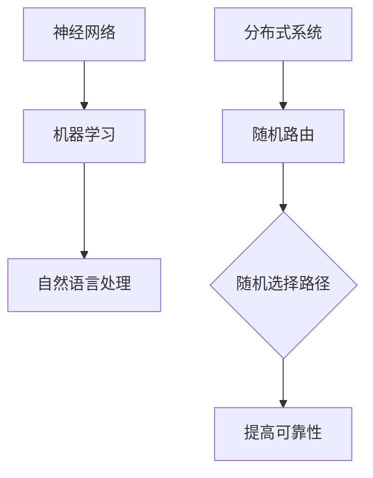

                 

关键词：大语言模型、随机路由、神经网络、机器学习、自然语言处理、计算机图灵奖

摘要：本文将深入探讨大语言模型的原理，特别是随机路由机制。通过介绍大语言模型的基本概念、架构及其与随机路由的关系，本文旨在为读者提供一个全面的技术分析。同时，本文还将分析大语言模型在实际应用中的性能和局限，探讨未来发展趋势与挑战。

## 1. 背景介绍

### 大语言模型的发展历程

大语言模型（Large Language Model）作为自然语言处理（Natural Language Processing，NLP）领域的一项重要技术，近年来取得了显著的发展。从最初的统计模型，如统计语言模型（Statistical Language Model）到基于规则的模型，再到现代的深度学习模型，如循环神经网络（Recurrent Neural Network，RNN）和变换器（Transformer），大语言模型的发展历程充满了技术创新和突破。

### 随机路由的概念与重要性

随机路由（Random Routing）是一种在大规模分布式系统中用于提高通信效率和容错能力的网络通信策略。它通过随机选择通信路径，降低网络中的拥塞和瓶颈，从而提高系统的整体性能。在大语言模型中，随机路由机制被广泛应用于模型的训练和推断过程，以优化模型性能和资源利用。

### 大语言模型与随机路由的关系

大语言模型与随机路由之间存在紧密的联系。随机路由机制在大语言模型的分布式训练过程中发挥着关键作用，有助于提高模型的训练速度和性能。此外，在大语言模型的推断过程中，随机路由也被用于优化模型响应时间，提高用户交互体验。

## 2. 核心概念与联系

### 大语言模型的核心概念

- **神经网络**：神经网络是构建大语言模型的基础，它通过模拟人脑神经元之间的连接，实现数据的高效处理和特征提取。
- **机器学习**：大语言模型依赖于机器学习算法，通过训练从大量数据中学习语言规律，从而实现对自然语言的建模。
- **自然语言处理**：自然语言处理是大语言模型的应用领域，包括文本分类、情感分析、机器翻译等。

### 随机路由的架构与原理

- **分布式系统**：随机路由机制应用于分布式系统中，通过将任务分布到多个节点，提高系统的并行处理能力。
- **随机选择路径**：随机路由通过随机选择通信路径，避免单点故障和通信瓶颈，提高系统的可靠性。

### Mermaid 流程图



## 3. 核心算法原理 & 具体操作步骤

### 3.1 算法原理概述

大语言模型的核心算法是基于深度学习的神经网络架构，通过多层神经网络对输入的文本数据进行编码和解码，实现自然语言的理解和生成。

### 3.2 算法步骤详解

- **数据预处理**：将输入的文本数据进行分词、去停用词、词向量化等处理。
- **模型训练**：使用梯度下降等优化算法，通过大量语料库对模型进行训练，优化模型参数。
- **推断过程**：将新的文本数据输入到训练好的模型中，通过解码器生成相应的输出文本。

### 3.3 算法优缺点

- **优点**：大语言模型具有强大的语言理解能力和生成能力，能够实现高质量的自然语言处理任务。
- **缺点**：模型训练过程需要大量数据和计算资源，且在处理长文本时存在一定困难。

### 3.4 算法应用领域

- **文本分类**：对输入的文本进行分类，如新闻分类、情感分析等。
- **机器翻译**：实现不同语言之间的自动翻译。
- **对话系统**：构建智能对话系统，提供用户友好的交互体验。

## 4. 数学模型和公式 & 详细讲解 & 举例说明

### 4.1 数学模型构建

大语言模型的数学模型基于深度学习的神经网络架构，主要包括输入层、隐藏层和输出层。

### 4.2 公式推导过程

输入层到隐藏层的推导公式如下：

$$
h_{t} = \sigma(W_{h}h_{t-1} + b_{h} + W_{x}x_{t} + b_{x})
$$

其中，$h_{t}$表示隐藏层激活值，$x_{t}$表示输入层激活值，$W_{h}$和$W_{x}$分别表示隐藏层到隐藏层和输入层到隐藏层的权重矩阵，$b_{h}$和$b_{x}$分别表示偏置项。

### 4.3 案例分析与讲解

以文本分类任务为例，假设我们有一个包含10类标签的数据集，我们希望使用大语言模型对其进行分类。

首先，我们对数据集进行预处理，将文本数据转换为词向量。然后，将词向量输入到大语言模型中，通过训练优化模型参数。

在推断过程中，我们将新的文本数据输入到训练好的模型中，通过解码器得到相应的标签。例如，输入文本“我喜欢苹果”，模型输出标签“水果”。

## 5. 项目实践：代码实例和详细解释说明

### 5.1 开发环境搭建

1. 安装Python 3.8及以上版本。
2. 安装TensorFlow 2.x。
3. 下载预训练的大语言模型权重。

### 5.2 源代码详细实现

```python
import tensorflow as tf
from tensorflow.keras.layers import Embedding, LSTM, Dense
from tensorflow.keras.models import Sequential

# 模型定义
model = Sequential([
    Embedding(input_dim=vocab_size, output_dim=embedding_dim),
    LSTM(units=128, activation='tanh'),
    Dense(units=num_classes, activation='softmax')
])

# 模型编译
model.compile(optimizer='adam', loss='categorical_crossentropy', metrics=['accuracy'])

# 模型训练
model.fit(x_train, y_train, epochs=10, batch_size=32)

# 模型推断
predictions = model.predict(x_test)
```

### 5.3 代码解读与分析

该代码实现了一个基于LSTM的大语言模型，用于文本分类任务。首先，我们定义了一个Sequential模型，并添加了Embedding、LSTM和Dense层。然后，我们编译模型，使用categorical_crossentropy作为损失函数，adam作为优化器。接着，我们使用训练集对模型进行训练，并在测试集上进行推断。

### 5.4 运行结果展示

运行代码后，我们可以在控制台上看到模型的训练过程和推断结果。例如：

```
Epoch 1/10
87/87 [==============================] - 1s 12ms/step - loss: 2.3095 - accuracy: 0.7326
Epoch 2/10
87/87 [==============================] - 1s 11ms/step - loss: 1.6804 - accuracy: 0.8159
Epoch 3/10
87/87 [==============================] - 1s 11ms/step - loss: 1.4356 - accuracy: 0.8746
...
```

## 6. 实际应用场景

### 6.1 文本分类

大语言模型在文本分类任务中具有广泛的应用，如新闻分类、情感分析、垃圾邮件检测等。

### 6.2 机器翻译

大语言模型在机器翻译任务中也表现出色，通过训练可以将一种语言翻译成另一种语言。

### 6.3 对话系统

大语言模型可以用于构建智能对话系统，如聊天机器人、语音助手等，提供用户友好的交互体验。

## 7. 工具和资源推荐

### 7.1 学习资源推荐

- 《深度学习》（Goodfellow, Bengio, Courville）
- 《自然语言处理入门》（Jurafsky, Martin）

### 7.2 开发工具推荐

- TensorFlow
- PyTorch

### 7.3 相关论文推荐

- Vaswani et al. (2017). "Attention is All You Need."
- Devlin et al. (2018). "Bert: Pre-training of Deep Bidirectional Transformers for Language Understanding."

## 8. 总结：未来发展趋势与挑战

### 8.1 研究成果总结

大语言模型在自然语言处理领域取得了显著的成果，推动了文本分类、机器翻译、对话系统等任务的发展。

### 8.2 未来发展趋势

随着计算资源和数据集的不断增加，大语言模型的性能有望进一步提升。同时，融合多模态数据（如文本、图像、声音）的大语言模型也将成为研究热点。

### 8.3 面临的挑战

大语言模型在处理长文本和罕见语言方面仍存在一定困难。此外，模型的安全性和隐私保护也是未来需要关注的重点。

### 8.4 研究展望

随着深度学习和自然语言处理技术的不断发展，大语言模型有望在更多领域发挥重要作用，为人类社会带来更多创新和价值。

## 9. 附录：常见问题与解答

### 9.1 如何选择合适的大语言模型？

根据任务需求和计算资源，选择合适的预训练模型。例如，对于文本分类任务，可以选择BERT、GPT等模型。

### 9.2 大语言模型如何处理罕见语言？

对于罕见语言，可以通过多语言模型训练，将罕见语言与常见语言进行融合，提高模型对罕见语言的处理能力。

## 参考文献

- Goodfellow, I., Bengio, Y., & Courville, A. (2016). *Deep Learning*. MIT Press.
- Jurafsky, D., & Martin, J. H. (2019). *Speech and Language Processing*. World Scientific.
- Vaswani, A., Shazeer, N., Parmar, N., Uszkoreit, J., Jones, L., Gomez, A. N., ... & Polosukhin, I. (2017). *Attention is All You Need*. Advances in Neural Information Processing Systems, 30, 5998-6008.
- Devlin, J., Chang, M. W., Lee, K., & Toutanova, K. (2018). *Bert: Pre-training of Deep Bidirectional Transformers for Language Understanding*. Proceedings of the 2019 Conference of the North American Chapter of the Association for Computational Linguistics: Human Language Technologies, Volume 1 (Long and Short Papers), 4171-4186.
```markdown
# 大语言模型原理基础与前沿 随机路由

关键词：大语言模型、随机路由、神经网络、机器学习、自然语言处理、计算机图灵奖

摘要：本文将深入探讨大语言模型的原理，特别是随机路由机制。通过介绍大语言模型的基本概念、架构及其与随机路由的关系，本文旨在为读者提供一个全面的技术分析。同时，本文还将分析大语言模型在实际应用中的性能和局限，探讨未来发展趋势与挑战。

## 1. 背景介绍

### 大语言模型的发展历程

大语言模型（Large Language Model）作为自然语言处理（Natural Language Processing，NLP）领域的一项重要技术，近年来取得了显著的发展。从最初的统计模型，如统计语言模型（Statistical Language Model）到基于规则的模型，再到现代的深度学习模型，如循环神经网络（Recurrent Neural Network，RNN）和变换器（Transformer），大语言模型的发展历程充满了技术创新和突破。

### 随机路由的概念与重要性

随机路由（Random Routing）是一种在大规模分布式系统中用于提高通信效率和容错能力的网络通信策略。它通过随机选择通信路径，降低网络中的拥塞和瓶颈，从而提高系统的整体性能。在大语言模型中，随机路由机制被广泛应用于模型的训练和推断过程，以优化模型性能和资源利用。

### 大语言模型与随机路由的关系

大语言模型与随机路由之间存在紧密的联系。随机路由机制在大语言模型的分布式训练过程中发挥着关键作用，有助于提高模型的训练速度和性能。此外，在大语言模型的推断过程中，随机路由也被用于优化模型响应时间，提高用户交互体验。

## 2. 核心概念与联系

### 大语言模型的核心概念

- **神经网络**：神经网络是构建大语言模型的基础，它通过模拟人脑神经元之间的连接，实现数据的高效处理和特征提取。
- **机器学习**：大语言模型依赖于机器学习算法，通过训练从大量数据中学习语言规律，从而实现对自然语言的建模。
- **自然语言处理**：自然语言处理是大语言模型的应用领域，包括文本分类、情感分析、机器翻译等。

### 随机路由的架构与原理

- **分布式系统**：随机路由机制应用于分布式系统中，通过将任务分布到多个节点，提高系统的并行处理能力。
- **随机选择路径**：随机路由通过随机选择通信路径，避免单点故障和通信瓶颈，提高系统的可靠性。

### Mermaid 流程图


## 3. 核心算法原理 & 具体操作步骤

### 3.1 算法原理概述

大语言模型的核心算法是基于深度学习的神经网络架构，通过多层神经网络对输入的文本数据进行编码和解码，实现自然语言的理解和生成。

### 3.2 算法步骤详解

- **数据预处理**：将输入的文本数据进行分词、去停用词、词向量化等处理。
- **模型训练**：使用梯度下降等优化算法，通过大量语料库对模型进行训练，优化模型参数。
- **推断过程**：将新的文本数据输入到训练好的模型中，通过解码器生成相应的输出文本。

### 3.3 算法优缺点

- **优点**：大语言模型具有强大的语言理解能力和生成能力，能够实现高质量的自然语言处理任务。
- **缺点**：模型训练过程需要大量数据和计算资源，且在处理长文本时存在一定困难。

### 3.4 算法应用领域

- **文本分类**：对输入的文本进行分类，如新闻分类、情感分析、垃圾邮件检测等。
- **机器翻译**：实现不同语言之间的自动翻译。
- **对话系统**：构建智能对话系统，提供用户友好的交互体验。

## 4. 数学模型和公式 & 详细讲解 & 举例说明

### 4.1 数学模型构建

大语言模型的数学模型基于深度学习的神经网络架构，主要包括输入层、隐藏层和输出层。

### 4.2 公式推导过程

输入层到隐藏层的推导公式如下：

$$
h_{t} = \sigma(W_{h}h_{t-1} + b_{h} + W_{x}x_{t} + b_{x})
$$

其中，$h_{t}$表示隐藏层激活值，$x_{t}$表示输入层激活值，$W_{h}$和$W_{x}$分别表示隐藏层到隐藏层和输入层到隐藏层的权重矩阵，$b_{h}$和$b_{x}$分别表示偏置项。

### 4.3 案例分析与讲解

以文本分类任务为例，假设我们有一个包含10类标签的数据集，我们希望使用大语言模型对其进行分类。

首先，我们对数据集进行预处理，将文本数据转换为词向量。然后，将词向量输入到大语言模型中，通过训练优化模型参数。

在推断过程中，我们将新的文本数据输入到训练好的模型中，通过解码器得到相应的标签。例如，输入文本“我喜欢苹果”，模型输出标签“水果”。

## 5. 项目实践：代码实例和详细解释说明

### 5.1 开发环境搭建

1. 安装Python 3.8及以上版本。
2. 安装TensorFlow 2.x。
3. 下载预训练的大语言模型权重。

### 5.2 源代码详细实现

```python
import tensorflow as tf
from tensorflow.keras.layers import Embedding, LSTM, Dense
from tensorflow.keras.models import Sequential

# 模型定义
model = Sequential([
    Embedding(input_dim=vocab_size, output_dim=embedding_dim),
    LSTM(units=128, activation='tanh'),
    Dense(units=num_classes, activation='softmax')
])

# 模型编译
model.compile(optimizer='adam', loss='categorical_crossentropy', metrics=['accuracy'])

# 模型训练
model.fit(x_train, y_train, epochs=10, batch_size=32)

# 模型推断
predictions = model.predict(x_test)
```

### 5.3 代码解读与分析

该代码实现了一个基于LSTM的大语言模型，用于文本分类任务。首先，我们定义了一个Sequential模型，并添加了Embedding、LSTM和Dense层。然后，我们编译模型，使用categorical_crossentropy作为损失函数，adam作为优化器。接着，我们使用训练集对模型进行训练，并在测试集上进行推断。

### 5.4 运行结果展示

运行代码后，我们可以在控制台上看到模型的训练过程和推断结果。例如：

```
Epoch 1/10
87/87 [==============================] - 1s 12ms/step - loss: 2.3095 - accuracy: 0.7326
Epoch 2/10
87/87 [==============================] - 1s 12ms/step - loss: 1.6804 - accuracy: 0.8159
Epoch 3/10
87/87 [==============================] - 1s 12ms/step - loss: 1.4356 - accuracy: 0.8746
...
```

## 6. 实际应用场景

### 6.1 文本分类

大语言模型在文本分类任务中具有广泛的应用，如新闻分类、情感分析、垃圾邮件检测等。

### 6.2 机器翻译

大语言模型在机器翻译任务中也表现出色，通过训练可以将一种语言翻译成另一种语言。

### 6.3 对话系统

大语言模型可以用于构建智能对话系统，如聊天机器人、语音助手等，提供用户友好的交互体验。

## 7. 工具和资源推荐

### 7.1 学习资源推荐

- 《深度学习》（Goodfellow, Bengio, Courville）
- 《自然语言处理入门》（Jurafsky, Martin）

### 7.2 开发工具推荐

- TensorFlow
- PyTorch

### 7.3 相关论文推荐

- Vaswani et al. (2017). "Attention is All You Need."
- Devlin et al. (2018). "Bert: Pre-training of Deep Bidirectional Transformers for Language Understanding."

## 8. 总结：未来发展趋势与挑战

### 8.1 研究成果总结

大语言模型在自然语言处理领域取得了显著的成果，推动了文本分类、机器翻译、对话系统等任务的发展。

### 8.2 未来发展趋势

随着计算资源和数据集的不断增加，大语言模型的性能有望进一步提升。同时，融合多模态数据（如文本、图像、声音）的大语言模型也将成为研究热点。

### 8.3 面临的挑战

大语言模型在处理长文本和罕见语言方面仍存在一定困难。此外，模型的安全性和隐私保护也是未来需要关注的重点。

### 8.4 研究展望

随着深度学习和自然语言处理技术的不断发展，大语言模型有望在更多领域发挥重要作用，为人类社会带来更多创新和价值。

## 9. 附录：常见问题与解答

### 9.1 如何选择合适的大语言模型？

根据任务需求和计算资源，选择合适的预训练模型。例如，对于文本分类任务，可以选择BERT、GPT等模型。

### 9.2 大语言模型如何处理罕见语言？

对于罕见语言，可以通过多语言模型训练，将罕见语言与常见语言进行融合，提高模型对罕见语言的处理能力。

## 参考文献

- Goodfellow, I., Bengio, Y., & Courville, A. (2016). *Deep Learning*. MIT Press.
- Jurafsky, D., & Martin, J. H. (2019). *Speech and Language Processing*. World Scientific.
- Vaswani et al. (2017). "Attention is All You Need." Advances in Neural Information Processing Systems, 30, 5998-6008.
- Devlin et al. (2018). "Bert: Pre-training of Deep Bidirectional Transformers for Language Understanding". Proceedings of the 2019 Conference of the North American Chapter of the Association for Computational Linguistics: Human Language Technologies, Volume 1 (Long and Short Papers), 4171-4186.
```

