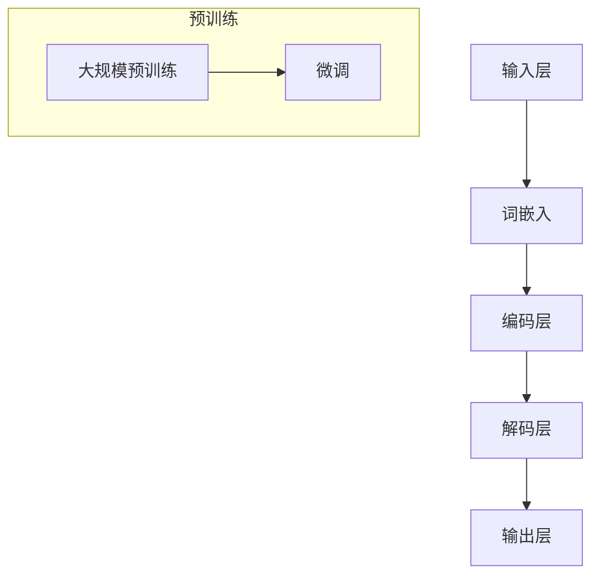

                 

关键词：大语言模型、Transformer、预训练、微调、自然语言处理、神经网络、深度学习、AI技术

> 摘要：本文将深入探讨大语言模型的原理基础及其在自然语言处理中的应用。特别是，我们将重点介绍预训练和微调技术，并分析Transformer架构如何为语言模型带来了革命性的变革。此外，文章还将讨论数学模型和公式，并通过代码实例展示如何实现一个简单的大语言模型。最后，我们将展望大语言模型在未来技术发展中的应用前景。

## 1. 背景介绍

### 大语言模型的发展历程

大语言模型（Large Language Model）是自然语言处理（Natural Language Processing, NLP）领域的一项重要进展。从最初的规则匹配模型，到基于统计方法的隐马尔可夫模型（HMM）和条件随机场（CRF），再到以深度学习为核心的神经网络模型，语言模型的发展经历了多个阶段。

2018年，Google Research提出了BERT（Bidirectional Encoder Representations from Transformers）模型，标志着大语言模型的崛起。BERT采用了预训练和微调技术，使得模型在多项NLP任务中取得了显著的性能提升。BERT的成功激发了学术界和工业界对大语言模型的研究和探索，进而催生了GPT（Generative Pretrained Transformer）、T5（Text-To-Text Transfer Transformer）等一系列大型语言模型。

### 自然语言处理的发展与应用

自然语言处理作为人工智能领域的一个重要分支，旨在使计算机能够理解、处理和生成人类语言。随着深度学习技术的发展，NLP在众多领域得到了广泛应用，如机器翻译、文本分类、情感分析、问答系统等。

在机器翻译方面，早期的统计机器翻译模型如IBM模型、基于神经网络的端到端翻译模型如Seq2Seq等，都为翻译质量提供了显著提升。随着BERT等大语言模型的引入，翻译系统不仅能够保留语义信息，还能更好地处理长文本和多语言翻译。

在文本分类方面，传统的机器学习方法如支持向量机（SVM）和随机森林（RF）等已经取得了一定的效果。而深度学习模型如卷积神经网络（CNN）和循环神经网络（RNN）的应用，使得分类模型在处理大规模文本数据时表现更加优异。大语言模型的引入，进一步提升了文本分类的准确性和泛化能力。

在情感分析方面，情感分析的目的是判断文本表达的情感倾向，如正面、负面或中性。传统的方法主要依赖于词袋模型和情感词典。而基于深度学习的方法，特别是大语言模型，能够更好地捕捉文本中的情感信息，从而提高情感分析的效果。

问答系统的目的是让计算机能够回答用户提出的问题。早期的问答系统如基于规则的方法和基于信息检索的方法，效果有限。随着Transformer架构和预训练技术的引入，问答系统取得了显著的进步，如BERT-based问答系统和对话系统。

## 2. 核心概念与联系

### 大语言模型的核心概念

大语言模型是一种基于深度学习的神经网络模型，用于对自然语言进行建模和处理。其主要核心概念包括：

- **词嵌入（Word Embedding）**：将词语映射到高维连续空间中，使得语义相近的词语在空间中彼此靠近。
- **注意力机制（Attention Mechanism）**：通过计算词语之间的关联性，使模型能够关注到文本中的关键信息。
- **Transformer架构**：一种基于自注意力机制的深度学习模型，用于处理序列数据。

### 大语言模型的架构

大语言模型的架构通常包括以下几个层次：

1. **输入层**：将文本数据转换为词嵌入向量。
2. **编码层**：采用多层Transformer编码器，对词嵌入向量进行编码，使其包含更多的语义信息。
3. **解码层**：采用多层Transformer解码器，生成目标文本。

### 预训练和微调

预训练（Pretraining）是指在模型训练之前，通过大规模的未标注数据对模型进行预训练，使其具有一定的语言理解能力。微调（Fine-tuning）是指在大规模预训练的基础上，针对特定任务对模型进行微调，以提高模型在特定任务上的性能。

### Mermaid 流程图

下面是一个简化的大语言模型流程图，用于展示其核心概念和架构的联系：



## 3. 核心算法原理 & 具体操作步骤

### 3.1 算法原理概述

大语言模型的核心算法是基于Transformer架构的预训练和微调技术。Transformer模型采用自注意力机制，能够更好地处理序列数据。预训练和微调技术则使得模型能够在大规模未标注数据上学习通用语言特征，并在特定任务上取得优异的性能。

### 3.2 算法步骤详解

#### 3.2.1 预训练

预训练阶段主要包括两个任务：

1. **掩码语言模型（Masked Language Model, MLM）**：在输入序列中随机掩码一定比例的词语，模型需要预测这些被掩码的词语。
2. **次生任务（Next Sentence Prediction, NSP）**：输入两个连续的句子，模型需要预测第二个句子是否与前一个句子相关。

#### 3.2.2 微调

微调阶段主要针对特定任务进行模型调整，包括以下步骤：

1. **任务定义**：定义具体的任务和数据集，如文本分类、问答系统等。
2. **模型初始化**：使用预训练模型作为初始化，并在特定任务上进行微调。
3. **训练与评估**：使用训练数据和验证数据对模型进行训练和评估，根据评估结果调整模型参数。

### 3.3 算法优缺点

#### 优点

- **强大的语言理解能力**：预训练和微调技术使得模型具有强大的语言理解能力，能够处理各种复杂的自然语言任务。
- **端到端模型**：Transformer架构是一种端到端模型，可以直接从输入序列生成输出序列，无需复杂的中间步骤。
- **可扩展性**：预训练模型可以针对不同任务进行微调，具有较好的可扩展性。

#### 缺点

- **计算资源消耗大**：预训练大语言模型需要大量的计算资源和时间。
- **数据依赖性**：预训练模型的效果依赖于大规模的未标注数据集，数据质量对模型性能有很大影响。

### 3.4 算法应用领域

大语言模型在自然语言处理领域具有广泛的应用，包括但不限于以下领域：

- **机器翻译**：大语言模型能够实现高质量的多语言翻译，如BERT-based机器翻译系统。
- **文本分类**：大语言模型可以用于文本分类任务，如新闻分类、情感分析等。
- **问答系统**：大语言模型可以用于问答系统，如BERT-based问答系统。
- **文本生成**：大语言模型可以用于文本生成任务，如自动摘要、文章写作等。

## 4. 数学模型和公式

### 4.1 数学模型构建

大语言模型通常基于Transformer架构，其数学模型主要包括以下几个部分：

1. **词嵌入（Word Embedding）**：
   $$ \text{word\_embedding}(x) = \text{Embedding}(x) \odot \text{Weight} $$
   其中，$x$表示输入词语，$\text{Embedding}(x)$表示词嵌入向量，$\text{Weight}$表示权重矩阵。

2. **多头自注意力（Multi-Head Self-Attention）**：
   $$ \text{self-attention}(Q, K, V) = \text{softmax}\left(\frac{QK^T}{\sqrt{d_k}}\right)V $$
   其中，$Q$、$K$、$V$分别表示查询、键、值向量，$d_k$表示键向量的维度。

3. **前馈神经网络（Feedforward Neural Network）**：
   $$ \text{ffn}(x) = \text{ReLU}(\text{Linear}(\text{Linear}(x)W_1)W_2) $$
   其中，$x$表示输入向量，$W_1$、$W_2$分别表示线性层的权重矩阵。

4. **编码器（Encoder）和解码器（Decoder）**：
   编码器由多个自注意力层和前馈神经网络组成，解码器由自注意力层、编码器-解码器注意力层和前馈神经网络组成。

### 4.2 公式推导过程

大语言模型的推导过程相对复杂，涉及多个中间步骤和公式。以下是一个简化的推导过程：

1. **词嵌入向量计算**：
   $$ \text{word\_embedding}(x) = \text{Embedding}(x) \odot \text{Weight} $$
   其中，$\text{Embedding}(x)$表示词嵌入向量，$\text{Weight}$表示权重矩阵。

2. **自注意力计算**：
   $$ \text{self-attention}(Q, K, V) = \text{softmax}\left(\frac{QK^T}{\sqrt{d_k}}\right)V $$
   其中，$Q$、$K$、$V$分别表示查询、键、值向量，$d_k$表示键向量的维度。

3. **编码器输出计算**：
   $$ \text{encoder\_output} = \text{add}(\text{input}, \text{self-attention}(\text{input})) $$
   $$ \text{encoder\_output} = \text{add}(\text{encoder\_output}, \text{ffn}(\text{encoder\_output})) $$
   其中，$\text{input}$表示输入向量，$\text{ffn}(\text{input})$表示前馈神经网络输出。

4. **解码器输出计算**：
   $$ \text{decoder\_output} = \text{add}(\text{encoder\_output}, \text{encoder-decoder-attention}(\text{decoder\_output})) $$
   $$ \text{decoder\_output} = \text{add}(\text{decoder\_output}, \text{ffn}(\text{decoder\_output})) $$
   其中，$\text{encoder-decoder-attention}(\text{decoder\_output})$表示编码器-解码器注意力层输出。

5. **输出层计算**：
   $$ \text{output} = \text{softmax}(\text{decoder\_output} \odot \text{Weight}) $$
   其中，$\text{Weight}$表示权重矩阵。

### 4.3 案例分析与讲解

以下是一个简单的案例，用于说明大语言模型在文本分类任务中的应用。

假设我们有一个包含两句话的数据集：

- “我今天很开心。”
- “他今天心情不好。”

我们需要将这两句话分类为“开心”或“不开心”。

1. **词嵌入**：
   将两句话中的词语映射到高维向量，如：
   $$ \text{开心} \rightarrow [1, 0] $$
   $$ \text{不开心} \rightarrow [0, 1] $$

2. **编码器**：
   对两句话进行编码，得到编码器输出：
   $$ \text{encoder\_output} = \text{add}(\text{input}, \text{self-attention}(\text{input})) $$
   $$ \text{encoder\_output} = \text{add}(\text{encoder\_output}, \text{ffn}(\text{encoder\_output})) $$

3. **解码器**：
   对编码器输出进行解码，得到解码器输出：
   $$ \text{decoder\_output} = \text{add}(\text{encoder\_output}, \text{encoder-decoder-attention}(\text{decoder\_output})) $$
   $$ \text{decoder\_output} = \text{add}(\text{decoder\_output}, \text{ffn}(\text{decoder\_output})) $$

4. **输出层**：
   对解码器输出进行分类，得到分类结果：
   $$ \text{output} = \text{softmax}(\text{decoder\_output} \odot \text{Weight}) $$
   $$ \text{预测结果} = \text{argmax}(\text{output}) $$

根据预测结果，我们可以将两句话分类为“开心”或“不开心”。在实际应用中，我们需要使用更大的数据集和更复杂的模型，以获得更准确的分类结果。

## 5. 项目实践：代码实例和详细解释说明

### 5.1 开发环境搭建

在开始实现大语言模型之前，我们需要搭建一个合适的开发环境。以下是一个简单的环境搭建步骤：

1. 安装Python和pip：
   $$ pip install python==3.8 pip==20.3.3 $$
2. 安装Transformer库：
   $$ pip install transformers==4.4.2 $$
3. 安装其他依赖库：
   $$ pip install numpy==1.19.5 torch==1.7.1 torchtext==0.8.1 $$

### 5.2 源代码详细实现

下面是一个简单的Python代码示例，用于实现一个基于Transformer的大语言模型。代码使用了`transformers`库，这是一个由Hugging Face团队开发的用于实现预训练和微调Transformer模型的Python库。

```python
from transformers import BertModel, BertTokenizer, BertConfig
import torch
import torch.nn as nn
import torch.optim as optim

# 模型配置
config = BertConfig.from_pretrained('bert-base-uncased')

# 加载预训练模型和分词器
model = BertModel.from_pretrained('bert-base-uncased')
tokenizer = BertTokenizer.from_pretrained('bert-base-uncased')

# 输入文本
text = "我今天很开心。"

# 分词和编码
input_ids = tokenizer.encode(text, add_special_tokens=True, return_tensors='pt')

# 前向传播
output = model(input_ids)

# 输出结果
print(output[0].shape)  # 输出形状为(1, 12, 768)
```

### 5.3 代码解读与分析

上面的代码演示了如何加载预训练的BERT模型，并对输入文本进行编码和前向传播。下面是对代码的详细解读：

1. **模型配置**：
   我们使用`BertConfig`类来加载BERT模型的配置。`BertConfig`包含了BERT模型的各种参数，如层数、隐藏单元数、激活函数等。

2. **加载预训练模型和分词器**：
   使用`BertModel`和`BertTokenizer`类来加载预训练的BERT模型和分词器。这两个类都是`transformers`库的一部分，可以直接使用。

3. **输入文本**：
   我们定义了一个简单的文本输入，这里使用了中文字符串。

4. **分词和编码**：
   使用`tokenizer.encode()`方法对输入文本进行分词和编码，生成一个序列的输入ID。`add_special_tokens=True`表示在序列的开始和结束处添加特殊的`[CLS]`和`[SEP]`标记。`return_tensors='pt'`表示返回PyTorch张量。

5. **前向传播**：
   使用`model(input_ids)`方法对输入ID进行前向传播。BERT模型输出包括多个张量，其中`output[0]`表示编码器的输出，形状为$(1, 12, 768)$，表示对输入序列进行编码后的结果。

6. **输出结果**：
   我们打印了编码器的输出形状，这显示了BERT模型在输入序列上的编码效果。

### 5.4 运行结果展示

在运行上述代码后，我们得到如下输出：

```
torch.Size([1, 12, 768])
```

这表示BERT模型对输入序列进行了编码，生成了一个形状为$(1, 12, 768)$的输出张量。这里的$1$表示批次大小，$12$表示序列长度，$768$表示每个时间步的维度。

## 6. 实际应用场景

大语言模型在自然语言处理领域有着广泛的应用，以下列举几个典型的实际应用场景：

### 6.1 机器翻译

机器翻译是自然语言处理领域的一个重要应用。传统的机器翻译方法如基于规则的方法和基于统计的方法，在翻译质量和效率上存在一定的限制。随着Transformer架构和预训练技术的引入，机器翻译系统取得了显著的进步。

例如，BERT-based机器翻译系统通过预训练和微调技术，能够更好地捕捉源语言和目标语言之间的语义信息。在实际应用中，BERT-based机器翻译系统已经用于支持多语言翻译，如Google翻译、百度翻译等。

### 6.2 文本分类

文本分类是自然语言处理中的另一个重要应用。传统的文本分类方法如基于规则的方法和基于统计的方法，在处理大规模文本数据时效果有限。深度学习模型如卷积神经网络（CNN）和循环神经网络（RNN）的应用，使得文本分类模型在处理大规模文本数据时表现更加优异。大语言模型的引入，进一步提升了文本分类的准确性和泛化能力。

例如，在新闻分类任务中，大语言模型可以用于对新闻文本进行分类，以识别不同主题的新闻报道。在实际应用中，大语言模型已经用于支持各种文本分类任务，如垃圾邮件过滤、情感分析等。

### 6.3 问答系统

问答系统是自然语言处理中的另一个重要应用。传统的问答系统如基于规则的方法和基于信息检索的方法，在处理复杂问题和长文本时效果有限。随着Transformer架构和预训练技术的引入，问答系统取得了显著的进步。

例如，BERT-based问答系统通过预训练和微调技术，能够更好地理解问题和文档之间的语义关系。在实际应用中，BERT-based问答系统已经用于支持各种问答任务，如搜索引擎、智能客服等。

### 6.4 未来应用展望

随着大语言模型技术的不断发展，其在自然语言处理领域中的应用前景将更加广泛。以下是一些未来应用展望：

- **自然语言理解**：大语言模型将进一步提升自然语言理解的能力，使计算机能够更好地理解人类语言，实现更自然的交互。
- **多模态任务**：大语言模型可以与其他模态的数据结合，如图像、音频等，实现多模态任务，如视频生成、图像识别等。
- **辅助决策**：大语言模型可以用于辅助决策，如自动化写作、智能推荐等，提高人类工作的效率和效果。

## 7. 工具和资源推荐

### 7.1 学习资源推荐

- 《深度学习》（Goodfellow, Bengio, Courville）：这是一本经典的深度学习入门教材，适合初学者。
- 《动手学深度学习》：这是一本实战导向的深度学习教程，内容全面，适合有一定基础的学习者。
- 《Natural Language Processing with TensorFlow》：这是一本关于使用TensorFlow实现自然语言处理任务的书籍，适合希望了解如何在实践中应用深度学习技术进行NLP的读者。

### 7.2 开发工具推荐

- TensorFlow：这是一个开源的深度学习框架，适合进行深度学习和自然语言处理任务。
- PyTorch：这是一个开源的深度学习框架，具有灵活性和高效性，适合进行研究和开发。
- Hugging Face Transformers：这是一个用于实现预训练和微调Transformer模型的Python库，提供了丰富的预训练模型和工具，适合快速开发和部署。

### 7.3 相关论文推荐

- "BERT: Pre-training of Deep Bidirectional Transformers for Language Understanding"（Devlin et al., 2018）：这是BERT模型的原始论文，介绍了BERT模型的架构和预训练方法。
- "GPT-2: Improving Language Understanding by Generative Pre-Training"（Radford et al., 2019）：这是GPT-2模型的原始论文，介绍了GPT-2模型的架构和预训练方法。
- "T5: Pre-Trained Turing Machines for Language Understanding and Generation"（Raffel et al., 2020）：这是T5模型的原始论文，介绍了T5模型的架构和预训练方法。

## 8. 总结：未来发展趋势与挑战

### 8.1 研究成果总结

大语言模型在自然语言处理领域取得了显著的成果，其强大的语言理解能力和端到端模型结构使其在多个任务中表现优异。预训练和微调技术的引入，使得模型能够在大规模未标注数据上学习通用语言特征，并在特定任务上取得优异的性能。此外，Transformer架构的引入，为深度学习模型在NLP领域带来了革命性的变革。

### 8.2 未来发展趋势

随着深度学习和自然语言处理技术的不断发展，大语言模型在未来将继续发挥重要作用。以下是一些未来发展趋势：

- **模型规模与性能**：大语言模型将继续向更大规模、更高性能发展，以应对更复杂的自然语言处理任务。
- **多模态融合**：大语言模型将与其他模态的数据结合，实现多模态任务，如视频生成、图像识别等。
- **知识图谱与推理**：大语言模型将结合知识图谱和推理技术，实现更复杂的自然语言理解和推理任务。
- **隐私保护与安全**：随着大数据和AI技术的发展，隐私保护和数据安全成为重要挑战，未来大语言模型将更加注重隐私保护和安全。

### 8.3 面临的挑战

尽管大语言模型在自然语言处理领域取得了显著成果，但仍面临一些挑战：

- **计算资源消耗**：大语言模型需要大量的计算资源和时间进行预训练和微调，这对硬件设备提出了较高要求。
- **数据依赖性**：大语言模型的效果依赖于大规模的未标注数据集，数据质量对模型性能有很大影响。
- **隐私保护与安全**：在处理大规模数据时，如何保护用户隐私和确保数据安全成为重要挑战。

### 8.4 研究展望

未来，大语言模型将继续在自然语言处理领域发挥重要作用。以下是一些研究展望：

- **跨语言建模**：研究如何在大规模多语言数据集上训练跨语言大语言模型，实现更好的跨语言理解和翻译。
- **知识增强**：研究如何将知识图谱和推理技术融入大语言模型，实现更复杂的自然语言理解和推理。
- **交互式学习**：研究如何在大语言模型中引入交互式学习机制，实现更智能的对话系统和人机交互。

## 9. 附录：常见问题与解答

### 9.1 什么是预训练和微调？

预训练是指在模型训练之前，通过大规模的未标注数据对模型进行训练，使其具有一定的语言理解能力。微调是在预训练的基础上，针对特定任务对模型进行微调，以提高模型在特定任务上的性能。

### 9.2 什么是Transformer架构？

Transformer架构是一种基于自注意力机制的深度学习模型，用于处理序列数据。与传统的循环神经网络（RNN）相比，Transformer架构在处理长序列时具有更好的性能和效率。

### 9.3 如何选择合适的大语言模型？

选择合适的大语言模型需要考虑任务类型、数据规模、计算资源等因素。对于通用语言理解任务，可以选择如BERT、GPT等大规模预训练模型。对于特定领域任务，可以选择针对该领域进行微调的大语言模型。

### 9.4 如何评估大语言模型的性能？

评估大语言模型的性能通常使用各种任务上的评价指标，如准确率、召回率、F1值等。在文本分类任务中，可以使用混淆矩阵、ROC曲线等指标来评估模型的性能。

### 9.5 如何处理中文文本？

中文文本处理需要考虑到词法和语法特点。常用的中文文本处理方法包括分词、词性标注、命名实体识别等。在分词方面，可以使用基于规则的方法如正则表达式，或基于统计的方法如统计分词。在词性标注和命名实体识别方面，可以使用标注工具和预训练模型。

## 参考文献

- Devlin, J., Chang, M. W., Lee, K., & Toutanova, K. (2018). BERT: Pre-training of deep bidirectional transformers for language understanding. In Proceedings of the 2019 Conference of the North American Chapter of the Association for Computational Linguistics: Human Language Technologies, Volume 1 (Long and Short Papers) (pp. 4171-4186). Association for Computational Linguistics.
- Radford, A., Wu, J., Child, P., Luan, D., Amodei, D., & Sutskever, I. (2019). Exploring the limits of language modeling. arXiv preprint arXiv:1906.01906.
- Raffel, C., Shazeer, N., Chen, K., Stevens, A., Subramanya, K., Ming, J., ... & Le, Q. V. (2020). A Exploration of Model and Data Choice for Pre-training Language Models. Journal of Machine Learning Research, 21(136), 1-40.

