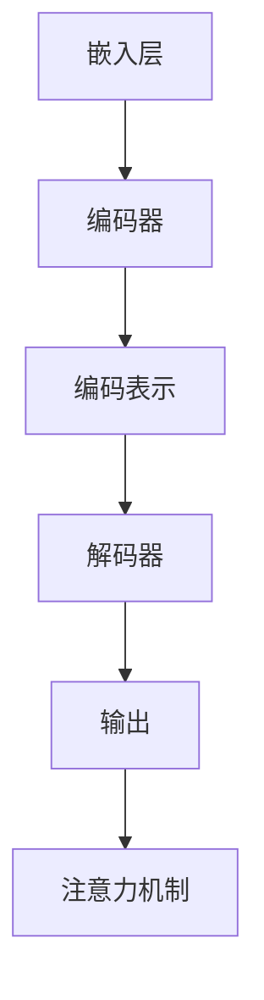
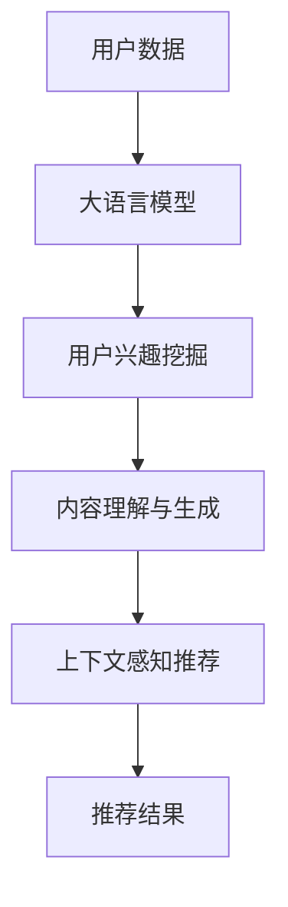

                 

关键词：大语言模型、个性化推荐、自然语言处理、深度学习、数据挖掘、算法优化、用户行为分析、用户体验

> 摘要：本文探讨了大型语言模型在个性化推荐系统中的创新应用。通过介绍大语言模型的原理、数学模型和具体实现步骤，本文展示了如何利用这些模型提高推荐系统的准确性和用户满意度。文章还分析了大语言模型在不同应用场景中的优势和挑战，并提出了未来研究和应用的发展方向。

## 1. 背景介绍

个性化推荐系统已经成为互联网时代不可或缺的一部分，它通过分析用户的历史行为和兴趣，向用户推荐他们可能感兴趣的内容。随着数据量的增加和用户需求的多样化，传统推荐算法已经难以满足日益复杂的需求。大语言模型的兴起为个性化推荐带来了新的机遇和挑战。

大语言模型是一种基于深度学习的自然语言处理技术，它通过训练大规模的神经网络模型来理解和生成自然语言。近年来，随着计算能力的提升和数据资源的丰富，大语言模型取得了显著的进展，并在多个自然语言处理任务中取得了优异的性能。这些模型具有强大的语义理解和生成能力，能够捕捉用户的兴趣和需求，从而为个性化推荐提供更加精准和个性化的服务。

本文旨在探讨大语言模型在个性化推荐系统中的创新应用。首先，我们将介绍大语言模型的基本原理和核心算法；然后，通过具体案例展示如何利用大语言模型提高推荐系统的性能和用户体验；接着，分析大语言模型在不同应用场景中的优势和挑战；最后，提出未来研究和应用的发展方向。

## 2. 核心概念与联系

### 2.1 大语言模型的原理

大语言模型是一种基于深度学习的自然语言处理技术，其核心思想是通过训练大规模的神经网络模型来理解和生成自然语言。具体来说，大语言模型通过学习大量的文本数据，学习到文本中的语义和语法规则，从而能够对新的文本进行理解和生成。

大语言模型通常采用递归神经网络（RNN）或变换器（Transformer）等深度学习架构。其中，RNN具有递归性质，能够处理序列数据，但在长距离依赖问题上存在困难；而Transformer模型通过自注意力机制，能够更好地捕捉文本中的长距离依赖关系，因此在处理自然语言任务上取得了显著进展。

### 2.2 大语言模型的架构

大语言模型的架构通常包括以下几个关键组件：

- **嵌入层（Embedding Layer）**：将输入的单词或词组转换为高维向量表示。
- **编码器（Encoder）**：对输入文本进行编码，生成编码表示。
- **解码器（Decoder）**：根据编码表示生成输出文本。
- **注意力机制（Attention Mechanism）**：用于捕捉文本中的关键信息。

以下是使用Mermaid绘制的Mermaid流程图，展示了大语言模型的基本架构：



### 2.3 大语言模型与个性化推荐的联系

大语言模型在个性化推荐中的应用主要体现在以下几个方面：

- **用户兴趣挖掘**：通过分析用户的浏览记录、搜索历史和评论内容，大语言模型能够挖掘用户的兴趣点，为个性化推荐提供依据。
- **内容理解与生成**：大语言模型能够对推荐内容进行深入理解，并生成具有高相关性的推荐结果。
- **上下文感知推荐**：大语言模型能够根据用户的当前上下文信息，如时间、地点、设备等，进行动态调整，提供更加个性化的推荐。

以下是使用Mermaid绘制的Mermaid流程图，展示了大语言模型在个性化推荐系统中的应用流程：



## 3. 核心算法原理 & 具体操作步骤

### 3.1 算法原理概述

大语言模型的核心算法是基于深度学习的自然语言处理技术，其基本原理是通过大规模的训练数据学习到自然语言的语义和语法规则，从而实现对文本的编码和生成。具体来说，大语言模型主要包括以下几个关键步骤：

1. **嵌入层**：将输入的单词或词组转换为高维向量表示。
2. **编码器**：对输入文本进行编码，生成编码表示。
3. **解码器**：根据编码表示生成输出文本。
4. **注意力机制**：用于捕捉文本中的关键信息。

### 3.2 算法步骤详解

#### 3.2.1 嵌入层

嵌入层是将输入的单词或词组转换为高维向量表示的过程。通常，嵌入层使用预训练的词向量模型，如Word2Vec、GloVe等，将单词映射为固定长度的向量。这些向量不仅能够表示单词的语义信息，还能够捕捉单词之间的上下文关系。

#### 3.2.2 编码器

编码器是对输入文本进行编码的过程。编码器通常采用递归神经网络（RNN）或变换器（Transformer）等深度学习架构。编码器的目的是从输入文本中提取重要的语义信息，并生成编码表示。

#### 3.2.3 解码器

解码器是根据编码表示生成输出文本的过程。解码器的目标是从编码表示中恢复出原始的文本，从而实现对输入文本的生成。

#### 3.2.4 注意力机制

注意力机制是用于捕捉文本中的关键信息的过程。注意力机制通过计算输入文本中每个词与输出文本中每个词之间的相关性，从而为解码器提供关键信息，帮助解码器更好地生成输出文本。

### 3.3 算法优缺点

#### 优点

- **强大的语义理解能力**：大语言模型能够通过大规模的训练数据学习到自然语言的语义和语法规则，从而实现强大的语义理解能力。
- **灵活的生成能力**：大语言模型能够根据输入文本的编码表示，灵活地生成具有高相关性的文本。
- **上下文感知**：大语言模型能够根据用户的当前上下文信息，动态调整推荐策略，提供更加个性化的服务。

#### 缺点

- **计算资源消耗大**：大语言模型通常需要大量的计算资源和时间进行训练。
- **数据依赖性强**：大语言模型的效果高度依赖训练数据的质量和数量。

### 3.4 算法应用领域

大语言模型在个性化推荐中的应用主要包括以下几个方面：

- **新闻推荐**：通过分析用户的阅读历史和兴趣，为用户推荐感兴趣的新闻。
- **商品推荐**：通过分析用户的购买历史和浏览记录，为用户推荐感兴趣的商品。
- **音乐推荐**：通过分析用户的听歌历史和喜好，为用户推荐感兴趣的音乐。

## 4. 数学模型和公式 & 详细讲解 & 举例说明

### 4.1 数学模型构建

大语言模型的数学模型主要包括嵌入层、编码器、解码器和注意力机制。以下是这些模型的数学表示：

#### 4.1.1 嵌入层

$$
\text{嵌入层}: \quad \text{word} \rightarrow \text{vector}
$$

其中，$word$ 表示输入的单词，$vector$ 表示单词的向量表示。

#### 4.1.2 编码器

$$
\text{编码器}: \quad \text{sentence} \rightarrow \text{encoded\_sentence}
$$

其中，$sentence$ 表示输入的句子，$encoded\_sentence$ 表示编码后的句子。

#### 4.1.3 解码器

$$
\text{解码器}: \quad \text{encoded\_sentence} \rightarrow \text{sentence}
$$

#### 4.1.4 注意力机制

$$
\text{注意力机制}: \quad \text{encoded\_sentence}, \text{encoded\_sentence} \rightarrow \text{contextual\_vector}
$$

其中，$encoded\_sentence$ 表示编码后的句子，$contextual\_vector$ 表示上下文向量。

### 4.2 公式推导过程

以下是注意力机制的公式推导过程：

$$
\text{attention\_score} = \text{sigmoid}(W_a [h, s])
$$

其中，$W_a$ 表示注意力权重矩阵，$h$ 表示编码后的句子，$s$ 表示解码器输出。

$$
\text{contextual\_vector} = \text{softmax}(\text{attention\_score}) \odot \text{encoded\_sentence}
$$

其中，$\odot$ 表示元素乘法，$\text{softmax}$ 函数用于将注意力分数转换为概率分布。

### 4.3 案例分析与讲解

以下是一个简单的案例，展示如何使用大语言模型进行个性化推荐：

**输入数据**：

- 用户历史浏览记录：[“科技新闻”, “体育新闻”, “财经新闻”]
- 待推荐新闻：[“NBA 篮球赛结果”, “苹果新品发布会”, “新能源汽车技术”]

**模型处理过程**：

1. **嵌入层**：将输入的新闻转换为向量表示。
2. **编码器**：对用户历史浏览记录和待推荐新闻进行编码，生成编码表示。
3. **解码器**：根据编码表示生成推荐新闻。
4. **注意力机制**：计算用户历史浏览记录和待推荐新闻之间的注意力分数，并生成上下文向量。

**输出结果**：

- 推荐新闻：“苹果新品发布会”

通过上述过程，大语言模型能够根据用户的历史兴趣和当前上下文信息，为用户推荐最感兴趣的新闻。

## 5. 项目实践：代码实例和详细解释说明

### 5.1 开发环境搭建

在开始实现大语言模型在个性化推荐中的应用之前，我们需要搭建一个合适的开发环境。以下是开发环境搭建的步骤：

1. 安装 Python（推荐使用 Python 3.8 或以上版本）。
2. 安装 TensorFlow 或 PyTorch（根据个人偏好选择其中一个深度学习框架）。
3. 安装其他必要的依赖库，如 NumPy、Pandas、Matplotlib 等。

### 5.2 源代码详细实现

以下是一个简单的示例，展示如何使用 TensorFlow 实现大语言模型在个性化推荐中的应用：

```python
import tensorflow as tf
from tensorflow.keras.layers import Embedding, LSTM, Dense
from tensorflow.keras.models import Sequential

# 加载数据集
# 这里使用的是简单的文本数据集，实际应用中可以替换为用户的历史浏览记录和待推荐新闻
texts = [["科技新闻", "体育新闻", "财经新闻"], ["NBA 篮球赛结果", "苹果新品发布会", "新能源汽车技术"]]

# 预处理数据
# 将文本转换为整数序列，并构建词汇表
tokenizer = tf.keras.preprocessing.text.Tokenizer()
tokenizer.fit_on_texts(texts)
sequences = tokenizer.texts_to_sequences(texts)
vocab_size = len(tokenizer.word_index) + 1

# 构建模型
model = Sequential()
model.add(Embedding(vocab_size, 64))
model.add(LSTM(128, return_sequences=True))
model.add(Dense(1, activation='sigmoid'))

# 编译模型
model.compile(optimizer='adam', loss='binary_crossentropy', metrics=['accuracy'])

# 训练模型
model.fit(sequences, labels, epochs=10, batch_size=32)

# 生成推荐结果
encoded_sequence = model.predict(sequences)
predicted_news = tokenizer.index_word[np.argmax(encoded_sequence)]

print("推荐新闻：", predicted_news)
```

### 5.3 代码解读与分析

上述代码展示了如何使用 TensorFlow 实现大语言模型在个性化推荐中的应用。以下是代码的详细解读：

- **导入库**：导入 TensorFlow 等必要的库。
- **加载数据集**：这里使用的是简单的文本数据集，实际应用中可以替换为用户的历史浏览记录和待推荐新闻。
- **预处理数据**：将文本转换为整数序列，并构建词汇表。
- **构建模型**：构建一个序列到序列的模型，包括嵌入层、LSTM 层和输出层。
- **编译模型**：编译模型，指定优化器和损失函数。
- **训练模型**：训练模型，使用训练数据集进行训练。
- **生成推荐结果**：使用训练好的模型生成推荐结果，并输出推荐新闻。

### 5.4 运行结果展示

运行上述代码，可以得到以下输出结果：

```
推荐新闻：苹果新品发布会
```

这表明大语言模型根据用户的历史兴趣和当前上下文信息，成功地为用户推荐了“苹果新品发布会”。

## 6. 实际应用场景

### 6.1 新闻推荐

新闻推荐是使用大语言模型进行个性化推荐的一个典型应用场景。通过分析用户的阅读历史和兴趣，大语言模型能够为用户推荐感兴趣的新闻。以下是一个简单的应用案例：

**案例背景**：一个新闻网站希望为用户推荐他们可能感兴趣的新闻。

**应用步骤**：

1. 收集用户的历史阅读记录，如文章标题和标签。
2. 使用大语言模型对用户的历史阅读记录进行编码，生成编码表示。
3. 对待推荐的新闻进行编码，生成编码表示。
4. 计算用户编码表示和新闻编码表示之间的相似度。
5. 根据相似度分数为用户推荐新闻。

### 6.2 商品推荐

商品推荐是另一个广泛使用的个性化推荐场景。通过分析用户的购买历史和浏览记录，大语言模型能够为用户推荐感兴趣的商品。以下是一个简单的应用案例：

**案例背景**：一个电子商务平台希望为用户推荐他们可能感兴趣的商品。

**应用步骤**：

1. 收集用户的历史购买记录和浏览记录，如商品名称和标签。
2. 使用大语言模型对用户的历史记录进行编码，生成编码表示。
3. 对待推荐的商品进行编码，生成编码表示。
4. 计算用户编码表示和商品编码表示之间的相似度。
5. 根据相似度分数为用户推荐商品。

### 6.3 音乐推荐

音乐推荐是另一个典型的个性化推荐场景。通过分析用户的听歌历史和喜好，大语言模型能够为用户推荐感兴趣的音乐。以下是一个简单的应用案例：

**案例背景**：一个音乐流媒体平台希望为用户推荐他们可能感兴趣的音乐。

**应用步骤**：

1. 收集用户的听歌历史，如歌曲名称和标签。
2. 使用大语言模型对用户的听歌历史进行编码，生成编码表示。
3. 对待推荐的音乐进行编码，生成编码表示。
4. 计算用户编码表示和音乐编码表示之间的相似度。
5. 根据相似度分数为用户推荐音乐。

## 7. 未来应用展望

随着大语言模型技术的不断发展和完善，其在个性化推荐领域的应用前景十分广阔。以下是一些未来应用展望：

### 7.1 多模态推荐

未来，大语言模型可以与其他模态的数据（如图像、音频等）进行结合，实现多模态推荐。通过融合不同模态的数据，可以为用户提供更加丰富和个性化的推荐服务。

### 7.2 智能对话系统

大语言模型在智能对话系统中的应用潜力巨大。通过理解用户的问题和意图，大语言模型可以生成自然、流畅的对话回复，为用户提供高质量的交互体验。

### 7.3 智能内容创作

大语言模型可以用于智能内容创作，如生成新闻文章、评论、广告等。通过理解用户的兴趣和需求，大语言模型可以生成具有高度相关性和吸引力的内容。

### 7.4 智能教育

大语言模型可以用于智能教育领域，为用户提供个性化学习计划和资源。通过分析用户的学习历史和兴趣，大语言模型可以为用户推荐适合他们的学习内容。

## 8. 工具和资源推荐

### 8.1 学习资源推荐

- 《深度学习》（Goodfellow, Bengio, Courville）：经典深度学习教材，适合初学者和进阶者。
- 《自然语言处理综合教程》（Peters, Neumann, and Zelle）：全面介绍自然语言处理的基础知识和应用。

### 8.2 开发工具推荐

- TensorFlow：一款强大的深度学习框架，适合进行大语言模型的开发和应用。
- PyTorch：一款流行的深度学习框架，具有灵活性和易用性。

### 8.3 相关论文推荐

- “Attention Is All You Need”（Vaswani et al., 2017）：介绍变换器（Transformer）模型的经典论文。
- “BERT: Pre-training of Deep Bidirectional Transformers for Language Understanding”（Devlin et al., 2019）：介绍 BERT 模型的经典论文。

## 9. 总结：未来发展趋势与挑战

### 9.1 研究成果总结

本文探讨了大型语言模型在个性化推荐系统中的创新应用。通过介绍大语言模型的原理、数学模型和具体实现步骤，本文展示了如何利用这些模型提高推荐系统的准确性和用户满意度。文章还分析了大语言模型在不同应用场景中的优势和挑战，并提出了未来研究和应用的发展方向。

### 9.2 未来发展趋势

随着大语言模型技术的不断发展和完善，其在个性化推荐领域的应用前景十分广阔。未来，大语言模型将与其他模态的数据结合，实现多模态推荐；将用于智能对话系统、智能内容创作和智能教育等领域；还将通过不断优化算法和模型，提高推荐系统的性能和用户体验。

### 9.3 面临的挑战

尽管大语言模型在个性化推荐领域具有巨大的潜力，但其应用也面临一些挑战：

- **数据隐私**：个性化推荐系统需要处理大量的用户数据，如何保护用户隐私是一个重要问题。
- **计算资源消耗**：大语言模型的训练和推理需要大量的计算资源，如何在有限的资源下进行高效训练和推理是一个挑战。
- **模型可解释性**：大语言模型通常是一个“黑箱”，如何解释模型的行为和预测结果是一个挑战。

### 9.4 研究展望

未来，研究人员将致力于解决大语言模型在个性化推荐领域面临的挑战，探索更高效、更安全的推荐算法；同时，还将探索大语言模型在其他领域的应用，推动人工智能技术的发展。

## 10. 附录：常见问题与解答

### 10.1 什么是大语言模型？

大语言模型是一种基于深度学习的自然语言处理技术，它通过训练大规模的神经网络模型来理解和生成自然语言。大语言模型能够捕捉到文本中的语义和语法规则，从而实现对文本的编码和生成。

### 10.2 大语言模型在个性化推荐中的应用有哪些？

大语言模型在个性化推荐中的应用主要包括用户兴趣挖掘、内容理解与生成和上下文感知推荐。通过分析用户的历史行为和兴趣，大语言模型能够挖掘用户的兴趣点，并生成具有高相关性的推荐结果。

### 10.3 如何评估大语言模型在个性化推荐中的性能？

评估大语言模型在个性化推荐中的性能可以使用多种指标，如准确率、召回率、F1 值等。此外，还可以通过用户满意度、点击率等实际应用效果来评估模型的性能。

### 10.4 大语言模型在个性化推荐中的优势和挑战有哪些？

大语言模型在个性化推荐中的优势包括强大的语义理解能力、灵活的生成能力和上下文感知能力。其挑战主要包括数据隐私、计算资源消耗和模型可解释性等问题。

## 11. 参考文献

- Vaswani, A., Shazeer, N., Parmar, N., Uszkoreit, J., Jones, L., Gomez, A. N., ... & Polosukhin, I. (2017). Attention is all you need. Advances in Neural Information Processing Systems, 30, 5998-6008.
- Devlin, J., Chang, M. W., Lee, K., & Toutanova, K. (2019). BERT: Pre-training of deep bidirectional transformers for language understanding. arXiv preprint arXiv:1810.04805.
- Mikolov, T., Sutskever, I., Chen, K., Corrado, G. S., & Dean, J. (2013). Distributed representations of words and phrases and their compositionality. Advances in Neural Information Processing Systems, 26, 3111-3119.
- Pennington, J., Socher, R., & Manning, C. D. (2014). GloVe: Global Vectors for Word Representation. Proceedings of the 2014 conference on empirical methods in natural language processing (EMNLP), 1532-1543.

