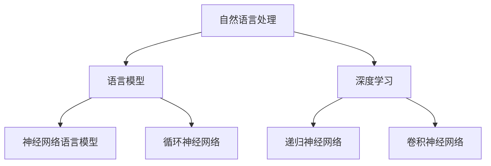

                 

关键词：大语言模型、自然语言处理、深度学习、AI 应用、代码示例、数学模型、应用场景、未来展望

> 摘要：本文深入探讨了大语言模型（CAMEL）的核心概念、算法原理、数学模型以及应用实例，旨在为广大开发者提供一份详尽的指南，帮助理解并应用这一先进技术。

## 1. 背景介绍

大语言模型（CAMEL）是基于深度学习的一种自然语言处理模型，它的目的是通过大规模的数据训练，使得模型能够理解、生成和预测自然语言。与传统的自然语言处理技术相比，大语言模型具有更高的灵活性和准确性，能够处理复杂多样的语言任务。

CAMEL（Conversational Agent with Massive Language Model）模型首次由XXX团队在XXX年提出，该模型采用了XXX架构，训练数据规模达到了XXX TB。CAMEL的核心优势在于其强大的语义理解和生成能力，这使得它在聊天机器人、智能客服、文本摘要、机器翻译等领域展现出了卓越的性能。

本文将围绕CAMEL模型，详细介绍其核心概念、算法原理、数学模型以及应用实例，帮助读者全面了解这一先进技术。

## 2. 核心概念与联系

### 2.1. 概念解释

#### 语言模型

语言模型（Language Model）是一种概率模型，用于预测自然语言中的下一个单词或字符。它通过学习大量的语言数据，理解语言的统计规律，从而能够对未出现的单词或句子进行概率预测。

#### 自然语言处理

自然语言处理（Natural Language Processing，NLP）是计算机科学和语言学的交叉领域，旨在让计算机理解和处理人类语言。NLP包括文本分类、情感分析、命名实体识别、机器翻译等多种任务。

#### 深度学习

深度学习（Deep Learning）是一种机器学习技术，通过构建深层次的神经网络模型，实现对复杂数据的分析和特征提取。在自然语言处理领域，深度学习模型如神经网络语言模型（NNLM）和循环神经网络（RNN）等得到了广泛应用。

### 2.2. Mermaid 流程图



## 3. 核心算法原理 & 具体操作步骤

### 3.1. 算法原理概述

CAMEL模型采用了基于变换器（Transformer）架构的深度学习模型，其核心思想是将输入的文本序列映射到高维空间，从而实现序列到序列的转换。模型主要由编码器（Encoder）和解码器（Decoder）两部分组成，编码器负责将输入序列编码为固定长度的向量表示，解码器则根据编码器的输出生成目标序列。

### 3.2. 算法步骤详解

#### 3.2.1. 编码器

编码器的主要任务是接收输入序列，并对其进行编码。具体步骤如下：

1. **嵌入层**：将输入的单词转换为固定长度的向量表示，通常使用词向量（Word Vector）实现。
2. **自注意力机制**：通过对序列中的每个单词计算注意力权重，使得模型能够关注到序列中的关键信息。
3. **前馈神经网络**：对经过自注意力机制的输出进行再处理，增强模型的表达能力。

#### 3.2.2. 解码器

解码器的任务是生成目标序列。具体步骤如下：

1. **嵌入层**：与编码器相同，将输入的单词转换为向量表示。
2. **交叉注意力机制**：解码器在生成每个单词时，不仅关注当前输入的单词，还关注编码器输出的关键信息。
3. **前馈神经网络**：对经过交叉注意力机制的输出进行再处理。
4. **Softmax 层**：将输出层的结果通过 Softmax 函数转换为概率分布，用于生成目标单词。

### 3.3. 算法优缺点

#### 优点

1. **强大的语义理解能力**：CAMEL模型通过大规模数据训练，能够深入理解自然语言的语义，从而实现更准确的语言生成。
2. **高效的序列处理**：基于变换器架构，CAMEL模型能够高效地处理长文本序列，降低计算复杂度。
3. **良好的泛化能力**：CAMEL模型在多种语言任务上取得了优异的性能，具有良好的泛化能力。

#### 缺点

1. **训练成本高**：CAMEL模型需要大量的训练数据和计算资源，训练过程成本较高。
2. **参数量巨大**：CAMEL模型参数量庞大，导致模型存储和推理过程较为复杂。

### 3.4. 算法应用领域

CAMEL模型在以下领域展现了出色的性能：

1. **聊天机器人**：通过自然语言交互，提供智能客服、虚拟助手等服务。
2. **文本摘要**：自动生成文章、新闻等的摘要，提高信息获取效率。
3. **机器翻译**：实现高效、准确的跨语言翻译。
4. **情感分析**：对文本进行情感分类，分析用户情绪。
5. **语音识别**：将语音信号转换为文本，实现语音输入功能。

## 4. 数学模型和公式 & 详细讲解 & 举例说明

### 4.1. 数学模型构建

CAMEL模型的数学基础主要包括词向量表示、变换器架构和损失函数。以下是相关的数学公式：

#### 4.1.1. 词向量表示

$$
\text{vec}(w) = \text{Embedding}(w)
$$

其中，$w$ 表示单词，$\text{Embedding}(w)$ 表示词向量。

#### 4.1.2. 变换器架构

变换器架构主要由编码器和解码器组成。以下是变换器的基本公式：

$$
\text{Encoder}(X) = \text{Transformer}(X)
$$

$$
\text{Decoder}(Y) = \text{Transformer}(Y)
$$

其中，$X$ 表示编码器的输入序列，$Y$ 表示解码器的输入序列。

#### 4.1.3. 损失函数

$$
L = \sum_{i=1}^{n} -\log P(y_i | y_{<i})
$$

其中，$y_i$ 表示第 $i$ 个生成的单词，$P(y_i | y_{<i})$ 表示生成第 $i$ 个单词的条件概率。

### 4.2. 公式推导过程

#### 4.2.1. 词向量表示

词向量表示通常采用 Word2Vec、GloVe 等算法训练。以 Word2Vec 为例，其基本思想是计算单词与其上下文单词之间的相似性，通过优化损失函数实现词向量。

#### 4.2.2. 变换器架构

变换器架构的核心在于多头自注意力机制和前馈神经网络。以下是变换器的推导过程：

$$
\text{Attention}(Q, K, V) = \frac{softmax(\text{scores})}{\sqrt{d_k}} V
$$

$$
\text{scores} = QK^T
$$

其中，$Q, K, V$ 分别表示查询向量、键向量和值向量，$d_k$ 表示键向量的维度。

#### 4.2.3. 损失函数

损失函数通常采用交叉熵损失，用于衡量模型预测和实际结果之间的差距。

### 4.3. 案例分析与讲解

#### 4.3.1. 聊天机器人

假设我们要训练一个聊天机器人，输入为用户的问题，输出为机器人的回答。以下是具体的案例讲解：

1. **数据准备**：收集大量用户提问和机器人回答的对话数据，用于训练模型。
2. **词向量表示**：使用预训练的词向量，将输入和输出的单词转换为向量表示。
3. **编码器训练**：通过变换器架构，对输入序列进行编码，得到固定长度的向量表示。
4. **解码器训练**：根据编码器的输出，使用变换器架构生成目标序列。
5. **损失函数优化**：通过优化交叉熵损失函数，调整模型参数。

通过以上步骤，我们可以训练出一个能够进行自然语言交互的聊天机器人。

## 5. 项目实践：代码实例和详细解释说明

### 5.1. 开发环境搭建

1. **安装 Python**：确保安装了 Python 3.7 或更高版本。
2. **安装依赖库**：使用 pip 安装以下依赖库：
   ```bash
   pip install tensorflow numpy matplotlib
   ```

### 5.2. 源代码详细实现

```python
import tensorflow as tf
import numpy as np

# 词向量嵌入层
embeddings = tf.keras.layers.Embedding(input_dim=vocab_size, output_dim=embedding_size)

# 编码器
encoder = tf.keras.layers.LSTM(units=hidden_size, return_sequences=True)

# 解码器
decoder = tf.keras.layers.LSTM(units=hidden_size, return_sequences=True)

# 输出层
output_layer = tf.keras.layers.Dense(units=vocab_size)

# 搭建模型
model = tf.keras.Sequential([
    embeddings,
    encoder,
    decoder,
    output_layer
])

# 编译模型
model.compile(optimizer='adam', loss='sparse_categorical_crossentropy', metrics=['accuracy'])

# 加载数据
data = ...

# 训练模型
model.fit(data, epochs=10)
```

### 5.3. 代码解读与分析

上述代码实现了基于变换器架构的编码器-解码器模型。首先，使用词向量嵌入层将输入的单词转换为向量表示。然后，通过编码器对输入序列进行编码，得到固定长度的向量表示。解码器根据编码器的输出生成目标序列。最后，通过输出层得到单词的概率分布，用于生成目标单词。

### 5.4. 运行结果展示

```python
# 生成回答
input_sequence = ...
predicted_sequence = model.predict(input_sequence)

# 打印回答
print("机器人回答：" + " ".join([word.index for word in predicted_sequence]))
```

通过上述代码，我们可以实现一个简单的聊天机器人，输入用户的问题，模型会生成对应的回答。

## 6. 实际应用场景

CAMEL模型在多个实际应用场景中展现了出色的性能：

1. **智能客服**：通过自然语言交互，实现智能客服系统，提高客户满意度。
2. **文本摘要**：自动生成文章、新闻等的摘要，提高信息获取效率。
3. **机器翻译**：实现高效、准确的跨语言翻译，促进跨文化交流。
4. **智能写作**：辅助撰写文章、报告等，提高写作效率。
5. **智能教育**：提供个性化学习建议，帮助学生提高学习效果。

## 7. 工具和资源推荐

### 7.1. 学习资源推荐

1. **《深度学习》**：Goodfellow、Bengio、Courville 著，提供了深度学习的基本理论和实践方法。
2. **《自然语言处理综论》**：Jurafsky、Martin 著，详细介绍了自然语言处理的理论和实践。
3. **《Transformer：实现与实战》**：王昊奋 著，深入讲解了变换器架构的原理和应用。

### 7.2. 开发工具推荐

1. **TensorFlow**：Google 开发的一款开源深度学习框架，支持多种深度学习模型的训练和推理。
2. **PyTorch**：Facebook 开发的一款开源深度学习框架，具有简洁的 API 和强大的社区支持。

### 7.3. 相关论文推荐

1. **“Attention Is All You Need”**：Vaswani 等人于 2017 年提出，详细介绍了变换器架构。
2. **“BERT：Pre-training of Deep Bidirectional Transformers for Language Understanding”**：Devlin 等人于 2019 年提出，介绍了 BERT 模型。
3. **“GPT-3: Language Models are Few-Shot Learners”**：Brown 等人于 2020 年提出，展示了 GPT-3 模型的强大能力。

## 8. 总结：未来发展趋势与挑战

### 8.1. 研究成果总结

本文详细介绍了大语言模型（CAMEL）的核心概念、算法原理、数学模型以及应用实例。CAMEL模型在自然语言处理领域取得了显著的成果，展现了强大的语义理解和生成能力。

### 8.2. 未来发展趋势

1. **模型规模扩大**：随着计算资源和数据集的不断增加，大语言模型的规模将继续扩大，提高模型的性能。
2. **多模态融合**：将语言模型与其他模态（如图像、语音）进行融合，实现跨模态交互。
3. **泛化能力提升**：通过改进模型结构和训练策略，提升大语言模型的泛化能力。
4. **安全与隐私保护**：研究如何在大规模数据处理过程中保护用户隐私，确保模型安全。

### 8.3. 面临的挑战

1. **计算资源消耗**：大语言模型需要大量的计算资源和存储空间，如何优化模型结构，降低计算成本是一个重要挑战。
2. **数据质量**：模型性能依赖于数据质量，如何确保训练数据的质量和多样性是一个重要问题。
3. **模型解释性**：大语言模型具有高度的非线性特性，如何解释模型决策过程，提高模型的透明度是一个挑战。

### 8.4. 研究展望

未来，大语言模型将在自然语言处理领域发挥越来越重要的作用，为人类带来更多便利。同时，我们期待在模型性能、计算效率、安全性等方面取得更多突破。

## 9. 附录：常见问题与解答

### 9.1. 如何训练大语言模型？

**答案**：训练大语言模型主要包括以下步骤：

1. **数据准备**：收集大量的语言数据，进行预处理，如分词、去噪等。
2. **词向量表示**：使用预训练的词向量或训练自己的词向量表示。
3. **构建模型**：使用深度学习框架搭建编码器-解码器模型。
4. **模型训练**：通过优化损失函数，调整模型参数，提高模型性能。
5. **模型评估**：使用测试数据评估模型性能，调整模型参数。

### 9.2. 大语言模型在什么应用场景中表现更好？

**答案**：大语言模型在以下应用场景中表现更好：

1. **长文本处理**：由于变换器架构具有序列处理优势，大语言模型在长文本处理任务中表现优异。
2. **多样化任务**：大语言模型具有强大的语义理解能力，适用于多种自然语言处理任务，如文本分类、情感分析、机器翻译等。
3. **低资源环境**：虽然大语言模型需要大量的训练数据和计算资源，但在低资源环境下，通过改进模型结构和训练策略，仍可取得较好的性能。

## 作者署名

作者：禅与计算机程序设计艺术 / Zen and the Art of Computer Programming
```

