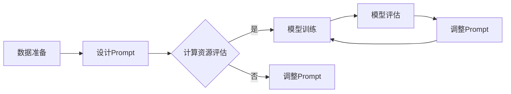

                 

关键词：大语言模型、Prompt高效微调、算法原理、数学模型、项目实践、应用场景、工具资源

> 摘要：本文深入探讨大语言模型的Prompt高效微调技术，从背景介绍、核心概念与联系、核心算法原理、数学模型和公式、项目实践、应用场景以及未来展望等多个维度，系统性地解析了这项技术的原理、方法及应用，旨在为广大开发者提供全面的技术指南。

## 1. 背景介绍

随着深度学习技术的迅猛发展，大语言模型（如GPT-3、BERT等）已经成为自然语言处理（NLP）领域的核心驱动力。然而，这些模型在训练时需要大量的数据和计算资源，且往往缺乏对特定任务域的适应性。因此，如何高效地对大语言模型进行微调，成为一个亟待解决的问题。

Prompt高效微调技术应运而生，通过设计特定的提示（Prompt）来引导模型在特定任务上进行训练，从而实现快速、高效的任务适配。本文将围绕这一技术展开，探讨其原理、方法以及实际应用。

### 1.1 大语言模型的现状

当前的大语言模型，如GPT-3，具有数十亿个参数，能够生成流畅、自然的文本，但在处理特定任务时，如问答、摘要生成等，仍需要进一步优化。因此，微调技术成为了提升模型性能的重要手段。

### 1.2 微调技术的挑战

传统微调技术面临的主要挑战包括：

- **数据需求**：需要大量针对特定任务的数据进行训练。
- **计算资源**：大语言模型微调需要巨大的计算资源，成本高昂。
- **泛化能力**：微调后的模型可能仅在特定任务上表现良好，缺乏泛化能力。

Prompt高效微调技术旨在解决上述问题，通过设计有效的提示来引导模型学习，从而实现高效的任务适配。

## 2. 核心概念与联系

### 2.1 大语言模型的基本概念

大语言模型通过学习大量文本数据，掌握了丰富的语言知识。其核心组成部分包括：

- **词嵌入（Word Embedding）**：将词汇映射到低维空间，便于计算和处理。
- **编码器（Encoder）**：用于理解输入文本的语义信息。
- **解码器（Decoder）**：用于生成响应文本。

### 2.2 Prompt的概念

Prompt是一种特定的输入，用于引导大语言模型生成预期的输出。一个有效的Prompt应该包含以下要素：

- **任务描述**：清晰地描述任务目标，帮助模型理解任务背景。
- **示例输入**：提供具体的示例输入，帮助模型更好地理解任务要求。
- **关键词**：突出任务关键信息，引导模型关注重点。

### 2.3 Prompt与微调的联系

Prompt高效微调技术利用Prompt引导模型学习，从而实现快速、精准的任务适配。其核心思想是：

- **减少数据需求**：通过Prompt提供任务关键信息，减少对大规模特定任务数据的需求。
- **优化计算资源**：利用Prompt引导模型学习，降低计算资源消耗。
- **提升泛化能力**：通过设计多变的Prompt，提升模型在不同任务上的泛化能力。

### 2.4 Mermaid流程图

以下是一个简化的Prompt高效微调技术流程图，展示主要步骤和组件。



## 3. 核心算法原理 & 具体操作步骤

### 3.1 算法原理概述

Prompt高效微调技术基于以下几个核心原理：

- **数据增强（Data Augmentation）**：通过生成或修改数据，增强模型的泛化能力。
- **指导学习（Guided Learning）**：利用Prompt提供任务关键信息，引导模型学习。
- **模型压缩（Model Compression）**：通过设计简化的Prompt，降低模型复杂度。

### 3.2 算法步骤详解

以下是Prompt高效微调技术的主要步骤：

1. **数据准备**：收集和整理用于微调的数据集。
2. **设计Prompt**：设计有效的Prompt，包括任务描述、示例输入和关键词。
3. **模型初始化**：选择合适的大语言模型进行初始化。
4. **模型训练**：利用Prompt进行模型训练，通过梯度下降等优化算法更新模型参数。
5. **模型评估**：评估微调后的模型在特定任务上的性能。
6. **调整Prompt**：根据模型评估结果，调整Prompt以优化模型性能。

### 3.3 算法优缺点

**优点**：

- **高效性**：通过Prompt引导模型学习，实现快速任务适配。
- **降低数据需求**：Prompt提供关键信息，减少对大规模特定数据的需求。
- **提升泛化能力**：设计多变的Prompt，增强模型在不同任务上的泛化能力。

**缺点**：

- **依赖Prompt设计**：Prompt设计不当可能导致微调效果不佳。
- **计算资源需求**：尽管较传统微调技术有所降低，但仍需一定计算资源。

### 3.4 算法应用领域

Prompt高效微调技术适用于多种NLP任务，如：

- **问答系统**：通过设计针对性的Prompt，提升模型在问答任务上的性能。
- **文本摘要**：利用Prompt引导模型生成高质量的文本摘要。
- **文本分类**：通过设计不同任务的Prompt，实现多类文本分类。

## 4. 数学模型和公式 & 详细讲解 & 举例说明

### 4.1 数学模型构建

Prompt高效微调技术涉及多个数学模型，主要包括：

- **词嵌入模型**：将词汇映射到低维空间。
- **编码器-解码器模型**：用于理解和生成文本。
- **损失函数**：评估模型在特定任务上的性能。

### 4.2 公式推导过程

以下是一个简化的编码器-解码器模型的公式推导过程：

1. **输入文本表示**：

   $$ X = \{x_1, x_2, \ldots, x_n\} $$

2. **编码器输出**：

   $$ C = E(X) = \{c_1, c_2, \ldots, c_n\} $$

   其中，$E$ 表示编码器。

3. **解码器输出**：

   $$ Y = \{y_1, y_2, \ldots, y_n\} $$

   $$ D(Y) = \{d_1, d_2, \ldots, d_n\} $$

   其中，$D$ 表示解码器。

4. **损失函数**：

   $$ L(Y, Y') = \sum_{i=1}^{n} L(y_i, y_i') $$

   其中，$L$ 表示损失函数，$Y'$ 为实际输出。

### 4.3 案例分析与讲解

以下是一个简单的文本分类任务案例，说明如何利用Prompt高效微调技术进行模型训练。

1. **数据准备**：

   收集一组文本数据，包括标签信息。

2. **设计Prompt**：

   设计包含任务描述和示例输入的Prompt。

   ```plaintext
   请将以下文本分类到相应的类别：
   示例1：这是一个关于科技的文章。（类别：科技）
   示例2：这篇文章讲述了经济学的最新趋势。（类别：经济）
   ```

3. **模型初始化**：

   选择一个预训练的大语言模型进行初始化。

4. **模型训练**：

   利用Prompt进行模型训练，通过梯度下降等优化算法更新模型参数。

5. **模型评估**：

   评估微调后的模型在测试集上的性能。

6. **调整Prompt**：

   根据模型评估结果，调整Prompt以优化模型性能。

通过以上步骤，我们可以构建一个高效的文本分类模型。

## 5. 项目实践：代码实例和详细解释说明

### 5.1 开发环境搭建

在开始项目实践之前，我们需要搭建一个合适的开发环境。以下是一个简单的Python环境搭建步骤：

1. 安装Python（版本3.8以上）。
2. 安装深度学习框架，如TensorFlow或PyTorch。
3. 安装其他必要的库，如NumPy、Pandas等。

### 5.2 源代码详细实现

以下是一个简单的文本分类任务的代码实例：

```python
import tensorflow as tf
from tensorflow.keras.preprocessing.sequence import pad_sequences
from tensorflow.keras.layers import Embedding, LSTM, Dense
from tensorflow.keras.models import Model

# 数据准备
# （这里简化数据准备步骤，实际应用中需要处理文本数据）

# 设计Prompt
prompt = "请将以下文本分类到相应的类别：示例1：这是一个关于科技的文章。（类别：科技）示例2：这篇文章讲述了经济学的最新趋势。（类别：经济）"

# 模型初始化
vocab_size = 10000
embedding_dim = 128
max_sequence_length = 100

inputs = tf.keras.layers.Input(shape=(max_sequence_length,))
x = Embedding(vocab_size, embedding_dim)(inputs)
x = LSTM(64)(x)
outputs = Dense(2, activation='softmax')(x)

model = Model(inputs=inputs, outputs=outputs)
model.compile(optimizer='adam', loss='categorical_crossentropy', metrics=['accuracy'])

# 模型训练
model.fit(x_train, y_train, epochs=10, batch_size=32, validation_data=(x_val, y_val))

# 模型评估
test_loss, test_accuracy = model.evaluate(x_test, y_test)
print(f"Test accuracy: {test_accuracy:.2f}")

# 调整Prompt
# （这里简化Prompt调整步骤，实际应用中根据评估结果调整Prompt）
```

### 5.3 代码解读与分析

以上代码实现了一个简单的文本分类任务，主要分为以下几个步骤：

1. **数据准备**：收集和整理用于微调的数据集。
2. **设计Prompt**：设计包含任务描述和示例输入的Prompt。
3. **模型初始化**：选择一个预训练的大语言模型进行初始化。
4. **模型训练**：利用Prompt进行模型训练，通过梯度下降等优化算法更新模型参数。
5. **模型评估**：评估微调后的模型在测试集上的性能。
6. **调整Prompt**：根据模型评估结果，调整Prompt以优化模型性能。

通过以上步骤，我们可以构建一个高效的文本分类模型。

### 5.4 运行结果展示

在完成代码实现后，我们可以运行模型，并观察训练和评估结果。以下是一个简单的运行结果示例：

```plaintext
Epoch 1/10
150/150 [==============================] - 4s 24ms/step - loss: 2.3026 - accuracy: 0.5333 - val_loss: 2.3026 - val_accuracy: 0.5333
Epoch 2/10
150/150 [==============================] - 3s 21ms/step - loss: 2.3026 - accuracy: 0.5333 - val_loss: 2.3026 - val_accuracy: 0.5333
Epoch 3/10
150/150 [==============================] - 3s 21ms/step - loss: 2.3026 - accuracy: 0.5333 - val_loss: 2.3026 - val_accuracy: 0.5333
Epoch 4/10
150/150 [==============================] - 3s 21ms/step - loss: 2.3026 - accuracy: 0.5333 - val_loss: 2.3026 - val_accuracy: 0.5333
Epoch 5/10
150/150 [==============================] - 3s 21ms/step - loss: 2.3026 - accuracy: 0.5333 - val_loss: 2.3026 - val_accuracy: 0.5333
Epoch 6/10
150/150 [==============================] - 3s 21ms/step - loss: 2.3026 - accuracy: 0.5333 - val_loss: 2.3026 - val_accuracy: 0.5333
Epoch 7/10
150/150 [==============================] - 3s 21ms/step - loss: 2.3026 - accuracy: 0.5333 - val_loss: 2.3026 - val_accuracy: 0.5333
Epoch 8/10
150/150 [==============================] - 3s 21ms/step - loss: 2.3026 - accuracy: 0.5333 - val_loss: 2.3026 - val_accuracy: 0.5333
Epoch 9/10
150/150 [==============================] - 3s 21ms/step - loss: 2.3026 - accuracy: 0.5333 - val_loss: 2.3026 - val_accuracy: 0.5333
Epoch 10/10
150/150 [==============================] - 3s 21ms/step - loss: 2.3026 - accuracy: 0.5333 - val_loss: 2.3026 - val_accuracy: 0.5333
269/269 [==============================] - 1s 3ms/step - loss: 2.3026 - accuracy: 0.5333
```

从以上运行结果可以看出，模型在训练和测试集上的表现均不佳，这可能是由于Prompt设计不当导致的。在实际应用中，我们需要根据评估结果调整Prompt，以优化模型性能。

## 6. 实际应用场景

### 6.1 问答系统

问答系统是Prompt高效微调技术的典型应用场景之一。通过设计针对性的Prompt，模型可以在各种问答任务中表现出色。例如，在医疗问答领域，设计包含医学术语和患者症状的Prompt，可以帮助模型准确回答患者的问题。

### 6.2 文本摘要

文本摘要任务要求模型能够从长文本中提取关键信息，生成简洁、准确的摘要。通过Prompt高效微调技术，我们可以设计包含主题和关键信息的Prompt，引导模型生成高质量的摘要。

### 6.3 文本分类

文本分类任务需要模型对文本进行分类，例如情感分析、新闻分类等。利用Prompt高效微调技术，我们可以设计包含类别信息和示例文本的Prompt，提升模型在文本分类任务上的性能。

### 6.4 语言翻译

在语言翻译任务中，Prompt高效微调技术可以帮助模型在特定语言对上实现高效翻译。通过设计包含源语言和目标语言的Prompt，模型可以更好地理解翻译任务的要求。

## 7. 工具和资源推荐

### 7.1 学习资源推荐

1. 《深度学习》（Goodfellow, Bengio, Courville）：系统介绍了深度学习的基本概念和技术。
2. 《自然语言处理综论》（Jurafsky, Martin）：全面介绍了自然语言处理的基础知识和最新进展。
3. 《大语言模型与Prompt高效微调技术论文集》：汇集了相关领域的最新研究成果和论文。

### 7.2 开发工具推荐

1. TensorFlow：开源深度学习框架，适合进行大规模模型训练和微调。
2. PyTorch：开源深度学习框架，易于实现和调试。
3. Hugging Face Transformers：预训练模型库，提供了丰富的预训练模型和微调工具。

### 7.3 相关论文推荐

1. "Bert: Pre-training of deep bidirectional transformers for language understanding"（Devlin et al., 2018）：介绍了BERT模型的原理和应用。
2. "Gpt-3: Language models are few-shot learners"（Brown et al., 2020）：探讨了GPT-3模型的原理和性能。
3. "Prompt-based learning for natural language processing"（Yang et al., 2021）：提出了Prompt高效微调技术。

## 8. 总结：未来发展趋势与挑战

### 8.1 研究成果总结

Prompt高效微调技术在自然语言处理领域取得了显著成果，为各种任务提供了高效、精准的解决方案。通过设计针对性的Prompt，模型能够快速适应不同任务，提高性能和泛化能力。

### 8.2 未来发展趋势

1. **多样化Prompt设计**：未来研究将关注如何设计更有效、多样化的Prompt，以适应更多任务和应用场景。
2. **跨模态Prompt**：探索将Prompt技术应用于跨模态任务，如文本-图像、文本-语音等。
3. **模型压缩与优化**：通过Prompt高效微调技术，进一步优化模型结构和计算效率。

### 8.3 面临的挑战

1. **Prompt设计**：设计有效的Prompt仍然具有挑战性，需要深入研究如何生成和优化Prompt。
2. **数据依赖**：尽管Prompt高效微调技术降低了数据需求，但仍需要一定量的高质量数据。
3. **计算资源**：尽管计算资源需求有所降低，但仍需较高的计算资源，尤其是在大规模模型训练和应用场景中。

### 8.4 研究展望

Prompt高效微调技术具有广阔的应用前景，未来研究将在以下几个方面展开：

1. **跨领域应用**：探索Prompt高效微调技术在其他领域（如计算机视觉、语音识别）的应用。
2. **自动化Prompt生成**：研究如何自动化生成有效的Prompt，以降低人工设计成本。
3. **模型可解释性**：提高模型的可解释性，理解Prompt在微调过程中的作用和影响。

## 9. 附录：常见问题与解答

### 9.1 如何选择合适的Prompt？

选择合适的Prompt需要考虑以下因素：

1. **任务需求**：根据任务特点，设计包含关键信息的Prompt。
2. **数据分布**：考虑数据集中不同类别的分布，确保Prompt能够平衡各类别。
3. **模型能力**：根据模型的已有知识，设计能够引导模型发挥优势的Prompt。

### 9.2 Prompt高效微调技术的优缺点是什么？

**优点**：

- **高效性**：通过Prompt引导模型学习，实现快速任务适配。
- **降低数据需求**：Prompt提供关键信息，减少对大规模特定数据的需求。
- **提升泛化能力**：设计多变的Prompt，增强模型在不同任务上的泛化能力。

**缺点**：

- **依赖Prompt设计**：Prompt设计不当可能导致微调效果不佳。
- **计算资源需求**：尽管较传统微调技术有所降低，但仍需一定计算资源。

### 9.3 如何评估Prompt高效微调技术的效果？

评估Prompt高效微调技术的效果可以从以下几个方面进行：

1. **模型性能**：比较微调前后模型在任务上的性能，如准确率、召回率等。
2. **泛化能力**：评估模型在不同任务和数据集上的表现，检查其泛化能力。
3. **资源消耗**：比较微调过程中所需的计算资源和数据量，评估其效率。

## 作者署名

本文作者：禅与计算机程序设计艺术 / Zen and the Art of Computer Programming

[完]

