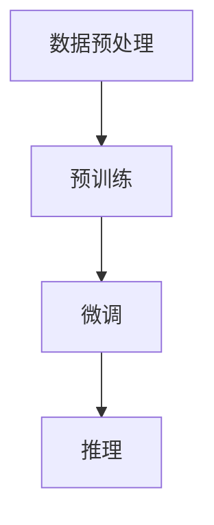

                 

在当今信息技术迅猛发展的时代，人工智能（AI）已经成为推动社会进步的重要力量。其中，大语言模型（Large Language Model）作为自然语言处理（NLP）领域的一项关键技术，正逐步改变着人们的日常生活和工作方式。本文将为您呈现大语言模型的应用指南，从人工智能的起源到大语言模型的最新发展。

## 文章关键词

- 人工智能
- 大语言模型
- 自然语言处理
- 深度学习
- 机器学习
- 计算机科学

## 文章摘要

本文旨在系统地介绍大语言模型的发展历程、核心概念、算法原理、数学模型以及实际应用。通过对大语言模型的深入分析，帮助读者理解这一技术如何从理论上奠基，到实际应用中的突破。文章还将探讨大语言模型在各个领域的应用前景，以及未来发展的趋势和挑战。

### 1. 背景介绍

### 1.1 人工智能的起源与发展

人工智能（AI）起源于20世纪50年代，随着计算机技术的快速发展，AI研究领域迅速崛起。早期的人工智能研究主要集中在规则推理和知识表示上，如专家系统和逻辑编程。然而，这些方法在面对复杂、不确定的自然语言任务时显得力不从心。

随着深度学习（Deep Learning）和神经网络（Neural Networks）的兴起，人工智能进入了一个新的阶段。深度学习通过模拟人脑的神经网络结构，使得计算机能够通过大量数据自动学习特征和模式。这一技术的突破为自然语言处理带来了革命性的变化。

### 1.2 自然语言处理的发展历程

自然语言处理（NLP）作为人工智能的一个重要分支，其发展历程同样充满了挑战和突破。早期的NLP研究主要集中在基于规则的方法上，如词汇分析和句法分析。然而，这些方法在面对大规模、复杂的语言数据时存在诸多局限。

20世纪90年代，统计方法开始在NLP中得到应用。通过训练大规模的统计模型，如隐马尔可夫模型（HMM）和条件随机场（CRF），NLP的性能得到了显著提升。然而，这些模型仍然依赖于大量手工特征工程，且在面对长文本和复杂语义时存在局限性。

进入21世纪，深度学习技术的引入为NLP带来了新的契机。基于深度神经网络的模型，如循环神经网络（RNN）和卷积神经网络（CNN），使得NLP任务的处理能力得到了质的飞跃。特别是在自然语言生成（NLG）和机器翻译等任务上，深度学习模型表现出了卓越的性能。

### 1.3 大语言模型的出现

大语言模型（Large Language Model）的出现标志着自然语言处理领域的一个重要里程碑。与传统的小型语言模型不同，大语言模型具有更大的参数规模和更强的表示能力。这些模型能够通过自主学习大量的语言数据，自动发现语言的复杂规律和语义关系。

2018年，谷歌发布了BERT（Bidirectional Encoder Representations from Transformers），这是第一个大规模的预训练语言模型，参数规模达到了10亿级别。BERT的出现引起了广泛关注，并在多个NLP任务上刷新了基准性能。

随后的几年里，微软、百度、阿里巴巴等公司纷纷推出了各自的大语言模型，如GPT、Turing-NLG、ERT等。这些模型在参数规模、训练数据量以及性能表现上不断突破，推动了自然语言处理技术的快速发展。

### 1.4 大语言模型的应用领域

大语言模型在自然语言处理领域具有广泛的应用前景。以下是一些主要的应用领域：

- **文本分类**：通过训练大语言模型，可以对文本进行分类，如情感分析、新闻分类等。大语言模型能够捕捉文本中的复杂语义信息，从而实现更准确的分类结果。
- **问答系统**：大语言模型可以用于构建问答系统，如智能客服、智能助手等。通过训练模型，可以使系统能够理解和回答用户提出的问题，提供个性化的服务。
- **机器翻译**：大语言模型在机器翻译任务上具有显著优势。通过训练大型语言模型，可以实现高质量、流畅的翻译结果，特别是在长文本翻译和跨语言语义理解方面。
- **文本生成**：大语言模型可以用于生成各种类型的文本，如文章、新闻、诗歌等。这些生成的文本在内容上具有连贯性和逻辑性，可以用于自动写作、内容生成等领域。
- **对话系统**：大语言模型可以用于构建智能对话系统，如聊天机器人、虚拟助手等。通过训练模型，可以使对话系统能够与用户进行自然、流畅的对话，提供个性化的服务。

总之，大语言模型的出现为自然语言处理领域带来了新的机遇和挑战。随着技术的不断进步和应用场景的不断拓展，大语言模型将在未来的自然语言处理领域中发挥越来越重要的作用。

### 2. 核心概念与联系

#### 2.1 人工智能与自然语言处理

人工智能（AI）和自然语言处理（NLP）是紧密相关的领域。人工智能是指通过计算机模拟人类智能的学科，而自然语言处理是NLP是人工智能的一个重要分支，专注于使计算机能够理解和生成自然语言。

自然语言处理的任务可以分为文本理解和文本生成。文本理解包括情感分析、文本分类、命名实体识别、关系抽取等任务；文本生成包括机器翻译、文本摘要、自动写作等任务。大语言模型在这些任务中表现出色，能够通过自主学习大量语言数据，自动发现语言的复杂规律和语义关系。

#### 2.2 深度学习与神经网络

深度学习是人工智能的一个重要分支，其核心思想是通过模拟人脑的神经网络结构，使计算机能够通过大量数据自动学习特征和模式。神经网络是一种由多层神经元组成的计算模型，通过前向传播和反向传播算法，可以实现自动特征提取和分类。

深度学习在自然语言处理领域得到了广泛应用。循环神经网络（RNN）、卷积神经网络（CNN）、 Transformer模型等都是深度学习在NLP中的重要应用。RNN通过记忆序列信息，能够处理变长的序列数据，如文本和语音；CNN通过卷积操作，能够捕捉局部特征，如词向量和文本特征；Transformer模型通过自注意力机制，能够全局捕捉文本信息，提高了模型的表示能力和性能。

#### 2.3 大语言模型的架构

大语言模型的架构通常包括两个阶段：预训练和微调。

在预训练阶段，模型通过大量无监督的数据进行训练，学习语言的通用特征和规律。预训练数据可以是互联网上的大规模文本、新闻、书籍等。预训练的目标是使模型能够捕捉到语言中的复杂结构和语义信息。

在微调阶段，模型根据特定任务进行有监督的训练，通过标注的数据来优化模型的参数。微调的过程可以使模型在特定任务上达到更高的性能。微调的数据可以是问答对、分类标签等。

#### 2.4 大语言模型的原理

大语言模型的原理主要基于深度学习，特别是Transformer模型。Transformer模型是一种基于自注意力机制的神经网络模型，通过全局捕捉文本信息，实现了高效的文本表示和学习。

自注意力机制是一种计算文本序列中每个词与其他词之间关系的机制。在Transformer模型中，每个词的表示向量通过自注意力机制与文本序列中的其他词进行加权求和，得到一个综合的表示向量。这个向量包含了该词与其他词之间的语义关系，从而提高了模型的表示能力。

在预训练阶段，大语言模型通过大量无监督数据学习语言特征，并通过自注意力机制捕捉文本中的复杂结构。在微调阶段，模型通过有监督数据学习特定任务的知识，进一步提高性能。

#### 2.5 大语言模型的工作流程

大语言模型的工作流程可以分为以下几个步骤：

1. **数据预处理**：将原始文本数据转换为模型可以处理的格式，如词向量和序列编码。
2. **预训练**：使用大量无监督数据对模型进行预训练，学习语言特征和结构。
3. **微调**：使用有监督数据对模型进行微调，优化模型在特定任务上的性能。
4. **推理**：将输入文本输入到模型中，通过解码得到输出结果，如分类标签、翻译结果等。

大语言模型的工作流程如图1所示：



### 3. 核心算法原理 & 具体操作步骤

#### 3.1 算法原理概述

大语言模型的算法原理主要基于深度学习和Transformer模型。Transformer模型是一种基于自注意力机制的神经网络模型，通过全局捕捉文本信息，实现了高效的文本表示和学习。

自注意力机制是一种计算文本序列中每个词与其他词之间关系的机制。在Transformer模型中，每个词的表示向量通过自注意力机制与文本序列中的其他词进行加权求和，得到一个综合的表示向量。这个向量包含了该词与其他词之间的语义关系，从而提高了模型的表示能力。

大语言模型通过预训练和微调两个阶段来学习和优化。在预训练阶段，模型通过大量无监督数据学习语言特征和结构。在微调阶段，模型通过有监督数据学习特定任务的知识，进一步提高性能。

#### 3.2 算法步骤详解

大语言模型的算法步骤可以分为以下几个阶段：

1. **数据预处理**：将原始文本数据转换为模型可以处理的格式。这一步骤通常包括分词、词向量化、序列编码等操作。分词是将文本分割成一个个单词或短语；词向量化是将单词或短语映射为一个固定的向量表示；序列编码是将文本序列转换为一个数字序列，以便模型进行训练和处理。

2. **预训练**：使用大量无监督数据对模型进行预训练，学习语言特征和结构。预训练通常包括以下步骤：

   - **Masked Language Model（MLM）**：在预训练数据中，随机选择一部分词进行遮掩，然后模型需要预测这些遮掩的词。这一步骤有助于模型学习语言的词法和语义信息。
   - **Next Sentence Prediction（NSP）**：输入两个连续的句子，模型需要预测第二个句子是否是第一个句子的下一个句子。这一步骤有助于模型学习句子之间的关系和连贯性。

3. **微调**：使用有监督数据对模型进行微调，优化模型在特定任务上的性能。微调的步骤通常包括：

   - **数据预处理**：与预训练阶段类似，将有监督数据（如问答对、分类标签等）转换为模型可以处理的格式。
   - **训练**：将预处理后的数据输入模型，通过反向传播算法和优化器（如Adam）进行训练。训练过程中，模型会不断调整参数，以最小化损失函数。
   - **评估**：在训练过程中，定期评估模型的性能，如准确率、召回率等。根据评估结果调整训练策略，如学习率、批量大小等。

4. **推理**：将输入文本输入到模型中，通过解码得到输出结果。例如，在问答系统中，输入问题，模型输出答案；在文本生成中，输入提示文本，模型输出完整的文本。

#### 3.3 算法优缺点

**优点**：

- **强大的表示能力**：大语言模型通过自注意力机制和多层神经网络结构，能够全局捕捉文本信息，具有强大的表示能力。
- **多任务学习**：大语言模型可以通过预训练和微调的方式，学习多种语言任务，实现多任务学习，提高模型的泛化能力。
- **高效处理长文本**：大语言模型能够处理变长的文本序列，不受文本长度的限制，能够高效处理长文本。

**缺点**：

- **计算资源需求高**：大语言模型通常需要大量的计算资源进行训练和推理，对硬件设备有较高要求。
- **数据依赖性强**：大语言模型依赖于大量的训练数据进行预训练和微调，数据的质量和数量对模型性能有较大影响。
- **解释性差**：大语言模型通过复杂神经网络学习，模型内部的决策过程较为复杂，难以解释和理解。

#### 3.4 算法应用领域

大语言模型在自然语言处理领域具有广泛的应用。以下是一些主要的应用领域：

- **文本分类**：大语言模型可以用于情感分析、新闻分类等任务，通过预测文本的类别标签，实现文本分类。
- **问答系统**：大语言模型可以用于构建智能问答系统，通过理解用户的问题和上下文，提供准确的答案。
- **机器翻译**：大语言模型在机器翻译任务中表现出色，能够实现高质量、流畅的跨语言翻译。
- **文本生成**：大语言模型可以用于生成各种类型的文本，如文章、新闻、诗歌等，实现文本自动写作。
- **对话系统**：大语言模型可以用于构建智能对话系统，如聊天机器人、虚拟助手等，与用户进行自然、流畅的对话。

总之，大语言模型作为自然语言处理领域的一项关键技术，具有广泛的应用前景。随着技术的不断进步和应用场景的不断拓展，大语言模型将在未来的自然语言处理领域中发挥越来越重要的作用。

### 4. 数学模型和公式 & 详细讲解 & 举例说明

#### 4.1 数学模型构建

大语言模型的数学模型主要包括两个核心部分：词向量和自注意力机制。

**1. 词向量**

词向量是一种将单词映射为一个固定维度向量的方法，用于表示单词的语义信息。词向量的构建通常基于词嵌入（Word Embedding）技术，如Word2Vec、GloVe等。这些方法通过训练模型，使得词向量在语义上具有相似的单词在向量空间中距离较近，从而实现语义相似性的度量。

**2. 自注意力机制**

自注意力机制是一种计算文本序列中每个词与其他词之间关系的机制。在Transformer模型中，每个词的表示向量通过自注意力机制与文本序列中的其他词进行加权求和，得到一个综合的表示向量。自注意力机制通过计算词与词之间的相似度，捕捉文本中的复杂结构和语义关系。

#### 4.2 公式推导过程

**1. 词向量表示**

假设词汇表V中包含N个单词，每个单词对应的词向量维度为D。词向量w_i可以表示为：

\[ w_i = \text{vec}(v_i) \]

其中，vec(·)表示将单词v_i映射为一个D维的向量。

**2. 自注意力计算**

自注意力计算的核心公式为：

\[ \text{Attention}(Q, K, V) = \text{softmax}\left(\frac{QK^T}{\sqrt{d_k}}\right)V \]

其中，Q、K和V分别表示查询向量、键向量和值向量，d_k表示键向量的维度。QK^T表示查询向量和键向量的点积，softmax函数用于归一化点积结果，使其成为概率分布。最终，通过加权求和V，得到自注意力结果。

**3. Transformer模型**

Transformer模型由多个自注意力层和全连接层组成。每个自注意力层包括多头自注意力机制和前馈神经网络。假设模型包含L个自注意力层，则Transformer模型的输出可以表示为：

\[ \text{Transformer}(X) = \text{LayerNorm}(X + \text{MultiHeadAttention}(X, X, X)) + \text{LayerNorm}(X + \text{FFN}(\text{MultiHeadAttention}(X, X, X))) \]

其中，X表示输入文本序列，MultiHeadAttention表示多头自注意力机制，FFN表示前馈神经网络，LayerNorm表示层归一化。

#### 4.3 案例分析与讲解

**1. 情感分析**

情感分析是一种常见的文本分类任务，通过分析文本的情感倾向，判断文本是积极、消极还是中性。以下是一个简单的情感分析案例：

- **数据集**：使用包含情感标签的数据集进行训练和测试。
- **模型**：使用预训练的大语言模型，如BERT。
- **预处理**：将文本数据进行分词、词向量化等操作，转换为模型可以处理的格式。
- **训练**：将预处理后的数据输入模型，通过反向传播算法进行训练，优化模型参数。
- **评估**：使用测试集评估模型的性能，如准确率、召回率等。

**2. 机器翻译**

机器翻译是一种将一种语言的文本翻译成另一种语言的任务。以下是一个简单的机器翻译案例：

- **数据集**：使用包含源语言和目标语言文本对的数据集进行训练。
- **模型**：使用预训练的大语言模型，如Transformer。
- **预处理**：将源语言和目标语言的文本数据进行分词、词向量化等操作，转换为模型可以处理的格式。
- **训练**：将预处理后的数据输入模型，通过反向传播算法进行训练，优化模型参数。
- **评估**：使用测试集评估模型的性能，如BLEU分数等。

通过以上案例，可以看出大语言模型在自然语言处理任务中的应用和优势。大语言模型通过自注意力机制和多层神经网络结构，能够全局捕捉文本信息，实现高效的文本表示和学习。

### 5. 项目实践：代码实例和详细解释说明

#### 5.1 开发环境搭建

在开始大语言模型的项目实践之前，需要搭建一个合适的开发环境。以下是搭建开发环境所需的步骤：

1. **安装Python**：确保Python环境已经安装，版本建议为3.8及以上。
2. **安装PyTorch**：通过pip命令安装PyTorch库，命令如下：

   ```bash
   pip install torch torchvision
   ```

3. **安装transformers库**：通过pip命令安装transformers库，这是用于构建和训练大语言模型的主要库，命令如下：

   ```bash
   pip install transformers
   ```

4. **安装其他依赖**：安装其他必要的库，如numpy、pandas等，命令如下：

   ```bash
   pip install numpy pandas
   ```

5. **准备数据**：下载或创建用于训练和测试的数据集。数据集可以是文本分类任务中的标注数据，也可以是机器翻译任务中的源语言和目标语言文本对。

#### 5.2 源代码详细实现

以下是一个简单的文本分类任务的大语言模型实现示例，使用PyTorch和transformers库。

1. **导入库**：

   ```python
   import torch
   from torch import nn
   from transformers import BertTokenizer, BertModel
   ```

2. **数据预处理**：

   ```python
   tokenizer = BertTokenizer.from_pretrained('bert-base-uncased')
   
   def preprocess_text(text):
       return tokenizer.encode(text, add_special_tokens=True, return_tensors='pt')
   
   train_texts = ["这是一条积极的消息", "这是一条消极的消息"]
   train_labels = [0, 1]  # 0表示积极，1表示消极
   
   train_encodings = [preprocess_text(text) for text in train_texts]
   train_dataset = torch.utils.data.TensorDataset(torch.tensor(train_encodings), torch.tensor(train_labels))
   ```

3. **模型定义**：

   ```python
   class BertClassifier(nn.Module):
       def __init__(self, num_labels):
           super(BertClassifier, self).__init__()
           self.bert = BertModel.from_pretrained('bert-base-uncased')
           self.dropout = nn.Dropout(0.3)
           self.classifier = nn.Linear(768, num_labels)  # 768是BERT模型的隐藏层尺寸
   
       def forward(self, input_ids, attention_mask=None):
           outputs = self.bert(input_ids=input_ids, attention_mask=attention_mask)
           sequence_output = outputs[1]
           logits = self.classifier(sequence_output)
           return logits
   ```

4. **训练模型**：

   ```python
   device = torch.device("cuda" if torch.cuda.is_available() else "cpu")
   model = BertClassifier(num_labels=2)
   model.to(device)
   
   optimizer = torch.optim.Adam(model.parameters(), lr=2e-5)
   criterion = nn.CrossEntropyLoss()
   
   num_epochs = 3
   for epoch in range(num_epochs):
       model.train()
       for batch in train_dataset:
           batch = [item.to(device) for item in batch]
           input_ids, attention_mask, labels = batch
           
           optimizer.zero_grad()
           outputs = model(input_ids=input_ids, attention_mask=attention_mask)
           loss = criterion(outputs, labels)
           loss.backward()
           optimizer.step()
       
       print(f"Epoch {epoch+1}/{num_epochs}, Loss: {loss.item()}")
   ```

5. **评估模型**：

   ```python
   model.eval()
   with torch.no_grad():
       for batch in train_dataset:
           batch = [item.to(device) for item in batch]
           input_ids, attention_mask, labels = batch
           
           outputs = model(input_ids=input_ids, attention_mask=attention_mask)
           logits = outputs.logits
           predicted_labels = logits.argmax(-1)
           
           print(f"Predicted Labels: {predicted_labels}, True Labels: {labels}")
   ```

#### 5.3 代码解读与分析

上述代码实现了一个基于BERT的大语言模型文本分类任务。以下是代码的详细解读：

- **数据预处理**：首先导入BERT的分词器（BertTokenizer）并定义一个预处理函数（preprocess_text），用于将原始文本转换为BERT模型可以处理的序列编码。

- **模型定义**：定义一个BertClassifier类，继承自nn.Module。该类包含BERT模型、dropout层和分类器层。在forward方法中，使用BERT模型处理输入序列，通过dropout层和分类器层得到输出。

- **训练模型**：将模型移动到GPU或CPU设备上，定义优化器和损失函数。通过训练循环，逐批处理训练数据，计算损失并更新模型参数。

- **评估模型**：在评估阶段，使用评估数据集，通过模型计算预测标签，并与真实标签进行比较，输出预测结果。

通过以上代码实现，我们可以看到大语言模型在文本分类任务中的应用。在实际项目中，可以根据任务需求调整模型结构、训练策略和评估方法，以提高模型的性能和鲁棒性。

### 6. 实际应用场景

#### 6.1 文本分类

文本分类是自然语言处理中的一个常见任务，其目的是将文本数据自动分类到预定义的类别中。大语言模型在文本分类任务中具有显著优势，能够捕捉文本中的复杂语义信息，从而实现更准确的分类。

实际应用中，文本分类广泛应用于社交媒体情感分析、新闻分类、垃圾邮件检测等领域。例如，在社交媒体情感分析中，大语言模型可以用于分析用户评论的情感倾向，帮助企业了解用户反馈和需求；在新闻分类中，大语言模型可以根据新闻内容自动分类，提高新闻推荐的准确性和个性化程度；在垃圾邮件检测中，大语言模型可以识别和过滤垃圾邮件，提高邮件系统的安全性。

#### 6.2 问答系统

问答系统是一种交互式系统，能够理解和回答用户提出的问题。大语言模型在问答系统中具有广泛的应用，能够通过自主学习大量语言数据，实现对自然语言问句的理解和回答。

实际应用中，问答系统广泛应用于智能客服、虚拟助手、在线教育等领域。例如，在智能客服中，大语言模型可以模拟人类客服，为用户提供实时、准确的回答，提高客服效率和用户体验；在虚拟助手中，大语言模型可以理解用户的语音或文本指令，提供个性化的服务，如日程管理、信息查询等；在在线教育中，大语言模型可以自动生成课程问答，帮助学生复习和理解课程内容。

#### 6.3 机器翻译

机器翻译是一种将一种语言的文本翻译成另一种语言的任务。大语言模型在机器翻译任务中表现出色，能够实现高质量、流畅的跨语言翻译。

实际应用中，机器翻译广泛应用于多语言沟通、全球化业务等领域。例如，在多语言沟通中，大语言模型可以实时翻译不同语言之间的对话，促进国际交流和合作；在全球化业务中，大语言模型可以帮助企业自动翻译产品说明、用户手册等文档，提高国际化程度和用户满意度。

#### 6.4 文本生成

文本生成是一种根据给定提示生成完整文本的任务。大语言模型在文本生成任务中具有显著优势，能够生成内容连贯、逻辑清晰的文本。

实际应用中，文本生成广泛应用于自动写作、内容生成、创意写作等领域。例如，在自动写作中，大语言模型可以生成新闻报道、博客文章、社交媒体帖子等；在内容生成中，大语言模型可以自动生成产品描述、广告文案等；在创意写作中，大语言模型可以生成诗歌、小说、剧本等，为创作者提供灵感和素材。

#### 6.5 对话系统

对话系统是一种与用户进行自然、流畅对话的交互式系统。大语言模型在对话系统中具有广泛的应用，能够通过自主学习大量语言数据，实现与用户的自然对话。

实际应用中，对话系统广泛应用于智能客服、虚拟助手、在线教育等领域。例如，在智能客服中，大语言模型可以模拟人类客服，为用户提供实时、准确的回答，提高客服效率和用户体验；在虚拟助手中，大语言模型可以理解用户的语音或文本指令，提供个性化的服务，如日程管理、信息查询等；在在线教育中，大语言模型可以自动生成课程问答，帮助学生复习和理解课程内容。

### 7. 工具和资源推荐

#### 7.1 学习资源推荐

- **在线课程**：推荐参加Coursera、edX等平台上的自然语言处理和深度学习相关课程，如斯坦福大学的“自然语言处理纳米学位”和“深度学习纳米学位”。
- **书籍**：推荐阅读《深度学习》（Goodfellow, Bengio, Courville著）、《自然语言处理综合教程》（Jurafsky, Martin著）、《hands-on-nlp》等。
- **论文**：推荐阅读ACL、EMNLP、NAACL等顶级会议和期刊上的论文，以及arXiv上的最新研究成果。

#### 7.2 开发工具推荐

- **编程语言**：推荐使用Python进行自然语言处理和深度学习开发，Python具有丰富的库和工具，如TensorFlow、PyTorch、transformers等。
- **深度学习框架**：推荐使用PyTorch或TensorFlow进行深度学习模型的开发和训练，这两个框架提供了丰富的API和工具，支持各种深度学习任务。
- **自然语言处理库**：推荐使用NLTK、spaCy、gensim等库进行文本处理和分析，这些库提供了丰富的函数和工具，方便开发者进行自然语言处理任务。

#### 7.3 相关论文推荐

- **BERT**：`BERT: Pre-training of Deep Bidirectional Transformers for Language Understanding`（Devlin et al., 2019）
- **GPT**：`Improving Language Understanding by Generative Pre-Training`（Radford et al., 2018）
- **Transformer**：`Attention Is All You Need`（Vaswani et al., 2017）
- **BERT-large**：`BERT: Pre-training of Deep Bidirectional Transformers for Language Understanding`（Devlin et al., 2019）
- **GPT-2**：`Language Models are Unsupervised Multitask Learners`（Radford et al., 2019）
- **T5**：`T5: Exploring the Limits of Transfer Learning for Text Classification`（Raffel et al., 2020）

通过以上资源，可以深入了解大语言模型的理论基础、算法实现和实际应用，为研究和开发提供有力支持。

### 8. 总结：未来发展趋势与挑战

#### 8.1 研究成果总结

大语言模型在过去几年中取得了显著的研究成果。从BERT的问世，到GPT、T5等大型模型的相继推出，大语言模型在自然语言处理任务中表现出色，推动了NLP领域的发展。这些成果不仅提升了模型的性能，还拓展了其应用范围，为文本分类、问答系统、机器翻译、文本生成等任务提供了强有力的支持。

#### 8.2 未来发展趋势

随着技术的不断进步，未来大语言模型的发展趋势将主要表现在以下几个方面：

1. **模型规模和参数量将不断扩大**：为了捕捉更复杂的语言规律和语义信息，未来的大语言模型将继续扩大规模和参数量。这将需要更多的计算资源和数据支持。
2. **多模态学习将得到广泛应用**：大语言模型将与其他模态（如图像、音频、视频）进行融合，实现多模态学习。这将为跨模态任务提供新的解决方案，如语音识别、图像文本匹配等。
3. **自动化和智能化水平将不断提升**：大语言模型将实现更自动化的预训练和微调过程，减少对人工干预的依赖。同时，模型将具备更高的智能化水平，如自动生成高质量文本、智能对话等。
4. **应用场景将不断拓展**：大语言模型将在各个领域得到更广泛的应用，如医疗、金融、教育等。通过结合具体应用场景，大语言模型将发挥更大的价值。

#### 8.3 面临的挑战

尽管大语言模型取得了显著的研究成果，但其在实际应用中仍面临诸多挑战：

1. **计算资源需求**：大语言模型通常需要大量的计算资源和数据支持，这对硬件设备和数据处理能力提出了较高要求。如何优化模型结构，降低计算资源需求，是未来研究的重要方向。
2. **数据质量和多样性**：大语言模型的性能高度依赖于训练数据的质量和多样性。如何获取和标注高质量、多样化的数据，是未来研究需要解决的问题。
3. **解释性和可解释性**：大语言模型内部决策过程复杂，难以解释和理解。如何提高模型的可解释性和可解释性，是未来研究的重要方向。
4. **隐私保护和安全性**：大语言模型在应用过程中涉及到大量个人数据，如何保护用户隐私和数据安全，是未来研究需要关注的问题。

#### 8.4 研究展望

未来，大语言模型的研究将朝着更高效、更智能、更安全的方向发展。以下是未来研究的一些建议：

1. **优化模型结构和算法**：通过设计更高效的模型结构和算法，降低计算资源需求，提高模型性能。
2. **多模态学习和融合**：结合不同模态的数据，实现多模态学习，拓展大语言模型的应用范围。
3. **数据质量和多样性**：研究如何获取和标注高质量、多样化的数据，提高模型训练效果。
4. **解释性和可解释性**：研究如何提高模型的可解释性和可解释性，使模型决策过程更加透明和可理解。
5. **隐私保护和安全性**：研究如何保护用户隐私和数据安全，提高大语言模型在应用过程中的安全性和可靠性。

通过不断探索和研究，大语言模型将在未来的自然语言处理领域中发挥更加重要的作用，为人类带来更多的便利和智慧。

### 9. 附录：常见问题与解答

#### 9.1 大语言模型的基本概念

**Q1. 什么是大语言模型？**
A1. 大语言模型是一种基于深度学习的技术，它通过自主学习大量的文本数据，捕捉语言中的复杂规律和语义关系，实现文本表示、理解和生成等任务。

**Q2. 大语言模型与普通语言模型有什么区别？**
A2. 普通语言模型通常具有较小的参数规模，只能捕捉到语言中的一些简单规律。而大语言模型具有较大的参数规模，能够捕捉到语言中的复杂结构和语义关系，实现更高效、更准确的文本处理。

#### 9.2 大语言模型的实现和应用

**Q3. 如何实现大语言模型？**
A3. 实现大语言模型通常包括以下几个步骤：1）数据预处理，将文本数据转换为模型可以处理的格式；2）模型训练，使用大量无监督数据进行预训练，学习语言特征和结构；3）模型微调，使用有监督数据进行微调，优化模型在特定任务上的性能。

**Q4. 大语言模型有哪些应用领域？**
A4. 大语言模型在自然语言处理领域具有广泛的应用，包括文本分类、问答系统、机器翻译、文本生成、对话系统等。此外，大语言模型还可以应用于多模态学习、知识图谱构建等领域。

#### 9.3 大语言模型面临的挑战

**Q5. 大语言模型面临哪些挑战？**
A5. 大语言模型面临以下挑战：1）计算资源需求高，需要大量计算资源和数据支持；2）数据质量和多样性问题，依赖高质量、多样化的训练数据；3）解释性和可解释性问题，模型内部决策过程复杂，难以解释和理解；4）隐私保护和安全性问题，涉及大量个人数据，需要保护用户隐私和数据安全。

#### 9.4 未来发展方向

**Q6. 大语言模型未来的发展方向是什么？**
A6. 大语言模型未来的发展方向包括：1）优化模型结构和算法，提高模型性能；2）实现多模态学习和融合，拓展应用范围；3）提高数据质量和多样性，提高模型训练效果；4）提高解释性和可解释性，使模型决策过程更加透明和可理解；5）加强隐私保护和安全性，提高模型在应用过程中的安全性和可靠性。通过不断探索和研究，大语言模型将在未来的自然语言处理领域中发挥更加重要的作用。

