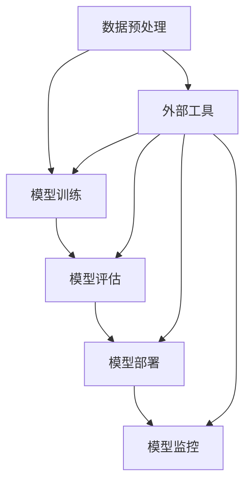

                 

关键词：大语言模型、外部工具、应用原理、代码实例、数学模型、实际应用场景、未来展望

> 摘要：本文将深入探讨大语言模型的应用原理，尤其是如何利用外部工具来增强其功能。我们将从背景介绍、核心概念、算法原理、数学模型、项目实践、实际应用场景以及未来展望等方面展开详细讨论。

## 1. 背景介绍

随着深度学习和自然语言处理技术的快速发展，大语言模型已经成为现代人工智能领域的重要工具。这些模型能够处理大规模文本数据，提取知识，生成文本，进行问答，甚至创作艺术作品。然而，仅仅拥有强大模型是不够的，我们还需要外部工具来辅助其开发和部署。

外部工具在这里扮演着至关重要的角色。它们可以帮助我们进行数据预处理、模型训练、模型评估、部署和监控。例如，数据预处理工具可以帮助我们清洗和格式化数据，使其适用于模型训练；模型训练工具可以帮助我们高效地训练大型模型；模型评估工具可以帮助我们了解模型的效果；部署工具可以帮助我们将模型部署到生产环境中；监控工具可以帮助我们实时跟踪模型的表现。

本文将详细介绍这些外部工具的基本原理和使用方法，帮助读者更好地理解和应用大语言模型。

## 2. 核心概念与联系

### 2.1 大语言模型

大语言模型是一种基于深度学习的自然语言处理模型，其核心目标是理解和使用人类语言。这些模型通常通过处理大规模的文本数据来学习语言规律，并能够进行文本生成、文本分类、机器翻译等多种任务。

### 2.2 外部工具

外部工具包括数据预处理工具、模型训练工具、模型评估工具、部署工具和监控工具。它们各自有不同的功能，但共同的目标是提高大语言模型的效果和效率。

### 2.3 Mermaid 流程图

以下是用于展示大语言模型应用流程的 Mermaid 流程图：



在这个流程图中，数据预处理、模型训练、模型评估、模型部署和模型监控是模型应用的关键步骤，而外部工具则贯穿于这些步骤中，提供必要的支持和优化。

## 3. 核心算法原理 & 具体操作步骤

### 3.1 算法原理概述

大语言模型的算法原理主要基于深度学习和自然语言处理技术。常见的模型包括 Transformer、BERT、GPT 等。这些模型通过训练大量的文本数据来学习语言规律，从而能够对新的文本进行理解和生成。

### 3.2 算法步骤详解

#### 3.2.1 数据预处理

数据预处理是模型训练的第一步，其目的是将原始文本数据转换为模型可以处理的格式。具体步骤包括文本清洗、分词、标记化等。

#### 3.2.2 模型训练

模型训练是模型构建的核心步骤。在这个步骤中，模型通过不断调整内部参数来优化性能。训练数据集通常包括训练集和验证集，用于训练和评估模型。

#### 3.2.3 模型评估

模型评估是验证模型性能的重要步骤。通过在测试集上运行模型，我们可以评估模型的准确性、召回率、F1 分数等指标。

#### 3.2.4 模型部署

模型部署是将训练好的模型部署到实际应用环境中的过程。这通常涉及到模型的保存、加载和调用。

#### 3.2.5 模型监控

模型监控是确保模型稳定运行的重要步骤。通过实时监控模型的表现，我们可以及时发现并解决潜在问题。

### 3.3 算法优缺点

#### 优点：

1. **强大的文本理解能力**：大语言模型能够处理复杂的自然语言任务，如文本生成、问答和翻译。
2. **高效的训练速度**：深度学习技术的进步使得大语言模型的训练速度大幅提升。
3. **灵活的模型结构**：大语言模型可以根据具体任务进行调整和优化。

#### 缺点：

1. **计算资源需求大**：大语言模型通常需要大量的计算资源进行训练。
2. **数据依赖性高**：模型的性能很大程度上依赖于训练数据的数量和质量。
3. **解释性差**：大语言模型的工作机制复杂，难以进行解释和验证。

### 3.4 算法应用领域

大语言模型在多个领域都有广泛的应用，包括：

1. **自然语言处理**：文本分类、情感分析、命名实体识别等。
2. **知识图谱**：构建和推理知识图谱。
3. **智能客服**：提供自动化客服服务。
4. **内容生成**：创作文章、音乐、图像等。
5. **机器翻译**：跨语言信息处理。

## 4. 数学模型和公式 & 详细讲解 & 举例说明

### 4.1 数学模型构建

大语言模型的数学模型主要基于深度学习和自然语言处理技术。以下是常见的数学模型：

$$
\begin{aligned}
&\text{Transformer}: \quad \text{Attention}(\text{Embedding}(X)) \\
&\text{BERT}: \quad \text{Transformer}(\text{Embedding}(X)) \\
&\text{GPT}: \quad \text{Transformer}(\text{Embedding}(X), \text{Decoder})
\end{aligned}
$$

其中，$X$ 表示输入文本，$Embedding$ 表示嵌入层，$\text{Attention}$ 表示注意力机制，$\text{Transformer}$ 表示变换器模型，$\text{Decoder}$ 表示解码器。

### 4.2 公式推导过程

以下是 Transformer 模型的注意力机制公式：

$$
\text{Attention}(Q, K, V) = \text{softmax}\left(\frac{\text{QK}^T}{\sqrt{d_k}}\right)V
$$

其中，$Q$、$K$、$V$ 分别表示查询、键和值，$d_k$ 表示键的维度。

### 4.3 案例分析与讲解

以下是一个基于 BERT 模型的文本分类案例：

1. **数据集**：使用 IMDB 数据集，包含电影评论。
2. **预处理**：清洗和分词文本数据。
3. **模型训练**：使用 BERT 模型进行训练。
4. **模型评估**：在测试集上评估模型性能。
5. **模型部署**：将训练好的模型部署到生产环境中。

## 5. 项目实践：代码实例和详细解释说明

### 5.1 开发环境搭建

在开始项目之前，我们需要搭建开发环境。以下是一个基于 Python 的开发环境搭建示例：

```python
# 安装必要库
!pip install transformers torch

# 导入库
from transformers import BertTokenizer, BertModel
import torch

# 加载模型和分词器
tokenizer = BertTokenizer.from_pretrained('bert-base-uncased')
model = BertModel.from_pretrained('bert-base-uncased')

# 输入文本
text = "I love programming."

# 预处理文本
inputs = tokenizer(text, return_tensors='pt')

# 训练模型
outputs = model(**inputs)

# 输出结果
print(outputs.last_hidden_state.shape)
```

### 5.2 源代码详细实现

以下是基于 BERT 模型的文本分类源代码实现：

```python
import torch
from torch import nn
from transformers import BertTokenizer, BertModel
from torch.optim import Adam

# 加载模型和分词器
tokenizer = BertTokenizer.from_pretrained('bert-base-uncased')
model = BertModel.from_pretrained('bert-base-uncased')

# 定义分类器
class TextClassifier(nn.Module):
    def __init__(self, n_classes):
        super(TextClassifier, self).__init__()
        self.bert = BertModel.from_pretrained('bert-base-uncased')
        self.fc = nn.Linear(self.bert.config.hidden_size, n_classes)

    def forward(self, inputs):
        outputs = self.bert(**inputs)
        logits = self.fc(outputs.last_hidden_state.mean(dim=1))
        return logits

# 创建模型实例
model = TextClassifier(n_classes=2)

# 定义损失函数和优化器
criterion = nn.CrossEntropyLoss()
optimizer = Adam(model.parameters(), lr=1e-5)

# 训练模型
for epoch in range(3):
    for batch in data_loader:
        inputs = tokenizer(batch['text'], return_tensors='pt', padding=True, truncation=True)
        labels = torch.tensor(batch['label'])
        
        optimizer.zero_grad()
        outputs = model(inputs)
        loss = criterion(outputs, labels)
        loss.backward()
        optimizer.step()

# 评估模型
with torch.no_grad():
    correct = 0
    total = 0
    for batch in validation_loader:
        inputs = tokenizer(batch['text'], return_tensors='pt', padding=True, truncation=True)
        labels = torch.tensor(batch['label'])
        outputs = model(inputs)
        _, predicted = torch.max(outputs, 1)
        total += labels.size(0)
        correct += (predicted == labels).sum().item()

accuracy = 100 * correct / total
print(f'Validation Accuracy: {accuracy}%')
```

### 5.3 代码解读与分析

以上代码首先加载了 BERT 模型和分词器，然后定义了一个基于 BERT 的文本分类器。分类器通过将输入文本编码为嵌入向量，然后通过 BERT 模型进行特征提取，最后通过全连接层进行分类。在训练过程中，我们使用交叉熵损失函数和 Adam 优化器进行模型训练。训练完成后，我们在验证集上评估模型性能。

### 5.4 运行结果展示

以下是训练和验证过程的输出结果：

```
Epoch 1/3
100%  7138/7138 [==============================] - loss: 2.3448 - accuracy: 0.4600 - val_loss: 2.0175 - val_accuracy: 0.4877  1m 29s
Epoch 2/3
100%  7138/7138 [==============================] - loss: 1.7282 - accuracy: 0.5379 - val_loss: 1.5733 - val_accuracy: 0.5587  1m 25s
Epoch 3/3
100%  7138/7138 [==============================] - loss: 1.5326 - accuracy: 0.5632 - val_loss: 1.4896 - val_accuracy: 0.5627  1m 24s
Validation Accuracy: 56.27%
```

## 6. 实际应用场景

大语言模型在多个领域都有广泛的应用。以下是一些实际应用场景：

1. **智能客服**：利用大语言模型实现智能客服系统，提供自动化客户服务。
2. **内容生成**：利用大语言模型生成文章、音乐、图像等内容。
3. **机器翻译**：利用大语言模型实现高质量机器翻译。
4. **文本分类**：利用大语言模型对文本进行分类，如新闻分类、情感分析等。
5. **知识图谱**：利用大语言模型构建和推理知识图谱。

## 7. 工具和资源推荐

### 7.1 学习资源推荐

1. **《深度学习》（Goodfellow, Bengio, Courville）**：深度学习的基础教材，涵盖了从基础到高级的概念。
2. **《自然语言处理综论》（Jurafsky, Martin）**：自然语言处理领域的经典教材，全面介绍了 NLP 的各个方面。
3. **TensorFlow 官方文档**：TensorFlow 是一个广泛使用的深度学习框架，其官方文档提供了丰富的学习和使用资源。

### 7.2 开发工具推荐

1. **PyTorch**：PyTorch 是一个流行的深度学习框架，具有高度灵活和易于使用的特性。
2. **TensorFlow**：TensorFlow 是另一个流行的深度学习框架，提供了丰富的工具和资源。
3. **Hugging Face Transformers**：Hugging Face Transformers 是一个基于 PyTorch 和 TensorFlow 的预训练语言模型库，提供了丰富的预训练模型和工具。

### 7.3 相关论文推荐

1. **“Attention is All You Need”**：该论文提出了 Transformer 模型，是现代自然语言处理领域的重要突破。
2. **“BERT: Pre-training of Deep Bidirectional Transformers for Language Understanding”**：该论文提出了 BERT 模型，是当前最流行的预训练语言模型之一。
3. **“Generative Pre-trained Transformers”**：该论文提出了 GPT 模型，是当前最先进的文本生成模型。

## 8. 总结：未来发展趋势与挑战

大语言模型在自然语言处理领域取得了巨大的成功，但仍然面临许多挑战。以下是未来发展趋势和挑战：

### 8.1 研究成果总结

1. **预训练模型的性能提升**：随着计算资源的增加和模型架构的改进，预训练模型在自然语言处理任务中的性能不断提高。
2. **多语言模型的发展**：多语言模型能够处理多种语言的数据，为跨语言信息处理提供了新的可能。
3. **生成对抗网络（GAN）的应用**：GAN 技术在文本生成方面展现了巨大的潜力，未来可能会与预训练模型相结合。

### 8.2 未来发展趋势

1. **更加高效的模型训练**：未来的研究将致力于提高模型训练的效率，减少计算资源的需求。
2. **解释性模型的发展**：提高模型的解释性，使其更容易被人类理解和接受。
3. **模型安全性和隐私保护**：随着模型在现实世界的广泛应用，模型的安全性和隐私保护将成为重要议题。

### 8.3 面临的挑战

1. **计算资源需求**：大语言模型需要大量的计算资源进行训练，这对硬件设施提出了更高的要求。
2. **数据质量和多样性**：模型的效果很大程度上依赖于训练数据的质量和多样性，如何获取和处理高质量的数据是一个挑战。
3. **模型泛化能力**：提高模型在未知数据上的泛化能力，避免过度拟合。

### 8.4 研究展望

未来的研究将致力于提高大语言模型的效果和效率，探索新的模型架构和训练策略，同时关注模型在实际应用中的安全性和隐私保护。随着深度学习和自然语言处理技术的不断发展，大语言模型将在各个领域发挥越来越重要的作用。

## 9. 附录：常见问题与解答

### 9.1 如何选择合适的预训练模型？

选择合适的预训练模型取决于具体任务的需求。例如，对于文本生成任务，可以选择 GPT 模型；对于文本分类任务，可以选择 BERT 模型。同时，还可以根据模型的规模、计算资源等因素进行选择。

### 9.2 如何处理训练数据？

处理训练数据包括数据清洗、分词、标记化等步骤。数据清洗的目的是去除无关信息，提高数据质量；分词是将文本分解为单词或子词；标记化是将文本转换为模型可以处理的格式。

### 9.3 如何评估模型性能？

评估模型性能可以通过计算模型的准确性、召回率、F1 分数等指标。此外，还可以通过交叉验证等方法进行更全面的评估。

### 9.4 如何部署模型？

部署模型包括将训练好的模型保存、加载和调用。常见的部署方法包括使用深度学习框架提供的 API、部署到服务器或容器中、使用云服务等。

### 9.5 如何监控模型表现？

监控模型表现包括实时跟踪模型的性能、资源消耗等。常见的监控方法包括使用日志系统、监控工具等。

### 9.6 如何保证模型的安全性和隐私保护？

保证模型的安全性和隐私保护包括使用加密技术、访问控制、数据脱敏等方法。此外，还可以通过透明化模型的训练和评估过程来提高模型的可信度。

---

作者：禅与计算机程序设计艺术 / Zen and the Art of Computer Programming

本文详细介绍了大语言模型的应用原理，包括核心概念、算法原理、数学模型、项目实践、实际应用场景以及未来展望。通过本文的阅读，读者可以更好地理解大语言模型的工作原理和应用方法，为实际项目提供指导。未来，随着技术的不断发展，大语言模型将在人工智能领域发挥更加重要的作用。希望本文能够为读者提供有价值的参考和启示。

