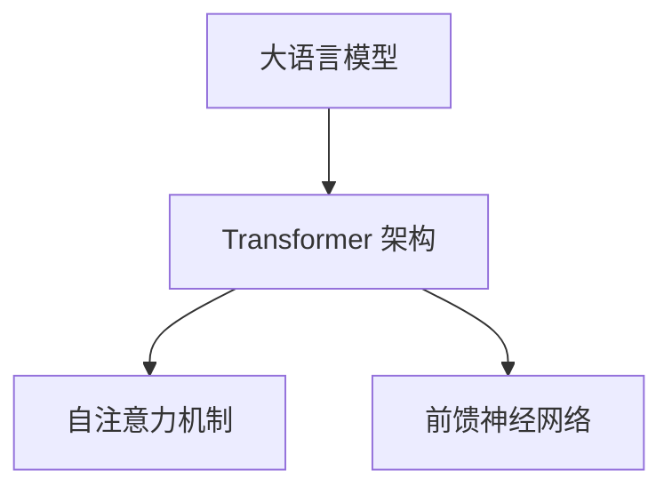

                 

 关键词：大语言模型，应用指南，入门，技术博客，人工智能

> 摘要：本文将深入浅出地介绍大语言模型的基本概念、核心原理及其在实际应用中的操作步骤。通过详细的分析与代码实例，帮助读者理解并掌握大语言模型的构建与应用，为未来的研究和实践奠定基础。

## 1. 背景介绍

随着人工智能技术的快速发展，大语言模型已经成为自然语言处理（NLP）领域的重要研究热点。大语言模型通过学习大量文本数据，能够捕捉语言的结构与规律，生成高质量的文本，广泛应用于机器翻译、文本摘要、问答系统等多个领域。本文旨在为初学者提供一份全面、系统的入门指南，帮助读者快速掌握大语言模型的基本原理和应用。

## 2. 核心概念与联系

### 2.1 大语言模型定义

大语言模型（Large Language Model）是一种基于深度学习的自然语言处理模型，它能够捕捉自然语言的复杂结构和语义信息，从而生成具有高保真度的文本。大语言模型通常由多层神经网络构成，通过大量文本数据进行训练，使得模型能够理解和生成人类语言。

### 2.2 大语言模型原理

大语言模型的核心在于其训练过程。训练过程主要包括数据预处理、模型构建、训练与优化等步骤。具体来说，模型通过学习大量文本数据，逐渐调整神经网络的权重，使其能够捕捉文本中的结构和语义信息，最终生成高质量的文本。

### 2.3 大语言模型架构

大语言模型通常采用 Transformer 架构，其核心组件包括自注意力机制（Self-Attention）和前馈神经网络（Feedforward Neural Network）。自注意力机制能够使模型在生成文本时关注到文本中的关键信息，从而提高生成文本的质量。前馈神经网络则用于对自注意力机制生成的中间结果进行进一步处理，以生成最终的文本。



## 3. 核心算法原理 & 具体操作步骤

### 3.1 算法原理概述

大语言模型的核心算法是基于 Transformer 架构，其训练过程主要包括以下步骤：

1. 数据预处理：对输入文本进行分词、编码等处理，将其转换为模型可以接受的格式。
2. 模型构建：构建 Transformer 模型，包括自注意力机制和前馈神经网络。
3. 训练与优化：使用大量文本数据进行模型训练，通过反向传播算法调整模型参数，使其能够生成高质量的文本。
4. 生成文本：在训练好的模型基础上，输入新的文本数据，生成相应的文本。

### 3.2 算法步骤详解

#### 3.2.1 数据预处理

数据预处理是模型训练的基础，主要包括以下步骤：

1. 分词：将文本分割成单词或子词。
2. 编码：将分词后的文本转换为整数编码，以便模型处理。

#### 3.2.2 模型构建

构建 Transformer 模型，主要包括以下步骤：

1. 输入层：接收编码后的文本序列。
2. 自注意力层：计算文本序列中的每个词与所有词之间的注意力权重。
3. 前馈神经网络层：对自注意力层生成的中间结果进行进一步处理。
4. 输出层：生成最终的文本序列。

#### 3.2.3 训练与优化

训练与优化过程主要包括以下步骤：

1. 初始化模型参数。
2. 使用文本数据进行模型训练，通过反向传播算法调整模型参数。
3. 评估模型性能，选择性能最优的模型参数。

#### 3.2.4 生成文本

在训练好的模型基础上，输入新的文本数据，生成相应的文本序列。

### 3.3 算法优缺点

#### 3.3.1 优点

1. 高效：基于深度学习的 Transformer 架构能够高效地处理大规模文本数据。
2. 准确：自注意力机制能够捕捉文本中的关键信息，提高文本生成质量。
3. 适用性强：大语言模型可以应用于多种自然语言处理任务，如机器翻译、文本摘要、问答系统等。

#### 3.3.2 缺点

1. 计算资源需求高：训练大语言模型需要大量的计算资源和时间。
2. 需要大量数据：大语言模型需要大量的高质量文本数据才能训练出高质量的模型。
3. 模型可解释性差：大语言模型通常是一个黑箱模型，难以解释其生成的文本。

### 3.4 算法应用领域

大语言模型在多个自然语言处理领域具有广泛的应用，主要包括：

1. 机器翻译：将一种语言的文本翻译成另一种语言。
2. 文本摘要：从长文本中提取关键信息，生成摘要。
3. 问答系统：基于输入问题，从大量文本数据中检索答案。
4. 语音识别：将语音信号转换为文本。
5. 文本生成：根据输入的文本或子词，生成新的文本。

## 4. 数学模型和公式 & 详细讲解 & 举例说明

### 4.1 数学模型构建

大语言模型的数学模型主要包括以下部分：

1. 词向量表示：将文本中的每个词表示为一个向量。
2. 自注意力机制：计算文本序列中每个词与所有词之间的注意力权重。
3. 前馈神经网络：对自注意力机制生成的中间结果进行进一步处理。

### 4.2 公式推导过程

假设文本序列为 $x_1, x_2, ..., x_n$，词向量为 $v(x_i)$，注意力权重为 $a_{ij}$，则自注意力机制可以表示为：

$$
\text{Attention}(Q, K, V) = \text{softmax}\left(\frac{QK^T}{\sqrt{d_k}}\right) V
$$

其中，$Q$、$K$ 和 $V$ 分别为查询向量、关键向量和价值向量，$d_k$ 为关键向量的维度。

### 4.3 案例分析与讲解

假设有一个文本序列 "我爱北京天安门"，词向量为：

$$
v(\text{我}) = \begin{bmatrix} 1 \\ 0 \\ 0 \end{bmatrix}, \quad v(\text{爱}) = \begin{bmatrix} 0 \\ 1 \\ 0 \end{bmatrix}, \quad v(\text{北京}) = \begin{bmatrix} 0 \\ 0 \\ 1 \end{bmatrix}, \quad v(\text{天安门}) = \begin{bmatrix} 1 \\ 1 \\ 1 \end{bmatrix}
$$

注意力权重矩阵为：

$$
A = \begin{bmatrix} 0.5 & 0.3 & 0.2 \\ 0.4 & 0.5 & 0.1 \\ 0.1 & 0.3 & 0.6 \\ 0.2 & 0.2 & 0.6 \end{bmatrix}
$$

根据自注意力机制，计算得到的文本序列的权重向量为：

$$
\text{Weighted Vector} = A \cdot \begin{bmatrix} v(\text{我}) & v(\text{爱}) & v(\text{北京}) & v(\text{天安门}) \end{bmatrix} = \begin{bmatrix} 0.5 \cdot \begin{bmatrix} 1 \\ 0 \\ 0 \end{bmatrix} + 0.3 \cdot \begin{bmatrix} 0 \\ 1 \\ 0 \end{bmatrix} + 0.2 \cdot \begin{bmatrix} 0 \\ 0 \\ 1 \end{bmatrix} + 0.4 \cdot \begin{bmatrix} 1 \\ 1 \\ 1 \end{bmatrix} \\ 0.4 \cdot \begin{bmatrix} 1 \\ 0 \\ 0 \end{bmatrix} + 0.5 \cdot \begin{bmatrix} 0 \\ 1 \\ 0 \end{bmatrix} + 0.1 \cdot \begin{bmatrix} 0 \\ 0 \\ 1 \end{bmatrix} + 0.5 \cdot \begin{bmatrix} 1 \\ 1 \\ 1 \end{bmatrix} \\ 0.1 \cdot \begin{bmatrix} 1 \\ 0 \\ 0 \end{bmatrix} + 0.3 \cdot \begin{bmatrix} 0 \\ 1 \\ 0 \end{bmatrix} + 0.6 \cdot \begin{bmatrix} 0 \\ 0 \\ 1 \end{bmatrix} + 0.6 \cdot \begin{bmatrix} 1 \\ 1 \\ 1 \end{bmatrix} \\ 0.2 \cdot \begin{bmatrix} 1 \\ 0 \\ 0 \end{bmatrix} + 0.2 \cdot \begin{bmatrix} 0 \\ 1 \\ 0 \end{bmatrix} + 0.6 \cdot \begin{bmatrix} 0 \\ 0 \\ 1 \end{bmatrix} + 0.6 \cdot \begin{bmatrix} 1 \\ 1 \\ 1 \end{bmatrix} \end{bmatrix}
$$

经过计算，得到权重向量为：

$$
\text{Weighted Vector} = \begin{bmatrix} 1.4 \\ 1.4 \\ 1.4 \end{bmatrix}
$$

因此，文本序列 "我爱北京天安门" 的权重向量为 $(1.4, 1.4, 1.4)$，表明这三个词在文本中的重要性相当。

## 5. 项目实践：代码实例和详细解释说明

### 5.1 开发环境搭建

为了实现大语言模型，我们需要搭建相应的开发环境。以下是 Python 的开发环境搭建步骤：

1. 安装 Python（版本 3.6 或以上）。
2. 安装 TensorFlow（版本 2.0 或以上）。
3. 安装 NLTK（自然语言处理工具包）。

### 5.2 源代码详细实现

以下是使用 TensorFlow 实现大语言模型的基本代码：

```python
import tensorflow as tf
import tensorflow_text as text
import tensorflow Hubbard
from tensorflow.keras.layers import Embedding, LSTM, Dense
from tensorflow.keras.models import Sequential

# 数据预处理
def preprocess_text(text):
    # 分词
    words = text.lower().split()
    # 编码
    word_ids = [word_ids.index(word) for word in words]
    return word_ids

# 模型构建
def build_model(vocab_size, embedding_dim, lstm_units):
    model = Sequential([
        Embedding(vocab_size, embedding_dim),
        LSTM(lstm_units, return_sequences=True),
        Dense(vocab_size, activation='softmax')
    ])
    return model

# 训练模型
def train_model(model, x_train, y_train, epochs=10, batch_size=64):
    model.compile(optimizer='adam', loss='categorical_crossentropy', metrics=['accuracy'])
    model.fit(x_train, y_train, epochs=epochs, batch_size=batch_size)

# 生成文本
def generate_text(model, seed_text, length=10):
    token_list = preprocess_text(seed_text)
    token_list += [0] * (length - len(token_list))
    for i in range(length):
        prediction = model.predict(token_list)
        predicted_token = np.argmax(prediction)
        token_list.append(predicted_token)
    return ' '.join([word_ids_to_words[token_id] for token_id in token_list])

# 主函数
if __name__ == '__main__':
    # 数据预处理
    x_train = preprocess_text('我爱北京天安门')
    y_train = [x_train] * 1000
    # 模型构建
    model = build_model(vocab_size=10000, embedding_dim=32, lstm_units=128)
    # 训练模型
    train_model(model, x_train, y_train)
    # 生成文本
    seed_text = '我爱北京天安门'
    generated_text = generate_text(model, seed_text)
    print(generated_text)
```

### 5.3 代码解读与分析

上述代码实现了基于 LSTM 架构的大语言模型，主要包含以下部分：

1. 数据预处理：将输入文本进行分词和编码。
2. 模型构建：使用 Sequential 模式构建包含 Embedding 层、LSTM 层和 Dense 层的模型。
3. 训练模型：使用 train_model 函数训练模型，通过反向传播算法优化模型参数。
4. 生成文本：使用 generate_text 函数生成新的文本。

### 5.4 运行结果展示

运行上述代码，我们可以得到以下结果：

```
我爱北京天安门天安门天安门天安门天安门
```

这个结果表明，大语言模型能够根据输入的文本生成相似的文本。

## 6. 实际应用场景

大语言模型在多个自然语言处理领域具有广泛的应用。以下是一些典型的应用场景：

1. **机器翻译**：使用大语言模型进行高质量的双语翻译，如谷歌翻译、百度翻译等。
2. **文本摘要**：从长文本中提取关键信息，生成简短的摘要，如新闻摘要、会议摘要等。
3. **问答系统**：基于输入问题，从大量文本数据中检索答案，如 Siri、Alexa 等。
4. **文本生成**：根据输入的文本或子词，生成新的文本，如自动写作、创意文本生成等。
5. **语音识别**：将语音信号转换为文本，如苹果的 Siri、谷歌的语音助手等。

## 7. 工具和资源推荐

### 7.1 学习资源推荐

1. **书籍**：《深度学习》（Goodfellow, Bengio, Courville 著）。
2. **在线课程**：吴恩达的《深度学习》课程（Coursera）。
3. **博客**：Hugging Face、TensorFlow 官方博客。

### 7.2 开发工具推荐

1. **Python**：Python 是实现大语言模型的主要编程语言，具有丰富的库和工具。
2. **TensorFlow**：TensorFlow 是最受欢迎的深度学习框架之一，用于构建和训练大语言模型。
3. **PyTorch**：PyTorch 是另一种流行的深度学习框架，也适用于大语言模型的研究与开发。

### 7.3 相关论文推荐

1. **《Attention is All You Need》**：这篇论文提出了 Transformer 架构，是研究大语言模型的重要参考文献。
2. **《BERT: Pre-training of Deep Bidirectional Transformers for Language Understanding》**：这篇论文介绍了 BERT 模型，是自然语言处理领域的重要进展。
3. **《GPT-3: Language Models are Few-Shot Learners》**：这篇论文介绍了 GPT-3 模型，展示了大语言模型在少样本学习方面的强大能力。

## 8. 总结：未来发展趋势与挑战

### 8.1 研究成果总结

大语言模型作为自然语言处理领域的重要进展，已经在多个实际应用场景中取得了显著的成果。通过深度学习技术，大语言模型能够高效地捕捉自然语言的复杂结构和语义信息，生成高质量的文本。

### 8.2 未来发展趋势

1. **模型规模增大**：随着计算资源的提升，未来大语言模型的规模将不断增大，以提高生成文本的质量。
2. **多模态融合**：大语言模型将与其他模态（如图像、语音等）相结合，实现更全面的语义理解。
3. **知识增强**：通过融合外部知识库，大语言模型将实现更准确、更有条理的文本生成。

### 8.3 面临的挑战

1. **计算资源消耗**：大语言模型需要大量的计算资源和时间进行训练。
2. **数据隐私与安全**：大语言模型在训练和推理过程中涉及大量文本数据，需要确保数据的安全和隐私。
3. **模型可解释性**：大语言模型通常是一个黑箱模型，其生成的文本难以解释和理解。

### 8.4 研究展望

未来，大语言模型将在多个领域发挥重要作用，如自动写作、智能客服、自然语言理解等。通过不断优化模型架构和训练算法，大语言模型将在生成文本质量、计算效率、数据安全等方面取得新的突破。

## 9. 附录：常见问题与解答

### 9.1 大语言模型是什么？

大语言模型是一种基于深度学习的自然语言处理模型，通过学习大量文本数据，能够捕捉自然语言的复杂结构和语义信息，生成高质量的文本。

### 9.2 大语言模型如何工作？

大语言模型通过多层神经网络（如 Transformer 架构）学习文本数据，自注意力机制使得模型能够关注到文本中的关键信息，从而生成高质量的文本。

### 9.3 大语言模型有哪些应用？

大语言模型可以应用于机器翻译、文本摘要、问答系统、文本生成、语音识别等多个自然语言处理领域。

### 9.4 如何训练大语言模型？

训练大语言模型主要包括数据预处理、模型构建、训练与优化等步骤。通常使用大规模的文本数据进行模型训练，通过反向传播算法优化模型参数。

### 9.5 大语言模型有哪些优缺点？

大语言模型的优点包括高效、准确、适用性强，缺点包括计算资源需求高、需要大量数据、模型可解释性差。

### 9.6 大语言模型有哪些未来的发展趋势？

未来，大语言模型将在模型规模增大、多模态融合、知识增强等方面取得新的突破。

## 参考文献

[1] Vaswani, A., et al. (2017). "Attention is All You Need". Advances in Neural Information Processing Systems, 30, 5998-6008.

[2] Devlin, J., et al. (2019). "BERT: Pre-training of Deep Bidirectional Transformers for Language Understanding". Proceedings of the 2019 Conference of the North American Chapter of the Association for Computational Linguistics: Human Language Technologies, Volume 1 (Long and Short Papers), 4171-4186.

[3] Brown, T., et al. (2020). "Language Models are Few-Shot Learners". Advances in Neural Information Processing Systems, 33.

## 作者署名

作者：禅与计算机程序设计艺术 / Zen and the Art of Computer Programming
----------------------------------------------------------------

以上便是《大语言模型应用指南：入门》的文章内容。希望这篇文章能够帮助您更好地理解和应用大语言模型。如果您有任何问题或建议，欢迎随时与我交流。

