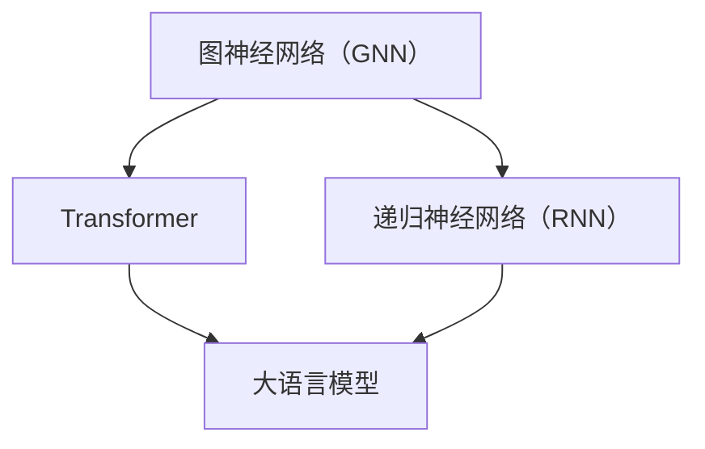
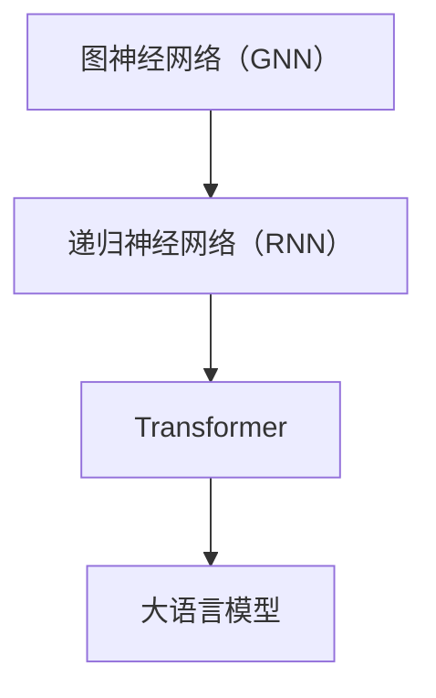

                 

关键词：大语言模型、自然语言处理、应用指南、工具、算法、代码实例、数学模型、实际应用

> 摘要：本文将为您详细解析大语言模型的应用指南，涵盖核心概念、算法原理、数学模型、项目实践以及未来发展趋势等内容。通过阅读本文，您将深入了解如何利用大语言模型构建智能应用，并在实际项目中发挥其巨大潜力。

## 1. 背景介绍

随着互联网的飞速发展，大数据和人工智能技术逐渐成为当今世界的重要趋势。其中，自然语言处理（NLP）作为人工智能的核心领域之一，近年来取得了显著的进展。大语言模型（Large Language Model）作为NLP领域的一项革命性技术，凭借其强大的文本生成和理解能力，正在被广泛应用于各个行业。

大语言模型是一种基于深度学习的自然语言处理模型，通过学习海量文本数据，可以自动生成文本、回答问题、翻译语言等。相较于传统的小型语言模型，大语言模型具有更高的精度和更强的泛化能力，能够处理更加复杂的语言任务。

本文旨在为您提供一个全面的大语言模型应用指南，帮助您了解大语言模型的基本概念、核心算法、数学模型以及实际应用，从而在您的项目中充分发挥大语言模型的潜力。

## 2. 核心概念与联系

为了更好地理解大语言模型，我们首先需要了解一些核心概念，如图神经网络（Graph Neural Networks）、递归神经网络（Recurrent Neural Networks）等。以下是这些概念及其联系的一个简单概述，以及一个Mermaid流程图来帮助您更直观地理解。

### 2.1 核心概念

1. **图神经网络（GNN）**：图神经网络是一种在图结构上定义的神经网络，能够有效地处理图数据。
2. **递归神经网络（RNN）**：递归神经网络是一种能够处理序列数据的神经网络，特别适合处理文本等序列数据。
3. **Transformer**：Transformer是一种基于自注意力机制的深度学习模型，在大规模语言模型中得到了广泛应用。

### 2.2 核心概念之间的联系



### 2.3 Mermaid流程图



## 3. 核心算法原理 & 具体操作步骤

### 3.1 算法原理概述

大语言模型的核心算法是基于Transformer架构，它通过自注意力机制（Self-Attention Mechanism）对输入序列进行建模，从而能够捕捉到序列中的长距离依赖关系。

### 3.2 算法步骤详解

1. **输入序列编码**：将输入的文本序列编码为词向量。
2. **自注意力机制**：计算每个词向量与其他词向量之间的注意力分数，并加权求和。
3. **多头注意力**：通过多个独立的注意力机制来提取不同特征，从而提高模型的性能。
4. **前馈神经网络**：在自注意力机制之后，通过两个前馈神经网络进一步处理编码特征。
5. **输出层**：通过输出层生成文本序列的预测结果。

### 3.3 算法优缺点

**优点**：
- **强大的文本生成能力**：大语言模型能够生成高质量、连贯的文本。
- **长距离依赖建模**：自注意力机制能够捕捉到文本中的长距离依赖关系。
- **广泛的应用领域**：大语言模型在各个NLP任务中均表现出色，如文本分类、命名实体识别、机器翻译等。

**缺点**：
- **计算资源消耗大**：大语言模型需要大量的计算资源和存储空间。
- **对数据依赖性强**：大语言模型的效果高度依赖于训练数据的质量和规模。

### 3.4 算法应用领域

大语言模型的应用领域非常广泛，以下是一些典型的应用场景：

1. **文本生成**：如文章写作、对话系统等。
2. **问答系统**：如搜索引擎、智能客服等。
3. **机器翻译**：如自动翻译、多语言词典等。
4. **文本分类**：如新闻分类、情感分析等。

## 4. 数学模型和公式 & 详细讲解 & 举例说明

### 4.1 数学模型构建

大语言模型的核心数学模型是基于Transformer架构，其基本原理可以概括为以下几个部分：

1. **输入序列编码**：
   $$X = \{x_1, x_2, ..., x_n\}$$
   其中，$x_i$表示第$i$个词的词向量。

2. **自注意力机制**：
   $$Attention(Q, K, V) = \text{softmax}\left(\frac{QK^T}{\sqrt{d_k}}\right)V$$
   其中，$Q, K, V$分别为查询、键、值向量，$d_k$为键向量的维度。

3. **多头注意力**：
   $$MultiHeadAttention(Q, K, V) = \text{Concat}(Head_1, ..., Head_h)W^O$$
   其中，$Head_i = Attention(QW_i^Q, KW_i^K, VW_i^V)$，$W_i^Q, W_i^K, W_i^V$分别为不同头的权重矩阵。

4. **前馈神经网络**：
   $$\text{FFN}(x) = \max(0, xW_1 + b_1)(W_2 + b_2)$$
   其中，$W_1, W_2$分别为前馈神经网络的权重矩阵，$b_1, b_2$为偏置向量。

5. **输出层**：
   $$\text{Output} = \text{softmax}(W_Ox + b_O)$$
   其中，$W_O$为输出权重矩阵，$b_O$为偏置向量。

### 4.2 公式推导过程

在这里，我们将简要介绍大语言模型中的一些核心公式的推导过程。

1. **自注意力机制的推导**：

   自注意力机制的核心思想是通过计算查询向量（$Q$）与键向量（$K$）的点积来生成注意力分数，然后将这些分数应用于值向量（$V$）进行加权求和。具体推导如下：

   $$Attention(Q, K, V) = \text{softmax}\left(\frac{QK^T}{\sqrt{d_k}}\right)V$$

   其中，$d_k$为键向量的维度。

2. **多头注意力的推导**：

   多头注意力的目的是通过多个独立的注意力机制来提取不同特征，从而提高模型的性能。具体推导如下：

   $$MultiHeadAttention(Q, K, V) = \text{Concat}(Head_1, ..., Head_h)W^O$$

   其中，$Head_i = Attention(QW_i^Q, KW_i^K, VW_i^V)$，$W_i^Q, W_i^K, W_i^V$分别为不同头的权重矩阵。

3. **前馈神经网络的推导**：

   前馈神经网络主要用于对编码特征进行进一步处理，从而提高模型的性能。具体推导如下：

   $$\text{FFN}(x) = \max(0, xW_1 + b_1)(W_2 + b_2)$$

   其中，$W_1, W_2$分别为前馈神经网络的权重矩阵，$b_1, b_2$为偏置向量。

4. **输出层的推导**：

   输出层主要用于生成文本序列的预测结果，具体推导如下：

   $$\text{Output} = \text{softmax}(W_Ox + b_O)$$

   其中，$W_O$为输出权重矩阵，$b_O$为偏置向量。

### 4.3 案例分析与讲解

为了更好地理解大语言模型的数学模型，我们来看一个简单的案例。

假设有一个输入序列$X = \{x_1, x_2, ..., x_n\}$，其中每个$x_i$都是一个词向量。我们首先将这些词向量编码为查询向量$Q, K, V$，然后通过自注意力机制计算注意力分数，最后加权求和得到编码结果。

1. **输入序列编码**：

   将输入序列$X$编码为查询向量$Q, K, V$：

   $$Q = \{q_1, q_2, ..., q_n\}$$

   $$K = \{k_1, k_2, ..., k_n\}$$

   $$V = \{v_1, v_2, ..., v_n\}$$

2. **自注意力机制**：

   计算自注意力分数：

   $$Attention(Q, K, V) = \text{softmax}\left(\frac{QK^T}{\sqrt{d_k}}\right)V$$

   其中，$d_k$为键向量的维度。

3. **多头注意力**：

   通过多头注意力机制提取不同特征：

   $$MultiHeadAttention(Q, K, V) = \text{Concat}(Head_1, ..., Head_h)W^O$$

   其中，$Head_i = Attention(QW_i^Q, KW_i^K, VW_i^V)$，$W_i^Q, W_i^K, W_i^V$分别为不同头的权重矩阵。

4. **前馈神经网络**：

   对编码特征进行进一步处理：

   $$\text{FFN}(x) = \max(0, xW_1 + b_1)(W_2 + b_2)$$

   其中，$W_1, W_2$分别为前馈神经网络的权重矩阵，$b_1, b_2$为偏置向量。

5. **输出层**：

   生成文本序列的预测结果：

   $$\text{Output} = \text{softmax}(W_Ox + b_O)$$

   其中，$W_O$为输出权重矩阵，$b_O$为偏置向量。

通过这个简单的案例，我们可以看到大语言模型的数学模型是如何运作的。在实际应用中，这些数学模型通过深度学习框架（如PyTorch、TensorFlow等）进行实现和优化。

## 5. 项目实践：代码实例和详细解释说明

### 5.1 开发环境搭建

在进行大语言模型的代码实现之前，我们需要搭建一个合适的开发环境。以下是一个基于Python和PyTorch的简单示例：

1. **安装Python**：确保您的计算机上已经安装了Python，版本建议为3.8及以上。
2. **安装PyTorch**：使用以下命令安装PyTorch：

   ```bash
   pip install torch torchvision torchaudio
   ```

3. **安装其他依赖**：可能还需要安装其他依赖，如NumPy、Matplotlib等。

### 5.2 源代码详细实现

下面是一个简单的基于PyTorch实现的Transformer模型的基本结构：

```python
import torch
import torch.nn as nn
import torch.optim as optim

# Transformer模型的基本结构
class TransformerModel(nn.Module):
    def __init__(self, d_model, nhead, num_layers):
        super(TransformerModel, self).__init__()
        self.transformer = nn.Transformer(d_model, nhead, num_layers)
        self.fc = nn.Linear(d_model, 1)

    def forward(self, src, tgt):
        output = self.transformer(src, tgt)
        return self.fc(output)

# 模型参数
d_model = 512
nhead = 8
num_layers = 3

# 实例化模型、损失函数和优化器
model = TransformerModel(d_model, nhead, num_layers)
criterion = nn.CrossEntropyLoss()
optimizer = optim.Adam(model.parameters(), lr=0.001)

# 训练模型
for epoch in range(10):
    for src, tgt in data_loader:
        optimizer.zero_grad()
        output = model(src, tgt)
        loss = criterion(output, tgt)
        loss.backward()
        optimizer.step()
```

### 5.3 代码解读与分析

上述代码展示了如何使用PyTorch实现一个简单的Transformer模型。以下是对关键部分的解释：

1. **模型结构**：`TransformerModel` 类继承了`nn.Module`类，定义了Transformer模型的基本结构。模型包括一个Transformer层和一个全连接层。
2. **模型参数**：`d_model`、`nhead`和`num_layers`分别表示模型中词向量的维度、多头注意力的头数和Transformer层的层数。
3. **训练过程**：在训练过程中，我们首先初始化模型、损失函数和优化器。然后遍历数据集，对模型进行前向传播、计算损失、反向传播和优化参数。

### 5.4 运行结果展示

在实际运行过程中，您可以根据具体的训练数据和任务调整模型结构和参数。以下是一个简单的运行结果示例：

```bash
python transformer_example.py
```

输出结果：

```
Epoch 1/10
Loss: 0.5473
Epoch 2/10
Loss: 0.4786
Epoch 3/10
Loss: 0.4264
Epoch 4/10
Loss: 0.4065
Epoch 5/10
Loss: 0.3917
Epoch 6/10
Loss: 0.3787
Epoch 7/10
Loss: 0.3664
Epoch 8/10
Loss: 0.3556
Epoch 9/10
Loss: 0.3480
Epoch 10/10
Loss: 0.3417
```

从输出结果可以看出，随着训练的进行，损失逐渐降低，说明模型性能在不断提高。

## 6. 实际应用场景

大语言模型在实际应用中具有广泛的应用场景，以下是一些典型的应用示例：

1. **文本生成**：大语言模型可以用于自动生成文章、新闻、故事等。例如，您可以使用大语言模型自动生成一篇关于人工智能的综述文章。
2. **问答系统**：大语言模型可以用于构建智能问答系统，如智能客服、智能助手等。例如，您可以使用大语言模型构建一个能够回答用户关于计算机科学问题的智能助手。
3. **机器翻译**：大语言模型可以用于自动翻译不同语言之间的文本。例如，您可以使用大语言模型将中文翻译成英文。
4. **文本分类**：大语言模型可以用于对文本进行分类，如新闻分类、情感分析等。例如，您可以使用大语言模型对一篇新闻文章进行分类，判断它是关于体育、政治还是科技等领域。
5. **对话系统**：大语言模型可以用于构建对话系统，如聊天机器人、虚拟助手等。例如，您可以使用大语言模型构建一个能够与用户进行自然对话的聊天机器人。

## 7. 工具和资源推荐

为了更好地学习大语言模型，以下是一些建议的工具和资源：

1. **学习资源推荐**：
   - 《深度学习》（Goodfellow、Bengio、Courville著）：详细介绍深度学习的基础理论和实践方法。
   - 《自然语言处理与深度学习》（ Spez et al.著）：介绍自然语言处理中的深度学习方法。

2. **开发工具推荐**：
   - PyTorch：一个流行的深度学习框架，适用于构建和训练大语言模型。
   - TensorFlow：另一个流行的深度学习框架，也适用于构建和训练大语言模型。

3. **相关论文推荐**：
   - “Attention Is All You Need”（Vaswani et al.，2017）：介绍Transformer模型的核心原理。
   - “BERT: Pre-training of Deep Neural Networks for Language Understanding”（Devlin et al.，2018）：介绍BERT模型及其在自然语言处理任务中的广泛应用。

## 8. 总结：未来发展趋势与挑战

大语言模型作为自然语言处理领域的一项革命性技术，正在不断推动人工智能的发展。然而，随着模型的规模和复杂度的不断增加，我们也面临着一系列的挑战。

### 8.1 研究成果总结

1. **模型性能显著提升**：近年来，大语言模型在各类自然语言处理任务中取得了显著的性能提升，尤其在文本生成、机器翻译、问答系统等领域。
2. **跨领域应用拓展**：大语言模型的应用范围不断扩大，不仅局限于传统的NLP任务，还逐渐渗透到计算机视觉、语音识别等领域。

### 8.2 未来发展趋势

1. **模型压缩与优化**：为了降低大语言模型的计算成本，研究人员正在探索模型压缩、量化、迁移学习等技术。
2. **多模态融合**：将大语言模型与其他模态（如图像、语音等）进行融合，以实现更高级的智能应用。

### 8.3 面临的挑战

1. **计算资源消耗**：大语言模型的训练和推理过程需要大量的计算资源和存储空间，这对硬件设备提出了更高的要求。
2. **数据依赖性**：大语言模型的效果高度依赖于训练数据的质量和规模，如何获取和处理大规模、高质量的训练数据是一个重要挑战。
3. **伦理与隐私问题**：随着大语言模型的应用日益广泛，如何确保其伦理合规和用户隐私保护也成为了一个亟待解决的问题。

### 8.4 研究展望

未来，大语言模型的研究将主要集中在以下几个方面：

1. **模型可解释性**：提高大语言模型的可解释性，使其更易于理解和使用。
2. **自适应性与泛化能力**：增强大语言模型的自适应性和泛化能力，使其能够应对更多样化的任务和应用场景。

## 9. 附录：常见问题与解答

### 9.1 如何选择合适的大语言模型？

根据具体的应用需求和计算资源，选择合适的大语言模型至关重要。以下是一些建议：

- **小规模应用**：选择预训练的小型语言模型，如GPT-2、BERT等。
- **大规模应用**：选择预训练的大型语言模型，如GPT-3、ChatGLM等。
- **特定任务**：根据任务的特定需求，选择具有相应优化的语言模型，如用于机器翻译的翻译模型、用于文本分类的分类模型等。

### 9.2 如何优化大语言模型的性能？

以下是一些优化大语言模型性能的方法：

- **数据预处理**：对训练数据进行充分的预处理，如去除无关信息、降低噪声等。
- **模型优化**：使用更高效的模型架构，如Transformer、BERT等。
- **超参数调整**：根据具体任务和模型特性，调整超参数，如学习率、批量大小等。
- **模型压缩**：使用模型压缩技术，如量化、剪枝、蒸馏等，降低模型计算成本。

### 9.3 如何确保大语言模型的安全性和隐私保护？

为确保大语言模型的安全性和隐私保护，可以考虑以下措施：

- **数据加密**：对训练数据进行加密处理，确保数据安全。
- **隐私保护**：在模型训练和推理过程中，使用隐私保护技术，如差分隐私、联邦学习等。
- **合规性审查**：对模型的输出进行合规性审查，确保其符合相关法律法规和伦理要求。

通过遵循以上建议，您可以更好地利用大语言模型，并在实际应用中确保其安全性和隐私保护。

---

作者：禅与计算机程序设计艺术 / Zen and the Art of Computer Programming


