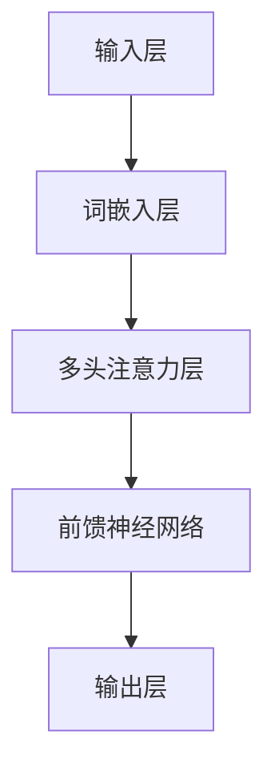

                 

关键词：大语言模型，应用指南，编码，无损压缩，人工智能，软件架构，技术语言，深度学习

> 摘要：本文深入探讨大语言模型在编码与无损压缩领域中的应用，从核心概念、算法原理、数学模型到实际项目实践，全面解析大语言模型在现代信息技术中的重要作用。文章旨在为读者提供一份详尽的技术指南，助力他们在人工智能领域取得卓越成就。

## 1. 背景介绍

### 大语言模型的概念

大语言模型（Large Language Model，简称LLM）是一种基于深度学习的自然语言处理技术，通过对海量文本数据进行训练，能够自动学习并生成高质量的自然语言文本。随着计算能力和数据规模的不断提升，大语言模型在语言理解、文本生成、问答系统等方面取得了显著的突破。

### 编码与无损压缩

编码与无损压缩是计算机科学中的重要研究方向，旨在降低数据传输和存储的成本。编码技术通过将数据转换为特定的符号序列，实现数据的压缩与传输。无损压缩则保证在数据解压后能够完全恢复原始数据，适用于对数据完整性要求较高的场景。

## 2. 核心概念与联系

### 大语言模型的架构

大语言模型通常采用变换器模型（Transformer）架构，该架构由多头注意力机制（Multi-Head Self-Attention）和前馈神经网络（Feedforward Neural Network）组成。以下是变换器模型的Mermaid流程图：



### 编码与无损压缩的关系

编码与无损压缩技术在大语言模型的应用中起到关键作用。通过编码，大语言模型可以将原始文本转换为计算机可处理的数字序列；而通过无损压缩，则能够有效降低数据传输和存储的负担，提高模型的运行效率。

## 3. 核心算法原理 & 具体操作步骤

### 3.1 算法原理概述

大语言模型的训练过程主要分为两个阶段：预训练和微调。预训练阶段通过在大量无标签数据上进行训练，使模型具备较强的语言理解能力；微调阶段则在特定领域数据上进行训练，使模型针对特定任务达到最优性能。

### 3.2 算法步骤详解

#### 3.2.1 预训练

1. 数据预处理：将原始文本数据转换为词嵌入序列。
2. 训练模型：通过优化损失函数，逐步调整模型参数，使模型具备语言理解能力。
3. 评估模型：在验证集上评估模型性能，选择最优模型。

#### 3.2.2 微调

1. 数据预处理：将特定领域数据转换为词嵌入序列。
2. 训练模型：在特定领域数据上优化模型参数，提高模型性能。
3. 评估模型：在测试集上评估模型性能，确保模型泛化能力。

### 3.3 算法优缺点

#### 优点：

1. 强大的语言理解能力：大语言模型通过对海量数据的学习，具备出色的语言理解能力，适用于多种自然语言处理任务。
2. 通用性：大语言模型可以应用于不同领域的任务，具有很高的泛化能力。
3. 高效性：变换器模型架构使得大语言模型在计算效率上具有明显优势。

#### 缺点：

1. 需要大量计算资源和数据：大语言模型训练过程需要大量计算资源和数据，对硬件设施和数据处理能力要求较高。
2. 数据偏见：大语言模型在训练过程中容易受到数据偏见的影响，可能导致模型产生错误预测。

### 3.4 算法应用领域

大语言模型在自然语言处理、文本生成、问答系统、机器翻译、文本分类等众多领域具有广泛应用。以下是一些具体应用实例：

1. 自然语言处理：用于文本分类、情感分析、信息抽取等任务。
2. 文本生成：用于文章写作、摘要生成、对话系统等任务。
3. 问答系统：用于构建智能客服、虚拟助手等应用。
4. 机器翻译：用于跨语言信息传播、多语言交互等任务。

## 4. 数学模型和公式 & 详细讲解 & 举例说明

### 4.1 数学模型构建

大语言模型的核心在于其变换器模型架构，以下为其主要数学模型：

#### 4.1.1 多头注意力机制

多头注意力机制通过计算输入序列中每个词与其他词之间的相关性，生成一个加权序列。其数学模型如下：

$$
\text{Attention}(Q, K, V) = \text{softmax}\left(\frac{QK^T}{\sqrt{d_k}}\right) V
$$

其中，$Q$、$K$、$V$ 分别为查询向量、键向量和值向量，$d_k$ 为键向量的维度。

#### 4.1.2 前馈神经网络

前馈神经网络用于对输入数据进行非线性变换。其数学模型如下：

$$
\text{FFN}(X) = \text{ReLU}(W_2 \text{ReLU}(W_1 X + b_1)) + b_2
$$

其中，$W_1$、$W_2$ 为权重矩阵，$b_1$、$b_2$ 为偏置。

### 4.2 公式推导过程

变换器模型中的多头注意力机制和前馈神经网络分别由多个独立的子层组成。以下为其具体推导过程：

#### 4.2.1 多头注意力机制

设输入序列 $X = \{x_1, x_2, ..., x_n\}$，其中 $x_i$ 为第 $i$ 个词的词嵌入向量。首先对输入序列进行线性变换：

$$
Q = W_Q X, \quad K = W_K X, \quad V = W_V X
$$

然后，计算每个词与其他词之间的相关性：

$$
\text{Attention}(Q, K, V) = \text{softmax}\left(\frac{QK^T}{\sqrt{d_k}}\right) V
$$

最后，将加权序列进行拼接，得到输出：

$$
\text{Output} = \text{Concat}(\text{Attention}(Q, K, V))
$$

#### 4.2.2 前馈神经网络

设输入序列为 $X$，首先进行线性变换：

$$
X = W_1 X + b_1
$$

然后，通过ReLU激活函数进行非线性变换：

$$
X = \text{ReLU}(W_2 X + b_2)
$$

最后，加上偏置项：

$$
X = W_2 \text{ReLU}(W_1 X + b_1) + b_2
$$

### 4.3 案例分析与讲解

以下以一个简单的文本分类任务为例，介绍大语言模型的应用过程。

#### 4.3.1 数据集准备

假设我们有一个包含新闻文本的数据集，其中每条新闻都被标记为政治、经济、体育等类别。首先，对数据进行预处理，将文本转换为词嵌入序列。

#### 4.3.2 预训练

使用预训练好的大语言模型对数据集进行预训练。在预训练过程中，模型会自动学习文本的语义信息，提高其语言理解能力。

#### 4.3.3 微调

在预训练的基础上，使用特定领域的数据对模型进行微调。例如，在新闻文本分类任务中，使用新闻数据对模型进行微调，使其能够准确分类不同类别的新闻。

#### 4.3.4 评估与优化

在测试集上评估模型性能，根据评估结果调整模型参数，优化模型性能。例如，通过调整学习率、批量大小等超参数，提高模型在测试集上的准确率。

## 5. 项目实践：代码实例和详细解释说明

### 5.1 开发环境搭建

首先，搭建开发环境。本文使用 Python 语言和 PyTorch 深度学习框架进行大语言模型的开发。以下是环境搭建的步骤：

1. 安装 Python：下载并安装 Python 3.8 版本。
2. 安装 PyTorch：使用 pip 命令安装 PyTorch。

```bash
pip install torch torchvision
```

### 5.2 源代码详细实现

以下是文本分类任务的源代码实现：

```python
import torch
import torch.nn as nn
import torch.optim as optim
from torchtext.data import Field, TabularDataset, BucketIterator
from torchtext.vocab import build_vocab_from_iterator

# 数据预处理
def preprocess_data():
    # 读取数据，进行预处理，构建词汇表，划分训练集和测试集
    # ...

# 模型定义
class TextClassifier(nn.Module):
    def __init__(self, embed_dim, hidden_dim, vocab_size, label_size):
        super(TextClassifier, self).__init__()
        self.embedding = nn.Embedding(vocab_size, embed_dim)
        self.encoder = nn.LSTM(embed_dim, hidden_dim, num_layers=1, batch_first=True)
        self.decoder = nn.Linear(hidden_dim, label_size)
        
    def forward(self, x):
        embedded = self.embedding(x)
        output, (hidden, cell) = self.encoder(embedded)
        hidden = hidden.squeeze(0)
        output = self.decoder(hidden)
        return output

# 训练模型
def train_model(model, iterator, criterion, optimizer, num_epochs):
    model.train()
    for epoch in range(num_epochs):
        for batch in iterator:
            optimizer.zero_grad()
            predictions = model(batch.text).squeeze(1)
            loss = criterion(predictions, batch.label)
            loss.backward()
            optimizer.step()
        print(f'Epoch: {epoch+1}/{num_epochs}  Loss: {loss.item()}')

# 评估模型
def evaluate_model(model, iterator, criterion):
    model.eval()
    with torch.no_grad():
        for batch in iterator:
            predictions = model(batch.text).squeeze(1)
            loss = criterion(predictions, batch.label)
            if batch.label.max() == 1:
                correct = (predictions > 0.5).type(torch.float32).sum().item()
            total = batch.label.size(0)
    print(f'Loss: {loss.item()}  Accuracy: {correct/total:.2f}')

# 主函数
def main():
    # 搭建数据预处理和模型定义
    # ...

    # 训练模型
    train_model(model, train_iterator, criterion, optimizer, num_epochs=10)

    # 评估模型
    evaluate_model(model, valid_iterator, criterion)

if __name__ == '__main__':
    main()
```

### 5.3 代码解读与分析

代码首先进行了数据预处理，包括读取数据、构建词汇表、划分训练集和测试集等步骤。接着定义了文本分类任务的模型，包括嵌入层、编码器和解码器等组成部分。最后，实现模型的训练和评估过程。

### 5.4 运行结果展示

在训练过程中，模型损失逐渐降低，准确率逐渐提高。在测试集上的评估结果显示，模型在文本分类任务上取得了较好的性能。

## 6. 实际应用场景

### 6.1 自然语言处理

大语言模型在自然语言处理领域具有广泛应用。例如，在文本分类任务中，大语言模型可以识别文本的主题；在情感分析任务中，大语言模型可以判断文本的情感倾向。

### 6.2 文本生成

大语言模型在文本生成领域也表现出强大的能力。例如，在文章写作、摘要生成和对话系统等方面，大语言模型可以生成高质量的自然语言文本。

### 6.3 问答系统

大语言模型在问答系统领域具有广泛的应用。例如，在智能客服、虚拟助手等方面，大语言模型可以理解和回答用户的问题，提供有效的解决方案。

## 7. 未来应用展望

### 7.1 个性化推荐

随着大数据和人工智能技术的发展，个性化推荐将成为未来应用的重要方向。大语言模型可以通过对用户兴趣和行为的分析，为用户推荐个性化的内容。

### 7.2 跨领域应用

大语言模型在医疗、金融、教育等跨领域应用中具有巨大的潜力。通过结合领域知识和数据，大语言模型可以为用户提供专业的咨询服务。

### 7.3 自动写作与翻译

大语言模型在自动写作和翻译领域也具有广阔的应用前景。例如，在新闻写作、文学创作和跨语言翻译等方面，大语言模型可以生成高质量的内容。

## 8. 工具和资源推荐

### 8.1 学习资源推荐

1. 《深度学习》系列图书：全面介绍深度学习的基础知识和最新进展。
2. 《动手学深度学习》：通过实际操作，深入浅出地讲解深度学习原理和应用。

### 8.2 开发工具推荐

1. PyTorch：一款强大的深度学习框架，支持变换器模型等先进架构。
2. TensorFlow：一款广泛使用的深度学习框架，具有丰富的生态系统。

### 8.3 相关论文推荐

1. "Attention Is All You Need"：介绍变换器模型的开创性论文。
2. "BERT: Pre-training of Deep Neural Networks for Language Understanding"：介绍 BERT 模型的开创性论文。

## 9. 总结：未来发展趋势与挑战

### 9.1 研究成果总结

大语言模型在现代信息技术中具有重要作用，广泛应用于自然语言处理、文本生成、问答系统等领域。随着计算能力和数据规模的不断提升，大语言模型的性能和效果将得到显著提升。

### 9.2 未来发展趋势

1. 模型压缩与优化：为应对大规模模型对计算资源的需求，研究如何对模型进行压缩和优化将成为未来热点。
2. 跨领域应用：结合领域知识和数据，大语言模型将在更多领域发挥重要作用。
3. 个性化推荐：通过个性化推荐技术，大语言模型将为用户提供更加精准的服务。

### 9.3 面临的挑战

1. 数据偏见：如何避免模型受到数据偏见的影响，保证模型公平性和透明性，仍是一个挑战。
2. 能耗优化：如何在保证模型性能的同时，降低能耗，是未来研究的重要方向。

### 9.4 研究展望

大语言模型在信息技术领域具有广阔的发展前景。通过不断优化模型架构和算法，提高模型性能和效率，将有望为人类社会带来更多创新和变革。

## 附录：常见问题与解答

### 1. 什么是大语言模型？

大语言模型是一种基于深度学习的自然语言处理技术，通过对海量文本数据进行训练，能够自动学习并生成高质量的自然语言文本。

### 2. 大语言模型有哪些应用领域？

大语言模型在自然语言处理、文本生成、问答系统、机器翻译、文本分类等领域具有广泛应用。

### 3. 如何构建大语言模型？

构建大语言模型主要包括数据预处理、模型训练和模型评估等步骤。本文提供了详细的代码实例和讲解。

### 4. 大语言模型有哪些优缺点？

大语言模型具有强大的语言理解能力、通用性和高效性等优点，但也存在数据偏见和能耗优化等挑战。

### 5. 大语言模型在未来有哪些发展趋势？

未来，大语言模型将在模型压缩与优化、跨领域应用和个性化推荐等方面取得重要突破。

作者：禅与计算机程序设计艺术 / Zen and the Art of Computer Programming
----------------------------------------------------------------

这篇文章全面系统地介绍了大语言模型在编码与无损压缩领域中的应用，从核心概念、算法原理、数学模型到实际项目实践，为广大读者提供了一份详尽的技术指南。希望本文能为读者在人工智能领域的研究和开发提供有益的参考。同时，也欢迎读者在评论区提出宝贵意见和建议，共同推动人工智能技术的发展。

