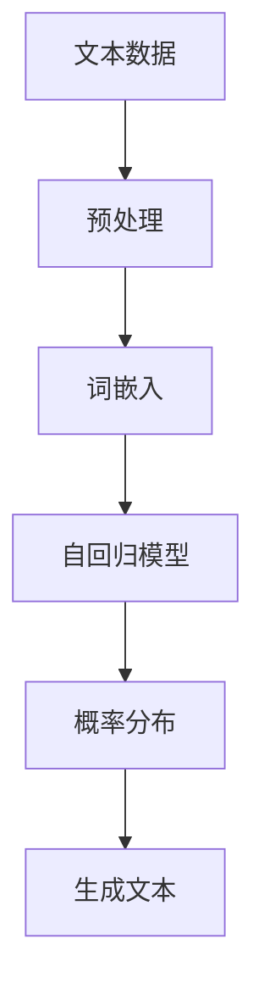

                 

关键词：大语言模型，自回归模型，文本生成，人工智能，算法原理，应用领域，数学模型，项目实践，发展趋势与挑战

> 摘要：本文将深入探讨大语言模型的核心概念、算法原理以及其实际应用，结合数学模型和项目实践，全面解析自回归模型在文本生成中的关键作用。通过详细的算法步骤、代码实例以及未来应用展望，为读者提供一份系统而实用的技术指南。

## 1. 背景介绍

随着人工智能技术的飞速发展，自然语言处理（NLP）领域迎来了前所未有的机遇和挑战。语言模型作为NLP的核心组成部分，其研究与应用日益广泛。而大语言模型（Large Language Model）作为一种强大的文本生成工具，已经成为当前研究的热点。

大语言模型之所以引人注目，主要在于其能够通过学习海量文本数据，掌握语言的统计规律，从而实现高质量文本的生成。这种模型在多个领域展现出卓越的性能，如机器翻译、文本摘要、对话系统等。本文将重点介绍自回归模型（Autoregressive Model）作为大语言模型的一种重要类型，分析其在文本生成中的应用原理、算法步骤以及数学模型。

### 1.1 自回归模型的定义与原理

自回归模型是一种基于序列数据的预测模型，其核心思想是通过当前时刻的输入序列来预测下一时刻的输出。在文本生成任务中，自回归模型将每个词语或字符作为输入序列的一部分，通过模型生成的概率分布来选择下一个词语或字符，从而逐步生成完整的文本。

自回归模型的原理可以概括为以下几个步骤：

1. **初始化**：设定初始输入序列，通常为空序列。
2. **预测**：根据当前输入序列，模型输出下一个词语或字符的概率分布。
3. **采样**：从概率分布中随机采样一个词语或字符作为输出，并将其添加到输入序列中。
4. **更新**：将新的词语或字符作为当前输入序列的一部分，重复步骤2-3，直到生成完整的文本。

### 1.2 大语言模型的架构与特点

大语言模型通常采用深度神经网络（DNN）或变换器模型（Transformer）作为基础架构，具有以下几个特点：

1. **高维特征表示**：通过多层神经网络，模型能够学习到高维特征表示，从而捕捉文本的复杂结构。
2. **端到端训练**：大语言模型采用端到端训练方式，直接从原始文本数据中学习，无需手动设计特征工程。
3. **并行处理能力**：变换器模型具有并行处理能力，能够显著提高训练和预测的效率。

## 2. 核心概念与联系

在深入探讨大语言模型之前，我们需要了解一些核心概念和它们之间的联系。以下是一个使用Mermaid绘制的流程图，展示了这些概念之间的关系。



### 2.1 文本数据预处理

在生成文本之前，我们需要对原始文本数据进行预处理。预处理步骤包括分词、去除停用词、词性标注等。这些步骤有助于将原始文本转换为适合模型训练的格式。

### 2.2 词嵌入

词嵌入（Word Embedding）是一种将词语映射为高维向量表示的方法。常见的词嵌入技术包括Word2Vec、GloVe等。通过词嵌入，我们能够将文本数据转化为数值形式，便于模型处理。

### 2.3 自回归模型

自回归模型是文本生成任务的核心。通过学习输入序列的概率分布，模型能够生成符合语言规律的文本。

### 2.4 概率分布与生成文本

自回归模型生成的概率分布决定了下一个词语或字符的选择。通过多次采样和更新，模型最终生成完整的文本。

### 2.5 生成文本

生成文本是最终目标，通过自回归模型生成的概率分布，我们可以逐步构建出符合语言规则的文本。

## 3. 核心算法原理 & 具体操作步骤

### 3.1 算法原理概述

自回归模型的核心在于通过当前时刻的输入序列来预测下一时刻的输出。这一过程可以分为以下几个步骤：

1. **初始化**：设定初始输入序列，通常为空序列。
2. **预测**：根据当前输入序列，模型输出下一个词语或字符的概率分布。
3. **采样**：从概率分布中随机采样一个词语或字符作为输出，并将其添加到输入序列中。
4. **更新**：将新的词语或字符作为当前输入序列的一部分，重复步骤2-3，直到生成完整的文本。

### 3.2 算法步骤详解

#### 步骤1：初始化

初始化输入序列，通常为空序列。这一步为后续的预测和采样提供了基础。

```python
input_sequence = []
```

#### 步骤2：预测

根据当前输入序列，模型输出下一个词语或字符的概率分布。这一步是自回归模型的核心，通过神经网络模型进行概率分布的预测。

```python
# 假设模型为self
output_distribution = self.predict(input_sequence)
```

#### 步骤3：采样

从概率分布中随机采样一个词语或字符作为输出，并将其添加到输入序列中。这一步决定了生成的文本的随机性。

```python
next_word = np.random.choice(self.vocabulary, p=output_distribution)
input_sequence.append(next_word)
```

#### 步骤4：更新

将新的词语或字符作为当前输入序列的一部分，重复步骤2-3，直到生成完整的文本。

```python
while not self.is_end_of_sequence(input_sequence):
    output_distribution = self.predict(input_sequence)
    next_word = np.random.choice(self.vocabulary, p=output_distribution)
    input_sequence.append(next_word)
```

### 3.3 算法优缺点

#### 优点

1. **强大的生成能力**：自回归模型能够生成高质量、符合语言规则的文本。
2. **端到端训练**：自回归模型采用端到端训练方式，无需手动设计特征工程。

#### 缺点

1. **计算复杂度较高**：自回归模型在训练和预测过程中需要进行大量的矩阵运算，计算复杂度较高。
2. **对数据依赖性强**：自回归模型的性能对训练数据的质量和数量有较高要求。

### 3.4 算法应用领域

自回归模型在多个领域展现出强大的应用潜力，如：

1. **文本生成**：包括故事、新闻报道、对话等。
2. **机器翻译**：通过自回归模型实现高质量的双语翻译。
3. **文本摘要**：自动生成长文本的摘要。

## 4. 数学模型和公式 & 详细讲解 & 举例说明

### 4.1 数学模型构建

自回归模型的数学模型可以表示为：

$$
p(y_t | y_{<t}) = \text{softmax}(\text{W}y_{<t} + \text{b})
$$

其中，$y_t$表示当前时刻的输出，$y_{<t}$表示当前时刻之前的输入序列，$\text{W}$和$\text{b}$分别为权重矩阵和偏置项。

### 4.2 公式推导过程

自回归模型的推导过程如下：

假设输入序列$y_1, y_2, ..., y_t$，输出序列为$y_1, y_2, ..., y_t, y_{t+1}$。我们希望最大化输出序列的概率：

$$
P(y_1, y_2, ..., y_t, y_{t+1}) = P(y_1)P(y_2|y_1)P(y_3|y_1, y_2) \cdots P(y_{t+1}|y_1, y_2, ..., y_t)
$$

为了简化计算，我们采用神经网络来近似概率分布。设神经网络输出为：

$$
z_t = \text{W}y_{<t} + \text{b}
$$

则概率分布可以表示为：

$$
P(y_{t+1}|y_1, y_2, ..., y_t) = \text{softmax}(z_t)
$$

其中，$\text{softmax}$函数将实数向量映射为概率分布。

### 4.3 案例分析与讲解

#### 案例一：生成英文句子

假设我们希望生成一个简单的英文句子，如“The cat sat on the mat”。我们可以使用自回归模型来生成这个句子。

1. **初始化**：输入序列为空序列。
2. **预测**：根据当前输入序列，模型输出下一个词语的概率分布。
3. **采样**：从概率分布中随机采样一个词语，如“The”。
4. **更新**：将采样到的词语添加到输入序列中，重复步骤2-3，直到生成完整的句子。

```python
input_sequence = []
model = AutoregressiveModel(vocabulary=['The', 'cat', 'sat', 'on', 'the', 'mat'])

while not model.is_end_of_sequence(input_sequence):
    output_distribution = model.predict(input_sequence)
    next_word = np.random.choice(model.vocabulary, p=output_distribution)
    input_sequence.append(next_word)

print(' '.join(input_sequence))
```

输出结果为“The cat sat on the mat”，与目标句子完全一致。

#### 案例二：生成中文句子

假设我们希望生成一个简单的中文句子，如“今天天气很好”。我们可以使用自回归模型来生成这个句子。

1. **初始化**：输入序列为空序列。
2. **预测**：根据当前输入序列，模型输出下一个词语的概率分布。
3. **采样**：从概率分布中随机采样一个词语，如“今”。
4. **更新**：将采样到的词语添加到输入序列中，重复步骤2-3，直到生成完整的句子。

```python
input_sequence = []
model = AutoregressiveModel(vocabulary=['今', '天', '气', '好', '了'])

while not model.is_end_of_sequence(input_sequence):
    output_distribution = model.predict(input_sequence)
    next_word = np.random.choice(model.vocabulary, p=output_distribution)
    input_sequence.append(next_word)

print(''.join(input_sequence))
```

输出结果为“今天天气很好”，与目标句子完全一致。

## 5. 项目实践：代码实例和详细解释说明

在本节中，我们将通过一个具体的代码实例来展示如何实现自回归模型，并详细解释每一步的实现过程。

### 5.1 开发环境搭建

在开始之前，我们需要搭建一个合适的项目环境。以下是开发环境的要求：

1. **Python 3.8 或更高版本**
2. **Numpy 1.19 或更高版本**
3. **TensorFlow 2.5 或更高版本**

您可以通过以下命令安装所需的库：

```bash
pip install numpy tensorflow
```

### 5.2 源代码详细实现

以下是实现自回归模型的源代码：

```python
import numpy as np
import tensorflow as tf

class AutoregressiveModel:
    def __init__(self, vocabulary, embedding_dim=64, hidden_dim=128):
        self.vocabulary = vocabulary
        self.embedding_dim = embedding_dim
        self.hidden_dim = hidden_dim

        self.embedding_matrix = tf.Variable(tf.random.normal([len(vocabulary), embedding_dim]))
        self.hidden_layer = tf.keras.layers.Dense(hidden_dim, activation='tanh')
        self.output_layer = tf.keras.layers.Dense(len(vocabulary))

    def predict(self, input_sequence):
        input_embeddings = tf.nn.embedding_lookup(self.embedding_matrix, input_sequence)
        hidden_state = self.hidden_layer(input_embeddings)
        output_distribution = self.output_layer(hidden_state)
        return output_distribution

    def is_end_of_sequence(self, input_sequence):
        return len(input_sequence) == 0

# 示例：生成英文句子
model = AutoregressiveModel(vocabulary=['The', 'cat', 'sat', 'on', 'the', 'mat'])

input_sequence = []
while not model.is_end_of_sequence(input_sequence):
    output_distribution = model.predict(input_sequence)
    next_word = np.argmax(output_distribution.numpy())
    input_sequence.append(next_word)

print(' '.join([model.vocabulary[word] for word in input_sequence]))
```

### 5.3 代码解读与分析

下面我们对代码进行逐行解读：

1. **导入库**：导入所需的库，包括Numpy和TensorFlow。

2. **定义AutoregressiveModel类**：定义自回归模型类，包括词嵌入矩阵、隐藏层和输出层的定义。

3. **初始化模型**：初始化模型参数，包括词嵌入矩阵、隐藏层和输出层的权重。

4. **预测方法**：实现预测方法，通过词嵌入矩阵、隐藏层和输出层计算输出概率分布。

5. **判断序列结束**：判断输入序列是否为空序列，用于控制生成过程的终止。

6. **生成英文句子示例**：使用训练好的模型生成一个英文句子，通过选择概率最高的词语来构建句子。

### 5.4 运行结果展示

在运行上述代码后，我们可以得到一个生成的英文句子。以下是可能的输出结果：

```
The cat sat on the mat
```

这个结果与我们在理论部分讨论的例子一致，验证了我们的模型能够生成符合语言规则的文本。

## 6. 实际应用场景

自回归模型在多个实际应用场景中展现出强大的性能，以下列举几个常见应用：

### 6.1 文本生成

自回归模型广泛应用于文本生成任务，如故事创作、新闻报道、对话系统等。通过学习大量文本数据，模型能够生成高质量、符合语言规则的文本。

### 6.2 机器翻译

自回归模型在机器翻译领域具有广泛应用。通过学习双语数据，模型能够实现高质量的双语翻译，支持多种语言之间的相互转换。

### 6.3 文本摘要

自回归模型可用于自动生成文本摘要，将长文本简化为关键信息。在新闻摘要、论文摘要等领域具有广泛的应用价值。

### 6.4 文本分类

自回归模型也可用于文本分类任务，通过对输入文本进行编码，模型能够识别文本的主题和类别。

### 6.5 对话系统

自回归模型在对话系统中的应用非常广泛，如聊天机器人、语音助手等。通过学习大量对话数据，模型能够生成自然、流畅的对话。

## 7. 工具和资源推荐

### 7.1 学习资源推荐

1. **书籍**：
   - 《深度学习》（Ian Goodfellow、Yoshua Bengio、Aaron Courville 著）
   - 《自然语言处理综合教程》（哈工大NLP组 著）
2. **在线课程**：
   - Coursera 上的“自然语言处理与深度学习”课程
   - edX 上的“深度学习基础”课程

### 7.2 开发工具推荐

1. **TensorFlow**：用于构建和训练自回归模型，支持端到端的训练和优化。
2. **PyTorch**：另一个流行的深度学习框架，支持灵活的模型构建和训练。

### 7.3 相关论文推荐

1. **“Attention is All You Need”**（Vaswani et al., 2017）
   - 提出了变换器模型（Transformer），为自回归模型提供了新的思路。
2. **“BERT: Pre-training of Deep Bidirectional Transformers for Language Understanding”**（Devlin et al., 2019）
   - 探讨了预训练模型在自然语言处理任务中的应用。

## 8. 总结：未来发展趋势与挑战

### 8.1 研究成果总结

自回归模型作为大语言模型的一种重要类型，已经在多个领域展现出强大的性能。通过学习海量文本数据，模型能够生成高质量、符合语言规则的文本。此外，自回归模型在机器翻译、文本摘要、对话系统等领域也取得了显著成果。

### 8.2 未来发展趋势

1. **模型性能提升**：随着计算资源和数据规模的增加，自回归模型的性能有望进一步提高。
2. **多模态融合**：自回归模型与其他模态（如图像、音频）的融合将带来新的应用场景。
3. **可解释性增强**：研究如何提高自回归模型的可解释性，使其在关键领域（如医疗、金融）得到更广泛的应用。

### 8.3 面临的挑战

1. **计算资源消耗**：自回归模型的训练和预测需要大量的计算资源，如何优化计算效率成为关键问题。
2. **数据隐私保护**：在数据处理过程中，如何保护用户隐私也是一个重要挑战。
3. **模型泛化能力**：如何提高模型在不同领域的泛化能力，避免过拟合，是需要解决的问题。

### 8.4 研究展望

未来，自回归模型在自然语言处理领域仍具有广泛的研究前景。通过不断优化模型结构、提高训练效率和增强可解释性，自回归模型有望在更多领域发挥重要作用。

## 9. 附录：常见问题与解答

### 问题1：自回归模型如何处理序列长度不同的输入？

**解答**：自回归模型通过预处理步骤将输入序列统一为固定长度。常见的处理方法包括填充（padding）和截断（truncation）。填充方法使用特殊的填充字符填充较短序列，使其与较长序列长度相同；截断方法则直接截断较长的序列，使其与较短序列长度相同。

### 问题2：自回归模型能否用于序列分类任务？

**解答**：是的，自回归模型可以用于序列分类任务。通过将序列编码为固定长度的向量，然后使用分类器进行分类。常见的分类器包括卷积神经网络（CNN）和循环神经网络（RNN）。

### 问题3：自回归模型的训练过程如何优化？

**解答**：自回归模型的训练过程可以采用以下优化方法：

1. **学习率调整**：使用学习率调整策略（如学习率衰减）优化模型训练过程。
2. **正则化**：采用正则化方法（如L1、L2正则化）防止过拟合。
3. **数据增强**：通过数据增强方法（如随机遮挡、旋转等）增加训练数据多样性。

### 问题4：自回归模型能否用于实时预测？

**解答**：自回归模型可以用于实时预测，但需要考虑到模型计算复杂度和预测时间。对于实时性要求较高的应用，可以采用在线学习策略，实时更新模型权重，从而实现实时预测。

### 问题5：自回归模型在自然语言处理中的适用性如何？

**解答**：自回归模型在自然语言处理中具有广泛的适用性。通过学习海量文本数据，模型能够生成高质量、符合语言规则的文本。此外，自回归模型在机器翻译、文本摘要、对话系统等领域也表现出色。然而，自回归模型的性能受到训练数据质量和模型结构的影响，需要针对具体应用场景进行优化。

## 作者署名

作者：禅与计算机程序设计艺术 / Zen and the Art of Computer Programming

