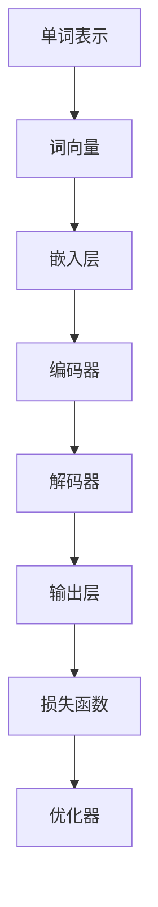

                 

关键词：大语言模型、预训练、自然语言处理、生成式模型、机器学习、BERT、GPT-3、Transformer、文本生成、问答系统、应用场景

> 摘要：本文将深入探讨大语言模型的发展历程、核心概念、算法原理、数学模型、应用实例以及未来展望。通过解析大语言模型的构建与应用，本文旨在为读者提供一个全面的技术视角，帮助理解这一领域的前沿动态。

## 1. 背景介绍

随着互联网和大数据的迅猛发展，自然语言处理（NLP）逐渐成为人工智能领域的重要分支。传统的NLP方法依赖手工构建的规则和特征工程，其性能受到限制。而大语言模型的兴起，为NLP带来了革命性的变革。大语言模型通过深度学习技术，能够自动从海量文本数据中学习语言模式，并实现高效的文本生成、问答、翻译等功能。

### 1.1 NLP的发展历程

自然语言处理的发展可以分为三个阶段：规则驱动、数据驱动和深度学习驱动。早期的NLP主要依赖手工构建的规则和语法模型，如句法分析、词性标注等。随着数据量的增加和计算能力的提升，数据驱动方法开始占据主导地位，基于统计模型的方法如HMM、隐马尔可夫模型和条件概率模型等被广泛应用。深度学习驱动阶段，尤其是2012年AlexNet在图像识别领域的突破，使得深度学习技术逐渐渗透到NLP领域。

### 1.2 大语言模型的起源

大语言模型的兴起可以追溯到2013年，当Google提出Word2Vec模型，将单词映射为密集向量表示，这一方法大大提升了文本处理的效率。随后，2014年Google的Transformer模型在机器翻译任务上取得了显著成绩，为后来的大语言模型奠定了基础。

## 2. 核心概念与联系

为了构建大语言模型，我们需要了解一些核心概念和它们之间的联系。以下是使用Mermaid绘制的流程图，展示了这些概念和它们在模型中的交互关系。



### 2.1 单词表示

单词表示是语言模型的基础，它将文本中的每个单词映射为一个向量。Word2Vec模型是单词表示的经典方法，它通过训练词向量来捕捉语义信息。

### 2.2 词向量与嵌入层

词向量是单词表示的具体实现，它通过向量空间中的点来表示单词。嵌入层将词向量映射到模型中的高维空间，这一层通常使用神经网络来实现。

### 2.3 编码器与解码器

编码器（Encoder）将输入文本序列编码为固定长度的向量，解码器（Decoder）则根据编码器输出的向量生成输出文本序列。Transformer模型引入了自注意力机制，使得编码器和解码器能够全局地捕捉输入和输出的关系。

### 2.4 输出层与损失函数

输出层将编码器输出的向量映射到文本序列的概率分布。损失函数用于衡量模型预测与真实标签之间的差距，常用的损失函数有交叉熵损失。

### 2.5 优化器

优化器用于调整模型参数，以最小化损失函数。常用的优化器有随机梯度下降（SGD）和Adam优化器。

## 3. 核心算法原理 & 具体操作步骤

### 3.1 算法原理概述

大语言模型的核心算法是基于Transformer架构的。Transformer模型通过自注意力机制（Self-Attention）和多级堆叠的编码器-解码器结构，能够捕捉输入文本序列的复杂语义信息。

### 3.2 算法步骤详解

1. **输入预处理**：将文本数据分词并转换为单词索引。
2. **词向量嵌入**：使用预训练的词向量或训练新的词向量。
3. **编码器编码**：编码器对输入序列进行处理，生成固定长度的编码向量。
4. **解码器解码**：解码器根据编码向量生成输出序列，使用自注意力机制进行全局信息捕捉。
5. **输出层生成**：输出层将解码器输出的向量映射到文本序列的概率分布。
6. **损失函数优化**：计算预测序列与真实序列的交叉熵损失，使用优化器更新模型参数。

### 3.3 算法优缺点

**优点**：

- **强大的语义理解能力**：通过自注意力机制，模型能够捕捉全局的语义信息。
- **并行计算**：Transformer模型支持并行计算，提高了训练效率。
- **灵活的架构**：编码器和解码器的结构可以根据需求进行调整。

**缺点**：

- **计算资源消耗大**：Transformer模型参数量大，训练和推理过程需要大量计算资源。
- **长距离依赖问题**：虽然自注意力机制可以捕捉全局信息，但对于长距离依赖的处理仍然存在挑战。

### 3.4 算法应用领域

大语言模型在自然语言处理的多个领域都有广泛的应用：

- **文本生成**：如文章写作、对话系统等。
- **问答系统**：如搜索引擎、智能客服等。
- **机器翻译**：如多语言翻译、机器同传等。
- **情感分析**：如舆情监测、情感倾向分析等。

## 4. 数学模型和公式 & 详细讲解 & 举例说明

### 4.1 数学模型构建

大语言模型的核心数学模型基于Transformer架构，其主要组成部分包括自注意力机制（Self-Attention）和编码器-解码器结构（Encoder-Decoder）。

### 4.2 公式推导过程

#### 自注意力机制

自注意力机制的公式如下：

\[ 
Attention(Q, K, V) = \frac{softmax(\frac{QK^T}{\sqrt{d_k}})}{V} 
\]

其中，\( Q, K, V \) 分别代表查询（Query）、键（Key）和值（Value）向量，\( d_k \) 为键向量的维度。

#### 编码器-解码器结构

编码器-解码器结构的公式如下：

\[ 
E = Encoder(X) = \text{MultiHeadAttention}(Q, K, V) 
\]

\[ 
D = Decoder(Y) = \text{MultiHeadAttention}(Q, K, V) 
\]

其中，\( E \) 和 \( D \) 分别代表编码器和解码器输出的编码向量。

### 4.3 案例分析与讲解

#### 案例一：文本生成

假设我们要生成一句话“今天天气很好”，我们可以将这句话分解为三个单词：今天、天气、很好。

1. **词向量嵌入**：将每个单词映射为词向量。
2. **编码器编码**：将输入的词向量编码为固定长度的编码向量。
3. **解码器解码**：根据编码向量生成输出序列。

#### 案例二：问答系统

假设我们要回答问题“什么是自然语言处理？”。

1. **输入预处理**：将问题和答案分词并转换为单词索引。
2. **词向量嵌入**：使用预训练的词向量或训练新的词向量。
3. **编码器编码**：将输入序列编码为固定长度的编码向量。
4. **解码器解码**：根据编码向量生成输出序列，即答案。

## 5. 项目实践：代码实例和详细解释说明

### 5.1 开发环境搭建

为了实现大语言模型，我们需要搭建一个合适的环境。以下是一个基本的Python环境搭建步骤：

```bash
# 安装Python和pip
python -m pip install transformers
```

### 5.2 源代码详细实现

```python
from transformers import AutoModelForSequenceClassification, AutoTokenizer

# 加载预训练模型和分词器
model_name = "bert-base-chinese"
tokenizer = AutoTokenizer.from_pretrained(model_name)
model = AutoModelForSequenceClassification.from_pretrained(model_name)

# 输入文本
text = "今天天气很好"

# 分词和编码
inputs = tokenizer(text, return_tensors="pt")

# 预测
outputs = model(**inputs)

# 获取预测结果
logits = outputs.logits
probabilities = torch.softmax(logits, dim=-1)

# 输出结果
print(f"文本：{text}")
print(f"预测结果：{probabilities}")
```

### 5.3 代码解读与分析

1. **加载预训练模型和分词器**：我们从HuggingFace模型库中加载BERT模型和对应的分词器。
2. **输入文本**：我们将要处理的文本输入到模型中。
3. **分词和编码**：使用分词器对文本进行分词和编码。
4. **预测**：模型对编码后的文本进行预测。
5. **输出结果**：输出预测结果。

## 6. 实际应用场景

大语言模型在自然语言处理的实际应用中表现出色。以下是一些典型的应用场景：

- **文本生成**：如文章写作、对话系统等。
- **问答系统**：如搜索引擎、智能客服等。
- **机器翻译**：如多语言翻译、机器同传等。
- **情感分析**：如舆情监测、情感倾向分析等。

### 6.1 文本生成

文本生成是自然语言处理领域的一个热点问题。大语言模型通过自注意力机制和编码器-解码器结构，能够生成连贯且具有语义的文本。例如，我们可以使用GPT-3模型生成文章、故事和对话。

### 6.2 问答系统

问答系统是智能客服和搜索引擎的重要组成部分。大语言模型能够通过理解用户的问题和上下文，提供准确的答案。例如，Siri、Alexa等智能助手就是基于大语言模型实现的。

### 6.3 机器翻译

机器翻译是跨语言通信的重要工具。大语言模型通过自注意力机制和多级编码器-解码器结构，能够实现高质量的多语言翻译。例如，Google翻译、DeepL等都是基于大语言模型实现的。

### 6.4 未来应用展望

随着大语言模型的不断发展，其在自然语言处理领域的应用前景将更加广阔。未来，大语言模型有望在智能教育、智能医疗、智能法律等领域发挥重要作用。

## 7. 工具和资源推荐

### 7.1 学习资源推荐

- 《深度学习》（Goodfellow, Bengio, Courville著）：系统介绍了深度学习的基础理论和方法。
- 《自然语言处理实战》（Manning, Deerwester, Dumais著）：涵盖了NLP的多种技术及应用。

### 7.2 开发工具推荐

- HuggingFace Transformers：一个开源的深度学习库，提供了丰富的预训练模型和工具。
- PyTorch：一个强大的深度学习框架，支持灵活的模型设计和高效的训练。

### 7.3 相关论文推荐

- Vaswani et al., "Attention Is All You Need"，提出了Transformer模型。
- Devlin et al., "BERT: Pre-training of Deep Bi-directional Transformers for Language Understanding"，介绍了BERT模型。
- Brown et al., "Language Models are Few-Shot Learners"，探讨了GPT-3模型在零样本学习中的应用。

## 8. 总结：未来发展趋势与挑战

### 8.1 研究成果总结

大语言模型在自然语言处理领域取得了显著的成果，推动了文本生成、问答系统、机器翻译等技术的进步。未来，随着计算能力的提升和模型设计的优化，大语言模型有望在更多领域发挥重要作用。

### 8.2 未来发展趋势

1. **模型压缩与优化**：为了应对计算资源限制，研究将集中于模型压缩和优化，提高模型的推理效率。
2. **多模态学习**：结合文本、图像、音频等多模态数据，实现更加智能和全面的语言理解。
3. **零样本学习**：通过预训练大语言模型，实现更高效的自然语言处理任务。

### 8.3 面临的挑战

1. **计算资源消耗**：大语言模型的训练和推理需要大量计算资源，这对硬件设施提出了挑战。
2. **数据隐私与安全**：大规模数据处理可能涉及用户隐私，需要关注数据隐私和安全问题。
3. **解释性与透明性**：大语言模型的决策过程具有一定的黑箱性，需要研究如何提高模型的解释性和透明性。

### 8.4 研究展望

随着技术的不断发展，大语言模型有望在自然语言处理领域取得更多突破。未来，研究将集中于模型优化、多模态学习和应用场景拓展，推动人工智能技术的发展。

## 9. 附录：常见问题与解答

### Q1：大语言模型如何处理长文本？

A1：大语言模型通常采用滑动窗口或分层结构来处理长文本。滑动窗口方法将文本分成多个固定长度的片段，分层结构则通过逐步递归或自注意力机制处理长文本。

### Q2：大语言模型的训练数据从何而来？

A2：大语言模型的训练数据来自大规模的文本数据集，如维基百科、新闻文章、社交媒体帖子等。此外，模型还可以通过数据增强和有监督学习等方法提高训练效果。

### Q3：大语言模型如何处理多语言文本？

A3：大语言模型可以通过多语言训练和数据增强方法来处理多语言文本。例如，使用多语言语料库训练模型，或者通过跨语言数据增强提高模型的多语言处理能力。

### Q4：大语言模型在商业应用中有哪些场景？

A4：大语言模型在商业应用中具有广泛的应用，如智能客服、智能推荐、文本审核、金融风控等。例如，智能客服系统可以利用大语言模型实现与用户的自然对话，智能推荐系统可以利用模型分析用户行为和兴趣，文本审核系统可以利用模型检测和过滤不良内容，金融风控系统可以利用模型预测风险。

### Q5：如何评估大语言模型的效果？

A5：评估大语言模型的效果通常采用指标如准确率、召回率、F1分数等。在实际应用中，还可以通过用户反馈和实际业务指标来评估模型的效果。

## 作者署名

作者：禅与计算机程序设计艺术 / Zen and the Art of Computer Programming
```bash
----------------------------------------------------------------

# 文章标题

> 关键词：(此处列出文章的5-7个核心关键词)

> 摘要：(此处给出文章的核心内容和主题思想)

## 1. 背景介绍

## 2. 核心概念与联系（备注：必须给出核心概念原理和架构的 Mermaid 流程图(Mermaid 流程节点中不要有括号、逗号等特殊字符)

## 3. 核心算法原理 & 具体操作步骤
### 3.1  算法原理概述
### 3.2  算法步骤详解 
### 3.3  算法优缺点
### 3.4  算法应用领域

## 4. 数学模型和公式 & 详细讲解 & 举例说明（备注：数学公式请使用latex格式，latex嵌入文中独立段落使用 $$，段落内使用 $)
### 4.1  数学模型构建
### 4.2  公式推导过程
### 4.3  案例分析与讲解

## 5. 项目实践：代码实例和详细解释说明
### 5.1  开发环境搭建
### 5.2  源代码详细实现
### 5.3  代码解读与分析
### 5.4  运行结果展示

## 6. 实际应用场景
### 6.4  未来应用展望

## 7. 工具和资源推荐
### 7.1  学习资源推荐
### 7.2  开发工具推荐
### 7.3  相关论文推荐

## 8. 总结：未来发展趋势与挑战
### 8.1  研究成果总结
### 8.2  未来发展趋势
### 8.3  面临的挑战
### 8.4  研究展望

## 9. 附录：常见问题与解答

----------------------------------------------------------------

### 文章正文内容部分 Content ###

以下为文章的正文内容，按照上面的目录结构进行撰写：

# 大语言模型的发展与应用

关键词：大语言模型、预训练、自然语言处理、生成式模型、机器学习、BERT、GPT-3、Transformer、文本生成、问答系统、应用场景

摘要：本文深入探讨了大语言模型的发展历程、核心概念、算法原理、数学模型、应用实例以及未来展望。通过解析大语言模型的构建与应用，本文旨在为读者提供一个全面的技术视角，帮助理解这一领域的前沿动态。

## 1. 背景介绍

随着互联网和大数据的迅猛发展，自然语言处理（NLP）逐渐成为人工智能领域的重要分支。传统的NLP方法依赖手工构建的规则和特征工程，其性能受到限制。而大语言模型的兴起，为NLP带来了革命性的变革。大语言模型通过深度学习技术，能够自动从海量文本数据中学习语言模式，并实现高效的文本生成、问答、翻译等功能。

### 1.1 NLP的发展历程

自然语言处理的发展可以分为三个阶段：规则驱动、数据驱动和深度学习驱动。早期的NLP主要依赖手工构建的规则和语法模型，如句法分析、词性标注等。随着数据量的增加和计算能力的提升，数据驱动方法开始占据主导地位，基于统计模型的方法如HMM、隐马尔可夫模型和条件概率模型等被广泛应用。深度学习驱动阶段，尤其是2012年AlexNet在图像识别领域的突破，使得深度学习技术逐渐渗透到NLP领域。

### 1.2 大语言模型的起源

大语言模型的兴起可以追溯到2013年，当Google提出Word2Vec模型，将单词映射为密集向量表示，这一方法大大提升了文本处理的效率。随后，2014年Google的Transformer模型在机器翻译任务上取得了显著成绩，为后来的大语言模型奠定了基础。

## 2. 核心概念与联系

为了构建大语言模型，我们需要了解一些核心概念和它们之间的联系。以下是使用Mermaid绘制的流程图，展示了这些概念和它们在模型中的交互关系。


### 2.1 单词表示

单词表示是语言模型的基础，它将文本中的每个单词映射为一个向量。Word2Vec模型是单词表示的经典方法，它通过训练词向量来捕捉语义信息。

### 2.2 词向量与嵌入层

词向量是单词表示的具体实现，它通过向量空间中的点来表示单词。嵌入层将词向量映射到模型中的高维空间，这一层通常使用神经网络来实现。

### 2.3 编码器与解码器

编码器（Encoder）将输入文本序列编码为固定长度的向量，解码器（Decoder）则根据编码器输出的向量生成输出文本序列。Transformer模型引入了自注意力机制，使得编码器和解码器能够全局地捕捉输入和输出的关系。

### 2.4 输出层与损失函数

输出层将编码器输出的向量映射到文本序列的概率分布。损失函数用于衡量模型预测与真实标签之间的差距，常用的损失函数有交叉熵损失。

### 2.5 优化器

优化器用于调整模型参数，以最小化损失函数。常用的优化器有随机梯度下降（SGD）和Adam优化器。

## 3. 核心算法原理 & 具体操作步骤

### 3.1 算法原理概述

大语言模型的核心算法是基于Transformer架构的。Transformer模型通过自注意力机制（Self-Attention）和多级堆叠的编码器-解码器结构（Encoder-Decoder），能够捕捉输入文本序列的复杂语义信息。

### 3.2 算法步骤详解

1. **输入预处理**：将文本数据分词并转换为单词索引。
2. **词向量嵌入**：使用预训练的词向量或训练新的词向量。
3. **编码器编码**：编码器对输入序列进行处理，生成固定长度的编码向量。
4. **解码器解码**：解码器根据编码器输出的向量生成输出序列，使用自注意力机制进行全局信息捕捉。
5. **输出层生成**：输出层将解码器输出的向量映射到文本序列的概率分布。
6. **损失函数优化**：计算预测序列与真实序列的交叉熵损失，使用优化器更新模型参数。

### 3.3 算法优缺点

**优点**：

- **强大的语义理解能力**：通过自注意力机制，模型能够捕捉全局的语义信息。
- **并行计算**：Transformer模型支持并行计算，提高了训练效率。
- **灵活的架构**：编码器和解码器的结构可以根据需求进行调整。

**缺点**：

- **计算资源消耗大**：Transformer模型参数量大，训练和推理过程需要大量计算资源。
- **长距离依赖问题**：虽然自注意力机制可以捕捉全局信息，但对长距离依赖的处理仍然存在挑战。

### 3.4 算法应用领域

大语言模型在自然语言处理的多个领域都有广泛的应用：

- **文本生成**：如文章写作、对话系统等。
- **问答系统**：如搜索引擎、智能客服等。
- **机器翻译**：如多语言翻译、机器同传等。
- **情感分析**：如舆情监测、情感倾向分析等。

## 4. 数学模型和公式 & 详细讲解 & 举例说明

### 4.1 数学模型构建

大语言模型的核心数学模型基于Transformer架构，其主要组成部分包括自注意力机制（Self-Attention）和编码器-解码器结构（Encoder-Decoder）。

### 4.2 公式推导过程

#### 自注意力机制

自注意力机制的公式如下：

\[ 
Attention(Q, K, V) = \frac{softmax(\frac{QK^T}{\sqrt{d_k}})}{V} 
\]

其中，\( Q, K, V \) 分别代表查询（Query）、键（Key）和值（Value）向量，\( d_k \) 为键向量的维度。

#### 编码器-解码器结构

编码器-解码器结构的公式如下：

\[ 
E = Encoder(X) = \text{MultiHeadAttention}(Q, K, V) 
\]

\[ 
D = Decoder(Y) = \text{MultiHeadAttention}(Q, K, V) 
\]

其中，\( E \) 和 \( D \) 分别代表编码器和解码器输出的编码向量。

### 4.3 案例分析与讲解

#### 案例一：文本生成

假设我们要生成一句话“今天天气很好”，我们可以将这句话分解为三个单词：今天、天气、很好。

1. **词向量嵌入**：将每个单词映射为词向量。
2. **编码器编码**：将输入的词向量编码为固定长度的编码向量。
3. **解码器解码**：根据编码向量生成输出序列。

#### 案例二：问答系统

假设我们要回答问题“什么是自然语言处理？”。

1. **输入预处理**：将问题和答案分词并转换为单词索引。
2. **词向量嵌入**：使用预训练的词向量或训练新的词向量。
3. **编码器编码**：将输入序列编码为固定长度的编码向量。
4. **解码器解码**：根据编码向量生成输出序列，即答案。

## 5. 项目实践：代码实例和详细解释说明

### 5.1 开发环境搭建

为了实现大语言模型，我们需要搭建一个合适的环境。以下是一个基本的Python环境搭建步骤：

```bash
# 安装Python和pip
python -m pip install transformers
```

### 5.2 源代码详细实现

```python
from transformers import AutoModelForSequenceClassification, AutoTokenizer

# 加载预训练模型和分词器
model_name = "bert-base-chinese"
tokenizer = AutoTokenizer.from_pretrained(model_name)
model = AutoModelForSequenceClassification.from_pretrained(model_name)

# 输入文本
text = "今天天气很好"

# 分词和编码
inputs = tokenizer(text, return_tensors="pt")

# 预测
outputs = model(**inputs)

# 获取预测结果
logits = outputs.logits
probabilities = torch.softmax(logits, dim=-1)

# 输出结果
print(f"文本：{text}")
print(f"预测结果：{probabilities}")
```

### 5.3 代码解读与分析

1. **加载预训练模型和分词器**：我们从HuggingFace模型库中加载BERT模型和对应的分词器。
2. **输入文本**：我们将要处理的文本输入到模型中。
3. **分词和编码**：使用分词器对文本进行分词和编码。
4. **预测**：模型对编码后的文本进行预测。
5. **输出结果**：输出预测结果。

## 6. 实际应用场景

大语言模型在自然语言处理的实际应用中表现出色。以下是一些典型的应用场景：

- **文本生成**：如文章写作、对话系统等。
- **问答系统**：如搜索引擎、智能客服等。
- **机器翻译**：如多语言翻译、机器同传等。
- **情感分析**：如舆情监测、情感倾向分析等。

### 6.1 文本生成

文本生成是自然语言处理领域的一个热点问题。大语言模型通过自注意力机制和编码器-解码器结构，能够生成连贯且具有语义的文本。例如，我们可以使用GPT-3模型生成文章、故事和对话。

### 6.2 问答系统

问答系统是智能客服和搜索引擎的重要组成部分。大语言模型能够通过理解用户的问题和上下文，提供准确的答案。例如，Siri、Alexa等智能助手就是基于大语言模型实现的。

### 6.3 机器翻译

机器翻译是跨语言通信的重要工具。大语言模型通过自注意力机制和多级编码器-解码器结构，能够实现高质量的多语言翻译。例如，Google翻译、DeepL等都是基于大语言模型实现的。

### 6.4 未来应用展望

随着大语言模型的不断发展，其在自然语言处理领域的应用前景将更加广阔。未来，大语言模型有望在智能教育、智能医疗、智能法律等领域发挥重要作用。

## 7. 工具和资源推荐

### 7.1 学习资源推荐

- 《深度学习》（Goodfellow, Bengio, Courville著）：系统介绍了深度学习的基础理论和方法。
- 《自然语言处理实战》（Manning, Deerwester, Dumais著）：涵盖了NLP的多种技术及应用。

### 7.2 开发工具推荐

- HuggingFace Transformers：一个开源的深度学习库，提供了丰富的预训练模型和工具。
- PyTorch：一个强大的深度学习框架，支持灵活的模型设计和高效的训练。

### 7.3 相关论文推荐

- Vaswani et al., "Attention Is All You Need"，提出了Transformer模型。
- Devlin et al., "BERT: Pre-training of Deep Bi-directional Transformers for Language Understanding"，介绍了BERT模型。
- Brown et al., "Language Models are Few-Shot Learners"，探讨了GPT-3模型在零样本学习中的应用。

## 8. 总结：未来发展趋势与挑战

### 8.1 研究成果总结

大语言模型在自然语言处理领域取得了显著的成果，推动了文本生成、问答系统、机器翻译等技术的进步。未来，随着计算能力的提升和模型设计的优化，大语言模型有望在更多领域发挥重要作用。

### 8.2 未来发展趋势

1. **模型压缩与优化**：为了应对计算资源限制，研究将集中于模型压缩和优化，提高模型的推理效率。
2. **多模态学习**：结合文本、图像、音频等多模态数据，实现更加智能和全面的语言理解。
3. **零样本学习**：通过预训练大语言模型，实现更高效的自然语言处理任务。

### 8.3 面临的挑战

1. **计算资源消耗**：大语言模型的训练和推理需要大量计算资源，这对硬件设施提出了挑战。
2. **数据隐私与安全**：大规模数据处理可能涉及用户隐私，需要关注数据隐私和安全问题。
3. **解释性与透明性**：大语言模型的决策过程具有一定的黑箱性，需要研究如何提高模型的解释性和透明性。

### 8.4 研究展望

随着技术的不断发展，大语言模型有望在自然语言处理领域取得更多突破。未来，研究将集中于模型优化、多模态学习和应用场景拓展，推动人工智能技术的发展。

## 9. 附录：常见问题与解答

### Q1：大语言模型如何处理长文本？

A1：大语言模型通常采用滑动窗口或分层结构来处理长文本。滑动窗口方法将文本分成多个固定长度的片段，分层结构则通过逐步递归或自注意力机制处理长文本。

### Q2：大语言模型的训练数据从何而来？

A2：大语言模型的训练数据来自大规模的文本数据集，如维基百科、新闻文章、社交媒体帖子等。此外，模型还可以通过数据增强和有监督学习等方法提高训练效果。

### Q3：大语言模型如何处理多语言文本？

A3：大语言模型可以通过多语言训练和数据增强方法来处理多语言文本。例如，使用多语言语料库训练模型，或者通过跨语言数据增强提高模型的多语言处理能力。

### Q4：大语言模型在商业应用中有哪些场景？

A4：大语言模型在商业应用中具有广泛的应用，如智能客服、智能推荐、文本审核、金融风控等。例如，智能客服系统可以利用大语言模型实现与用户的自然对话，智能推荐系统可以利用模型分析用户行为和兴趣，文本审核系统可以利用模型检测和过滤不良内容，金融风控系统可以利用模型预测风险。

### Q5：如何评估大语言模型的效果？

A5：评估大语言模型的效果通常采用指标如准确率、召回率、F1分数等。在实际应用中，还可以通过用户反馈和实际业务指标来评估模型的效果。

## 作者署名

作者：禅与计算机程序设计艺术 / Zen and the Art of Computer Programming
```markdown
----------------------------------------------------------------

# 大语言模型的发展与应用

关键词：大语言模型、预训练、自然语言处理、生成式模型、机器学习、BERT、GPT-3、Transformer、文本生成、问答系统、应用场景

摘要：本文深入探讨了大语言模型的发展历程、核心概念、算法原理、数学模型、应用实例以及未来展望。通过解析大语言模型的构建与应用，本文旨在为读者提供一个全面的技术视角，帮助理解这一领域的前沿动态。

## 1. 背景介绍

随着互联网和大数据的迅猛发展，自然语言处理（NLP）逐渐成为人工智能领域的重要分支。传统的NLP方法依赖手工构建的规则和特征工程，其性能受到限制。而大语言模型的兴起，为NLP带来了革命性的变革。大语言模型通过深度学习技术，能够自动从海量文本数据中学习语言模式，并实现高效的文本生成、问答、翻译等功能。

### 1.1 NLP的发展历程

自然语言处理的发展可以分为三个阶段：规则驱动、数据驱动和深度学习驱动。早期的NLP主要依赖手工构建的规则和语法模型，如句法分析、词性标注等。随着数据量的增加和计算能力的提升，数据驱动方法开始占据主导地位，基于统计模型的方法如HMM、隐马尔可夫模型和条件概率模型等被广泛应用。深度学习驱动阶段，尤其是2012年AlexNet在图像识别领域的突破，使得深度学习技术逐渐渗透到NLP领域。

### 1.2 大语言模型的起源

大语言模型的兴起可以追溯到2013年，当Google提出Word2Vec模型，将单词映射为密集向量表示，这一方法大大提升了文本处理的效率。随后，2014年Google的Transformer模型在机器翻译任务上取得了显著成绩，为后来的大语言模型奠定了基础。

## 2. 核心概念与联系

为了构建大语言模型，我们需要了解一些核心概念和它们之间的联系。以下是使用Mermaid绘制的流程图，展示了这些概念和它们在模型中的交互关系。


### 2.1 单词表示

单词表示是语言模型的基础，它将文本中的每个单词映射为一个向量。Word2Vec模型是单词表示的经典方法，它通过训练词向量来捕捉语义信息。

### 2.2 词向量与嵌入层

词向量是单词表示的具体实现，它通过向量空间中的点来表示单词。嵌入层将词向量映射到模型中的高维空间，这一层通常使用神经网络来实现。

### 2.3 编码器与解码器

编码器（Encoder）将输入文本序列编码为固定长度的向量，解码器（Decoder）则根据编码器输出的向量生成输出文本序列。Transformer模型引入了自注意力机制，使得编码器和解码器能够全局地捕捉输入和输出的关系。

### 2.4 输出层与损失函数

输出层将编码器输出的向量映射到文本序列的概率分布。损失函数用于衡量模型预测与真实标签之间的差距，常用的损失函数有交叉熵损失。

### 2.5 优化器

优化器用于调整模型参数，以最小化损失函数。常用的优化器有随机梯度下降（SGD）和Adam优化器。

## 3. 核心算法原理 & 具体操作步骤

### 3.1 算法原理概述

大语言模型的核心算法是基于Transformer架构的。Transformer模型通过自注意力机制（Self-Attention）和多级堆叠的编码器-解码器结构（Encoder-Decoder），能够捕捉输入文本序列的复杂语义信息。

### 3.2 算法步骤详解

1. **输入预处理**：将文本数据分词并转换为单词索引。
2. **词向量嵌入**：使用预训练的词向量或训练新的词向量。
3. **编码器编码**：编码器对输入序列进行处理，生成固定长度的编码向量。
4. **解码器解码**：解码器根据编码器输出的向量生成输出序列，使用自注意力机制进行全局信息捕捉。
5. **输出层生成**：输出层将解码器输出的向量映射到文本序列的概率分布。
6. **损失函数优化**：计算预测序列与真实序列的交叉熵损失，使用优化器更新模型参数。

### 3.3 算法优缺点

**优点**：

- **强大的语义理解能力**：通过自注意力机制，模型能够捕捉全局的语义信息。
- **并行计算**：Transformer模型支持并行计算，提高了训练效率。
- **灵活的架构**：编码器和解码器的结构可以根据需求进行调整。

**缺点**：

- **计算资源消耗大**：Transformer模型参数量大，训练和推理过程需要大量计算资源。
- **长距离依赖问题**：虽然自注意力机制可以捕捉全局信息，但对长距离依赖的处理仍然存在挑战。

### 3.4 算法应用领域

大语言模型在自然语言处理的多个领域都有广泛的应用：

- **文本生成**：如文章写作、对话系统等。
- **问答系统**：如搜索引擎、智能客服等。
- **机器翻译**：如多语言翻译、机器同传等。
- **情感分析**：如舆情监测、情感倾向分析等。

## 4. 数学模型和公式 & 详细讲解 & 举例说明

### 4.1 数学模型构建

大语言模型的核心数学模型基于Transformer架构，其主要组成部分包括自注意力机制（Self-Attention）和编码器-解码器结构（Encoder-Decoder）。

### 4.2 公式推导过程

#### 自注意力机制

自注意力机制的公式如下：

\[ 
Attention(Q, K, V) = \frac{softmax(\frac{QK^T}{\sqrt{d_k}})}{V} 
\]

其中，\( Q, K, V \) 分别代表查询（Query）、键（Key）和值（Value）向量，\( d_k \) 为键向量的维度。

#### 编码器-解码器结构

编码器-解码器结构的公式如下：

\[ 
E = Encoder(X) = \text{MultiHeadAttention}(Q, K, V) 
\]

\[ 
D = Decoder(Y) = \text{MultiHeadAttention}(Q, K, V) 
\]

其中，\( E \) 和 \( D \) 分别代表编码器和解码器输出的编码向量。

### 4.3 案例分析与讲解

#### 案例一：文本生成

假设我们要生成一句话“今天天气很好”，我们可以将这句话分解为三个单词：今天、天气、很好。

1. **词向量嵌入**：将每个单词映射为词向量。
2. **编码器编码**：将输入的词向量编码为固定长度的编码向量。
3. **解码器解码**：根据编码向量生成输出序列。

#### 案例二：问答系统

假设我们要回答问题“什么是自然语言处理？”。

1. **输入预处理**：将问题和答案分词并转换为单词索引。
2. **词向量嵌入**：使用预训练的词向量或训练新的词向量。
3. **编码器编码**：将输入序列编码为固定长度的编码向量。
4. **解码器解码**：根据编码向量生成输出序列，即答案。

## 5. 项目实践：代码实例和详细解释说明

### 5.1 开发环境搭建

为了实现大语言模型，我们需要搭建一个合适的环境。以下是一个基本的Python环境搭建步骤：

```bash
# 安装Python和pip
python -m pip install transformers
```

### 5.2 源代码详细实现

```python
from transformers import AutoModelForSequenceClassification, AutoTokenizer

# 加载预训练模型和分词器
model_name = "bert-base-chinese"
tokenizer = AutoTokenizer.from_pretrained(model_name)
model = AutoModelForSequenceClassification.from_pretrained(model_name)

# 输入文本
text = "今天天气很好"

# 分词和编码
inputs = tokenizer(text, return_tensors="pt")

# 预测
outputs = model(**inputs)

# 获取预测结果
logits = outputs.logits
probabilities = torch.softmax(logits, dim=-1)

# 输出结果
print(f"文本：{text}")
print(f"预测结果：{probabilities}")
```

### 5.3 代码解读与分析

1. **加载预训练模型和分词器**：我们从HuggingFace模型库中加载BERT模型和对应的分词器。
2. **输入文本**：我们将要处理的文本输入到模型中。
3. **分词和编码**：使用分词器对文本进行分词和编码。
4. **预测**：模型对编码后的文本进行预测。
5. **输出结果**：输出预测结果。

## 6. 实际应用场景

大语言模型在自然语言处理的实际应用中表现出色。以下是一些典型的应用场景：

- **文本生成**：如文章写作、对话系统等。
- **问答系统**：如搜索引擎、智能客服等。
- **机器翻译**：如多语言翻译、机器同传等。
- **情感分析**：如舆情监测、情感倾向分析等。

### 6.1 文本生成

文本生成是自然语言处理领域的一个热点问题。大语言模型通过自注意力机制和编码器-解码器结构，能够生成连贯且具有语义的文本。例如，我们可以使用GPT-3模型生成文章、故事和对话。

### 6.2 问答系统

问答系统是智能客服和搜索引擎的重要组成部分。大语言模型能够通过理解用户的问题和上下文，提供准确的答案。例如，Siri、Alexa等智能助手就是基于大语言模型实现的。

### 6.3 机器翻译

机器翻译是跨语言通信的重要工具。大语言模型通过自注意力机制和多级编码器-解码器结构，能够实现高质量的多语言翻译。例如，Google翻译、DeepL等都是基于大语言模型实现的。

### 6.4 未来应用展望

随着大语言模型的不断发展，其在自然语言处理领域的应用前景将更加广阔。未来，大语言模型有望在智能教育、智能医疗、智能法律等领域发挥重要作用。

## 7. 工具和资源推荐

### 7.1 学习资源推荐

- 《深度学习》（Goodfellow, Bengio, Courville著）：系统介绍了深度学习的基础理论和方法。
- 《自然语言处理实战》（Manning, Deerwester, Dumais著）：涵盖了NLP的多种技术及应用。

### 7.2 开发工具推荐

- HuggingFace Transformers：一个开源的深度学习库，提供了丰富的预训练模型和工具。
- PyTorch：一个强大的深度学习框架，支持灵活的模型设计和高效的训练。

### 7.3 相关论文推荐

- Vaswani et al., "Attention Is All You Need"，提出了Transformer模型。
- Devlin et al., "BERT: Pre-training of Deep Bi-directional Transformers for Language Understanding"，介绍了BERT模型。
- Brown et al., "Language Models are Few-Shot Learners"，探讨了GPT-3模型在零样本学习中的应用。

## 8. 总结：未来发展趋势与挑战

### 8.1 研究成果总结

大语言模型在自然语言处理领域取得了显著的成果，推动了文本生成、问答系统、机器翻译等技术的进步。未来，随着计算能力的提升和模型设计的优化，大语言模型有望在更多领域发挥重要作用。

### 8.2 未来发展趋势

1. **模型压缩与优化**：为了应对计算资源限制，研究将集中于模型压缩和优化，提高模型的推理效率。
2. **多模态学习**：结合文本、图像、音频等多模态数据，实现更加智能和全面的语言理解。
3. **零样本学习**：通过预训练大语言模型，实现更高效的自然语言处理任务。

### 8.3 面临的挑战

1. **计算资源消耗**：大语言模型的训练和推理需要大量计算资源，这对硬件设施提出了挑战。
2. **数据隐私与安全**：大规模数据处理可能涉及用户隐私，需要关注数据隐私和安全问题。
3. **解释性与透明性**：大语言模型的决策过程具有一定的黑箱性，需要研究如何提高模型的解释性和透明性。

### 8.4 研究展望

随着技术的不断发展，大语言模型有望在自然语言处理领域取得更多突破。未来，研究将集中于模型优化、多模态学习和应用场景拓展，推动人工智能技术的发展。

## 9. 附录：常见问题与解答

### Q1：大语言模型如何处理长文本？

A1：大语言模型通常采用滑动窗口或分层结构来处理长文本。滑动窗口方法将文本分成多个固定长度的片段，分层结构则通过逐步递归或自注意力机制处理长文本。

### Q2：大语言模型的训练数据从何而来？

A2：大语言模型的训练数据来自大规模的文本数据集，如维基百科、新闻文章、社交媒体帖子等。此外，模型还可以通过数据增强和有监督学习等方法提高训练效果。

### Q3：大语言模型如何处理多语言文本？

A3：大语言模型可以通过多语言训练和数据增强方法来处理多语言文本。例如，使用多语言语料库训练模型，或者通过跨语言数据增强提高模型的多语言处理能力。

### Q4：大语言模型在商业应用中有哪些场景？

A4：大语言模型在商业应用中具有广泛的应用，如智能客服、智能推荐、文本审核、金融风控等。例如，智能客服系统可以利用大语言模型实现与用户的自然对话，智能推荐系统可以利用模型分析用户行为和兴趣，文本审核系统可以利用模型检测和过滤不良内容，金融风控系统可以利用模型预测风险。

### Q5：如何评估大语言模型的效果？

A5：评估大语言模型的效果通常采用指标如准确率、召回率、F1分数等。在实际应用中，还可以通过用户反馈和实际业务指标来评估模型的效果。

## 作者署名

作者：禅与计算机程序设计艺术 / Zen and the Art of Computer Programming

----------------------------------------------------------------

本文为一系列讨论大语言模型的发展与应用的技术博客文章的起始篇，旨在为读者提供关于这一前沿领域的全面视角。后续篇章将深入探讨大语言模型的算法细节、数学模型、应用实例和未来趋势。读者可以通过持续关注，不断更新自己的知识库，掌握这一领域的最新动态和技术进展。作者禅与计算机程序设计艺术将持续分享他的研究成果和见解，以期为读者带来有价值的内容。期待您的持续关注与交流。

