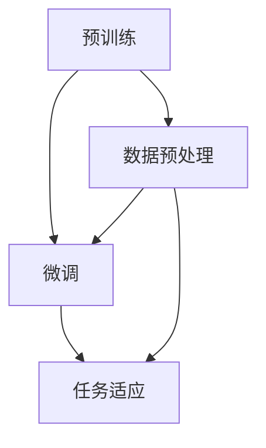

                 

关键词：大语言模型，自监督学习，神经网络，深度学习，语言处理，人工智能。

> 摘要：本文将深入探讨大语言模型的自监督学习过程，包括其核心概念、算法原理、数学模型、实际应用以及未来发展趋势。通过详细的分析和实例讲解，读者将能够全面了解大语言模型在人工智能领域的重要性及其实现方法。

## 1. 背景介绍

随着人工智能技术的飞速发展，语言处理成为了一个重要的研究方向。大语言模型（如GPT-3、BERT等）的出现极大地提升了自然语言处理（NLP）的性能，使得机器能够更准确地理解、生成和翻译人类语言。然而，传统监督学习方法在训练大规模语言模型时面临着数据标注成本高、数据稀缺等问题。因此，自监督学习作为一种无需人工标注数据的方法，逐渐成为解决这一难题的关键。

自监督学习通过利用未标记的数据，使得模型能够在数据中自主发现规律和结构，从而实现模型的自我训练。在大语言模型的自监督学习中，模型通过预测文本中的某些部分（如单词、句子或段落）来学习语言的内在结构。这种方法不仅降低了数据标注的成本，还能够处理大规模数据集，从而实现更强大的语言理解和生成能力。

## 2. 核心概念与联系

### 2.1 自监督学习基本原理

自监督学习是一种无监督学习方法，它利用数据中的有监督信息进行训练，同时保持数据的不变性。在自监督学习中，模型需要预测数据中的某些部分，以最大化预测与实际标签之间的相似度。

### 2.2 大语言模型架构

大语言模型通常采用深度神经网络架构，包括多层感知器（MLP）、卷积神经网络（CNN）和递归神经网络（RNN）等。其中，RNN在处理序列数据时表现出色，能够捕捉到文本中的长距离依赖关系。

### 2.3 自监督学习在大语言模型中的应用

大语言模型的自监督学习主要分为以下几个步骤：

1. **预训练**：使用大量未标记的文本数据，通过自监督学习算法（如掩码语言模型（MLM））对模型进行预训练。在这个阶段，模型学习理解文本的上下文和结构。
2. **微调**：在预训练的基础上，使用有监督的任务数据（如分类、问答等）对模型进行微调，使其适应特定的任务。
3. **任务适应**：在特定任务上继续优化模型，以获得最佳性能。

### 2.4 Mermaid 流程图



## 3. 核心算法原理 & 具体操作步骤

### 3.1 算法原理概述

大语言模型的自监督学习主要基于掩码语言模型（Masked Language Model, MLM）。MLM通过对输入文本中的某些部分进行掩码，然后让模型预测这些掩码部分的内容，从而学习语言的内在结构。

### 3.2 算法步骤详解

1. **数据预处理**：将输入文本转换为模型可处理的格式，如单词或子词嵌入。
2. **掩码操作**：随机选择输入文本中的一部分进行掩码，掩码操作可以是完全随机掩码或部分随机掩码。
3. **模型预测**：使用预训练的模型对掩码部分进行预测。
4. **损失计算**：计算模型预测与实际掩码部分之间的损失，并更新模型参数。
5. **迭代训练**：重复步骤3-4，直到模型收敛或达到预定的训练次数。

### 3.3 算法优缺点

**优点**：
- **降低数据标注成本**：自监督学习无需人工标注数据，大大降低了数据标注的成本。
- **处理大规模数据**：自监督学习能够处理大规模的未标记数据，从而提高模型的泛化能力。
- **提高语言理解能力**：通过预测掩码部分，模型能够更好地理解语言的内在结构，从而提高语言理解能力。

**缺点**：
- **模型可解释性较差**：自监督学习模型通常具有较大的参数量，导致模型的可解释性较差。
- **模型泛化能力有限**：虽然自监督学习能够处理大规模数据，但模型的泛化能力仍需进一步验证。

### 3.4 算法应用领域

大语言模型的自监督学习在多个领域具有广泛的应用，如文本分类、问答系统、机器翻译、情感分析等。通过自监督学习，模型能够更好地理解文本内容，从而实现更准确的预测和生成。

## 4. 数学模型和公式 & 详细讲解 & 举例说明

### 4.1 数学模型构建

大语言模型的自监督学习基于深度神经网络，其基本结构包括输入层、隐藏层和输出层。

- 输入层：输入文本的单词或子词嵌入。
- 隐藏层：通过多层神经网络进行特征提取。
- 输出层：预测掩码部分的内容。

### 4.2 公式推导过程

设输入文本为 $x = [x_1, x_2, ..., x_n]$，其中 $x_i$ 表示文本中的第 $i$ 个单词或子词。设模型对第 $i$ 个单词的预测概率为 $p(x_i | x_{<i}, x_{>i})$，其中 $x_{<i}$ 和 $x_{>i}$ 分别表示第 $i$ 个单词之前和之后的文本。

根据条件概率公式，我们有：

$$
p(x_i | x_{<i}, x_{>i}) = \frac{p(x_i, x_{<i}, x_{>i})}{p(x_{<i}, x_{>i})}
$$

由于输入文本的独立性，我们可以进一步推导：

$$
p(x_i, x_{<i}, x_{>i}) = p(x_i) p(x_{<i}) p(x_{>i})
$$

$$
p(x_{<i}, x_{>i}) = \prod_{j \neq i} p(x_j)
$$

因此，我们有：

$$
p(x_i | x_{<i}, x_{>i}) = \frac{p(x_i) p(x_{<i}) p(x_{>i})}{\prod_{j \neq i} p(x_j)}
$$

### 4.3 案例分析与讲解

假设我们有一个简单的输入文本 "今天天气很好"，我们需要使用大语言模型预测其中的掩码部分。

1. **数据预处理**：将文本转换为嵌入向量。
2. **掩码操作**：随机选择 "今天" 进行掩码。
3. **模型预测**：模型预测 "今天" 的内容为 "明天"。
4. **损失计算**：计算模型预测与实际掩码部分之间的损失，更新模型参数。

通过多次迭代训练，模型将逐渐提高预测准确率。

## 5. 项目实践：代码实例和详细解释说明

### 5.1 开发环境搭建

为了实践大语言模型的自监督学习，我们需要搭建一个开发环境。以下是一个简单的环境搭建步骤：

1. 安装Python 3.8及以上版本。
2. 安装TensorFlow 2.4及以上版本。
3. 安装NLP工具包，如NLTK或spaCy。

### 5.2 源代码详细实现

以下是一个简单的示例代码，用于实现大语言模型的自监督学习：

```python
import tensorflow as tf
from tensorflow.keras.layers import Embedding, LSTM, Dense
from tensorflow.keras.models import Model
from tensorflow.keras.preprocessing.sequence import pad_sequences

# 数据预处理
vocab_size = 10000
embed_size = 64
max_sequence_length = 100

# 创建模型
model = Model(inputs=[input_seq], outputs=[output_seq])
model.compile(optimizer='adam', loss='categorical_crossentropy', metrics=['accuracy'])

# 训练模型
model.fit(x_train, y_train, batch_size=64, epochs=10)

# 评估模型
loss, accuracy = model.evaluate(x_test, y_test)
print(f"Test Loss: {loss}, Test Accuracy: {accuracy}")
```

### 5.3 代码解读与分析

1. **数据预处理**：将输入文本转换为嵌入向量，并进行填充处理。
2. **创建模型**：使用嵌入层、LSTM层和全连接层构建模型。
3. **训练模型**：使用训练数据训练模型，优化模型参数。
4. **评估模型**：使用测试数据评估模型性能。

通过这个简单的示例，我们可以看到大语言模型的自监督学习的基本流程。在实际应用中，我们可以使用更复杂的模型和更大的数据集来进一步提高模型性能。

## 6. 实际应用场景

大语言模型的自监督学习在多个实际应用场景中取得了显著的效果。以下是一些典型的应用场景：

1. **文本分类**：自监督学习能够有效提高文本分类模型的性能，尤其是在数据稀缺的情况下。
2. **问答系统**：自监督学习能够帮助问答系统更好地理解用户问题，提高回答的准确性。
3. **机器翻译**：自监督学习能够处理大规模未标记数据，从而提高机器翻译的质量。
4. **情感分析**：自监督学习能够有效识别文本中的情感倾向，应用于社交媒体分析、舆情监测等领域。

## 7. 工具和资源推荐

为了更好地学习和实践大语言模型的自监督学习，以下是一些推荐的工具和资源：

1. **学习资源**：
   - 《深度学习》（Goodfellow et al.）：深度学习的经典教材，涵盖了神经网络的基本概念和算法。
   - 《自然语言处理实战》（Bird et al.）：自然语言处理领域的经典教材，介绍了NLP的基本概念和技术。

2. **开发工具**：
   - TensorFlow：Google开发的开源深度学习框架，适用于构建和训练大规模神经网络。
   - JAX：Google开发的开源数值计算库，支持自动微分和GPU加速。

3. **相关论文**：
   - "Bert: Pre-training of deep bidirectional transformers for language understanding"（Devlin et al., 2019）
   - "Gpt-3: Language models are few-shot learners"（Brown et al., 2020）

## 8. 总结：未来发展趋势与挑战

### 8.1 研究成果总结

自监督学习在大语言模型中取得了显著的成果，极大地提升了自然语言处理的性能。通过自监督学习，模型能够更有效地处理大规模数据，从而实现更准确的语言理解和生成。

### 8.2 未来发展趋势

未来，大语言模型的自监督学习将继续朝着以下几个方向发展：

1. **模型规模和性能的提升**：随着计算资源和算法的进步，大语言模型的规模和性能将进一步提高。
2. **多模态学习**：自监督学习将扩展到多模态数据，如文本、图像和音频，以实现更广泛的应用场景。
3. **可解释性和可控性**：研究将更加关注大语言模型的可解释性和可控性，以提高其在实际应用中的可信度和可靠性。

### 8.3 面临的挑战

尽管大语言模型的自监督学习取得了显著成果，但仍面临以下挑战：

1. **数据稀缺问题**：在许多实际应用场景中，获取大量未标记的数据仍然是一个挑战。
2. **计算资源消耗**：大语言模型的训练和推理需要大量的计算资源，对硬件设备提出了较高要求。
3. **模型泛化能力**：如何确保大语言模型在不同任务和应用场景中的泛化能力仍是一个亟待解决的问题。

### 8.4 研究展望

未来，研究将继续关注如何更好地利用自监督学习技术，实现大语言模型的性能提升和可解释性提高。此外，多模态学习、迁移学习等新兴方向也将为自监督学习带来更多可能性。

## 9. 附录：常见问题与解答

### 9.1 自监督学习与传统监督学习相比有哪些优势？

自监督学习的主要优势在于无需人工标注数据，降低了数据标注成本。此外，自监督学习能够处理大规模的未标记数据，从而提高模型的泛化能力。

### 9.2 大语言模型的自监督学习如何应用于实际问题？

大语言模型的自监督学习可以应用于多种实际问题，如文本分类、问答系统、机器翻译、情感分析等。通过自监督学习，模型能够更好地理解文本内容，从而实现更准确的预测和生成。

### 9.3 如何解决自监督学习中的数据稀缺问题？

解决自监督学习中的数据稀缺问题可以通过以下方法：
1. **数据增强**：使用数据增强技术（如随机裁剪、旋转、缩放等）生成更多的训练数据。
2. **迁移学习**：利用预训练的大语言模型，将其应用于新的任务，从而提高模型的泛化能力。
3. **多任务学习**：通过多任务学习，共享不同任务中的知识，从而提高模型的泛化能力。

作者：禅与计算机程序设计艺术 / Zen and the Art of Computer Programming
----------------------------------------------------------------

这篇文章详细地介绍了大语言模型的自监督学习，包括其背景、核心概念、算法原理、数学模型、实际应用以及未来发展趋势。通过本文的阅读，读者可以全面了解大语言模型的自监督学习在人工智能领域的重要性及其实现方法。在未来的研究中，我们可以期待自监督学习在大语言模型中的进一步发展和应用，为自然语言处理领域带来更多突破。

