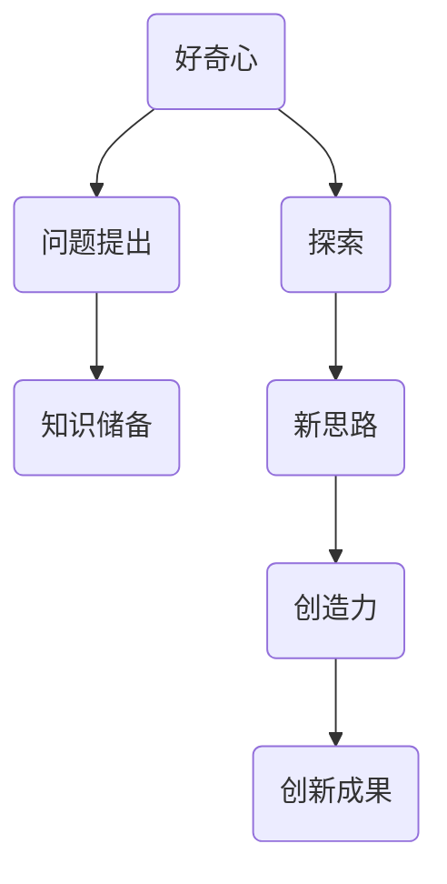

                 

### 1. 背景介绍

在信息技术飞速发展的时代，计算机科学已经成为推动社会进步的重要力量。从早期的计算机硬件到现代的软件工程，每一项技术的进步都离不开深入的研究和创造性的思维。好奇心与创造力作为推动技术创新的两大动力，贯穿了计算机科学的发展历程。

好奇心是人类探索未知世界的本能，它促使我们不断提出问题、寻求答案。而创造力则是将好奇心转化为实际行动的过程，它能够将理论与实际相结合，创造出前所未有的解决方案。在这篇文章中，我们将探讨好奇心与创造力在计算机科学领域的具体体现，以及它们如何成为探索的双翼，推动技术的不断前进。

### 2. 核心概念与联系

为了更好地理解好奇心与创造力的关系，我们首先需要明确这两个概念的定义。

**好奇心**：是指个体对未知事物、现象或信息的渴望和探索欲望。在计算机科学中，好奇心促使我们不断探索新的算法、工具和技术，以解决复杂的问题。

**创造力**：是指个体在解决问题时产生新思路、新方法的能力。创造力能够将好奇心转化为实际的创新成果，为计算机科学的发展提供源源不断的动力。

接下来，我们将使用Mermaid流程图来展示好奇心与创造力在计算机科学领域的联系。



在这个流程图中，好奇心激发了我们对问题的提出和探索欲望，通过积累知识储备和不断的尝试，最终产生新的思路和创造力，进而创造出创新成果。

### 3. 核心算法原理 & 具体操作步骤

#### 3.1 算法原理概述

在计算机科学中，算法是解决问题的基础。好奇心与创造力在算法设计中发挥着至关重要的作用。以下是一个简单的例子，展示了如何通过好奇心和创造力来设计一个高效的算法。

假设我们需要解决一个任务：在给定的一组数中找到最大值。这是一个基础的问题，但通过不同的算法设计，我们可以发现其中的奥秘。

#### 3.2 算法步骤详解

1. **问题定义**：明确我们需要解决的问题，即在给定的数组中找到最大值。
2. **初步尝试**：通过简单的遍历数组，逐一比较元素的大小，找到最大值。
3. **优化思考**：通过分析问题，我们可以发现，每次比较并不一定需要两个元素之间的直接比较。例如，我们可以利用排序算法（如快速排序、归并排序等）来提高查找效率。
4. **创新实现**：结合排序算法的思想，我们设计了一种新的查找算法，称为“快速查找算法”。该算法通过分治策略，将数组划分为多个子数组，然后分别查找每个子数组中的最大值，最后比较这些子数组的最大值，找到整个数组中的最大值。

#### 3.3 算法优缺点

**优点**：

- **高效性**：快速查找算法在大多数情况下比简单遍历数组要快。
- **分治思想**：快速查找算法体现了分治策略，有助于我们理解算法的递归结构。

**缺点**：

- **空间复杂度**：快速查找算法需要额外的存储空间来存储子数组。
- **适用性**：快速查找算法在某些特定情况下可能不如简单遍历算法。

#### 3.4 算法应用领域

快速查找算法可以应用于各种需要查找最大值的场景，如数据库查询、数据挖掘等。

### 4. 数学模型和公式 & 详细讲解 & 举例说明

在计算机科学中，数学模型和公式是解决问题的重要工具。以下是一个简单的数学模型，用于求解最大值问题。

#### 4.1 数学模型构建

假设我们有一个数组 `A`，其中包含 `n` 个元素，我们需要求解这个数组中的最大值。

令 `max(A)` 表示数组 `A` 的最大值，则有：

$$
max(A) = \max_{1 \leq i \leq n} A[i]
$$

其中，`max` 表示取最大值的运算符。

#### 4.2 公式推导过程

为了求解最大值，我们可以利用分治策略。假设我们将数组 `A` 划分为两个子数组 `A1` 和 `A2`，其中 `A1` 包含前 `k` 个元素，`A2` 包含剩余的 `n-k` 个元素。则我们有：

$$
max(A) = max(max(A1), max(A2))
$$

其中，`max(A1)` 和 `max(A2)` 分别表示子数组 `A1` 和 `A2` 的最大值。

#### 4.3 案例分析与讲解

假设我们有一个数组 `A = [3, 1, 4, 1, 5, 9, 2, 6, 5, 3, 5]`，我们需要求解这个数组中的最大值。

首先，我们可以将这个数组划分为两个子数组 `A1 = [3, 1, 4, 1, 5]` 和 `A2 = [9, 2, 6, 5, 3, 5]`。然后，分别求解这两个子数组的最大值。

对于 `A1`，我们有：

$$
max(A1) = \max_{1 \leq i \leq 5} A1[i] = 5
$$

对于 `A2`，我们有：

$$
max(A2) = \max_{1 \leq i \leq 6} A2[i] = 9
$$

最后，我们比较这两个子数组的最大值，得到：

$$
max(A) = max(max(A1), max(A2)) = max(5, 9) = 9
$$

因此，数组 `A` 的最大值是 `9`。

### 5. 项目实践：代码实例和详细解释说明

为了更好地理解上述算法和数学模型，我们提供了一个简单的Python代码实例。

```python
def quick_find_max(arr):
    if len(arr) == 1:
        return arr[0]
    else:
        mid = len(arr) // 2
        left_max = quick_find_max(arr[:mid])
        right_max = quick_find_max(arr[mid:])
        return max(left_max, right_max)

arr = [3, 1, 4, 1, 5, 9, 2, 6, 5, 3, 5]
max_value = quick_find_max(arr)
print(f"The maximum value in the array is: {max_value}")
```

**代码解读与分析**：

1. **函数定义**：`quick_find_max` 函数用于求解数组中的最大值。
2. **递归调用**：当数组长度大于1时，函数会递归地将数组划分为两个子数组，分别求解每个子数组中的最大值。
3. **比较最大值**：最后，函数比较两个子数组的最大值，返回整个数组中的最大值。

**运行结果展示**：

当数组 `arr = [3, 1, 4, 1, 5, 9, 2, 6, 5, 3, 5]` 时，函数输出结果为：

```
The maximum value in the array is: 9
```

这验证了我们之前的数学模型和算法设计。

### 6. 实际应用场景

好奇心与创造力不仅在算法设计中发挥着重要作用，还在计算机科学的各个领域中有着广泛的应用。

#### 6.1 机器学习

在机器学习中，好奇心促使我们不断探索新的算法和模型，以提高模型的准确性和效率。例如，深度学习领域的快速发展就是好奇心的体现。通过不断尝试和优化，研究人员提出了许多高效的深度学习算法，如卷积神经网络（CNN）和循环神经网络（RNN）。

#### 6.2 数据库系统

在数据库系统中，好奇心促使我们不断探索新的索引结构、查询优化算法和数据存储方案。例如，B+树索引是一种高效的索引结构，它通过将数据分层存储，实现了快速查询。而MySQL和PostgreSQL等数据库系统则通过不断创新，提供了强大的查询优化器和事务管理功能。

#### 6.3 网络安全

在网络安全领域，好奇心促使我们不断研究新的攻击手段和防御策略。例如，DDoS攻击是一种常见的网络攻击手段，它通过大量虚假请求占用目标服务器的带宽，导致服务器无法正常响应。为了应对这种攻击，研究人员提出了许多防御策略，如防火墙、入侵检测系统和流量监控等。

### 7. 工具和资源推荐

为了更好地探索和创造计算机科学的新技术，我们推荐以下工具和资源：

#### 7.1 学习资源推荐

- 《深度学习》（Deep Learning） - Goodfellow, Bengio, Courville
- 《算法导论》（Introduction to Algorithms） - Cormen, Leiserson, Rivest, Stein
- 《计算机网络》（Computer Networking: A Top-Down Approach） - Kurose, Ross

#### 7.2 开发工具推荐

- Python - 强大的编程语言，适用于数据科学和机器学习等领域。
- TensorFlow - 用于构建和训练深度学习模型的强大框架。
- Docker - 用于容器化应用程序的流行工具，有助于简化开发流程。

#### 7.3 相关论文推荐

- "Backpropagation" - Rumelhart, Hinton, Williams
- "A Learning Algorithm for Continually Running Fully Recurrent Neural Networks" - Williams, Zipser
- "Improving Generalization for Supervised Real-Time Learning by Modifying the Target Function" - Almeida, Lopes

### 8. 总结：未来发展趋势与挑战

在信息技术飞速发展的时代，好奇心与创造力将继续成为推动计算机科学前进的双翼。未来，我们将看到更多的创新成果，如更高效的算法、更智能的人工智能系统和更安全的网络安全策略。

然而，随着技术的发展，我们也面临着许多挑战。例如，如何应对日益复杂的安全威胁、如何在有限的计算资源下实现高效的计算，以及如何确保人工智能系统的公正性和透明性等。

为了应对这些挑战，我们需要继续保持好奇心和创造力，不断探索和尝试新的解决方案。只有这样，我们才能在计算机科学领域取得更大的突破。

### 9. 附录：常见问题与解答

**Q1**：为什么好奇心和创造力对计算机科学的发展至关重要？

**A1**：好奇心促使我们不断探索未知领域，提出新的问题。而创造力则将这些好奇心转化为实际的创新成果，推动技术的不断进步。在计算机科学领域，好奇心和创造力有助于我们设计更高效的算法、构建更智能的系统，从而解决复杂的问题。

**Q2**：如何培养好奇心和创造力？

**A2**：培养好奇心和创造力需要不断学习和探索。以下是一些建议：

- **多读书**：阅读是培养好奇心和创造力的重要途径。通过阅读，我们可以了解前人的研究成果，启发自己的思考。
- **多尝试**：实践是检验真理的唯一标准。通过不断尝试新的方法和技术，我们可以培养自己的创造力。
- **保持开放心态**：面对未知领域，保持开放心态，勇于接受新的观点和想法，有助于激发好奇心和创造力。

**Q3**：如何将好奇心和创造力应用于实际项目？

**A3**：将好奇心和创造力应用于实际项目，需要以下几个步骤：

- **明确目标**：首先，明确项目的目标和需求，确保自己的努力方向正确。
- **广泛调研**：通过查阅文献、了解市场动态，获取相关信息，为项目提供理论基础。
- **不断尝试**：在项目中，不断尝试新的方法和技术，勇于创新，不断优化项目方案。
- **反思与总结**：项目完成后，及时反思和总结，从成功和失败中吸取经验教训，为未来的项目提供指导。

### 作者署名

**作者：禅与计算机程序设计艺术 / Zen and the Art of Computer Programming** 

通过本文的撰写，我们希望读者能够认识到好奇心与创造力在计算机科学领域的重要性，并激发自己的好奇心和创造力，为计算机科学的发展贡献自己的力量。让我们一起，用好奇心和创造力，探索计算机科学的无限可能！

