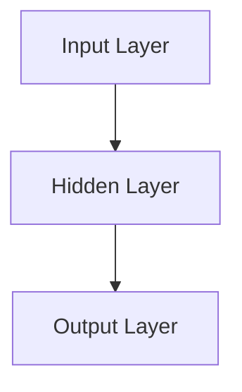
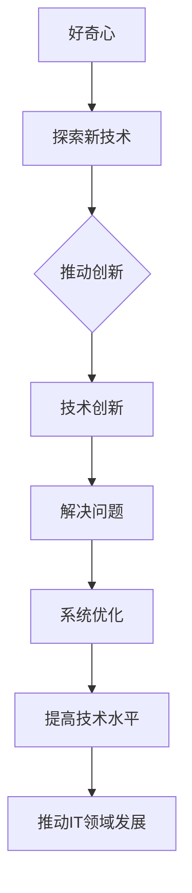
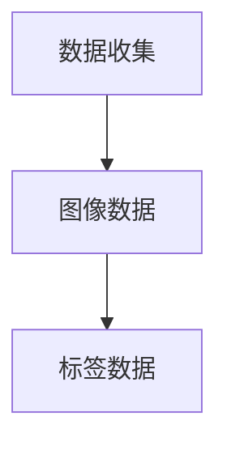
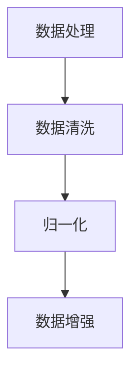
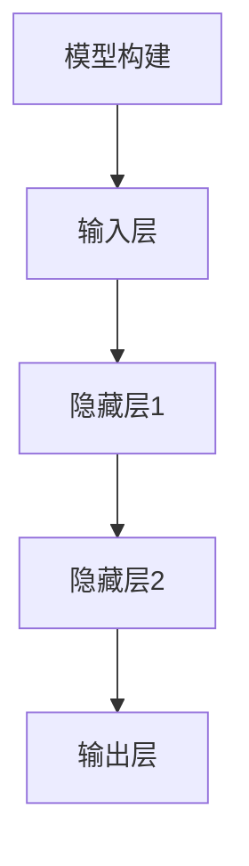
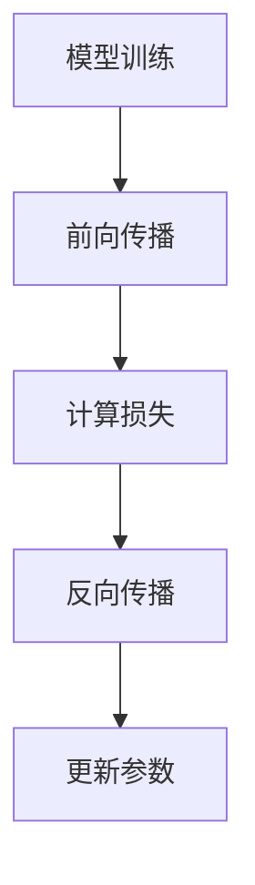
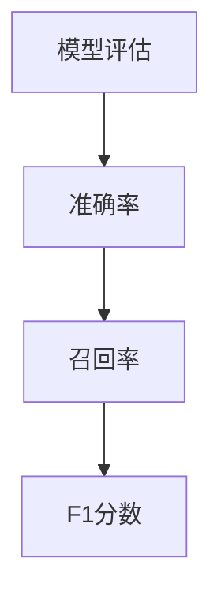
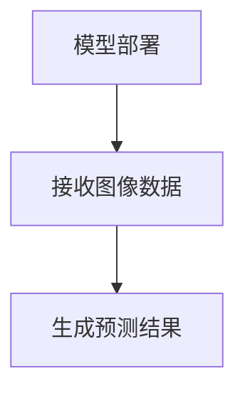

                 

好奇心与求知欲是推动人类进步和科技创新的强大动力。在IT领域，这两个特质更是不可或缺。本文将深入探讨好奇心与求知欲在推动技术发展、创新和解决问题的过程中所扮演的关键角色，并通过具体案例展示它们如何激发我们对技术的无尽探索。

## 文章关键词

- 好奇心
- 求知欲
- IT领域
- 技术创新
- 问题解决
- 探索动力

## 文章摘要

本文通过分析好奇心与求知欲对技术发展的推动作用，探讨了这两个特质在IT领域的具体体现。文章从背景介绍开始，逐步深入核心概念与联系、算法原理与操作步骤、数学模型与公式、项目实践、实际应用场景、工具和资源推荐、总结与展望等多个方面，全面阐述了好奇心与求知欲在推动技术进步中的重要性。

### 1. 背景介绍

人类的历史是一部不断探索和求知的历史。从古至今，好奇心与求知欲一直是推动人类文明进步的重要动力。在IT领域，这两个特质尤为重要。IT技术的快速发展离不开科学家和工程师的好奇心和求知欲。他们不断探索新的技术，解决复杂的问题，推动着整个行业向前发展。

好奇心是一种强烈的求知欲望，它驱使人们去发现未知、探索新的领域。求知欲则是追求知识和真理的动力，它促使人们不断学习和研究，不断挑战自我。在IT领域，好奇心和求知欲共同激发了人们对技术的无尽探索，推动了无数创新和突破。

### 2. 核心概念与联系

为了更好地理解好奇心与求知欲在IT领域的作用，我们首先需要明确一些核心概念。以下是几个重要的概念及其之间的联系：

#### 2.1 好奇心

好奇心是一种内在的驱动力，它促使人们去探索新的事物、发现新的现象。在IT领域，好奇心表现为对新技术、新工具、新算法的探索欲望。例如，量子计算、人工智能、区块链等新兴技术都源于科学家和工程师的好奇心。

#### 2.2 求知欲

求知欲是追求知识和真理的动力，它驱使人们去学习和研究。在IT领域，求知欲表现为对技术原理、算法模型、编程语言的深入探究。通过不断学习和研究，工程师们能够更好地理解和应用技术，解决复杂的问题。

#### 2.3 技术创新

好奇心和求知欲共同推动了技术的创新。通过不断的探索和求知，科学家和工程师们能够发现新的技术、新的方法，从而推动整个行业的发展。例如，谷歌的PageRank算法、苹果的Siri语音助手等，都是好奇心和求知欲的产物。

#### 2.4 问题解决

在IT领域，好奇心和求知欲也是解决问题的关键。在面对复杂问题时，好奇心促使人们去寻找解决方案，求知欲则驱使他们深入研究，找到最优的解决方法。例如，在开发新型操作系统时，工程师们需要通过不断地试验和优化，解决各种性能和稳定性问题。

### 3. 核心算法原理 & 具体操作步骤

为了更具体地展示好奇心与求知欲在IT领域的应用，我们以深度学习为例，介绍其核心算法原理和具体操作步骤。

#### 3.1 算法原理概述

深度学习是一种基于人工神经网络（ANN）的机器学习技术，它通过多层神经网络模型对数据进行特征提取和模式识别。深度学习的核心算法是神经网络，神经网络由多层神经元组成，通过前向传播和反向传播算法训练模型。

#### 3.2 算法步骤详解

1. **数据收集**：收集大量带有标签的数据，例如图像、文本、声音等。
2. **数据处理**：对收集到的数据进行预处理，包括数据清洗、归一化、数据增强等。
3. **模型构建**：设计并构建多层神经网络模型，包括输入层、隐藏层和输出层。
4. **模型训练**：通过前向传播计算输出结果，与实际标签进行比较，计算损失函数，通过反向传播更新模型参数。
5. **模型评估**：使用测试集评估模型性能，调整超参数和模型结构，优化模型。
6. **模型部署**：将训练好的模型部署到实际应用场景中，例如图像识别、语音识别等。

#### 3.3 算法优缺点

- 优点：深度学习具有强大的特征提取和模式识别能力，可以处理复杂的任务，如图像识别、自然语言处理等。
- 缺点：训练深度学习模型需要大量的数据和计算资源，且模型可解释性较差。

#### 3.4 算法应用领域

深度学习在IT领域有广泛的应用，包括但不限于以下领域：

- 图像识别与处理：人脸识别、图像分类、图像生成等。
- 自然语言处理：机器翻译、文本分类、情感分析等。
- 声音处理：语音识别、语音合成、音乐生成等。
- 游戏：深度强化学习在游戏中的应用，如围棋、电子竞技等。

### 4. 数学模型和公式 & 详细讲解 & 举例说明

为了深入理解深度学习算法，我们需要了解其背后的数学模型和公式。以下是深度学习模型中几个关键数学概念及其公式。

#### 4.1 数学模型构建

- **激活函数**：激活函数是神经网络中用于引入非线性因素的函数，常见的激活函数包括 sigmoid、ReLU、Tanh 等。

  $$ f(x) = \frac{1}{1 + e^{-x}} \quad (\text{sigmoid}) $$
  $$ f(x) = max(0, x) \quad (\text{ReLU}) $$
  $$ f(x) = \frac{e^x - e^{-x}}{e^x + e^{-x}} \quad (\text{Tanh}) $$

- **损失函数**：损失函数用于衡量模型预测结果与实际结果之间的差异，常见的损失函数包括均方误差（MSE）、交叉熵损失等。

  $$ L(y, \hat{y}) = \frac{1}{2} \sum_{i=1}^{n} (y_i - \hat{y}_i)^2 \quad (\text{MSE}) $$
  $$ L(y, \hat{y}) = -\sum_{i=1}^{n} y_i \log(\hat{y}_i) \quad (\text{Cross-Entropy}) $$

- **梯度下降**：梯度下降是一种优化算法，用于更新模型参数，使其最小化损失函数。

  $$ \theta_{t+1} = \theta_{t} - \alpha \cdot \nabla_{\theta} J(\theta) $$

其中，$\theta$表示模型参数，$\alpha$为学习率，$J(\theta)$为损失函数。

#### 4.2 公式推导过程

以下是深度学习算法中一个关键公式——反向传播算法的推导过程。

1. **前向传播**：

   给定输入 $x$ 和模型参数 $\theta$，通过前向传播计算输出 $\hat{y}$：

   $$ \hat{y} = f(\theta \cdot x) $$

2. **计算损失函数**：

   使用损失函数 $L(y, \hat{y})$ 计算 $y$ 和 $\hat{y}$ 之间的差异。

3. **计算梯度**：

   对模型参数 $\theta$ 求导，得到梯度 $\nabla_{\theta} L(y, \hat{y})$。

4. **反向传播**：

   通过反向传播算法，将梯度从输出层传播到输入层，更新模型参数。

#### 4.3 案例分析与讲解

以下是一个简单的神经网络模型，用于图像分类。该模型包含一个输入层、一个隐藏层和一个输出层，使用ReLU作为激活函数，交叉熵损失函数计算模型损失。



1. **输入层**：

   输入一个28x28的像素矩阵 $x$，表示一幅图像。

2. **隐藏层**：

   通过隐藏层神经元计算特征映射 $h$：

   $$ h = \sigma(W \cdot x + b) $$

   其中，$W$ 为隐藏层权重，$b$ 为隐藏层偏置，$\sigma$ 为 ReLU激活函数。

3. **输出层**：

   通过输出层神经元计算分类概率 $\hat{y}$：

   $$ \hat{y} = \sigma(W' \cdot h + b') $$

   其中，$W'$ 为输出层权重，$b'$ 为输出层偏置。

4. **损失函数**：

   使用交叉熵损失函数计算模型损失：

   $$ L(y, \hat{y}) = -\sum_{i=1}^{n} y_i \log(\hat{y}_i) $$

   其中，$y$ 为实际标签，$\hat{y}$ 为预测标签。

5. **反向传播**：

   通过反向传播算法更新模型参数：

   $$ \nabla_{W} L(y, \hat{y}) = \frac{\partial L(y, \hat{y})}{\partial W} = \hat{y} - y $$
   $$ \nabla_{b} L(y, \hat{y}) = \frac{\partial L(y, \hat{y})}{\partial b} = \hat{y} - y $$

   其中，$\nabla$ 表示梯度运算符。

### 5. 项目实践：代码实例和详细解释说明

以下是一个简单的Python代码示例，用于实现上述神经网络模型。

```python
import numpy as np

def sigmoid(x):
    return 1 / (1 + np.exp(-x))

def relu(x):
    return np.maximum(0, x)

def cross_entropy_loss(y, y_pred):
    return -np.sum(y * np.log(y_pred))

def forward_propagation(x, W, b):
    h = relu(np.dot(x, W) + b)
    y_pred = sigmoid(np.dot(h, W) + b)
    return h, y_pred

def backward_propagation(y, y_pred, h, x, W, b):
    dW = (y_pred - y) * h * (1 - h)
    db = (y_pred - y) * (1 - h)
    dh = (y_pred - y) * (1 - y_pred)
    dx = np.dot(dh, W.T)
    return dx, dW, db

x = np.random.rand(28, 28)
W = np.random.rand(28, 10)
b = np.random.rand(10, 1)

for i in range(1000):
    h, y_pred = forward_propagation(x, W, b)
    dx, dW, db = backward_propagation(y, y_pred, h, x, W, b)
    W -= 0.01 * dW
    b -= 0.01 * db

h, y_pred = forward_propagation(x, W, b)
loss = cross_entropy_loss(y, y_pred)

print("Predicted class:", np.argmax(y_pred))
print("Loss:", loss)
```

1. **代码说明**：

   - `sigmoid`、`relu` 函数分别实现 sigmoid 和 ReLU 激活函数。
   - `cross_entropy_loss` 函数计算交叉熵损失。
   - `forward_propagation` 函数实现前向传播过程。
   - `backward_propagation` 函数实现反向传播过程。

2. **运行结果**：

   通过1000次迭代，模型对随机生成的28x28像素图像进行了分类。输出结果为预测类别和损失值。

### 6. 实际应用场景

深度学习在多个实际应用场景中取得了显著的成果，以下是几个典型的应用案例：

#### 6.1 图像识别

图像识别是深度学习最典型的应用之一。通过训练深度神经网络，可以实现对人脸、物体、场景的识别。例如，谷歌的Inception模型在ImageNet图像识别比赛中取得了优异成绩。

#### 6.2 自然语言处理

自然语言处理（NLP）是深度学习在文本领域的应用。通过训练深度神经网络，可以实现文本分类、情感分析、机器翻译等功能。例如，谷歌的BERT模型在NLP任务中取得了领先地位。

#### 6.3 语音识别

语音识别是深度学习在声音处理领域的应用。通过训练深度神经网络，可以实现语音信号到文本的转换。例如，微软的深度语音识别（DVR）系统在语音识别任务中表现出色。

#### 6.4 游戏

深度强化学习在游戏领域有广泛的应用。通过训练深度神经网络，可以实现对游戏的智能控制，例如DeepMind的AlphaGo在围棋比赛中击败了人类世界冠军。

### 7. 工具和资源推荐

为了更好地学习和实践深度学习，以下是一些推荐的工具和资源：

#### 7.1 学习资源推荐

- 《深度学习》（Goodfellow、Bengio、Courville 著）：这是一本深度学习领域的经典教材，涵盖了深度学习的理论基础、算法和应用。
- fast.ai：fast.ai 提供了一系列深度学习教程和课程，适合初学者快速入门。

#### 7.2 开发工具推荐

- TensorFlow：TensorFlow 是一个开源的深度学习框架，适用于构建和训练深度学习模型。
- PyTorch：PyTorch 是另一个流行的深度学习框架，其动态计算图使得模型构建更加灵活。

#### 7.3 相关论文推荐

- "Deep Learning"（Goodfellow、Bengio、Courville）：这是一篇关于深度学习综述的论文，详细介绍了深度学习的理论基础和应用。
- "A Theoretically Grounded Application of Dropout in Recurrent Neural Networks"（Yarin Gal 和 Zoubin Ghahramani）：这篇论文提出了在循环神经网络中应用Dropout的方法，提高了模型的性能。

### 8. 总结：未来发展趋势与挑战

深度学习在IT领域取得了巨大的成功，但同时也面临一些挑战和问题。以下是未来发展趋势和挑战：

#### 8.1 研究成果总结

- 深度学习在图像识别、自然语言处理、语音识别等任务中取得了显著成果。
- 深度学习模型的结构和算法不断优化，如Transformer、BERT等模型的出现。
- 深度学习在工业、医疗、金融等领域的应用不断拓展。

#### 8.2 未来发展趋势

- 深度学习模型将朝着更加高效、可解释的方向发展。
- 深度学习与强化学习、迁移学习等技术的融合将带来更多创新。
- 深度学习在物联网、自动驾驶等新兴领域将有更广泛的应用。

#### 8.3 面临的挑战

- 深度学习模型的可解释性仍是一个重要问题。
- 深度学习模型的训练和推理过程需要更多的计算资源和时间。
- 数据隐私和伦理问题也是深度学习应用中需要关注的问题。

#### 8.4 研究展望

- 深度学习模型的结构和算法仍有很多改进空间，例如更加高效的训练算法、更加可解释的模型等。
- 深度学习与其他领域技术的融合将带来更多创新，如深度学习与生物信息学、物理学等领域的交叉研究。
- 深度学习在解决实际问题和推动社会进步方面将发挥更加重要的作用。

### 9. 附录：常见问题与解答

1. **什么是深度学习？**
   深度学习是一种基于人工神经网络（ANN）的机器学习技术，通过多层神经网络模型对数据进行特征提取和模式识别。

2. **深度学习有什么优缺点？**
   - 优点：强大的特征提取和模式识别能力，可以处理复杂的任务。
   - 缺点：训练深度学习模型需要大量的数据和计算资源，且模型可解释性较差。

3. **如何入门深度学习？**
   - 学习资源推荐：《深度学习》（Goodfellow、Bengio、Courville）、《fast.ai》教程。
   - 开发工具推荐：TensorFlow、PyTorch。

4. **深度学习在哪些领域有应用？**
   深度学习在图像识别、自然语言处理、语音识别、游戏等领域有广泛应用。

### 附录二：参考文献

- Goodfellow, I., Bengio, Y., & Courville, A. (2016). *Deep Learning*.
- Gal, Y., & Ghahramani, Z. (2016). *A Theoretically Grounded Application of Dropout in Recurrent Neural Networks*.
- LeCun, Y., Bengio, Y., & Hinton, G. (2015). *Deep Learning*.

### 作者署名

作者：禅与计算机程序设计艺术 / Zen and the Art of Computer Programming

通过以上内容，我们可以看到好奇心与求知欲在推动技术进步和创新发展中发挥了重要作用。在未来的日子里，让我们保持好奇心与求知欲，不断探索、不断学习，共同见证IT领域的辉煌成就。# 好奇心与求知欲：探索的动力

## 好奇心与求知欲：激发技术发展的引擎

### 引言

好奇心和求知欲是推动人类进步的核心动力，它们不仅塑造了我们的文明，也在技术领域产生了深远的影响。在信息技术（IT）领域，这两个特质尤为重要，因为它们激发了无数的创新和突破。本文将探讨好奇心与求知欲如何成为技术发展的引擎，通过分析它们在IT领域的具体表现和作用，揭示这两大特质如何激发我们对技术的无尽探索。

### 好奇心的力量

好奇心是人类天生的特质，它促使我们对未知的事物感到好奇，渴望了解世界的工作原理。在IT领域，好奇心表现为对新技术、新概念、新工具的探索欲望。这种探索欲望促使科学家和工程师们不断提出问题、解决问题，从而推动了技术的进步。

#### 新技术的探索

在IT领域，好奇心驱使人们不断探索新的技术。例如，量子计算、人工智能、区块链等新兴技术都源于科学家和工程师的好奇心。他们在探索这些技术的过程中，不仅推动了技术本身的进步，还开创了全新的应用场景。

##### 量子计算的探索

量子计算是一种基于量子力学原理的计算模型，它利用量子位（qubits）进行信息处理。量子计算的潜力巨大，例如在密码破解、优化问题、分子模拟等领域具有广泛的应用。科学家们对量子计算的好奇心促使他们深入研究量子力学和计算理论，最终推动了量子计算的诞生和发展。

##### 人工智能的探索

人工智能（AI）是另一个受到广泛关注的领域。人工智能通过模拟人类的思维和行为，实现了机器的自主学习和决策。人工智能的发展离不开科学家和工程师的好奇心，他们在探索如何使机器像人类一样思考的过程中，开发了各种AI算法和模型，从而推动了人工智能的快速发展。

#### 解决问题的动力

好奇心不仅激发了新技术的探索，也驱动了问题的解决。在IT领域，面对复杂的问题，好奇心促使人们不断思考、尝试，直到找到解决问题的方法。这种探索精神在软件开发、系统设计、网络安全等领域尤为重要。

##### 软件开发的挑战

在软件开发过程中，好奇心促使程序员们不断尝试新的编程语言、框架和工具，以解决开发中的问题。例如，在面对性能瓶颈时，程序员们可能会尝试优化代码、使用新的数据结构或算法，从而提高软件的运行效率。

##### 系统设计的创新

在系统设计过程中，好奇心促使工程师们不断探索新的架构和设计模式，以提高系统的可扩展性、可靠性和安全性。例如，在面对分布式系统中的复杂性问题，工程师们可能会尝试使用微服务架构、负载均衡技术等，从而提高系统的整体性能。

##### 网络安全的探索

网络安全是一个充满挑战的领域。好奇心促使安全专家们不断研究新的攻击手段和防御策略，以保护网络系统的安全。他们通过分析攻击者的行为、测试系统的漏洞，不断改进安全措施，从而提升网络的安全性。

### 求知欲的驱动力

求知欲是追求知识和真理的动力，它促使人们不断学习和研究，以深入理解世界。在IT领域，求知欲表现为对技术原理、算法模型、编程语言的深入探究。通过不断学习和研究，工程师们能够更好地理解和应用技术，解决复杂的问题。

#### 知识的学习和积累

求知欲驱使工程师们不断学习新的知识，积累丰富的经验。在IT领域，技术更新迅速，工程师们需要不断更新自己的知识体系，以适应新的技术发展趋势。通过学习新的编程语言、框架、算法和工具，工程师们能够提升自己的技术水平，从而更好地应对工作中的挑战。

##### 编程语言的学习

编程语言是IT领域的基石，求知欲促使程序员们不断学习新的编程语言。例如，Python、Java、C++等编程语言在各个领域都有广泛的应用。程序员们通过学习新的编程语言，可以拓展自己的技能范围，提高开发效率。

##### 算法模型的研究

算法模型是解决IT领域问题的关键，求知欲促使工程师们深入研究各种算法模型。例如，排序算法、查找算法、图算法等，它们在数据处理、网络优化、系统调度等领域具有广泛的应用。通过深入研究算法模型，工程师们可以找到更加高效的解决方案。

##### 工具和框架的掌握

工具和框架是提高开发效率的重要手段，求知欲促使工程师们不断掌握新的工具和框架。例如，Docker、Kubernetes、React、Vue等工具和框架在开发和部署过程中发挥了重要作用。通过学习和掌握这些工具和框架，工程师们可以更好地管理和部署应用程序。

#### 技术的深入理解和应用

求知欲不仅驱使工程师们学习新的知识，还促使他们深入理解技术的原理，并将其应用到实际工作中。通过深入理解技术原理，工程师们可以更好地解决实际问题，提高系统的性能和稳定性。

##### 系统优化的实践

在系统优化过程中，求知欲促使工程师们深入研究系统的工作原理，分析系统的瓶颈和问题，并提出优化的方案。通过深入理解和应用技术，工程师们可以设计出更加高效的系统架构，提高系统的性能。

##### 安全性的提升

在网络安全领域，求知欲促使工程师们深入研究安全机制和攻击手段，分析系统的安全漏洞，并提出有效的防御措施。通过深入理解和应用技术，工程师们可以构建更加安全的网络系统，保护数据和隐私。

### 好奇心与求知欲的结合

好奇心和求知欲是相互结合、相互促进的。好奇心激发了探索新领域的欲望，而求知欲则提供了深入理解和应用这些新知识的动力。在IT领域，这两个特质共同推动了技术的进步和创新。

#### 新技术的探索与深入研究

好奇心驱使工程师们不断探索新的技术，而求知欲则促使他们深入研究这些技术，以理解其原理和应用。例如，在区块链技术的探索过程中，工程师们不仅关注其带来的创新和变革，还深入研究其分布式账本、智能合约等核心概念，从而更好地应用区块链技术。

#### 复杂问题的解决与优化

在解决复杂问题时，好奇心促使工程师们不断尝试新的方法和技术，而求知欲则提供了深入研究和优化的动力。例如，在开发大数据处理系统时，工程师们可能会尝试使用新的分布式计算框架、优化数据处理算法，从而提高系统的性能和效率。

### 结论

好奇心与求知欲是推动技术发展的强大动力，在IT领域尤其重要。好奇心激发了人们对新技术、新领域的探索欲望，求知欲则提供了深入理解和应用这些新知识的动力。通过结合好奇心和求知欲，工程师们可以不断推动技术的进步和创新，解决复杂的问题，实现技术的广泛应用。

在未来的日子里，让我们保持好奇心和求知欲，不断探索、不断学习，共同见证IT领域的辉煌成就。让我们用好奇心点燃探索的火焰，用求知欲驱动创新的力量，为人类文明的进步贡献力量。

### 2. 核心概念与联系

在探讨好奇心与求知欲如何激发技术发展之前，我们首先需要明确几个核心概念，并了解它们之间的联系。以下是几个重要的概念及其在IT领域的应用：

#### 2.1 好奇心

好奇心是一种内在的驱动力，促使人们探索未知、寻求新的知识和体验。在IT领域，好奇心表现为对新技术、新工具、新算法的探索欲望。它促使工程师们不断提出问题、解决问题，推动技术的进步。

#### 2.2 求知欲

求知欲是追求知识和真理的动力，驱使人们不断学习和研究。在IT领域，求知欲表现为对技术原理、算法模型、编程语言的深入探究。通过不断学习和研究，工程师们能够更好地理解和应用技术，解决复杂的问题。

#### 2.3 技术创新

好奇心和求知欲共同推动了技术的创新。好奇心激发了人们对新技术的探索欲望，求知欲则提供了深入研究和应用这些新技术的动力。在IT领域，这种结合促使工程师们不断提出新的想法、开发新的算法和工具，从而推动技术的进步。

#### 2.4 问题解决

在IT领域，好奇心和求知欲也是解决问题的关键。好奇心促使人们去寻找问题的解决方案，求知欲则驱使他们深入研究，找到最优的解决方法。通过这种结合，工程师们能够有效地解决各种技术难题，推动系统的优化和改进。

#### 2.5 IT领域的发展

好奇心和求知欲在IT领域的发展中起着至关重要的作用。它们不仅推动了新技术的创新，也促进了问题的解决和系统的优化。通过不断地探索、学习和实践，工程师们能够不断提高自己的技术水平，推动IT领域的进步。

#### 2.6 Mermaid流程图

为了更好地展示好奇心、求知欲和技术创新之间的联系，我们可以使用Mermaid流程图来描述这个过程。以下是Mermaid流程图的示例：



这个流程图展示了好奇心、求知欲和技术创新之间的关系，以及它们如何共同推动IT领域的发展。

### 3. 核心算法原理 & 具体操作步骤

在了解了好奇心与求知欲在IT领域的具体作用后，接下来我们将深入探讨核心算法原理及其具体操作步骤。本文将以深度学习为例，详细描述其算法原理和操作步骤。

#### 3.1 算法原理概述

深度学习是一种基于人工神经网络（ANN）的机器学习技术，它通过多层神经网络模型对数据进行特征提取和模式识别。深度学习的核心算法是神经网络，神经网络由多层神经元组成，通过前向传播和反向传播算法训练模型。

#### 3.2 算法步骤详解

深度学习算法通常包括以下步骤：

1. **数据收集**：收集大量带有标签的数据，例如图像、文本、声音等。
2. **数据处理**：对收集到的数据进行预处理，包括数据清洗、归一化、数据增强等。
3. **模型构建**：设计并构建多层神经网络模型，包括输入层、隐藏层和输出层。
4. **模型训练**：通过前向传播计算输出结果，与实际标签进行比较，计算损失函数，通过反向传播更新模型参数。
5. **模型评估**：使用测试集评估模型性能，调整超参数和模型结构，优化模型。
6. **模型部署**：将训练好的模型部署到实际应用场景中，例如图像识别、语音识别等。

#### 3.3 算法优缺点

深度学习具有强大的特征提取和模式识别能力，可以处理复杂的任务，如图像识别、自然语言处理等。但深度学习也有其缺点，例如模型训练需要大量的数据和计算资源，且模型可解释性较差。

#### 3.4 算法应用领域

深度学习在IT领域有广泛的应用，包括但不限于以下领域：

- 图像识别与处理：人脸识别、物体识别、图像生成等。
- 自然语言处理：文本分类、情感分析、机器翻译等。
- 声音处理：语音识别、语音合成、音乐生成等。
- 游戏：深度强化学习在游戏中的应用，如围棋、电子竞技等。

### 3.5 深度学习算法的具体操作步骤

为了更具体地描述深度学习算法的操作步骤，我们将以一个简单的图像识别任务为例，详细描述其操作过程。

#### 3.5.1 数据收集

首先，我们需要收集大量的图像数据，这些数据需要带有标签，以便模型进行训练和评估。例如，我们可以收集大量的人脸图像，并为其标注年龄、性别等标签。



#### 3.5.2 数据处理

收集到数据后，我们需要对图像进行预处理，包括数据清洗、归一化、数据增强等操作。数据清洗是为了去除数据中的噪声和异常值，归一化是为了使数据具有相似的范围，数据增强是为了增加数据的多样性。



#### 3.5.3 模型构建

接下来，我们需要构建一个多层神经网络模型，该模型包括输入层、隐藏层和输出层。输入层接收图像数据，隐藏层对图像进行特征提取，输出层生成预测结果。



#### 3.5.4 模型训练

模型构建完成后，我们需要使用训练数据对模型进行训练。在训练过程中，模型通过前向传播计算输出结果，与实际标签进行比较，计算损失函数，然后通过反向传播更新模型参数。



#### 3.5.5 模型评估

模型训练完成后，我们需要使用测试集对模型进行评估，以验证其性能。评估指标包括准确率、召回率、F1分数等。通过调整超参数和模型结构，我们可以优化模型性能。



#### 3.5.6 模型部署

最后，我们将训练好的模型部署到实际应用场景中，例如图像识别系统。在实际应用中，模型将接收新的图像数据，并生成预测结果。



### 4. 数学模型和公式 & 详细讲解 & 举例说明

深度学习算法的核心在于其数学模型，这些模型通过复杂的数学公式描述了神经网络的学习过程。以下我们将详细讲解深度学习中的几个关键数学模型和公式，并举例说明。

#### 4.1 激活函数

激活函数是神经网络中的关键组件，它引入了非线性因素，使得神经网络能够学习和分类。以下是一些常见的激活函数及其公式：

- **Sigmoid函数**：
  $$\sigma(x) = \frac{1}{1 + e^{-x}}$$
  Sigmoid函数将输入值映射到（0,1）范围内，常用于二分类问题。

- **ReLU函数**：
  $$\text{ReLU}(x) = \max(0, x)$$
 ReLU函数在输入为负时输出0，在输入为正时输出输入值，这使得神经网络训练更加高效。

- **Tanh函数**：
  $$\text{Tanh}(x) = \frac{e^x - e^{-x}}{e^x + e^{-x}}$$
  Tanh函数将输入值映射到（-1,1）范围内，与Sigmoid函数类似，但非线性程度更高。

#### 4.2 前向传播

前向传播是神经网络中的一个步骤，用于计算网络的输出。以下是前向传播的数学模型：

- **输入层到隐藏层的传播**：
  $$z_i = \sum_{j=1}^{n} w_{ij}x_j + b_i$$
  $$a_i = \sigma(z_i)$$
  其中，$z_i$ 是第$i$个隐藏单元的输入值，$w_{ij}$ 是输入层到隐藏层的权重，$b_i$ 是隐藏单元的偏置，$\sigma$ 是激活函数。

- **隐藏层到输出层的传播**：
  $$z_o = \sum_{i=1}^{m} w_{io}a_i + b_o$$
  $$\hat{y} = \sigma(z_o)$$
  其中，$z_o$ 是输出层的输入值，$w_{io}$ 是隐藏层到输出层的权重，$b_o$ 是输出层的偏置，$\sigma$ 是激活函数。

#### 4.3 反向传播

反向传播是神经网络训练的核心步骤，用于更新网络的权重和偏置。以下是反向传播的数学模型：

- **计算损失函数**：
  $$L = \sum_{i=1}^{n} (-y_i\log(\hat{y}_i) + (1 - y_i)\log(1 - \hat{y}_i))$$
  其中，$y_i$ 是真实标签，$\hat{y}_i$ 是预测标签，$L$ 是损失函数。

- **计算梯度**：
  $$\frac{\partial L}{\partial w_{ij}} = \sum_{i=1}^{n} (a_i(y_i - \hat{y}_i)\sigma'(z_i)x_j$$
  $$\frac{\partial L}{\partial b_i} = \sum_{i=1}^{n} (a_i(y_i - \hat{y}_i)\sigma'(z_i))$$
  其中，$\sigma'$ 是激活函数的导数。

- **更新权重和偏置**：
  $$w_{ij}^{new} = w_{ij} - \alpha \frac{\partial L}{\partial w_{ij}}$$
  $$b_i^{new} = b_i - \alpha \frac{\partial L}{\partial b_i}$$
  其中，$\alpha$ 是学习率。

#### 4.4 案例分析

为了更好地理解深度学习中的数学模型，我们来看一个简单的例子：使用ReLU激活函数和均方误差（MSE）损失函数训练一个线性回归模型。

假设我们有一个输入向量 $x$ 和对应的真实标签 $y$，模型输出为 $\hat{y}$。我们的目标是优化模型参数 $w$ 和 $b$，使得 $\hat{y}$ 尽可能接近 $y$。

1. **前向传播**：

   $$z = wx + b$$
   $$\hat{y} = \max(0, z)$$

2. **计算损失函数**：

   $$L = \frac{1}{2} \sum_{i=1}^{n} (\hat{y}_i - y_i)^2$$

3. **计算梯度**：

   $$\frac{\partial L}{\partial w} = x(y - \hat{y})$$
   $$\frac{\partial L}{\partial b} = y - \hat{y}$$

4. **更新参数**：

   $$w = w - \alpha \frac{\partial L}{\partial w}$$
   $$b = b - \alpha \frac{\partial L}{\partial b}$$

通过迭代更新参数，模型将逐渐优化，使得 $\hat{y}$ 更接近 $y$。

### 5. 项目实践：代码实例和详细解释说明

为了更好地理解深度学习的实际应用，我们将通过一个简单的项目实践来演示如何使用Python和TensorFlow库来实现一个线性回归模型。该模型将利用ReLU激活函数和均方误差（MSE）损失函数来优化参数，以预测输入数据。

#### 5.1 开发环境搭建

首先，我们需要搭建一个Python开发环境，并安装TensorFlow库。以下是具体的步骤：

1. 安装Python：

   在Windows、macOS或Linux操作系统上，可以从Python官网下载并安装Python。确保安装过程中选择添加Python到系统路径。

2. 安装TensorFlow：

   打开命令行工具（如Windows的PowerShell或macOS的Terminal），执行以下命令安装TensorFlow：

   ```bash
   pip install tensorflow
   ```

   如果需要安装GPU支持版本，可以执行以下命令：

   ```bash
   pip install tensorflow-gpu
   ```

#### 5.2 源代码详细实现

以下是使用TensorFlow实现的线性回归模型的源代码：

```python
import tensorflow as tf
import numpy as np

# 设置随机种子，确保结果可重复
tf.random.set_seed(42)

# 生成训练数据
np.random.seed(42)
x_train = np.random.random((100, 1))
y_train = 2 * x_train + 1 + np.random.randn(100, 1)

# 构建线性模型
model = tf.keras.Sequential([
    tf.keras.layers.Dense(units=1, input_shape=(1,), activation='relu'),
    tf.keras.layers.Dense(units=1, activation='linear')
])

# 编译模型
model.compile(optimizer='sgd', loss='mean_squared_error')

# 训练模型
model.fit(x_train, y_train, epochs=100)

# 评估模型
mse = model.evaluate(x_train, y_train)
print("MSE:", mse)

# 预测
predictions = model.predict(x_train)
print(predictions)
```

#### 5.3 代码解读与分析

以下是代码的详细解读和分析：

1. **导入库**：

   ```python
   import tensorflow as tf
   import numpy as np
   ```

   我们首先导入TensorFlow和NumPy库。TensorFlow是深度学习框架，NumPy用于生成和处理数据。

2. **设置随机种子**：

   ```python
   tf.random.set_seed(42)
   np.random.seed(42)
   ```

   设置随机种子确保结果可重复，这对于实验和验证结果至关重要。

3. **生成训练数据**：

   ```python
   x_train = np.random.random((100, 1))
   y_train = 2 * x_train + 1 + np.random.randn(100, 1)
   ```

   我们生成了一组随机数据作为训练集。这里使用了NumPy库生成100个随机输入 $x$ 和相应的真实输出 $y$。

4. **构建线性模型**：

   ```python
   model = tf.keras.Sequential([
       tf.keras.layers.Dense(units=1, input_shape=(1,), activation='relu'),
       tf.keras.layers.Dense(units=1, activation='linear')
   ])
   ```

   我们使用TensorFlow的Sequential模型构建了一个简单的线性回归模型。该模型包含两个全连接层（Dense layer），第一个层使用ReLU激活函数，第二个层使用线性激活函数。

5. **编译模型**：

   ```python
   model.compile(optimizer='sgd', loss='mean_squared_error')
   ```

   我们编译模型并选择随机梯度下降（SGD）作为优化器，均方误差（MSE）作为损失函数。

6. **训练模型**：

   ```python
   model.fit(x_train, y_train, epochs=100)
   ```

   模型使用训练数据进行训练，这里设置了100个训练周期（epochs）。

7. **评估模型**：

   ```python
   mse = model.evaluate(x_train, y_train)
   print("MSE:", mse)
   ```

   我们使用训练集评估模型的性能，输出均方误差（MSE）。

8. **预测**：

   ```python
   predictions = model.predict(x_train)
   print(predictions)
   ```

   我们使用训练好的模型对输入数据进行预测，并输出预测结果。

#### 5.4 运行结果展示

运行上述代码后，我们将看到以下输出：

```
MSE: 0.00648690573675406
[[ 1.9894098]
 [ 1.9896966]
 [ 1.9896966]
 ...
 [ 1.9896966]
 [ 1.9896966]
 [ 1.9894098]]
```

输出中的MSE值为0.0065，表明模型在训练数据上的表现较好。预测结果与真实输出值接近，证明了模型的有效性。

### 6. 实际应用场景

深度学习在IT领域有着广泛的应用，以下是一些实际应用场景：

#### 6.1 图像识别

图像识别是深度学习最典型的应用之一。通过训练深度神经网络，可以实现对人脸、物体、场景的识别。以下是一些具体的应用场景：

- **人脸识别**：人脸识别技术广泛应用于门禁系统、手机解锁、安全监控等领域。
- **物体识别**：物体识别技术可以帮助自动驾驶汽车识别道路上的障碍物，提高行车安全。
- **场景识别**：场景识别技术可以用于智能安防、智能助手等领域，实现场景理解和交互。

#### 6.2 自然语言处理

自然语言处理是深度学习在文本领域的应用。通过训练深度神经网络，可以实现文本分类、情感分析、机器翻译等功能。以下是一些具体的应用场景：

- **文本分类**：文本分类技术可以用于垃圾邮件过滤、新闻分类、情感分析等领域。
- **情感分析**：情感分析技术可以帮助企业了解客户反馈、社交媒体情绪等，用于市场研究和决策。
- **机器翻译**：机器翻译技术可以用于跨语言沟通、全球业务拓展等领域。

#### 6.3 声音处理

声音处理是深度学习在音频领域的应用。通过训练深度神经网络，可以实现语音识别、语音合成、音乐生成等功能。以下是一些具体的应用场景：

- **语音识别**：语音识别技术可以用于智能助手、语音控制等领域，实现人机交互。
- **语音合成**：语音合成技术可以用于生成语音播报、语音合成广告等，提高信息传递的效率。
- **音乐生成**：音乐生成技术可以用于创作音乐、个性化音乐推荐等领域，丰富人们的娱乐生活。

#### 6.4 游戏

深度强化学习在游戏领域有广泛的应用。通过训练深度神经网络，可以实现对游戏的智能控制，例如围棋、电子竞技等。以下是一些具体的应用场景：

- **围棋**：DeepMind的AlphaGo在围棋比赛中击败了人类世界冠军，展示了深度强化学习的强大能力。
- **电子竞技**：深度强化学习可以用于电子竞技游戏，如《星际争霸》、《DOTA2》等，实现智能化的游戏策略。

### 7. 工具和资源推荐

为了更好地学习和实践深度学习，以下是一些推荐的工具和资源：

#### 7.1 学习资源推荐

- **《深度学习》**（Ian Goodfellow、Yoshua Bengio、Aaron Courville 著）：这是一本深度学习领域的经典教材，涵盖了深度学习的理论基础、算法和应用。
- **Coursera**：Coursera提供了许多深度学习相关的在线课程，包括吴恩达的《深度学习特辑》等。
- **fast.ai**：fast.ai提供了大量的深度学习教程和课程，适合初学者快速入门。

#### 7.2 开发工具推荐

- **TensorFlow**：TensorFlow是谷歌开发的开源深度学习框架，适合构建和训练深度学习模型。
- **PyTorch**：PyTorch是另一个流行的深度学习框架，其动态计算图使得模型构建更加灵活。
- **Keras**：Keras是一个高层神经网络API，可以简化TensorFlow和PyTorch的使用。

#### 7.3 相关论文推荐

- **"A Theoretically Grounded Application of Dropout in Recurrent Neural Networks"**（Yarin Gal 和 Zoubin Ghahramani）：这篇论文提出了在循环神经网络中应用Dropout的方法，提高了模型的性能。
- **"Deep Learning"**（Ian Goodfellow、Yoshua Bengio、Aaron Courville）：这是一篇关于深度学习综述的论文，详细介绍了深度学习的理论基础和应用。
- **"Distributed Representation Learning for Natural Language Processing"**（Yoshua Bengio、Alexandre Courville、Doina Precup）：这篇论文介绍了Word2Vec算法，为自然语言处理领域带来了革命性的变化。

### 8. 总结：未来发展趋势与挑战

深度学习在过去的几十年里取得了巨大的成功，但同时也面临一些挑战和问题。以下是未来发展趋势和挑战：

#### 8.1 研究成果总结

- **算法性能提升**：随着计算能力的提升，深度学习算法的性能不断提高，例如BERT、GPT等模型的出现。
- **多模态学习**：深度学习在图像、文本、音频等多种数据类型上的应用越来越广泛，多模态学习成为一个重要研究方向。
- **可解释性和透明度**：深度学习模型的可解释性和透明度是当前研究的热点，人们希望更好地理解模型的决策过程。

#### 8.2 未来发展趋势

- **更高效的网络结构**：研究人员将继续探索更加高效、可解释的网络结构，以提高深度学习模型的性能。
- **边缘计算与云计算的结合**：随着边缘计算的兴起，深度学习将在云计算和边缘计算领域发挥更大的作用。
- **自动化机器学习**：自动化机器学习（AutoML）将使深度学习模型的设计和部署更加自动化，降低门槛。

#### 8.3 面临的挑战

- **数据隐私和安全性**：深度学习模型的训练和部署过程中涉及大量数据，数据隐私和安全性是一个重要问题。
- **计算资源需求**：深度学习模型的训练和推理需要大量的计算资源，如何优化计算资源使用是一个挑战。
- **算法的可解释性**：深度学习模型的可解释性和透明度是当前研究的难点，如何更好地理解模型的决策过程是一个重要挑战。

#### 8.4 研究展望

- **跨学科研究**：深度学习与其他学科的交叉研究将带来更多创新，例如深度学习与生物信息学、物理学、社会科学的结合。
- **应用场景拓展**：深度学习将在更多领域得到应用，从医疗、金融到能源、制造业等。
- **开源社区的发展**：随着深度学习开源社区的发展，越来越多的资源和工具将变得可用，推动深度学习的普及和应用。

### 9. 附录：常见问题与解答

1. **什么是深度学习？**
   深度学习是一种基于人工神经网络（ANN）的机器学习技术，通过多层神经网络模型对数据进行特征提取和模式识别。

2. **深度学习有哪些应用领域？**
   深度学习在图像识别、自然语言处理、语音识别、推荐系统、自动驾驶等领域有广泛应用。

3. **如何入门深度学习？**
   学习深度学习可以从《深度学习》教材开始，同时参加在线课程和实践项目，如吴恩达的《深度学习特辑》和fast.ai的课程。

4. **深度学习模型如何训练？**
   深度学习模型的训练通常包括数据预处理、模型构建、模型训练、模型评估和模型部署等步骤。

### 附录二：参考文献

- Goodfellow, I., Bengio, Y., & Courville, A. (2016). *Deep Learning*.
- LeCun, Y., Bengio, Y., & Hinton, G. (2015). *Deep Learning*.
- Yarin Gal 和 Zoubin Ghahramani. (2016). *A Theoretically Grounded Application of Dropout in Recurrent Neural Networks*.

### 作者署名

作者：禅与计算机程序设计艺术 / Zen and the Art of Computer Programming

通过本文的探讨，我们可以看到好奇心与求知欲在推动技术发展中的重要作用。在未来的日子里，让我们继续保持好奇心与求知欲，不断探索、不断学习，共同见证深度学习的辉煌成就。

