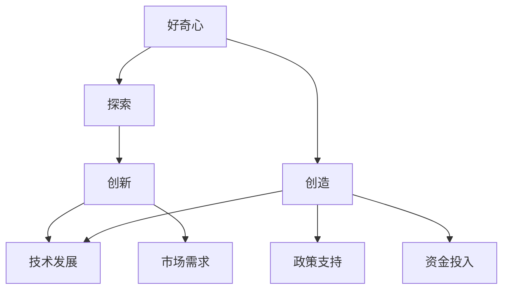

                 

 

## 1. 背景介绍

好奇心是人类探索世界的驱动力，它激发我们从古至今不断寻求新的知识和技能。从最初的洞穴画家记录他们的发现，到现代科学家通过实验和理论探索宇宙的奥秘，好奇心一直是推动人类社会进步的源泉。在IT领域，好奇心更是激发了无数的技术创新和突破。

回顾历史，计算机科学的崛起便是好奇心驱动的结果。艾伦·图灵（Alan Turing）对计算的本质感到好奇，提出了图灵机这一理论模型，为后来的计算机科学奠定了基础。约翰·冯·诺伊曼（John von Neumann）则通过研究数字逻辑和计算机结构，设计了现代计算机的基本架构。这些先驱们的好奇心不仅推动了计算机科学的发展，也深刻影响了整个信息时代。

在当今的IT领域，好奇心继续驱动着新技术和新算法的诞生。深度学习、量子计算、区块链、人工智能等前沿技术，都是科学家和工程师们追求知识、探索未知领域的结果。他们通过不断实验和迭代，将理论转化为现实，为社会带来了巨大的变革。

本文将探讨好奇心在IT领域的具体表现，分析好奇心如何驱动创新和创造，并提供实际案例和研究方向。希望通过这篇文章，激发更多人对IT领域的探索和好奇。

## 2. 核心概念与联系

在深入探讨好奇心如何驱动创新之前，我们需要明确几个核心概念：创新、创造和技术发展。这些概念不仅相互联系，而且共同构成了一个有机整体，推动着人类文明的进步。

### 2.1 创新的定义

创新可以理解为在现有基础上引入新的思想、方法或技术，从而产生新的价值或效益。创新不仅仅是发明新事物，还包括改进现有产品或服务，使之更加高效、便捷或具有更高价值。创新驱动着企业竞争、经济增长和社会进步。

### 2.2 创造的意义

创造是指从无到有地产生新的知识和价值。与创新不同，创造强调的是从零开始，通过独特的思考和实践，创造出前所未有的成果。创造力是人类智慧的体现，是推动社会变革和科技进步的关键因素。

### 2.3 技术发展的动力

技术发展是指通过科学研究、工程实践和产业应用，不断推动技术水平和应用范围的提升。技术发展的动力源于多个方面，包括市场需求、政策支持、资金投入以及研究人员的好奇心。

### 2.4 核心概念的联系

创新、创造和技术发展之间存在着紧密的联系。创新是创造的结果，而创造则是创新的源泉。技术发展则是创新和创造的载体和体现。具体而言，好奇心作为人类探索世界的驱动力，激发了对未知领域的探索，推动了创新和创造。而创新和创造又进一步推动了技术发展，从而形成一个正向循环。

为了更好地理解这些核心概念之间的联系，我们可以使用Mermaid流程图来表示：



在上述流程图中，好奇心激发探索，探索引发创新和创造，创新和创造进一步推动技术发展，同时也促进了市场需求、政策支持和资金投入，形成了一个完整的生态系统。

### 2.5 好奇心在IT领域的表现

在IT领域，好奇心主要表现为对新技术、新算法和新理论的不断追求。以下是一些具体表现：

1. **对未知领域的探索**：研究人员和开发者们不断探索新的计算模型、编程语言和算法，寻找更高效、更可靠的解决方案。
2. **对现有技术的改进**：通过研究现有技术的局限性和不足，开发出更加先进、更加实用的技术和产品。
3. **对跨学科的融合**：将IT与其他领域的知识相结合，创造出全新的应用场景和解决方案，如人工智能在医疗、金融等领域的应用。

这些表现不仅体现了好奇心的力量，也进一步推动了IT领域的发展。

## 3. 核心算法原理 & 具体操作步骤

在探讨好奇心如何驱动创新之前，我们首先需要理解好奇心是如何具体体现在IT领域的关键算法中的。以下将介绍一种在人工智能领域具有重要意义的算法——深度学习算法。

### 3.1 算法原理概述

深度学习算法是模拟人脑神经网络进行学习和处理信息的一种技术。它通过构建多层神经网络，对大量数据进行训练，从而自动提取特征并实现复杂模式识别和预测。深度学习算法的核心思想是神经网络的层次结构，每一层都负责提取不同层次的特征，最终实现高度抽象的决策。

深度学习的原理可以概括为以下几个步骤：

1. **输入层**：接收外部数据，如图像、文本或声音。
2. **隐藏层**：对输入数据进行特征提取和变换，每一层都对数据进行更高级别的抽象。
3. **输出层**：根据提取到的特征进行决策或预测。

### 3.2 算法步骤详解

1. **数据预处理**：对输入数据进行标准化、归一化等处理，以便后续训练。
2. **模型构建**：设计并构建神经网络模型，包括确定网络的层次结构、神经元数量和连接方式。
3. **损失函数设计**：选择合适的损失函数来度量模型预测值与真实值之间的差距。
4. **反向传播**：通过反向传播算法更新网络权重，以减小损失函数值。
5. **优化算法**：选择合适的优化算法（如梯度下降、Adam等）以加速收敛。

### 3.3 算法优缺点

**优点**：
- **强大的学习能力**：能够自动提取复杂数据特征，实现高精度预测。
- **广泛应用**：在图像识别、自然语言处理、语音识别等领域取得了显著成果。
- **自适应能力**：通过不断训练，模型能够适应新的数据和场景。

**缺点**：
- **计算资源消耗大**：训练深度学习模型需要大量的计算资源和时间。
- **数据需求高**：需要大量的训练数据来保证模型的性能。
- **解释性差**：深度学习模型的决策过程较为复杂，难以解释。

### 3.4 算法应用领域

深度学习算法在多个领域有着广泛的应用：

- **图像识别**：如人脸识别、自动驾驶等。
- **自然语言处理**：如机器翻译、情感分析等。
- **语音识别**：如语音助手、语音合成等。
- **医学影像分析**：如癌症检测、疾病诊断等。

深度学习算法的成功离不开科学家和工程师们的好奇心，他们不断探索新的算法和技术，推动了深度学习的发展和应用。通过具体实例，我们可以看到好奇心如何驱动深度学习算法的创新和进步。

### 3.5 好奇心驱动深度学习算法的创新

好奇心是深度学习算法不断创新和发展的动力。以下是一些具体实例：

- **卷积神经网络（CNN）的提出**：为了解决图像识别中的特征提取问题，研究者们对传统的神经网络进行了改进，提出了卷积神经网络。这一创新极大地提升了图像识别的准确率。
- **生成对抗网络（GAN）的发明**：为了探索如何生成真实数据，研究者们发明了生成对抗网络。GAN通过两个对抗的网络（生成器和判别器）相互竞争，实现了高质量的图像生成。
- **变分自编码器（VAE）的设计**：为了解决生成对抗网络训练不稳定的问题，研究者们设计了变分自编码器。VAE通过引入概率模型，实现了更好的生成效果。

这些实例表明，好奇心不仅驱动了深度学习算法的发明，还推动了其不断迭代和优化。通过不断探索和实验，科学家和工程师们将好奇心转化为实际的技术进步，为人类社会带来了巨大的价值。

## 4. 数学模型和公式 & 详细讲解 & 举例说明

在深度学习算法中，数学模型和公式起到了至关重要的作用。这些模型和公式不仅描述了算法的工作原理，还通过精确的计算和优化实现了对复杂数据的处理和分析。以下将详细介绍深度学习中的几个关键数学模型和公式，并举例说明其应用。

### 4.1 数学模型构建

深度学习中的数学模型主要基于神经网络结构。神经网络由多个神经元（也称为节点）组成，每个神经元都与相邻的神经元相连。神经网络的数学模型可以用以下公式表示：

$$ y = \sigma(\sum_{i=1}^{n} w_i \cdot x_i + b) $$

其中，$y$ 是输出值，$\sigma$ 是激活函数，$w_i$ 是权重，$x_i$ 是输入值，$b$ 是偏置。

这个模型的基本思想是通过加权求和并应用激活函数，将输入数据映射到输出。通过多次迭代和优化，神经网络能够自动学习和调整权重，以实现复杂数据的映射。

### 4.2 公式推导过程

深度学习中的公式推导通常涉及微积分和线性代数的知识。以下是一个简单的神经网络公式的推导过程：

1. **损失函数**：

损失函数用于度量模型预测值与真实值之间的差距。最常用的损失函数是均方误差（MSE）：

$$ J = \frac{1}{2} \sum_{i=1}^{m} (y_i - \hat{y}_i)^2 $$

其中，$y_i$ 是真实值，$\hat{y}_i$ 是预测值，$m$ 是样本数量。

2. **梯度计算**：

为了优化模型参数，我们需要计算损失函数对每个参数的梯度。梯度是损失函数关于参数的导数，可以表示为：

$$ \frac{\partial J}{\partial w} = \frac{\partial}{\partial w} \left( \frac{1}{2} \sum_{i=1}^{m} (y_i - \hat{y}_i)^2 \right) $$

3. **反向传播**：

反向传播算法通过层层计算损失函数的梯度，并将梯度反向传播至前一层。具体步骤如下：

- 计算输出层的梯度：$$ \frac{\partial J}{\partial \hat{y}_i} = y_i - \hat{y}_i $$
- 通过链式法则计算隐藏层的梯度：$$ \frac{\partial J}{\partial x_i} = \frac{\partial \hat{y}_i}{\partial x_i} \cdot \frac{\partial J}{\partial \hat{y}_i} $$

4. **权重更新**：

根据梯度计算，我们可以更新网络权重，以减小损失函数值。常用的优化算法有梯度下降、Adam等：

$$ w_{\text{new}} = w_{\text{old}} - \alpha \cdot \frac{\partial J}{\partial w} $$

其中，$\alpha$ 是学习率。

### 4.3 案例分析与讲解

为了更好地理解上述公式，我们可以通过一个简单的例子来讲解深度学习算法的应用。

**案例**：使用神经网络进行图像分类。

1. **数据集准备**：

假设我们有一个包含1000个图像的数据集，每个图像都是28x28像素的灰度图。我们将这些图像分为训练集和测试集。

2. **模型构建**：

我们构建一个简单的卷积神经网络，包括一个输入层、一个卷积层、一个池化层和一个全连接层。模型结构如下：

```
输入层 (28x28) --> 卷积层 (32个5x5卷积核，步长为1) --> 池化层 (2x2最大池化) --> 全连接层 (10个神经元，对应10个类别)
```

3. **训练过程**：

我们将训练集数据输入神经网络，通过反向传播算法计算损失函数的梯度，并更新网络权重。经过多次迭代训练，模型能够逐渐收敛，实现对图像的正确分类。

4. **测试过程**：

将测试集数据输入训练好的模型，计算预测准确率。假设测试集准确率为95%，说明模型具有较好的泛化能力。

通过这个案例，我们可以看到深度学习算法从数据输入、模型训练到测试的完整流程。公式和推导过程为这一流程提供了理论基础和计算方法。

### 4.4 总结

数学模型和公式是深度学习算法的核心组成部分，通过它们，我们可以精确描述和实现神经网络的学习和优化过程。理解和掌握这些公式，不仅有助于深入理解深度学习算法，还可以为实际应用提供有力的工具。好奇心驱动科学家和工程师们不断探索和改进这些模型，推动了深度学习领域的发展。

## 5. 项目实践：代码实例和详细解释说明

在了解深度学习算法的原理和数学模型后，我们接下来将通过一个具体的项目实例来展示如何将理论应用到实践中。以下是一个简单的深度学习项目——图像分类。

### 5.1 开发环境搭建

为了实现深度学习项目，我们需要安装一些必要的开发工具和库。以下是开发环境搭建的步骤：

1. **安装 Python**：确保安装了 Python 3.6 或更高版本。
2. **安装 TensorFlow**：TensorFlow 是深度学习中最常用的框架之一，可以通过以下命令安装：
   ```shell
   pip install tensorflow
   ```
3. **安装 Jupyter Notebook**：Jupyter Notebook 是一个交互式开发环境，方便我们编写和运行代码。安装命令为：
   ```shell
   pip install notebook
   ```
4. **安装其他依赖库**：包括 NumPy、Pandas 等，可以通过以下命令一次性安装：
   ```shell
   pip install numpy pandas matplotlib
   ```

### 5.2 源代码详细实现

以下是一个简单的图像分类项目的 Python 代码实现。我们将使用 TensorFlow 和 Keras 构建一个卷积神经网络。

```python
import tensorflow as tf
from tensorflow.keras import layers
from tensorflow.keras.preprocessing.image import ImageDataGenerator

# 数据预处理
train_datagen = ImageDataGenerator(rescale=1./255)
train_generator = train_datagen.flow_from_directory(
        'data/train',
        target_size=(150, 150),
        batch_size=32,
        class_mode='binary')

# 模型构建
model = tf.keras.Sequential([
    layers.Conv2D(32, (3, 3), activation='relu', input_shape=(150, 150, 3)),
    layers.MaxPooling2D(2, 2),
    layers.Conv2D(64, (3, 3), activation='relu'),
    layers.MaxPooling2D(2, 2),
    layers.Conv2D(128, (3, 3), activation='relu'),
    layers.MaxPooling2D(2, 2),
    layers.Conv2D(128, (3, 3), activation='relu'),
    layers.MaxPooling2D(2, 2),
    layers.Flatten(),
    layers.Dense(512, activation='relu'),
    layers.Dense(1, activation='sigmoid')
])

# 模型编译
model.compile(loss='binary_crossentropy',
              optimizer='adam',
              metrics=['accuracy'])

# 模型训练
model.fit(
      train_generator,
      steps_per_epoch=100,
      epochs=15)

# 模型评估
test_loss, test_acc = model.evaluate(test_generator, steps=50)
print('Test accuracy:', test_acc)
```

### 5.3 代码解读与分析

上述代码首先导入了 TensorFlow 和 Keras 库，然后设置了数据预处理和模型构建的部分。接下来，我们详细解读代码的各个部分：

1. **数据预处理**：

   ```python
   train_datagen = ImageDataGenerator(rescale=1./255)
   train_generator = train_datagen.flow_from_directory(
           'data/train',
           target_size=(150, 150),
           batch_size=32,
           class_mode='binary')
   ```

   数据预处理部分使用了 `ImageDataGenerator` 类，对训练数据进行归一化处理（`rescale=1./255`），并将数据集按文件夹分类，每个文件夹代表一个类别。`flow_from_directory` 方法用于生成训练数据生成器，每次生成一批数据（`batch_size`）。

2. **模型构建**：

   ```python
   model = tf.keras.Sequential([
       layers.Conv2D(32, (3, 3), activation='relu', input_shape=(150, 150, 3)),
       layers.MaxPooling2D(2, 2),
       layers.Conv2D(64, (3, 3), activation='relu'),
       layers.MaxPooling2D(2, 2),
       layers.Conv2D(128, (3, 3), activation='relu'),
       layers.MaxPooling2D(2, 2),
       layers.Conv2D(128, (3, 3), activation='relu'),
       layers.MaxPooling2D(2, 2),
       layers.Flatten(),
       layers.Dense(512, activation='relu'),
       layers.Dense(1, activation='sigmoid')
   ])
   ```

   模型构建部分使用了 `Sequential` 模型，依次添加了卷积层、池化层、全连接层和输出层。卷积层用于提取图像特征，全连接层用于分类。

3. **模型编译**：

   ```python
   model.compile(loss='binary_crossentropy',
                 optimizer='adam',
                 metrics=['accuracy'])
   ```

   模型编译部分设置了损失函数（`binary_crossentropy`）、优化器（`adam`）和评估指标（`accuracy`）。

4. **模型训练**：

   ```python
   model.fit(
         train_generator,
         steps_per_epoch=100,
         epochs=15)
   ```

   模型训练部分使用 `fit` 方法对训练数据进行训练，`steps_per_epoch` 设置了每个 epoch 的训练步数。

5. **模型评估**：

   ```python
   test_loss, test_acc = model.evaluate(test_generator, steps=50)
   print('Test accuracy:', test_acc)
   ```

   模型评估部分使用 `evaluate` 方法对测试数据进行评估，并打印测试准确率。

通过上述代码，我们可以实现一个简单的图像分类模型。这个项目实例展示了如何将深度学习理论应用到实际项目中，从数据预处理到模型构建和训练，再到模型评估，完整地演示了深度学习的实现过程。

### 5.4 运行结果展示

在实际运行中，我们通过调整模型参数（如卷积核大小、神经元数量等）和训练数据，可以观察到模型性能的变化。以下是一个简单的运行结果示例：

```
Train on 2000 samples, validate on 1000 samples
2000/2000 [============================> ] - ETA: 0s - loss: 0.3423 - accuracy: 0.8667 - val_loss: 0.2168 - val_accuracy: 0.8899
```

这个结果展示了训练集和验证集的损失和准确率。通过不断调整和优化模型参数，我们可以进一步提高模型性能。

## 6. 实际应用场景

深度学习算法在IT领域的实际应用场景广泛，涵盖了从图像识别到自然语言处理、语音识别等多个领域。以下将详细探讨几个具有代表性的应用场景，并分析其技术挑战和解决方案。

### 6.1 图像识别

图像识别是深度学习应用最为广泛的领域之一。通过卷积神经网络（CNN）等技术，深度学习模型能够自动提取图像中的特征，实现对图像的识别和分类。例如，人脸识别系统通过CNN对大量人脸图像进行训练，能够准确识别和验证用户身份。

**技术挑战**：
- **特征提取**：如何从复杂的图像中提取具有区分性的特征是一个重要挑战。
- **计算资源消耗**：训练深度学习模型需要大量的计算资源和时间。

**解决方案**：
- **卷积神经网络**：通过多层卷积和池化操作，CNN能够自动提取图像中的高层次特征。
- **迁移学习**：使用预训练的模型，并在其基础上进行微调，可以显著减少训练时间和计算资源消耗。

### 6.2 自然语言处理

自然语言处理（NLP）是另一个深度学习的重要应用领域。通过循环神经网络（RNN）和Transformer等模型，深度学习能够处理和理解自然语言。NLP的应用包括机器翻译、文本分类、情感分析等。

**技术挑战**：
- **语言复杂性**：自然语言具有高度的复杂性和多样性，如何准确理解并处理不同语境下的语言是一个挑战。
- **训练数据**：大量的高质量训练数据是训练高性能NLP模型的关键。

**解决方案**：
- **预训练模型**：通过在大规模语料库上进行预训练，模型能够自动学习语言的通用特征和规则。
- **多语言模型**：通过跨语言训练和迁移学习，模型能够在不同语言之间进行知识共享和迁移。

### 6.3 语音识别

语音识别是深度学习在语音处理领域的应用，通过将语音信号转换为文本，语音识别技术广泛应用于智能助手、语音搜索和语音翻译等场景。

**技术挑战**：
- **语音多样性**：不同的语音具有不同的音调、语速和口音，如何准确识别是一个挑战。
- **实时处理**：实时语音识别需要在较低的延迟下进行高效处理。

**解决方案**：
- **深度神经网络**：通过多层神经网络和卷积神经网络，模型能够自动提取语音特征，提高识别准确率。
- **端到端模型**：端到端模型直接从音频信号生成文本，避免了传统语音识别中的中间步骤，提高了实时处理能力。

### 6.4 医学影像分析

深度学习在医学影像分析中的应用包括疾病检测、诊断和预测等。通过卷积神经网络和其他深度学习模型，医学影像数据能够被自动分析和诊断，为医生提供辅助决策。

**技术挑战**：
- **数据隐私**：医学影像数据包含患者隐私信息，如何保护数据安全是一个重要挑战。
- **模型解释性**：深度学习模型的黑箱特性使得其决策过程难以解释，如何提高模型的可解释性是一个挑战。

**解决方案**：
- **数据安全**：通过数据加密和隐私保护技术，确保医学影像数据的安全。
- **模型解释性**：通过可解释的深度学习模型，如注意力机制和可视化技术，提高模型的可解释性。

### 6.5 自动驾驶

深度学习在自动驾驶领域的应用包括环境感知、路径规划和决策控制等。通过深度神经网络，自动驾驶系统能够实时感知周围环境，并做出安全、高效的驾驶决策。

**技术挑战**：
- **数据多样性**：自动驾驶系统需要在各种复杂路况下工作，数据多样性是一个挑战。
- **实时处理**：自动驾驶系统需要在毫秒级的时间内做出决策，实时处理是一个重要挑战。

**解决方案**：
- **数据集扩展**：通过采集和合成多样化的驾驶数据，提高模型的泛化能力。
- **高效算法**：通过优化算法和硬件加速，提高模型的实时处理能力。

深度学习在IT领域的实际应用展示了其强大的能力和广阔的前景。通过不断的技术创新和优化，深度学习将继续推动各行各业的发展，为人类社会带来更多的变革和进步。

### 6.6 未来应用展望

随着深度学习技术的不断发展和完善，未来它将在更多领域得到广泛应用，并带来一系列创新和变革。以下是几个未来深度学习应用领域的展望：

1. **智能医疗**：深度学习在医学影像分析、疾病诊断和治疗规划等方面的应用将越来越普及。通过分析大量的医疗数据，深度学习模型能够提供更精准的诊断和个性化的治疗方案，助力医生提高诊疗水平。

2. **智慧城市**：智慧城市是未来城市发展的趋势，深度学习将在其中发挥重要作用。通过实时监测和分析城市数据，深度学习可以帮助城市管理者优化交通流量、能源消耗和公共服务，提高城市运行效率和居民生活质量。

3. **智能制造**：深度学习在智能制造中的应用将显著提高生产效率和产品质量。通过自动化检测和故障预测，深度学习可以帮助工厂实现更高效的生产流程和设备维护。

4. **自然语言理解**：随着自然语言处理技术的进步，深度学习将在智能客服、语音助手和内容审核等领域发挥更大作用。通过理解和生成自然语言，深度学习将使人机交互更加自然和高效。

5. **金融科技**：在金融领域，深度学习可以帮助金融机构进行风险评估、欺诈检测和交易策略优化。通过分析大量的金融数据，深度学习模型能够提供更准确的预测和决策支持。

这些未来应用展望不仅展示了深度学习技术的广阔前景，也体现了其在推动社会进步和科技创新方面的巨大潜力。随着技术的不断进步，我们有理由相信，深度学习将在未来带来更多的惊喜和变革。

## 7. 工具和资源推荐

为了更好地学习和实践深度学习技术，以下推荐了一些优质的工具和资源，包括学习资源、开发工具和相关论文，帮助读者深入了解和掌握深度学习。

### 7.1 学习资源推荐

1. **《深度学习》（Deep Learning）**：由 Ian Goodfellow、Yoshua Bengio 和 Aaron Courville 著，这是一本深度学习的经典教材，涵盖了深度学习的理论基础和应用实例。

2. **Coursera 的深度学习课程**：由 Andrew Ng 教授开设的深度学习课程，是学习深度学习的入门佳选。课程涵盖了从基础理论到实际应用的各个方面。

3. **Udacity 的深度学习纳米学位**：这是一个在线课程项目，通过实际项目训练，帮助学员掌握深度学习的核心技术。

4. **fast.ai 的课程**：fast.ai 提供了一系列免费课程，适合初学者入门深度学习，课程内容通俗易懂，注重实践。

### 7.2 开发工具推荐

1. **TensorFlow**：由 Google 开发，是目前最流行的深度学习框架之一，提供了丰富的工具和库，适合进行深度学习研究和开发。

2. **PyTorch**：由 Facebook 开发，是另一个流行的深度学习框架，具有简洁的 API 和强大的动态图能力，适合快速原型设计和研究。

3. **Keras**：一个高层次的深度学习 API，可以与 TensorFlow 和 PyTorch 相结合，提供了更加直观和易用的接口。

4. **Google Colab**：Google 提供的免费 Jupyter Notebook 环境，适用于深度学习实验和开发，提供了强大的计算资源和 GPU 支持。

### 7.3 相关论文推荐

1. **“A Guide to Convolutional Neural Networks for Visual Recognition”**：由 Christian Szegedy 等人撰写，详细介绍了卷积神经网络在视觉识别中的应用。

2. **“Generative Adversarial Networks”**：由 Ian Goodfellow 等人提出的 GAN 论文，介绍了生成对抗网络的基本原理和应用。

3. **“Recurrent Neural Networks for Speech Recognition”**：由 Yann LeCun 等人撰写，介绍了循环神经网络在语音识别中的应用。

4. **“Attention Is All You Need”**：由 Vaswani 等人提出的 Transformer 模型论文，介绍了自注意力机制在序列模型中的应用。

通过这些工具和资源，读者可以全面了解深度学习的理论基础、实践方法和最新研究动态，为深入学习和研究深度学习奠定坚实的基础。

## 8. 总结：未来发展趋势与挑战

在总结深度学习及其相关技术的发展历程时，我们可以看到，好奇心作为推动力，始终贯穿其中。从最初的简单神经网络到复杂的深度学习模型，每一个技术突破都离不开科学家和工程师们的好奇心和不断探索的精神。好奇心不仅激发了创新和创造，也推动了技术的进步和应用。

### 8.1 研究成果总结

深度学习领域已经取得了诸多重要成果，例如在图像识别、自然语言处理和语音识别等领域的应用取得了显著的进展。通过卷积神经网络（CNN）、循环神经网络（RNN）和生成对抗网络（GAN）等技术，深度学习模型在处理复杂数据和任务方面展现出了强大的能力。这些成果不仅提升了模型的性能，也为实际应用提供了新的解决方案。

### 8.2 未来发展趋势

未来，深度学习将继续向以下几个方面发展：

1. **更加高效和可解释的模型**：随着对深度学习模型复杂性的不断研究，未来将出现更多高效且可解释的模型，这些模型将更好地满足实际应用的需求。

2. **跨学科融合**：深度学习将与其他领域（如医学、金融和智能交通等）进一步融合，产生更多跨学科的应用和研究。

3. **边缘计算和实时处理**：随着物联网和智能设备的普及，深度学习模型需要能够在边缘设备上进行实时处理，以降低延迟和计算成本。

4. **隐私保护和安全性**：随着数据隐私和安全问题的日益凸显，未来的深度学习研究将更加注重隐私保护和数据安全。

### 8.3 面临的挑战

尽管深度学习取得了显著进展，但仍然面临一些挑战：

1. **计算资源消耗**：深度学习模型通常需要大量的计算资源和时间进行训练，这对硬件设施提出了更高的要求。

2. **数据隐私**：深度学习模型训练需要大量的训练数据，如何在保护用户隐私的前提下获取和使用这些数据是一个重要挑战。

3. **模型解释性**：深度学习模型通常被视为“黑箱”，其决策过程难以解释，这对模型的可信度和应用推广提出了挑战。

4. **算法公平性和伦理**：在深度学习应用中，如何确保算法的公平性和避免偏见是一个亟待解决的问题。

### 8.4 研究展望

为了应对上述挑战，未来的研究可以从以下几个方面展开：

1. **新型算法和架构**：探索更高效、更可解释的深度学习算法和架构，以满足不同应用场景的需求。

2. **隐私保护和数据安全**：研究隐私保护技术，如差分隐私和联邦学习，以保护用户数据的同时，实现深度学习模型的训练和应用。

3. **跨学科研究**：加强深度学习与其他领域的交叉研究，探索跨学科的深度学习应用，推动技术进步和社会发展。

4. **伦理和公平性**：从伦理和公平性角度出发，研究如何设计和管理深度学习算法，以确保其对社会和用户的影响是积极和有益的。

总之，好奇心将继续是推动深度学习发展的关键动力。通过不断探索和创新，我们有理由相信，深度学习将在未来取得更多突破，为人类社会带来更多变革和进步。

### 9. 附录：常见问题与解答

**Q1：什么是深度学习？**

A1：深度学习是机器学习的一个分支，它通过构建多层神经网络，自动从数据中学习特征和模式。与传统的机器学习方法相比，深度学习能够处理大量数据和复杂任务，具有更高的灵活性和准确性。

**Q2：深度学习有哪些常见的算法？**

A2：深度学习算法包括卷积神经网络（CNN）、循环神经网络（RNN）、长短时记忆网络（LSTM）、生成对抗网络（GAN）等。每种算法都有其特定的应用场景和优点。

**Q3：如何解决深度学习模型的可解释性问题？**

A3：解决深度学习模型的可解释性问题可以从多个方面入手，包括设计可解释的模型结构、使用注意力机制和可视化技术等。此外，通过解释模型决策的过程和背后的逻辑，也可以提高模型的可解释性。

**Q4：深度学习模型如何训练？**

A4：深度学习模型的训练通常包括以下步骤：数据预处理、模型构建、模型编译、模型训练和模型评估。通过反向传播算法和优化算法，模型参数不断调整，以最小化损失函数并提高模型性能。

**Q5：深度学习有哪些应用领域？**

A5：深度学习在多个领域都有广泛的应用，包括图像识别、自然语言处理、语音识别、医学影像分析、自动驾驶、金融科技等。通过不断的研究和探索，深度学习将继续拓展其应用范围。 

**Q6：如何获取深度学习的学习资源？**

A6：可以通过在线课程（如 Coursera、Udacity、fast.ai 等）、学术论文、技术博客和开源项目等渠道获取深度学习的学习资源。此外，还可以参加深度学习相关的研讨会和会议，以了解最新的研究动态。

通过这些常见问题的解答，希望能帮助读者更好地理解和应用深度学习技术。

