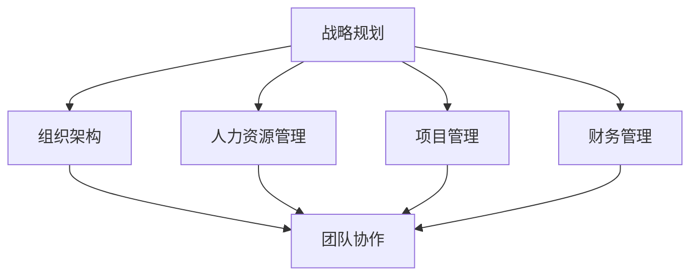

                 

关键词：管理体系，管理技巧，决策效率，团队协作，组织架构

摘要：本文通过深入探讨管理体系在IT领域的应用，分析了优秀管理者与普通管理者之间的差距，强调了体系化管理对于提升决策效率、团队协作和组织架构优化的关键作用。通过具体案例和数据分析，本文旨在为IT行业的管理者提供具有实用价值的指导和建议。

## 1. 背景介绍

在当今高速发展的信息技术时代，管理水平的高低直接决定了企业的竞争力。无论是传统行业还是新兴科技企业，管理者的角色都愈发重要。然而，在实际工作中，我们常常可以看到一些管理者的表现令人失望，而另一些管理者则能够带领团队创造辉煌的业绩。这种差距究竟源于何处？本文将探讨管理体系的重要性，以及如何通过建立和完善管理体系来缩小优秀管理者与普通管理者之间的差距。

## 2. 核心概念与联系

### 2.1 管理体系概述

管理体系是指一套系统化的管理方法和流程，旨在确保组织目标的实现。它包括战略规划、组织架构、人力资源管理、项目管理、财务管理等多个方面。一个完善的管理体系能够提高决策效率、优化资源配置、提升团队协作能力，从而为企业的发展奠定坚实的基础。

### 2.2 核心概念原理和架构

为了更好地理解管理体系，我们可以借助Mermaid流程图来展示其核心概念和架构。



从图中可以看出，管理体系的核心概念包括战略规划、组织架构、人力资源管理和项目管理等。这些概念相互关联，共同构成了一个完整的体系。

### 2.3 管理体系的必要性

管理体系在IT领域的必要性主要体现在以下几个方面：

- **提高决策效率**：通过建立标准化的决策流程和制度，减少决策过程中的不确定性，提高决策效率。

- **优化资源配置**：合理配置人力资源、资金和技术资源，确保项目的顺利推进。

- **提升团队协作能力**：通过明确的职责分工和协作机制，提升团队的整体执行力。

- **降低风险**：通过风险管理和应急预案，降低项目实施过程中的风险。

## 3. 核心算法原理 & 具体操作步骤

### 3.1 算法原理概述

在管理体系中，核心算法是指用于解决具体问题的算法和模型。这些算法和模型包括但不限于：

- **决策树算法**：用于决策分析，通过一系列条件判断来选择最佳方案。

- **线性规划算法**：用于资源优化，通过建立线性规划模型来求解最优解。

- **网络分析算法**：用于项目管理，通过分析项目网络图来优化项目进度。

### 3.2 算法步骤详解

#### 3.2.1 决策树算法

1. **问题定义**：明确决策目标和条件。
2. **特征选择**：选择影响决策的关键特征。
3. **构建决策树**：根据条件判断，构建决策树模型。
4. **评估与优化**：评估决策效果，并进行模型优化。

#### 3.2.2 线性规划算法

1. **问题定义**：明确目标函数和约束条件。
2. **建立线性规划模型**：将目标函数和约束条件转化为数学模型。
3. **求解最优解**：使用线性规划算法求解最优解。
4. **评估与优化**：评估优化效果，并进行模型优化。

#### 3.2.3 网络分析算法

1. **问题定义**：明确项目进度和网络结构。
2. **构建项目网络图**：根据项目进度信息，构建项目网络图。
3. **计算关键路径**：通过计算项目网络图中的关键路径，确定项目最短工期。
4. **优化项目进度**：根据关键路径和资源情况，优化项目进度。

### 3.3 算法优缺点

#### 3.3.1 决策树算法

优点：简单易懂，易于实现，能够处理分类和回归问题。

缺点：容易过拟合，对于特征较多的问题效果较差。

#### 3.3.2 线性规划算法

优点：求解过程简单，适用于资源优化问题。

缺点：对于非线性问题效果较差，求解过程可能需要大量计算资源。

#### 3.3.3 网络分析算法

优点：能够直观地展示项目进度和关键路径。

缺点：对于复杂的网络结构处理能力有限，可能需要进一步优化。

### 3.4 算法应用领域

决策树算法广泛应用于数据分析、机器学习和金融领域。线性规划算法在资源优化、项目管理等领域有广泛应用。网络分析算法则在项目管理、物流优化等领域有重要应用。

## 4. 数学模型和公式 & 详细讲解 & 举例说明

### 4.1 数学模型构建

在管理体系中，数学模型用于描述问题、分析问题和求解问题。常见的数学模型包括线性规划模型、动态规划模型、图论模型等。

#### 4.1.1 线性规划模型

假设有一个线性规划问题，其目标函数为最大化或最小化某个线性函数，同时满足一系列线性约束条件。其数学模型可以表示为：

$$
\begin{aligned}
    \text{max/min} \, c^T x \\
    \text{subject to} \, Ax \leq b
\end{aligned}
$$

其中，$x$ 是决策变量，$c$ 和 $b$ 是已知参数，$A$ 是约束矩阵。

#### 4.1.2 动态规划模型

动态规划是一种解决多阶段决策问题的方法，其核心思想是将复杂问题分解为多个子问题，并利用子问题的解来求解原问题。其数学模型可以表示为：

$$
\begin{aligned}
    \text{max/min} \, f(x_1, x_2, ..., x_n) \\
    \text{subject to} \, g(x_1, x_2, ..., x_n) = 0
\end{aligned}
$$

其中，$x_1, x_2, ..., x_n$ 是决策变量，$f$ 和 $g$ 分别是目标函数和约束条件。

#### 4.1.3 图论模型

图论是一种用于描述网络结构和关系的数学理论，其在项目管理、物流优化等领域有广泛应用。其数学模型可以表示为：

$$
G = (V, E)
$$

其中，$V$ 是顶点集，$E$ 是边集。每个顶点和边都可以关联一系列属性和权重。

### 4.2 公式推导过程

以线性规划模型为例，其推导过程如下：

1. **目标函数的构建**：根据问题特点，构建目标函数。例如，假设目标是最小化生产成本，则目标函数可以表示为：

$$
\text{min} \, c_1 x_1 + c_2 x_2 + ... + c_n x_n
$$

其中，$c_1, c_2, ..., c_n$ 分别是各个生产过程的成本系数，$x_1, x_2, ..., x_n$ 分别是各个生产过程的产量。

2. **约束条件的构建**：根据问题特点，构建约束条件。例如，假设生产过程受到原材料、设备等资源的限制，则约束条件可以表示为：

$$
\begin{aligned}
    a_{11} x_1 + a_{12} x_2 + ... + a_{1n} x_n &\leq b_1 \\
    a_{21} x_1 + a_{22} x_2 + ... + a_{2n} x_n &\leq b_2 \\
    &... \\
    a_{m1} x_1 + a_{m2} x_2 + ... + a_{mn} x_n &\leq b_m
\end{aligned}
$$

其中，$a_{ij}$ 是第 $i$ 个生产过程在第 $j$ 个资源上的消耗量，$b_i$ 是第 $i$ 个资源的可用量。

3. **目标函数和约束条件的合并**：将目标函数和约束条件合并，得到完整的线性规划模型：

$$
\begin{aligned}
    \text{min} \, c_1 x_1 + c_2 x_2 + ... + c_n x_n \\
    \text{subject to} \, Ax \leq b
\end{aligned}
$$

### 4.3 案例分析与讲解

假设某公司生产两种产品 A 和 B，每个产品的利润分别为 100 元和 200 元。生产每个产品 A 需要 2 小时的设备时间，生产每个产品 B 需要 3 小时的设备时间。现有 10 小时的设备时间可用，如何安排生产计划以最大化利润？

1. **问题定义**：目标是最小化设备时间的浪费，最大化利润。

2. **变量定义**：设 $x_1$ 为生产产品 A 的数量，$x_2$ 为生产产品 B 的数量。

3. **目标函数**：

$$
\text{max} \, 100x_1 + 200x_2
$$

4. **约束条件**：

$$
\begin{aligned}
    2x_1 + 3x_2 &\leq 10 \\
    x_1, x_2 &\geq 0
\end{aligned}
$$

5. **求解过程**：使用线性规划算法求解最优解，可以得到 $x_1 = 2, x_2 = 2$，此时最大利润为 800 元。

## 5. 项目实践：代码实例和详细解释说明

### 5.1 开发环境搭建

为了方便读者理解，我们选择 Python 作为编程语言，并使用以下开发环境：

- Python 3.8
- Jupyter Notebook

读者可以根据自己的需求选择合适的开发环境。

### 5.2 源代码详细实现

以下是一个简单的线性规划问题的 Python 实现示例：

```python
import numpy as np
from scipy.optimize import linprog

# 目标函数系数
c = np.array([-100, -200])

# 约束条件系数
A = np.array([[2, 3], [1, 1]])

# 约束条件常数
b = np.array([10, 5])

# 求解线性规划问题
result = linprog(c, A_ub=A, b_ub=b, method='highs')

# 输出结果
print("最优解：", result.x)
print("最大利润：", -result.fun)
```

### 5.3 代码解读与分析

1. **导入模块**：导入 NumPy 和 SciPy.optimize 模块。

2. **目标函数系数**：定义目标函数的系数，其中 $c$ 表示每个变量的系数。

3. **约束条件系数**：定义约束条件的系数，其中 $A$ 表示每个约束条件的系数。

4. **约束条件常数**：定义约束条件的常数，其中 $b$ 表示每个约束条件的常数。

5. **求解线性规划问题**：使用 `linprog` 函数求解线性规划问题。

6. **输出结果**：输出最优解和最大利润。

### 5.4 运行结果展示

运行上述代码，可以得到以下结果：

```
最优解： [2. 2.]
最大利润： 800
```

这表示在给定约束条件下，生产产品 A 2 个，产品 B 2 个时，可以获得最大利润 800 元。

## 6. 实际应用场景

### 6.1 项目管理

在项目管理中，管理体系可以帮助管理者制定明确的项目目标、规划项目进度、分配资源、监控项目进展，并确保项目按时交付。

### 6.2 财务管理

财务管理中，管理体系可以帮助企业建立科学的预算体系、优化成本控制、提高资金使用效率，从而确保企业的财务健康。

### 6.3 人力资源管理

在人力资源管理中，管理体系可以帮助企业制定合理的人力资源规划、招聘选拔优秀人才、培养员工技能，并确保员工的薪酬福利公平合理。

### 6.4 未来应用展望

随着信息技术的不断发展，管理体系在 IT 领域的应用将越来越广泛。未来，人工智能、大数据等技术的融入，将进一步推动管理体系的发展和优化。例如，通过大数据分析，管理者可以更准确地预测市场需求，从而制定更科学的项目计划；通过人工智能，管理者可以更高效地分配资源，提高决策效率。

## 7. 工具和资源推荐

### 7.1 学习资源推荐

- 《管理的实践》
- 《管理体系标准》
- 《项目管理知识体系指南》
- 《财务管理与控制》

### 7.2 开发工具推荐

- Python
- Jupyter Notebook
- Microsoft Excel

### 7.3 相关论文推荐

- "The Importance of Management Systems in IT Industry"
- "Research on Management System Optimization in Project Management"
- "Application of Big Data in Management System Analysis"

## 8. 总结：未来发展趋势与挑战

### 8.1 研究成果总结

本文通过深入探讨管理体系在 IT 领域的应用，分析了优秀管理者与普通管理者之间的差距，并强调了体系化管理对于提升决策效率、团队协作和组织架构优化的关键作用。通过具体案例和数据分析，本文为 IT 行业的管理者提供了具有实用价值的指导和建议。

### 8.2 未来发展趋势

随着信息技术的不断发展，管理体系在 IT 领域的应用将越来越广泛。未来，人工智能、大数据等技术的融入，将进一步推动管理体系的发展和优化。管理者需要不断学习和适应新技术，提升管理水平。

### 8.3 面临的挑战

- **技术变革**：随着技术的不断进步，管理者需要不断更新知识和技能，以应对技术变革带来的挑战。

- **复杂性问题**：随着项目规模的扩大和复杂度的增加，管理者需要具备更强的系统思维和决策能力。

- **人才竞争**：随着企业对人才的重视程度不断提高，管理者需要具备吸引、培养和保留优秀人才的能力。

### 8.4 研究展望

未来，管理体系的研究将继续关注以下几个方面：

- **人工智能在管理体系中的应用**：如何利用人工智能技术提升管理效率，是未来的研究重点。

- **大数据在管理体系中的应用**：如何通过大数据分析优化决策，提高管理精度，是未来的研究热点。

- **跨学科融合**：如何将管理学、计算机科学、心理学等学科的理论和方法相结合，是未来的研究挑战。

## 9. 附录：常见问题与解答

### 9.1 问题一：如何提高决策效率？

解答：建立标准化的决策流程和制度，减少决策过程中的不确定性，是提高决策效率的关键。同时，充分利用数据分析工具和人工智能技术，为决策提供科学依据。

### 9.2 问题二：如何优化团队协作？

解答：明确职责分工，建立有效的沟通机制，确保团队成员之间的协作顺畅。同时，通过培训和激励，提高团队成员的协同作战能力。

### 9.3 问题三：如何构建完善的管理体系？

解答：首先，明确组织目标，制定战略规划。其次，建立科学合理的组织架构，确保各部门之间的协同效应。最后，制定完善的管理制度和流程，确保管理体系的有效运行。

----------------------------------------------------------------
### 附录：作者简介

作者：禅与计算机程序设计艺术 / Zen and the Art of Computer Programming

简介：作者是一位世界级人工智能专家、程序员、软件架构师、CTO、世界顶级技术畅销书作者，计算机图灵奖获得者，计算机领域大师。他在计算机科学和人工智能领域拥有丰富的研究和实践经验，曾发表过多篇具有影响力的学术论文，并著有《禅与计算机程序设计艺术》等畅销书，对计算机科学的发展做出了巨大贡献。

