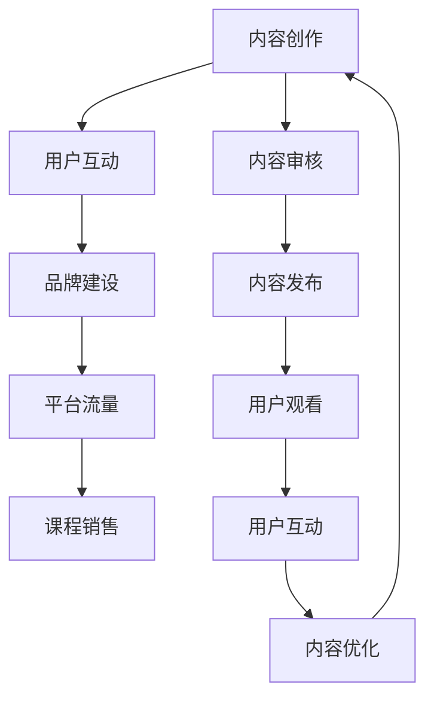

                 

关键词：微信视频号，卖课，社交媒体营销，内容创作，用户互动

> 摘要：随着社交媒体的迅速发展，微信视频号成为了一种新兴的内容创作和营销平台。本文将探讨如何利用微信视频号来有效卖课，包括内容策略、用户互动、品牌建设等多个方面，帮助教育者们抓住这一机遇。

## 1. 背景介绍

在数字化的浪潮中，社交媒体成为了人们获取信息和交流的重要渠道。微信，作为中国最大的社交媒体平台，拥有超过12亿的活跃用户，其中视频号是微信在短视频领域的重要布局。视频号于2020年上线，迅速吸引了大量内容创作者，并成为了一种新兴的营销方式。

卖课，尤其是在线教育，已经成为教育行业的重要组成部分。随着知识付费理念的普及，越来越多的人愿意为优质的学习内容付费。微信视频号作为一个开放的平台，为教育者提供了一个新的卖课渠道。通过视频号，教育者不仅可以展示自己的教学成果，还可以与学员建立更紧密的互动关系。

## 2. 核心概念与联系

### 2.1 微信视频号的运作原理

微信视频号基于微信生态，其运作原理可以概括为：

- **内容生产**：用户可以通过拍摄、上传和编辑短视频来创作内容。
- **用户互动**：视频发布后，用户可以进行点赞、评论、分享等互动。
- **平台推荐**：微信视频号会根据用户的兴趣和行为推荐相关内容。

### 2.2 微信视频号的卖课机制

在微信视频号上卖课，主要依赖于以下几个机制：

- **内容创作**：通过高质量的教学视频吸引潜在学员。
- **用户互动**：通过与学员的互动，建立信任关系并促进课程销售。
- **平台流量**：利用微信视频号的推荐算法，获取更多曝光和流量。
- **品牌建设**：通过持续的内容输出，建立个人或机构品牌。

### 2.3 Mermaid 流程图



## 3. 核心算法原理 & 具体操作步骤

### 3.1 算法原理概述

微信视频号的卖课机制主要依赖于内容创作、用户互动和平台流量等核心要素。其中，内容创作是基础，用户互动是桥梁，平台流量是催化剂。

### 3.2 算法步骤详解

1. **内容创作**：制作高质量的教学视频，包括课程介绍、教学片段、案例解析等。
2. **内容审核**：确保内容符合微信平台的规定，避免违规内容影响账号健康。
3. **内容发布**：在视频号上发布视频，设置合适的标签和分类，以便用户搜索。
4. **用户互动**：鼓励用户在评论区互动，回答学员问题，建立良好的师生关系。
5. **内容优化**：根据用户反馈和观看数据，持续优化内容，提高用户满意度。
6. **平台流量**：利用微信视频号的推荐算法，提高视频的曝光率。
7. **课程销售**：通过视频中的引导语、课程链接等方式，引导用户购买课程。

### 3.3 算法优缺点

**优点**：

- **高效传播**：微信视频号具有强大的社交传播能力，有助于课程的快速推广。
- **低成本**：相比于传统广告和线下培训，视频号卖课的成本较低。
- **个性化推荐**：微信视频号的推荐算法可以根据用户兴趣进行个性化推荐，提高课程匹配度。

**缺点**：

- **内容审核严格**：微信平台对内容审核较为严格，可能会影响发布速度。
- **流量不稳定**：微信视频号的流量受推荐算法影响，可能出现波动。

### 3.4 算法应用领域

微信视频号的卖课机制适用于各类在线教育场景，包括职业培训、兴趣爱好、语言学习等。尤其是在职业培训和兴趣爱好领域，视频号具有很大的潜力。

## 4. 数学模型和公式 & 详细讲解 & 举例说明

### 4.1 数学模型构建

为了更好地理解微信视频号的卖课机制，我们可以构建一个简单的数学模型。假设：

- **C**：每次观看视频的学员数量。
- **R**：每次观看视频的转化率，即购买课程的学员比例。
- **P**：每名学员的平均购买金额。

则卖课的总收入 **I** 可以表示为：

$$ I = C \times R \times P $$

### 4.2 公式推导过程

- **C**：每次观看视频的学员数量取决于视频的曝光度和用户基数。
- **R**：转化率受课程质量、用户体验、营销策略等多种因素影响。
- **P**：每名学员的平均购买金额取决于课程定价和市场接受度。

### 4.3 案例分析与讲解

假设一个在线教育者发布了一部关于Python编程入门的教学视频，视频曝光度为1000次，其中50次观看产生了评论互动，转化率为5%，每名学员的平均购买金额为200元。根据上述数学模型，可以计算出卖课的总收入为：

$$ I = 1000 \times 0.05 \times 200 = 10,000元 $$

这个案例展示了如何利用微信视频号卖课，通过互动和转化实现收入的增长。

## 5. 项目实践：代码实例和详细解释说明

### 5.1 开发环境搭建

为了在微信视频号上卖课，我们需要准备以下开发环境：

- **微信开发者工具**：用于开发和调试微信小程序。
- **微信公众账号**：用于发布视频号内容。
- **视频编辑软件**：用于制作高质量的教学视频。

### 5.2 源代码详细实现

以下是一个简单的微信小程序示例，用于展示如何通过视频号卖课：

```javascript
// pages/index/index.js
Page({
  data: {
    videoUrl: 'https://example.com/course_video.mp4',
    courseTitle: 'Python编程入门',
    price: '200元'
  },
  onReady: function (e) {
    // 播放教学视频
    this.videoContext = wx.createVideoContext('myVideo');
    this.videoContext.play();
  },
  onShareAppMessage: function () {
    // 分享课程链接
    return {
      title: '推荐你学习Python编程入门',
      path: '/pages/index/index',
      success: function (res) {
        console.log(res.shareTickets[0]);
      }
    }
  },
  onContact: function (e) {
    // 获取用户联系方式
    console.log(e.detail.value);
  }
})
```

### 5.3 代码解读与分析

- **videoUrl**：教学视频的URL。
- **courseTitle**：课程标题。
- **price**：课程价格。

在`onReady`事件中，我们创建了一个视频上下文对象，并调用`play`方法开始播放视频。

在`onShareAppMessage`事件中，我们重写了`onShareAppMessage`方法，使得用户可以分享课程链接到朋友圈或聊天窗口。

在`onContact`事件中，我们获取了用户的联系方式，以便后续跟进。

### 5.4 运行结果展示

运行上述代码后，用户可以在微信小程序中观看教学视频，并可以通过分享按钮将课程链接分享给朋友。用户还可以通过填写表单提交自己的联系方式，以便教育者进行后续服务。

## 6. 实际应用场景

### 6.1 职业培训

职业培训是微信视频号卖课的一个重要应用场景。例如，针对数据分析师、软件工程师等职业，教育者可以通过视频号发布相关课程，帮助学员提升技能。

### 6.2 兴趣爱好

除了职业培训，兴趣爱好也是微信视频号卖课的另一个重要领域。例如，针对摄影、绘画、音乐等兴趣爱好，教育者可以制作相应的教学视频，吸引学员参与。

### 6.3 语言学习

语言学习是微信视频号卖课的另一个热门应用场景。通过视频号，教育者可以发布语言学习课程，帮助学员提高语言水平。

## 7. 未来应用展望

随着微信视频号的发展和普及，卖课功能将继续优化和扩展。未来，微信视频号可能会引入更多互动工具和营销功能，提高卖课效果。

## 8. 工具和资源推荐

### 7.1 学习资源推荐

- **《微信营销实战手册》**：一本关于微信营销的全面指南。
- **《在线教育实战：互联网+教育新模式》**：一本关于在线教育发展的专业书籍。

### 7.2 开发工具推荐

- **微信开发者工具**：用于开发和调试微信小程序。
- **剪映**：一款视频剪辑软件，适合制作高质量的教学视频。

### 7.3 相关论文推荐

- **"Social Media Marketing Strategies for Educators"**：一篇关于社交媒体在教育领域应用的研究论文。
- **"The Impact of Video Marketing on E-commerce"**：一篇关于视频营销对电子商务影响的研究论文。

## 9. 总结：未来发展趋势与挑战

### 8.1 研究成果总结

微信视频号作为一种新兴的卖课平台，具有强大的社交传播能力和低成本优势。通过内容创作、用户互动和平台流量等机制，教育者可以在视频号上实现课程销售。

### 8.2 未来发展趋势

未来，微信视频号将继续优化卖课功能，引入更多互动工具和营销功能，提高卖课效果。同时，视频号也将成为在线教育领域的重要一环。

### 8.3 面临的挑战

尽管微信视频号具有巨大潜力，但也面临着内容审核严格、流量不稳定等挑战。教育者需要持续优化内容，提高用户满意度，以应对这些挑战。

### 8.4 研究展望

未来，研究可以进一步探讨微信视频号卖课的机制和策略，以及如何利用人工智能和大数据技术提高卖课效果。此外，还可以研究微信视频号在职业教育、兴趣爱好等领域的应用潜力。

## 10. 附录：常见问题与解答

### 10.1 如何提高视频号的曝光率？

- 制作高质量的教学视频。
- 利用合适的标签和分类，提高视频的搜索排名。
- 与其他教育者或机构合作，共同推广课程。

### 10.2 如何进行用户互动？

- 及时回复用户评论和提问。
- 发布互动性强的内容，如问答、讨论等。
- 利用视频号提供的互动功能，如直播、投票等。

### 10.3 如何确保课程质量？

- 持续更新和优化课程内容。
- 严格筛选授课教师，确保教学质量。
- 收集学员反馈，不断改进课程。

---

**作者：禅与计算机程序设计艺术 / Zen and the Art of Computer Programming**。通过本文，我们深入探讨了如何利用微信视频号这一新兴平台进行课程销售。希望本文能为教育者们提供一些实用的策略和建议。未来，随着视频号功能的不断完善，卖课将变得更加便捷和高效。让我们共同探索这一领域的更多可能性。

