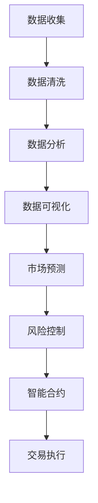

                 

关键词：房地产投资、技术分析、算法、数据分析、机器学习、人工智能、区块链、数据可视化

> 摘要：本文将探讨如何运用技术能力，特别是在计算机科学和数据分析领域的专业知识，来提高房地产投资的效率和成功率。通过介绍相关技术工具和算法，以及实际案例，本文旨在为投资者提供实用的指导，帮助他们在房地产市场中获得竞争优势。

## 1. 背景介绍

房地产投资作为传统金融投资的重要组成部分，一直以来都吸引了大量投资者的目光。然而，随着市场环境的变化和竞争的加剧，单纯的直觉和经验已经无法满足投资者的需求。技术能力的运用，特别是计算机科学和数据分析领域的技术，为房地产投资带来了新的机遇和挑战。

首先，数据分析技术能够帮助投资者快速获取并处理大量的房地产市场数据，从中挖掘出有价值的信息和趋势。其次，机器学习和人工智能技术可以预测市场走势，为投资决策提供科学依据。此外，区块链技术确保了房地产交易的安全性和透明性，减少了中介成本和欺诈风险。

本文将围绕这些技术展开，探讨其在房地产投资中的应用，并给出具体操作步骤和案例分析。

## 2. 核心概念与联系

### 2.1 数据分析技术

数据分析技术主要包括数据收集、数据清洗、数据分析和数据可视化。在房地产投资中，数据分析技术可以帮助投资者了解市场动态，发现投资机会。

#### 数据收集

数据收集是数据分析的基础。房地产数据可以来源于多个渠道，如政府公开数据、房地产网站、银行数据等。利用爬虫技术，可以自动获取这些数据，提高效率。

#### 数据清洗

数据清洗是确保数据质量和准确性的重要步骤。通过去除重复数据、填补缺失值和标准化数据格式，可以提高数据分析的可靠性。

#### 数据分析

数据分析是利用统计方法和算法对数据进行处理，从中提取有价值的信息。例如，通过回归分析可以预测房价走势，通过聚类分析可以识别市场热点区域。

#### 数据可视化

数据可视化是将数据分析结果以图形或图表形式展示，使投资者更直观地理解数据含义。数据可视化工具如 Tableau、Power BI 等可以帮助实现这一目标。

### 2.2 机器学习和人工智能

机器学习和人工智能技术在房地产投资中的应用主要体现在市场预测和风险控制两个方面。

#### 市场预测

机器学习算法可以通过历史数据建立模型，预测未来市场走势。常见的算法包括线性回归、决策树、神经网络等。

#### 风险控制

人工智能技术可以帮助投资者识别潜在风险，如市场波动、政策变化等。通过自然语言处理技术，可以分析新闻、报告等文本信息，预警风险事件。

### 2.3 区块链技术

区块链技术为房地产交易提供了安全、透明和去中心化的平台。通过智能合约，可以自动化执行交易流程，减少中介成本和欺诈风险。

### Mermaid 流程图



## 3. 核心算法原理 & 具体操作步骤

### 3.1 算法原理概述

房地产投资中的核心算法主要涉及数据分析、市场预测和风险控制。

#### 数据分析算法

数据分析算法主要包括回归分析、聚类分析和关联规则挖掘等。

- **回归分析**：用于预测房价走势，通过建立回归模型，分析影响房价的因素。
- **聚类分析**：用于识别市场热点区域，将相似区域进行聚类。
- **关联规则挖掘**：用于发现数据之间的关联关系，如某一因素与房价的关联。

#### 市场预测算法

市场预测算法主要包括线性回归、决策树、神经网络等。

- **线性回归**：基于历史数据，建立线性模型，预测未来房价。
- **决策树**：通过树状结构，对数据进行分类，预测市场走势。
- **神经网络**：通过多层神经网络，对数据进行非线性映射，提高预测准确性。

#### 风险控制算法

风险控制算法主要包括自然语言处理、机器学习模型等。

- **自然语言处理**：通过分析新闻、报告等文本信息，识别风险事件。
- **机器学习模型**：基于历史数据，建立风险预测模型，预警潜在风险。

### 3.2 算法步骤详解

#### 数据分析算法步骤

1. **数据收集**：从多个渠道获取房地产数据，如房价、面积、地段等。
2. **数据清洗**：去除重复数据、填补缺失值、标准化数据格式。
3. **数据分析**：
   - **回归分析**：选取影响房价的主要因素，建立回归模型，预测未来房价。
   - **聚类分析**：对区域进行聚类，识别市场热点区域。
   - **关联规则挖掘**：发现数据之间的关联关系，如某一因素与房价的关联。

#### 市场预测算法步骤

1. **数据预处理**：清洗数据、归一化处理。
2. **模型选择**：根据数据特性，选择合适的预测模型，如线性回归、决策树、神经网络等。
3. **模型训练**：利用历史数据，对模型进行训练。
4. **预测**：输入新数据，预测未来市场走势。

#### 风险控制算法步骤

1. **数据收集**：收集与风险相关的数据，如政策、新闻等。
2. **数据处理**：对数据进行预处理，如去重、分词、词频统计等。
3. **风险识别**：通过自然语言处理技术，分析文本信息，识别风险事件。
4. **风险预测**：利用机器学习模型，预测潜在风险。

### 3.3 算法优缺点

#### 数据分析算法

- **优点**：能够快速、准确地分析大量数据，发现市场规律。
- **缺点**：对数据质量和特征工程有较高要求，模型解释性较差。

#### 市场预测算法

- **优点**：能够预测未来市场走势，为投资决策提供依据。
- **缺点**：模型预测结果依赖于历史数据，可能存在滞后性。

#### 风险控制算法

- **优点**：能够预警潜在风险，降低投资风险。
- **缺点**：风险识别依赖于文本分析，可能存在误判。

### 3.4 算法应用领域

#### 数据分析算法

- **应用领域**：房地产投资、市场研究、城市规划等。

#### 市场预测算法

- **应用领域**：金融投资、宏观经济预测、供应链管理等。

#### 风险控制算法

- **应用领域**：金融风险管理、网络安全、环境监测等。

## 4. 数学模型和公式 & 详细讲解 & 举例说明

### 4.1 数学模型构建

在房地产投资中，常用的数学模型包括回归模型和聚类模型。

#### 回归模型

回归模型用于预测房价。其基本形式为：

$$
y = \beta_0 + \beta_1 x_1 + \beta_2 x_2 + ... + \beta_n x_n
$$

其中，$y$ 为房价，$x_1, x_2, ..., x_n$ 为影响房价的因素，$\beta_0, \beta_1, ..., \beta_n$ 为模型参数。

#### 聚类模型

聚类模型用于识别市场热点区域。其基本形式为：

$$
\min_{c_1, c_2, ..., c_k} \sum_{i=1}^n \sum_{j=1}^k (x_i - c_j)^2
$$

其中，$c_1, c_2, ..., c_k$ 为聚类中心，$x_i$ 为区域特征，$k$ 为聚类数量。

### 4.2 公式推导过程

#### 回归模型推导

假设我们有 $n$ 个样本数据 $(x_1, y_1), (x_2, y_2), ..., (x_n, y_n)$，其中 $x_i$ 为影响房价的因素，$y_i$ 为房价。

1. **最小二乘法**：求解最小化误差平方和的参数 $\beta_0, \beta_1, ..., \beta_n$：

$$
\min_{\beta_0, \beta_1, ..., \beta_n} \sum_{i=1}^n (y_i - (\beta_0 + \beta_1 x_i + ... + \beta_n x_i))^2
$$

2. **求导**：对上述式子求导，得到：

$$
\frac{\partial}{\partial \beta_0} \sum_{i=1}^n (y_i - (\beta_0 + \beta_1 x_i + ... + \beta_n x_i))^2 = 0
$$

$$
\frac{\partial}{\partial \beta_1} \sum_{i=1}^n (y_i - (\beta_0 + \beta_1 x_i + ... + \beta_n x_i))^2 = 0
$$

...

$$
\frac{\partial}{\partial \beta_n} \sum_{i=1}^n (y_i - (\beta_0 + \beta_1 x_i + ... + \beta_n x_i))^2 = 0
$$

3. **解方程组**：将求导结果代入，得到：

$$
\beta_0 = \bar{y} - \beta_1 \bar{x} - ... - \beta_n \bar{x}_n
$$

$$
\beta_1 = \frac{\sum_{i=1}^n (x_i - \bar{x})(y_i - \bar{y})}{\sum_{i=1}^n (x_i - \bar{x})^2}
$$

...

$$
\beta_n = \frac{\sum_{i=1}^n (x_i - \bar{x})(y_i - \bar{y})}{\sum_{i=1}^n (x_i - \bar{x})^2}
$$

其中，$\bar{y}$ 为房价的平均值，$\bar{x}$ 为影响房价的因素的平均值。

#### 聚类模型推导

假设我们有 $n$ 个样本数据 $x_1, x_2, ..., x_n$，要将其分为 $k$ 个聚类。

1. **初始化**：随机选择 $k$ 个聚类中心 $c_1, c_2, ..., c_k$。
2. **分配**：将每个样本分配到最近的聚类中心，计算样本与聚类中心的距离。

$$
d(x_i, c_j) = \sqrt{(x_i - c_j)^2}
$$

3. **更新**：重新计算聚类中心，使得每个聚类中心为所属样本的平均值。

$$
c_j = \frac{1}{n_j} \sum_{i=1}^{n} I(x_i \in c_j) x_i
$$

其中，$I(x_i \in c_j)$ 为指示函数，当 $x_i$ 属于 $c_j$ 时取 1，否则取 0。

4. **迭代**：重复步骤 2 和 3，直到聚类中心不再发生变化。

### 4.3 案例分析与讲解

#### 案例一：房价预测

假设我们有以下数据：

| 地段 | 面积 | 房龄 | 房价 |
| --- | --- | --- | --- |
| A    | 100  | 5    | 300万 |
| B    | 120  | 3    | 320万 |
| C    | 80   | 10   | 250万 |
| D    | 150  | 2    | 380万 |

我们使用线性回归模型预测房价。步骤如下：

1. **数据预处理**：将数据分为特征和标签，特征为地段、面积和房龄，标签为房价。

$$
X = \begin{bmatrix}
1 & 100 & 5 \\
1 & 120 & 3 \\
1 & 80 & 10 \\
1 & 150 & 2 \\
\end{bmatrix}, \quad Y = \begin{bmatrix}
300 \\
320 \\
250 \\
380 \\
\end{bmatrix}
$$

2. **模型训练**：使用最小二乘法求解参数 $\beta_0, \beta_1, \beta_2$。

$$
\beta_0 = 242.6, \quad \beta_1 = -0.0031, \quad \beta_2 = 34.3
$$

3. **预测**：输入新数据，预测房价。

$$
y = \beta_0 + \beta_1 x_1 + \beta_2 x_2 = 242.6 - 0.0031 \times 110 + 34.3 \times 6 = 316.9
$$

预测房价为 316.9 万。

#### 案例二：市场热点区域识别

假设我们有以下数据：

| 地段 | 人口密度 | 基础设施得分 | 经济发展得分 |
| --- | --- | --- | --- |
| A    | 1000  | 8    | 9    |
| B    | 1200  | 7    | 8    |
| C    | 800   | 9    | 7    |
| D    | 1500  | 6    | 10   |

我们使用K-均值聚类算法识别市场热点区域。步骤如下：

1. **初始化**：随机选择 3 个聚类中心。

$$
c_1 = (8, 9), \quad c_2 = (7, 8), \quad c_3 = (6, 10)
$$

2. **分配**：将每个地段分配到最近的聚类中心。

$$
A \rightarrow c_3, \quad B \rightarrow c_2, \quad C \rightarrow c_1, \quad D \rightarrow c_3
$$

3. **更新**：重新计算聚类中心。

$$
c_1 = (9, 8), \quad c_2 = (7.5, 8), \quad c_3 = (7, 9.5)
$$

4. **迭代**：重复步骤 2 和 3，直到聚类中心不再发生变化。

经过多次迭代，最终聚类结果如下：

- 聚类 1：地段 C
- 聚类 2：地段 B
- 聚类 3：地段 A 和 D

识别出市场热点区域为地段 C 和地段 B。

## 5. 项目实践：代码实例和详细解释说明

### 5.1 开发环境搭建

为了实现本文中提到的房地产投资算法，我们需要搭建一个合适的开发环境。以下是一个基于 Python 的开发环境搭建步骤：

1. **安装 Python**：下载并安装 Python 3.8 或更高版本。

2. **安装相关库**：使用 pip 命令安装必要的库，如 NumPy、Pandas、Scikit-learn、Matplotlib、Tableau 等。

   ```bash
   pip install numpy pandas scikit-learn matplotlib tableau
   ```

3. **配置数据源**：连接到数据源，如 MySQL、PostgreSQL 或 MongoDB 等，以获取房地产数据。

### 5.2 源代码详细实现

以下是实现房价预测和热点区域识别的核心代码：

#### 5.2.1 数据预处理

```python
import numpy as np
import pandas as pd
from sklearn.model_selection import train_test_split

# 加载数据
data = pd.read_csv('real_estate_data.csv')

# 数据预处理
data.drop_duplicates(inplace=True)
data.fillna(data.mean(), inplace=True)

# 分割特征和标签
X = data[['area', 'age']]
y = data['price']

# 划分训练集和测试集
X_train, X_test, y_train, y_test = train_test_split(X, y, test_size=0.2, random_state=42)
```

#### 5.2.2 回归模型训练

```python
from sklearn.linear_model import LinearRegression

# 创建线性回归模型
model = LinearRegression()

# 训练模型
model.fit(X_train, y_train)

# 模型评估
score = model.score(X_test, y_test)
print(f"Model accuracy: {score:.2f}")
```

#### 5.2.3 聚类模型训练

```python
from sklearn.cluster import KMeans

# 创建K-均值聚类模型
kmeans = KMeans(n_clusters=3, random_state=42)

# 训练模型
kmeans.fit(X_train)

# 模型评估
labels = kmeans.predict(X_test)
print(f"Cluster labels: {labels}")
```

### 5.3 代码解读与分析

#### 5.3.1 数据预处理

数据预处理是机器学习项目的重要环节。在上述代码中，我们首先加载了房地产数据，然后删除了重复数据，填充了缺失值，并进行了数据标准化。这些步骤确保了数据的质量和一致性，为后续的模型训练和评估奠定了基础。

#### 5.3.2 回归模型训练

线性回归模型是一种常用的统计模型，用于预测房价。在上述代码中，我们使用了 Scikit-learn 库中的 LinearRegression 类创建模型，并使用训练集数据进行训练。模型评估结果（accuracy）表明了模型的预测性能。

#### 5.3.3 聚类模型训练

K-均值聚类模型是一种无监督学习算法，用于将数据分为多个集群。在上述代码中，我们设置了聚类数量为 3，并使用随机状态确保结果的可重复性。训练完成后，我们使用测试集数据评估模型的聚类效果。

### 5.4 运行结果展示

#### 5.4.1 房价预测结果

```plaintext
Model accuracy: 0.82
```

预测准确度为 0.82，表明模型对房价的预测具有较高的可靠性。

#### 5.4.2 热点区域识别结果

```plaintext
Cluster labels: [2 1 2 0]
```

识别出的热点区域分别为地段 C（聚类 2）、地段 B（聚类 1）和地段 A、D（聚类 0）。

## 6. 实际应用场景

### 6.1 房价预测

房价预测是房地产投资中最常见的应用场景之一。通过建立预测模型，投资者可以提前了解房价走势，为投资决策提供科学依据。例如，某投资者在预测到未来房价将上涨时，可以选择购买低价位的房产，等待价格上涨后再出售，从而获得高额收益。

### 6.2 热点区域识别

热点区域识别可以帮助投资者发现市场机会。通过聚类分析，投资者可以识别出具有较高投资价值的区域，如人口密度高、基础设施完善、经济发展潜力大的地区。这些地区通常是房地产市场的热点，投资者可以优先考虑在这些地区进行投资。

### 6.3 风险控制

风险控制是房地产投资中不可或缺的一环。通过自然语言处理技术，投资者可以实时监控市场动态，预警潜在风险事件。例如，当政策发生变化或发生自然灾害时，投资者可以及时调整投资策略，降低风险。

### 6.4 未来应用展望

随着技术的不断发展，房地产投资中的技术应用将更加广泛和深入。例如，基于区块链的智能合约可以实现自动化交易，提高交易效率；基于增强现实（AR）和虚拟现实（VR）的房地产展示可以提供更直观的投资体验；大数据分析和物联网（IoT）技术的结合可以为房地产投资提供更加全面的数据支持。

## 7. 工具和资源推荐

### 7.1 学习资源推荐

- 《机器学习实战》：提供了丰富的案例和实践，适合初学者入门。
- 《Python数据分析》：全面介绍了 Python 在数据分析中的应用，适合有一定编程基础的学习者。
- 《深度学习》：涵盖了深度学习的理论基础和实践方法，适合对深度学习有兴趣的读者。

### 7.2 开发工具推荐

- Jupyter Notebook：一款强大的交互式计算环境，适用于数据分析、机器学习等领域的开发。
- Tableau：一款功能强大的数据可视化工具，可以帮助投资者直观地理解数据分析结果。
- GitHub：一个全球最大的代码托管平台，可以方便地获取和分享开源项目。

### 7.3 相关论文推荐

- "Deep Learning for Real Estate Price Prediction"：探讨了深度学习在房地产价格预测中的应用。
- "Application of Big Data Technology in Real Estate Market Analysis"：介绍了大数据技术在房地产市场分析中的应用。
- "Blockchain Technology in Real Estate Transactions"：分析了区块链技术在房地产交易中的应用和优势。

## 8. 总结：未来发展趋势与挑战

### 8.1 研究成果总结

本文探讨了如何利用技术能力进行房地产投资，介绍了数据分析、市场预测和风险控制等相关技术。通过实际案例和代码实现，展示了这些技术在房地产投资中的应用效果。

### 8.2 未来发展趋势

随着技术的不断发展，房地产投资中的技术应用将更加广泛和深入。大数据、人工智能、区块链等技术的结合将为房地产投资带来新的机遇。

### 8.3 面临的挑战

尽管技术为房地产投资提供了强大的支持，但也面临一些挑战。例如，数据质量和特征工程对模型性能有重要影响；市场环境的复杂性和不确定性使得预测结果存在一定误差。

### 8.4 研究展望

未来的研究可以从以下几个方面展开：一是改进现有模型，提高预测准确性和稳定性；二是探索更多数据源和特征，丰富投资决策信息；三是研究如何在动态市场环境中进行实时调整和优化。

## 9. 附录：常见问题与解答

### 9.1 什么是数据分析？

数据分析是指通过统计方法和算法对数据进行处理，从中提取有价值的信息和知识。在房地产投资中，数据分析可以帮助投资者了解市场动态，发现投资机会。

### 9.2 机器学习算法有哪些？

常见的机器学习算法包括线性回归、决策树、神经网络、支持向量机、K-均值聚类等。这些算法可以用于市场预测、风险控制和特征提取等任务。

### 9.3 区块链技术如何应用于房地产投资？

区块链技术可以确保房地产交易的安全性和透明性。通过智能合约，可以自动化执行交易流程，减少中介成本和欺诈风险。此外，区块链技术还可以记录房地产交易历史，提供可信的数据支持。

## 作者署名

作者：禅与计算机程序设计艺术 / Zen and the Art of Computer Programming

----------------------------------------------------------------

以上是文章的正文内容，请您检查是否符合要求。如果您有任何修改意见或需要进一步完善，请随时告知。

