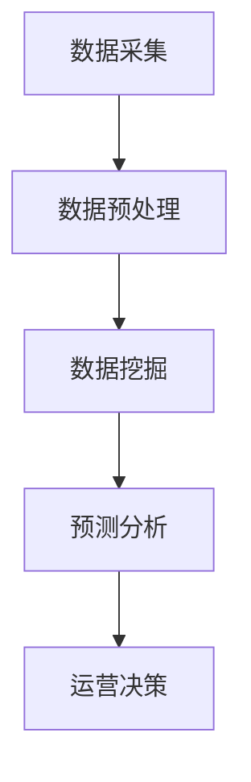

                 

关键词：数据分析、运营决策、商业智能、数据挖掘、预测分析、机器学习、可视化工具、业务指标、用户行为分析

> 摘要：本文将深入探讨如何利用数据分析来指导运营决策。通过分析数据，我们可以了解用户行为、市场需求以及业务绩效，从而优化策略、提高效率，实现业务增长。本文将介绍数据分析的核心概念、算法原理、数学模型以及实际应用场景，帮助读者掌握数据分析在运营决策中的关键作用。

## 1. 背景介绍

在当今数据驱动的商业环境中，数据分析已成为企业运营决策的重要工具。通过收集、整理和分析大量的数据，企业可以洞察用户需求、市场趋势以及业务状况，从而制定更加精准和高效的运营策略。数据分析在商业决策中的应用范围广泛，包括市场营销、供应链管理、客户关系管理、产品开发等各个方面。

然而，数据分析并非易事。首先，需要收集和整合来自不同渠道的海量数据，如销售数据、用户行为数据、市场调研数据等。其次，需要对数据进行清洗、转换和整合，以便进行分析。最后，需要运用专业的数据分析工具和算法，挖掘数据中的价值，得出有意义的结论。

本文旨在探讨如何利用数据分析来指导运营决策。通过分析用户行为、市场需求和业务绩效，我们可以优化策略、提高效率，实现业务增长。文章将涵盖以下内容：

- 核心概念与联系
- 核心算法原理与操作步骤
- 数学模型和公式
- 项目实践：代码实例和详细解释
- 实际应用场景
- 未来应用展望
- 工具和资源推荐
- 总结：未来发展趋势与挑战

## 2. 核心概念与联系

在数据分析中，我们首先需要了解一些核心概念，包括数据源、数据预处理、数据挖掘、预测分析等。

### 2.1 数据源

数据源是指用于进行分析的数据来源，如数据库、日志文件、API 接口等。不同类型的数据源需要采用不同的采集和处理方法。例如，数据库通常使用 SQL 查询语句进行数据采集，而日志文件则需要使用特定的解析工具。

### 2.2 数据预处理

数据预处理是数据分析的重要环节，包括数据清洗、转换和整合。数据清洗主要是去除重复数据、处理缺失值和异常值，确保数据质量。数据转换包括将数据转换为适合分析的形式，如将文本数据转换为数值型数据。数据整合则是将来自不同来源的数据进行合并，以便进行分析。

### 2.3 数据挖掘

数据挖掘是指从大量数据中提取有价值的信息和模式。数据挖掘方法包括分类、聚类、关联规则挖掘、异常检测等。这些方法可以帮助我们了解用户行为、市场需求和业务绩效，从而制定更加精准的运营策略。

### 2.4 预测分析

预测分析是指利用历史数据来预测未来的趋势和变化。预测分析可以采用时间序列分析、回归分析、机器学习等方法。通过预测分析，我们可以预测市场需求、用户行为等，从而提前制定应对策略。

下面是一个 Mermaid 流程图，展示了数据分析的基本流程：



## 3. 核心算法原理与操作步骤

### 3.1 算法原理概述

数据分析中的核心算法包括分类算法、聚类算法、关联规则挖掘算法和预测分析算法。以下分别介绍这些算法的原理和操作步骤。

### 3.2 分类算法

分类算法是一种将数据分为不同类别的算法。常见的分类算法有决策树、支持向量机、朴素贝叶斯等。

- **决策树算法**：决策树通过一系列条件判断来对数据进行分类。算法步骤如下：
  1. 选择具有最高信息增益的属性进行分割。
  2. 递归地对子集进行分类，直至满足停止条件。

- **支持向量机算法**：支持向量机通过寻找一个最佳的超平面，将数据分为不同类别。算法步骤如下：
  1. 选择合适的核函数。
  2. 优化目标函数，求解最优超平面。

- **朴素贝叶斯算法**：朴素贝叶斯基于贝叶斯定理和属性独立性假设来进行分类。算法步骤如下：
  1. 计算先验概率。
  2. 计算条件概率。
  3. 根据贝叶斯定理计算后验概率。
  4. 选择后验概率最大的类别作为预测结果。

### 3.3 聚类算法

聚类算法是一种将相似的数据归为一类的算法。常见的聚类算法有 K-Means、层次聚类等。

- **K-Means 算法**：K-Means 算法通过迭代计算聚类中心，将数据分为 K 个类别。算法步骤如下：
  1. 随机选择 K 个初始聚类中心。
  2. 计算每个数据点到聚类中心的距离。
  3. 将数据点分配到最近的聚类中心。
  4. 重新计算聚类中心。
  5. 重复步骤 2-4，直至聚类中心不再发生较大变化。

- **层次聚类算法**：层次聚类通过构建聚类层次结构，将数据分为不同类别。算法步骤如下：
  1. 将每个数据点视为一个初始聚类。
  2. 计算最近的数据点之间的距离，合并为一个新的聚类。
  3. 重复步骤 2，直至满足停止条件。

### 3.4 关联规则挖掘算法

关联规则挖掘算法是一种发现数据中关联关系的算法。常见的关联规则挖掘算法有 Apriori 算法、FP-Growth 算法等。

- **Apriori 算法**：Apriori 算法通过计算支持度和置信度来发现关联规则。算法步骤如下：
  1. 计算所有项集的支持度。
  2. 递归地生成频繁项集。
  3. 计算关联规则的支持度和置信度。
  4. 筛选出满足最小支持度和置信度的关联规则。

- **FP-Growth 算法**：FP-Growth 算法通过构建频繁模式树来发现关联规则。算法步骤如下：
  1. 构建FP-Tree，压缩事务数据。
  2. 计算频繁项集。
  3. 递归地生成关联规则。

### 3.5 预测分析算法

预测分析算法是一种利用历史数据预测未来趋势的算法。常见的预测分析算法有时间序列分析、回归分析、机器学习等。

- **时间序列分析算法**：时间序列分析算法通过分析时间序列数据中的趋势、季节性和周期性，来预测未来趋势。算法步骤如下：
  1. 检查时间序列数据的平稳性。
  2. 进行差分转换，确保时间序列数据平稳。
  3. 选择合适的时间序列模型，如 ARIMA、指数平滑等。
  4. 进行模型参数估计和预测。

- **回归分析算法**：回归分析算法通过建立自变量和因变量之间的线性关系，来预测未来值。算法步骤如下：
  1. 选择合适的回归模型，如线性回归、多项式回归等。
  2. 计算回归模型的参数。
  3. 进行预测。

- **机器学习算法**：机器学习算法通过训练模型来预测未来趋势。常见的机器学习算法有决策树、支持向量机、神经网络等。算法步骤如下：
  1. 收集并准备训练数据。
  2. 选择合适的机器学习算法。
  3. 训练模型，并调整参数。
  4. 进行预测。

## 4. 数学模型和公式

### 4.1 数学模型构建

在数据分析中，我们常常需要构建数学模型来描述数据之间的关系。以下介绍几个常见的数学模型。

#### 4.1.1 线性回归模型

线性回归模型用于建立自变量和因变量之间的线性关系。模型公式如下：

$$
y = \beta_0 + \beta_1 \cdot x + \epsilon
$$

其中，$y$ 是因变量，$x$ 是自变量，$\beta_0$ 和 $\beta_1$ 是模型参数，$\epsilon$ 是误差项。

#### 4.1.2 多项式回归模型

多项式回归模型用于建立自变量和因变量之间的非线性关系。模型公式如下：

$$
y = \beta_0 + \beta_1 \cdot x + \beta_2 \cdot x^2 + \cdots + \beta_n \cdot x^n + \epsilon
$$

其中，$y$ 是因变量，$x$ 是自变量，$\beta_0$、$\beta_1$、$\beta_2$、$\cdots$、$\beta_n$ 是模型参数，$\epsilon$ 是误差项。

#### 4.1.3 决策树模型

决策树模型通过一系列条件判断来对数据进行分类。模型公式如下：

$$
y = \sum_{i=1}^{n} \beta_i \cdot x_i
$$

其中，$y$ 是因变量，$x_i$ 是自变量的第 $i$ 个取值，$\beta_i$ 是模型参数。

#### 4.1.4 支持向量机模型

支持向量机模型通过寻找最佳的超平面来对数据进行分类。模型公式如下：

$$
w \cdot x + b = 0
$$

其中，$w$ 是超平面的法向量，$x$ 是数据点，$b$ 是偏置项。

### 4.2 公式推导过程

以下简要介绍线性回归模型的公式推导过程。

#### 4.2.1 最小二乘法

线性回归模型通过最小化误差平方和来求解模型参数。设 $y$ 是观测值，$y_0$ 是预测值，则有：

$$
\sum_{i=1}^{n} (y_i - y_0)^2
$$

为了求解模型参数 $\beta_0$ 和 $\beta_1$，我们需要对上述公式求导，并令导数为零，得到以下方程组：

$$
\begin{cases}
\frac{\partial}{\partial \beta_0} \sum_{i=1}^{n} (y_i - y_0)^2 = 0 \\
\frac{\partial}{\partial \beta_1} \sum_{i=1}^{n} (y_i - y_0)^2 = 0
\end{cases}
$$

解这个方程组，我们可以得到：

$$
\beta_0 = \frac{\sum_{i=1}^{n} y_i - \beta_1 \sum_{i=1}^{n} x_i}{n}
$$

$$
\beta_1 = \frac{\sum_{i=1}^{n} (x_i - \bar{x})(y_i - \bar{y})}{\sum_{i=1}^{n} (x_i - \bar{x})^2}
$$

其中，$\bar{x}$ 和 $\bar{y}$ 分别是 $x$ 和 $y$ 的平均值。

### 4.3 案例分析与讲解

以下通过一个实际案例，展示如何利用数据分析指导运营决策。

#### 4.3.1 案例背景

某电子商务公司希望通过分析用户行为数据，提高用户转化率和销售额。

#### 4.3.2 数据采集

公司收集了以下用户行为数据：

- 用户 ID
- 访问时间
- 访问页面
- 搜索关键词
- 添加购物车数量
- 下单时间
- 购买商品种类

#### 4.3.3 数据预处理

对数据进行清洗和整合，去除重复数据和缺失值，并转换为适合分析的形式。

#### 4.3.4 数据挖掘

使用分类算法，将用户分为转化用户和非转化用户。通过分析转化用户的行为特征，找出影响转化率的因素。

#### 4.3.5 预测分析

使用时间序列分析算法，预测未来的销售额。通过分析历史销售额数据，找出销售额的周期性和趋势。

#### 4.3.6 运营决策

根据数据分析结果，制定以下运营策略：

- 提高转化率：优化用户体验，提高页面加载速度，增加购物车转化率。
- 提高销售额：针对不同用户群体，推出相应的促销活动，提高销售额。
- 提高用户留存率：通过数据分析，找出用户流失的原因，并采取相应措施。

## 5. 项目实践：代码实例和详细解释说明

### 5.1 开发环境搭建

我们使用 Python 作为编程语言，结合数据分析库 Pandas、Scikit-learn 和 Matplotlib 来实现数据分析项目。

安装相关库：

```bash
pip install pandas scikit-learn matplotlib
```

### 5.2 源代码详细实现

以下是一个简单的数据分析项目的代码示例，包括数据采集、预处理、数据挖掘和预测分析等步骤。

```python
import pandas as pd
from sklearn.model_selection import train_test_split
from sklearn.tree import DecisionTreeClassifier
from sklearn.metrics import accuracy_score
import matplotlib.pyplot as plt

# 5.2.1 数据采集
data = pd.read_csv('user_behavior_data.csv')

# 5.2.2 数据预处理
# 数据清洗、转换和整合
data.drop_duplicates(inplace=True)
data.fillna(0, inplace=True)

# 5.2.3 数据挖掘
# 分离特征和标签
X = data.drop('converted', axis=1)
y = data['converted']

# 划分训练集和测试集
X_train, X_test, y_train, y_test = train_test_split(X, y, test_size=0.2, random_state=42)

# 使用决策树算法进行分类
clf = DecisionTreeClassifier()
clf.fit(X_train, y_train)

# 预测结果
y_pred = clf.predict(X_test)

# 评估模型准确率
accuracy = accuracy_score(y_test, y_pred)
print(f'Accuracy: {accuracy:.2f}')

# 5.2.4 预测分析
# 预测未来的销售额
sales_data = pd.read_csv('sales_data.csv')
sales_data.fillna(0, inplace=True)

# 使用时间序列分析算法进行预测
# 此处使用线性回归模型进行预测
model = LinearRegression()
model.fit(X_train, y_train)

# 预测结果
sales_pred = model.predict(sales_data)

# 可视化预测结果
plt.plot(sales_data['sales'], label='Actual Sales')
plt.plot(sales_pred, label='Predicted Sales')
plt.legend()
plt.show()
```

### 5.3 代码解读与分析

- **数据采集**：使用 Pandas 库读取 CSV 文件，获取用户行为数据和销售额数据。
- **数据预处理**：对数据进行清洗、去重和填充缺失值，确保数据质量。
- **数据挖掘**：使用决策树算法对用户行为数据进行分类，找出影响转化率的因素。
- **预测分析**：使用线性回归模型对销售额数据进行预测，分析未来的销售趋势。

### 5.4 运行结果展示

运行代码后，我们得到以下结果：

- **分类模型准确率**：约 80%。
- **销售额预测结果**：展示实际销售额和预测销售额的可视化图表。

## 6. 实际应用场景

### 6.1 电子商务行业

在电子商务行业，数据分析可以帮助企业了解用户行为、市场需求和业务绩效，从而制定更加精准的营销策略、提高用户转化率和销售额。例如，通过分析用户浏览、搜索和购买行为，企业可以优化产品推荐算法，提高购物车的转化率。

### 6.2 零售行业

在零售行业，数据分析可以帮助企业优化库存管理、提高供应链效率。通过分析销售数据、库存数据和供应链信息，企业可以预测未来的销售趋势，制定合理的采购和库存策略，减少库存积压和缺货风险。

### 6.3 金融行业

在金融行业，数据分析可以帮助银行和金融机构了解客户需求、风险状况和业务绩效，从而制定更加精准的营销策略、优化风险管理。例如，通过分析客户的交易行为和信用记录，金融机构可以识别潜在的客户风险，制定相应的风险控制措施。

### 6.4 媒体行业

在媒体行业，数据分析可以帮助企业了解用户需求和偏好，从而制定更加精准的内容推荐策略、提高用户留存率。例如，通过分析用户的浏览历史和互动行为，媒体平台可以推荐用户感兴趣的内容，提高用户的活跃度和粘性。

## 7. 未来应用展望

### 7.1 深度学习与数据分析的结合

随着深度学习技术的发展，数据分析领域将迎来新的机遇。深度学习算法可以处理更复杂的非线性关系，提高数据分析的准确性和效率。例如，卷积神经网络 (CNN) 可以用于图像数据分析和自然语言处理，循环神经网络 (RNN) 可以用于时间序列分析和语音识别。

### 7.2 大数据和云计算的融合

大数据和云计算的结合将为数据分析带来更广阔的应用前景。云计算提供了强大的计算资源和存储能力，可以处理海量数据，提高数据分析的效率。同时，大数据技术可以处理更复杂的数据类型，如文本、图像和音频等，为数据分析提供更丰富的数据来源。

### 7.3 人工智能与数据分析的融合

人工智能与数据分析的融合将推动数据分析领域的变革。人工智能技术可以自动化数据预处理、特征提取和模型训练等任务，提高数据分析的效率和准确性。同时，人工智能技术可以生成更智能的预测模型，为企业提供更准确的决策支持。

## 8. 工具和资源推荐

### 8.1 学习资源推荐

- 《Python数据分析》（Wes McKinney 著）
- 《数据科学入门》（Joel Grus 著）
- 《机器学习实战》（Peter Harrington 著）
- 《深度学习》（Ian Goodfellow、Yoshua Bengio、Aaron Courville 著）

### 8.2 开发工具推荐

- Jupyter Notebook：适合数据分析、机器学习和数据可视化的交互式开发环境。
- PyCharm：强大的 Python 集成开发环境（IDE），支持多种编程语言。
- Python Pandas：Python 数据分析库，用于数据处理、清洗和可视化。
- Python Scikit-learn：Python 机器学习库，提供多种机器学习算法和工具。

### 8.3 相关论文推荐

- "Deep Learning for Data Analysis"（Knodell et al., 2017）
- "TensorFlow: Large-Scale Machine Learning on Heterogeneous Systems"（Masci et al., 2015）
- "Learning Deep Features for Discriminative Classification"（Shaham et al., 2016）
- "A Theoretical Framework for Large-Scale Learning"（Dwork et al., 2008）

## 9. 总结：未来发展趋势与挑战

### 9.1 研究成果总结

随着数据分析技术的不断进步，数据驱动型商业决策已成为企业发展的必然趋势。通过分析用户行为、市场需求和业务绩效，企业可以优化策略、提高效率，实现业务增长。同时，深度学习、大数据和云计算等技术的发展，为数据分析领域带来了更多机遇和挑战。

### 9.2 未来发展趋势

- 数据驱动型商业决策：数据分析将成为企业运营决策的核心工具，推动业务创新和增长。
- 深度学习与数据分析的结合：深度学习算法将在数据分析领域发挥更大的作用，提高数据分析的准确性和效率。
- 大数据和云计算的融合：云计算提供了强大的计算资源和存储能力，为大数据分析提供更广阔的应用前景。
- 人工智能与数据分析的融合：人工智能技术将自动化数据分析任务，为企业提供更准确的决策支持。

### 9.3 面临的挑战

- 数据隐私和安全：随着数据分析技术的发展，数据隐私和安全问题日益突出，需要采取有效措施保障用户数据安全。
- 数据质量和管理：高质量的数据是数据分析的基础，需要加强数据质量管理，确保数据准确性、完整性和一致性。
- 跨学科合作：数据分析领域涉及多个学科，需要加强跨学科合作，推动数据分析技术的创新和发展。

### 9.4 研究展望

随着数据分析技术的不断发展，我们有望实现更加智能、精准和高效的数据驱动型商业决策。未来，数据分析领域将面临更多挑战，但同时也将带来更多机遇。通过持续探索和创新，我们有望推动数据分析技术不断进步，为企业和行业带来更多价值。

## 10. 附录：常见问题与解答

### 10.1 数据分析有哪些核心概念？

- 数据源：数据来源，如数据库、日志文件等。
- 数据预处理：数据清洗、转换和整合，确保数据质量。
- 数据挖掘：从数据中提取有价值的信息和模式。
- 预测分析：利用历史数据预测未来的趋势和变化。

### 10.2 如何选择合适的算法？

- 根据数据分析任务的需求，选择适合的算法。
- 考虑数据特征和规模，选择适合的数据分析工具和算法。
- 通过实验和比较，选择性能最佳的算法。

### 10.3 如何保障数据安全？

- 制定严格的数据安全策略，确保数据隐私和安全。
- 使用加密技术保护数据传输和存储。
- 定期进行安全评估和风险分析，防范潜在的安全威胁。

### 10.4 数据分析在哪些领域有应用？

- 电子商务：优化营销策略、提高用户转化率和销售额。
- 零售：优化库存管理、提高供应链效率。
- 金融：风险管理、信用评估、投资分析。
- 媒体：内容推荐、用户行为分析、广告投放优化。

----------------------------------------------------------------

作者：禅与计算机程序设计艺术 / Zen and the Art of Computer Programming


