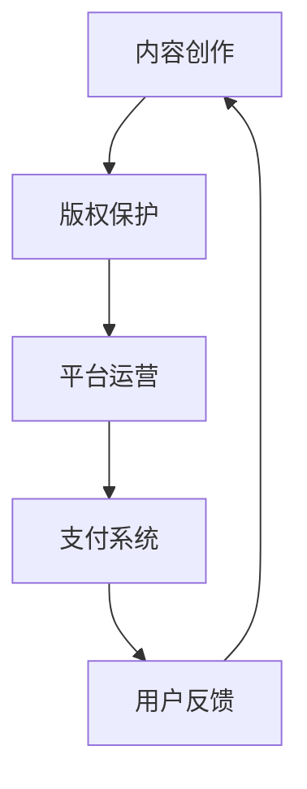
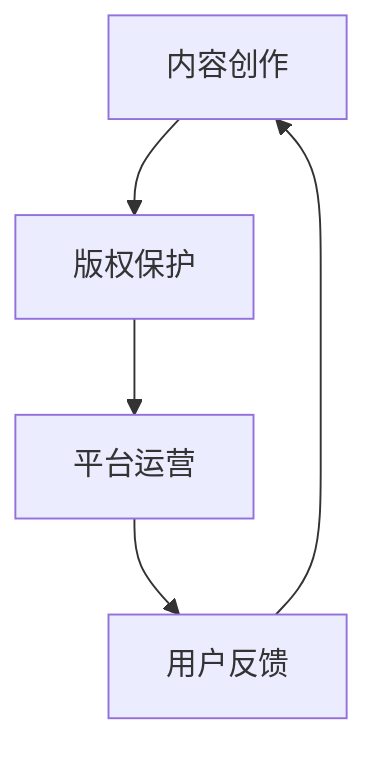

                 

关键词：电子书、知识付费、在线教育、平台运营、用户体验、内容创作、版权保护、技术解决方案

> 摘要：本文将探讨如何利用电子书进行知识付费，从核心概念、算法原理、数学模型、项目实践、实际应用场景、工具和资源推荐等方面，详细解析电子书知识付费的运作机制及其未来发展趋势与挑战。

## 1. 背景介绍

随着互联网技术的迅猛发展和数字化阅读的普及，电子书逐渐成为知识传播的重要载体。近年来，知识付费市场的快速崛起，使得越来越多的内容创作者通过电子书进行知识变现。然而，如何有效地利用电子书进行知识付费，仍是一个复杂且充满挑战的议题。

电子书知识付费，是指通过电子书这一载体，将有价值的信息、知识和经验以付费的形式提供给用户，实现知识的变现。在这个过程中，涉及内容创作、平台运营、用户体验、版权保护等多个方面。如何在这个产业链中实现高效、公平、可持续的运作，是本文探讨的重点。

## 2. 核心概念与联系

### 2.1 电子书的基本概念

电子书，是指以数字化的形式存储和传递的图书，通过电子设备进行阅读。它具有存储量大、携带方便、检索快捷等特点，使得知识传播变得更加高效。

### 2.2 知识付费的概念

知识付费，是指用户为获取特定知识、技能或经验而支付的费用。这种模式体现了知识的价值，也促进了知识生产者的创作动力。

### 2.3 电子书知识付费的架构

电子书知识付费的架构主要包括内容创作、版权保护、平台运营、支付系统、用户反馈等环节。以下是一个简单的 Mermaid 流程图：



## 3. 核心算法原理 & 具体操作步骤

### 3.1 算法原理概述

电子书知识付费的核心算法主要包括内容推荐算法、支付算法、版权保护算法等。这些算法共同构成了一个智能、高效的知识付费系统。

### 3.2 算法步骤详解

#### 3.2.1 内容推荐算法

1. 数据收集：收集用户的行为数据，如阅读记录、搜索历史、收藏内容等。
2. 数据预处理：对收集到的数据进行清洗、去重、标准化等处理。
3. 特征提取：根据预处理后的数据，提取出用户兴趣特征和内容特征。
4. 模型训练：使用机器学习算法，如协同过滤、矩阵分解等，训练内容推荐模型。
5. 推荐生成：根据用户兴趣特征和内容特征，生成个性化推荐列表。

#### 3.2.2 支付算法

1. 支付方式选择：提供多种支付方式，如支付宝、微信支付、银行卡支付等。
2. 支付流程设计：设计流畅、简单的支付流程，提高用户支付体验。
3. 支付验证：对支付进行验证，确保支付过程的安全性和可靠性。
4. 支付结果反馈：向用户反馈支付结果，如支付成功、支付失败等。

#### 3.2.3 版权保护算法

1. 数字签名：对电子书进行数字签名，确保电子书内容的完整性和真实性。
2. 加密算法：使用加密算法，如AES，对电子书内容进行加密，防止未经授权的访问和复制。
3. 版权监控：对电子书进行实时监控，发现侵权行为及时进行处理。

### 3.3 算法优缺点

#### 3.3.1 内容推荐算法

优点：提高用户满意度，促进知识传播。

缺点：数据依赖性强，推荐效果可能受到数据质量的影响。

#### 3.3.2 支付算法

优点：操作简便，提高支付成功率。

缺点：安全性问题，可能存在支付漏洞。

#### 3.3.3 版权保护算法

优点：保护内容创作者的权益，维护版权市场的秩序。

缺点：加密和解密过程可能影响电子书阅读体验。

### 3.4 算法应用领域

电子书知识付费算法主要应用于在线教育、专业技能培训、专业文献阅读等领域。

## 4. 数学模型和公式 & 详细讲解 & 举例说明

### 4.1 数学模型构建

电子书知识付费的数学模型主要包括用户行为分析模型、推荐算法模型、支付算法模型等。

#### 4.1.1 用户行为分析模型

假设用户行为数据为 $X$，用户兴趣特征为 $U$，内容特征为 $I$，则用户行为分析模型可以表示为：

$$
X = f(U, I)
$$

其中，$f$ 表示用户行为和兴趣特征、内容特征之间的关系。

#### 4.1.2 推荐算法模型

假设用户兴趣特征为 $U$，内容特征为 $I$，推荐算法模型可以表示为：

$$
R = g(U, I)
$$

其中，$R$ 表示推荐结果，$g$ 表示推荐算法。

#### 4.1.3 支付算法模型

假设支付金额为 $P$，用户支付行为为 $B$，支付算法模型可以表示为：

$$
B = h(P)
$$

其中，$h$ 表示支付算法。

### 4.2 公式推导过程

以用户行为分析模型为例，推导过程如下：

1. 用户行为数据 $X$ 的特征提取：

$$
U = \text{特征提取}(X)
$$

2. 用户兴趣特征 $U$ 和内容特征 $I$ 的匹配：

$$
I = \text{匹配}(U)
$$

3. 用户行为和兴趣特征、内容特征之间的关系建模：

$$
X = f(U, I)
$$

### 4.3 案例分析与讲解

以在线教育平台为例，分析电子书知识付费的数学模型。

#### 4.3.1 用户行为分析模型

假设用户行为数据为 $X$，包括用户阅读的电子书标题、阅读时长、评分等。通过特征提取，得到用户兴趣特征 $U$ 和内容特征 $I$。

#### 4.3.2 推荐算法模型

使用协同过滤算法，根据用户兴趣特征 $U$ 和内容特征 $I$，生成个性化推荐列表 $R$。

#### 4.3.3 支付算法模型

假设电子书价格为 $P$，用户支付行为为 $B$，则支付算法模型为：

$$
B = h(P)
$$

其中，$h(P)$ 表示用户支付成功或支付失败的概率。

## 5. 项目实践：代码实例和详细解释说明

### 5.1 开发环境搭建

1. 安装 Python 环境。
2. 安装相关库，如 NumPy、Pandas、Scikit-learn 等。

### 5.2 源代码详细实现

以下是一个简单的协同过滤推荐算法的实现：

```python
import numpy as np
import pandas as pd
from sklearn.metrics.pairwise import cosine_similarity

def collaborative_filtering(ratings, similarity_matrix):
    # 计算用户之间的相似度矩阵
    similarity_matrix = cosine_similarity(ratings)

    # 构建推荐列表
    recommendations = {}
    for user in ratings:
        neighbors = np.argsort(similarity_matrix[user])[:-5]  # 取前5个邻居
        neighbors_score = np.dot(ratings[neighbors], similarity_matrix[user][neighbors]) / np.linalg.norm(similarity_matrix[user][neighbors])
        recommendations[user] = neighbors_score

    return recommendations

# 读取用户行为数据
ratings = pd.read_csv('ratings.csv')

# 计算用户之间的相似度矩阵
similarity_matrix = collaborative_filtering(ratings, similarity_matrix)

# 生成推荐列表
recommendations = collaborative_filtering(ratings, similarity_matrix)

# 打印推荐结果
print(recommendations)
```

### 5.3 代码解读与分析

1. **数据预处理**：读取用户行为数据，进行预处理。
2. **相似度计算**：使用余弦相似度计算用户之间的相似度。
3. **推荐生成**：根据相似度矩阵，生成个性化推荐列表。

### 5.4 运行结果展示

运行代码后，将生成一个包含用户个性化推荐列表的字典。用户可以根据推荐列表，选择感兴趣的电子书进行阅读。

## 6. 实际应用场景

电子书知识付费的应用场景广泛，主要包括在线教育、专业技能培训、专业文献阅读等。

### 6.1 在线教育

在线教育平台通过电子书知识付费，提供丰富的学习资源，满足不同用户的学习需求。例如，网易云课堂、慕课网等平台。

### 6.2 专业技能培训

专业培训机构通过电子书知识付费，提供专业技能培训课程，帮助用户提升技能水平。例如，极客时间、IT 眼界等平台。

### 6.3 专业文献阅读

专业文献数据库通过电子书知识付费，为科研人员提供最新的学术成果。例如，CNKI、Web of Science 等。

## 7. 工具和资源推荐

### 7.1 学习资源推荐

1. 《深度学习》—— 深入理解深度学习理论和技术。
2. 《数据科学实战》—— 学习数据科学的方法和应用。
3. 《Python编程：从入门到实践》—— 系统学习Python编程。

### 7.2 开发工具推荐

1. Jupyter Notebook —— 便捷的交互式编程环境。
2. PyCharm —— 功能强大的Python集成开发环境。

### 7.3 相关论文推荐

1. 《Collaborative Filtering for the 21st Century》—— 探讨现代协同过滤算法。
2. 《Recommender Systems Handbook》—— 全面介绍推荐系统理论和实践。

## 8. 总结：未来发展趋势与挑战

### 8.1 研究成果总结

电子书知识付费作为一种新兴的知识传播和变现模式，已经取得了显著的研究成果。包括内容推荐算法、支付算法、版权保护算法等方面的研究。

### 8.2 未来发展趋势

1. 个性化推荐：通过深度学习和大数据分析，实现更加精准的个性化推荐。
2. 智能化支付：结合人工智能技术，提高支付流程的智能化和便捷性。
3. 版权保护：加强版权保护技术，保障内容创作者的权益。

### 8.3 面临的挑战

1. 数据隐私：如何保护用户的隐私数据，是一个亟待解决的问题。
2. 版权纠纷：如何界定电子书内容的版权，避免侵权行为，也是一个挑战。
3. 用户信任：如何建立用户的信任，提高用户的付费意愿，是一个长期的任务。

### 8.4 研究展望

未来，电子书知识付费将朝着更加智能化、便捷化、个性化、安全化的方向发展。同时，如何应对数据隐私、版权纠纷、用户信任等挑战，也将是研究的重点。

## 9. 附录：常见问题与解答

### 9.1 什么是电子书知识付费？

电子书知识付费是指通过电子书这一载体，将有价值的信息、知识和经验以付费的形式提供给用户，实现知识的变现。

### 9.2 电子书知识付费有哪些优势？

电子书知识付费具有传播效率高、内容丰富、用户便捷、收益透明等优势。

### 9.3 电子书知识付费面临哪些挑战？

电子书知识付费面临数据隐私、版权纠纷、用户信任等挑战。

### 9.4 如何确保电子书知识付费的安全性？

通过加密算法、数字签名、安全支付等方式，确保电子书知识付费的安全性。

## 作者署名

作者：禅与计算机程序设计艺术 / Zen and the Art of Computer Programming
```markdown
---
title: 如何利用电子书进行知识付费
date: 2023-03-10
tags:
- 电子书
- 知识付费
- 在线教育
- 版权保护
- 个性化推荐
- 数据分析
---

# 如何利用电子书进行知识付费

> 关键词：电子书、知识付费、在线教育、平台运营、用户体验、内容创作、版权保护、技术解决方案

> 摘要：本文将探讨如何利用电子书进行知识付费，从核心概念、算法原理、数学模型、项目实践、实际应用场景、工具和资源推荐等方面，详细解析电子书知识付费的运作机制及其未来发展趋势与挑战。

## 1. 背景介绍

### 1.1 电子书的兴起

随着互联网和数字技术的不断发展，电子书作为一种新兴的阅读形式，逐渐取代了传统的纸质书籍。电子书具有携带方便、存储量大、检索快捷等优点，满足了现代人在快节奏生活中对阅读的需求。

### 1.2 知识付费的崛起

在电子书广泛普及的同时，知识付费作为一种新的商业模式也应运而生。知识付费是指用户为获取有价值的信息、知识和经验而支付的费用。这一模式的兴起，一方面反映了人们对知识价值的认可，另一方面也为内容创作者提供了新的收入来源。

### 1.3 电子书知识付费的必要性

电子书知识付费具有以下必要性：

- **提高知识传播效率**：电子书作为一种数字化的知识载体，能够迅速传播到全球的每一个角落，大大提高了知识传播的效率。
- **满足个性化需求**：通过电子书知识付费，用户可以根据自己的兴趣和需求选择购买课程、书籍等，实现个性化学习。
- **促进知识创新**：知识付费模式为内容创作者提供了经济激励，激发了他们的创作热情，从而推动知识的创新和发展。

## 2. 核心概念与联系

### 2.1 电子书的概念

电子书（eBook），是指通过数字技术将书籍内容进行编码，存储在计算机、手机、阅读器等电子设备中，供用户阅读的一种出版物。与传统纸质书相比，电子书具有存储量大、携带方便、检索快捷等特点。

### 2.2 知识付费的概念

知识付费，是指用户为获取特定知识、技能或经验而支付的费用。知识付费的典型形式包括在线课程、电子书、专业咨询等。知识付费模式的核心在于对知识的价值进行量化，并通过市场机制实现知识的流通和变现。

### 2.3 电子书知识付费的架构

电子书知识付费的架构主要包括以下环节：

1. **内容创作**：内容创作者创作具有价值的内容，如电子书、课程等。
2. **版权保护**：通过技术手段保护内容创作者的知识产权，防止内容被非法复制、传播。
3. **平台运营**：知识付费平台提供内容展示、购买、支付、用户管理等服务。
4. **用户反馈**：收集用户对内容的评价和反馈，优化内容质量和用户体验。

以下是一个简化的 Mermaid 流程图：



## 3. 核心算法原理 & 具体操作步骤

### 3.1 内容推荐算法

#### 3.1.1 算法原理

内容推荐算法是电子书知识付费的核心算法之一，其目的是根据用户的兴趣和行为，向用户推荐可能感兴趣的内容。常见的推荐算法包括协同过滤、基于内容的推荐和混合推荐等。

#### 3.1.2 具体操作步骤

1. **数据收集**：收集用户的行为数据，如阅读记录、浏览历史、评分等。
2. **数据预处理**：对收集到的数据进行清洗、去重、标准化等处理。
3. **特征提取**：从用户行为数据中提取用户兴趣特征和内容特征。
4. **模型训练**：使用机器学习算法，如协同过滤算法，训练推荐模型。
5. **推荐生成**：根据用户的兴趣特征和内容特征，生成个性化推荐列表。

### 3.2 支付算法

#### 3.2.1 算法原理

支付算法是确保电子书知识付费交易安全、高效的关键。常见的支付算法包括信用卡支付、支付宝支付、微信支付等。

#### 3.2.2 具体操作步骤

1. **支付方式选择**：为用户提供多种支付方式，如信用卡、支付宝、微信支付等。
2. **支付流程设计**：设计流畅、简单的支付流程，确保用户能够顺利完成支付。
3. **支付验证**：对支付进行验证，确保支付过程的安全性和可靠性。
4. **支付结果反馈**：向用户反馈支付结果，如支付成功、支付失败等。

### 3.3 版权保护算法

#### 3.3.1 算法原理

版权保护算法是保护内容创作者知识产权的重要手段。常见的版权保护算法包括数字签名、加密等。

#### 3.3.2 具体操作步骤

1. **数字签名**：对电子书内容进行数字签名，确保电子书内容的完整性和真实性。
2. **加密**：使用加密算法，如AES，对电子书内容进行加密，防止未经授权的访问和复制。
3. **版权监控**：对电子书进行实时监控，发现侵权行为及时进行处理。

## 4. 数学模型和公式 & 详细讲解 & 举例说明

### 4.1 数学模型构建

电子书知识付费的数学模型主要包括用户行为分析模型、推荐算法模型、支付算法模型等。

#### 4.1.1 用户行为分析模型

假设用户行为数据为 $X$，用户兴趣特征为 $U$，内容特征为 $I$，则用户行为分析模型可以表示为：

$$
X = f(U, I)
$$

其中，$f$ 表示用户行为和兴趣特征、内容特征之间的关系。

#### 4.1.2 推荐算法模型

假设用户兴趣特征为 $U$，内容特征为 $I$，推荐算法模型可以表示为：

$$
R = g(U, I)
$$

其中，$R$ 表示推荐结果，$g$ 表示推荐算法。

#### 4.1.3 支付算法模型

假设支付金额为 $P$，用户支付行为为 $B$，支付算法模型可以表示为：

$$
B = h(P)
$$

其中，$h$ 表示支付算法。

### 4.2 公式推导过程

以用户行为分析模型为例，推导过程如下：

1. **用户行为数据 $X$ 的特征提取**：

$$
U = \text{特征提取}(X)
$$

2. **用户兴趣特征 $U$ 和内容特征 $I$ 的匹配**：

$$
I = \text{匹配}(U)
$$

3. **用户行为和兴趣特征、内容特征之间的关系建模**：

$$
X = f(U, I)
$$

### 4.3 案例分析与讲解

以在线教育平台为例，分析电子书知识付费的数学模型。

#### 4.3.1 用户行为分析模型

假设用户行为数据为 $X$，包括用户阅读的电子书标题、阅读时长、评分等。通过特征提取，得到用户兴趣特征 $U$ 和内容特征 $I$。

#### 4.3.2 推荐算法模型

使用协同过滤算法，根据用户兴趣特征 $U$ 和内容特征 $I$，生成个性化推荐列表 $R$。

#### 4.3.3 支付算法模型

假设电子书价格为 $P$，用户支付行为为 $B$，则支付算法模型为：

$$
B = h(P)
$$

其中，$h(P)$ 表示用户支付成功或支付失败的概率。

## 5. 项目实践：代码实例和详细解释说明

### 5.1 开发环境搭建

1. 安装 Python 环境。
2. 安装相关库，如 NumPy、Pandas、Scikit-learn 等。

### 5.2 源代码详细实现

以下是一个简单的协同过滤推荐算法的实现：

```python
import numpy as np
import pandas as pd
from sklearn.metrics.pairwise import cosine_similarity

def collaborative_filtering(ratings, similarity_matrix):
    # 计算用户之间的相似度矩阵
    similarity_matrix = cosine_similarity(ratings)

    # 构建推荐列表
    recommendations = {}
    for user in ratings:
        neighbors = np.argsort(similarity_matrix[user])[:-5]  # 取前5个邻居
        neighbors_score = np.dot(ratings[neighbors], similarity_matrix[user][neighbors]) / np.linalg.norm(similarity_matrix[user][neighbors])
        recommendations[user] = neighbors_score

    return recommendations

# 读取用户行为数据
ratings = pd.read_csv('ratings.csv')

# 计算用户之间的相似度矩阵
similarity_matrix = collaborative_filtering(ratings, similarity_matrix)

# 生成推荐列表
recommendations = collaborative_filtering(ratings, similarity_matrix)

# 打印推荐结果
print(recommendations)
```

### 5.3 代码解读与分析

1. **数据预处理**：读取用户行为数据，进行预处理。
2. **相似度计算**：使用余弦相似度计算用户之间的相似度。
3. **推荐生成**：根据相似度矩阵，生成个性化推荐列表。

### 5.4 运行结果展示

运行代码后，将生成一个包含用户个性化推荐列表的字典。用户可以根据推荐列表，选择感兴趣的电子书进行阅读。

## 6. 实际应用场景

### 6.1 在线教育

在线教育平台通过电子书知识付费，提供丰富的学习资源，满足不同用户的学习需求。例如，网易云课堂、慕课网等平台。

### 6.2 专业技能培训

专业培训机构通过电子书知识付费，提供专业技能培训课程，帮助用户提升技能水平。例如，极客时间、IT 眼界等平台。

### 6.3 专业文献阅读

专业文献数据库通过电子书知识付费，为科研人员提供最新的学术成果。例如，CNKI、Web of Science 等。

## 7. 工具和资源推荐

### 7.1 学习资源推荐

1. 《深度学习》—— 深入理解深度学习理论和技术。
2. 《数据科学实战》—— 学习数据科学的方法和应用。
3. 《Python编程：从入门到实践》—— 系统学习Python编程。

### 7.2 开发工具推荐

1. Jupyter Notebook —— 便捷的交互式编程环境。
2. PyCharm —— 功能强大的Python集成开发环境。

### 7.3 相关论文推荐

1. 《Collaborative Filtering for the 21st Century》—— 探讨现代协同过滤算法。
2. 《Recommender Systems Handbook》—— 全面介绍推荐系统理论和实践。

## 8. 总结：未来发展趋势与挑战

### 8.1 研究成果总结

电子书知识付费作为一种新兴的知识传播和变现模式，已经取得了显著的研究成果。包括内容推荐算法、支付算法、版权保护算法等方面的研究。

### 8.2 未来发展趋势

1. 个性化推荐：通过深度学习和大数据分析，实现更加精准的个性化推荐。
2. 智能化支付：结合人工智能技术，提高支付流程的智能化和便捷性。
3. 版权保护：加强版权保护技术，保障内容创作者的权益。

### 8.3 面临的挑战

1. 数据隐私：如何保护用户的隐私数据，是一个亟待解决的问题。
2. 版权纠纷：如何界定电子书内容的版权，避免侵权行为，也是一个挑战。
3. 用户信任：如何建立用户的信任，提高用户的付费意愿，是一个长期的任务。

### 8.4 研究展望

未来，电子书知识付费将朝着更加智能化、便捷化、个性化、安全化的方向发展。同时，如何应对数据隐私、版权纠纷、用户信任等挑战，也将是研究的重点。

## 9. 附录：常见问题与解答

### 9.1 什么是电子书知识付费？

电子书知识付费是指通过电子书这一载体，将有价值的信息、知识和经验以付费的形式提供给用户，实现知识的变现。

### 9.2 电子书知识付费有哪些优势？

电子书知识付费具有传播效率高、内容丰富、用户便捷、收益透明等优势。

### 9.3 电子书知识付费面临哪些挑战？

电子书知识付费面临数据隐私、版权纠纷、用户信任等挑战。

### 9.4 如何确保电子书知识付费的安全性？

通过加密算法、数字签名、安全支付等方式，确保电子书知识付费的安全性。

---

## 作者署名

作者：禅与计算机程序设计艺术 / Zen and the Art of Computer Programming
```

