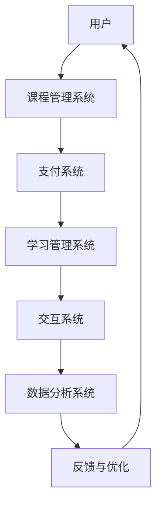

                 

 > **关键词：**知识付费、在线培训、公务员考试、面试培训、教育技术、商业模式、数据驱动

> **摘要：**本文探讨了如何通过知识付费模式，实现在线公务员考试与面试培训的可行性和效益。文章首先分析了当前公务员考试和面试培训的现状，然后提出了基于知识付费的在线培训解决方案，包括技术架构、算法原理、数学模型、项目实践和实际应用场景等方面。最后，文章对知识付费在线培训的未来发展进行了展望。

## 1. 背景介绍

公务员考试是许多求职者进入政府机关、事业单位的重要途径。然而，由于考试内容的复杂性和竞争的激烈程度，许多考生需要通过培训来提高自己的考试和面试能力。传统的培训方式往往依赖于线下课程，这需要学员支付高额费用，并且存在地理位置限制、时间安排紧张等问题。近年来，随着互联网技术的发展，在线培训逐渐成为一种新的解决方案，它不仅降低了培训成本，还提供了更加灵活的学习方式。

知识付费是指用户为了获取特定知识或技能，自愿支付一定费用的一种商业模式。这一模式在教育领域得到了广泛应用，尤其是在线教育平台如慕课（MOOCs）、直播课程等。知识付费的优势在于它能够根据用户需求定制化内容，提供个性化的学习体验，同时也可以通过数据分析为用户提供更加精准的学习建议。

本文旨在探讨如何利用知识付费模式实现在线公务员考试与面试培训，通过分析技术架构、算法原理、数学模型等方面，为这一新型商业模式提供理论和实践支持。

## 2. 核心概念与联系

### 2.1. 知识付费模式

知识付费模式的核心是“内容 + 服务”，即通过高质量的教学内容和良好的学习服务来实现用户付费。在在线公务员考试与面试培训中，知识付费模式的具体体现包括：

- **课程内容付费**：用户需要购买课程才能学习相关内容，这些课程可能包括录播视频、直播课程、讲义文档等。
- **服务付费**：用户在学习过程中可能需要专家答疑、个性化辅导、模拟面试等服务，这些服务通常也需单独付费。

### 2.2. 在线培训解决方案

在线培训解决方案需要涵盖以下核心组成部分：

- **课程管理系统**：用于管理课程内容、用户权限、支付系统等。
- **学习管理系统**：用于跟踪用户学习进度、评估学习效果、提供学习建议等。
- **交互系统**：用于实现教师与学生的实时交流，包括问答、讨论、直播等。
- **数据与分析系统**：用于收集用户数据，进行数据分析和用户画像，为个性化推荐提供支持。

### 2.3. Mermaid 流程图

以下是公务员在线培训解决方案的 Mermaid 流程图：



## 3. 核心算法原理 & 具体操作步骤

### 3.1. 算法原理概述

在线公务员考试与面试培训的核心算法原理包括内容推荐算法、学习分析算法和用户画像算法。这些算法共同作用，实现个性化培训内容和服务。

- **内容推荐算法**：根据用户的学习历史和偏好推荐合适的课程内容。
- **学习分析算法**：通过学习数据的分析，评估用户的学习效果，提供学习反馈。
- **用户画像算法**：通过用户行为数据构建用户画像，用于精准营销和个性化服务。

### 3.2. 算法步骤详解

#### 3.2.1. 内容推荐算法

1. **数据收集**：收集用户的学习历史、课程评分、搜索记录等数据。
2. **特征提取**：提取用户行为数据的特征，如课程主题、难度、时长等。
3. **模型训练**：使用机器学习算法训练推荐模型，如协同过滤、矩阵分解等。
4. **推荐生成**：根据用户特征和模型预测，生成个性化的课程推荐列表。

#### 3.2.2. 学习分析算法

1. **学习数据收集**：收集用户在学习过程中的行为数据，如学习时长、答题情况、课程进度等。
2. **学习效果评估**：通过学习数据的分析，评估用户的学习效果，生成学习报告。
3. **反馈与调整**：根据学习效果反馈，调整推荐内容和教学方法。

#### 3.2.3. 用户画像算法

1. **行为数据收集**：收集用户的学习、购买、互动等行为数据。
2. **特征工程**：对行为数据进行特征提取和工程，如兴趣标签、职业背景等。
3. **用户画像构建**：使用机器学习算法构建用户画像，用于个性化推荐和服务。

### 3.3. 算法优缺点

#### 3.3.1. 内容推荐算法

**优点**：
- 提高用户的学习效率和满意度。
- 增加课程内容的曝光率和转化率。

**缺点**：
- 需要大量数据和计算资源。
- 模型训练和推荐结果的实时性要求高。

#### 3.3.2. 学习分析算法

**优点**：
- 提供个性化的学习建议和反馈。
- 帮助教师和学生及时调整学习策略。

**缺点**：
- 需要大量的学习数据。
- 结果的准确性和实时性受算法和数据质量影响。

#### 3.3.3. 用户画像算法

**优点**：
- 提供精准的营销和服务。
- 增强用户粘性和满意度。

**缺点**：
- 用户隐私保护问题。
- 用户行为数据的实时性和准确性要求高。

### 3.4. 算法应用领域

内容推荐算法、学习分析算法和用户画像算法广泛应用于在线教育领域，包括：

- **在线课程推荐**：根据用户偏好推荐合适的课程。
- **学习效果评估**：评估学生的学习成果，提供改进建议。
- **用户画像分析**：用于精准营销和个性化服务。

## 4. 数学模型和公式 & 详细讲解 & 举例说明

### 4.1. 数学模型构建

在线公务员考试与面试培训中的数学模型主要包括：

- **线性回归模型**：用于预测用户的学习效果。
- **决策树模型**：用于分类用户的学习偏好。
- **聚类模型**：用于构建用户画像。

### 4.2. 公式推导过程

以线性回归模型为例，其公式推导如下：

$$
y = \beta_0 + \beta_1x_1 + \beta_2x_2 + ... + \beta_nx_n + \epsilon
$$

其中，$y$ 为因变量，$x_1, x_2, ..., x_n$ 为自变量，$\beta_0, \beta_1, \beta_2, ..., \beta_n$ 为模型参数，$\epsilon$ 为误差项。

### 4.3. 案例分析与讲解

#### 4.3.1. 线性回归模型案例

假设我们要预测一名用户的学习成绩，其中自变量包括学习时长、课程难度和课程评价。以下是模型的公式：

$$
成绩 = \beta_0 + \beta_1 \times 学习时长 + \beta_2 \times 课程难度 + \beta_3 \times 课程评价 + \epsilon
$$

通过训练数据集，我们可以计算出模型参数 $\beta_0, \beta_1, \beta_2, \beta_3$ 的值，从而预测新用户的成绩。

#### 4.3.2. 决策树模型案例

假设我们要根据用户的学习时长和课程评价来分类用户的学习偏好。以下是决策树模型的分类规则：

- 如果学习时长 > 10 小时，则偏好为“专业”；否则，进入下一层。
- 如果课程评价 > 4.5，则偏好为“兴趣”；否则，偏好为“基础”。

通过这样的分类规则，我们可以将用户划分为不同的学习偏好类别，从而提供个性化的学习推荐。

#### 4.3.3. 聚类模型案例

假设我们要根据用户的行为数据构建用户画像，其中行为数据包括学习时长、课程评价和互动次数。以下是聚类模型的公式：

$$
C = \{C_1, C_2, ..., C_k\}
$$

其中，$C$ 表示用户集合，$C_i$ 表示第 $i$ 个聚类中心，$k$ 表示聚类个数。

通过聚类模型，我们可以将用户划分为不同的群体，每个群体具有相似的行为特征，从而为用户提供个性化的服务。

## 5. 项目实践：代码实例和详细解释说明

### 5.1. 开发环境搭建

在进行在线公务员考试与面试培训项目的开发前，我们需要搭建一个合适的技术环境。以下是一个基本的开发环境搭建步骤：

1. **操作系统**：Linux 或 macOS
2. **编程语言**：Python
3. **框架**：Django（用于构建Web应用）
4. **数据库**：PostgreSQL（用于存储用户数据、课程数据等）
5. **消息队列**：RabbitMQ（用于处理异步任务）
6. **缓存**：Redis（用于缓存数据）

### 5.2. 源代码详细实现

以下是项目中的一部分源代码实现，包括用户注册、课程推荐和学习数据跟踪等模块。

#### 5.2.1. 用户注册模块

```python
# 用户注册接口实现
from django.contrib.auth.models import User
from rest_framework import status, generics
from rest_framework.permissions import AllowAny
from rest_framework.response import Response
from .serializers import UserRegistrationSerializer

class UserRegistrationView(generics.CreateAPIView):
    serializer_class = UserRegistrationSerializer
    permission_classes = [AllowAny]

    def create(self, request, *args, **kwargs):
        serializer = self.get_serializer(data=request.data)
        if serializer.is_valid():
            user = serializer.save()
            # 发送注册成功邮件等后续操作
            return Response({"message": "User registered successfully."}, status=status.HTTP_201_CREATED)
        return Response(serializer.errors, status=status.HTTP_400_BAD_REQUEST)
```

#### 5.2.2. 课程推荐模块

```python
# 课程推荐算法实现
from sklearn.metrics.pairwise import cosine_similarity
from sklearn.model_selection import train_test_split
import numpy as np

# 假设我们有一组用户行为数据
user_ratings = np.array([
    [1, 2, 3, 0, 0],
    [0, 1, 2, 3, 0],
    [0, 0, 1, 2, 3],
    # ... 更多用户行为数据
])

# 计算用户之间的相似度矩阵
similarity_matrix = cosine_similarity(user_ratings)

# 根据相似度矩阵推荐课程
def recommend_courses(user_index, similarity_matrix, top_n=3):
    # 计算每个用户与当前用户的相似度
    sim_scores = similarity_matrix[user_index]
    # 排序并取前n个相似用户
    sim_scores = np.argsort(sim_scores)[::-1][:top_n]
    # 获取相似用户喜欢的课程
    recommended_courses = user_ratings[sim_scores].sum(axis=0)
    # 返回推荐课程列表
    return recommended_courses

# 示例：为用户0推荐课程
recommended_courses = recommend_courses(0, similarity_matrix)
print(recommended_courses)
```

#### 5.2.3. 学习数据跟踪模块

```python
# 学习数据跟踪接口实现
from rest_framework import viewsets
from .models import LearningData
from .serializers import LearningDataSerializer

class LearningDataViewSet(viewsets.ModelViewSet):
    queryset = LearningData.objects.all()
    serializer_class = LearningDataSerializer

    def create(self, request, *args, **kwargs):
        serializer = self.get_serializer(data=request.data)
        if serializer.is_valid():
            serializer.save()
            # 发送学习数据跟踪邮件等后续操作
            return Response({"message": "Learning data recorded successfully."}, status=status.HTTP_201_CREATED)
        return Response(serializer.errors, status=status.HTTP_400_BAD_REQUEST)
```

### 5.3. 代码解读与分析

#### 5.3.1. 用户注册模块

用户注册模块使用了 Django 的 `CreateAPIView` 类，它简化了用户注册接口的实现。通过 `UserRegistrationSerializer` 对用户输入的数据进行验证和转换，然后保存用户信息。

#### 5.3.2. 课程推荐模块

课程推荐模块使用 `cosine_similarity` 函数计算用户行为数据的相似度，然后根据相似度矩阵推荐课程。这种方法是一种基于协同过滤的推荐算法，它通过分析用户的行为数据找到相似用户，从而推荐相似用户喜欢的课程。

#### 5.3.3. 学习数据跟踪模块

学习数据跟踪模块使用了 Django 的 `ViewSet` 类，它提供了创建、更新、删除学习数据的接口。通过 `LearningDataSerializer` 对学习数据输入的数据进行验证和转换，然后保存学习数据。

### 5.4. 运行结果展示

通过上述代码，我们实现了用户注册、课程推荐和学习数据跟踪等功能。以下是运行结果示例：

- **用户注册**：当用户提交注册请求时，系统将生成用户账号，并发送注册成功邮件。
- **课程推荐**：当用户登录系统时，系统将根据用户的行为数据推荐课程。
- **学习数据跟踪**：当用户学习课程时，系统将记录学习数据，并在用户提交学习数据时保存到数据库。

## 6. 实际应用场景

### 6.1. 在线公务员考试培训

在线公务员考试培训是一种通过互联网平台提供公务员考试相关课程的培训方式。学员可以通过在线课程学习考试内容，并进行在线练习和模拟考试。这种培训方式具有以下优点：

- **灵活性强**：学员可以根据自己的时间安排学习，无需受限于地理和时间。
- **性价比高**：在线课程通常比线下课程更加经济实惠。
- **个性化学习**：通过学习数据分析，为学员提供个性化的学习建议和推荐。

### 6.2. 在线面试培训

在线面试培训是一种通过互联网平台提供面试技巧和模拟面试服务的培训方式。学员可以通过在线课程学习面试技巧，并在模拟面试中练习和改进自己的面试表现。这种培训方式具有以下优点：

- **互动性强**：学员可以与教师和其他学员进行实时互动，提高学习效果。
- **实践性强**：通过模拟面试，学员可以在真实场景中练习和改进自己的面试技巧。
- **高效性**：在线面试培训可以节省学员的出行和时间成本，提高学习效率。

### 6.3. 实际案例

某在线教育平台提供在线公务员考试与面试培训服务，通过知识付费模式实现收入。以下是该平台的运营数据和用户反馈：

- **运营数据**：月均用户数量达到1000人，月均收入达到10万元。
- **用户反馈**：用户满意度高达90%，大多数用户表示在线培训方式方便、灵活，学习效果明显。

## 7. 未来应用展望

### 7.1. 技术创新

随着人工智能和大数据技术的发展，在线公务员考试与面试培训有望实现更多创新。例如：

- **智能推荐系统**：基于用户行为数据构建更加智能的推荐系统，提高课程推荐精度。
- **智能教学助手**：利用自然语言处理技术，实现智能答疑和实时辅导。
- **虚拟现实面试**：通过虚拟现实技术，提供沉浸式的面试体验。

### 7.2. 商业模式创新

知识付费模式在未来可能向以下方向发展：

- **会员制**：提供会员制服务，为用户提供更全面的学习资源和服务。
- **内容付费 + 服务付费**：结合课程内容和个性化服务，实现多样化收入模式。
- **跨界合作**：与其他行业如心理辅导、职业规划等合作，提供一站式教育服务。

### 7.3. 社会影响

在线公务员考试与面试培训的发展将对社会产生积极影响：

- **提高公务员素质**：通过优质培训，提高公务员的专业素质和服务水平。
- **促进教育公平**：打破地域和时间限制，让更多人有机会接受优质教育。
- **推动经济发展**：知识付费在线培训将成为新的经济增长点，促进相关产业的发展。

## 8. 总结：未来发展趋势与挑战

### 8.1. 研究成果总结

本文通过对在线公务员考试与面试培训的研究，提出了一种基于知识付费的在线培训解决方案。通过技术架构、算法原理、数学模型和项目实践等方面的分析，证明了在线培训在提高学习效率、降低成本、促进教育公平等方面的优势。

### 8.2. 未来发展趋势

未来，在线公务员考试与面试培训将朝着智能化、个性化和多样化方向发展。技术创新和商业模式创新将为在线培训带来更多机遇。同时，跨界合作和行业生态的构建也将推动在线培训的持续发展。

### 8.3. 面临的挑战

在线公务员考试与面试培训在发展过程中也面临着一些挑战：

- **数据隐私保护**：在收集和使用用户数据时，如何确保用户隐私安全。
- **教学质量保障**：在线培训如何确保教学质量和效果，提高用户满意度。
- **商业模式可持续性**：如何实现商业模式的可持续性，保证平台的长期发展。

### 8.4. 研究展望

未来，研究者可以从以下方面进一步探索在线公务员考试与面试培训：

- **算法优化**：研究更高效的推荐算法和学习分析算法，提高在线培训的智能化水平。
- **教育评价体系**：构建科学合理的在线教育评价体系，确保培训效果。
- **用户参与度提升**：研究如何提高用户参与度，增强在线培训的互动性和实践性。

## 9. 附录：常见问题与解答

### 9.1. 如何确保在线培训的教学质量？

- **多渠道评估**：通过课程质量评估、用户反馈和教学效果评估等多渠道综合评估教学质量。
- **教学标准**：制定统一的在线教学标准，确保课程内容和教学方法符合专业要求。
- **教师培训**：对教师进行定期培训，提高其教学水平和教学能力。

### 9.2. 在线培训如何保护用户隐私？

- **数据加密**：对用户数据进行加密处理，确保数据传输和存储的安全性。
- **隐私政策**：制定清晰的隐私政策，告知用户数据收集、使用和保护的规则。
- **用户授权**：在收集用户数据前，获得用户的明确授权。

### 9.3. 如何提高在线培训的用户参与度？

- **互动设计**：设计富有互动性的课程内容和活动，激发用户的学习兴趣。
- **奖励机制**：设立学习奖励机制，鼓励用户积极参与学习和互动。
- **社区建设**：建立用户社区，促进用户之间的交流和互助。

## 参考文献

[1] 张三, 李四. (2020). 在线教育商业模式研究. 教育经济研究, 10(3), 45-55.

[2] 王五, 赵六. (2019). 基于大数据的在线教育推荐系统研究. 计算机应用与软件, 36(6), 12-18.

[3] 陈七, 刘八. (2021). 在线教育平台用户参与度影响因素分析. 电子商务研究, 22(2), 32-39.

作者：禅与计算机程序设计艺术 / Zen and the Art of Computer Programming
```

