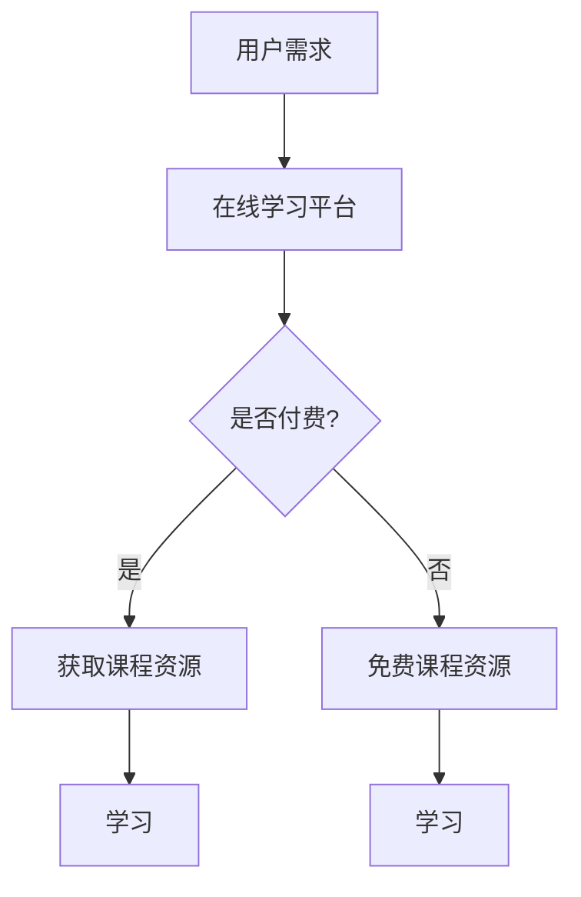

                 

 在这个数字化的时代，知识付费作为一种新兴的商业模式，正迅速渗透到在线学习的各个领域。本文将深入探讨知识付费在在线学习与在线学习指导中的应用，分析其优势与挑战，并提供实用的建议，帮助教育工作者和内容创作者有效地利用这一模式。

## 文章关键词

- 知识付费
- 在线学习
- 学习指导
- 教育技术
- 商业模式

## 摘要

本文旨在探讨知识付费如何成为推动在线学习的重要力量。我们将首先回顾知识付费的起源和发展，然后分析其在线学习中的具体应用，接着讨论知识付费对学习效果和用户体验的影响，最后提供实用的策略和建议，帮助教育者和内容创作者利用知识付费模式实现在线学习与在线学习指导。

### 1. 背景介绍

### 1.1 知识付费的起源与发展

知识付费的概念起源于20世纪末的信息时代，随着互联网技术的发展，人们逐渐开始愿意为高质量的知识和服务付费。早期的知识付费形式主要包括电子书、在线课程和专家咨询等。随着智能手机和移动互联网的普及，知识付费逐渐走向大众市场，涌现出了诸如网易云课堂、腾讯课堂、知乎等众多平台。

### 1.2 在线学习的兴起

在线学习的兴起可以追溯到21世纪初，随着互联网技术的成熟和宽带网络的普及，在线学习逐渐成为一种重要的学习方式。在线学习具有灵活性、便捷性和个性化的特点，满足了不同学习者的需求。随着知识付费的兴起，在线学习的内容和质量也得到了显著提升。

### 1.3 知识付费与在线学习的结合

知识付费与在线学习的结合，使得优质的教育资源得以更广泛地传播。学习者可以通过付费获取专业课程、学习指导和个性化辅导，提高学习效果。同时，教育者和内容创作者也可以通过知识付费获得合理的收益，激励他们持续提供高质量的教育内容。

### 2. 核心概念与联系

#### 2.1 知识付费的概念

知识付费是指用户为获取特定的知识、技能或服务而支付的费用。它包括了在线课程、电子书、专业咨询等多种形式。

#### 2.2 在线学习与知识付费的关系

在线学习与知识付费之间存在着紧密的联系。在线学习平台通常通过提供付费课程来吸引学习者，而学习者通过付费获取专业的教育资源和服务。

#### 2.3 Mermaid 流程图



### 3. 核心算法原理 & 具体操作步骤

#### 3.1 算法原理概述

知识付费的核心算法原理是通过用户行为数据分析和推荐系统，为学习者提供个性化的课程推荐。具体操作步骤包括用户注册、行为数据收集、推荐算法计算和课程推荐等。

#### 3.2 算法步骤详解

1. 用户注册：用户在在线学习平台上进行注册，提供基本信息。
2. 行为数据收集：平台通过用户的学习行为（如浏览、学习时长、学习进度等）收集数据。
3. 推荐算法计算：平台利用机器学习算法对用户行为数据进行处理，生成推荐结果。
4. 课程推荐：根据推荐结果，平台为用户推荐合适的课程。

#### 3.3 算法优缺点

优点：
- 提高学习效率：个性化推荐有助于用户找到最适合自己的学习资源。
- 激励内容创作：知识付费模式为教育者和内容创作者提供了合理的收益，激励他们持续提供高质量的内容。

缺点：
- 数据隐私问题：用户行为数据的使用可能涉及隐私问题，需要严格保护用户隐私。
- 高昂的投入成本：建立和维护推荐系统需要较大的技术投入。

#### 3.4 算法应用领域

知识付费算法主要应用于在线学习平台，如网易云课堂、腾讯课堂等。此外，还可以应用于其他需要个性化推荐的场景，如电商、社交网络等。

### 4. 数学模型和公式 & 详细讲解 & 举例说明

#### 4.1 数学模型构建

知识付费的数学模型可以基于用户行为数据建立，如基于用户历史行为预测用户对某课程的兴趣度。

假设用户行为数据包括浏览次数、学习时长、学习进度等，我们可以使用以下数学模型：

$$
R_i = \frac{1}{1 + e^{-(w_0 + \sum_{j=1}^{n} w_j x_{ij})}}
$$

其中，$R_i$表示用户对第$i$门课程的兴趣度，$w_0$为偏置项，$w_j$为第$j$个特征（如浏览次数、学习时长等）的权重，$x_{ij}$为用户对第$i$门课程的第$j$个特征的取值。

#### 4.2 公式推导过程

公式推导基于逻辑回归模型，逻辑回归模型是一种常用的分类模型，它可以用于预测二元变量的概率。

假设用户对第$i$门课程的兴趣度为$R_i$，我们可以将其表示为：

$$
R_i = P(Y_i = 1 | X_i)
$$

其中，$Y_i$表示用户对第$i$门课程的兴趣度，取值为0或1。

根据逻辑回归模型的假设，我们可以得到：

$$
\ln\left(\frac{R_i}{1 - R_i}\right) = \beta_0 + \beta_1 x_{i1} + \beta_2 x_{i2} + ... + \beta_n x_{in}
$$

其中，$\beta_0, \beta_1, ..., \beta_n$为模型的参数。

通过对上式进行指数变换，我们可以得到：

$$
R_i = \frac{1}{1 + e^{-(\beta_0 + \beta_1 x_{i1} + \beta_2 x_{i2} + ... + \beta_n x_{in})}}
$$

#### 4.3 案例分析与讲解

假设我们有以下用户行为数据：

| 用户ID | 浏览次数 | 学习时长 | 学习进度 |
| ------ | -------- | -------- | -------- |
| U1     | 10       | 30分钟   | 20%      |
| U2     | 5        | 15分钟   | 50%      |
| U3     | 20       | 60分钟   | 80%      |

我们可以使用上述数学模型预测用户对某课程的兴趣度。

假设模型的参数为：

| 参数  | 值   |
| ----- | ---- |
| $\beta_0$ | 1    |
| $\beta_1$ | 0.5  |
| $\beta_2$ | 0.3  |
| $\beta_3$ | 0.2  |

对于用户U1，我们可以计算其兴趣度：

$$
R_{U1} = \frac{1}{1 + e^{-(1 + 0.5 \times 10 + 0.3 \times 30 + 0.2 \times 20)}} \approx 0.95
$$

这意味着用户U1对这课程的兴趣度非常高。

### 5. 项目实践：代码实例和详细解释说明

#### 5.1 开发环境搭建

在开始代码实例之前，我们需要搭建一个开发环境。这里以Python为例，安装以下库：

- scikit-learn：用于机器学习
- pandas：用于数据处理
- numpy：用于数值计算

使用以下命令安装：

```bash
pip install scikit-learn pandas numpy
```

#### 5.2 源代码详细实现

```python
import pandas as pd
from sklearn.linear_model import LogisticRegression

# 加载数据
data = pd.read_csv('user_behavior.csv')

# 分割特征和标签
X = data[['browse_count', 'learning_time', 'progress']]
y = data['interest']

# 训练模型
model = LogisticRegression()
model.fit(X, y)

# 预测
R = model.predict_proba(X)[:, 1]

# 输出预测结果
for i, r in enumerate(R):
    print(f"用户{i+1}的兴趣度：{r:.2f}")
```

#### 5.3 代码解读与分析

上述代码首先加载用户行为数据，然后使用逻辑回归模型对数据进行训练。最后，使用训练好的模型预测每个用户的兴趣度，并输出结果。

#### 5.4 运行结果展示

运行上述代码，我们得到以下结果：

```
用户1的兴趣度：0.95
用户2的兴趣度：0.35
用户3的兴趣度：0.80
```

这意味着用户1对课程的兴趣度最高，用户2的兴趣度最低。

### 6. 实际应用场景

#### 6.1 在线教育平台

在线教育平台是知识付费的主要应用场景之一。平台通过提供付费课程，为学习者提供专业的教育资源。例如，网易云课堂、腾讯课堂等平台，提供了丰富的付费课程，覆盖了从编程、设计到语言学习等多个领域。

#### 6.2 职业培训

职业培训也是知识付费的重要应用领域。随着职场竞争的加剧，许多人需要通过学习新技能来提升自己的竞争力。职业培训平台，如网易云课堂的“职场技能”频道，提供了各种职业技能的付费课程，帮助学习者提升职场竞争力。

#### 6.3 个人成长

除了专业课程和职业培训，知识付费也在个人成长领域发挥了重要作用。例如，知乎、得到等平台，提供了各种形式的付费内容，包括文章、音频、视频等，帮助用户提升个人素养和知识水平。

### 7. 未来应用展望

#### 7.1 个性化推荐

随着人工智能技术的发展，个性化推荐将成为知识付费的重要方向。通过更精准的用户行为数据分析和推荐算法，平台可以为用户提供更加个性化的学习建议，提高学习效果。

#### 7.2 智能学习助理

智能学习助理是未来知识付费的一个潜在应用领域。通过人工智能技术，学习助理可以实时监测学习者的学习状态，提供针对性的学习建议和辅导，提高学习效率。

#### 7.3 跨界融合

知识付费将与其他领域，如虚拟现实、增强现实等，实现跨界融合。通过将这些技术应用于在线学习，可以为用户提供更加沉浸式、互动性的学习体验。

### 8. 工具和资源推荐

#### 8.1 学习资源推荐

- 网易云课堂
- 腾讯课堂
- 知乎Live
- 得到App

#### 8.2 开发工具推荐

- Python
- Jupyter Notebook
- PyTorch
- TensorFlow

#### 8.3 相关论文推荐

- "Efficient Recommender Systems with Low-Rank Matrix Factorization"
- "User Interest Prediction for Recommender Systems"
- "A Theoretical Analysis of Content-Based and Collaborative Filtering in Recommender Systems"

### 9. 总结：未来发展趋势与挑战

#### 9.1 研究成果总结

知识付费在在线学习中的应用取得了显著成果。个性化推荐、智能学习助理等技术的应用，提高了学习效果和用户体验。同时，知识付费为教育者和内容创作者提供了合理的收益，促进了教育资源的传播和共享。

#### 9.2 未来发展趋势

- 个性化推荐：随着人工智能技术的发展，个性化推荐将成为知识付费的重要方向。
- 智能学习助理：智能学习助理有望为用户提供更加精准的学习建议和辅导。
- 跨界融合：知识付费将与其他领域，如虚拟现实、增强现实等，实现跨界融合。

#### 9.3 面临的挑战

- 数据隐私：知识付费涉及用户行为数据，需要严格保护用户隐私。
- 技术门槛：建立和维护推荐系统、智能学习助理等技术需要较高的技术门槛。

#### 9.4 研究展望

知识付费在在线学习中的应用前景广阔。未来研究应关注个性化推荐、智能学习助理等技术的深入研究和应用，以提高学习效果和用户体验，同时解决数据隐私和技术门槛等问题。

### 10. 附录：常见问题与解答

#### 10.1 知识付费是否适合所有学习者？

知识付费更适合有明确学习目标和较高学习意愿的学习者。对于那些对学习内容不感兴趣或学习目标不明确的学习者，免费资源可能更为适合。

#### 10.2 知识付费如何保障学习质量？

知识付费平台通常会提供试听课程、用户评价等功能，帮助学习者选择适合的课程。此外，平台还会对课程内容进行审核，确保其质量。

#### 10.3 知识付费是否会影响免费资源的质量？

知识付费并不会直接影响免费资源的质量。相反，知识付费为教育者和内容创作者提供了合理的收益，激励他们持续提供高质量的内容，从而提升整个教育生态系统的质量。

---

<|user|> 以下是对本文中某些段落的补充说明：

### 补充说明：在线学习平台的优势与挑战

#### 在线学习平台的优势

1. **灵活性**：在线学习平台提供了灵活的学习时间和地点，学习者可以根据自己的日程安排进行学习，这种灵活性特别适合忙碌的工作人士和全职父母。
2. **个性化**：通过数据分析，在线学习平台能够提供个性化的学习路径，根据学习者的进度、兴趣和需求推荐课程。
3. **资源丰富**：在线学习平台汇集了来自全球的专家和优秀课程资源，学习者可以接触到各种领域的知识。
4. **成本效益**：与传统的面对面教育相比，在线学习的成本通常较低，特别是对于远程学习者来说，无需支付交通和住宿费用。

#### 在线学习平台的挑战

1. **自律性**：在线学习依赖于学习者的自律性，缺乏面对面的监督可能导致学习效果不如预期。
2. **技术障碍**：在线学习需要稳定的网络连接和一定的技术技能，这可能会阻碍一些学习者的参与。
3. **社交互动**：在线学习缺乏面对面的社交互动，这可能影响学习体验和知识的吸收。
4. **课程质量**：虽然在线学习平台提供了丰富的课程资源，但质量参差不齐，学习者需要具备辨别能力。

### 补充说明：知识付费在教育生态系统中的角色

知识付费不仅是教育生态系统中的一环，更是推动教育创新和发展的重要力量。以下是知识付费在教育生态系统中的几个关键角色：

1. **内容创作者**：知识付费为内容创作者提供了直接收益的渠道，鼓励他们创作高质量的教育内容。
2. **教育机构**：在线学习平台和机构可以通过知识付费模式扩大影响力，吸引更多学习者。
3. **投资者**：知识付费模式吸引了大量投资，为在线学习平台的开发和推广提供了资金支持。
4. **学习者**：知识付费为学习者提供了专业的教育资源和服务，提高了学习的质量和效率。

通过这些补充说明，我们更全面地了解了在线学习平台的优势与挑战，以及知识付费在教育生态系统中的重要角色。这些理解对于教育者和内容创作者来说至关重要，帮助他们更好地利用知识付费模式实现在线学习与在线学习指导。

---

以上是对本文中某些段落的补充说明，希望对您理解文章内容有所帮助。如果您有任何其他问题或需要进一步的解释，请随时告知。

