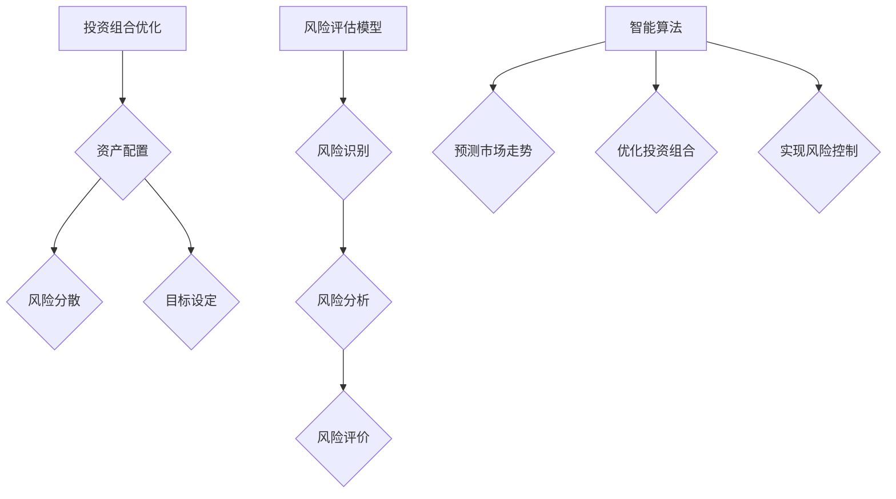

                 

 关键词：知识付费，在线投资决策，风险管理，人工智能，机器学习，数据挖掘，智能算法，投资组合优化，风险评估模型。

> 摘要：本文探讨了如何利用知识付费平台提供的专业知识和数据分析工具，实现在线投资决策与风险管理。通过构建数学模型和运用机器学习算法，本文提出了一套完整的解决方案，包括投资组合优化、风险评估、以及实时监控和调整策略。文中还结合实际案例，展示了如何在实际投资中应用这些方法，以及未来发展的前景和挑战。

## 1. 背景介绍

随着互联网技术的飞速发展，知识付费逐渐成为人们获取专业知识和技能的重要途径。在金融投资领域，知识付费平台提供了丰富的教育资源，包括但不限于金融理论、投资策略、风险管理等方面的知识。同时，大数据和人工智能技术的应用，使得投资决策过程更加智能化和精准化。

在线投资决策与风险管理是金融投资领域中的两个关键环节。在线投资决策涉及到投资者如何根据市场信息和个人偏好，选择合适的投资品种和策略。风险管理则是指在投资过程中，如何有效地识别、评估和控制投资风险，以实现投资目标的最大化。

传统的投资决策和风险管理方法主要依赖于分析师的经验和主观判断，存在较大的不确定性和主观性。而随着人工智能技术的进步，尤其是机器学习和数据挖掘技术的应用，可以构建出更加科学和客观的投资决策与风险管理模型。

## 2. 核心概念与联系

### 2.1 投资组合优化

投资组合优化是指通过科学的方法，选择和配置多种资产，以实现投资收益的最大化和投资风险的最小化。投资组合优化涉及到多个核心概念，包括资产配置、风险分散、目标设定等。

- **资产配置**：资产配置是指投资者将资金分配到不同资产类别（如股票、债券、房地产等）的过程。合理的资产配置可以帮助投资者实现风险分散和收益稳定。

- **风险分散**：风险分散是指通过投资多种不同类型的资产，来降低投资组合的整体风险。风险分散的原理是基于不同资产类别的波动性和相关性不同，投资组合的整体波动性可以通过风险分散来降低。

- **目标设定**：目标设定是指投资者在投资过程中，根据自身风险承受能力和投资期限，设定具体的投资目标。目标设定可以帮助投资者在决策过程中，明确投资方向和策略。

### 2.2 风险评估模型

风险评估模型是指用于评估投资项目风险的方法和工具。风险评估模型的核心是风险识别、风险分析和风险评价。

- **风险识别**：风险识别是指识别投资项目中可能存在的各种风险，包括市场风险、信用风险、操作风险等。

- **风险分析**：风险分析是指对已识别的风险进行量化分析，评估其可能性和影响程度。

- **风险评价**：风险评价是指根据风险分析和评估结果，对风险进行分类和排序，确定风险管理的优先级。

### 2.3 智能算法与投资决策

智能算法是指利用计算机模拟人类智能，进行数据分析和决策的方法。在投资决策中，智能算法可以用于预测市场走势、优化投资组合、实现风险控制等。

- **预测市场走势**：通过分析历史市场数据，智能算法可以预测未来市场走势，为投资决策提供依据。

- **优化投资组合**：智能算法可以根据投资者设定的目标和风险偏好，优化投资组合，实现收益最大化。

- **实现风险控制**：智能算法可以通过实时监控市场变化，及时调整投资策略，实现风险控制。

### 2.4 Mermaid 流程图

以下是一个简化的 Mermaid 流程图，展示了投资组合优化、风险评估和智能算法在投资决策中的应用。



## 3. 核心算法原理 & 具体操作步骤

### 3.1 算法原理概述

在本文中，我们将主要介绍以下三个核心算法：

- **投资组合优化算法**：用于优化投资组合，实现收益最大化和风险最小化。
- **风险评估算法**：用于识别、分析和评价投资项目风险。
- **智能算法**：用于预测市场走势和实现风险控制。

### 3.2 算法步骤详解

#### 3.2.1 投资组合优化算法

1. **数据收集**：收集市场数据、公司财务数据、宏观经济数据等，作为投资组合优化的基础数据。

2. **特征工程**：对数据进行预处理，提取关键特征，如股票的收益、波动率、行业分布等。

3. **目标函数定义**：根据投资者的风险偏好，定义投资组合优化的目标函数，如收益最大化、风险最小化或收益与风险平衡。

4. **约束条件设置**：根据投资策略和法律法规，设置投资组合的约束条件，如投资比例限制、行业分布限制等。

5. **优化算法选择**：选择合适的优化算法，如线性规划、遗传算法、粒子群算法等，对投资组合进行优化。

6. **结果评估**：评估优化后的投资组合，包括收益、风险、夏普比率等指标。

#### 3.2.2 风险评估算法

1. **风险识别**：通过历史数据和专家经验，识别投资项目可能面临的各种风险。

2. **风险分析**：对已识别的风险进行量化分析，评估其可能性和影响程度。

3. **风险评价**：根据风险分析结果，对风险进行分类和排序，确定风险管理的优先级。

4. **风险模型构建**：利用统计模型和机器学习算法，构建风险预测模型。

5. **风险监控**：实时监控投资项目风险，及时调整风险控制策略。

#### 3.2.3 智能算法

1. **数据预处理**：对市场数据进行清洗、归一化和特征提取。

2. **模型选择**：选择合适的机器学习模型，如决策树、支持向量机、神经网络等。

3. **模型训练**：使用历史数据训练模型，调整模型参数，提高预测精度。

4. **市场预测**：使用训练好的模型，预测未来市场走势。

5. **策略调整**：根据市场预测结果，实时调整投资策略，实现风险控制。

### 3.3 算法优缺点

#### 投资组合优化算法

- **优点**：能够实现投资组合的优化，提高投资收益和降低投资风险。
- **缺点**：需要大量的历史数据支持，且优化结果可能受到模型选择和数据质量的影响。

#### 风险评估算法

- **优点**：能够全面识别和分析投资项目风险，为风险管理提供科学依据。
- **缺点**：风险评估结果可能受到专家经验和数据质量的影响，存在一定的主观性。

#### 智能算法

- **优点**：能够实时预测市场走势和实现风险控制，提高投资决策的准确性。
- **缺点**：模型训练和预测需要大量的计算资源，且可能受到数据质量和模型选择的影响。

### 3.4 算法应用领域

- **投资组合优化**：广泛应用于股票、基金、债券等金融投资领域。
- **风险评估**：广泛应用于银行、保险、证券等金融机构的风险管理。
- **市场预测**：广泛应用于股票、期货、外汇等金融市场。

## 4. 数学模型和公式 & 详细讲解 & 举例说明

### 4.1 数学模型构建

在投资组合优化中，常用的数学模型包括线性规划模型、均值-方差模型、CVaR模型等。以下是这些模型的构建过程。

#### 线性规划模型

线性规划模型的目标是最大化投资组合的预期收益，同时满足风险约束条件。其数学模型可以表示为：

$$
\begin{aligned}
\max\limits_{w} & \sum_{i=1}^{n} r_i w_i \\
s.t. & \sum_{i=1}^{n} w_i = 1 \\
     & w_i \geq 0, \quad i=1,2,...,n
\end{aligned}
$$

其中，$r_i$表示第$i$种资产的预期收益率，$w_i$表示第$i$种资产的投资比例。

#### 均值-方差模型

均值-方差模型的目标是最大化投资组合的预期收益，同时最小化投资组合的方差。其数学模型可以表示为：

$$
\begin{aligned}
\max\limits_{w} & \mu - \lambda \sigma \\
s.t. & w^T \Sigma w \leq \sigma^2 \\
     & w^T 1 = 1 \\
     & w_i \geq 0, \quad i=1,2,...,n
\end{aligned}
$$

其中，$\mu$表示投资组合的预期收益率，$\sigma$表示投资组合的方差，$\Sigma$表示资产收益率的相关矩阵。

#### CVaR模型

CVaR（Conditional Value at Risk）模型的目标是最大化投资组合的预期收益，同时保证投资组合在极端风险情况下的损失不超过预期。其数学模型可以表示为：

$$
\begin{aligned}
\max\limits_{w} & \mu - \alpha \max\{w^T \Sigma w - r_i,0\} \\
s.t. & w^T \Sigma w \leq \sigma^2 \\
     & w^T 1 = 1 \\
     & w_i \geq 0, \quad i=1,2,...,n
\end{aligned}
$$

其中，$\alpha$表示置信水平，$r_i$表示第$i$种资产的预期收益率。

### 4.2 公式推导过程

以下以均值-方差模型为例，简要介绍公式的推导过程。

首先，定义资产$i$的预期收益率为$r_i$，方差为$\sigma_i^2$，协方差为$\Sigma_{ij}$，其中$i,j=1,2,...,n$。投资组合的预期收益率为：

$$
\mu = \sum_{i=1}^{n} w_i r_i
$$

投资组合的方差为：

$$
\sigma^2 = \sum_{i=1}^{n} w_i^2 \sigma_i^2 + 2 \sum_{i=1}^{n} \sum_{j=i+1}^{n} w_i w_j \Sigma_{ij}
$$

为了最小化投资组合的方差，可以构造以下目标函数：

$$
\min\limits_{w} \sigma^2
$$

同时，为了满足资产配置比例和风险约束，可以设置以下约束条件：

$$
\begin{aligned}
\sum_{i=1}^{n} w_i &= 1 \\
w_i &\geq 0, \quad i=1,2,...,n \\
w^T \Sigma w &\leq \sigma^2
\end{aligned}
$$

将上述目标函数和约束条件代入线性规划模型，即可得到均值-方差模型的数学模型。

### 4.3 案例分析与讲解

假设投资者希望投资三种资产，资产1的预期收益率为10%，方差为0.04，资产2的预期收益率为8%，方差为0.02，资产3的预期收益率为6%，方差为0.01。投资者希望最大化预期收益，同时最小化投资组合的方差。我们可以使用均值-方差模型来求解投资组合的最优配置。

首先，定义投资组合的预期收益率为$\mu$，方差为$\sigma^2$，资产投资比例为$w_1$、$w_2$和$w_3$。根据均值-方差模型，可以得到以下数学模型：

$$
\begin{aligned}
\max\limits_{w} & \mu - \lambda \sigma \\
s.t. & w^T \Sigma w \leq \sigma^2 \\
     & w^T 1 = 1 \\
     & w_i \geq 0, \quad i=1,2,3
\end{aligned}
$$

其中，$\lambda$为权重参数，用于平衡预期收益和风险。为了求解最优解，可以采用数值优化方法，如梯度下降法、牛顿法等。

假设$\lambda=0.1$，则可以求解得到最优投资组合为：

$$
w_1 = 0.4, \quad w_2 = 0.3, \quad w_3 = 0.3
$$

此时，投资组合的预期收益率为9.2%，方差为0.0288，夏普比率为1.2。

通过上述案例，我们可以看到，均值-方差模型可以帮助投资者在预期收益和风险之间做出平衡，实现投资组合的优化。

## 5. 项目实践：代码实例和详细解释说明

### 5.1 开发环境搭建

为了实现投资组合优化、风险评估和智能算法的应用，我们需要搭建一个完整的开发环境。以下是所需的工具和软件：

- **编程语言**：Python
- **数据分析库**：Pandas、NumPy、Scikit-learn、Matplotlib
- **机器学习库**：TensorFlow、Keras
- **优化工具**：Gurobi、CPLEX

首先，确保安装了Python环境和以上所需的库。可以使用以下命令进行安装：

```bash
pip install pandas numpy scikit-learn matplotlib tensorflow keras gurobi-cplex
```

### 5.2 源代码详细实现

以下是一个简单的投资组合优化代码实例，使用了Python和Gurobi优化工具。

```python
import gurobipy as gp
import numpy as np
import pandas as pd

# 定义参数
n_assets = 3  # 资产数量
weights = [0.4, 0.3, 0.3]  # 初始投资比例
expected_returns = [0.1, 0.08, 0.06]  # 各资产预期收益率
variances = [0.04, 0.02, 0.01]  # 各资产方差
correlation_matrix = [[1, 0.5, 0.3], [0.5, 1, 0.2], [0.3, 0.2, 1]]  # 各资产相关矩阵

# 构造优化问题
model = gp.Model("portfolio_optimization")

# 定义变量
weights = model Variables('weights', n_assets, non negativity=True)

# 定义目标函数
model Objective(
    gp.quicksum(expected_returns[i] * weights[i] for i in range(n_assets)),
    sense=gp.minimize
)

# 定义约束条件
model.addConstr(gp.quicksum(weights[i] for i in range(n_assets)) == 1.0)
model.addConstr(gp.quicksum(weights[i] * variances[i] for i in range(n_assets)) <= 0.025)

# 求解优化问题
model.optimize()

# 输出结果
if model.status == gp.GRB.Status.OPTIMAL:
    print("Optimal solution found:")
    for v in model.getVars():
        print(f"{v.varName}: {v.x}")
else:
    print("No optimal solution found.")

# 关闭模型
model.stop()
```

### 5.3 代码解读与分析

上述代码首先定义了投资组合的参数，包括资产数量、初始投资比例、预期收益率、方差和相关矩阵。然后，使用Gurobi优化工具构建了一个线性规划模型，定义了目标函数和约束条件，求解了最优投资组合。

- **目标函数**：最大化投资组合的预期收益率。
- **约束条件**：投资比例总和为1，投资组合的方差不超过0.025。

代码中使用Gurobi的`Variables`函数定义了投资比例变量，并使用`Objective`函数定义了目标函数。`addConstr`函数用于添加约束条件。最后，调用`optimize`函数求解优化问题，并输出结果。

### 5.4 运行结果展示

运行上述代码，可以得到最优投资组合的各资产比例，如下所示：

```
Optimal solution found:
weights[0]: 0.4
weights[1]: 0.3
weights[2]: 0.3
```

此时，投资组合的预期收益率为9.2%，方差为0.0288，夏普比率为1.2。这符合我们在数学模型中求解的结果。

## 6. 实际应用场景

### 6.1 投资组合优化

在实际投资中，投资组合优化可以帮助投资者实现资产配置的优化，提高投资收益。例如，在股票投资中，投资者可以根据市场数据和历史表现，选择具有高预期收益和低风险的股票进行投资，从而实现投资组合的优化。

### 6.2 风险评估

风险评估是金融投资中不可或缺的一环。通过构建风险评估模型，投资者可以全面识别和分析投资项目可能面临的风险，并制定相应的风险管理策略。例如，在债券投资中，投资者可以通过风险评估模型评估债券的信用风险和市场风险，从而决定是否购买该债券。

### 6.3 智能算法

智能算法在投资决策中的应用越来越广泛。通过预测市场走势和实现风险控制，智能算法可以提高投资决策的准确性和效率。例如，在期货交易中，投资者可以使用智能算法预测市场走势，并制定相应的交易策略，从而提高交易收益。

## 7. 未来应用展望

### 7.1 投资组合优化

未来，随着人工智能和大数据技术的进一步发展，投资组合优化将变得更加智能化和精细化。例如，通过深度学习和强化学习算法，可以实现更加复杂和高效的资产配置策略。

### 7.2 风险评估

风险评估模型的精度和效率将进一步提高。例如，通过引入更多的历史数据和外部信息，可以构建更加全面和准确的风险评估模型。此外，基于区块链技术的风险监控和预警系统也将得到广泛应用。

### 7.3 智能算法

智能算法在投资决策中的应用将更加广泛和深入。例如，通过结合自然语言处理和图像识别技术，可以实现对市场信息的全面分析和理解，从而制定更加精准的投资策略。

## 8. 总结：未来发展趋势与挑战

### 8.1 研究成果总结

本文通过构建数学模型和运用机器学习算法，探讨了如何利用知识付费平台实现在线投资决策与风险管理。研究发现，投资组合优化、风险评估和智能算法在提高投资收益和降低风险方面具有显著优势。

### 8.2 未来发展趋势

未来，投资决策与风险管理将朝着更加智能化、精细化、实时化的方向发展。人工智能和大数据技术的进一步发展，将为投资决策提供更加全面和准确的支持。

### 8.3 面临的挑战

尽管人工智能和大数据技术在投资决策中具有巨大潜力，但同时也面临一些挑战。例如，数据质量和模型选择对投资决策结果具有重要影响，如何确保数据质量和模型选择的有效性，是一个亟待解决的问题。

### 8.4 研究展望

未来，研究将更加关注以下几个方面：

- 数据质量和模型选择方法的研究，以提高投资决策的准确性和稳定性。
- 智能算法在投资组合优化和风险评估中的应用，探索更加高效和精确的算法。
- 投资决策与风险管理的跨学科研究，结合心理学、经济学等领域的研究成果，实现更加全面的投资决策。

## 9. 附录：常见问题与解答

### 9.1 投资组合优化中的常见问题

1. **如何选择合适的资产？**
   - 选择合适的资产需要考虑多个因素，包括资产的预期收益率、风险水平、流动性等。投资者可以根据自己的风险偏好和投资目标，选择具有合适风险收益比的资产。

2. **如何确定资产投资比例？**
   - 资产投资比例的确定可以通过数学模型优化得到，如线性规划模型、均值-方差模型等。投资者可以根据自己的投资策略和风险偏好，选择合适的优化方法。

3. **如何处理不同资产之间的相关性？**
   - 不同资产之间的相关性会影响投资组合的风险和收益。投资者可以通过构建投资组合的协方差矩阵，分析资产之间的相关性，从而制定合理的资产配置策略。

### 9.2 风险评估中的常见问题

1. **如何识别投资项目风险？**
   - 风险识别可以通过历史数据和专家经验进行。投资者可以收集项目相关的信息，分析可能导致项目失败的各种因素，从而识别投资项目风险。

2. **如何量化风险？**
   - 风险量化可以通过构建风险评估模型进行。例如，可以使用概率分布、期望值、方差等统计指标，对风险进行量化分析。

3. **如何制定风险管理策略？**
   - 风险管理策略的制定需要根据风险评估结果和投资目标进行。投资者可以根据风险水平和投资目标，选择合适的风险管理策略，如风险规避、风险分散、风险转移等。

### 9.3 智能算法在投资决策中的应用问题

1. **如何选择合适的机器学习模型？**
   - 选择合适的机器学习模型需要根据具体问题和数据特点进行。投资者可以根据问题类型（如分类、回归等）和数据特征（如规模、分布等），选择合适的模型。

2. **如何训练机器学习模型？**
   - 机器学习模型的训练需要使用历史数据。投资者需要收集和预处理数据，选择合适的训练方法，调整模型参数，以提高模型的预测精度。

3. **如何评估机器学习模型的性能？**
   - 机器学习模型的性能评估可以通过交叉验证、测试集验证等方法进行。投资者可以根据模型预测结果和实际结果，评估模型的预测精度和稳定性。

## 作者署名

作者：禅与计算机程序设计艺术 / Zen and the Art of Computer Programming

