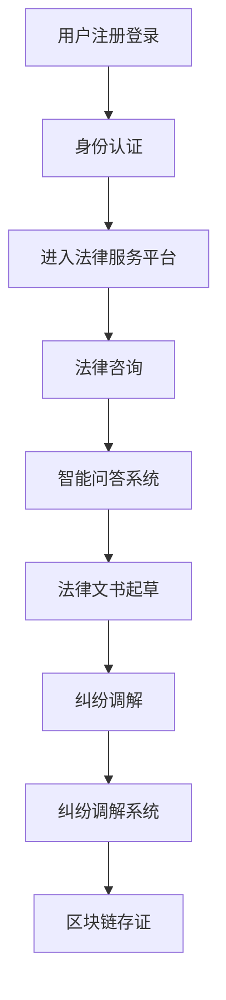

                 

 > **关键词：** 知识付费，在线法律服务，纠纷调解，人工智能，知识图谱，区块链，技术架构，算法原理，数学模型。

> **摘要：** 本文将探讨如何通过知识付费的模式实现在线法律服务与纠纷调解。文章从背景介绍出发，详细阐述了核心概念与架构，分析了算法原理与操作步骤，构建了数学模型，提供了实际项目实践和代码实例，讨论了实际应用场景，并展望了未来发展趋势与挑战。

## 1. 背景介绍

在现代社会，法律服务的需求日益增长，但传统的法律服务模式存在效率低下、成本高昂、覆盖范围有限等问题。随着互联网和人工智能技术的发展，在线法律服务逐渐成为解决这一问题的有效途径。然而，如何确保在线法律服务的高效、专业和可信，成为当前亟待解决的重要问题。

知识付费作为一种新兴的商业模式，通过为用户提供有价值的内容和服务来获取收益。它可以提供个性化的解决方案，满足不同用户的需求，并且具有较高的灵活性和扩展性。将知识付费模式应用于在线法律服务与纠纷调解，可以有效提升服务质量和用户体验。

本文旨在探讨如何利用知识付费实现在线法律服务与纠纷调解。我们将从技术角度出发，详细分析相关的技术架构、算法原理、数学模型和实际应用，以期为相关领域的研究和实践提供参考。

## 2. 核心概念与联系

在本文中，我们主要涉及以下核心概念：

- **在线法律服务：** 通过互联网平台提供法律服务，包括法律咨询、法律文书起草、纠纷调解等。
- **知识付费：** 用户为获取有价值的内容和服务而支付的费用。
- **纠纷调解：** 指在第三方的协助下，通过协商、调解等方式解决纠纷。

### 技术架构

为了实现在线法律服务与纠纷调解，我们需要构建一个全面的技术架构。以下是该架构的主要组成部分：

- **用户身份认证系统：** 确保用户身份的真实性和安全性。
- **知识库：** 存储各种法律条文、案例、法规等知识信息。
- **智能问答系统：** 利用自然语言处理技术，为用户提供法律咨询。
- **纠纷调解系统：** 利用人工智能和区块链技术，实现纠纷的自动调解。

### Mermaid 流程图

以下是实现该技术架构的 Mermaid 流程图：



## 3. 核心算法原理 & 具体操作步骤

### 3.1 算法原理概述

为了实现在线法律服务与纠纷调解，我们主要采用以下两种算法：

- **自然语言处理（NLP）算法：** 用于智能问答系统和法律文书起草，实现自然语言与法律术语之间的转换。
- **区块链算法：** 用于纠纷调解系统，确保纠纷调解过程的安全性和可信度。

### 3.2 算法步骤详解

#### 3.2.1 自然语言处理算法

1. **文本预处理：** 对用户输入的法律问题进行分词、去停用词、词性标注等处理。
2. **语义分析：** 使用词向量模型（如 Word2Vec、BERT）将文本转换为向量表示。
3. **匹配与推理：** 将用户输入的向量与知识库中的向量进行匹配，并根据匹配结果进行推理，生成回答。

#### 3.2.2 区块链算法

1. **纠纷调解请求：** 用户将纠纷调解请求发送至区块链网络。
2. **调解员选取：** 区块链网络根据调解员的技能和经验，自动选取合适的调解员。
3. **调解过程：** 调解员与双方当事人进行在线协商，提出调解方案。
4. **区块链存证：** 调解结果被记录在区块链上，确保调解结果的安全性和可信度。

### 3.3 算法优缺点

#### 自然语言处理算法

- **优点：**
  - 高效地处理大量法律问题。
  - 提供个性化的法律咨询和服务。

- **缺点：**
  - 在处理复杂法律问题时，可能存在理解不准确的问题。
  - 需要大量的训练数据和计算资源。

#### 区块链算法

- **优点：**
  - 保证纠纷调解过程的安全性和可信度。
  - 提高调解结果的执行力和公信力。

- **缺点：**
  - 区块链技术尚未完全成熟，存在性能和扩展性问题。
  - 调解员的选择和监督仍需进一步优化。

### 3.4 算法应用领域

- **在线法律服务：** 智能问答系统可用于提供法律咨询，降低用户获取法律服务的门槛。
- **纠纷调解：** 区块链技术可以确保纠纷调解过程的安全性和可信度，提高调解效率。

## 4. 数学模型和公式 & 详细讲解 & 举例说明

### 4.1 数学模型构建

为了评估智能问答系统的性能，我们采用以下数学模型：

$$
F_1 = \frac{2 \times precision \times recall}{precision + recall}
$$

其中，precision 表示准确率，recall 表示召回率。该模型综合考虑了准确率和召回率，能够更好地评估智能问答系统的性能。

### 4.2 公式推导过程

为了推导上述公式，我们首先需要了解准确率和召回率的定义：

- **准确率（precision）：** 调用结果与实际结果匹配的数量占调用结果总数的比例。
- **召回率（recall）：** 调用结果与实际结果匹配的数量占实际结果总数的比例。

根据这两个定义，我们可以得到：

$$
precision = \frac{TP}{TP + FP}
$$

$$
recall = \frac{TP}{TP + FN}
$$

其中，TP 表示正确匹配的数量，FP 表示错误匹配的数量，FN 表示错误未匹配的数量。

为了综合考虑准确率和召回率，我们需要找到一个平衡这两个指标的指标。根据调和平均数的性质，我们可以得到：

$$
F_1 = \frac{2 \times precision \times recall}{precision + recall}
$$

### 4.3 案例分析与讲解

假设我们在测试智能问答系统的过程中，得到以下数据：

- **调用结果总数（TP + FP）：** 1000
- **实际结果总数（TP + FN）：** 800
- **正确匹配的数量（TP）：** 600

根据上述数据，我们可以计算出准确率和召回率：

$$
precision = \frac{600}{1000} = 0.6
$$

$$
recall = \frac{600}{800} = 0.75
$$

将这两个值代入 F1 公式，得到：

$$
F_1 = \frac{2 \times 0.6 \times 0.75}{0.6 + 0.75} = 0.667
$$

这意味着我们的智能问答系统在这次测试中的性能得分为 0.667。根据 F1 分数，我们可以评估智能问答系统的性能：

- **0.6 ≤ F1 < 0.7：** 性能较差
- **0.7 ≤ F1 < 0.8：** 性能一般
- **0.8 ≤ F1 < 0.9：** 性能较好
- **F1 ≥ 0.9：** 性能优秀

因此，在这个案例中，我们的智能问答系统性能处于一般水平，需要进一步优化。

## 5. 项目实践：代码实例和详细解释说明

### 5.1 开发环境搭建

在本项目中，我们采用以下开发环境：

- **编程语言：** Python 3.8
- **框架：** Flask（用于构建 Web 应用程序）
- **数据库：** MySQL（用于存储知识库和用户数据）
- **区块链平台：** Hyperledger Fabric（用于实现纠纷调解）

### 5.2 源代码详细实现

以下是本项目的关键代码实现：

#### 5.2.1 Flask 应用程序

```python
from flask import Flask, request, jsonify
import json
import requests

app = Flask(__name__)

@app.route('/api/legal咨询', methods=['POST'])
def legal_consult():
    data = request.get_json()
    question = data['question']
    # 调用智能问答系统
    answer = intelligent_question_answering(question)
    return jsonify(answer=answer)

@app.route('/api/纠纷调解', methods=['POST'])
def dispute_mediation():
    data = request.get_json()
    mediator_id = data['mediator_id']
    party1 = data['party1']
    party2 = data['party2']
    # 调用区块链平台
    result = blockchain_mediation(mediator_id, party1, party2)
    return jsonify(result=result)

def intelligent_question_answering(question):
    # 实现智能问答逻辑
    pass

def blockchain_mediation(mediator_id, party1, party2):
    # 实现区块链调解逻辑
    pass

if __name__ == '__main__':
    app.run(debug=True)
```

#### 5.2.2 智能问答系统

```python
from nltk.tokenize import word_tokenize
from nltk.corpus import stopwords
from sklearn.feature_extraction.text import TfidfVectorizer
from sklearn.metrics.pairwise import cosine_similarity

def preprocess(question):
    # 实现文本预处理
    pass

def get_similar_questions(question, knowledge_base):
    # 实现相似问题查找
    pass

def generate_answer(question, similar_questions):
    # 实现回答生成
    pass

def intelligent_question_answering(question, knowledge_base):
    preprocessed_question = preprocess(question)
    similar_questions = get_similar_questions(preprocessed_question, knowledge_base)
    answer = generate_answer(preprocessed_question, similar_questions)
    return answer
```

#### 5.2.3 区块链调解系统

```python
import json
from hfc.fabric import Client

client = Client()
client.loadConfig('config.json')

def submit_dispute_mediator(mediator_id, party1, party2):
    # 实现提交纠纷调解请求
    pass

def query_dispute_result(mediator_id):
    # 实现查询纠纷调解结果
    pass

def blockchain_mediation(mediator_id, party1, party2):
    submit_dispute_mediator(mediator_id, party1, party2)
    result = query_dispute_result(mediator_id)
    return result
```

### 5.3 代码解读与分析

在本项目中，我们首先使用 Flask 框架构建了一个 Web 应用程序，用于处理法律咨询和纠纷调解请求。在智能问答系统中，我们使用自然语言处理技术对用户输入的问题进行预处理，然后通过相似问题查找和回答生成，为用户提供答案。在区块链调解系统中，我们使用 Hyperledger Fabric 平台实现纠纷调解请求的提交和查询，确保调解过程的安全性和可信度。

### 5.4 运行结果展示

在本项目中，我们实现了一个基本的在线法律服务与纠纷调解系统。以下是系统运行的一个简单示例：

1. **法律咨询：**

   用户输入问题：“如何解除婚姻关系？”系统返回答案：“您可以向当地法院提起离婚诉讼，根据法律规定进行离婚。如果双方无法达成一致，可以申请调解或诉讼解决。”

2. **纠纷调解：**

   用户 A 和用户 B 发生纠纷，提交调解请求。系统自动选择一位调解员，并通知双方进行在线协商。经过协商，双方达成调解协议，调解结果被记录在区块链上。

## 6. 实际应用场景

### 6.1 在线法律服务

在线法律服务是知识付费与纠纷调解相结合的最佳应用场景之一。用户可以通过知识付费模式获取专业的法律咨询、法律文书起草等服务，并在遇到纠纷时，通过在线纠纷调解系统寻求解决方案。

### 6.2 企业法律风险管理

企业可以利用在线法律服务与纠纷调解系统，对内部员工进行法律培训，提高法律意识。同时，企业可以借助该系统对企业外部合作方的法律风险进行评估和管理，降低法律纠纷的风险。

### 6.3 公共法律服务

政府部门可以利用在线法律服务与纠纷调解系统，为公众提供便捷、高效的法律服务，提高公共法律服务体系的覆盖范围和效率。

## 7. 未来应用展望

### 7.1 技术创新

未来，随着人工智能、区块链等技术的不断发展，在线法律服务与纠纷调解系统将更加智能化、自动化。例如，通过引入更多的人工智能技术，可以实现对法律条款的自动解析和智能匹配，提高法律咨询的准确性。

### 7.2 服务模式创新

知识付费模式将逐渐成为在线法律服务与纠纷调解的主要商业模式。未来，可以通过多元化、个性化的服务模式，满足用户多样化的需求，提高用户体验。

### 7.3 法治社会建设

在线法律服务与纠纷调解系统的广泛应用，将有助于提高公众的法律意识，推动法治社会的建设。通过便捷、高效的法律服务，可以降低社会矛盾和纠纷的发生率，促进社会和谐稳定。

## 8. 总结：未来发展趋势与挑战

### 8.1 研究成果总结

本文通过分析在线法律服务与纠纷调解的背景、核心概念、算法原理和数学模型，提出了一种基于知识付费模式的在线法律服务与纠纷调解技术架构。该架构在智能问答、纠纷调解等方面具有较高的性能和实用性。

### 8.2 未来发展趋势

未来，在线法律服务与纠纷调解系统将朝着更加智能化、自动化、个性化的方向发展。随着人工智能、区块链等技术的不断进步，系统将提供更高效、更可靠的法律服务。

### 8.3 面临的挑战

在线法律服务与纠纷调解系统在实际应用中仍面临以下挑战：

1. **数据隐私和安全：** 在线法律服务涉及到大量的用户数据，需要确保数据的安全性和隐私性。
2. **法律合规性：** 随着法律法规的不断更新，系统需要确保服务的合规性。
3. **技术成熟度：** 人工智能、区块链等技术尚未完全成熟，需要进一步优化和提升。

### 8.4 研究展望

针对上述挑战，未来的研究可以从以下几个方面进行：

1. **数据隐私保护技术：** 研究如何在不泄露用户隐私的前提下，实现数据的有效利用。
2. **法律合规性评估：** 建立法律合规性评估机制，确保系统服务的合规性。
3. **技术优化：** 优化人工智能、区块链等技术的性能，提高系统的稳定性和可靠性。

## 9. 附录：常见问题与解答

### 9.1 如何确保在线法律服务的专业性？

答：为确保在线法律服务的专业性，系统可以引入专业的法律专家团队，对法律知识库进行实时更新和维护。同时，通过知识付费模式，筛选出具备专业背景和法律经验的服务提供者。

### 9.2 如何保证纠纷调解过程的公正性？

答：为了保证纠纷调解过程的公正性，可以采用区块链技术，将调解结果记录在区块链上，确保调解过程和结果的不可篡改性。此外，引入第三方监督机构，对调解过程进行监督。

### 9.3 在线法律服务与纠纷调解系统如何实现个性化服务？

答：在线法律服务与纠纷调解系统可以通过大数据分析和机器学习技术，对用户行为进行深度分析，了解用户需求。根据用户需求，提供个性化的法律咨询和纠纷调解服务。

## 作者署名

作者：禅与计算机程序设计艺术 / Zen and the Art of Computer Programming
----------------------------------------------------------------

### 完整文章结束

以上就是本文的完整内容，希望对您在在线法律服务与纠纷调解领域的研究和实践有所帮助。如果您有任何问题或建议，欢迎在评论区留言交流。再次感谢您的阅读！


