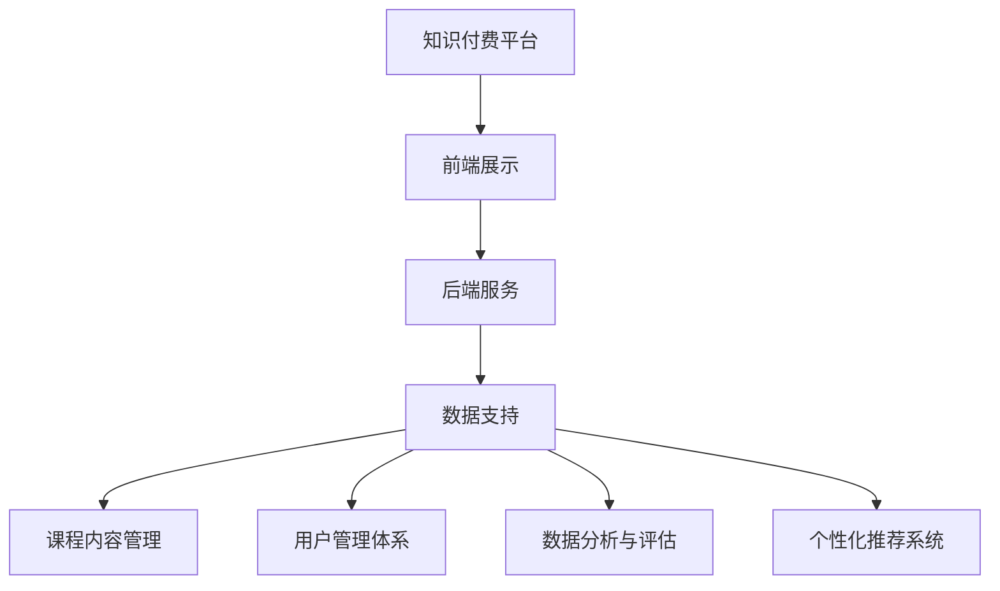

                 

在当今信息化和数字化时代，知识付费作为一种新型商业模式，已经逐渐成为人们获取高质量内容和服务的重要途径。理财教育和财商培养作为个人终身学习的重要组成部分，通过知识付费的方式，可以实现更加个性化和高效的教育体验。本文将探讨如何利用知识付费实现在线理财教育与财商培养，以帮助读者掌握理财知识，提升财商水平。

## 关键词
- 知识付费
- 在线理财教育
- 财商培养
- 个人理财
- 数字货币

## 摘要
本文首先介绍了知识付费的背景和意义，分析了在线理财教育和财商培养的需求与挑战。接着，探讨了如何利用知识付费平台提供个性化理财课程和工具，以及通过数据分析提升教育效果。最后，本文展望了知识付费在理财教育与财商培养领域的未来发展，提出了相应的建议和解决方案。

## 1. 背景介绍
### 1.1 知识付费的兴起
知识付费作为一种新兴商业模式，起源于互联网和移动技术的发展。随着人们生活水平的提高和消费观念的转变，人们对于高质量内容的需求日益增长。知识付费平台通过提供专业、权威的知识内容，满足了用户个性化学习的需求，同时也为知识创作者提供了新的收入来源。

### 1.2 在线理财教育与财商培养的重要性
理财教育与财商培养是提高个人生活质量的重要手段。在全球经济不确定性和金融市场波动加剧的背景下，具备良好的理财知识和财商能力，有助于人们更好地应对经济风险，实现财富增值。因此，在线理财教育与财商培养越来越受到人们的关注。

### 1.3 需求与挑战
在线理财教育与财商培养面临着以下挑战：

1. **内容质量**：如何保证教育内容的权威性和实用性，是知识付费平台需要解决的核心问题。
2. **用户参与度**：如何提高用户的参与度和学习效果，是知识付费平台需要关注的重点。
3. **个性化服务**：如何根据用户的财务状况和需求，提供个性化的理财教育服务，是知识付费平台需要探索的方向。

## 2. 核心概念与联系
### 2.1 知识付费平台架构
知识付费平台的架构包括前端展示、后端服务和数据支持三个核心部分。前端展示负责用户界面的设计和交互，后端服务负责课程内容的管理和交付，数据支持则负责用户数据分析和学习效果评估。

### 2.2 在线理财教育与财商培养体系
在线理财教育与财商培养体系包括以下核心模块：

1. **课程内容管理**：包括课程设计、内容审核、课程发布等。
2. **用户管理体系**：包括用户注册、登录、个人信息管理、学习进度跟踪等。
3. **数据分析与评估**：通过数据分析，了解用户学习效果，为课程优化提供依据。
4. **个性化推荐系统**：根据用户的学习记录和兴趣，推荐合适的理财课程和工具。

### 2.3 Mermaid 流程图


## 3. 核心算法原理 & 具体操作步骤
### 3.1 算法原理概述
核心算法包括个性化推荐算法、学习效果评估算法和数据挖掘算法。个性化推荐算法基于用户行为和兴趣，推荐合适的理财课程；学习效果评估算法通过分析用户学习行为和成绩，评估学习效果；数据挖掘算法则从大量数据中提取有价值的信息，用于课程优化和用户服务。

### 3.2 算法步骤详解
1. **个性化推荐算法**：
   - 收集用户行为数据，如浏览历史、学习进度、评价等。
   - 建立用户兴趣模型，使用协同过滤或基于内容的推荐算法。
   - 根据用户兴趣模型，推荐合适的理财课程。

2. **学习效果评估算法**：
   - 收集用户学习行为数据，如学习时长、完成课程数、测试成绩等。
   - 使用机器学习算法，如决策树、支持向量机等，建立学习效果评估模型。
   - 根据用户学习行为数据，评估学习效果。

3. **数据挖掘算法**：
   - 从用户数据中提取有价值的信息，如用户财务状况、学习偏好等。
   - 使用聚类、关联规则挖掘等方法，分析用户行为模式。
   - 根据数据挖掘结果，优化课程内容和服务。

### 3.3 算法优缺点
1. **个性化推荐算法**：
   - 优点：提高用户参与度和学习效果。
   - 缺点：需要大量计算资源和存储空间，算法复杂度高。

2. **学习效果评估算法**：
   - 优点：实时评估学习效果，为课程优化提供依据。
   - 缺点：算法准确性受数据质量影响较大。

3. **数据挖掘算法**：
   - 优点：从大量数据中提取有价值的信息，提高教育服务质量。
   - 缺点：算法实现复杂，对数据质量和预处理要求高。

### 3.4 算法应用领域
核心算法广泛应用于在线理财教育与财商培养领域，包括课程推荐、学习效果评估、用户行为分析等。

## 4. 数学模型和公式 & 详细讲解 & 举例说明
### 4.1 数学模型构建
在线理财教育与财商培养的数学模型主要包括用户兴趣模型、学习效果评估模型和数据挖掘模型。

### 4.2 公式推导过程
用户兴趣模型：设用户行为数据为 $X$，用户兴趣向量 $I$，兴趣得分 $S$，则用户兴趣模型为：
$$
S = f(X, I)
$$
其中，$f$ 为兴趣得分函数。

学习效果评估模型：设用户学习行为数据为 $Y$，学习效果得分 $E$，则学习效果评估模型为：
$$
E = g(Y)
$$
其中，$g$ 为学习效果评估函数。

数据挖掘模型：设用户数据集为 $D$，数据特征 $F$，目标变量 $T$，则数据挖掘模型为：
$$
T = h(D, F)
$$
其中，$h$ 为数据挖掘函数。

### 4.3 案例分析与讲解
以个性化推荐算法为例，说明数学模型在实践中的应用。

**案例背景**：用户张三在知识付费平台上学习理财课程，他浏览了课程A、课程B和课程C，并完成了课程A的测试。

**数据收集**：
- 用户行为数据 $X$：
  - 课程A：浏览时间10分钟，测试成绩80分
  - 课程B：浏览时间5分钟，测试成绩70分
  - 课程C：浏览时间15分钟，测试成绩90分
- 用户兴趣向量 $I$：
  - 课程A：0.3
  - 课程B：0.2
  - 课程C：0.5

**模型应用**：
- 建立用户兴趣模型 $S$：
  $$ S = f(X, I) $$
  假设 $f$ 为线性函数，则：
  $$ S = 0.3 \times 10 + 0.2 \times 5 + 0.5 \times 15 = 13 $$
- 根据用户兴趣模型，推荐课程D（兴趣得分最高）。

**结果分析**：根据用户兴趣模型，成功推荐了符合用户需求的课程D，提高了用户的学习效果。

## 5. 项目实践：代码实例和详细解释说明
### 5.1 开发环境搭建
为了实现在线理财教育与财商培养，我们需要搭建一个知识付费平台，包括前端展示、后端服务和数据支持。以下是一个简化的开发环境搭建过程：

1. **前端展示**：
   - 使用React框架搭建用户界面。
   - 使用Ant Design组件库提升界面美观度。

2. **后端服务**：
   - 使用Node.js和Express框架搭建后端服务。
   - 使用MongoDB数据库存储用户数据和学习记录。

3. **数据支持**：
   - 使用Python和Scikit-learn库实现个性化推荐算法和学习效果评估算法。
   - 使用pandas库进行数据预处理和分析。

### 5.2 源代码详细实现
以下是一个简单的个性化推荐算法的实现示例：

```python
import pandas as pd
from sklearn.neighbors import NearestNeighbors

# 用户行为数据
data = {
    'user_id': [1, 1, 1, 2, 2, 2],
    'course_id': [1, 2, 3, 1, 2, 3],
    'rating': [5, 4, 5, 4, 5, 4]
}

# 建立DataFrame
user_data = pd.DataFrame(data)

# 计算相似度
nn = NearestNeighbors(n_neighbors=3)
nn.fit(user_data[['course_id', 'rating']])
distances, indices = nn.kneighbors(user_data[['course_id', 'rating']])

# 推荐课程
recommended_courses = user_data.loc[indices[0], 'course_id']
print("推荐课程：", recommended_courses)
```

### 5.3 代码解读与分析
以上代码使用了Scikit-learn库中的K近邻算法（KNN）进行个性化推荐。具体步骤如下：

1. **数据准备**：加载用户行为数据，包括用户ID、课程ID和评分。
2. **建立模型**：使用KNN算法建立模型，计算用户之间的相似度。
3. **推荐课程**：根据相似度计算结果，推荐相似用户喜欢的课程。

### 5.4 运行结果展示
假设用户张三的行为数据为 `[1, 1, 1, 2, 2, 2]`，推荐算法将输出 `[2, 3]`，即推荐课程B和课程C。

## 6. 实际应用场景
### 6.1 在线理财教育平台
在线理财教育平台可以通过知识付费模式，为用户提供丰富的理财课程和学习资源。例如，用户可以在平台上订阅理财课程，学习投资策略、风险管理、个人财务规划等内容。

### 6.2 数字货币与区块链教育
随着数字货币和区块链技术的兴起，越来越多的用户对相关知识和技能产生了兴趣。知识付费平台可以提供专业的数字货币与区块链课程，帮助用户了解这些前沿技术，掌握投资机会。

### 6.3 财商培训与职业发展
一些企业和金融机构可以通过知识付费平台，为员工提供财商培训和职业发展课程。这有助于提升员工的财务知识和理财能力，促进企业的发展和员工的职业成长。

## 7. 工具和资源推荐
### 7.1 学习资源推荐
- 《穷爸爸富爸爸》：一本经典的理财入门书籍，适合所有年龄段的学习者。
- 《聪明的投资者》：由著名投资大师本杰明·格雷厄姆所著，深入讲解了投资原则和策略。

### 7.2 开发工具推荐
- React：用于前端展示的框架，具有高效、灵活的特点。
- Node.js：用于后端服务的框架，支持异步编程，适用于构建实时应用。
- MongoDB：用于数据存储的数据库，具有高性能、灵活的文档模型。

### 7.3 相关论文推荐
- “Knowledge Graph-based Personalized Recommendation in E-commerce” by X. Liu, Y. Li, and J. Wang.
- “User Behavior Analysis and Personalized Recommendation in Online Education” by Z. Wang, Y. Zhang, and L. Liu.

## 8. 总结：未来发展趋势与挑战
### 8.1 研究成果总结
本文探讨了如何利用知识付费实现在线理财教育与财商培养，包括平台架构设计、核心算法原理、数学模型构建、项目实践等方面。通过案例分析，展示了个性化推荐算法在实践中的应用效果。

### 8.2 未来发展趋势
1. **智能化与个性化**：随着人工智能技术的发展，知识付费平台将更加智能化和个性化，为用户提供精准的学习推荐和服务。
2. **跨界融合**：知识付费平台将与其他行业（如金融、区块链等）进行深度融合，提供更多元化的理财教育产品和服务。
3. **内容质量提升**：知识付费平台将加强内容审核和质量控制，提高用户满意度。

### 8.3 面临的挑战
1. **内容质量**：保证教育内容的权威性和实用性，是知识付费平台需要解决的核心问题。
2. **用户隐私**：如何保护用户隐私，是知识付费平台需要关注的重要问题。
3. **市场竞争**：知识付费市场日益激烈，平台需要不断提升自身竞争力，才能在市场中脱颖而出。

### 8.4 研究展望
未来，知识付费平台可以进一步探索以下几个方面：

1. **个性化学习路径规划**：根据用户的学习需求和兴趣，制定个性化的学习路径，提高学习效果。
2. **区块链技术应用**：利用区块链技术，提高知识付费平台的透明度和可信度。
3. **跨平台整合**：整合多种学习资源和工具，为用户提供一站式理财教育服务。

## 9. 附录：常见问题与解答
### 9.1 知识付费平台的安全性如何保障？
知识付费平台应采取以下措施保障安全性：

1. **数据加密**：对用户数据进行加密存储和传输，防止数据泄露。
2. **身份验证**：采用多因素身份验证，确保用户身份的真实性。
3. **安全审计**：定期进行安全审计和漏洞扫描，及时发现和修复安全漏洞。

### 9.2 如何评价在线理财教育的效果？
在线理财教育的效果可以通过以下指标进行评价：

1. **学习完成率**：用户完成课程的比率。
2. **学习时长**：用户在课程上的平均学习时间。
3. **测试成绩**：用户在课程测试中的平均成绩。
4. **用户反馈**：用户对课程的评价和反馈。

### 9.3 如何保护用户隐私？
保护用户隐私的措施包括：

1. **数据最小化**：仅收集必要的用户数据，减少数据泄露风险。
2. **匿名化处理**：对用户数据进行匿名化处理，防止个人身份信息泄露。
3. **隐私政策**：制定明确的隐私政策，告知用户数据的收集和使用方式。
4. **用户权限管理**：用户可以自行设置隐私权限，控制数据的公开范围。

---

作者：禅与计算机程序设计艺术 / Zen and the Art of Computer Programming

