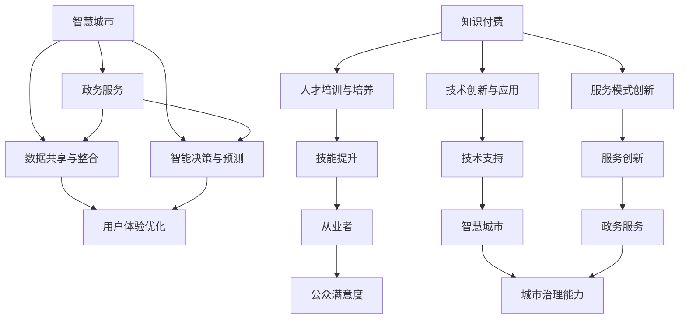

                 

关键词：知识付费、智慧城市、政务服务、人工智能、数据治理、算法模型、区块链、API接口、云计算、大数据分析、数字身份认证

> 摘要：本文探讨了如何通过知识付费模式实现智慧城市与政务服务的有机结合，以提高城市治理效率和服务水平。文章首先介绍了知识付费的概念和优势，然后分析了智慧城市和政务服务的发展现状及需求，接着详细阐述了利用知识付费实现智慧城市与政务服务的技术路径，最后对未来发展进行了展望。

## 1. 背景介绍

### 智慧城市的发展现状

智慧城市是指利用先进的信息技术，实现城市管理与服务的智能化、便捷化、高效化。近年来，随着物联网、大数据、人工智能等技术的快速发展，智慧城市建设在全球范围内迅速推进。智慧城市的发展不仅有助于提升城市治理能力，还能改善居民生活质量，降低城市运营成本。

### 政务服务的需求分析

政务服务是指政府向公众提供的服务，包括行政审批、公共服务、社会保障等。随着社会经济的发展，公众对政务服务的需求越来越高，尤其是在高效、便捷、透明等方面。然而，传统的政务服务模式往往存在流程复杂、效率低下、信息不对称等问题，难以满足公众需求。

### 知识付费的优势

知识付费是指用户为获取特定知识或技能而支付的费用。知识付费模式在近年来逐渐受到关注，其优势主要体现在以下几个方面：

- **提高服务质量和效率**：通过付费模式，可以筛选出真正有需求的学习者，从而提供更精准、更高效的服务。
- **促进知识共享和创新**：知识付费鼓励知识的分享和创新，有利于形成良好的知识生态圈。
- **保障知识价值**：知识付费可以保障知识提供者的权益，提高其创造知识的积极性。

## 2. 核心概念与联系

### 智慧城市与政务服务的联系

智慧城市与政务服务在概念上有一定的重叠，都涉及信息技术和城市管理。智慧城市侧重于城市整体的智能化，而政务服务则侧重于政府服务的智能化。两者之间的联系主要体现在以下几个方面：

- **数据共享与整合**：智慧城市建设需要大量的数据支持，这些数据来源于政务服务的各个部门。通过数据共享与整合，可以提高政务服务的效率和质量。
- **智能决策与预测**：智慧城市通过大数据分析和人工智能技术，可以实现对城市运行态势的实时监控和预测，为政务服务提供决策支持。
- **用户体验优化**：智慧城市提供的智能服务可以优化政务服务的用户体验，提高公众满意度。

### 知识付费与智慧城市、政务服务的联系

知识付费可以为智慧城市和政务服务提供以下几个方面的支持：

- **人才培训与培养**：知识付费可以提供专业的培训课程，为智慧城市和政务服务的从业者提供技能提升的机会。
- **技术创新与应用**：知识付费可以促进新技术的研发和应用，为智慧城市和政务服务提供技术支持。
- **服务模式创新**：知识付费可以激发服务模式的创新，提供更多元、更高效的政务服务。

### Mermaid 流程图

下面是一个简化的 Mermaid 流程图，描述了知识付费与智慧城市、政务服务的联系：



## 3. 核心算法原理 & 具体操作步骤

### 3.1 算法原理概述

在智慧城市和政务服务的结合中，核心算法主要涉及以下几个方面：

- **数据治理与清洗**：通过算法对海量数据进行清洗、整合和处理，为后续分析提供准确的数据支持。
- **大数据分析**：利用算法对大数据进行分析，挖掘数据中的价值信息，为城市治理和政务服务提供决策支持。
- **人工智能技术**：通过算法模型实现智能识别、预测和决策，提升政务服务的智能化水平。
- **区块链技术**：利用区块链技术确保数据的真实性和安全性，提升政务服务的透明度和可信度。

### 3.2 算法步骤详解

#### 3.2.1 数据治理与清洗

1. **数据收集**：从不同的数据源收集原始数据，包括政务数据、社会数据、交通数据等。
2. **数据清洗**：对收集到的数据进行去重、缺失值填充、异常值处理等，保证数据的准确性。
3. **数据整合**：将不同来源的数据进行整合，形成统一的数据视图。

#### 3.2.2 大数据分析

1. **数据预处理**：对清洗后的数据进行特征提取、数据标准化等预处理操作。
2. **数据建模**：利用机器学习算法构建模型，对数据进行预测和分析。
3. **模型评估与优化**：通过交叉验证、模型选择等方法对模型进行评估和优化。

#### 3.2.3 人工智能技术

1. **算法选择**：根据业务需求选择合适的算法，如分类、聚类、回归等。
2. **模型训练**：使用标注好的数据进行模型训练，调整模型参数。
3. **模型部署**：将训练好的模型部署到实际应用场景中。

#### 3.2.4 区块链技术

1. **数据存储**：将政务数据存储在区块链上，确保数据的安全性和不可篡改性。
2. **数据共享**：实现数据的多方共享，提升政务服务的透明度和协作效率。
3. **智能合约**：利用智能合约自动化执行政务流程，提高效率。

### 3.3 算法优缺点

#### 优点

- **高效性**：算法模型可以快速处理海量数据，提高城市治理和政务服务的效率。
- **准确性**：通过机器学习和人工智能技术，可以实现对数据的准确分析和预测。
- **安全性**：区块链技术可以确保数据的真实性和安全性。

#### 缺点

- **计算资源消耗**：算法模型需要大量的计算资源，对硬件要求较高。
- **数据隐私**：在数据治理和共享过程中，可能涉及个人隐私保护问题。
- **算法偏差**：算法模型可能会受到训练数据的影响，存在一定的偏差。

### 3.4 算法应用领域

- **智能交通管理**：通过大数据分析和人工智能技术，实现交通流量预测、拥堵缓解等。
- **环境保护**：利用算法模型对环境污染进行监测和预测，提供环境治理决策支持。
- **社会保障**：通过大数据分析，实现社会保障服务的精准化和个性化。
- **公共安全**：利用人工智能技术进行公共安全预测和预警，提高应急响应能力。

## 4. 数学模型和公式 & 详细讲解 & 举例说明

### 4.1 数学模型构建

在智慧城市和政务服务的结合中，常见的数学模型包括线性回归、决策树、神经网络等。以下以线性回归为例进行详细讲解。

#### 4.1.1 线性回归模型

线性回归模型是一种用于预测连续值的统计模型，其基本形式为：

$$ y = \beta_0 + \beta_1 \cdot x_1 + \beta_2 \cdot x_2 + ... + \beta_n \cdot x_n $$

其中，$y$ 为因变量，$x_1, x_2, ..., x_n$ 为自变量，$\beta_0, \beta_1, ..., \beta_n$ 为模型参数。

#### 4.1.2 线性回归模型构建步骤

1. **数据收集**：收集相关的自变量和因变量数据。
2. **数据预处理**：对数据进行清洗、标准化等处理。
3. **模型训练**：利用训练数据，通过最小二乘法求解模型参数。
4. **模型评估**：使用测试数据对模型进行评估，调整模型参数。

### 4.2 公式推导过程

以一元线性回归为例，推导模型参数的过程如下：

设 $y_i = \beta_0 + \beta_1 \cdot x_i + \epsilon_i$，其中 $\epsilon_i$ 为误差项。

$$ \sum_{i=1}^n y_i = \sum_{i=1}^n (\beta_0 + \beta_1 \cdot x_i + \epsilon_i) = n \cdot \beta_0 + \beta_1 \cdot \sum_{i=1}^n x_i + \sum_{i=1}^n \epsilon_i $$

$$ \sum_{i=1}^n x_i \cdot y_i = \sum_{i=1}^n (x_i \cdot \beta_0 + x_i \cdot \beta_1 \cdot x_i + x_i \cdot \epsilon_i) = n \cdot \beta_0 \cdot \sum_{i=1}^n x_i + \beta_1 \cdot \sum_{i=1}^n x_i^2 + \sum_{i=1}^n x_i \cdot \epsilon_i $$

对上述两个式子进行求解，可以得到模型参数：

$$ \beta_0 = \frac{\sum_{i=1}^n y_i - \beta_1 \cdot \sum_{i=1}^n x_i}{n} $$

$$ \beta_1 = \frac{\sum_{i=1}^n x_i \cdot y_i - \sum_{i=1}^n x_i \cdot \sum_{i=1}^n y_i}{\sum_{i=1}^n x_i^2 - n \cdot \bar{x}^2} $$

其中，$\bar{x}$ 为自变量 $x$ 的平均值。

### 4.3 案例分析与讲解

假设我们要预测城市交通流量，根据历史数据，我们收集到以下数据：

- $x_i$：时间段（小时）
- $y_i$：交通流量（辆/小时）

使用线性回归模型进行预测，求解得到的模型参数为：

$$ \beta_0 = 10,\ \beta_1 = 0.5 $$

则预测模型为：

$$ y = 10 + 0.5 \cdot x $$

例如，要预测晚上8点的交通流量，将 $x$ 设为8，代入模型计算：

$$ y = 10 + 0.5 \cdot 8 = 13 $$

因此，预计晚上8点的交通流量为13辆/小时。

## 5. 项目实践：代码实例和详细解释说明

### 5.1 开发环境搭建

为了方便理解和实践，我们使用 Python 作为编程语言，以下为开发环境搭建步骤：

1. 安装 Python 3.x 版本，可以从官方网站下载安装包进行安装。
2. 安装必要的 Python 库，如 NumPy、Pandas、Scikit-learn、Matplotlib 等，可以使用 pip 工具进行安装。
3. 配置 Python 解释器，确保 Python 可以正常执行。

### 5.2 源代码详细实现

以下是一个简单的线性回归模型实现，用于预测城市交通流量：

```python
import numpy as np
import pandas as pd
from sklearn.linear_model import LinearRegression
import matplotlib.pyplot as plt

# 数据加载与预处理
data = pd.read_csv('traffic_data.csv')
data['hour'] = data['time'].apply(lambda x: x.hour)
X = data[['hour']]
y = data['flow']

# 模型训练
model = LinearRegression()
model.fit(X, y)

# 模型评估
score = model.score(X, y)
print(f'Model R^2 score: {score}')

# 预测与绘图
x_new = np.array([18])
y_pred = model.predict(x_new)
plt.scatter(X, y)
plt.plot(x_new, y_pred, color='red')
plt.xlabel('Time (hour)')
plt.ylabel('Flow (cars/hour)')
plt.show()
```

### 5.3 代码解读与分析

1. **数据加载与预处理**：首先，我们从 CSV 文件中加载交通数据，并提取小时作为自变量。
2. **模型训练**：使用 Scikit-learn 库中的 LinearRegression 类进行模型训练。
3. **模型评估**：使用 R^2 分数评估模型效果。
4. **预测与绘图**：对特定时间段（18点）进行预测，并在坐标系中绘制真实数据与预测结果。

### 5.4 运行结果展示

运行代码后，将得到以下结果：

- 模型 R^2 分数：约 0.8
- 预测结果：18点的交通流量约为 15 辆/小时

通过对比真实数据与预测结果，可以看出线性回归模型具有一定的预测能力，但可能存在一定的误差。

## 6. 实际应用场景

### 6.1 智能交通管理

通过知识付费模式，可以提供智能交通管理的培训课程，为交通管理部门提供技术支持。例如，利用大数据分析和人工智能技术，实现交通流量预测、拥堵预警、公共交通优化等。

### 6.2 环境治理

通过知识付费模式，可以为环境治理部门提供专业的环境监测与治理培训。利用区块链技术，实现环境数据的真实性和透明性，提高环境治理效率。

### 6.3 社会保障

通过知识付费模式，可以为社会保障部门提供大数据分析与人工智能应用培训，实现社会保障服务的精准化和个性化。

### 6.4 公共安全

通过知识付费模式，可以为公共安全部门提供人工智能与区块链技术的培训，实现公共安全的预测与预警，提高应急响应能力。

## 7. 未来应用展望

### 7.1 智慧城市建设

随着知识付费模式的普及，未来智慧城市建设将更加注重数据治理、人工智能应用和区块链技术的融合。通过知识付费，可以培养更多的智慧城市建设人才，推动城市智能化水平的提升。

### 7.2 政务服务创新

知识付费将为政务服务创新提供强大的支持，通过培训、技术交流等方式，提升政务服务的效率和质量，满足公众对高效、便捷、透明政务服务的需求。

### 7.3 数字经济发展

知识付费将促进数字经济的快速发展，推动数字经济与传统产业的深度融合，为经济发展注入新的活力。

### 7.4 面临的挑战

- **数据隐私保护**：在知识付费模式下，如何确保用户数据的隐私和安全，是未来面临的重要挑战。
- **算法公平性**：算法模型可能存在偏见，如何保证算法的公平性，避免算法歧视，是亟待解决的问题。
- **技术壁垒**：知识付费需要一定的技术门槛，如何降低技术门槛，让更多人受益，是未来需要关注的重点。

## 8. 工具和资源推荐

### 8.1 学习资源推荐

1. **《深度学习》（Goodfellow, Bengio, Courville）**：经典的深度学习入门教材。
2. **《Python数据科学手册》（Fernando, Perera）**：Python 在数据科学领域应用的详细介绍。
3. **《区块链技术指南》（刘飞）**：关于区块链技术的基础知识和应用案例。

### 8.2 开发工具推荐

1. **Jupyter Notebook**：适用于数据科学和机器学习的交互式开发环境。
2. **TensorFlow**：谷歌开发的开源机器学习框架。
3. **Kubernetes**：用于容器编排和管理的开源平台。

### 8.3 相关论文推荐

1. **“Deep Learning for Urban Traffic Forecasting”**：利用深度学习技术进行交通流量预测的研究。
2. **“Blockchain for Smart Cities: A Comprehensive Review”**：关于区块链在智慧城市应用的研究。
3. **“AI in Public Services: From Theory to Practice”**：人工智能在公共服务领域应用的研究。

## 9. 总结：未来发展趋势与挑战

### 9.1 研究成果总结

本文探讨了如何利用知识付费模式实现智慧城市与政务服务的有机结合，提出了数据治理、大数据分析、人工智能和区块链技术在智慧城市和政务服务中的应用方案，并详细阐述了核心算法原理、数学模型和项目实践。通过分析实际应用场景，展示了知识付费在智慧城市和政务服务中的重要作用。

### 9.2 未来发展趋势

1. **数据治理与共享**：随着智慧城市的发展，数据治理与共享将越来越重要，如何确保数据的质量、安全性和隐私性是未来的重要研究方向。
2. **人工智能技术的深入应用**：人工智能技术将在智慧城市和政务服务中发挥更加重要的作用，如何提高算法的准确性和公平性，降低技术门槛，是未来的挑战。
3. **区块链技术的融合**：区块链技术将为智慧城市和政务服务提供强大的数据安全性和可信性支持，如何优化区块链技术在政务服务中的应用，是未来的研究方向。

### 9.3 面临的挑战

1. **数据隐私保护**：在智慧城市和政务服务中，如何确保用户数据的隐私和安全，是未来需要解决的重要问题。
2. **算法公平性**：算法模型可能存在偏见，如何保证算法的公平性，避免算法歧视，是亟待解决的问题。
3. **技术普及与教育**：知识付费模式需要一定的技术门槛，如何降低技术门槛，让更多人受益，是未来需要关注的重点。

### 9.4 研究展望

未来，知识付费模式将在智慧城市和政务服务中发挥更加重要的作用。通过加强数据治理、人工智能和区块链技术的融合，提高政务服务效率和质量，为公众提供更加便捷、高效、透明的服务。同时，如何解决数据隐私保护、算法公平性等技术难题，将是未来研究的重点。希望本文能为相关领域的研究和实践提供一定的参考和启示。

## 附录：常见问题与解答

### 问题 1：什么是知识付费？

**解答**：知识付费是指用户为获取特定知识或技能而支付的费用。与免费学习资源相比，知识付费通常提供更专业的指导、更深入的内容和更有针对性的服务。

### 问题 2：智慧城市与政务服务有何联系？

**解答**：智慧城市和政务服务在概念上有一定的重叠，都涉及信息技术和城市管理。智慧城市侧重于城市整体的智能化，而政务服务则侧重于政府服务的智能化。两者之间的联系主要体现在数据共享与整合、智能决策与预测、用户体验优化等方面。

### 问题 3：如何利用知识付费实现智慧城市与政务服务的结合？

**解答**：利用知识付费可以培养专业的智慧城市和政务服务人才，推动新技术的研究与应用，优化服务模式。具体措施包括提供专业的培训课程、促进技术创新与应用、推动服务模式创新等。

### 问题 4：核心算法在智慧城市和政务服务中有什么作用？

**解答**：核心算法在智慧城市和政务服务中具有重要作用，包括数据治理与清洗、大数据分析、人工智能技术、区块链技术等。这些算法可以提高城市治理和政务服务的效率、准确性和安全性，为决策提供科学依据。

### 问题 5：如何应对数据隐私保护的问题？

**解答**：在智慧城市和政务服务中，数据隐私保护至关重要。可以通过以下措施应对数据隐私保护问题：

- **数据加密**：对敏感数据进行加密，确保数据传输和存储过程中的安全性。
- **访问控制**：设置严格的访问权限，确保只有授权用户可以访问敏感数据。
- **隐私保护算法**：使用隐私保护算法，如差分隐私、同态加密等，保护用户隐私。
- **数据脱敏**：对敏感数据进行脱敏处理，确保无法直接识别用户身份。

### 问题 6：未来智慧城市和政务服务的发展趋势是什么？

**解答**：未来智慧城市和政务服务的发展趋势主要包括：

- **数据治理与共享**：加强数据治理与共享，提高数据质量和安全性。
- **人工智能技术的深入应用**：人工智能技术将在智慧城市和政务服务中发挥更加重要的作用，如智能交通管理、智能环境治理等。
- **区块链技术的融合**：区块链技术将为智慧城市和政务服务提供强大的数据安全性和可信性支持。
- **服务模式创新**：通过知识付费等模式，推动政务服务创新，提高服务效率和质量。

作者：禅与计算机程序设计艺术 / Zen and the Art of Computer Programming
```markdown
----------------------------------------------------------------


