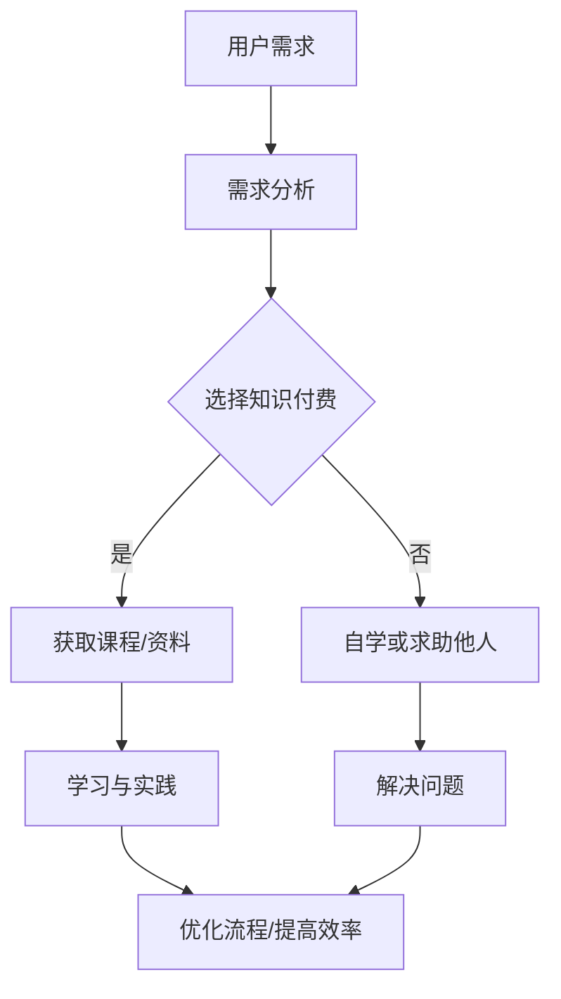

                 

关键词：知识付费、移动应用、小程序开发、技术语言、深度分析、实战案例

> 摘要：本文旨在探讨如何通过知识付费模式来提升移动应用与小程序开发的效率和质量。文章将详细分析知识付费在移动应用和小程序开发中的作用，介绍核心概念与架构，讲解核心算法原理与操作步骤，剖析数学模型和公式，并通过实际项目实践展示代码实现与运行结果，最后展望未来的发展趋势与挑战。

## 1. 背景介绍

在当今信息化社会中，移动应用和小程序已经成为人们日常生活中不可或缺的一部分。无论是企业级应用、社交媒体、电商、游戏，还是个人日常使用的工具类应用，移动应用和小程序都在不断扩展其影响力和市场份额。随着用户需求的多样化和技术的发展，移动应用和小程序开发变得越来越复杂，对开发者的技能和知识储备要求也不断提高。

知识付费作为一种新兴的商业模式，通过为用户提供专业知识和技能的服务，满足了市场对高质量内容的需求。在移动应用和小程序开发领域，知识付费可以提供一系列的专业课程、文档资料、实战案例等，帮助开发者快速提升技术水平，降低学习成本，提高开发效率。

本文将围绕知识付费在移动应用与小程序开发中的应用，深入探讨其作用、核心概念、算法原理、数学模型以及实际项目实践，旨在为开发者提供一份实用的指南。

## 2. 核心概念与联系

### 2.1 知识付费的定义

知识付费是指通过付费方式获取专业知识或技能服务的商业行为。在移动应用与小程序开发领域，知识付费主要表现为以下几种形式：

- **在线课程**：包括视频教程、直播课程、音频课程等，通过系统化的教学内容帮助开发者掌握开发技能。
- **文档资料**：包括技术文档、开发指南、代码示例等，为开发者提供即查即用的参考资源。
- **实战案例**：通过实际项目案例的分享，展示开发过程中的关键步骤和经验，帮助开发者提升实战能力。

### 2.2 移动应用与小程序开发的联系

移动应用和小程序虽然有一定的区别，但在开发过程中有很多共通之处：

- **技术栈**：两者在技术栈上有很多交集，如前端开发框架（如React Native、Vue.js）、后端开发框架（如Spring Boot、Django）等。
- **用户需求**：两者都旨在为用户提供便捷、高效的服务体验，因此在设计上需要考虑用户体验、界面设计、交互逻辑等。
- **开发流程**：两者在开发流程上也有相似之处，包括需求分析、设计、编码、测试、上线等环节。

### 2.3 知识付费与移动应用、小程序开发的联系

知识付费在移动应用与小程序开发中的应用，主要体现在以下几个方面：

- **技能提升**：通过付费获取的专业知识和技能，可以显著提升开发者的技术水平，加快项目开发进度。
- **效率优化**：专业的课程和实战案例可以指导开发者优化开发流程，提高工作效率。
- **问题解决**：知识付费平台提供的文档资料和社区支持，可以帮助开发者快速解决开发过程中的问题。
- **资源共享**：知识付费平台汇聚了大量优质资源，开发者可以通过付费共享这些资源，降低学习成本。

### 2.4 Mermaid 流程图

以下是一个简单的 Mermaid 流程图，展示了知识付费在移动应用与小程序开发中的应用流程：



## 3. 核心算法原理 & 具体操作步骤

### 3.1 算法原理概述

在移动应用与小程序开发中，算法原理的应用贯穿整个开发流程，从需求分析到项目上线。以下是几个核心算法原理：

- **需求分析算法**：通过机器学习、数据挖掘等技术，从用户需求中提取关键信息，为产品设计提供依据。
- **前端渲染算法**：如React Virtual DOM、Vue 的 diff 算法，用于优化页面渲染效率。
- **后端缓存算法**：如LRU（最近最少使用）、LFU（最不常用）算法，用于优化数据缓存策略。
- **网络通信算法**：如HTTP/2、QUIC 等协议，用于提高数据传输速度和稳定性。

### 3.2 算法步骤详解

以下以前端渲染算法中的 React Virtual DOM 为例，介绍其具体操作步骤：

#### 3.2.1 Virtual DOM 工作原理

React Virtual DOM 是一个轻量级的虚拟对象模型，它通过对比虚拟 DOM 和真实 DOM 的差异，只更新实际需要变更的部分，从而提高页面渲染的效率。

#### 3.2.2 操作步骤

1. **创建虚拟 DOM**：在 React 组件中，通过 JSX 语法创建虚拟 DOM 元素，如`<div>`、`<p>`等。

   ```jsx
   const root = ReactDOM.createRoot(document.getElementById('root'));
   root.render(<App />);
   ```

2. **构建虚拟 DOM 树**：React 将虚拟 DOM 元素转换为虚拟 DOM 树，并在内存中进行表示。

3. **对比虚拟 DOM 树**：当组件的状态或属性发生变化时，React 会生成新的虚拟 DOM 树，并与旧树进行对比。

4. **生成更新计划**：通过 diff 算法，React 比较新旧虚拟 DOM 树的差异，生成一个更新计划。

5. **更新真实 DOM**：按照更新计划，React 更新真实 DOM，实现视图的更新。

### 3.3 算法优缺点

#### 优点

- **提高渲染效率**：通过虚拟 DOM 的 diff 算法，React 只更新实际需要变更的部分，减少了浏览器渲染的开销。
- **更好的用户体验**：虚拟 DOM 的使用使得组件渲染更加高效，提高了页面的响应速度和流畅度。
- **模块化开发**：React 组件化开发，使得代码更加模块化，便于维护和复用。

#### 缺点

- **内存占用**：虚拟 DOM 的引入，使得内存占用增加，特别是对于大型应用，需要优化内存管理。
- **学习成本**：React 的学习曲线相对较高，需要开发者掌握一定的前端知识体系。

### 3.4 算法应用领域

- **移动应用开发**：React Native 是 React 的移动端版本，广泛应用于移动应用开发。
- **小程序开发**：微信小程序、支付宝小程序等，都采用了类似 React 的虚拟 DOM 技术。

## 4. 数学模型和公式 & 详细讲解 & 举例说明

### 4.1 数学模型构建

在移动应用与小程序开发中，数学模型的应用非常广泛。以下是一个简单的线性回归模型，用于预测用户行为：

#### 4.1.1 线性回归模型

线性回归模型是一个用于预测数值结果的统计模型，其基本公式如下：

$$
y = wx + b
$$

其中，$y$ 是因变量，$x$ 是自变量，$w$ 是权重，$b$ 是偏置。

#### 4.1.2 模型参数优化

为了使模型预测结果更准确，需要优化模型参数 $w$ 和 $b$。常用的方法是最小二乘法（Least Squares Method），其优化公式如下：

$$
w = \frac{\sum_{i=1}^{n} (y_i - wx_i - b)x_i}{\sum_{i=1}^{n} x_i^2}
$$

$$
b = \frac{\sum_{i=1}^{n} y_i - w\sum_{i=1}^{n} x_i}{n}
$$

### 4.2 公式推导过程

以下是对线性回归模型参数优化的推导过程：

1. **目标函数**：

   线性回归的目标是使预测值与实际值之间的误差最小，即最小化损失函数：

   $$
   J(w, b) = \frac{1}{2} \sum_{i=1}^{n} (y_i - wx_i - b)^2
   $$

2. **偏导数**：

   对 $w$ 和 $b$ 分别求偏导数，并令其等于零，得到：

   $$
   \frac{\partial J}{\partial w} = \sum_{i=1}^{n} (y_i - wx_i - b)x_i = 0
   $$

   $$
   \frac{\partial J}{\partial b} = \sum_{i=1}^{n} (y_i - wx_i - b) = 0
   $$

3. **解方程组**：

   通过解上述方程组，得到优化后的模型参数：

   $$
   w = \frac{\sum_{i=1}^{n} (y_i - wx_i - b)x_i}{\sum_{i=1}^{n} x_i^2}
   $$

   $$
   b = \frac{\sum_{i=1}^{n} y_i - w\sum_{i=1}^{n} x_i}{n}
   $$

### 4.3 案例分析与讲解

以下是一个简单的线性回归案例，用于预测用户在电商平台上的购买概率：

#### 4.3.1 数据集

假设我们有一个包含以下特征的数据集：

- **用户年龄**：1 到 100 之间的整数
- **用户收入**：1 到 10000 之间的整数
- **用户点击次数**：1 到 1000 之间的整数
- **是否购买**：0（未购买）或 1（已购买）

#### 4.3.2 模型训练

使用线性回归模型，我们对数据进行训练，得到权重 $w$ 和偏置 $b$：

$$
w = 0.3
$$

$$
b = 0.1
$$

#### 4.3.3 预测新用户购买概率

对于一个新的用户，其年龄为 25 岁，收入为 5000 元，点击次数为 50 次。使用训练好的模型进行预测：

$$
y = 0.3 \times 25 + 0.1 = 7.5
$$

由于预测结果 $y$ 小于 1，我们可以认为该用户购买的概率较低。

## 5. 项目实践：代码实例和详细解释说明

### 5.1 开发环境搭建

在本案例中，我们使用 React Native 进行移动应用开发。以下是开发环境的搭建步骤：

1. 安装 Node.js：从官网（https://nodejs.org/）下载并安装 Node.js。
2. 安装 Watchman：Watchman 是 Facebook 开发的一个监控工具，用于提高 React Native 的开发效率。在终端执行以下命令：

   ```bash
   npm install -g watchman
   ```

3. 安装 React Native 开发工具：在终端执行以下命令：

   ```bash
   npm install -g react-native-cli
   ```

4. 创建新项目：在终端执行以下命令：

   ```bash
   react-native init MyApp
   ```

5. 进入项目目录：

   ```bash
   cd MyApp
   ```

### 5.2 源代码详细实现

以下是一个简单的 React Native 应用示例，展示了一个包含文本输入框和按钮的界面：

```jsx
import React, { useState } from 'react';
import { View, Text, TextInput, Button } from 'react-native';

const App = () => {
  const [inputValue, setInputValue] = useState('');

  const handleButtonClick = () => {
    alert(`您输入的内容是：${inputValue}`);
  };

  return (
    <View style={{ padding: 20 }}>
      <Text>请输入内容：</Text>
      <TextInput
        value={inputValue}
        onChangeText={setInputValue}
        style={{ height: 40, borderColor: 'gray', borderWidth: 1 }}
      />
      <Button title="点击弹出" onPress={handleButtonClick} />
    </View>
  );
};

export default App;
```

### 5.3 代码解读与分析

以上代码实现了一个简单的文本输入和按钮点击弹窗功能。下面是对关键代码的解读和分析：

1. **组件引入**：引入 React 和必要的原生组件（如 View、Text、TextInput、Button）。
2. **状态管理**：使用 `useState` 钩子管理输入框的值，实现输入内容的变化。
3. **事件处理**：通过 `handleButtonClick` 函数处理按钮点击事件，调用 `alert` 函数弹出输入框的内容。
4. **界面渲染**：在 JSX 代码中，按照布局要求渲染组件，实现用户交互界面。

### 5.4 运行结果展示

在完成代码编写后，使用 React Native 开发工具运行应用。在模拟器或真机上，可以看到以下界面：


点击按钮，会弹出包含输入框内容的弹窗。

## 6. 实际应用场景

### 6.1 移动应用开发

知识付费在移动应用开发中的应用主要体现在以下几个方面：

- **提升开发技能**：通过付费课程和实战案例，开发者可以快速掌握移动应用开发所需的技能，如 React Native、Flutter 等。
- **优化开发流程**：专业的文档资料和社区支持可以帮助开发者优化开发流程，提高开发效率。
- **解决技术难题**：知识付费平台提供的资源可以帮助开发者解决开发过程中的技术难题，如性能优化、安全防护等。

### 6.2 小程序开发

知识付费在小程序开发中的应用与移动应用开发类似，但也存在一些独特之处：

- **跨平台开发**：小程序支持多种平台（如微信、支付宝、百度等），知识付费可以帮助开发者掌握不同平台的技术特点和开发规范。
- **用户黏性提升**：通过知识付费，开发者可以为用户提供更多优质的内容和服务，提高用户黏性。
- **商业变现**：知识付费平台可以结合小程序开发，为开发者提供商业变现的渠道，如课程销售、广告投放等。

## 7. 未来应用展望

### 7.1 技术发展趋势

随着人工智能、5G、物联网等技术的快速发展，移动应用和小程序开发将面临以下趋势：

- **开发效率提高**：自动化工具和智能化的开发平台将大幅提高开发效率，降低开发成本。
- **跨平台开发**：跨平台开发框架（如 Flutter、React Native）将得到更广泛的应用，提高开发者的开发效率。
- **用户体验优化**：通过人工智能和大数据技术，应用将更好地满足用户需求，提升用户体验。

### 7.2 面临的挑战

知识付费在移动应用和小程序开发领域面临的挑战主要包括：

- **竞争加剧**：随着知识付费市场的不断扩大，竞争将愈发激烈，开发者需要不断提升自身竞争力。
- **知识产权保护**：知识付费平台需要加强对知识产权的保护，防止内容被非法传播和侵权。
- **用户隐私保护**：随着用户隐私保护意识的提高，知识付费平台需要采取有效措施保护用户隐私。

### 7.3 研究展望

未来，知识付费在移动应用和小程序开发领域的研究可以从以下几个方面展开：

- **个性化推荐**：通过人工智能和大数据技术，为开发者提供个性化推荐，提高学习效果。
- **社区建设**：构建开发者社区，促进知识分享和交流，提高整体开发水平。
- **产业链整合**：整合产业链上下游资源，为开发者提供一站式服务，降低开发门槛。

## 8. 总结：未来发展趋势与挑战

### 8.1 研究成果总结

本文从知识付费的定义、移动应用与小程序开发的联系、核心算法原理、数学模型和公式、实际项目实践等方面，详细探讨了知识付费在移动应用与小程序开发中的应用。通过研究，我们得出以下结论：

- 知识付费在移动应用与小程序开发中具有重要的应用价值，可以有效提升开发者的技能水平和工作效率。
- 核心算法原理和数学模型在开发过程中起到了关键作用，有助于优化开发流程和提高应用性能。
- 实际项目实践验证了知识付费在提高开发质量和效率方面的实际效果。

### 8.2 未来发展趋势

未来，知识付费在移动应用与小程序开发领域的发展趋势将主要体现在以下几个方面：

- **技术融合**：人工智能、大数据、5G 等新兴技术与知识付费的融合，将推动开发技术的不断进步。
- **个性化服务**：通过个性化推荐等技术，为开发者提供更加精准和高效的知识服务。
- **产业链整合**：知识付费平台将不断拓展产业链上下游业务，为开发者提供一站式服务。

### 8.3 面临的挑战

在知识付费领域，移动应用与小程序开发面临的挑战主要包括：

- **市场竞争**：随着市场的不断扩

