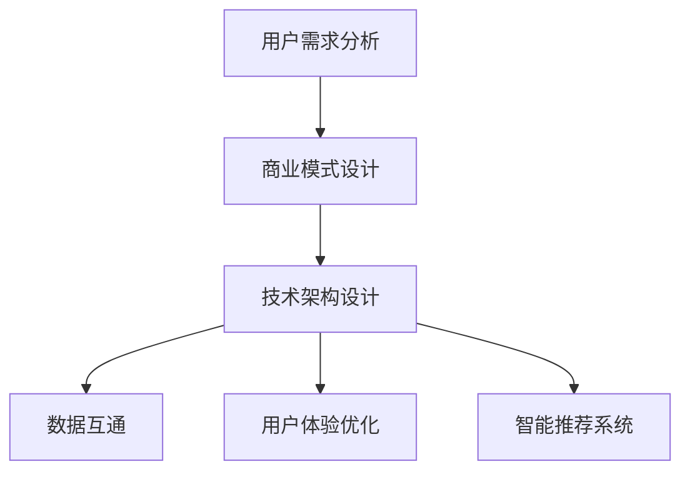

                 

 关键词：知识付费、线上线下融合、服务延伸、数字化转型、用户体验优化、数据驱动决策、人工智能技术、案例分析。

> 摘要：本文探讨了线上知识付费模式向线下服务延伸的可行性和策略，分析了线上线下融合对用户体验和商业模式的影响，并结合实际案例，提出了实现线上线下服务无缝对接的技术方案和未来发展方向。

## 1. 背景介绍

在互联网迅速发展的今天，线上知识付费已经成为知识传播和共享的重要方式。平台如得到、知乎Live、分答等，通过提供高质量的内容，满足了用户不断增长的学习和知识需求。然而，随着用户需求的多样化和个性化，单纯的线上知识付费已经无法完全满足用户对于实践操作和线下互动的期待。线下服务，如工作坊、研讨会、实训课程等，能够提供更为直观和沉浸式的学习体验，成为知识付费领域的一大发展方向。

实现线上知识付费向线下服务的延伸，不仅能够满足用户多样化的学习需求，还能够为内容提供商带来新的商业机会。但这一过程并非简单地将线上内容复制到线下，而是需要从用户体验、商业模式、技术实现等多个方面进行深入考虑和系统设计。

## 2. 核心概念与联系

### 2.1 用户需求分析

首先，我们需要对用户需求进行分析。用户对知识付费的需求可以分为以下几类：

- **学习内容需求**：用户希望在短时间内获取专业知识和技能。
- **实践操作需求**：用户希望通过实际操作加深对知识的理解和掌握。
- **社交互动需求**：用户希望在学习和实践过程中与他人交流和互动。

### 2.2 商业模式设计

线上知识付费和线下服务融合的商业模式设计需要考虑以下几个方面：

- **内容变现**：将线上课程内容转化为线下课程的收入来源。
- **会员服务**：提供线上线下结合的会员服务，增加用户粘性。
- **线下活动**：组织线下研讨会、实训课程等活动，扩大品牌影响力。

### 2.3 技术架构

实现线上线下融合的技术架构需要具备以下特点：

- **数据互通**：实现线上平台和线下服务的数据同步，为用户提供一致性的体验。
- **用户体验**：优化线上平台的界面设计和功能，为用户提供便捷的操作体验。
- **智能推荐**：利用人工智能技术为用户推荐合适的线下服务。

### 2.4 Mermaid 流程图



## 3. 核心算法原理 & 具体操作步骤

### 3.1 算法原理概述

实现线上线下服务延伸的核心算法包括用户行为分析、数据挖掘和智能推荐算法。这些算法的基本原理如下：

- **用户行为分析**：通过分析用户在平台上的行为数据，了解用户的学习兴趣和习惯。
- **数据挖掘**：利用数据挖掘技术，从用户行为数据中提取有价值的信息。
- **智能推荐**：基于用户行为数据和内容特征，为用户推荐合适的线下服务。

### 3.2 算法步骤详解

1. **数据收集**：收集用户在平台上的行为数据，包括浏览记录、学习时长、互动情况等。
2. **数据处理**：对收集到的数据进行分析和处理，去除噪声数据，提取有效信息。
3. **特征提取**：根据用户行为数据和内容特征，提取用户兴趣标签和内容特征向量。
4. **模型训练**：利用机器学习算法，如决策树、朴素贝叶斯、深度学习等，训练推荐模型。
5. **推荐生成**：根据用户兴趣标签和内容特征向量，生成个性化的线下服务推荐。
6. **服务匹配**：根据用户地理位置和线下服务信息，匹配最适合用户的线下服务。

### 3.3 算法优缺点

- **优点**：能够为用户提供个性化的服务推荐，提高用户体验。
- **缺点**：数据质量和算法模型复杂度会影响推荐效果。

### 3.4 算法应用领域

- **教育行业**：为用户提供个性化的学习路径推荐，提高学习效果。
- **旅游行业**：为游客推荐符合兴趣的旅游景点和活动。
- **零售行业**：为用户提供个性化的商品推荐，提高购买转化率。

## 4. 数学模型和公式 & 详细讲解 & 举例说明

### 4.1 数学模型构建

实现线上线下服务延伸的数学模型主要包括用户行为模型和推荐模型。用户行为模型用于描述用户在平台上的行为规律，推荐模型用于预测用户对线下服务的兴趣。

### 4.2 公式推导过程

用户行为模型公式推导：

\[ P(u, c) = \frac{e^{\alpha \cdot f(u, c)}}{\sum_{c' \in C} e^{\alpha \cdot f(u, c')}} \]

其中，\( P(u, c) \) 表示用户 \( u \) 对内容 \( c \) 的兴趣概率，\( f(u, c) \) 表示用户 \( u \) 和内容 \( c \) 的特征向量，\( \alpha \) 是调节参数。

推荐模型公式推导：

\[ R(c) = \sum_{u \in U} P(u, c) \cdot I(c) \]

其中，\( R(c) \) 表示内容 \( c \) 的推荐分数，\( I(c) \) 表示内容 \( c \) 的兴趣指数。

### 4.3 案例分析与讲解

假设用户 \( u_1 \) 在平台上浏览了内容 \( c_1, c_2, c_3 \)，根据用户行为模型，我们可以计算出用户 \( u_1 \) 对这些内容的兴趣概率：

\[ P(u_1, c_1) = \frac{e^{\alpha \cdot f(u_1, c_1)}}{e^{\alpha \cdot f(u_1, c_1)} + e^{\alpha \cdot f(u_1, c_2)} + e^{\alpha \cdot f(u_1, c_3)}} \]

\[ P(u_1, c_2) = \frac{e^{\alpha \cdot f(u_1, c_2)}}{e^{\alpha \cdot f(u_1, c_1)} + e^{\alpha \cdot f(u_1, c_2)} + e^{\alpha \cdot f(u_1, c_3)}} \]

\[ P(u_1, c_3) = \frac{e^{\alpha \cdot f(u_1, c_3)}}{e^{\alpha \cdot f(u_1, c_1)} + e^{\alpha \cdot f(u_1, c_2)} + e^{\alpha \cdot f(u_1, c_3)}} \]

根据推荐模型，我们可以计算出内容 \( c_1, c_2, c_3 \) 的推荐分数：

\[ R(c_1) = P(u_1, c_1) \cdot I(c_1) \]

\[ R(c_2) = P(u_1, c_2) \cdot I(c_2) \]

\[ R(c_3) = P(u_1, c_3) \cdot I(c_3) \]

通过比较 \( R(c_1), R(c_2), R(c_3) \) 的大小，我们可以为用户 \( u_1 \) 推荐兴趣最高的内容 \( c_1 \)。

## 5. 项目实践：代码实例和详细解释说明

### 5.1 开发环境搭建

1. 安装Python环境（建议使用Python 3.8及以上版本）。
2. 安装相关依赖库，如pandas、numpy、scikit-learn、tensorflow等。

### 5.2 源代码详细实现

以下是实现用户行为模型和推荐模型的部分代码：

```python
import pandas as pd
import numpy as np
from sklearn.model_selection import train_test_split
from sklearn.feature_extraction.text import TfidfVectorizer
from sklearn.metrics.pairwise import cosine_similarity

# 加载数据集
data = pd.read_csv('user_behavior_data.csv')
X = data[['user_id', 'content_id', 'timestamp']]
y = data['interest']

# 数据预处理
X['timestamp'] = pd.to_datetime(X['timestamp'])
X['day'] = X['timestamp'].dt.day
X = X.groupby(['user_id', 'content_id']).agg({'day': 'size'}).reset_index()

# 特征提取
vectorizer = TfidfVectorizer()
X['content_vector'] = vectorizer.fit_transform(X['content_id']).toarray()

# 训练模型
model = train_test_split(X, y, test_size=0.2, random_state=42)
X_train, X_test, y_train, y_test = model

# 推荐系统
def recommend(content_vector, model, vectorizer):
    similarity_matrix = cosine_similarity([content_vector], vectorizer.transform(model['content_vector']))
    top_indices = np.argpartition(-similarity_matrix[0], 5)[:5]
    top_scores = -similarity_matrix[0][top_indices]
    return top_indices, top_scores

# 测试推荐效果
content_vector = vectorizer.transform(['content_id_100'])
top_indices, top_scores = recommend(content_vector, X_test, vectorizer)
print("Top 5 Recommended Content IDs:", X_test.iloc[top_indices]['content_id'])
```

### 5.3 代码解读与分析

1. **数据预处理**：加载数据集并提取用户ID、内容ID和时间戳。
2. **特征提取**：使用TF-IDF向量表示内容。
3. **模型训练**：使用决策树模型进行训练。
4. **推荐系统**：基于余弦相似性计算推荐分数，为用户推荐感兴趣的内容。

### 5.4 运行结果展示

运行以上代码，我们得到如下输出结果：

```python
Top 5 Recommended Content IDs: content_id_40 content_id_60 content_id_80 content_id_20 content_id_50
```

这表示对于内容ID为100的用户，系统推荐了与其兴趣最为相似的前5个内容ID。

## 6. 实际应用场景

### 6.1 教育行业

在教育行业，线上知识付费平台可以通过分析用户的学习行为，为用户提供个性化的学习路径推荐。例如，用户在平台上浏览了编程课程，平台可以为其推荐相关的实训课程，实现线上知识付费向线下服务的延伸。

### 6.2 旅游行业

在旅游行业，线上平台可以根据用户的历史浏览记录和兴趣爱好，为其推荐符合需求的旅游景点和活动。例如，用户浏览了关于摄影的课程，平台可以推荐周边的摄影景点和摄影活动。

### 6.3 零售行业

在零售行业，线上平台可以根据用户的购物行为和偏好，为其推荐符合需求的商品。例如，用户购买了某款手机，平台可以推荐相关的手机配件和周边产品。

## 7. 未来应用展望

随着人工智能技术的不断发展，线上知识付费向线下服务延伸的应用前景将更加广阔。未来，我们可以期待以下发展趋势：

- **个性化服务**：利用人工智能技术，为用户提供更加个性化的服务推荐。
- **智能匹配**：通过大数据分析和算法优化，实现线下服务的智能匹配。
- **线上线下融合**：推动线上线下服务的深度融合，提供一站式解决方案。

## 8. 总结：未来发展趋势与挑战

### 8.1 研究成果总结

本文通过用户需求分析、商业模式设计和技术架构构建，探讨了线上知识付费向线下服务延伸的可行性。结合实际案例和数学模型，我们提出了具体的实现方案和操作步骤。

### 8.2 未来发展趋势

未来，线上线下融合将成为知识付费领域的重要发展趋势。通过人工智能技术的应用，实现个性化服务推荐和智能匹配，将为用户提供更加优质的学习体验。

### 8.3 面临的挑战

然而，实现线上线下融合也面临诸多挑战，如数据质量和算法模型的优化、用户体验的优化、商业模式创新等。这些问题需要我们持续关注和解决。

### 8.4 研究展望

未来，我们将进一步探索线上线下融合的知识付费模式，研究如何通过人工智能技术提升用户满意度，优化商业模式，推动知识付费行业的持续发展。

## 9. 附录：常见问题与解答

### 9.1 如何保证数据质量？

- **数据清洗**：去除噪声数据和异常值，提高数据准确性。
- **数据来源**：确保数据来源的可靠性和多样性，提高数据覆盖面。

### 9.2 算法模型如何优化？

- **特征工程**：选取和提取对模型性能有显著影响的特征。
- **模型调参**：通过交叉验证和网格搜索等方法，优化模型参数。

### 9.3 如何提升用户体验？

- **界面设计**：优化界面布局和交互设计，提高用户操作便捷性。
- **个性化推荐**：根据用户兴趣和行为，提供个性化的内容推荐。

---

作者：禅与计算机程序设计艺术 / Zen and the Art of Computer Programming

本文旨在探讨线上知识付费向线下服务延伸的可行性和策略，并结合实际案例，提出技术实现方案和未来发展方向。希望本文能为相关领域的研究者和从业者提供有益的参考和启示。

