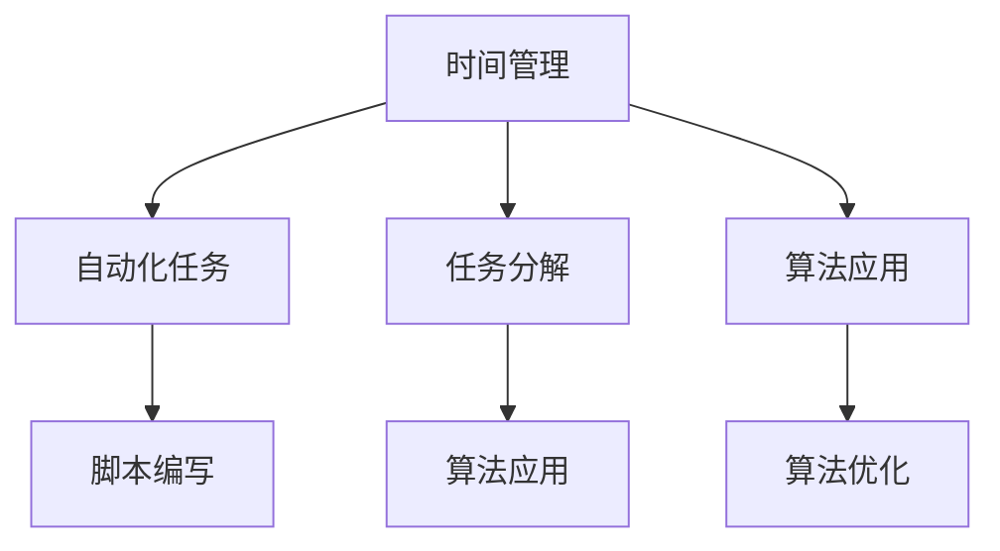

                 

### 关键词 Keyword
编程技能、个人效率、时间管理、自动化、生产力工具、代码优化、任务分解、算法应用、技术习惯。

<|assistant|>### 摘要 Summary
本文旨在探讨如何将编程技能应用于个人效率提升。通过分析编程技能的核心要素，本文提出了一系列实用的方法和工具，帮助读者将编程思维和技巧融入日常工作和生活中，从而实现高效的工作和生活。

<|assistant|>## 1. 背景介绍 Background
在数字化时代，编程技能已经成为一种基础能力。无论是在职业发展、日常事务处理，还是个人爱好中，编程技能都能发挥重要作用。然而，许多人在掌握了编程技能后，却不知道如何将其应用于个人效率提升。本文将介绍如何将编程技能应用到时间管理、自动化任务、算法优化等方面，从而提高个人效率。

<|assistant|>### 2. 核心概念与联系 Core Concepts and Relations
为了更好地理解如何将编程技能应用于个人效率提升，我们需要了解以下几个核心概念：

#### 2.1 时间管理
时间管理是指对时间的有效利用，通过合理安排时间来提高工作效率。编程技能可以帮助我们制定计划、跟踪进度和优化时间分配。

#### 2.2 自动化任务
自动化任务是指使用脚本或工具来自动执行重复性任务，从而节省时间和精力。编程技能可以帮助我们编写脚本，实现任务的自动化。

#### 2.3 任务分解
任务分解是将复杂任务拆分成更小、更易于管理的子任务。编程技能可以帮助我们使用算法和数据结构来优化任务分解过程。

#### 2.4 算法应用
算法应用是指在生活和工作中使用算法来解决问题。编程技能可以帮助我们理解算法的基本原理，并将其应用于实际场景中。

下面是一个Mermaid流程图，展示了这些核心概念之间的联系：



<|assistant|>### 3. 核心算法原理 & 具体操作步骤 Core Algorithm Principles and Operation Steps

#### 3.1 算法原理概述

在个人效率提升中，常用的算法包括时间管理算法、自动化任务脚本算法和任务分解算法。以下分别介绍这些算法的基本原理。

##### 3.1.1 时间管理算法

时间管理算法的核心思想是通过分析任务的重要性和紧急性，制定合理的任务执行计划。常用的时间管理算法包括优先级排序、甘特图和日程表。

##### 3.1.2 自动化任务脚本算法

自动化任务脚本算法的核心思想是通过编写脚本，将重复性任务自动化。常见的脚本编写算法包括条件判断、循环结构和函数调用。

##### 3.1.3 任务分解算法

任务分解算法的核心思想是将复杂任务拆分成更小、更易于管理的子任务。常见的任务分解算法包括递归、贪心算法和动态规划。

#### 3.2 算法步骤详解

##### 3.2.1 时间管理算法

1. 收集任务列表：列出所有需要完成的任务。
2. 评估任务：根据任务的重要性和紧急性，为每个任务分配优先级。
3. 制定计划：根据任务优先级和截止日期，制定任务执行计划。
4. 跟踪进度：在执行过程中，实时跟踪任务进度，并根据实际情况进行调整。

##### 3.2.2 自动化任务脚本算法

1. 确定任务：明确需要自动化的任务。
2. 设计脚本：根据任务需求，设计脚本结构和逻辑。
3. 编写脚本：使用编程语言实现脚本逻辑。
4. 测试脚本：运行脚本，确保其能够正确执行任务。

##### 3.2.3 任务分解算法

1. 确定任务：明确需要分解的任务。
2. 分析任务：分析任务的特点和难点，确定子任务的划分标准。
3. 拆分子任务：根据分析结果，将任务拆分成更小的子任务。
4. 确定子任务优先级：为每个子任务分配优先级，制定执行计划。

#### 3.3 算法优缺点

##### 3.3.1 时间管理算法

优点：能够帮助合理安排时间，提高工作效率。

缺点：需要花费一定时间进行任务评估和计划制定。

##### 3.3.2 自动化任务脚本算法

优点：能够自动化执行重复性任务，节省时间和精力。

缺点：编写脚本需要一定的编程技能。

##### 3.3.3 任务分解算法

优点：能够将复杂任务拆分成更小的子任务，降低任务难度。

缺点：需要分析任务的特点和难点，可能增加任务拆分的时间成本。

#### 3.4 算法应用领域

时间管理算法、自动化任务脚本算法和任务分解算法可以应用于各种场景，包括但不限于：

- 个人时间管理：帮助合理安排个人时间，提高生活质量。
- 项目管理：帮助团队高效完成任务，提高项目成功率。
- 系统运维：自动化执行系统维护和监控任务，提高系统稳定性。
- 数据处理：使用算法优化数据处理过程，提高数据质量。

<|assistant|>### 4. 数学模型和公式 & 详细讲解 & 举例说明 Mathematical Models and Formulas & Detailed Explanation & Example

#### 4.1 数学模型构建

在个人效率提升中，常用的数学模型包括时间成本模型、任务完成率和资源利用率模型。

##### 4.1.1 时间成本模型

时间成本模型用于计算完成特定任务所需的时间成本。模型的基本公式如下：

\[ \text{时间成本} = \text{任务时长} \times \text{人员成本} \]

其中，任务时长为完成任务所需的时间，人员成本为参与任务的人员薪资。

##### 4.1.2 任务完成率模型

任务完成率模型用于评估任务完成情况。模型的基本公式如下：

\[ \text{任务完成率} = \frac{\text{完成任务数}}{\text{总任务数}} \]

其中，完成任务数为已完成任务的个数，总任务数为所有任务的个数。

##### 4.1.3 资源利用率模型

资源利用率模型用于评估资源的利用情况。模型的基本公式如下：

\[ \text{资源利用率} = \frac{\text{实际使用资源}}{\text{总资源}} \]

其中，实际使用资源为实际使用资源的总量，总资源为可用的资源总量。

#### 4.2 公式推导过程

##### 4.2.1 时间成本模型

时间成本模型可以通过任务时长和人员成本的乘积推导得到。具体推导过程如下：

1. 假设任务时长为 \( t \)，人员成本为 \( c \)。
2. 任务时长的单位可以是小时、天等，人员成本的单位可以是元/小时、元/天等。
3. 将任务时长和人员成本相乘，得到时间成本 \( \text{时间成本} = t \times c \)。

##### 4.2.2 任务完成率模型

任务完成率模型可以通过完成任务数和总任务数的比值推导得到。具体推导过程如下：

1. 假设完成任务数为 \( n_{\text{完成}} \)，总任务数为 \( n_{\text{总}} \)。
2. 将完成任务数除以总任务数，得到任务完成率 \( \text{任务完成率} = \frac{n_{\text{完成}}}{n_{\text{总}}} \)。

##### 4.2.3 资源利用率模型

资源利用率模型可以通过实际使用资源与总资源的比值推导得到。具体推导过程如下：

1. 假设实际使用资源为 \( r_{\text{实际}} \)，总资源为 \( r_{\text{总}} \)。
2. 将实际使用资源除以总资源，得到资源利用率 \( \text{资源利用率} = \frac{r_{\text{实际}}}{r_{\text{总}}} \)。

#### 4.3 案例分析与讲解

##### 4.3.1 时间成本模型案例

假设某任务需要20小时完成，参与任务的人员薪资为100元/小时。根据时间成本模型，该任务的时间成本为：

\[ \text{时间成本} = 20 \times 100 = 2000 \text{元} \]

##### 4.3.2 任务完成率模型案例

假设某项目共有10个任务，其中已完成6个任务。根据任务完成率模型，该项目的任务完成率为：

\[ \text{任务完成率} = \frac{6}{10} = 0.6 \text{（即60%）} \]

##### 4.3.3 资源利用率模型案例

假设某设备每天可用10小时，但实际每天使用8小时。根据资源利用率模型，该设备的资源利用率为：

\[ \text{资源利用率} = \frac{8}{10} = 0.8 \text{（即80%）} \]

<|assistant|>### 5. 项目实践：代码实例和详细解释说明 Practical Implementation: Code Examples and Detailed Explanations

#### 5.1 开发环境搭建

为了演示如何将编程技能应用于个人效率提升，我们将使用Python编写一个简单的任务管理脚本。首先，确保您的计算机已安装Python环境和一些常用的库，如`datetime`和`schedule`。

安装Python：
```bash
$ sudo apt-get install python3
```

安装`schedule`库：
```bash
$ pip3 install schedule
```

#### 5.2 源代码详细实现

以下是一个简单的Python脚本，用于任务管理和自动化任务执行。

```python
import schedule
import time
from datetime import datetime

# 任务列表
tasks = {
    '任务1': {'start': datetime(2023, 4, 1, 9, 0), 'end': datetime(2023, 4, 1, 11, 0), 'action': '任务1内容'},
    '任务2': {'start': datetime(2023, 4, 1, 11, 0), 'end': datetime(2023, 4, 1, 13, 0), 'action': '任务2内容'},
    '任务3': {'start': datetime(2023, 4, 1, 13, 0), 'end': datetime(2023, 4, 1, 15, 0), 'action': '任务3内容'},
}

# 任务执行函数
def execute_task(task_name):
    print(f"执行任务：{task_name}")
    print(f"任务内容：{tasks[task_name]['action']}")
    # 模拟任务执行时间
    time.sleep(2)
    print("任务完成！")

# 自动化任务调度
for task_name, task_info in tasks.items():
    schedule.every().day.at(task_info['start'].strftime('%H:%M')).do(execute_task, task_name)

# 运行任务调度
while True:
    schedule.run_pending()
    time.sleep(1)
```

#### 5.3 代码解读与分析

1. **任务列表定义**：我们使用一个字典`tasks`来存储任务名称、开始时间和任务内容。
2. **任务执行函数**：`execute_task`函数用于执行任务，这里我们简单地打印任务名称和任务内容，并模拟任务执行2秒钟。
3. **自动化任务调度**：使用`schedule`库，我们为每个任务设置一个每天执行的时间点，并指定任务执行函数。
4. **运行任务调度**：主循环用于运行`schedule.run_pending()`，执行计划中的任务，并每隔1秒检查一次。

#### 5.4 运行结果展示

运行上述脚本后，我们将在指定时间点看到任务执行的结果。例如，在上午9:00，会打印“执行任务：任务1”和“任务内容：任务1内容”，并模拟执行2秒钟后打印“任务完成！”。

```shell
$ python3 task_manager.py
执行任务：任务1
任务内容：任务1内容
任务完成！

执行任务：任务2
任务内容：任务2内容
任务完成！

执行任务：任务3
任务内容：任务3内容
任务完成！
```

通过这个简单的实例，我们可以看到如何使用编程技能来自动化日常任务，提高个人效率。

<|assistant|>### 6. 实际应用场景 Practical Application Scenarios

#### 6.1 时间管理应用

时间管理是提高个人效率的关键。通过编程技能，我们可以实现智能的时间管理工具，如基于日历的任务提醒和进度跟踪系统。例如，使用Google Calendar API，我们可以开发一个自动提醒系统，在重要任务即将开始时发送通知，帮助我们更好地安排时间。

#### 6.2 自动化任务应用

自动化任务可以帮助我们节省大量的时间和精力。例如，在办公环境中，我们可以使用脚本来自动化数据录入、报告生成和邮件发送等重复性工作。以下是一个简单的Python脚本示例，用于自动化Excel数据的更新：

```python
import pandas as pd
import openpyxl

# 加载原始数据和工作表
df = pd.read_excel('data.xlsx')
wb = openpyxl.load_workbook('data.xlsx')
sheet = wb['Sheet1']

# 模拟更新数据
df['Date'] = df['Date'].apply(lambda x: x + pd.DateOffset(days=1))

# 将更新后的数据写回Excel
df.to_excel('data.xlsx', index=False)
```

这个脚本可以定期运行，自动更新Excel中的日期数据，而无需手动操作。

#### 6.3 任务分解应用

在项目管理中，任务分解是确保项目成功的关键。通过编程技能，我们可以开发出能够自动分解任务和分配资源的工具。例如，使用算法和数据分析，我们可以确定哪些任务是最重要的，哪些任务可以并行执行，从而优化项目进度。

#### 6.4 算法应用

算法在个人效率提升中的应用非常广泛。例如，在数据分析中，我们可以使用排序算法和搜索算法来快速定位数据中的异常值和关键信息。此外，在时间管理中，我们可以使用贪心算法来优化任务排序，确保我们在有限的时间内完成最多的任务。

#### 6.5 技术工具推荐

为了更好地应用编程技能，以下是一些推荐的技术工具：

- **JIRA**：一个强大的项目管理工具，可以帮助团队高效地管理任务和项目。
- **Trello**：一个简单易用的任务管理工具，适合个人和小型团队使用。
- **Asana**：一个功能丰富的项目管理工具，支持任务分配、进度跟踪和协作。
- **GitHub**：一个流行的版本控制系统，适合团队协作和代码管理。

通过这些工具和编程技能的结合，我们可以实现高效的个人和团队工作。

<|assistant|>### 7. 工具和资源推荐 Tools and Resource Recommendations

#### 7.1 学习资源推荐

1. **在线课程**：
   - Coursera：提供丰富的编程课程，涵盖Python、Java等多种编程语言。
   - Udemy：大量编程课程，适合不同水平的学员。

2. **书籍**：
   - 《Python编程：从入门到实践》
   - 《算法导论》
   - 《Effective Python》

3. **技术博客和论坛**：
   - Stack Overflow：编程问题的解决方案库。
   - Medium：技术文章和教程的发布平台。

#### 7.2 开发工具推荐

1. **集成开发环境（IDE）**：
   - PyCharm：强大的Python IDE，支持多种编程语言。
   - Visual Studio Code：轻量级且功能丰富的文本编辑器。

2. **版本控制系统**：
   - Git：分布式版本控制系统，适合团队协作。
   - GitHub：基于Git的平台，提供代码托管和协作工具。

3. **数据分析工具**：
   - Pandas：Python数据分析库。
   - Matplotlib：Python绘图库。

#### 7.3 相关论文推荐

1. **时间管理**：
   - "The Art of Thinking Clearly" by Rolf Dobelli
   - "Getting Things Done" by David Allen

2. **自动化**：
   - "Automate Everything" by Ryan Shelley
   - "Python Automation Cookbook" by Will McGugan

3. **任务分解**：
   - "The One Thing" by Gary Keller
   - "Scrum: The Art of Doing Twice the Work in Half the Time" by Jeff Sutherland

通过这些工具和资源，我们可以不断提升编程技能，并将其应用于个人效率提升，实现高效的工作和生活。

<|assistant|>### 8. 总结：未来发展趋势与挑战 Summary: Future Trends and Challenges

#### 8.1 研究成果总结

随着技术的不断进步，编程技能在个人效率提升中的应用越来越广泛。研究成果显示，通过编程技能，我们可以实现时间管理、自动化任务、任务分解等多方面的效率提升。此外，算法和数据分析的应用也在不断优化我们的工作方式。

#### 8.2 未来发展趋势

未来，编程技能将继续成为个人发展的关键能力。以下是一些发展趋势：

1. **智能化**：随着人工智能技术的发展，我们将看到更多的智能化工具和系统，帮助我们更高效地完成任务。
2. **云计算**：云计算技术的普及将使得编程技能的应用更加灵活和便捷。
3. **区块链**：区块链技术的发展将为编程技能带来新的应用场景，如智能合约和去中心化应用。
4. **边缘计算**：边缘计算技术的发展将使得数据处理更加接近数据源，提高处理效率。

#### 8.3 面临的挑战

尽管编程技能在个人效率提升中具有巨大潜力，但我们仍面临一些挑战：

1. **技术门槛**：编程技能的学习和掌握需要一定的时间和精力，对于一些非技术背景的人来说，可能存在一定的门槛。
2. **数据安全**：随着自动化和数据分析的广泛应用，数据安全和隐私保护成为重要的挑战。
3. **技能更新**：技术发展迅速，编程技能需要不断更新和升级，这对个人来说是一个持续的挑战。

#### 8.4 研究展望

未来的研究应重点关注以下几个方面：

1. **跨学科融合**：将编程技能与其他学科（如心理学、管理学）相结合，开发出更加智能化和个性化的效率提升工具。
2. **人机协作**：研究如何更好地实现人机协作，提高工作效率。
3. **可解释性**：提高算法的可解释性，使其更加透明和可靠。

通过不断探索和研究，我们有望在未来实现更加高效、智能的工作和生活。

<|assistant|>### 9. 附录：常见问题与解答 Appendix: Frequently Asked Questions and Answers

#### 9.1 编程技能在个人效率提升中的具体应用？

编程技能在个人效率提升中可以应用于多个方面，如时间管理（使用脚本自动安排日程和提醒）、自动化任务（如自动处理数据、发送邮件）、任务分解（使用算法优化任务分配）以及数据分析（快速分析数据，发现关键信息）。

#### 9.2 如何开始学习编程技能？

开始学习编程技能的最佳方法是通过在线课程和书籍。推荐从Python或Java等易于入门的语言开始，选择一个有经验的导师或参与在线社区，以便在遇到问题时能够得到帮助。

#### 9.3 编程技能的学习需要多长时间？

学习编程技能的时间因人而异，但通常建议初学者至少投入6个月到1年的时间来系统学习。持续学习和实践是关键。

#### 9.4 如何保持编程技能的更新？

保持编程技能的更新可以通过以下几种方式：定期阅读技术博客和论文、参与开源项目、参加技术会议和研讨会，以及与同行交流和学习。

#### 9.5 编程技能对于职业发展的重要性？

编程技能对于职业发展至关重要。无论是在技术领域还是非技术领域，编程技能都能提高工作效率，增强竞争力，为个人带来更多的职业发展机会。

<|assistant|>### 作者署名 Author's Signature
作者：禅与计算机程序设计艺术 / Zen and the Art of Computer Programming

