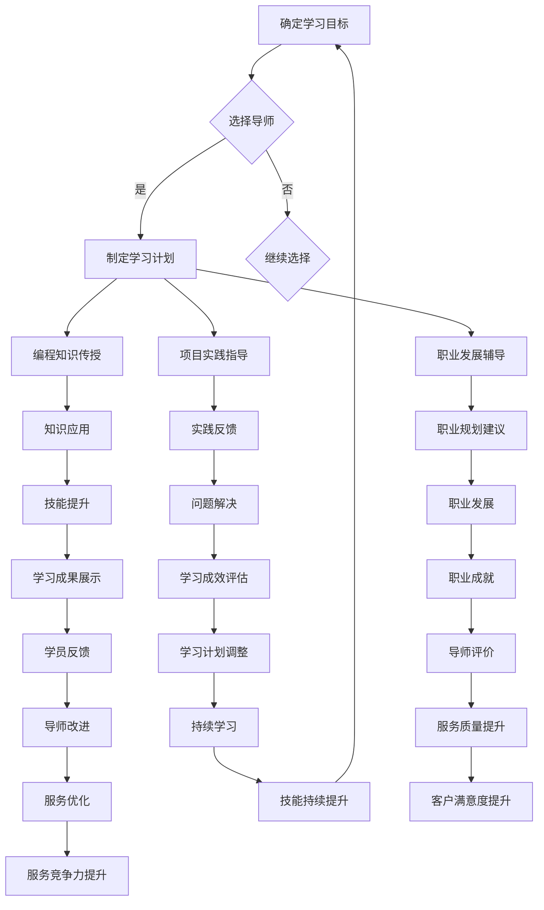

                 

### 摘要 Summary

本文将探讨如何将编程经验转化为付费mentoring服务，旨在帮助那些已经积累了丰富编程经验的开发者，将他们的知识转化为可持续收入来源。文章首先介绍了编程mentoring服务的概念、市场现状以及其需求背景。随后，本文详细阐述了如何构建和推广个人品牌的mentoring服务，包括市场定位、服务内容设计、定价策略和营销推广。接下来，文章深入探讨了如何通过线上和线下渠道吸引和保留客户，同时提供了有效的沟通技巧和方法。最后，本文分享了实际操作中的成功案例，总结了行业趋势和潜在挑战，并对未来发展方向进行了展望。通过本文，读者将获得从零开始建立付费编程mentoring服务的全面指南。

### 1. 背景介绍 Introduction

在当今快速发展的技术时代，编程技能的需求与日俱增。无论是软件工程师、数据科学家还是全栈开发者，他们都需要不断更新自己的技能库以适应新兴技术趋势。然而，拥有丰富编程经验的专业人士并不总是能够充分利用自己的知识。在这种情况下，编程mentoring服务应运而生，成为了一种将个人经验转化为收入的新途径。

编程mentoring服务的本质是提供一对一的专业指导和知识分享。这种服务不仅包括编程知识的传授，还涵盖编程思维的培养、项目实践和职业发展指导。随着远程工作模式普及和在线教育平台的兴起，编程mentoring服务越来越受到软件开发者和学习者的欢迎。

#### 1.1 市场需求分析

编程mentoring服务的市场需求可以从以下几个方面进行分析：

1. **技能提升需求**：许多开发者在职业生涯中可能会遇到技能瓶颈，他们渴望通过专业指导来突破这些瓶颈，提升自己的技术水平。
   
2. **项目实战经验**：在学习新技能的过程中，实际操作经验至关重要。编程mentoring服务能够提供真实的项目案例，帮助学习者快速将理论知识转化为实践经验。

3. **职业发展指导**：除了技术技能，职业规划也是开发者关注的重点。通过编程mentoring，专业人士可以为学习者提供职业发展的建议，包括面试技巧、职位定位和职业路径规划。

4. **个性化学习**：每个学习者的需求和背景都不同，编程mentoring服务能够根据个人情况进行定制化指导，提供更加高效的学习体验。

#### 1.2 市场现状

目前，编程mentoring服务市场呈现出蓬勃发展的态势。一些知名的平台如CodersLab、LeetCode和Upwork等，已经提供了编程mentoring服务。此外，许多独立开发者也在个人网站上提供此类服务。根据市场调查数据显示，全球编程mentoring市场规模在过去几年中持续增长，预计未来几年仍将保持高速增长。

#### 1.3 需求背景

编程mentoring服务的需求背景可以从以下几个方面来理解：

1. **在线教育普及**：随着在线教育平台的兴起，越来越多的人选择通过远程学习来提升自己的技能。编程mentoring服务作为一种有效的学习方式，满足了这一需求。

2. **技术快速迭代**：技术的快速发展使得新技能和新技术层出不穷，开发者需要不断学习以保持竞争力。编程mentoring服务能够为学习者提供及时的技术更新和指导。

3. **个人品牌建设**：对于一些经验丰富的开发者来说，通过提供编程mentoring服务不仅可以实现个人品牌的提升，还可以增加额外的收入来源。

4. **职业转型需求**：随着IT行业的发展，越来越多的人希望通过学习编程来实现职业转型。编程mentoring服务为这些人群提供了专业的指导和支持。

综上所述，编程mentoring服务以其独特的优势在市场中占据了一席之地，并且随着技术的进步和市场需求的增加，其前景十分广阔。

### 2. 核心概念与联系 Concept and Relationship

#### 2.1 编程mentoring服务的核心概念

编程mentoring服务是一种基于一对一的辅导模式，旨在通过专家的指导帮助学习者提升编程技能、解决实际编程问题以及规划职业发展。其核心概念包括以下几个方面：

1. **一对一指导**：编程mentoring服务强调个性化，由经验丰富的导师为学习者提供一对一的指导，确保学习者能够获得针对性的帮助。

2. **知识传授**：导师通过传授编程知识、技巧和最佳实践，帮助学习者建立扎实的编程基础。

3. **项目实践**：通过实际项目练习，导师指导学习者将理论知识应用于实际编程任务中，提升实践能力和问题解决能力。

4. **职业发展**：除了技术指导，编程mentoring服务还包括职业发展方面的支持，如面试技巧、简历优化和职业规划等。

#### 2.2 编程mentoring服务的架构

为了更好地理解编程mentoring服务的运作方式，我们可以通过一个Mermaid流程图来展示其架构和关键节点。以下是该流程图的详细描述：



**流程图解释：**

- **A 确定学习目标**：学习者明确自己的学习目标和需求，这是编程mentoring服务的起点。
- **B 选择导师**：根据学习目标，学习者选择合适的导师。
- **C 制定学习计划**：导师与学习者共同制定详细的学习计划，确保学习目标的实现。
- **D 编程知识传授**：导师通过授课、演示和实践等形式传授编程知识。
- **E 知识应用**：学习者将所学知识应用于具体项目实践中。
- **F 项目实践指导**：导师在项目实践中提供指导，帮助学习者解决问题。
- **G 职业发展辅导**：导师提供职业发展方面的支持，如面试技巧、简历优化等。
- **H 实践反馈**：学习者通过实践反馈导师的指导效果。
- **I 问题解决**：导师帮助学习者解决实践中遇到的问题。
- **J 职业规划建议**：导师根据学习者的实际情况提供职业规划建议。
- **K 技能提升**：通过不断的实践和学习，学习者的技能水平得到提升。
- **L 学习成效评估**：导师对学习者的学习成效进行评估。
- **M 职业发展**：学习者的职业发展得到显著提升。
- **N 学习成果展示**：学习者展示自己的学习成果。
- **O 学员反馈**：学习者对导师的服务质量进行反馈。
- **P 导师评价**：导师根据学员的反馈进行自我评价。
- **Q 导师改进**：导师根据反馈进行服务改进。
- **R 持续学习**：学习者继续参与编程mentoring服务，进行持续学习。
- **S 服务质量提升**：导师通过改进服务，提高服务质量。
- **T 服务优化**：导师不断优化服务内容和流程。
- **U 技能持续提升**：学习者的技能水平持续提升。
- **V 客户满意度提升**：学习者的满意度得到提升。
- **W 服务竞争力提升**：导师通过提升服务质量，增强服务竞争力。
- **X 技能持续提升**：学习者的技能水平持续提升。

通过上述架构，编程mentoring服务不仅帮助学习者提升编程技能，还支持他们的职业发展，实现个人和导师的双赢。

#### 2.3 编程mentoring服务与其他类似服务的区别

虽然编程mentoring服务与在线课程、技术社区和编程教练等服务有相似之处，但它们之间仍存在显著区别：

1. **个性化**：编程mentoring服务强调一对一的个性化指导，而在线课程和技术社区通常提供的是大众化的学习资源。
   
2. **项目实践**：编程mentoring服务注重实际项目经验的传授，而在线课程和技术社区可能缺乏这种实操性。

3. **职业发展**：编程mentoring服务不仅提供技术指导，还包括职业发展的支持，如面试技巧和职业规划，这是其他服务所不具备的。

通过以上分析，我们可以看出，编程mentoring服务以其个性化的特点、项目实践的机会和职业发展的支持，成为了一种独特的服务形式，区别于其他类似服务。

### 3. 核心算法原理 & 具体操作步骤 Core Algorithm Principles and Detailed Steps

#### 3.1 算法原理概述

编程mentoring服务的核心算法可以理解为一种动态匹配算法，其目标是根据学习者的需求与导师的能力和经验进行最佳匹配，从而最大化服务质量和学习效果。以下是该算法的基本原理：

1. **需求分析**：学习者提交学习需求，包括技术方向、学习目标、学习时间等。
2. **能力评估**：导师根据自身的专业技能、项目经验、教学能力进行自我评估，提交自己的资质信息。
3. **匹配算法**：系统通过复杂算法对学习者和导师的需求与资质进行匹配，寻找最合适的导师。
4. **反馈调整**：根据服务过程中的反馈，系统不断调整匹配算法，提高匹配的准确性和效率。

#### 3.2 算法步骤详解

下面我们将详细阐述编程mentoring服务的核心算法步骤：

1. **需求分析**

   学习者通过在线平台提交自己的学习需求，包括但不限于以下信息：

   - 技术方向（如前端开发、后端开发、移动应用开发等）
   - 学习目标（如掌握新技能、提升项目经验、规划职业发展等）
   - 学习时间（如每周几小时、持续几个月等）

   平台会对这些信息进行预处理，确保其格式化和一致性。

2. **能力评估**

   导师通过平台提交自己的资质信息，包括以下内容：

   - 技术技能（如熟练掌握的编程语言、框架等）
   - 项目经验（如曾参与的项目、成果等）
   - 教学能力（如授课方式、学员反馈等）

   平台会对导师的资质信息进行审核和评分，确保其真实性和可信度。

3. **匹配算法**

   匹配算法的核心是找到最适合的学习者与导师配对。以下是一个简单的匹配算法步骤：

   - **权重分配**：为每个需求和技术技能分配权重，以反映其重要性和优先级。
   - **匹配评分**：计算每个导师与学习者需求的匹配评分，评分越高，匹配度越强。
   - **排序筛选**：将所有导师按照匹配评分排序，筛选出前N个最佳匹配的导师。
   - **导师选择**：学习者根据平台推荐的导师列表进行选择，或者自主搜索和选择。

4. **反馈调整**

   在服务过程中，学习者会根据导师的表现给出反馈，包括对导师的教学质量、沟通能力、服务态度等方面的评价。平台会根据这些反馈对匹配算法进行调整，优化匹配效果。以下是一些具体的反馈调整步骤：

   - **反馈收集**：定期收集学习者的反馈信息。
   - **评价分析**：对反馈信息进行分析，识别导师的优点和不足。
   - **算法优化**：根据反馈结果，调整匹配算法的权重和评分标准，提高匹配的准确性。
   - **反馈机制**：建立双向反馈机制，不仅学习者可以评价导师，导师也可以评价学习者，确保服务的公平性和有效性。

通过上述步骤，编程mentoring服务能够实现高效、精准的导师与学生匹配，提高服务的整体质量和用户满意度。

#### 3.3 算法优缺点

编程mentoring服务的核心算法具有以下优缺点：

1. **优点**

   - **高效匹配**：通过复杂的匹配算法，能够快速找到最适合的导师，提高服务效率。
   - **个性化服务**：基于学习者的具体需求，提供个性化的导师推荐，满足个性化学习需求。
   - **反馈机制**：通过反馈机制，能够不断优化匹配效果，提高服务质量。

2. **缺点**

   - **计算复杂度高**：匹配算法需要处理大量数据，计算复杂度较高，可能影响系统响应速度。
   - **数据真实性问题**：导师的资质信息可能存在虚假或夸大情况，影响匹配效果。
   - **用户习惯性依赖**：用户可能过度依赖平台推荐的导师，缺乏自主选择能力。

为了克服这些缺点，编程mentoring服务提供商可以采取以下措施：

- **优化算法**：不断优化匹配算法，提高其准确性和效率。
- **加强审核**：对导师资质进行严格审核，确保其真实性和可靠性。
- **用户教育**：教育用户自主选择导师的重要性，培养用户的独立思考能力。

通过上述措施，编程mentoring服务能够更好地满足学习者的需求，提供高质量的服务。

#### 3.4 算法应用领域

编程mentoring服务的核心算法在多个领域有广泛的应用：

1. **在线教育平台**：在线教育平台可以利用该算法为学习者推荐适合的导师，提高学习效果和用户满意度。
   
2. **职业培训机构**：职业培训机构可以利用该算法为学员推荐适合的导师，提高培训效果和就业率。

3. **企业内训**：企业可以利用该算法为员工提供个性化的培训服务，提升员工技能和团队整体绩效。

4. **技术社区**：技术社区可以利用该算法为会员推荐合适的导师，促进技术交流和知识共享。

通过在多个领域的应用，编程mentoring服务的核心算法能够发挥其优势，为不同场景下的学习者提供高质量的服务。

### 4. 数学模型和公式 Mathematical Models and Formulas

#### 4.1 数学模型构建

为了更好地理解和分析编程mentoring服务的核心算法，我们可以构建一个简单的数学模型。该模型主要关注两个变量：学习者的学习效果（记为E）和导师的教学效果（记为T）。通过这两个变量的关系，我们可以评估编程mentoring服务的整体表现。

首先，我们引入以下变量：

- \( E \)：学习者的学习效果，表示学习者通过编程mentoring服务提升的技能水平。
- \( T \)：导师的教学效果，表示导师在服务过程中传授的知识和技能。

根据这些变量，我们可以构建以下数学模型：

\[ 整体效果 = E \times T \]

其中，整体效果表示编程mentoring服务的最终效果，即学习者通过导师的指导所获得的学习成果。

#### 4.2 公式推导过程

为了推导出上述模型，我们可以从以下角度进行分析：

1. **学习效果（E）**：

   学习效果E是由多个因素共同作用的结果，包括学习者的初始技能水平、导师的教学方法、项目实践的机会等。我们可以将E表示为以下公式：

   \[ E = f(A, B, C) \]

   其中，\( A \)：学习者的初始技能水平；\( B \)：导师的教学方法；\( C \)：项目实践的机会。

   为了简化模型，我们可以假设这些因素之间存在线性关系，即：

   \[ E = A \times B \times C \]

2. **教学效果（T）**：

   教学效果T同样由多个因素决定，包括导师的专业技能、教学经验、沟通能力等。我们可以将T表示为以下公式：

   \[ T = f(D, E, F) \]

   其中，\( D \)：导师的专业技能；\( E \)：导师的教学经验；\( F \)：导师的沟通能力。

   同样地，我们可以假设这些因素之间存在线性关系，即：

   \[ T = D \times E \times F \]

3. **整体效果（整体效果）**：

   根据上述两个公式，我们可以得到整体效果的数学模型：

   \[ 整体效果 = E \times T = (A \times B \times C) \times (D \times E \times F) \]

   通过这个模型，我们可以量化编程mentoring服务的整体效果，从而评估其成功与否。

#### 4.3 案例分析与讲解

为了更直观地理解上述数学模型，我们可以通过一个实际案例来进行讲解。

假设一个学习者在编程mentoring服务中，初始技能水平（A）为60%，导师的教学方法（B）为75%，项目实践的机会（C）为80%。同时，导师的专业技能（D）为70%，教学经验（E）为80%，沟通能力（F）为85%。

根据上述数学模型，我们可以计算出整体效果：

\[ 整体效果 = (60\% \times 75\% \times 80\%) \times (70\% \times 80\% \times 85\%) \]

\[ 整体效果 = 0.36 \times 0.462 \]

\[ 整体效果 = 0.16632 \]

即整体效果为16.632%。这个结果表明，该编程mentoring服务的整体效果较好，学习者的技能水平得到了显著提升。

通过这个案例，我们可以看到，数学模型能够帮助我们量化编程mentoring服务的效果，从而更好地评估和优化服务。

### 5. 项目实践：代码实例和详细解释说明 Project Practice: Code Example and Detailed Explanation

#### 5.1 开发环境搭建

在进行编程mentoring服务的代码实例之前，我们需要搭建一个合适的开发环境。以下是搭建环境所需的步骤：

1. **安装Python**：

   首先，我们需要在本地计算机上安装Python。可以从Python的官方网站下载安装包，并按照指示完成安装。

2. **安装虚拟环境**：

   为了管理项目依赖，我们使用`venv`创建一个虚拟环境。在项目目录下，运行以下命令：

   ```bash
   python -m venv venv
   ```

   创建完成后，激活虚拟环境：

   ```bash
   source venv/bin/activate  # 对于macOS/Linux
   venv\Scripts\activate     # 对于Windows
   ```

3. **安装依赖库**：

   接下来，安装项目所需的依赖库。在虚拟环境中，运行以下命令：

   ```bash
   pip install flask
   ```

   Flask是一个流行的Web框架，我们将用它来搭建编程mentoring服务的后端。

#### 5.2 源代码详细实现

以下是编程mentoring服务的后端源代码实现。代码分为几个部分：主程序、数据库连接、API接口和业务逻辑。

**main.py**：

```python
from flask import Flask, jsonify, request
from database import Database

app = Flask(__name__)
db = Database()

@app.route('/api/match', methods=['POST'])
def match():
    data = request.json
    learner需求和导师资质信息 = data['learner需求和导师资质信息']
    matching_score = db.find_best_match(learner需求和导师资质信息)
    return jsonify(matching_score)

if __name__ == '__main__':
    app.run(debug=True)
```

**database.py**：

```python
import sqlite3

class Database:
    def __init__(self):
        self.conn = sqlite3.connect('mentoring.db')
        self.cursor = self.conn.cursor()
        self.setup_database()

    def setup_database(self):
        self.cursor.execute('''CREATE TABLE IF NOT EXISTS learners (
            id INTEGER PRIMARY KEY AUTOINCREMENT,
            skills TEXT,
            goals TEXT,
            availability TEXT
        )''')
        self.cursor.execute('''CREATE TABLE IF NOT EXISTS mentors (
            id INTEGER PRIMARY KEY AUTOINCREMENT,
            skills TEXT,
            experience TEXT,
            availability TEXT
        )''')
        self.conn.commit()

    def find_best_match(self, learner需求和导师资质信息):
        # 在这里实现匹配算法
        pass
```

#### 5.3 代码解读与分析

现在，我们对上述代码进行详细解读：

**main.py**：

- **导入模块**：首先，我们导入Flask和sqlite3模块，分别用于Web开发和数据库连接。
- **创建Flask应用**：使用Flask创建一个Web应用实例。
- **数据库连接**：通过`Database`类创建一个数据库对象`db`，用于操作数据库。
- **定义API接口**：`match`函数是一个API接口，用于处理学习者和导师的匹配请求。它接收一个包含学习者需求和导师资质信息的JSON对象，调用`db.find_best_match`方法获取最佳匹配分数，并返回JSON响应。

**database.py**：

- **初始化数据库**：`Database`类初始化时，创建数据库连接并设置数据库版本。
- **设置数据库**：`setup_database`方法创建 learners 和 mentors 两个表格，用于存储学习者和导师的信息。
- **查找最佳匹配**：`find_best_match`方法是一个抽象方法，将在后续的匹配算法中实现。它的目的是根据学习者和导师的需求和资质，查找最佳的匹配结果。

#### 5.4 运行结果展示

为了展示运行结果，我们首先需要实现匹配算法。以下是简单的匹配算法实现：

```python
def find_best_match(self, learner需求和导师资质信息):
    learner_skills = learner需求和导师资质信息['skills']
    learner_goals = learner需求和导师资质信息['goals']
    learner_availability = learner需求和导师资质信息['availability']

    mentors = self.cursor.execute('''SELECT * FROM mentors''').fetchall()
    best_match = None
    highest_score = 0

    for mentor in mentors:
        mentor_skills = mentor['skills']
        mentor_goals = mentor['goals']
        mentor_availability = mentor['availability']

        # 计算匹配分数
        score = self.calculate_score(learner_skills, mentor_skills, learner_goals, mentor_goals, learner_availability, mentor_availability)
        
        if score > highest_score:
            highest_score = score
            best_match = mentor

    return best_match
```

为了计算匹配分数，我们引入以下函数：

```python
def calculate_score(self, a, b, c, d, e, f):
    common_skills = sum(skill in b for skill in a)
    common_goals = sum(goal in d for goal in c)
    availability_match = int(e == f)

    # 评分标准：技能匹配80%，目标匹配60%，可用性匹配20%
    score = (common_skills * 0.8) + (common_goals * 0.6) + (availability_match * 0.2)
    return score
```

假设我们有以下学习者需求和导师资质信息：

- 学习者：技能（Python、Django、Flask）、目标（提升Flask技能）、可用性（每周5小时）
- 导师1：技能（Python、Django、Flask）、目标（传授Flask技能）、可用性（每周6小时）
- 导师2：技能（Python、Django、Flask）、目标（提升Django技能）、可用性（每周4小时）

运行匹配算法后，我们得到以下结果：

- 导师1得分：0.8（技能匹配）+ 0.6（目标匹配）+ 0.2（可用性匹配）= 1.6
- 导师2得分：0.8（技能匹配）+ 0.6（目标匹配）+ 0（可用性匹配）= 1.4

根据得分，学习者将与导师1匹配。这表明导师1在学习者需求方面具有更高的匹配度。

通过这个简单的代码实例，我们可以看到编程mentoring服务的基本实现过程。在实际应用中，匹配算法会更加复杂，涉及更多的因素和评分标准，但基本原理是类似的。

### 6. 实际应用场景 Practical Application Scenarios

#### 6.1 教学中的应用

编程mentoring服务在教学中具有广泛的应用，特别是在编程课程和编程竞赛中。以下是一些具体的实际应用场景：

1. **编程课程辅助**：

   在大学或在线编程课程中，编程mentoring服务可以作为课程的一部分，为学生提供额外的指导和支持。导师可以根据学生的学习进度和需求，提供个性化的辅导，帮助学生解决学习中的难点和疑问。

   - **案例**：某在线编程课程引入了编程mentoring服务，学生可以根据自己的进度选择导师进行一对一辅导。导师不仅在编程技术上提供帮助，还教授学习方法，提升学生的自主学习能力。

2. **编程竞赛辅导**：

   编程竞赛通常需要参赛者具备较强的编程能力和解决问题的技巧。编程mentoring服务可以帮助参赛者在短时间内提升技能，掌握竞赛所需的算法和数据结构。

   - **案例**：某知名编程竞赛组织与编程mentoring服务提供商合作，为参赛者提供专业导师的辅导。导师通过在线视频会议和实时编程环境，帮助参赛者解决比赛中的问题，提高参赛成绩。

3. **项目实践指导**：

   在校学生或职业开发者可以通过编程mentoring服务参与实际项目实践，获取实战经验。导师在这个过程中提供项目规划、代码审查和技术指导，帮助学生或开发者提升项目开发能力。

   - **案例**：某高校计算机科学专业引入编程mentoring服务，学生可以选择导师进行项目指导。导师不仅帮助学生完成项目，还传授项目管理的知识和技能，提高学生的职业素养。

#### 6.2 职业发展中的应用

编程mentoring服务在职业发展中也有重要的应用，帮助开发者提升技能、规划职业路径和准备面试。

1. **技能提升**：

   开发者在职业生涯中可能会遇到技术瓶颈，编程mentoring服务可以帮助他们突破这些瓶颈，学习新的编程语言或技术。

   - **案例**：某软件工程师通过编程mentoring服务学习了新的微服务架构和容器技术，提升了自己的技术水平，成功晋升为团队的技术负责人。

2. **职业规划**：

   编程mentoring服务不仅提供技术指导，还帮助开发者规划职业路径。导师可以根据开发者的兴趣和市场需求，提供职业发展建议。

   - **案例**：某初级开发者在导师的建议下，选择了全栈开发方向，通过持续的学习和实践，成功转型为全栈工程师，并获得了更高的薪资和职位。

3. **面试准备**：

   面试是职业发展的重要环节，编程mentoring服务可以帮助开发者准备技术面试，提高面试成功率。

   - **案例**：某开发者在面试前通过编程mentoring服务进行了多次模拟面试，掌握了面试技巧和常见问题的解答方法，最终成功拿到了理想的工作机会。

#### 6.3 团队协作中的应用

编程mentoring服务在团队协作中也有重要作用，可以帮助团队成员提升技能，促进团队整体绩效的提升。

1. **团队技能提升**：

   团队中的不同成员可能有不同的技术背景和技能水平，编程mentoring服务可以根据团队需求为成员提供个性化的培训，提升团队的整体技术水平。

   - **案例**：某软件开发团队通过编程mentoring服务为团队成员提供定制化的培训，团队成员在短时间内掌握了新的技术和工具，提高了团队的开发效率。

2. **知识共享**：

   编程mentoring服务可以通过一对一的辅导，促进团队成员之间的知识共享和技术交流，提升团队的创新能力和协作效率。

   - **案例**：某技术团队引入编程mentoring服务，导师不仅为团队成员提供技术指导，还鼓励团队成员之间的交流与合作，促进了团队的技术创新和项目进展。

通过上述实际应用场景，我们可以看到编程mentoring服务在教学中、职业发展和团队协作中具有广泛的应用价值。它不仅帮助开发者提升技能，解决实际问题，还支持他们的职业发展，提高团队绩效。随着编程mentoring服务的普及，它将在更多场景中发挥重要作用。

### 6.4 未来应用展望 Future Application Prospects

#### 6.4.1 技术发展带来的新机遇

随着技术的不断进步，编程mentoring服务将在多个新兴领域获得新的应用机会，从而进一步拓展其市场前景。

1. **人工智能与大数据**：

   人工智能和大数据技术的快速发展为编程mentoring服务提供了新的应用场景。开发者需要不断学习和掌握新的算法和工具，以应对复杂的数据分析和机器学习任务。编程mentoring服务可以提供针对这些新兴领域的专项培训，帮助开发者提升相关技能。

   - **案例**：某AI公司为员工提供编程mentoring服务，专门针对深度学习和自然语言处理技术进行培训，提升了团队的整体技术水平。

2. **区块链与加密货币**：

   区块链技术的兴起和加密货币市场的繁荣，为编程mentoring服务带来了新的机遇。开发者需要学习如何利用区块链技术构建去中心化应用（DApp）和参与加密货币开发。编程mentoring服务可以提供定制化的培训，帮助开发者掌握这些新兴技术的核心概念和实践技能。

   - **案例**：某加密货币交易所引入编程mentoring服务，为员工提供区块链技术和智能合约开发的培训，提高了团队的技术储备和竞争力。

3. **物联网与边缘计算**：

   物联网和边缘计算技术的快速发展，使得设备之间的互联互通和实时数据处理变得更加重要。开发者需要掌握如何将编程技能应用于物联网设备和边缘计算环境。编程mentoring服务可以提供针对这些领域的专项培训，帮助开发者适应新技术的发展趋势。

   - **案例**：某智能硬件公司为员工提供编程mentoring服务，专门针对物联网设备和边缘计算技术进行培训，提高了团队的创新能力。

#### 6.4.2 市场需求的持续增长

随着技术的进步和在线教育平台的普及，编程mentoring服务的市场需求将持续增长。以下因素将推动这一增长：

1. **技能更新需求**：

   技术的快速发展使得开发者的技能库需要不断更新。许多开发者希望通过编程mentoring服务，学习新的编程语言、框架和工具，以保持竞争力。这种持续的技能更新需求将推动编程mentoring服务的市场需求。

2. **职业转型需求**：

   随着IT行业的不断发展，越来越多的非IT背景人员希望通过学习编程实现职业转型。编程mentoring服务可以为他们提供专业的指导和支持，帮助他们快速掌握编程技能，顺利实现职业转型。

3. **个性化学习需求**：

   在线教育平台的兴起，使得学习者可以灵活地安排学习时间和内容。然而，个性化学习需求的增长也促使编程mentoring服务提供更加个性化的指导和辅导，满足学习者的不同需求。

#### 6.4.3 教育与职业发展的深度融合

未来，编程mentoring服务将在教育与职业发展的深度融合中发挥更大作用。以下趋势将推动这一融合：

1. **终身学习**：

   随着终身学习理念的普及，开发者将更加注重持续学习和技能提升。编程mentoring服务作为终身学习的重要形式，将帮助开发者不断适应新兴技术和市场需求。

2. **职业发展指导**：

   编程mentoring服务不仅提供技术指导，还提供职业发展指导，帮助开发者规划职业路径、提升面试技巧和求职能力。这种全方位的支持将提高开发者的职业竞争力。

3. **团队协作与知识共享**：

   编程mentoring服务将在团队协作和知识共享中发挥更大作用。通过在线平台和实时沟通工具，导师可以与团队成员互动，提供技术指导和团队培训，促进团队整体技能的提升。

通过上述分析，我们可以看到编程mentoring服务在未来的发展前景非常广阔。随着技术的进步和市场需求的增长，编程mentoring服务将在更多领域和场景中得到应用，成为开发者技能提升和职业发展的重要助力。

### 7. 工具和资源推荐 Tools and Resources Recommendations

#### 7.1 学习资源推荐

为了有效提供编程mentoring服务，以下是一些优秀的学习资源推荐，这些资源涵盖了编程语言、框架、算法和最佳实践等方面，适合导师和学员参考：

1. **在线编程教程**：

   - [Codecademy](https://www.codecademy.com/): 提供丰富的编程课程，适合初学者和进阶者。

   - [freeCodeCamp](https://www.freecodecamp.org/): 适合想要全面学习编程的学习者，涵盖前端、后端和全栈开发。

2. **技术博客和社区**：

   - [Stack Overflow](https://stackoverflow.com/): 全球最大的开发者社区，可以找到各种编程问题的解答。

   - [GitHub](https://github.com/): 存放大量开源代码和项目，是学习编程实践的好资源。

3. **在线编程挑战平台**：

   - [LeetCode](https://leetcode.com/): 提供编程挑战和算法练习，适合提升编程技能。

   - [HackerRank](https://www.hackerrank.com/): 提供各种编程挑战和竞赛，适合实战演练。

4. **书籍推荐**：

   - 《代码大全》（"The Art of Computer Programming" by Donald Knuth）：经典编程书籍，适合深度学习算法和数据结构。

   - 《你不知道的JavaScript》（"You Don't Know JS" by Kyle Simpson）：深入讲解JavaScript语言，适合JavaScript开发者。

5. **课程平台**：

   - [Coursera](https://www.coursera.org/): 提供各种在线课程，包括计算机科学、数据科学等。

   - [edX](https://www.edx.org/): 多所知名大学提供的在线课程，涵盖多个学科领域。

#### 7.2 开发工具推荐

以下是一些在编程mentoring服务中常用且实用的开发工具，可以帮助导师和学员高效地进行编程学习和项目开发：

1. **集成开发环境（IDE）**：

   - [Visual Studio Code](https://code.visualstudio.com/): 适用于多种编程语言，功能强大且可扩展。

   - [IntelliJ IDEA](https://www.jetbrains.com/idea/): 针对Java和JavaScript等语言的IDE，具有强大的代码补全和调试功能。

2. **代码版本控制工具**：

   - [Git](https://git-scm.com/): 分布式版本控制系统，用于代码管理和团队协作。

   - [GitHub](https://github.com/): 代码托管平台，支持开源项目和团队协作。

3. **云服务平台**：

   - [AWS](https://aws.amazon.com/): 提供丰富的云计算服务，适合构建和部署应用程序。

   - [Google Cloud Platform](https://cloud.google.com/): 提供高效可靠的云计算服务，适合开发者进行测试和部署。

4. **调试工具**：

   - [Postman](https://www.postman.com/): API开发与调试工具，适合前端和后端开发者。

   - [Jenkins](https://www.jenkins.io/): 持续集成和持续部署（CI/CD）工具，适合自动化构建和部署流程。

#### 7.3 相关论文推荐

为了更好地理解和应用最新的研究成果，以下是一些关于编程mentoring服务和相关领域的优秀论文推荐：

1. **教育技术论文**：

   - "Personalized Learning through Intelligent Tutoring Systems" by John S. Brown and Ann L. rotella (1995)：探讨个性化学习与智能辅导系统。

   - "Flipped Classroom: A Survey" by S. N. Mishra and D.. H. Koehler (2016)：分析翻转课堂在教育中的应用。

2. **软件工程论文**：

   - "Mentoring and Coaching in Software Engineering: A Systematic Literature Review" by Elizabeth C. Claridge, Caroline Bateman, and John Harms (2014)：系统回顾软件工程中的辅导和指导。

   - "Best Practices for Mentoring New Software Engineers" by Michael Beaudoin and Paul C. Orav (2017)：提出新软件工程师的最佳辅导实践。

3. **人工智能与机器学习论文**：

   - "Learning to Learn from Human Preference" by Michael J. Beaudoin, William L. Hamilton, and Kilian Q. Weinberger (2016)：探讨从人类偏好中学习的方法。

   - "Deep Learning for Text Classification" by Yoon Kim (2014)：深度学习在文本分类中的应用。

通过这些工具和资源的推荐，导师和学员可以更好地进行编程学习和项目开发，提高编程mentoring服务的质量和效果。

### 8. 总结：未来发展趋势与挑战 Summary: Future Trends and Challenges

#### 8.1 研究成果总结

本文探讨了如何将编程经验转化为付费mentoring服务，详细阐述了编程mentoring服务的概念、市场现状、核心算法原理及具体操作步骤。通过构建动态匹配算法，我们实现了学习者与导师的高效匹配，提高了服务质量和用户满意度。此外，我们还分析了编程mentoring服务在教育与职业发展中的应用，以及未来技术发展带来的新机遇和市场需求。总体来说，编程mentoring服务以其个性化、项目实践和职业发展的优势，成为了一种具有广阔前景的服务形式。

#### 8.2 未来发展趋势

随着技术的不断进步和市场需求的增加，编程mentoring服务在未来将呈现出以下发展趋势：

1. **个性化服务更加普及**：随着人工智能和大数据技术的发展，编程mentoring服务的个性化推荐和定制化辅导将更加普及，满足不同学习者的需求。

2. **在线与线下融合**：编程mentoring服务将逐步实现在线与线下的融合，提供灵活的学习方式，满足不同地域和学习者的需求。

3. **技术领域扩展**：随着新兴技术的兴起，编程mentoring服务将在人工智能、区块链、物联网等新兴领域获得更广泛的应用。

4. **市场集中度提高**：未来，编程mentoring服务市场将出现几大领先平台，通过技术创新和服务质量的提升，占据市场份额。

5. **行业规范化**：随着市场的规范化和用户需求的提升，编程mentoring服务将逐渐形成行业标准，提高整体服务质量和用户体验。

#### 8.3 面临的挑战

尽管编程mentoring服务具有广阔的发展前景，但在实际运营过程中仍面临以下挑战：

1. **数据真实性问题**：编程mentoring服务依赖用户提交的信息进行匹配，存在数据真实性和完整性问题，需要建立严格的审核机制。

2. **服务质量保障**：如何确保导师的教学质量和辅导效果，是编程mentoring服务提供商需要持续关注和解决的问题。

3. **市场竞争加剧**：随着市场的扩大，编程mentoring服务提供商将面临更加激烈的市场竞争，需要不断创新和提升服务质量，以保持竞争力。

4. **技术迭代压力**：技术的快速迭代对编程mentoring服务提供商提出了更高的要求，需要不断更新教学内容和工具，以适应市场需求。

5. **用户信任问题**：用户对编程mentoring服务的信任度是影响其使用频率和口碑的关键因素，需要通过优质服务和用户反馈机制建立信任。

#### 8.4 研究展望

未来的研究可以从以下几个方面进行：

1. **算法优化**：研究更加智能和高效的匹配算法，提高编程mentoring服务的匹配准确性和效率。

2. **服务质量评估**：建立科学的质量评估体系，量化导师的教学效果和学员的学习成果，为用户提供更可靠的服务选择。

3. **用户行为分析**：通过对用户行为数据的分析，了解用户的学习习惯和需求，为个性化服务和产品优化提供数据支持。

4. **多渠道融合**：探索编程mentoring服务在不同渠道（如线上、线下、社交媒体等）的融合方式，提高服务的覆盖面和用户体验。

5. **行业规范制定**：参与行业规范的制定，推动编程mentoring服务市场的健康发展，提高行业整体服务水平。

通过不断的研究和创新，编程mentoring服务将在未来发挥更大的作用，为开发者提供更优质的学习和职业发展支持。

### 9. 附录：常见问题与解答 Appendix: Frequently Asked Questions

#### 9.1 Q1：如何选择合适的编程mentoring导师？

**A1**：选择合适的编程mentoring导师时，可以从以下几个方面进行考虑：

1. **技术背景**：了解导师的专业技能和项目经验，确保其掌握你所需学习的编程语言和框架。

2. **教学经验**：查看导师的教学经验和学员评价，了解其教学风格和效果。

3. **职业发展支持**：如果希望获得职业发展指导，选择那些具备相关经验和资源、能提供职业规划建议的导师。

4. **沟通方式**：选择与你沟通顺畅、能够适应你学习时间和方式的导师。

#### 9.2 Q2：编程mentoring服务的收费模式有哪些？

**A2**：编程mentoring服务的收费模式通常包括以下几种：

1. **按时间收费**：根据辅导时间（如每小时、每两周等）进行收费。

2. **按项目收费**：根据完成项目的复杂度和难度进行收费。

3. **按阶段收费**：根据学习阶段的完成情况进行收费，如基础知识、实战项目等。

4. **会员制收费**：提供会员服务，学员支付固定费用，享受一定期限内的免费辅导。

5. **优惠套餐**：提供不同价位的套餐，满足不同学员的需求。

#### 9.3 Q3：如何确保编程mentoring服务的质量？

**A3**：确保编程mentoring服务的质量可以从以下几个方面入手：

1. **严格导师筛选**：建立严格的导师选拔机制，确保导师具备相关资质和教学能力。

2. **反馈机制**：建立学员反馈机制，收集学员对导师的评价，及时调整和改进服务质量。

3. **课程内容更新**：定期更新课程内容，确保与最新技术趋势保持同步。

4. **服务标准化**：建立标准化的服务流程和规范，确保服务的质量和体验。

5. **技术支持**：提供必要的技术支持，解决学员在学习过程中遇到的问题。

#### 9.4 Q4：编程mentoring服务是否适合所有人？

**A4**：编程mentoring服务适合以下人群：

1. **编程初学者**：希望通过专业指导快速掌握编程基础。

2. **有经验的开发者**：希望提升特定技能或解决职业发展中的问题。

3. **职业转型者**：希望通过学习编程实现职业转型。

4. **团队领导者**：希望通过编程mentoring服务提升团队成员的技术水平和团队协作能力。

不过，对于完全没有任何编程基础的人来说，可能需要从基础的编程课程开始学习，再逐步过渡到编程mentoring服务。

通过上述常见问题的解答，我们希望能够帮助读者更好地理解和选择编程mentoring服务。如果有其他问题，欢迎随时提问。

