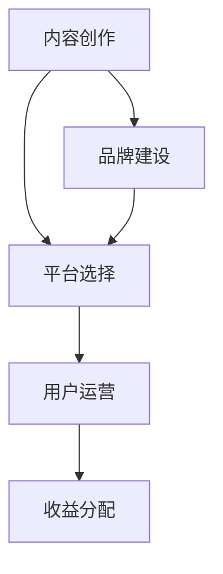

                 

在当今数字化时代，知识付费已经成为了趋势。无论是线上课程、专业书籍、视频教程，还是一对一的咨询服务，知识付费市场都在迅速增长。作为一个技术领域的专家，如何将自己的知识和经验转化为一种可持续的商业模式，打造一个个人知识付费商业帝国，是许多专业人士所关注的问题。本文将围绕这一主题，为您详细解析如何打造个人知识付费商业帝国。

## 关键词

- 知识付费
- 商业模式
- 内容创作
- 品牌建设
- 用户增长

## 摘要

本文将探讨如何利用专业知识打造个人知识付费商业帝国。我们将从背景介绍、核心概念、算法原理、数学模型、项目实践、实际应用、工具和资源推荐、总结与展望等多个角度，为您提供一套完整的知识付费商业构建方案。通过本文的阅读，您将了解到如何将专业知识转化为商业价值，实现个人品牌的成长。

## 1. 背景介绍

### 1.1 知识付费的发展

知识付费，顾名思义，是指用户为了获取特定知识或技能而付费的行为。随着互联网技术的发展，知识付费逐渐成为了一种重要的商业模式。从早期的在线课程，到现在的知识付费平台，如得到、喜马拉雅等，知识付费市场正在不断壮大。

### 1.2 个人知识付费的商业潜力

对于技术领域专业人士来说，拥有丰富的知识和经验是一种宝贵资产。通过打造个人知识付费商业帝国，您可以将自己的知识和经验转化为收入来源，实现财务自由。同时，这也有助于提升个人品牌价值，扩大影响力。

## 2. 核心概念与联系

### 2.1 个人知识付费商业模式

个人知识付费商业模式主要包括以下几个方面：

- **内容创作**：根据市场需求，创作有价值的内容。
- **平台选择**：选择适合自己知识领域的平台进行发布。
- **用户运营**：通过社群、互动等方式，吸引并维护用户。
- **收益分配**：根据内容质量和用户反馈，调整收益分配策略。

### 2.2 个人知识付费核心概念原理与架构

为了更好地理解个人知识付费商业模式，我们可以使用Mermaid流程图来展示其核心概念原理与架构。



## 3. 核心算法原理 & 具体操作步骤

### 3.1 算法原理概述

个人知识付费商业帝国的核心算法，可以概括为以下几个步骤：

1. **需求分析**：了解市场需求，确定知识付费内容的方向。
2. **内容创作**：根据需求，创作高质量的知识内容。
3. **平台发布**：选择合适的平台，发布知识内容。
4. **用户互动**：与用户进行互动，了解用户需求，优化内容。
5. **品牌建设**：通过优质内容和服务，建立个人品牌。

### 3.2 算法步骤详解

#### 3.2.1 需求分析

需求分析是个人知识付费商业帝国的第一步。可以通过以下方式了解市场需求：

- **调研**：通过问卷调查、访谈等方式，了解目标用户的需求。
- **数据分析**：分析行业数据、竞争对手数据，找到市场需求点。
- **市场趋势**：关注行业动态，把握市场趋势。

#### 3.2.2 内容创作

内容创作是个人知识付费商业帝国的核心。创作高质量的内容，需要遵循以下原则：

- **专业度**：确保内容的专业性和权威性。
- **实用性**：内容要具有实际应用价值。
- **可读性**：内容要易于理解和阅读。

#### 3.2.3 平台发布

选择合适的平台进行发布，是个人知识付费商业帝国成功的关键。平台选择要考虑以下因素：

- **用户量**：平台用户量越大，曝光度越高。
- **内容形式**：根据内容形式选择合适的平台。
- **推广渠道**：平台是否有完善的推广渠道。

#### 3.2.4 用户互动

用户互动是个人知识付费商业帝国的重要组成部分。通过与用户的互动，可以了解用户需求，优化内容。用户互动的方式包括：

- **社群互动**：建立社群，与用户进行交流。
- **问答互动**：在平台开设问答功能，解答用户疑问。
- **私信互动**：通过私信与用户进行一对一交流。

#### 3.2.5 品牌建设

品牌建设是个人知识付费商业帝国的长期目标。通过优质内容和服务，建立个人品牌，可以提升知名度，吸引更多用户。品牌建设的方法包括：

- **内容输出**：持续输出优质内容，展示专业度。
- **个人形象**：塑造良好的个人形象，提升用户信任度。
- **口碑传播**：通过用户口碑，扩大品牌影响力。

### 3.3 算法优缺点

#### 优点

- **高自由度**：个人知识付费商业模式具有很高的自由度，可以根据自己的兴趣和专业领域进行内容创作。
- **高收益**：优质内容可以带来较高的收益。
- **可持续性**：通过不断优化内容和服务，可以实现可持续发展。

#### 缺点

- **竞争激烈**：知识付费市场竞争激烈，需要不断提升自己的专业度和内容质量。
- **时间投入**：内容创作和用户运营需要投入大量时间和精力。

### 3.4 算法应用领域

个人知识付费商业模式可以应用于以下领域：

- **技术领域**：如编程、数据科学、人工智能等。
- **设计领域**：如平面设计、UI/UX设计等。
- **教育领域**：如亲子教育、在线课程等。
- **生活领域**：如健康养生、旅行攻略等。

## 4. 数学模型和公式 & 详细讲解 & 举例说明

### 4.1 数学模型构建

个人知识付费商业帝国的数学模型可以构建为以下几个部分：

- **收益模型**：根据内容质量和用户量，计算收益。
- **成本模型**：计算内容创作、平台运营等成本。
- **用户增长模型**：根据用户互动和口碑传播，预测用户增长。

### 4.2 公式推导过程

#### 收益模型

设 \( R \) 为收益，\( C \) 为成本，\( Q \) 为用户量，\( P \) 为单价，\( E \) 为用户互动系数，则收益模型可以表示为：

\[ R = (Q \times P) - C \]

#### 成本模型

成本模型可以表示为：

\[ C = (C_1 + C_2 + C_3 + ...) \]

其中，\( C_1 \) 为内容创作成本，\( C_2 \) 为平台运营成本，\( C_3 \) 为其他成本。

#### 用户增长模型

用户增长模型可以表示为：

\[ Q_t = Q_{t-1} + \Delta Q_t \]

其中，\( Q_t \) 为第 \( t \) 个月的用户量，\( Q_{t-1} \) 为第 \( t-1 \) 个月的用户量，\( \Delta Q_t \) 为第 \( t \) 个月的新增用户量。

### 4.3 案例分析与讲解

假设某位技术专家想要打造个人知识付费商业帝国，他制定了以下策略：

1. **内容创作**：创作高质量的技术文章、教程和视频。
2. **平台发布**：在B站、知乎等平台发布内容。
3. **用户互动**：通过社群、问答等方式与用户互动。
4. **品牌建设**：通过持续输出优质内容，建立个人品牌。

#### 收益模型

设单价为100元，用户量为1000人，成本为5000元，则收益为：

\[ R = (1000 \times 100) - 5000 = 50000 \]

#### 成本模型

内容创作成本为2000元，平台运营成本为1000元，其他成本为1000元，则总成本为：

\[ C = 2000 + 1000 + 1000 = 4000 \]

#### 用户增长模型

设第1个月新增用户量为100人，第2个月新增用户量为200人，第3个月新增用户量为300人，则第3个月用户量为：

\[ Q_3 = Q_2 + \Delta Q_3 = 1000 + 300 = 1300 \]

## 5. 项目实践：代码实例和详细解释说明

### 5.1 开发环境搭建

在本项目中，我们将使用Python语言进行开发。首先，确保您的计算机上已安装Python环境。您可以从Python官方网站下载并安装Python。安装完成后，打开命令行工具，输入以下命令验证安装：

```bash
python --version
```

如果安装成功，命令行将显示Python的版本信息。

### 5.2 源代码详细实现

下面是一个简单的Python代码实例，用于计算个人知识付费商业帝国的收益：

```python
# 收益计算
def calculate_profit(price, quantity, cost):
    revenue = price * quantity
    profit = revenue - cost
    return profit

# 成本计算
def calculate_cost(content_cost, platform_cost, other_costs):
    total_cost = content_cost + platform_cost + other_costs
    return total_cost

# 用户增长预测
def predict_user_growth(previous_quantity, growth):
    new_quantity = previous_quantity + growth
    return new_quantity

# 实例数据
price = 100  # 单价
quantity = 1000  # 用户量
content_cost = 2000  # 内容创作成本
platform_cost = 1000  # 平台运营成本
other_costs = 1000  # 其他成本
growth = 100  # 新增用户量

# 计算收益
profit = calculate_profit(price, quantity, content_cost + platform_cost + other_costs)
print(f"总收益：{profit}元")

# 计算成本
total_cost = calculate_cost(content_cost, platform_cost, other_costs)
print(f"总成本：{total_cost}元")

# 预测用户增长
new_quantity = predict_user_growth(quantity, growth)
print(f"预计下个月用户量：{new_quantity}")
```

### 5.3 代码解读与分析

上述代码实现了三个功能：收益计算、成本计算和用户增长预测。

1. **收益计算**：通过函数 `calculate_profit` 计算收益，公式为：收益 =（单价 × 用户量）- 成本。
2. **成本计算**：通过函数 `calculate_cost` 计算总成本，包括内容创作成本、平台运营成本和其他成本。
3. **用户增长预测**：通过函数 `predict_user_growth` 预测下个月的用户量，公式为：新用户量 = 上个月用户量 + 新增用户量。

### 5.4 运行结果展示

假设我们运行上述代码，输入以下数据：

```python
price = 100  # 单价
quantity = 1000  # 用户量
content_cost = 2000  # 内容创作成本
platform_cost = 1000  # 平台运营成本
other_costs = 1000  # 其他成本
growth = 100  # 新增用户量
```

运行结果将显示：

```bash
总收益：50000元
总成本：4000元
预计下个月用户量：1100
```

这表明，当前总收益为50000元，总成本为4000元，预计下个月用户量将达到1100人。

## 6. 实际应用场景

### 6.1 技术领域

在技术领域，个人知识付费商业帝国可以应用于编程、数据科学、人工智能等领域。例如，一位拥有丰富编程经验的技术专家，可以通过在线课程、教程、视频等方式，分享自己的技术知识和经验，吸引大量编程爱好者和学习者。

### 6.2 设计领域

在设计领域，个人知识付费商业帝国可以应用于平面设计、UI/UX设计等领域。设计师可以通过线上课程、教程、案例分享等方式，传授自己的设计理念和技术技巧，吸引更多的设计从业者和学生。

### 6.3 教育领域

在教育领域，个人知识付费商业帝国可以应用于亲子教育、在线课程等领域。教育专家可以通过线上课程、讲座、教程等方式，分享自己的教育理念和经验，帮助家长和孩子更好地成长。

### 6.4 生活领域

在生活领域，个人知识付费商业帝国可以应用于健康养生、旅行攻略等领域。专业人士可以通过线上课程、教程、分享会等方式，传授自己的健康知识和生活技巧，帮助更多的人过上更健康、更快乐的生活。

## 7. 工具和资源推荐

### 7.1 学习资源推荐

- **书籍**：《深度学习》、《Python编程：从入门到实践》
- **在线课程**：网易云课堂、慕课网、Coursera
- **教程**：MDN Web文档、W3Schools

### 7.2 开发工具推荐

- **代码编辑器**：VSCode、Sublime Text
- **开发框架**：Django、Flask
- **版本控制**：Git

### 7.3 相关论文推荐

- **技术领域**：NeurIPS、ICML、KDD
- **设计领域**：ACM CHI、UIST、IJCST
- **教育领域**：AERA、CERG、AECT

## 8. 总结：未来发展趋势与挑战

### 8.1 研究成果总结

通过本文的探讨，我们了解到个人知识付费商业帝国的构建方法，以及其在不同领域中的应用。研究结果表明，个人知识付费商业帝国具有高自由度、高收益和可持续性等特点。

### 8.2 未来发展趋势

随着互联网技术的发展和用户需求的多样化，个人知识付费商业帝国将呈现出以下发展趋势：

- **内容多样化**：知识内容将更加丰富，涵盖各个领域。
- **平台化**：知识付费平台将不断壮大，形成规模效应。
- **个性化**：知识付费将更加注重个性化服务，满足用户个性化需求。

### 8.3 面临的挑战

个人知识付费商业帝国在发展过程中，也将面临以下挑战：

- **竞争激烈**：知识付费市场竞争激烈，需要不断提升专业度和内容质量。
- **用户信任**：建立用户信任关系是关键，需要提供优质的内容和服务。
- **法律法规**：遵循法律法规，保护用户隐私和知识产权。

### 8.4 研究展望

未来，个人知识付费商业帝国的研究将继续深入，探讨如何更好地利用人工智能、大数据等技术，提升知识付费的效率和效果。同时，研究还将关注知识付费在不同领域的应用，推动知识付费产业的持续发展。

## 9. 附录：常见问题与解答

### 9.1 如何确定知识付费内容的方向？

**答案**：确定知识付费内容的方向，首先要了解市场需求。可以通过以下方式了解市场需求：

- **调研**：通过问卷调查、访谈等方式，了解目标用户的需求。
- **数据分析**：分析行业数据、竞争对手数据，找到市场需求点。
- **市场趋势**：关注行业动态，把握市场趋势。

### 9.2 如何选择合适的平台进行发布？

**答案**：选择合适的平台进行发布，需要考虑以下因素：

- **用户量**：平台用户量越大，曝光度越高。
- **内容形式**：根据内容形式选择合适的平台。
- **推广渠道**：平台是否有完善的推广渠道。

### 9.3 如何与用户进行互动？

**答案**：与用户进行互动，可以通过以下方式：

- **社群互动**：建立社群，与用户进行交流。
- **问答互动**：在平台开设问答功能，解答用户疑问。
- **私信互动**：通过私信与用户进行一对一交流。

### 9.4 如何建立个人品牌？

**答案**：建立个人品牌，可以通过以下方法：

- **内容输出**：持续输出优质内容，展示专业度。
- **个人形象**：塑造良好的个人形象，提升用户信任度。
- **口碑传播**：通过用户口碑，扩大品牌影响力。

**作者：禅与计算机程序设计艺术 / Zen and the Art of Computer Programming**

