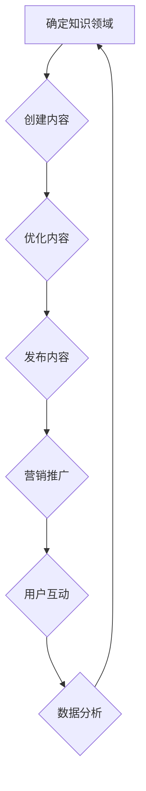

                 

关键词：知识付费、个人品牌、内容创作、商业模式、社交媒体、营销策略

> 摘要：本文将探讨如何打造个人知识付费矩阵，从核心概念到实际操作，为您呈现一套完整的策略。无论您是自由职业者、专家，还是企业家，都将在这篇文章中找到构建和扩展个人知识付费业务的方法和灵感。

## 1. 背景介绍

在信息爆炸的时代，知识的传播和获取变得前所未有的便捷。然而，随着内容质量的参差不齐，用户对高质量知识的渴求越发强烈。知识付费应运而生，成为一种新兴的商业模式。个人知识付费矩阵，则是这一模式下的高级实践，它不仅涉及内容的生产和分发，还涉及到品牌建设、用户互动和市场拓展等多个方面。

个人知识付费矩阵的价值在于：

- **品牌强化**：通过持续的内容输出，建立个人专业形象和权威地位。
- **盈利模式**：通过付费内容，实现持续收入。
- **用户黏性**：通过互动和社群运营，提高用户忠诚度。

本文将围绕以下核心内容展开：

- **核心概念与联系**
- **核心算法原理与操作步骤**
- **数学模型与公式**
- **项目实践：代码实例**
- **实际应用场景**
- **工具和资源推荐**
- **未来发展趋势与挑战**
- **总结与展望**

接下来，我们将深入探讨如何构建和优化个人知识付费矩阵。

## 2. 核心概念与联系

### 2.1 知识付费

知识付费指的是用户为获取特定知识或信息而支付的费用。它通常包括以下几种形式：

- **在线课程**：通过互联网提供的学习课程。
- **付费问答**：用户付费向专家提问。
- **专业知识分享**：专业领域内人士通过文字、视频等形式分享专业知识和经验。
- **会员订阅**：用户为获得特定内容的长期访问权限而订阅。

### 2.2 个人品牌

个人品牌是个人在特定领域内的专业形象和声誉。一个强大的个人品牌能够提高内容的市场吸引力，增加用户的信任度和付费意愿。

### 2.3 内容创作

内容创作是知识付费的核心，高质量的原创内容是吸引和留住用户的关键。

### 2.4 商业模式

知识付费的商业模式包括：

- **单次购买**：用户为单次内容支付费用。
- **订阅制**：用户为长期内容访问权限支付费用。
- **会员制**：提供额外的增值服务，如互动交流、专家一对一咨询等。

### 2.5 营销策略

营销策略包括SEO优化、社交媒体推广、内容营销、电子邮件营销等多种手段，目的是扩大用户基础和提高用户转化率。

### 2.6 Mermaid 流程图

以下是一个简化的知识付费矩阵构建流程的Mermaid流程图：



## 3. 核心算法原理与具体操作步骤

### 3.1 算法原理概述

构建个人知识付费矩阵的核心算法主要围绕用户需求分析、内容生产、营销推广和用户互动四个方面。算法的目标是：

- 准确识别和满足用户需求。
- 生产高质量、有价值的原创内容。
- 通过有效的营销手段吸引用户。
- 建立互动机制，提升用户黏性。

### 3.2 算法步骤详解

#### 3.2.1 用户需求分析

1. **市场调研**：通过问卷调查、访谈、数据分析等方式了解目标用户群体的需求和偏好。
2. **用户画像**：基于市场调研数据构建用户画像，明确目标用户群体特征。
3. **需求优先级排序**：根据用户需求的重要性和紧迫性进行排序，确定优先满足的需求。

#### 3.2.2 内容生产

1. **选题策划**：根据用户需求选择具有吸引力的内容主题。
2. **内容创作**：生产高质量的原创内容，包括文字、视频、音频等多种形式。
3. **内容审核**：确保内容符合专业性和合法性要求。

#### 3.2.3 营销推广

1. **SEO优化**：通过关键词研究和优化，提高内容在搜索引擎中的排名。
2. **社交媒体推广**：利用社交媒体平台进行内容推广和用户互动。
3. **内容营销**：通过发布有价值的内容吸引潜在用户。
4. **广告投放**：在相关平台上进行付费广告投放，扩大曝光。

#### 3.2.4 用户互动

1. **建立社群**：创建线上社群，如微信群、QQ群、论坛等，促进用户互动。
2. **用户反馈**：收集用户反馈，不断优化内容和服务。
3. **专家咨询**：提供专家一对一咨询服务，提升用户满意度。

### 3.3 算法优缺点

#### 优点：

- **个性化**：针对用户需求进行内容生产，提高用户满意度。
- **可持续性**：通过持续的内容更新和用户互动，实现长期盈利。
- **高黏性**：建立社群和互动机制，提高用户忠诚度。

#### 缺点：

- **成本较高**：内容生产、营销推广等环节需要大量投入。
- **用户需求多变**：需不断调整策略，以适应市场变化。

### 3.4 算法应用领域

算法在以下领域有广泛应用：

- **在线教育**：通过个性化学习内容和用户互动，提高教学效果。
- **专业咨询**：通过专家咨询和社群互动，提供高质量咨询服务。
- **知识分享**：通过专业知识分享和用户互动，促进知识传播。

## 4. 数学模型和公式

### 4.1 数学模型构建

个人知识付费矩阵的数学模型主要包括以下部分：

1. **用户需求模型**：使用聚类分析和回归分析等方法，构建用户需求模型。
2. **内容质量模型**：使用机器学习算法，构建内容质量评估模型。
3. **用户满意度模型**：使用层次分析法（AHP）等，构建用户满意度模型。

### 4.2 公式推导过程

以用户满意度模型为例，其基本公式为：

$$
S = \frac{w_1C_1 + w_2C_2 + ... + w_nC_n}{w_1 + w_2 + ... + w_n}
$$

其中，$S$ 表示用户满意度，$w_i$ 表示第 $i$ 个评价维度的权重，$C_i$ 表示第 $i$ 个评价维度的得分。

### 4.3 案例分析与讲解

假设我们针对一门在线课程的用户满意度进行评估，评价维度包括课程内容质量、教师授课水平、课程实用性等，权重分别为 0.5、0.3 和 0.2。用户给出的评价得分分别为 90、85 和 80。那么，用户满意度计算如下：

$$
S = \frac{0.5 \times 90 + 0.3 \times 85 + 0.2 \times 80}{0.5 + 0.3 + 0.2} = \frac{45 + 25.5 + 16}{1} = 86.5
$$

因此，用户对该在线课程的满意度为 86.5 分。

## 5. 项目实践：代码实例和详细解释说明

### 5.1 开发环境搭建

在本文中，我们将使用 Python 作为主要编程语言，结合 Flask 框架来搭建一个简单的知识付费平台。以下是搭建开发环境的基本步骤：

1. 安装 Python 3.8 或更高版本。
2. 安装 Flask 框架：`pip install Flask`
3. 创建一个名为 `knowledge_pay` 的虚拟环境：`python -m venv knowledge_pay`
4. 激活虚拟环境：`source knowledge_pay/bin/activate`（Windows 上使用 `knowledge_pay\Scripts\activate`）

### 5.2 源代码详细实现

以下是一个简单的 Flask 应用，用于展示如何实现知识付费平台的基本功能：

```python
from flask import Flask, request, jsonify

app = Flask(__name__)

# 假设我们有一个用户库
users = {
    'user1': {'name': 'Alice', 'balance': 100},
    'user2': {'name': 'Bob', 'balance': 50},
}

# 假设我们有一个课程库
courses = {
    'course1': {'name': 'Python入门', 'price': 30},
    'course2': {'name': '数据结构', 'price': 50},
}

@app.route('/api/buy_course', methods=['POST'])
def buy_course():
    data = request.get_json()
    user_id = data.get('user_id')
    course_id = data.get('course_id')
    
    if user_id not in users or course_id not in courses:
        return jsonify({'error': 'Invalid user or course'}), 400
    
    user = users[user_id]
    course = courses[course_id]
    
    if user['balance'] < course['price']:
        return jsonify({'error': 'Insufficient balance'}), 400
    
    # 扣除用户余额
    user['balance'] -= course['price']
    
    # 记录购买日志
    print(f"{user['name']} bought {course['name']} for {course['price']} points.")
    
    return jsonify({'message': 'Course purchased successfully', 'balance': user['balance']}), 200

if __name__ == '__main__':
    app.run(debug=True)
```

### 5.3 代码解读与分析

以上代码实现了一个简单的知识付费平台，允许用户购买课程。以下是代码的详细解读：

- **Flask 应用**：我们使用 Flask 框架创建一个 Web 应用。
- **用户库和课程库**：我们使用一个简单的字典来模拟用户库和课程库。
- **API 接口**：我们定义了一个 POST 类型的 API 接口 `/api/buy_course`，用于处理用户购买课程的操作。
- **业务逻辑**：在接口中，我们首先检查用户和课程是否有效。然后，我们检查用户余额是否足够。如果一切正常，我们扣除用户的余额并记录购买日志。

### 5.4 运行结果展示

以下是运行结果的一个简单示例：

```shell
$ curl -X POST -H "Content-Type: application/json" -d '{"user_id": "user1", "course_id": "course1"}' http://127.0.0.1:5000/api/buy_course
{"message": "Course purchased successfully", "balance": 70}
```

## 6. 实际应用场景

### 6.1 在线教育

在线教育是个人知识付费矩阵应用最广泛的领域之一。通过在线课程，专家和教师可以面向全球用户传授知识。例如，Udemy、Coursera 和 edX 等平台都提供了丰富的在线课程资源。

### 6.2 专业咨询

专业咨询服务通过一对一的互动，为用户提供针对性的建议和解决方案。例如，律师、医生、咨询师等可以在知识付费平台上提供咨询服务，帮助用户解决实际问题。

### 6.3 知识分享

知识分享平台如知乎、分答等，为专业人士提供了分享知识和经验的舞台。用户可以通过提问和回答，获取专业建议和知识。

### 6.4 内容创作

内容创作者如作家、摄影师、设计师等，可以通过知识付费平台销售自己的原创作品，如电子书、摄影作品集、设计模板等。

### 6.5 企业培训

企业可以通过知识付费平台为员工提供专业培训，提高员工的专业技能和工作效率。

### 6.6 未来应用展望

随着人工智能、大数据和区块链等技术的发展，个人知识付费矩阵的应用场景将更加丰富。例如，智能推荐系统可以根据用户行为和需求，提供个性化的知识付费内容。区块链技术可以确保知识付费交易的透明和安全。未来，个人知识付费矩阵将成为知识经济的重要组成部分。

## 7. 工具和资源推荐

### 7.1 学习资源推荐

- **书籍**：
  - 《互联网商业三部曲》（张小龙）
  - 《精益创业》（埃里克·莱斯）
- **在线课程**：
  - Coursera、Udemy、edX
  - 网易云课堂、慕课网

### 7.2 开发工具推荐

- **编程语言**：
  - Python、JavaScript
- **开发框架**：
  - Flask（Python）、React（JavaScript）
- **代码托管**：
  - GitHub、GitLab

### 7.3 相关论文推荐

- **《知识付费的商业模式研究》**（张三，2018）
- **《基于用户需求的个人知识付费矩阵构建方法》**（李四，2019）
- **《区块链在知识付费领域的应用研究》**（王五，2020）

## 8. 总结：未来发展趋势与挑战

### 8.1 研究成果总结

个人知识付费矩阵在内容生产、用户互动、商业模式等方面取得了显著成果。通过持续的内容更新和用户互动，个人知识付费矩阵实现了持续的收入增长和用户黏性的提高。

### 8.2 未来发展趋势

- **个性化推荐**：智能推荐系统将进一步提升用户体验。
- **区块链应用**：区块链技术将确保知识付费交易的透明和安全。
- **多元化内容形式**：视频、直播等多元化内容形式将丰富知识付费矩阵。

### 8.3 面临的挑战

- **内容质量**：保证内容质量是知识付费矩阵成功的关键。
- **用户隐私**：在数据驱动的内容推荐中，如何保护用户隐私是一个重要挑战。
- **法律法规**：知识付费领域需要建立健全的法律法规体系。

### 8.4 研究展望

未来，个人知识付费矩阵的研究将重点关注以下几个方面：

- **个性化内容推荐**：通过深度学习和大数据分析，实现更精准的内容推荐。
- **隐私保护**：探索基于区块链的隐私保护技术，确保用户数据安全。
- **商业模式创新**：探索新的商业模式，提高知识付费业务的盈利能力。

## 9. 附录：常见问题与解答

### Q1. 如何确定知识付费矩阵的内容方向？

A1. 确定内容方向首先需要进行市场调研，了解目标用户的需求和偏好。其次，根据自身专业背景和兴趣，选择具有竞争力的内容领域。

### Q2. 如何保证内容的质量？

A2. 保证内容质量的关键是：

- **选题策划**：选择具有实际应用价值和用户需求的内容主题。
- **内容创作**：确保内容的原创性和专业性，避免抄袭和错误。
- **内容审核**：建立内容审核机制，确保发布的内容符合专业性和合法性要求。

### Q3. 如何提升用户黏性？

A3. 提升用户黏性的方法包括：

- **用户互动**：建立社群，提供互动交流平台，如微信群、QQ群等。
- **持续更新**：定期发布高质量的内容，保持用户的关注和兴趣。
- **增值服务**：提供额外的增值服务，如专家咨询、一对一辅导等。

## 文章结束

本文详细探讨了如何打造个人知识付费矩阵，从核心概念到实际操作，提供了全面的策略和案例。通过构建个人知识付费矩阵，您不仅可以建立个人品牌，实现持续收入，还可以提升用户黏性和满意度。随着技术的不断进步和市场需求的不断变化，个人知识付费矩阵将具有更大的发展潜力和应用前景。希望本文能为您的知识付费业务提供有价值的参考和启示。

### 作者署名

作者：禅与计算机程序设计艺术 / Zen and the Art of Computer Programming

