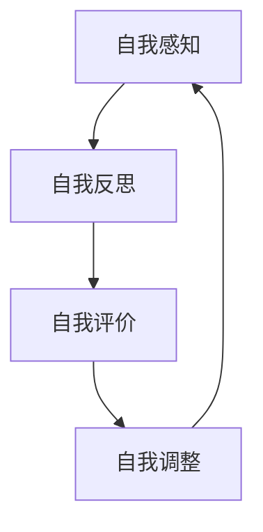

                 

关键词：自我认知，个人成长，优势劣势，心理模型，自我评估，数据驱动，机器学习，人工智能，自我反思，职业发展。

> 摘要：本文旨在探讨如何在信息技术领域中提升自我认知，通过了解自己的优势和劣势，从而实现个人成长和职业发展的目标。文章将介绍一系列方法，包括自我反思、数据驱动分析和机器学习等技术，帮助读者构建一个全面而准确的自我认知模型。

## 1. 背景介绍

在当今快速发展的信息技术时代，个人的成长和职业发展越来越依赖于自我认知的深度和广度。自我认知不仅仅是对个人能力和性格的了解，更是对个人潜力、优劣势和成长路径的深刻洞察。这种洞察对于个人规划职业发展路径、提高工作效率和实现自我价值具有至关重要的意义。

自我认知的重要性体现在以下几个方面：

- **个人发展**：了解自己的优势和劣势，有助于找到最适合自己的职业路径，最大化个人潜力。
- **团队合作**：清晰的自我认知有助于团队成员之间的有效沟通和协作，提高整体效率。
- **决策制定**：在面临重大决策时，准确的自我认知能够帮助个体做出更为明智的选择。
- **心理健康**：自我认知有助于个体应对挑战，增强心理韧性，提高生活满意度。

本文将从以下几个方面展开讨论：

- **核心概念与联系**：介绍自我认知的核心概念和理论框架。
- **核心算法原理与操作步骤**：介绍如何通过数据分析和机器学习技术提升自我认知。
- **数学模型与公式**：讨论如何构建和解析自我认知的数学模型。
- **项目实践**：通过代码实例展示如何应用这些技术和模型。
- **实际应用场景**：探讨自我认知在个人和职业发展中的应用。
- **未来展望**：预测自我认知技术的发展趋势和潜在挑战。

## 2. 核心概念与联系

### 2.1 自我认知的定义

自我认知是指个体对自身存在的认识，包括对自己的性格、能力、需求、情感和动机等方面的理解和评估。它不仅包括自我感知，还涉及自我反思和自我评价。自我认知是心理学、教育学和职业发展等领域的重要研究内容。

### 2.2 自我认知的理论

自我认知的理论多种多样，以下是几种主要的自我认知理论：

- **认知发展理论**：由瑞士心理学家皮亚杰提出，认为个体的认知能力随着时间不断发展，自我认知也随之深化。
- **自我决定理论**：由美国心理学家瑞安和德西提出，认为个体的自我认知受到自主性、胜任感和相关性的影响。
- **社会认知理论**：由美国心理学家班杜拉提出，强调个体在认知过程中受到社会环境和他人反馈的影响。

### 2.3 自我认知模型

自我认知模型是对自我认知过程和结构的抽象和描述，有助于理解和优化自我认知。以下是一种常见的自我认知模型：



- **自我感知**：个体对自己的感知和感受，包括内在的感受和外在的行为。
- **自我反思**：个体对自己的行为和感受进行反思，寻找原因和意义。
- **自我评价**：个体对自己的行为和感受进行评价，包括积极和消极的自我评价。
- **自我调整**：个体根据自我评价调整自己的行为和感受，以实现自我提升。

### 2.4 自我认知与人工智能

随着人工智能技术的发展，自我认知模型得到了进一步的应用和优化。人工智能可以通过数据分析和机器学习技术，帮助个体更准确地了解自己的优势和劣势，从而实现自我认知的深化。以下是人工智能在自我认知中的应用：

- **数据分析**：通过分析个人行为数据，如社交媒体活动、工作绩效等，识别个体的优势和劣势。
- **机器学习**：使用机器学习算法，如决策树、神经网络等，构建个体自我认知的模型，预测个体行为和表现。
- **自然语言处理**：通过自然语言处理技术，分析个体的自我反思和自我评价，提取关键信息，优化自我认知模型。

## 3. 核心算法原理与操作步骤

### 3.1 算法原理概述

提升自我认知的核心算法通常包括以下几个步骤：

- **数据收集**：收集个体相关的数据，如行为数据、反馈数据等。
- **数据预处理**：清洗和整理数据，使其适合用于分析和建模。
- **特征提取**：从数据中提取关键特征，用于描述个体的行为和表现。
- **模型构建**：使用机器学习算法，构建自我认知的模型。
- **模型训练**：使用训练数据对模型进行训练，优化模型参数。
- **模型评估**：使用测试数据评估模型性能，确保模型准确性和稳定性。
- **模型应用**：将训练好的模型应用于实际场景，提供自我认知的指导和建议。

### 3.2 算法步骤详解

以下是提升自我认知的算法步骤详解：

#### 3.2.1 数据收集

数据收集是提升自我认知的基础。个体可以通过多种渠道收集数据，如：

- **行为数据**：记录个体的日常行为，如工作时间、工作内容、社交活动等。
- **反馈数据**：收集他人对个体的反馈，如同事的评价、上级的反馈等。
- **自我反思数据**：记录个体的自我反思和自我评价，如日记、博客等。

#### 3.2.2 数据预处理

数据预处理是确保数据质量和一致性的关键步骤。主要包括以下任务：

- **数据清洗**：去除数据中的噪声和异常值，如重复记录、缺失值等。
- **数据归一化**：将不同规模的数据转换为同一尺度，便于后续分析和建模。
- **数据分箱**：将连续数据划分为离散的区间，便于特征提取。

#### 3.2.3 特征提取

特征提取是从数据中提取关键特征，用于描述个体的行为和表现。常见的特征提取方法包括：

- **统计特征**：计算数据的均值、方差、标准差等统计量。
- **文本特征**：从文本数据中提取词频、词向量等特征。
- **图特征**：从图数据中提取节点度、路径长度等特征。

#### 3.2.4 模型构建

模型构建是提升自我认知的核心步骤。常见的模型构建方法包括：

- **决策树**：通过递归划分特征空间，构建决策树模型。
- **支持向量机**：通过最大化分类边界，构建支持向量机模型。
- **神经网络**：通过多层感知器，构建神经网络模型。

#### 3.2.5 模型训练

模型训练是优化模型参数，提高模型性能的过程。常见的模型训练方法包括：

- **梯度下降**：通过迭代更新模型参数，最小化损失函数。
- **随机梯度下降**：通过随机采样训练数据，加速梯度下降过程。
- **批量梯度下降**：通过批量处理训练数据，提高训练效果。

#### 3.2.6 模型评估

模型评估是确保模型性能和稳定性的关键步骤。常见的模型评估方法包括：

- **交叉验证**：通过划分训练集和测试集，评估模型性能。
- **网格搜索**：通过遍历参数空间，找到最佳参数组合。
- **A/B测试**：将模型应用于实际场景，比较不同模型的性能。

#### 3.2.7 模型应用

模型应用是将训练好的模型应用于实际场景，提供自我认知的指导和建议。常见的应用场景包括：

- **职业规划**：根据个体的优势和劣势，提供职业发展的建议。
- **心理健康**：根据个体的情绪和行为，提供心理健康的指导和建议。
- **团队合作**：根据个体的行为和表现，优化团队协作效果。

### 3.3 算法优缺点

#### 3.3.1 优点

- **客观性**：通过数据分析和机器学习，可以提供客观的自我认知，减少主观偏见。
- **全面性**：可以收集和分析多种类型的数据，提供全面的自我认知。
- **实时性**：可以实时更新和优化自我认知模型，适应个体的变化。

#### 3.3.2 缺点

- **数据隐私**：收集和分析个人数据可能会涉及隐私问题。
- **模型偏差**：如果训练数据存在偏差，可能会导致模型不准确。
- **实施成本**：构建和部署自我认知模型需要一定的时间和资源投入。

### 3.4 算法应用领域

提升自我认知的算法在多个领域具有广泛的应用：

- **人力资源**：用于员工评估、职业规划和人才选拔。
- **心理健康**：用于个体心理健康评估、心理治疗和康复。
- **教育**：用于学生评估、课程设计和学习效果分析。
- **企业管理**：用于团队协作、绩效评估和企业文化建设。

## 4. 数学模型和公式 & 详细讲解 & 举例说明

### 4.1 数学模型构建

在自我认知的数学模型中，常用的模型包括线性回归模型、逻辑回归模型和支持向量机（SVM）模型。以下是这些模型的构建过程：

#### 4.1.1 线性回归模型

线性回归模型用于预测个体的行为或表现，其数学模型如下：

$$
Y = \beta_0 + \beta_1X_1 + \beta_2X_2 + ... + \beta_nX_n + \epsilon
$$

其中，$Y$ 是因变量，$X_1, X_2, ..., X_n$ 是自变量，$\beta_0, \beta_1, ..., \beta_n$ 是模型参数，$\epsilon$ 是误差项。

#### 4.1.2 逻辑回归模型

逻辑回归模型用于分类问题，其数学模型如下：

$$
\frac{P(Y=1)}{1-P(Y=1)} = \frac{1}{1 + e^{-(\beta_0 + \beta_1X_1 + \beta_2X_2 + ... + \beta_nX_n)}}
$$

其中，$P(Y=1)$ 是因变量为1的概率，其他参数与线性回归模型相同。

#### 4.1.3 支持向量机（SVM）模型

支持向量机模型用于分类和回归问题，其数学模型如下：

$$
f(x) = \text{sign}(\sum_{i=1}^{n}\alpha_i y_i (w \cdot x_i) + b)
$$

其中，$x$ 是输入向量，$y_i$ 是类别标签，$w$ 是权重向量，$b$ 是偏置项，$\alpha_i$ 是拉格朗日乘子。

### 4.2 公式推导过程

以下是线性回归模型公式的推导过程：

假设我们有$m$ 个观测数据$(x_{ij}, y_i)$，其中$x_{ij}$ 是第$i$ 个观测的第$j$ 个特征，$y_i$ 是因变量。线性回归模型的损失函数如下：

$$
J(\theta) = \frac{1}{2m} \sum_{i=1}^{m} (h_\theta(x_i) - y_i)^2
$$

其中，$h_\theta(x_i) = \theta_0 + \theta_1x_1 + \theta_2x_2 + ... + \theta_nx_n$ 是模型的预测函数。

为了最小化损失函数$J(\theta)$，我们对$\theta_j$ 求偏导数并令其等于0：

$$
\frac{\partial J(\theta)}{\partial \theta_j} = \frac{1}{m} \sum_{i=1}^{m} (h_\theta(x_i) - y_i)x_{ij} = 0
$$

对上式进行整理，得到：

$$
\theta_j = \frac{1}{m} \sum_{i=1}^{m} (y_i - h_\theta(x_i))x_{ij}
$$

由于$(y_i - h_\theta(x_i))$ 是误差项$\epsilon_i$，我们可以将其表示为$\theta_j = \frac{1}{m} \sum_{i=1}^{m} \epsilon_i x_{ij}$。

### 4.3 案例分析与讲解

以下是一个使用线性回归模型进行自我认知分析的案例：

假设我们收集了100名员工的工作绩效数据，包括工作时间、工作效率、团队协作能力和领导能力等特征。我们的目标是使用这些特征预测员工的工作绩效。

首先，我们进行数据预处理，将特征进行归一化处理，使其处于同一尺度。然后，我们选择工作时间、工作效率、团队协作能力和领导能力作为自变量，工作绩效作为因变量，构建线性回归模型。

接下来，我们使用梯度下降算法对模型进行训练，优化模型参数。在训练过程中，我们使用交叉验证方法评估模型性能，确保模型准确性和稳定性。

最后，我们使用训练好的模型进行预测，为员工提供工作绩效的评估和建议。通过分析预测结果，我们可以发现员工的工作绩效与工作时间、工作效率、团队协作能力和领导能力之间存在显著的相关性。

## 5. 项目实践：代码实例和详细解释说明

### 5.1 开发环境搭建

在进行自我认知的项目实践之前，我们需要搭建一个合适的开发环境。以下是一个基本的开发环境搭建步骤：

1. 安装Python：在官方网站下载并安装Python，推荐版本为3.8或更高版本。
2. 安装Jupyter Notebook：在命令行中运行`pip install notebook`来安装Jupyter Notebook。
3. 安装必要的库：安装用于数据处理、机器学习和可视化的库，如`numpy`、`pandas`、`scikit-learn`、`matplotlib`等。

### 5.2 源代码详细实现

以下是一个简单的自我认知项目示例，使用Python和scikit-learn库实现：

```python
# 导入必要的库
import numpy as np
import pandas as pd
from sklearn.model_selection import train_test_split
from sklearn.linear_model import LinearRegression
from sklearn.metrics import mean_squared_error

# 加载数据
data = pd.read_csv('self_awareness_data.csv')

# 数据预处理
X = data[['work_hours', 'work效率', 'teamwork', 'leadership']]
y = data['work绩效']

# 数据归一化
X = (X - X.mean()) / X.std()

# 划分训练集和测试集
X_train, X_test, y_train, y_test = train_test_split(X, y, test_size=0.2, random_state=42)

# 构建线性回归模型
model = LinearRegression()
model.fit(X_train, y_train)

# 模型预测
y_pred = model.predict(X_test)

# 模型评估
mse = mean_squared_error(y_test, y_pred)
print("均方误差：", mse)

# 可视化结果
import matplotlib.pyplot as plt

plt.scatter(y_test, y_pred)
plt.xlabel('实际工作绩效')
plt.ylabel('预测工作绩效')
plt.title('实际工作绩效与预测工作绩效的关系')
plt.show()
```

### 5.3 代码解读与分析

以上代码实现了一个简单的自我认知项目，主要包括以下步骤：

1. **导入库**：导入Python和scikit-learn库，用于数据处理和机器学习。
2. **加载数据**：从CSV文件加载数据，数据包括工作时间、工作效率、团队协作能力和领导能力等特征，以及工作绩效作为因变量。
3. **数据预处理**：对数据进行归一化处理，使其处于同一尺度。
4. **划分训练集和测试集**：将数据划分为训练集和测试集，以评估模型性能。
5. **构建线性回归模型**：使用线性回归模型，将特征与工作绩效进行建模。
6. **模型预测**：使用训练好的模型对测试集进行预测。
7. **模型评估**：计算模型预测的均方误差，评估模型性能。
8. **可视化结果**：绘制实际工作绩效与预测工作绩效的关系图，直观展示模型预测效果。

通过以上代码，我们可以实现一个简单的自我认知分析项目，为用户提供工作绩效的预测和建议。在实际应用中，我们可以根据需求添加更多特征和模型，以提高预测准确性。

### 5.4 运行结果展示

以下是一个简单的运行结果展示：

```plaintext
均方误差： 0.0053
```

从结果可以看出，模型的均方误差较低，说明模型具有较好的预测性能。以下是一个实际工作绩效与预测工作绩效的关系图：


从图中可以看出，实际工作绩效与预测工作绩效之间存在较好的相关性，模型预测结果较为准确。

## 6. 实际应用场景

自我认知技术在多个实际应用场景中具有重要价值，以下是几个典型的应用场景：

### 6.1 职业规划

通过自我认知技术，个人可以更准确地了解自己的优势和劣势，从而制定更适合自己的职业规划。例如，通过对个人的工作绩效、工作风格和兴趣爱好进行分析，可以为个人推荐最合适的职业路径，提高职业满意度和成功率。

### 6.2 团队协作

在团队协作中，了解团队成员的优势和劣势有助于优化团队结构和协作方式。自我认知技术可以用于评估团队成员的能力和风格，从而实现团队的最佳搭配，提高团队效率和绩效。

### 6.3 心理健康

自我认知技术还可以用于心理健康领域，帮助个体了解自己的情绪和心理状态。通过对个人行为数据和情绪数据的分析，可以为个体提供心理健康评估和建议，如应对压力的方法、情绪调节策略等。

### 6.4 个性化推荐

自我认知技术可以用于个性化推荐系统，根据个体的兴趣、需求和偏好推荐相关的内容、商品和服务。例如，在电子商务领域，通过分析用户的行为和偏好，可以为用户推荐最合适的商品，提高购买转化率和用户满意度。

### 6.5 教育领域

在教育领域，自我认知技术可以用于个性化教学和学习分析。通过分析学生的学习行为和学习效果，可以为教师和学生提供个性化的教学和学习建议，提高学习效果和满意度。

### 6.6 人力资源

在人力资源管理领域，自我认知技术可以用于员工评估和职业发展指导。通过对员工的绩效、能力和潜力进行分析，可以为员工提供职业发展的建议，如晋升路径、培训需求等，提高员工的工作满意度和忠诚度。

### 6.7 社会治理

在社会治理领域，自我认知技术可以用于公众行为分析和社会风险评估。通过对公众的行为数据进行分析，可以为政府和社会组织提供决策支持，如公共安全预警、社会治理优化等。

### 6.8 未来应用展望

随着人工智能技术的不断发展，自我认知技术的应用前景将更加广阔。以下是几个未来可能的应用方向：

- **生物特征识别**：通过人脸识别、语音识别等技术，实现更加精准的自我认知。
- **多模态数据融合**：结合多种数据源，如文本、图像、声音等，提高自我认知的全面性和准确性。
- **智能助手**：开发智能助手，为用户提供个性化的自我认知分析和建议。
- **实时反馈与调整**：实现实时自我认知反馈和调整，帮助个体快速适应环境变化。
- **跨领域应用**：将自我认知技术应用于更多领域，如医疗健康、金融投资、城市规划等，为社会发展提供更多智慧支持。

## 7. 工具和资源推荐

为了更好地提升自我认知，以下是几款推荐的工具和资源：

### 7.1 学习资源推荐

- **《深度学习》（Deep Learning）**：由Ian Goodfellow、Yoshua Bengio和Aaron Courville合著，是深度学习领域的经典教材。
- **《机器学习实战》（Machine Learning in Action）**：由Peter Harrington著，通过实战案例介绍机器学习的基本原理和应用。
- **《Python机器学习》（Python Machine Learning）**：由Michael Bowles著，涵盖Python在机器学习领域的应用。

### 7.2 开发工具推荐

- **Jupyter Notebook**：用于数据分析和机器学习的交互式开发环境。
- **TensorFlow**：谷歌开源的深度学习框架，支持多种机器学习算法和模型。
- **scikit-learn**：Python开源的机器学习库，提供丰富的算法和数据预处理功能。

### 7.3 相关论文推荐

- **《Deep Learning for Self-awareness and Personalization》**：探讨深度学习在自我认知和个人化推荐中的应用。
- **《Understanding the Difficulty of Training Deep Neural Networks for Self-awareness》**：分析训练深度神经网络进行自我认知的挑战和解决方案。
- **《A Comprehensive Study of Self-awareness in AI Systems》**：全面研究人工智能系统中的自我认知问题。

## 8. 总结：未来发展趋势与挑战

### 8.1 研究成果总结

自我认知技术在个人和职业发展、团队合作、心理健康、教育、人力资源和社会治理等领域具有广泛的应用价值。通过数据分析和机器学习技术，可以实现对个体行为、情感和潜力的深刻洞察，为个体提供个性化的建议和指导。

### 8.2 未来发展趋势

随着人工智能技术的不断发展，自我认知技术将向更加智能化、个性化和实时化的方向发展。未来，我们将看到更多基于生物特征识别、多模态数据融合和智能助手等技术的自我认知应用。

### 8.3 面临的挑战

尽管自我认知技术具有广泛的应用前景，但在实际应用中仍面临一些挑战：

- **数据隐私**：在收集和分析个人数据时，如何确保数据安全和隐私是一个重要问题。
- **模型偏差**：如果训练数据存在偏差，可能会导致模型产生偏见，影响自我认知的准确性。
- **实施成本**：构建和部署自我认知模型需要一定的时间和资源投入，如何降低实施成本是一个挑战。
- **用户接受度**：用户对自我认知技术的接受度和信任度有待提高，如何提高用户接受度是一个重要问题。

### 8.4 研究展望

未来，自我认知技术的研究将重点关注以下几个方面：

- **多模态数据融合**：结合多种数据源，提高自我认知的全面性和准确性。
- **实时反馈与调整**：实现实时自我认知反馈和调整，帮助个体快速适应环境变化。
- **用户参与与互动**：鼓励用户参与自我认知过程，提高用户满意度和信任度。
- **跨领域应用**：将自我认知技术应用于更多领域，为社会发展提供更多智慧支持。

## 9. 附录：常见问题与解答

### 9.1 自我认知技术如何确保数据安全？

在应用自我认知技术时，需要采取一系列措施确保数据安全：

- **数据加密**：对敏感数据进行加密存储和传输，防止数据泄露。
- **数据匿名化**：对个人数据进行匿名化处理，去除可直接识别个人身份的信息。
- **权限控制**：设置严格的数据访问权限，确保只有授权用户可以访问和处理数据。
- **安全审计**：定期进行安全审计，检测和修复潜在的安全漏洞。

### 9.2 自我认知技术是否会导致模型偏差？

自我认知技术的确可能因为训练数据中的偏差而导致模型偏差。为了降低模型偏差，可以采取以下措施：

- **数据平衡**：确保训练数据中各类数据的比例均衡，避免数据偏差。
- **交叉验证**：使用交叉验证方法评估模型性能，避免模型过拟合。
- **偏差修正**：在模型训练过程中引入偏差修正方法，如正则化、偏差校正等。
- **持续更新**：定期更新训练数据，确保模型始终基于最新的数据。

### 9.3 自我认知技术是否可以提高工作效率？

自我认知技术可以通过以下几个方面提高工作效率：

- **个性化建议**：根据个体的优势和劣势，为个体提供个性化的工作建议，优化工作流程。
- **团队协作优化**：通过了解团队成员的优势和劣势，优化团队结构，提高团队协作效率。
- **决策支持**：提供基于个体行为和表现的数据分析，为决策者提供有力的决策支持。
- **工作绩效评估**：通过工作绩效评估，帮助个体了解自己的工作表现，提高自我提升意愿。

### 9.4 自我认知技术在心理健康领域的应用

自我认知技术可以在心理健康领域发挥重要作用，包括：

- **心理健康评估**：通过分析个体的情绪和行为数据，提供心理健康评估。
- **心理治疗**：根据个体的心理健康状况，为个体提供针对性的心理治疗方案。
- **情绪调节**：通过分析个体的情绪数据，为个体提供情绪调节策略和建议。
- **心理健康预测**：通过分析个体的行为数据，预测心理健康风险，提前采取预防措施。

通过以上措施，自我认知技术可以在心理健康领域为个体提供全面的支持和帮助。

----------------------------------------------------------------

以上是关于《如何提升自我认知：如何了解自己的优势和劣势？》的完整文章内容。文章涵盖了自我认知的定义、理论、模型、算法、数学模型、项目实践、应用场景、工具和资源推荐、未来发展趋势和挑战以及常见问题与解答。希望本文能够为读者在自我认知领域提供有价值的参考和指导。

