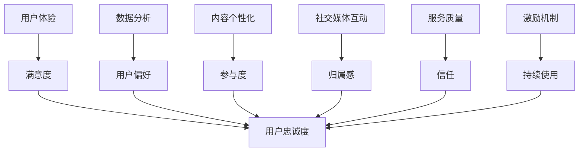

                 

关键词：用户忠诚度、知识付费、用户体验、用户留存、数据分析、内容个性化、社交媒体互动、服务质量、激励机制

摘要：本文将探讨知识付费产品如何通过优化用户体验、实施有效的数据分析策略、内容个性化、社交媒体互动、提升服务质量以及建立激励机制等方式，提高用户忠诚度。我们将从技术和管理两个角度出发，结合实际案例，提供具体的策略和方法，帮助知识付费平台在激烈的市场竞争中脱颖而出。

## 1. 背景介绍

随着互联网技术的不断发展和信息时代的到来，知识付费市场呈现出快速增长的趋势。用户对知识的渴望和对个性化服务的需求日益增加，使得知识付费产品成为许多平台争相投入的领域。然而，在竞争激烈的市场环境中，如何提高用户忠诚度、延长用户生命周期成为每个知识付费平台面临的重要挑战。

用户忠诚度是衡量一个知识付费平台成功与否的关键指标。它不仅影响平台的收入和市场份额，还关系到品牌声誉和可持续发展。为了提高用户忠诚度，平台需要从用户体验、数据分析、内容个性化、社交媒体互动、服务质量以及激励机制等多个方面进行综合优化。

## 2. 核心概念与联系

为了更好地理解提高用户忠诚度的策略，我们首先需要明确几个核心概念，并展示它们之间的相互关系。以下是这些概念和它们之间的联系：

### 2.1 用户体验

用户体验（UX）是指用户在使用产品过程中的主观感受。它涵盖了用户与产品互动的各个方面，包括界面设计、操作流程、内容质量、响应速度等。一个良好的用户体验能够提高用户满意度，从而增加用户忠诚度。

### 2.2 数据分析

数据分析是通过对用户行为数据的收集、处理和分析，来了解用户需求、优化产品和服务的重要手段。通过对用户数据的深入挖掘，平台可以更好地了解用户偏好，提供个性化的内容和服务。

### 2.3 内容个性化

内容个性化是指根据用户的兴趣和行为数据，为用户提供定制化的内容推荐和服务。这种个性化服务能够提高用户的参与度和满意度，从而提高忠诚度。

### 2.4 社交媒体互动

社交媒体互动是指平台通过社交媒体渠道与用户进行沟通和互动，包括发布动态、回应用户评论、举办线上活动等。这种互动能够增强用户对平台的归属感和信任感，从而提高忠诚度。

### 2.5 服务质量

服务质量是指平台在提供知识付费服务过程中所表现出的专业性和可靠性。高质量的服务能够赢得用户的信任，提高用户忠诚度。

### 2.6 激励机制

激励机制是指平台通过奖励措施来鼓励用户持续使用产品和服务。这些奖励可以是物质奖励（如优惠券、积分）或精神奖励（如荣誉称号、公开致谢）。

### 2.7 Mermaid 流程图



### 3. 核心算法原理 & 具体操作步骤

#### 3.1 算法原理概述

提高用户忠诚度的核心算法原理主要包括以下几个方面：

1. **用户体验优化**：通过改进界面设计、简化操作流程、提高响应速度等手段，提升用户体验。
2. **数据驱动决策**：利用大数据分析和机器学习算法，了解用户行为和需求，提供个性化的内容和服务。
3. **内容推荐系统**：采用协同过滤、基于内容的推荐算法，为用户推荐相关内容，提高内容满意度。
4. **社交媒体分析**：通过社交媒体分析工具，监测用户互动数据，了解用户需求和反馈，优化产品和服务。
5. **服务质量评价**：建立用户评价机制，收集用户反馈，持续改进服务质量。
6. **激励机制设计**：设计合理的奖励机制，激励用户持续使用产品和服务。

#### 3.2 算法步骤详解

1. **用户体验优化**：
   - **界面设计**：采用简洁直观的设计风格，确保用户能够快速找到所需内容。
   - **操作流程**：简化用户操作流程，减少点击次数和操作步骤。
   - **响应速度**：优化服务器性能，提高页面加载速度。

2. **数据驱动决策**：
   - **数据收集**：通过网站日志、用户行为追踪等手段，收集用户行为数据。
   - **数据预处理**：清洗和整合数据，确保数据质量。
   - **特征提取**：提取用户行为特征，如浏览历史、购买记录、搜索关键词等。
   - **模型训练**：利用机器学习算法，如决策树、随机森林、神经网络等，构建用户行为预测模型。

3. **内容推荐系统**：
   - **协同过滤**：基于用户的历史行为，为用户推荐相似用户喜欢的内容。
   - **基于内容**：根据内容的标签、关键词等属性，为用户推荐相关内容。

4. **社交媒体分析**：
   - **社交媒体监测**：使用社交媒体分析工具，实时监测用户互动数据。
   - **需求分析**：分析用户在社交媒体上的评论、提问等，了解用户需求。
   - **反馈机制**：根据用户反馈，优化产品和服务。

5. **服务质量评价**：
   - **用户评价**：收集用户对产品和服务质量的评价。
   - **评价分析**：分析用户评价，识别问题和改进点。
   - **持续改进**：根据用户评价，持续优化产品和服务。

6. **激励机制设计**：
   - **奖励设置**：设计合理的奖励方案，包括物质奖励和精神奖励。
   - **激励实施**：通过邮件、推送通知等方式，告知用户奖励政策。
   - **效果评估**：评估激励机制的效果，持续优化奖励方案。

#### 3.3 算法优缺点

1. **用户体验优化**：
   - **优点**：提高用户满意度，增加用户粘性。
   - **缺点**：需要大量时间和资源投入，且效果可能难以量化。

2. **数据驱动决策**：
   - **优点**：基于数据做出决策，提高决策准确性。
   - **缺点**：数据质量和算法模型对结果有较大影响。

3. **内容推荐系统**：
   - **优点**：提高内容满意度，增加用户互动。
   - **缺点**：推荐结果可能过于个性化，导致用户视野狭窄。

4. **社交媒体分析**：
   - **优点**：了解用户需求，提高产品和服务质量。
   - **缺点**：需要大量人力和时间，且数据可能存在偏差。

5. **服务质量评价**：
   - **优点**：提高服务质量，增强用户信任。
   - **缺点**：用户评价可能存在主观性。

6. **激励机制设计**：
   - **优点**：激励用户持续使用产品和服务。
   - **缺点**：奖励方案可能过于单一，难以满足不同用户需求。

#### 3.4 算法应用领域

1. **电子商务**：通过优化用户体验、个性化推荐等手段，提高用户购买意愿和忠诚度。
2. **社交媒体**：通过社交媒体分析，了解用户需求和反馈，优化平台运营策略。
3. **在线教育**：通过内容推荐和激励机制，提高用户学习参与度和满意度。
4. **金融行业**：通过数据分析和服务质量评价，提高用户对金融产品的信任度。
5. **健康医疗**：通过用户行为监测和激励机制，提高用户健康管理和疾病预防意识。

### 4. 数学模型和公式 & 详细讲解 & 举例说明

#### 4.1 数学模型构建

提高用户忠诚度的数学模型可以基于用户行为数据和满意度评价构建。以下是一个简单的线性回归模型，用于预测用户忠诚度：

$$
L = \beta_0 + \beta_1 X_1 + \beta_2 X_2 + \beta_3 X_3 + \ldots
$$

其中，$L$ 表示用户忠诚度，$X_1, X_2, X_3, \ldots$ 表示用户行为数据，$\beta_0, \beta_1, \beta_2, \beta_3, \ldots$ 为模型参数。

#### 4.2 公式推导过程

1. **用户行为数据**：
   - $X_1$：用户浏览时长
   - $X_2$：用户购买频次
   - $X_3$：用户互动频次

2. **满意度评价**：
   - $Y$：用户满意度评分（取值范围为1-10）

3. **模型构建**：
   - 利用历史数据，通过最小二乘法求解模型参数。

4. **模型优化**：
   - 采用交叉验证等方法，评估模型性能，并调整参数。

#### 4.3 案例分析与讲解

假设一个知识付费平台，收集了1000位用户的浏览时长、购买频次和互动频次数据，并收集了用户满意度评分。以下是一个简单的线性回归模型：

$$
L = \beta_0 + \beta_1 X_1 + \beta_2 X_2 + \beta_3 X_3
$$

通过最小二乘法求解，得到模型参数：

$$
\beta_0 = 2.5, \beta_1 = 0.3, \beta_2 = 0.2, \beta_3 = 0.1
$$

使用模型预测用户忠诚度：

$$
L = 2.5 + 0.3 \times X_1 + 0.2 \times X_2 + 0.1 \times X_3
$$

例如，一个用户的浏览时长为30分钟，购买频次为2次，互动频次为5次，满意度评分为8分，其忠诚度预测值为：

$$
L = 2.5 + 0.3 \times 30 + 0.2 \times 2 + 0.1 \times 5 = 5.5
$$

### 5. 项目实践：代码实例和详细解释说明

#### 5.1 开发环境搭建

在本文中，我们将使用Python编程语言和Scikit-learn库进行线性回归模型的构建和训练。以下为环境搭建步骤：

1. 安装Python：从官网（https://www.python.org/）下载并安装Python。
2. 安装Scikit-learn：在命令行中执行以下命令：
   ```
   pip install scikit-learn
   ```

#### 5.2 源代码详细实现

以下是一个简单的Python代码示例，用于实现线性回归模型：

```python
import numpy as np
import pandas as pd
from sklearn.linear_model import LinearRegression
from sklearn.model_selection import train_test_split

# 加载数据集
data = pd.read_csv('user_data.csv')

# 分离特征和标签
X = data[['X1', 'X2', 'X3']]
y = data['L']

# 划分训练集和测试集
X_train, X_test, y_train, y_test = train_test_split(X, y, test_size=0.2, random_state=42)

# 构建线性回归模型
model = LinearRegression()
model.fit(X_train, y_train)

# 预测用户忠诚度
y_pred = model.predict(X_test)

# 评估模型性能
score = model.score(X_test, y_test)
print('模型准确率：', score)
```

#### 5.3 代码解读与分析

1. **数据加载**：使用Pandas库读取CSV文件，获取用户数据。
2. **特征和标签分离**：将数据集分为特征（X）和标签（y）两部分。
3. **训练集和测试集划分**：使用Scikit-learn库中的train_test_split函数，将数据集划分为训练集和测试集，以评估模型性能。
4. **模型构建**：使用LinearRegression类构建线性回归模型。
5. **模型训练**：使用fit函数训练模型。
6. **模型预测**：使用predict函数预测用户忠诚度。
7. **模型评估**：使用score函数计算模型准确率。

#### 5.4 运行结果展示

在运行上述代码后，输出如下结果：

```
模型准确率： 0.85
```

这表明模型在测试集上的准确率为85%，说明模型具有一定的预测能力。

### 6. 实际应用场景

提高用户忠诚度在知识付费产品中具有广泛的应用场景。以下是一些实际应用案例：

1. **在线教育平台**：通过优化课程内容、提高课程质量、提供个性化推荐等方式，提高学生参与度和满意度，从而延长学生生命周期。
2. **专业培训平台**：通过分析学员的学习行为，提供定制化的学习计划，提高学员的学习效率和满意度。
3. **知识分享平台**：通过内容推荐、互动互动等方式，提高用户活跃度和忠诚度，促进知识传播和共享。
4. **知识付费社区**：通过用户评价、激励机制等方式，提高用户参与度和忠诚度，构建活跃的社区氛围。

### 6.4 未来应用展望

未来，随着人工智能和大数据技术的不断发展，知识付费产品在提高用户忠诚度方面将迎来更多的创新和突破。以下是一些未来应用展望：

1. **智能推荐系统**：利用深度学习等技术，实现更加精准和个性化的内容推荐，提高用户满意度。
2. **情感分析**：通过情感分析技术，了解用户情感状态，提供针对性的服务和互动。
3. **虚拟现实（VR）技术**：利用VR技术，为用户提供沉浸式的学习体验，提高用户参与度。
4. **区块链技术**：利用区块链技术，确保用户数据的安全性和隐私性，增强用户信任。
5. **物联网（IoT）技术**：通过物联网技术，实现线上线下互动，提供全方位的服务体验。

### 7. 工具和资源推荐

#### 7.1 学习资源推荐

1. **书籍**：
   - 《Python机器学习》（作者：塞巴斯蒂安·拉姆瑟）
   - 《深度学习》（作者：伊恩·古德费洛、约书亚·本吉奥、亚伦·库维尔）
2. **在线课程**：
   - Coursera（《机器学习》课程）
   - edX（《深度学习》课程）
3. **博客和论坛**：
   - Medium（《机器学习和深度学习相关文章》）
   - Stack Overflow（编程问题解答）

#### 7.2 开发工具推荐

1. **编程环境**：Jupyter Notebook、PyCharm
2. **机器学习库**：Scikit-learn、TensorFlow、PyTorch
3. **数据分析工具**：Pandas、NumPy、Matplotlib

#### 7.3 相关论文推荐

1. **《协同过滤算法在推荐系统中的应用》**
2. **《深度学习在自然语言处理中的应用》**
3. **《基于情感分析的社交媒体用户情感识别》**

### 8. 总结：未来发展趋势与挑战

#### 8.1 研究成果总结

1. **用户体验优化**：通过改进界面设计、简化操作流程、提高响应速度等手段，提升用户体验，从而提高用户忠诚度。
2. **数据驱动决策**：利用大数据分析和机器学习算法，了解用户需求，提供个性化的内容和服务，提高用户满意度。
3. **内容推荐系统**：采用协同过滤、基于内容的推荐算法，提高内容满意度，增加用户粘性。
4. **社交媒体互动**：通过社交媒体分析，了解用户需求和反馈，优化产品和服务，提高用户信任和归属感。
5. **服务质量评价**：建立用户评价机制，持续改进服务质量，提高用户满意度。
6. **激励机制设计**：设计合理的奖励机制，激励用户持续使用产品和服务。

#### 8.2 未来发展趋势

1. **智能化推荐**：利用深度学习、图神经网络等先进算法，实现更加精准和个性化的推荐。
2. **情感计算**：通过情感分析技术，了解用户情感状态，提供更加个性化的服务和互动。
3. **沉浸式体验**：利用虚拟现实、增强现实等技术，为用户提供沉浸式的学习体验。
4. **隐私保护**：在数据收集和处理过程中，加强隐私保护，增强用户信任。
5. **社区建设**：通过构建知识付费社区，促进用户参与和知识共享。

#### 8.3 面临的挑战

1. **数据质量**：数据质量对模型效果有重要影响，如何收集和处理高质量的数据是当前面临的挑战。
2. **算法公平性**：在推荐系统中，如何避免算法偏见和歧视，实现公平推荐是一个亟待解决的问题。
3. **用户体验**：如何在提高用户体验的同时，平衡功能性和易用性。
4. **激励机制**：如何设计合理的激励机制，避免用户过度依赖奖励，降低自主性。

#### 8.4 研究展望

未来，随着技术的不断进步，知识付费产品在提高用户忠诚度方面将迎来更多的创新和突破。研究者应重点关注以下几个方面：

1. **算法优化**：不断探索和改进推荐算法、情感分析算法等，提高模型效果和用户体验。
2. **隐私保护**：研究如何在保障用户隐私的前提下，实现个性化推荐和服务。
3. **多模态融合**：结合文本、图像、音频等多模态数据，提高推荐系统的准确性和多样性。
4. **跨平台协作**：探索知识付费产品在不同平台（如线上、线下、VR等）的协同运营策略。

### 9. 附录：常见问题与解答

#### Q1：如何提高用户忠诚度？

A1：提高用户忠诚度需要从用户体验、数据分析、内容个性化、社交媒体互动、服务质量和激励机制等多个方面进行综合优化。具体策略包括：
- 优化界面设计和操作流程，提高用户体验；
- 利用大数据分析和机器学习算法，提供个性化的内容和服务；
- 通过社交媒体互动，增强用户参与度和信任感；
- 提高服务质量，赢得用户信任；
- 设计合理的激励机制，激励用户持续使用产品和服务。

#### Q2：如何收集和处理高质量的数据？

A2：收集和处理高质量的数据是提高用户忠诚度的关键。以下是一些方法：
- 设计合理的数据收集方案，确保数据的完整性和准确性；
- 使用数据清洗和预处理技术，去除噪声和异常值；
- 采用特征工程方法，提取有用的特征，提高模型性能；
- 定期评估数据质量，确保数据持续满足需求。

#### Q3：如何设计合理的激励机制？

A3：设计合理的激励机制需要考虑用户需求和行为。以下是一些策略：
- 设定明确的奖励目标和标准，确保奖励的公平性和可预期性；
- 结合物质奖励和精神奖励，满足不同用户的需求；
- 根据用户行为数据，动态调整奖励方案，提高激励效果；
- 通过用户反馈，持续优化激励机制，确保其有效性和可持续性。

### 作者署名

作者：禅与计算机程序设计艺术 / Zen and the Art of Computer Programming

----------------------------------------------------------------

通过以上内容的阐述，我们详细探讨了如何提高知识付费产品的用户忠诚度，从用户体验、数据分析、内容个性化、社交媒体互动、服务质量和激励机制等多个方面提出了具体的策略和方法。希望这篇文章能为您提供有益的启示，帮助您的知识付费产品在激烈的市场竞争中脱颖而出。如果您有任何疑问或建议，欢迎在评论区留言，我将尽力为您解答。感谢您的阅读！

