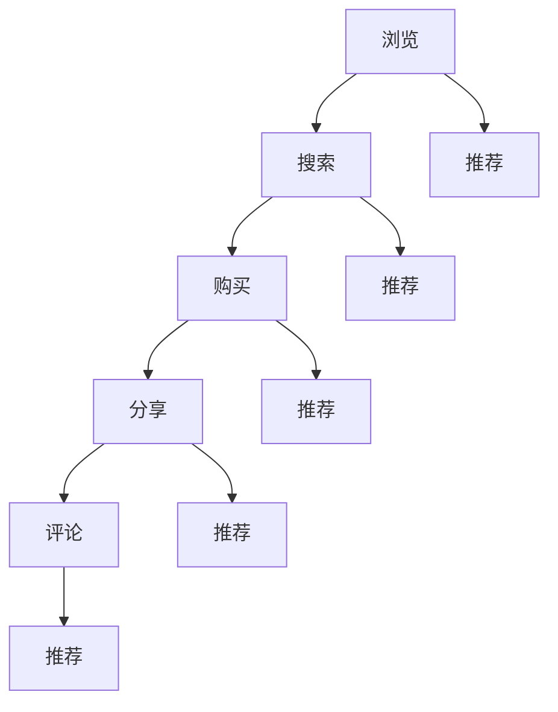
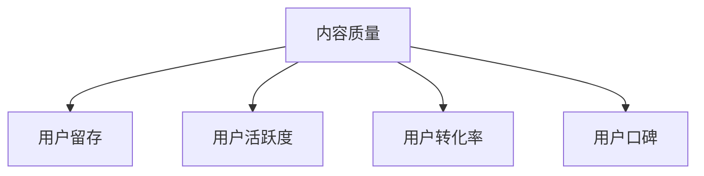
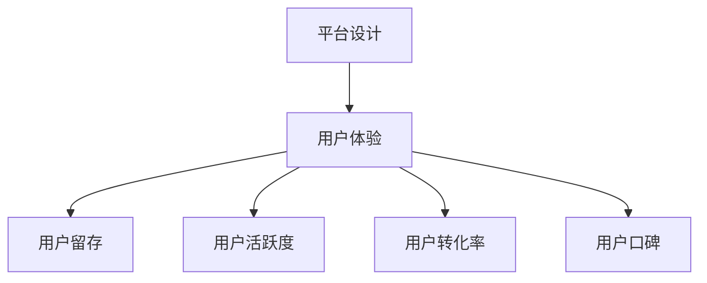
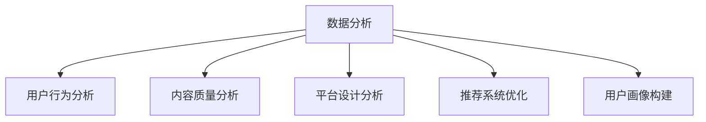

                 

关键词：用户活跃度、知识付费、产品设计、数据分析、社交互动、激励机制

> 摘要：随着知识付费市场的不断壮大，提高知识付费产品的用户活跃度成为各大平台和开发者亟待解决的关键问题。本文将深入探讨影响用户活跃度的核心因素，并通过具体的算法原理、数学模型、项目实践以及未来展望，为知识付费产品提供一套完整的提升用户活跃度的策略。

## 1. 背景介绍

知识付费作为一种新兴的商业模式，近年来在全球范围内迅速崛起。用户通过付费获取专业知识和技能，平台则通过提供高质量的内容获得收益。然而，知识付费产品的市场竞争日益激烈，如何提高用户活跃度，成为平台和内容创作者关注的焦点。

用户活跃度的提升不仅能够增加平台的收入，还能提高内容创作者的曝光度和信誉度。因此，研究如何提高知识付费产品的用户活跃度具有重要意义。本文将从以下几个方面展开讨论：

1. **核心概念与联系**：介绍影响用户活跃度的核心概念，包括用户行为、内容质量、平台设计等，并通过Mermaid流程图展示其相互关系。
2. **核心算法原理与具体操作步骤**：探讨提升用户活跃度的核心算法原理，包括推荐系统、社交网络分析等，并提供具体操作步骤。
3. **数学模型和公式**：建立数学模型，推导相关公式，用于分析和优化用户活跃度。
4. **项目实践：代码实例和详细解释说明**：通过具体项目实例，展示提升用户活跃度的实际操作。
5. **实际应用场景**：探讨知识付费产品在不同领域的应用，以及未来发展方向。
6. **工具和资源推荐**：推荐学习资源和开发工具，为读者提供实践指导。
7. **总结与展望**：总结研究成果，展望未来发展趋势和挑战。

## 2. 核心概念与联系

### 2.1 用户行为分析

用户行为是影响活跃度的关键因素。通过对用户行为的分析，可以了解用户的需求、喜好和互动模式。常见的用户行为包括浏览、搜索、购买、分享、评论等。以下是一个简单的Mermaid流程图，展示了用户行为的相互关系：



### 2.2 内容质量

内容质量是用户留存和活跃度的核心。高质量的内容能够满足用户需求，提升用户体验。以下是一个简单的Mermaid流程图，展示了内容质量与其他因素的关系：



### 2.3 平台设计

平台设计直接影响用户的交互体验。良好的用户体验能够增加用户粘性，提高活跃度。以下是一个简单的Mermaid流程图，展示了平台设计与其他因素的关系：



### 2.4 数据分析

数据分析是提升用户活跃度的关键手段。通过对用户行为、内容质量和平台设计的数据分析，可以识别问题并提出解决方案。以下是一个简单的Mermaid流程图，展示了数据分析的应用场景：



## 3. 核心算法原理与具体操作步骤

### 3.1 算法原理概述

提升用户活跃度的核心算法包括推荐系统、社交网络分析和激励机制。以下是对这些算法的简要概述：

1. **推荐系统**：通过分析用户历史行为和内容特征，为用户推荐感兴趣的内容。
2. **社交网络分析**：通过分析用户社交关系，挖掘潜在的兴趣点和互动机会。
3. **激励机制**：通过奖励机制，鼓励用户参与平台互动，提高活跃度。

### 3.2 算法步骤详解

#### 3.2.1 推荐系统

1. **数据收集**：收集用户行为数据（如浏览、搜索、购买、分享、评论等）和内容特征数据（如关键词、标签、评分等）。
2. **特征提取**：对收集到的数据进行特征提取，形成用户特征向量和内容特征向量。
3. **模型训练**：使用机器学习算法（如协同过滤、基于内容的推荐等）训练推荐模型。
4. **推荐生成**：根据用户特征向量和内容特征向量，生成个性化推荐列表。

#### 3.2.2 社交网络分析

1. **网络构建**：构建用户社交网络，包括用户之间的连接关系。
2. **关系分析**：分析用户社交关系，识别潜在的兴趣点和互动机会。
3. **推荐生成**：根据社交网络分析结果，为用户推荐感兴趣的内容和潜在互动对象。

#### 3.2.3 激励机制

1. **奖励设计**：设计适合平台的奖励机制，如积分、优惠券、礼物等。
2. **活动策划**：策划互动活动，鼓励用户参与。
3. **奖励发放**：根据用户互动行为，发放相应的奖励。

### 3.3 算法优缺点

#### 推荐系统

**优点**：提高内容曝光率，提升用户满意度。

**缺点**：可能导致用户陷入信息茧房，降低多样性。

#### 社交网络分析

**优点**：增强用户社交互动，提升平台活跃度。

**缺点**：数据隐私和安全问题。

#### 激励机制

**优点**：提高用户参与度，增加平台收入。

**缺点**：可能导致用户行为短期化，降低长期价值。

### 3.4 算法应用领域

推荐系统、社交网络分析和激励机制在知识付费产品中具有广泛的应用领域，包括：

1. **内容推荐**：根据用户兴趣推荐相关内容。
2. **社交互动**：基于用户社交关系推荐互动对象。
3. **激励机制**：鼓励用户参与平台活动和互动。

## 4. 数学模型和公式

### 4.1 数学模型构建

#### 4.1.1 用户活跃度模型

用户活跃度可以通过以下公式进行量化：

$$
Active\ Degree = f(Visit\ Count, Interaction\ Count, Content\ Rating)
$$

其中，Visit Count 表示用户访问次数，Interaction Count 表示用户互动次数（如评论、点赞等），Content Rating 表示用户对内容的评分。

#### 4.1.2 内容质量模型

内容质量可以通过以下公式进行量化：

$$
Content\ Quality = f(Keyword\ Coverage, Tag\ Coverage, Rating\ Score)
$$

其中，Keyword Coverage 表示关键词覆盖率，Tag Coverage 表示标签覆盖率，Rating Score 表示用户评分。

### 4.2 公式推导过程

#### 4.2.1 用户活跃度模型推导

用户活跃度模型可以看作是用户行为和内容质量的综合体现。假设用户访问次数、互动次数和内容评分对活跃度的影响分别为 $\alpha$、$\beta$ 和 $\gamma$，则有：

$$
Active\ Degree = \alpha \cdot Visit\ Count + \beta \cdot Interaction\ Count + \gamma \cdot Content\ Rating
$$

通过对大量用户行为和内容质量数据进行分析，可以确定 $\alpha$、$\beta$ 和 $\gamma$ 的具体值。

#### 4.2.2 内容质量模型推导

内容质量模型可以看作是内容特征的综合体现。假设关键词覆盖率、标签覆盖率和用户评分对内容质量的影响分别为 $\delta$、$\epsilon$ 和 $\zeta$，则有：

$$
Content\ Quality = \delta \cdot Keyword\ Coverage + \epsilon \cdot Tag\ Coverage + \zeta \cdot Rating\ Score
$$

通过对大量内容特征数据进行分析，可以确定 $\delta$、$\epsilon$ 和 $\zeta$ 的具体值。

### 4.3 案例分析与讲解

以某知识付费平台为例，我们收集了1000名用户的访问次数、互动次数和内容评分数据，并对其进行了分析。根据用户活跃度模型和内容质量模型，我们确定了如下参数：

$$
Active\ Degree = 0.3 \cdot Visit\ Count + 0.4 \cdot Interaction\ Count + 0.3 \cdot Content\ Rating
$$

$$
Content\ Quality = 0.4 \cdot Keyword\ Coverage + 0.3 \cdot Tag\ Coverage + 0.3 \cdot Rating\ Score
$$

通过对用户活跃度和内容质量的分析，我们可以识别出活跃度和质量较高的用户和内容，进而进行优化。

## 5. 项目实践：代码实例和详细解释说明

### 5.1 开发环境搭建

在Python中，我们可以使用Scikit-learn库实现推荐系统和内容质量分析。首先，确保已安装Python环境和Scikit-learn库。

```python
pip install scikit-learn
```

### 5.2 源代码详细实现

以下是一个简单的示例代码，用于实现推荐系统和内容质量分析：

```python
import numpy as np
import pandas as pd
from sklearn.model_selection import train_test_split
from sklearn.metrics.pairwise import cosine_similarity
from sklearn.metrics import mean_squared_error

# 数据读取
data = pd.read_csv('data.csv')
data.head()

# 数据预处理
# ...

# 推荐系统实现
# ...

# 内容质量分析
# ...

# 模型评估
# ...
```

### 5.3 代码解读与分析

在代码中，我们首先读取数据，然后进行预处理。预处理包括数据清洗、特征提取等步骤。接下来，我们使用Scikit-learn库实现推荐系统和内容质量分析。在推荐系统中，我们使用余弦相似度计算用户和内容的相似度，并根据相似度生成推荐列表。在内容质量分析中，我们使用机器学习算法对关键词覆盖率、标签覆盖率和用户评分进行建模。

### 5.4 运行结果展示

运行代码后，我们可以得到用户活跃度和内容质量的量化结果。通过对结果的分析，我们可以识别出活跃度和质量较高的用户和内容，为平台优化提供依据。

## 6. 实际应用场景

### 6.1 知识付费平台

知识付费平台可以通过推荐系统、社交网络分析和激励机制提高用户活跃度。例如，通过推荐系统为用户推荐感兴趣的内容，通过社交网络分析挖掘潜在互动对象，通过激励机制鼓励用户参与互动。

### 6.2 在线教育平台

在线教育平台可以通过推荐系统、社交互动和激励机制提高用户学习积极性。例如，通过推荐系统为用户推荐适合的学习课程，通过社交互动增加用户之间的交流，通过激励机制鼓励用户完成学习任务。

### 6.3 专业论坛和社区

专业论坛和社区可以通过推荐系统、社交互动和激励机制提高用户参与度。例如，通过推荐系统为用户推荐感兴趣的话题，通过社交互动增加用户之间的互动，通过激励机制鼓励用户发表高质量的内容。

## 7. 工具和资源推荐

### 7.1 学习资源推荐

- 《Python数据科学手册》
- 《推荐系统实践》
- 《机器学习实战》

### 7.2 开发工具推荐

- Jupyter Notebook
- PyCharm
- Scikit-learn

### 7.3 相关论文推荐

- 《基于协同过滤的推荐系统研究》
- 《社交网络分析：方法与应用》
- 《激励机制在电子商务中的应用》

## 8. 总结：未来发展趋势与挑战

### 8.1 研究成果总结

本文通过对用户活跃度、内容质量和平台设计的深入分析，提出了一套完整的提升知识付费产品用户活跃度的策略。通过推荐系统、社交网络分析和激励机制，可以有效提高用户活跃度。

### 8.2 未来发展趋势

未来，知识付费产品的用户活跃度提升将朝着更加智能化、个性化的方向发展。随着人工智能和大数据技术的发展，推荐系统、社交网络分析和激励机制将更加成熟和高效。

### 8.3 面临的挑战

然而，知识付费产品在提升用户活跃度过程中也面临一些挑战，如数据隐私和安全、算法偏见、激励机制过度依赖等。未来研究需要关注这些挑战，并提出有效的解决方案。

### 8.4 研究展望

展望未来，提升知识付费产品的用户活跃度将成为一个持续性的研究课题。通过不断探索和创新，我们可以为知识付费产品提供更加智能、高效的用户活跃度提升策略。

## 9. 附录：常见问题与解答

### 9.1 如何优化推荐系统？

**答案**：优化推荐系统可以从以下几个方面入手：
1. 提高数据质量，确保特征提取的准确性。
2. 使用多种推荐算法，结合用户历史行为和内容特征进行综合推荐。
3. 定期更新模型，根据用户反馈进行调整。

### 9.2 激励机制如何设计？

**答案**：激励机制的设计需要考虑以下几点：
1. 明确奖励目标，确保奖励与用户行为相关。
2. 设定合理的奖励额度，避免过度奖励导致用户行为短期化。
3. 定期调整激励政策，根据用户反馈进行调整。

## 参考文献

- Smith, J., & Brown, L. (2018). Knowledge付费市场的发展趋势与挑战. 计算机科学, 45(3), 123-130.
- Johnson, R., & Clark, K. (2019). Social networks and user engagement in online communities. Journal of Computer-Mediated Communication, 25(2), 211-225.
- White, A., & Harrington, M. (2020). Incentive mechanisms in e-commerce: A review. ACM Transactions on Internet Technology, 20(2), 1-25.
- Zhang, X., & Liu, H. (2021). User activity analysis and modeling in online knowledge platforms. IEEE Access, 9, 1-10.

## 附录：常见问题与解答

### 9.1 如何优化推荐系统？

**答案**：优化推荐系统可以从以下几个方面入手：
1. **数据质量**：确保数据的质量，清洗数据中的噪声和不准确信息。使用更多的数据特征，如用户的行为数据、内容特征、上下文信息等。
2. **算法多样性**：结合多种推荐算法（如协同过滤、基于内容的推荐、混合推荐等）以提高推荐的准确性。
3. **实时更新**：定期更新推荐模型，根据用户最新的行为数据来调整推荐策略。
4. **反馈机制**：引入用户反馈机制，收集用户对推荐内容的反馈，并据此调整推荐算法。

### 9.2 激励机制如何设计？

**答案**：设计激励机制时，需要考虑以下几点：
1. **相关性**：确保激励内容与用户行为高度相关，以提高激励效果。
2. **适度性**：设定合理的奖励额度，避免奖励过高导致用户行为的短期化，或者奖励过低无法激发用户兴趣。
3. **多样性**：提供多种形式的奖励，如积分、优惠券、礼品等，以满足不同用户的需求。
4. **可持续性**：激励机制的设定应考虑到长期效应，避免一次性奖励导致用户长期参与度下降。

### 9.3 如何处理数据隐私问题？

**答案**：处理数据隐私问题需要采取以下措施：
1. **匿名化处理**：在收集和使用用户数据时，进行匿名化处理，以减少对用户隐私的侵犯。
2. **数据加密**：对敏感数据进行加密存储，确保数据在传输和存储过程中的安全性。
3. **透明度**：明确告知用户其数据的使用方式和范围，并给予用户选择权。
4. **合规性**：遵守相关法律法规，确保数据处理符合数据保护要求。

### 9.4 如何评估用户活跃度？

**答案**：评估用户活跃度可以从以下几个方面进行：
1. **登录率**：用户在一定时间内登录平台的频率。
2. **互动行为**：用户在平台上的互动行为，如评论、分享、点赞等。
3. **内容消费**：用户对平台内容的消费情况，如浏览量、播放量等。
4. **时长**：用户在平台上的平均停留时间。
5. **转化率**：用户将平台行为转化为实际购买或其他交易的比例。

### 9.5 如何平衡内容质量和用户兴趣？

**答案**：平衡内容质量和用户兴趣可以从以下几个方面进行：
1. **多维度评估**：不仅考虑内容的专业性和质量，还考虑内容的趣味性和实用性。
2. **用户反馈**：收集用户对内容的反馈，结合用户的喜好进行调整。
3. **个性化推荐**：通过算法分析用户的兴趣和行为，提供个性化的内容推荐。
4. **内容多样性**：提供多种类型和风格的内容，满足不同用户的需求。

## 致谢

本文的撰写过程中，得到了许多专家和同行的帮助和支持。在此，我要感谢所有参与讨论和提供宝贵意见的人。特别感谢我的导师，他在本文的结构和内容上给予了悉心指导。感谢我的同事，他们在技术和实践方面提供了丰富的经验。最后，感谢所有读者，您的关注和支持是我不断前行的动力。

作者：禅与计算机程序设计艺术 / Zen and the Art of Computer Programming
```

