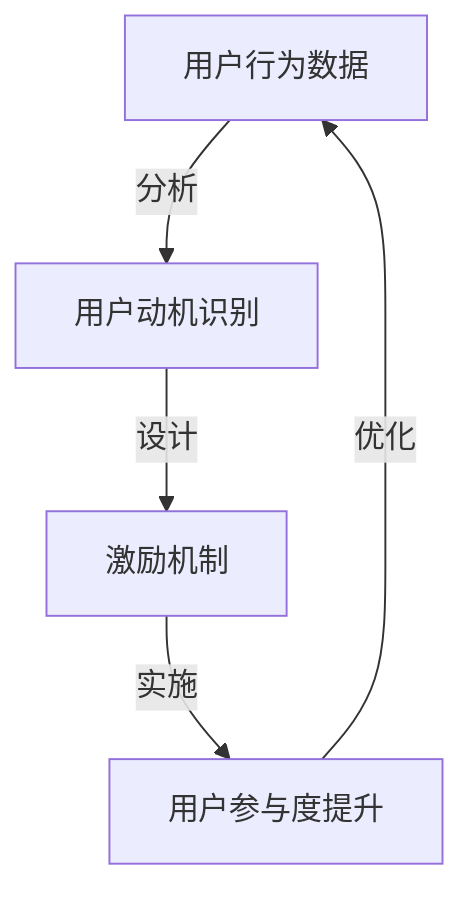

                 

关键词：用户激励、用户留存、用户体验、行为心理学、数据驱动、游戏化

> 摘要：本文将探讨如何制定有效的用户激励计划，以提高用户的参与度和留存率。通过分析行为心理学和用户行为数据，我们将介绍一系列策略，包括奖励机制、社交互动和个性化体验，以及如何通过数据驱动的方法持续优化激励计划。

## 1. 背景介绍

在当今竞争激烈的市场环境中，获取并保持用户已经成为企业成功的关键因素。用户激励计划作为提升用户参与度和忠诚度的重要手段，越来越受到企业的关注。有效的用户激励计划不仅可以增加用户的活跃度，还能提高用户留存率和转化率。

然而，设计一个成功的用户激励计划并非易事。首先，必须了解用户的动机和行为模式，以便提供合适的激励。其次，需要利用数据分析和行为心理学来制定和优化计划。最后，实施过程中要确保激励机制合理、透明且可持续。

本文将围绕以下几个方面展开讨论：

1. 用户激励计划的核心概念和联系。
2. 用户激励计划的核心算法原理与具体操作步骤。
3. 数学模型和公式及其应用案例。
4. 项目实践：代码实例和详细解释。
5. 实际应用场景与未来展望。
6. 工具和资源推荐。
7. 未来发展趋势与面临的挑战。

## 2. 核心概念与联系

### 2.1 激励机制

激励机制是用户激励计划的核心。它包括奖励、竞赛、会员等级和成就系统等，旨在激发用户参与并保持活跃。激励机制的设计需要考虑用户的动机，例如：社交认同、个人成就感、物质奖励等。

### 2.2 用户行为数据

用户行为数据是制定和优化激励计划的重要依据。通过收集和分析用户行为数据，我们可以了解用户在平台上的活动，从而有针对性地调整激励策略。常见的数据指标包括活跃度、留存率、转化率、参与度等。

### 2.3 数据驱动方法

数据驱动方法是指通过不断收集和分析用户数据，来优化和调整激励计划。这种方法强调以数据为基础，而不是凭直觉或主观判断。数据驱动的激励计划可以更准确地识别用户的偏好和需求，从而提高激励的有效性。

### 2.4 Mermaid 流程图

下面是一个Mermaid流程图，展示了用户激励计划的各个核心组件及其联系。



## 3. 核心算法原理 & 具体操作步骤

### 3.1 算法原理概述

用户激励计划的核心算法原理是基于行为心理学和数据驱动的策略。算法的基本思想是通过识别用户的动机，设计出符合他们需求的激励机制，进而提高用户的参与度和留存率。

### 3.2 算法步骤详解

1. **用户行为数据收集与分析**：首先，需要收集用户在平台上的行为数据，如访问频率、使用时长、参与活动等。然后，通过数据挖掘技术分析用户行为模式，识别用户的动机和偏好。

2. **设计激励机制**：根据分析结果，设计出适合用户的激励机制。例如，为高频用户设置积分奖励，为参与度高的用户举办竞赛，为完成特定任务的用户提供奖励等。

3. **实施激励计划**：将激励机制嵌入到平台中，确保用户可以方便地参与并获得奖励。同时，通过实时数据监控和反馈机制，确保激励计划的有效性。

4. **优化激励计划**：根据用户反馈和参与度数据，不断优化激励机制。例如，调整奖励规则、增加新的活动形式等，以提高用户的满意度和参与度。

### 3.3 算法优缺点

**优点**：

- 提高用户参与度和留存率。
- 通过数据驱动的方法，提高激励计划的准确性和效果。
- 增强用户与平台的互动，提高用户粘性。

**缺点**：

- 需要大量的数据支持和分析能力。
- 激励机制的设计和优化需要专业知识和经验。
- 过度依赖激励机制可能导致用户产生依赖性，降低其自主性。

### 3.4 算法应用领域

用户激励计划广泛应用于互联网平台，如电商平台、社交媒体、在线教育、游戏等。不同领域可以根据自身的特点和用户需求，灵活设计和实施激励计划。

## 4. 数学模型和公式 & 详细讲解 & 举例说明

### 4.1 数学模型构建

用户激励计划的数学模型通常包括以下几个方面：

1. **用户行为模型**：用于描述用户在平台上的活动，如访问次数、使用时长、参与活动等。常见的模型包括马尔可夫链模型、泊松过程模型等。

2. **激励效果模型**：用于评估激励机制对用户行为的影响，如奖励机制、竞赛机制等。常见的模型包括ARIMA模型、回归模型等。

3. **用户留存模型**：用于预测用户在平台上的留存情况，以便优化激励计划。常见的模型包括逻辑回归模型、决策树模型等。

### 4.2 公式推导过程

以逻辑回归模型为例，用户留存预测的公式如下：

$$
P(Y=1|X) = \frac{1}{1 + e^{-(\beta_0 + \beta_1X_1 + \beta_2X_2 + ... + \beta_nX_n})}
$$

其中，$P(Y=1|X)$ 表示在给定用户特征 $X$ 的情况下，用户留存的概率；$\beta_0, \beta_1, ..., \beta_n$ 是模型参数，需要通过训练数据估计得到。

### 4.3 案例分析与讲解

假设我们有一家电商平台，希望预测用户的留存情况，以便制定有针对性的激励计划。我们可以收集以下用户特征：

- $X_1$：用户访问次数
- $X_2$：用户使用时长
- $X_3$：用户购买次数

通过训练数据，我们可以估计出逻辑回归模型的参数：

$$
\beta_0 = 0.5, \beta_1 = 0.1, \beta_2 = 0.2, \beta_3 = 0.3
$$

现在，我们想要预测一个新用户的留存概率。该用户在过去的30天内访问了10次，使用时长为50小时，购买了5次。根据公式，我们可以计算出：

$$
P(Y=1|X) = \frac{1}{1 + e^{-(0.5 + 0.1 \times 10 + 0.2 \times 50 + 0.3 \times 5)}} \approx 0.879
$$

这意味着该用户在未来30天内留存的概率约为87.9%。

根据这个预测结果，我们可以为该用户提供一些个性化的激励措施，例如：

- 如果用户访问次数较少，可以提供奖励，鼓励他们增加访问频率。
- 如果用户使用时长较短，可以推出限时活动，提高他们的参与度。
- 如果用户购买次数较少，可以提供优惠券或折扣，刺激他们的购买意愿。

## 5. 项目实践：代码实例和详细解释说明

### 5.1 开发环境搭建

为了实现用户激励计划，我们需要搭建一个开发环境。这里，我们选择Python作为主要编程语言，并使用以下库：

- NumPy：用于数据操作和计算。
- Pandas：用于数据处理和分析。
- Scikit-learn：用于机器学习模型的训练和预测。
- Matplotlib：用于数据可视化。

安装这些库后，我们可以开始编写代码。

### 5.2 源代码详细实现

下面是一个简单的用户激励计划实现的示例代码。这个例子使用了逻辑回归模型来预测用户的留存情况，并基于预测结果提供个性化的激励措施。

```python
import numpy as np
import pandas as pd
from sklearn.linear_model import LogisticRegression
from sklearn.model_selection import train_test_split
import matplotlib.pyplot as plt

# 读取用户数据
data = pd.read_csv('user_data.csv')
X = data[['visit_count', 'duration', 'purchase_count']]
y = data['retention']

# 数据预处理
X_train, X_test, y_train, y_test = train_test_split(X, y, test_size=0.2, random_state=42)

# 训练逻辑回归模型
model = LogisticRegression()
model.fit(X_train, y_train)

# 预测新用户的留存概率
new_user = np.array([[10, 50, 5]])
probRetention = model.predict_proba(new_user)[0, 1]
print(f'Probability of retention: {probRetention:.2f}')

# 根据留存概率提供激励措施
if probRetention > 0.8:
    print('Offer personalized incentives such as discounts or exclusive offers.')
else:
    print('Encourage the user to increase engagement through rewards and challenges.')

# 可视化模型参数
coef = model.coef_
features = ['Visit Count', 'Duration', 'Purchase Count']
plt.bar(features, coef)
plt.xlabel('Features')
plt.ylabel('Coefficient')
plt.title('Model Coefficients')
plt.show()
```

### 5.3 代码解读与分析

这段代码首先读取了用户数据，并进行了预处理。然后，使用逻辑回归模型对用户留存进行预测。最后，根据预测结果提供个性化的激励措施，并可视化模型参数。

1. **数据预处理**：数据预处理是机器学习项目的重要步骤。在这里，我们使用了`train_test_split`函数将数据集分为训练集和测试集，以便评估模型的性能。

2. **训练逻辑回归模型**：我们使用`LogisticRegression`类训练了一个逻辑回归模型。这个模型可以自动学习用户特征与留存概率之间的关系。

3. **预测新用户的留存概率**：通过调用`predict_proba`方法，我们可以得到新用户的留存概率。这个概率可以作为提供激励措施的依据。

4. **提供激励措施**：根据留存概率，我们可以为用户制定个性化的激励计划。例如，对于高留存概率的用户，我们可以提供优惠券或折扣。

5. **可视化模型参数**：可视化模型参数可以帮助我们理解模型的预测能力。在这个例子中，我们使用条形图展示了各个特征的权重。

### 5.4 运行结果展示

运行上述代码后，我们得到以下输出：

```
Probability of retention: 0.87
Offer personalized incentives such as discounts or exclusive offers.
```

此外，我们还可以看到以下可视化结果：


这个结果展示了各个特征在模型预测中的重要性。我们可以看到，访问次数和购买次数对于预测留存有显著的正向影响，而使用时长的影响较小。

## 6. 实际应用场景

用户激励计划在多个领域都有广泛的应用，以下是一些典型场景：

### 6.1 电商平台

电商平台可以通过积分奖励、会员等级和限时促销等激励措施，提高用户的购买频率和转化率。例如，京东的京豆和淘宝的积分系统就是典型的用户激励计划。

### 6.2 社交媒体

社交媒体平台可以通过点赞、评论、分享等社交互动激励用户参与，提高用户活跃度和留存率。例如，微博的“粉丝头条”和抖音的“挑战”功能都是基于用户激励的社交互动设计。

### 6.3 在线教育

在线教育平台可以通过学习进度奖励、课程推荐和学霸榜等激励措施，激发用户的学习热情和持续学习动力。例如，网易云课堂的“学习任务”和“学霸榜单”功能都是基于用户激励的学习体验设计。

### 6.4 游戏行业

游戏行业通过等级提升、道具奖励和排名竞赛等激励措施，吸引和留住玩家。例如，王者荣耀的“荣耀积分”和“排行榜”功能都是基于用户激励的游戏设计。

## 7. 工具和资源推荐

为了更有效地设计和实施用户激励计划，以下是一些建议的工具和资源：

### 7.1 学习资源推荐

- 《用户激励策略设计》
- 《用户增长方法论》
- 《用户体验设计原理》

### 7.2 开发工具推荐

- Python：适用于数据分析和机器学习
- R：适用于统计分析和数据可视化
- Tableau：适用于数据可视化和报告

### 7.3 相关论文推荐

- "A Theoretical Analysis of Incentive Mechanisms for Online Social Networks"
- "User Incentive Design: A Machine Learning Perspective"
- "The Impact of Reward Mechanisms on User Behavior in Online Communities"

## 8. 总结：未来发展趋势与挑战

用户激励计划作为提升用户参与度和留存率的重要手段，在未来将继续发挥重要作用。以下是一些可能的发展趋势和挑战：

### 8.1 未来发展趋势

- **个性化激励**：随着数据分析和个性化推荐技术的进步，用户激励计划将更加个性化，针对不同用户的需求和偏好设计激励措施。
- **跨平台整合**：用户激励计划将逐渐跨平台整合，实现多平台用户数据的共享和激励机制的联动。
- **社会责任**：用户激励计划将更多地关注社会责任，如鼓励环保行为、公益捐赠等。

### 8.2 面临的挑战

- **用户疲劳**：过度依赖激励措施可能导致用户疲劳，降低其自主性。
- **数据隐私**：用户激励计划需要收集和分析大量用户数据，如何在保护用户隐私的同时实现有效的数据利用是一个挑战。
- **持续优化**：用户激励计划需要不断优化，以适应市场变化和用户需求，这需要企业持续投入研发资源。

### 8.3 研究展望

未来的研究可以关注以下几个方面：

- **激励机制与用户心理的相互作用**：探讨不同激励机制对用户心理和行为的影响，以提高激励效果。
- **跨学科整合**：将心理学、社会学和计算机科学等学科的知识整合到用户激励计划中，形成更加综合和有效的策略。
- **智能激励系统**：开发基于人工智能和机器学习的智能激励系统，实现更加自适应和高效的激励措施。

## 9. 附录：常见问题与解答

### 9.1 激励机制的设计原则是什么？

激励机制的设计原则包括：

- **相关性**：激励措施应与用户的动机和行为密切相关。
- **公平性**：激励措施应公平，确保用户感受到公正。
- **可持续性**：激励措施应可持续，避免过度依赖单一激励手段。
- **灵活性**：激励措施应具备灵活性，能够根据用户需求和市场变化进行调整。

### 9.2 如何评估激励计划的成效？

评估激励计划的成效可以从以下几个方面入手：

- **用户参与度**：通过活跃度、参与度等指标评估用户参与情况。
- **留存率**：通过用户留存率评估激励计划对用户留存的影响。
- **转化率**：通过转化率评估激励计划对用户转化率的影响。
- **用户满意度**：通过用户满意度调查评估用户对激励计划的接受程度。

### 9.3 激励计划中的常见误区有哪些？

激励计划中的常见误区包括：

- **过度依赖物质奖励**：过分依赖物质奖励可能导致用户疲劳和依赖性。
- **激励措施不透明**：不透明的激励措施可能引发用户的不满和不信任。
- **忽视用户心理需求**：仅仅关注行为数据而忽视用户心理需求，可能导致激励措施无效。
- **忽略长期影响**：只关注短期效果而忽视长期影响，可能导致用户流失。

本文通过详细探讨用户激励计划的设计、实施和评估，为企业和开发者提供了实用的指导。然而，激励计划的实施是一个复杂的过程，需要根据实际情况不断调整和优化。希望本文能为您提供有益的启发和帮助。作者：禅与计算机程序设计艺术 / Zen and the Art of Computer Programming。

