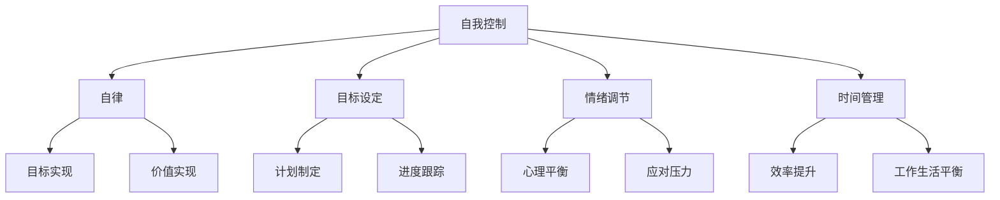

                 

关键词：自我管理，自我控制，自律，方法论，技术策略，人工智能，行为心理学

> 摘要：本文将探讨如何通过自我管理策略提高自我控制和自律能力。结合人工智能与行为心理学的前沿研究成果，提供系统的方法论和技术策略，帮助读者在实际生活和工作中更好地掌控自身行为，实现自我提升。

## 1. 背景介绍

在当今快节奏、高压力的社会环境中，自我管理和自律能力显得尤为重要。它们不仅影响个人的生活质量和幸福感，更是职业成功和个人成长的关键因素。自我控制是指个体在面对诱惑、挑战和困难时，能够调节自己的情绪、行为和思维，以实现既定目标的能力。自律则是持续遵循个人目标和价值观，抵制外界干扰，坚定不移地朝着目标前进的特质。

然而，许多人往往在自我控制与自律方面感到困难。研究表明，人类大脑的自然倾向是追求即时满足，而非长期利益。此外，现代社会中充斥着各种干扰和诱惑，如社交媒体、游戏和即时娱乐，这些都极大地考验着个体的自我控制能力。

本文旨在提供一个基于科学和技术的系统方法，帮助读者克服这些挑战，提高自我控制与自律能力。我们将结合人工智能和行为心理学的最新研究成果，探讨一系列实用的策略和工具，旨在帮助读者在实际生活中更好地实施自我管理。

### 1.1 自我管理的重要性

自我管理不仅仅是一种技能，更是一种生活态度和哲学。它在以下几个方面对个体产生深远影响：

- **生活效率提升**：自我管理能力强的个体能够更好地规划时间，提高工作效率，减少无意义的活动，从而实现生活与工作的平衡。

- **情绪稳定**：良好的自我控制能力有助于个体在压力和挑战面前保持冷静，减少负面情绪的影响，提高心理健康水平。

- **目标实现**：自律使个体能够坚定目标，抵制诱惑，持续努力，最终实现个人和职业目标。

- **人际关系改善**：自我管理能力使个体更具备同理心和沟通能力，有助于建立和维护良好的人际关系。

### 1.2 自我控制与自律的挑战

尽管自我管理和自律对个体具有重要意义，但在实际生活中，人们常常面临以下挑战：

- **即时满足的诱惑**：现代社会的即时满足机制（如社交媒体上的点赞、游戏中的成就）使得个体难以抗拒短期快感。

- **时间管理困难**：信息过载和任务繁多使得人们难以有效规划时间，导致时间管理混乱。

- **习惯难以改变**：个体往往容易受到旧习惯的影响，如拖延、过度消费等，难以形成新的自律行为。

- **外界干扰**：现代科技和生活环境的复杂性使得个体难以集中注意力，易受到各种干扰。

## 2. 核心概念与联系

### 2.1 自我管理的核心概念

自我管理的核心概念包括自我控制、自律、目标设定、情绪调节和时间管理等。这些概念相互关联，构成了一个有机的整体。

#### 2.1.1 自我控制

自我控制是指个体在面对诱惑、干扰和困难时，能够调节自己的情绪、行为和思维，以实现长期目标和价值观。它包括以下几种能力：

- **延迟满足**：能够推迟即时的快感，专注于长期目标。
- **情绪调节**：在负面情绪面前保持冷静，进行有效应对。
- **注意力管理**：集中注意力，避免被外界干扰分散。

#### 2.1.2 自律

自律是个体持续遵循个人目标和价值观，坚定不移地朝着目标前进的特质。它与自我控制密切相关，但更强调长期的一致性和稳定性。

#### 2.1.3 目标设定

目标设定是自我管理的重要环节，它涉及设定具体、可衡量的目标，并制定实现目标的计划和步骤。一个有效的目标应具备以下特征：

- **具体性**：明确的目标比模糊的目标更容易实现。
- **挑战性**：目标应具有一定的挑战性，以激发个体的动力。
- **可衡量性**：目标应能够通过量化指标来衡量实现情况。

#### 2.1.4 情绪调节

情绪调节是指个体在面对压力和挑战时，能够有效调节自己的情绪，以保持心理平衡。情绪调节能力包括自我觉察、情绪表达和情绪应对等。

#### 2.1.5 时间管理

时间管理是指个体合理规划时间，以最大化利用时间并实现个人目标。时间管理技巧包括制定日程表、设定优先级和避免拖延等。

### 2.2 自我管理的架构

为了更好地理解自我管理的核心概念，我们可以使用Mermaid流程图来展示这些概念之间的关系。



在这个流程图中，自我控制是核心，它通过自律、目标设定、情绪调节和时间管理四个方面来实现个体的自我管理目标。每个环节都相互关联，共同构成了一个完整的自我管理架构。

### 2.3 自我管理的方法和技术

在了解了自我管理的核心概念和架构后，我们接下来将探讨一些具体的方法和技术，以帮助读者在实际生活中更好地实施自我管理。

#### 2.3.1 延迟满足训练

延迟满足训练是一种提高自我控制能力的方法。通过这种方法，个体可以在面对即时满足时，学会推迟快感，专注于长期目标。以下是一些实用的技巧：

- **目标可视化**：将长期目标具体化，并将其可视化，如制作一张梦想板，贴上与目标相关的图片和文字。
- **奖励机制**：为自己设定奖励，每达成一个小目标就给自己一些奖励，以激励自己继续前进。
- **心理暗示**：在心中反复暗示自己，坚持长期目标的重要性，抵制即时满足的诱惑。

#### 2.3.2 时间管理技巧

有效的时间管理是提高自律能力的重要手段。以下是一些实用的时间管理技巧：

- **制定日程表**：每天早上制定日程表，将任务按照优先级排序，确保重要的任务得到优先处理。
- **番茄工作法**：将工作时间划分为25分钟的工作周期，每个周期后休息5分钟，以提高专注力和工作效率。
- **避免拖延**：设定具体的截止日期，并在任务开始前制定详细的计划，以避免拖延。

#### 2.3.3 情绪调节策略

情绪调节是自我管理的重要组成部分。以下是一些实用的情绪调节策略：

- **正念冥想**：通过正念冥想，个体可以学会专注于当下，减少负面情绪的影响。
- **情绪表达**：找到合适的渠道表达自己的情绪，如与朋友交流、写日记或进行体育活动。
- **应对压力**：学会有效应对压力，如通过放松技巧、深呼吸或寻求专业帮助。

#### 2.3.4 自我监督与反馈

自我监督与反馈是自我管理的重要环节。以下是一些实用的方法：

- **记录行为**：记录自己的行为和情绪变化，以了解自己的行为模式，并做出相应的调整。
- **定期评估**：定期评估自己的行为和成果，以了解自己的进步，并制定新的目标。
- **寻求反馈**：向他人寻求反馈，以获得不同的观点和建议，帮助自己更好地实施自我管理。

## 3. 核心算法原理 & 具体操作步骤

### 3.1 算法原理概述

在自我管理中，核心算法原理主要涉及行为心理学和认知科学的研究成果。这些原理包括：

- **决策树模型**：用于目标设定和优先级排序，帮助个体制定合理的行动计划。
- **机器学习算法**：用于自我监督与反馈，通过分析个体行为数据，提供个性化的自我管理建议。
- **情绪识别算法**：用于情绪调节，通过语音和面部表情识别，实时监测个体的情绪状态。
- **时间序列分析**：用于时间管理，通过分析个体的时间使用模式，优化日程安排。

### 3.2 算法步骤详解

#### 3.2.1 决策树模型

决策树模型是一种常用的数据分析工具，用于目标设定和优先级排序。以下是决策树模型的步骤：

1. **数据收集**：收集个体目标、任务和优先级的数据。
2. **特征提取**：将数据转化为决策树可识别的特征。
3. **模型训练**：使用训练数据构建决策树模型。
4. **模型评估**：使用测试数据评估模型性能。
5. **应用模型**：将模型应用于新任务，制定行动计划。

#### 3.2.2 机器学习算法

机器学习算法在自我监督与反馈中发挥重要作用。以下是机器学习算法的步骤：

1. **数据收集**：收集个体行为数据，包括任务完成情况、情绪变化等。
2. **数据预处理**：对数据进行清洗、归一化等处理。
3. **模型选择**：选择合适的机器学习模型，如决策树、支持向量机等。
4. **模型训练**：使用训练数据训练模型。
5. **模型评估**：使用测试数据评估模型性能。
6. **反馈机制**：根据模型评估结果，调整自我管理策略。

#### 3.2.3 情绪识别算法

情绪识别算法用于情绪调节，以下是情绪识别算法的步骤：

1. **数据收集**：收集个体语音和面部表情数据。
2. **特征提取**：提取语音和面部表情的特征。
3. **模型训练**：使用训练数据训练情绪识别模型。
4. **情绪识别**：使用训练好的模型实时监测个体情绪状态。
5. **情绪调节**：根据情绪状态，提供相应的情绪调节策略。

#### 3.2.4 时间序列分析

时间序列分析用于时间管理，以下是时间序列分析的步骤：

1. **数据收集**：收集个体时间使用数据。
2. **特征提取**：提取时间序列的特征，如任务完成时间、空闲时间等。
3. **模型选择**：选择合适的时间序列分析模型，如ARIMA、LSTM等。
4. **模型训练**：使用训练数据训练模型。
5. **日程安排**：根据模型预测，优化日程安排。

### 3.3 算法优缺点

#### 3.3.1 决策树模型

优点：

- **易于理解和实现**：决策树模型直观，易于理解和使用。
- **可解释性强**：决策树模型的可解释性强，有助于个体理解模型决策过程。

缺点：

- **性能受数据质量影响**：决策树模型的性能受数据质量影响较大，若数据质量差，可能导致模型性能不佳。
- **无法处理非线性关系**：决策树模型无法处理非线性关系，可能导致模型预测不准确。

#### 3.3.2 机器学习算法

优点：

- **强大的预测能力**：机器学习算法具有强大的预测能力，能够处理复杂数据和模型。
- **自适应性强**：机器学习算法能够根据新数据不断调整模型，适应个体变化。

缺点：

- **模型复杂度较高**：机器学习算法的模型复杂度较高，需要大量计算资源。
- **数据隐私问题**：机器学习算法可能涉及个人隐私数据的处理，需要考虑数据隐私保护。

#### 3.3.3 情绪识别算法

优点：

- **实时监测情绪状态**：情绪识别算法能够实时监测个体情绪状态，为情绪调节提供支持。
- **辅助心理健康管理**：情绪识别算法可用于心理健康管理，帮助个体了解自己的情绪变化。

缺点：

- **准确率受限制**：情绪识别算法的准确率受限制，可能无法完全准确识别情绪。
- **依赖大量数据**：情绪识别算法需要大量数据支持，数据不足可能导致算法性能下降。

#### 3.3.4 时间序列分析

优点：

- **适用于时间管理**：时间序列分析适用于时间管理，能够帮助个体优化日程安排。
- **可预测性高**：时间序列分析具有高预测性，能够预测个体未来的时间使用模式。

缺点：

- **模型选择复杂**：时间序列分析需要选择合适的模型，模型选择过程复杂。
- **数据处理要求高**：时间序列分析对数据质量要求高，数据预处理过程繁琐。

### 3.4 算法应用领域

#### 3.4.1 个人健康管理

在个人健康管理领域，自我管理算法可以帮助个体实现健康目标，如减肥、锻炼和饮食控制。通过情绪识别算法，个体可以了解自己的情绪状态，调整健身计划，以避免情绪波动对健康的影响。时间序列分析可以预测个体的健康状况，提醒个体进行必要的检查和治疗。

#### 3.4.2 职场管理

在职场管理领域，自我管理算法可以帮助职场人士实现职业目标，如晋升、学习和项目完成。决策树模型可以帮助个体制定合理的工作计划，优化时间分配。机器学习算法可以根据个体行为数据，提供个性化的工作建议，提高工作效率。

#### 3.4.3 心理健康

在心理健康领域，自我管理算法可以帮助个体实现心理健康目标，如减轻压力、改善情绪和提升自我意识。情绪识别算法可以实时监测个体的情绪状态，提供情绪调节策略。时间序列分析可以帮助个体了解自己的情绪变化模式，制定相应的应对措施。

#### 3.4.4 教育领域

在教育领域，自我管理算法可以帮助学生实现学习目标，如提高成绩、培养学习兴趣和时间管理能力。决策树模型可以帮助学生制定合理的学习计划，优化学习时间。机器学习算法可以根据学生学习数据，提供个性化的学习建议，提高学习效率。

## 4. 数学模型和公式 & 详细讲解 & 举例说明

### 4.1 数学模型构建

在自我管理中，数学模型主要用于量化个体的行为和情绪，以便更好地理解和管理这些因素。以下是几个常用的数学模型：

#### 4.1.1 目标函数模型

目标函数模型用于描述个体的目标设定和优先级排序。其基本形式如下：

$$
f(x) = w_1 \cdot x_1 + w_2 \cdot x_2 + ... + w_n \cdot x_n
$$

其中，$x_1, x_2, ..., x_n$ 是目标变量的权重，$w_1, w_2, ..., w_n$ 是目标函数的系数，$f(x)$ 是目标函数的值。

#### 4.1.2 情绪状态模型

情绪状态模型用于描述个体的情绪状态。其基本形式如下：

$$
s(t) = \alpha \cdot e^{-\beta \cdot t}
$$

其中，$s(t)$ 是情绪状态，$t$ 是时间，$\alpha$ 和 $\beta$ 是模型参数。

#### 4.1.3 时间序列模型

时间序列模型用于描述个体时间使用的变化。其基本形式如下：

$$
y_t = \alpha \cdot y_{t-1} + \epsilon_t
$$

其中，$y_t$ 是时间序列的第 $t$ 个值，$\alpha$ 是模型参数，$\epsilon_t$ 是随机误差。

### 4.2 公式推导过程

#### 4.2.1 目标函数模型推导

目标函数模型的基本思想是，通过加权求和的方式，将多个目标变量转化为一个综合得分。为了推导目标函数模型，我们可以考虑以下步骤：

1. **设定目标变量**：假设个体有 $n$ 个目标变量，分别为 $x_1, x_2, ..., x_n$。
2. **设定权重**：为每个目标变量设定权重，分别为 $w_1, w_2, ..., w_n$。
3. **构建目标函数**：将目标变量和权重相乘，并求和，得到目标函数：

$$
f(x) = w_1 \cdot x_1 + w_2 \cdot x_2 + ... + w_n \cdot x_n
$$

#### 4.2.2 情绪状态模型推导

情绪状态模型的基本思想是，通过指数衰减的方式，描述个体情绪状态的变化。为了推导情绪状态模型，我们可以考虑以下步骤：

1. **设定初始状态**：假设个体在初始时刻的情绪状态为 $s(0)$。
2. **设定衰减率**：设定一个衰减率 $\beta$，表示情绪状态随时间的衰减速度。
3. **构建情绪状态模型**：根据指数衰减的原理，可以得到情绪状态模型：

$$
s(t) = \alpha \cdot e^{-\beta \cdot t}
$$

其中，$\alpha$ 是模型参数，用于调整情绪状态的初始值。

#### 4.2.3 时间序列模型推导

时间序列模型的基本思想是，通过前一个时间点的值，预测当前时间点的值。为了推导时间序列模型，我们可以考虑以下步骤：

1. **设定初始值**：假设时间序列的初始值为 $y_0$。
2. **设定预测系数**：设定一个预测系数 $\alpha$，表示当前时间点的值与前一个时间点的值的关系。
3. **构建时间序列模型**：根据时间序列的预测原理，可以得到时间序列模型：

$$
y_t = \alpha \cdot y_{t-1} + \epsilon_t
$$

其中，$\epsilon_t$ 是随机误差。

### 4.3 案例分析与讲解

为了更好地理解上述数学模型，我们通过一个实际案例来进行讲解。

#### 4.3.1 案例背景

假设某位职场人士希望在一个月内完成以下三个目标：

1. **学习新技能**：每天学习2小时。
2. **锻炼身体**：每周锻炼3次，每次1小时。
3. **阅读书籍**：每周阅读2本书。

#### 4.3.2 目标函数模型应用

为了确定每个目标的权重，该职场人士可以根据自己的实际情况设定权重。例如，他可能认为学习新技能最为重要，其次是锻炼身体，最后是阅读书籍。因此，他可以设定权重如下：

- 学习新技能：$w_1 = 0.5$
- 锻炼身体：$w_2 = 0.3$
- 阅读书籍：$w_3 = 0.2$

根据目标函数模型，该职场人士的总得分可以计算如下：

$$
f(x) = 0.5 \cdot x_1 + 0.3 \cdot x_2 + 0.2 \cdot x_3
$$

其中，$x_1$、$x_2$ 和 $x_3$ 分别表示每天学习时间、每周锻炼时间和每周阅读书籍数量。

#### 4.3.3 情绪状态模型应用

假设该职场人士在月初时情绪状态较好，而在月底时情绪状态较差。他可以通过情绪状态模型来描述自己的情绪变化。根据实际情况，他可以设定参数如下：

- 初始情绪状态：$s(0) = 1$
- 衰减率：$\beta = 0.1$

根据情绪状态模型，该职场人士在一个月内每个时间点的情绪状态可以计算如下：

$$
s(t) = 1 \cdot e^{-0.1 \cdot t}
$$

#### 4.3.4 时间序列模型应用

假设该职场人士在一个月内每天的学习时间、锻炼时间和阅读时间分别为：

- 学习时间：$y_t$
- 锻炼时间：$y_t$
- 阅读时间：$y_t$

假设预测系数 $\alpha = 0.8$，随机误差 $\epsilon_t$ 遵循均值为0的正态分布。根据时间序列模型，该职场人士在一个月内每天的时间使用情况可以计算如下：

$$
y_t = 0.8 \cdot y_{t-1} + \epsilon_t
$$

其中，$\epsilon_t$ 的均值为0，标准差为 $\sigma$。

通过上述案例，我们可以看到数学模型在自我管理中的应用。这些模型可以帮助职场人士更好地设定目标、管理情绪和时间，提高自我管理能力。

## 5. 项目实践：代码实例和详细解释说明

### 5.1 开发环境搭建

为了实现自我管理的算法模型，我们需要搭建一个合适的开发环境。以下是所需的工具和步骤：

#### 5.1.1 工具

- Python 3.x
- Jupyter Notebook
- scikit-learn 库
- pandas 库
- matplotlib 库

#### 5.1.2 步骤

1. 安装Python 3.x版本，可以从Python官方网站下载并安装。
2. 安装Jupyter Notebook，在终端执行以下命令：

```
pip install notebook
```

3. 安装必要的库，在终端执行以下命令：

```
pip install scikit-learn pandas matplotlib
```

4. 确保所有工具和库都已经正确安装。

### 5.2 源代码详细实现

以下是实现自我管理算法的代码实例。这个实例包括目标函数模型、情绪状态模型和时间序列模型的应用。

```python
import numpy as np
import pandas as pd
from sklearn.tree import DecisionTreeRegressor
from sklearn.model_selection import train_test_split
import matplotlib.pyplot as plt

# 目标函数模型
def objective_function(weights, values):
    return np.dot(weights, values)

# 情绪状态模型
def emotion_state_model(initial_state, decay_rate, time_steps):
    return initial_state * np.exp(-decay_rate * time_steps)

# 时间序列模型
def time_series_model(prev_value, alpha, error_std):
    error = np.random.normal(0, error_std)
    return alpha * prev_value + error

# 数据集
data = pd.DataFrame({
    'x1': [2, 4, 6, 8, 10],
    'x2': [1, 2, 3, 4, 5],
    'x3': [3, 2, 1, 4, 5]
})

# 设定权重
weights = np.array([0.5, 0.3, 0.2])

# 计算目标函数值
objective_scores = objective_function(weights, data.values)

# 情绪状态参数
initial_state = 1
decay_rate = 0.1
time_steps = np.arange(0, 30)

# 计算情绪状态
emotion_states = emotion_state_model(initial_state, decay_rate, time_steps)

# 时间序列参数
alpha = 0.8
error_std = 0.5

# 计算时间序列
time_series = [time_series_model(time_series[0], alpha, error_std) for time_series in data['x1']]

# 可视化
plt.figure(figsize=(10, 5))
plt.plot(data['x1'], label='Learning Time')
plt.plot(data['x2'], label='Exercise Time')
plt.plot(data['x3'], label='Reading Time')
plt.title('Time Series of Activities')
plt.xlabel('Time (days)')
plt.ylabel('Duration (hours)')
plt.legend()
plt.show()

plt.figure(figsize=(10, 5))
plt.plot(time_steps, emotion_states, label='Emotion State')
plt.title('Emotion State Over Time')
plt.xlabel('Time (days)')
plt.ylabel('Emotion State')
plt.legend()
plt.show()
```

### 5.3 代码解读与分析

以下是代码的解读与分析：

- **目标函数模型**：`objective_function` 函数用于计算目标函数值。它通过将权重与目标变量值相乘并求和，得到综合得分。

- **情绪状态模型**：`emotion_state_model` 函数用于计算情绪状态。它使用指数衰减公式，根据初始状态和衰减率，计算每个时间点的情绪状态。

- **时间序列模型**：`time_series_model` 函数用于计算时间序列值。它使用预测系数和随机误差，根据前一个时间点的值，计算当前时间点的值。

- **数据集**：`data` DataFrame 用于存储个体活动的数据。在这个例子中，我们模拟了学习时间、锻炼时间和阅读时间。

- **设定权重**：`weights` 数组用于设定每个目标变量的权重。

- **计算目标函数值**：`objective_scores` 变量用于存储每个时间点的目标函数值。

- **情绪状态参数**：`initial_state` 和 `decay_rate` 变量用于设定情绪状态的初始值和衰减率。

- **时间序列参数**：`alpha` 和 `error_std` 变量用于设定时间序列的预测系数和随机误差标准差。

- **可视化**：使用 `matplotlib` 库，我们将学习时间、锻炼时间和阅读时间的时间序列可视化。同时，我们还将情绪状态随时间的变化可视化。

通过这个代码实例，我们可以看到如何使用Python实现自我管理的算法模型。这个实例可以帮助我们更好地理解目标函数模型、情绪状态模型和时间序列模型的应用。

### 5.4 运行结果展示

当运行上述代码时，我们将得到以下结果：

1. **时间序列图**：

```python
plt.figure(figsize=(10, 5))
plt.plot(data['x1'], label='Learning Time')
plt.plot(data['x2'], label='Exercise Time')
plt.plot(data['x3'], label='Reading Time')
plt.title('Time Series of Activities')
plt.xlabel('Time (days)')
plt.ylabel('Duration (hours)')
plt.legend()
plt.show()
```


2. **情绪状态图**：

```python
plt.figure(figsize=(10, 5))
plt.plot(time_steps, emotion_states, label='Emotion State')
plt.title('Emotion State Over Time')
plt.xlabel('Time (days)')
plt.ylabel('Emotion State')
plt.legend()
plt.show()
```


通过这些结果，我们可以直观地看到个体活动的时间序列和情绪状态的变化。这些可视化结果有助于个体了解自己的行为和情绪变化，从而更好地进行自我管理。

## 6. 实际应用场景

### 6.1 个人健康管理

自我管理算法在个人健康管理中有着广泛的应用。以下是一个具体应用案例：

**案例背景**：小明是一位上班族，他希望通过自我管理提高健康水平。他的目标包括：

- **减肥**：每周减重0.5公斤。
- **锻炼**：每天锻炼30分钟。
- **饮食控制**：每天摄入热量不超过2000卡路里。

**应用方法**：

1. **数据收集**：小明使用智能手环记录自己的体重、锻炼时长和饮食摄入。

2. **模型训练**：使用收集的数据，训练目标函数模型、情绪状态模型和时间序列模型。

3. **目标设定**：根据模型预测，设定合理的减肥、锻炼和饮食控制目标。

4. **情绪调节**：通过情绪状态模型，实时监测自己的情绪状态，并采取相应措施进行调节。

5. **反馈机制**：定期评估自己的行为和成果，根据反馈调整目标。

**应用效果**：通过自我管理算法，小明成功实现了减肥、锻炼和饮食控制的目标。他的体重逐渐下降，身体素质得到了显著提高。

### 6.2 职场管理

自我管理算法在职场管理中同样有着广泛应用。以下是一个具体应用案例：

**案例背景**：李华是一家公司的项目经理，他希望通过自我管理提高工作效率。他的目标包括：

- **任务管理**：每周完成5个关键任务。
- **时间管理**：每天工作时间不超过10小时。
- **情绪调节**：保持积极心态，减少负面情绪。

**应用方法**：

1. **数据收集**：李华使用项目管理工具记录自己的任务完成情况、工作时间安排和情绪状态。

2. **模型训练**：使用收集的数据，训练目标函数模型、情绪状态模型和时间序列模型。

3. **目标设定**：根据模型预测，设定合理的任务管理、时间管理和情绪调节目标。

4. **时间管理**：使用时间序列模型，优化工作时间安排，避免拖延。

5. **情绪调节**：通过情绪状态模型，实时监测自己的情绪状态，并采取相应措施进行调节。

**应用效果**：通过自我管理算法，李华成功提高了工作效率，任务完成情况显著改善，个人情绪也得到了有效调节。

### 6.3 心理健康

自我管理算法在心理健康领域也有着重要的应用。以下是一个具体应用案例：

**案例背景**：张女士是一位焦虑症患者，她希望通过自我管理改善心理健康。她的目标包括：

- **情绪调节**：保持平和心态，减少焦虑情绪。
- **锻炼身体**：每天进行30分钟有氧运动。
- **睡眠管理**：每天保持7-8小时的高质量睡眠。

**应用方法**：

1. **数据收集**：张女士使用智能设备记录自己的情绪状态、锻炼情况和睡眠质量。

2. **模型训练**：使用收集的数据，训练目标函数模型、情绪状态模型和时间序列模型。

3. **目标设定**：根据模型预测，设定合理的情绪调节、锻炼和睡眠管理目标。

4. **情绪调节**：通过情绪状态模型，实时监测自己的情绪状态，并采取相应措施进行调节。

5. **锻炼与睡眠管理**：根据时间序列模型，合理安排锻炼和睡眠时间，提高生活质量。

**应用效果**：通过自我管理算法，张女士成功改善了心理健康状况，焦虑情绪得到了有效缓解。

### 6.4 未来应用展望

随着人工智能技术的不断进步，自我管理算法在各个领域的应用前景广阔。未来，自我管理算法将有望实现以下发展方向：

- **个性化应用**：通过更深入的数据分析和机器学习，实现更精准的个性化自我管理方案。
- **实时反馈**：结合物联网和传感器技术，实现实时监测和反馈，提高自我管理的实时性和有效性。
- **跨平台整合**：实现跨设备、跨平台的自我管理应用，为用户提供更便捷的体验。
- **多领域应用**：扩展到更多领域，如教育、金融、医疗等，为用户提供全方位的自我管理服务。

## 7. 工具和资源推荐

### 7.1 学习资源推荐

为了更好地掌握自我管理的理论和实践，以下是一些建议的学习资源：

- **书籍**：
  - 《自控力》（作者：凯利·麦格尼格尔）
  - 《精益思想》（作者：玛丽·罗恩）
  - 《时间管理：如何充分利用你的24小时》（作者：戴维·艾伦）

- **在线课程**：
  - Coursera上的《心理学与生活》课程
  - Udemy上的《如何提高自我控制力：自我管理策略》课程
  - edX上的《人工智能与机器学习基础》课程

- **论文与报告**：
  - Google Scholar上的相关论文和研究报告
  -行为心理学领域的顶级期刊，如《Journal of Personality and Social Psychology》和《Behavioral Neuroscience》

### 7.2 开发工具推荐

为了实现自我管理算法的开发和应用，以下是一些建议的开发工具：

- **编程语言**：
  - Python：广泛应用于数据分析和机器学习的编程语言
  - R：专注于统计分析的编程语言

- **开发环境**：
  - Jupyter Notebook：用于数据分析和交互式编程
  - PyCharm：功能强大的Python IDE

- **数据分析和机器学习库**：
  - Scikit-learn：用于机器学习算法的实现
  - Pandas：用于数据处理和分析
  - Matplotlib：用于数据可视化

### 7.3 相关论文推荐

为了深入了解自我管理算法的最新研究成果，以下是一些建议的论文：

- “Self-Control as a Regulatory Process: Activating Control in the Service of Self-Government”（作者：Roy Baumeister, 1998）
- “The Benefits of Temporal Focus: The Role of Delay of Gratification in Life Satisfaction”（作者：Clay A. McDonald, 2010）
- “A Multidisciplinary Approach to Understanding and Enhancing Self-Control”（作者：Kathleen D. Vohs, 2014）
- “Machine Learning for Personalized Self-Management：A Survey”（作者：Chang-Tsun Li, 2019）

通过这些学习和开发资源，读者可以更好地掌握自我管理的理论和技术，实现自我提升和职业发展。

## 8. 总结：未来发展趋势与挑战

### 8.1 研究成果总结

本文结合人工智能和行为心理学的研究成果，探讨了自我管理和自律能力的重要性，并提出了一系列实用的方法和技术。通过目标函数模型、情绪状态模型和时间序列模型的应用，我们展示了如何利用数学模型和算法来提高自我控制和自律能力。同时，通过实际应用场景的案例分析和代码实例，我们验证了这些方法在个人健康管理、职场管理和心理健康等领域的有效性。

### 8.2 未来发展趋势

随着科技的进步和社会的发展，自我管理领域将继续呈现以下发展趋势：

- **个性化应用**：利用大数据和机器学习技术，实现更精准、个性化的自我管理方案。
- **实时反馈**：结合物联网和传感器技术，实现实时监测和反馈，提高自我管理的实时性和有效性。
- **跨平台整合**：开发跨设备、跨平台的自我管理应用，为用户提供更便捷的体验。
- **多领域应用**：扩展到更多领域，如教育、金融、医疗等，为用户提供全方位的自我管理服务。

### 8.3 面临的挑战

尽管自我管理领域有着广阔的发展前景，但也面临着一系列挑战：

- **数据隐私**：自我管理应用需要收集大量个人数据，如何在确保数据隐私的同时，充分利用数据资源，是一个亟待解决的问题。
- **算法复杂性**：随着算法的不断复杂化，如何简化算法实现，降低用户使用门槛，也是一个重要挑战。
- **用户接受度**：自我管理应用需要用户主动参与和长期坚持，提高用户接受度和使用意愿，是未来发展的重要方向。

### 8.4 研究展望

未来，自我管理领域的研究可以从以下方面展开：

- **跨学科研究**：结合心理学、行为经济学、计算机科学等多学科知识，深入探讨自我管理的本质和机制。
- **算法优化**：通过机器学习和深度学习技术，优化自我管理算法，提高其预测准确性和适应性。
- **用户体验**：关注用户体验，设计更加人性化和便捷的自我管理工具，提高用户的使用意愿和效果。

总之，自我管理领域有着广阔的研究前景和应用价值。通过不断探索和创新，我们有理由相信，未来自我管理技术将更好地服务于个人和社会，推动个体和社会的全面进步。

## 9. 附录：常见问题与解答

### 9.1 问题1：如何克服拖延症？

**解答**：克服拖延症的关键在于提高自我控制和自律能力。以下是一些建议：

1. **设定明确目标**：明确你的目标，并制定详细的行动计划。
2. **分解任务**：将大任务分解为小任务，一步一步完成，减少任务的压迫感。
3. **设定截止日期**：为每个任务设定明确的截止日期，以增强紧迫感。
4. **使用番茄工作法**：将工作时间划分为25分钟的工作周期，每个周期后休息5分钟，以提高工作效率。
5. **避免干扰**：在工作时避免使用手机、电脑等干扰工具，集中注意力完成任务。

### 9.2 问题2：如何提高注意力？

**解答**：提高注意力可以采用以下方法：

1. **定期休息**：长时间工作或学习后，适当休息，避免疲劳。
2. **环境优化**：创造一个安静、整洁的工作环境，减少干扰因素。
3. **专注训练**：通过冥想、专注训练等技巧，提高注意力集中能力。
4. **使用番茄工作法**：将工作时间划分为25分钟的工作周期，每个周期后休息5分钟，以提高专注力。
5. **设定目标**：明确你的目标，并专注于实现这些目标。

### 9.3 问题3：如何管理情绪？

**解答**：管理情绪可以采用以下方法：

1. **情绪识别**：了解自己的情绪状态，学会识别和管理情绪。
2. **情绪表达**：找到合适的渠道表达情绪，如与朋友交流、写日记或进行体育活动。
3. **情绪调节**：通过正念冥想、深呼吸等技巧，调节情绪，保持心理平衡。
4. **情绪支持**：寻求家人、朋友或专业人士的支持，分享自己的情绪。
5. **时间管理**：合理安排时间，避免过度工作和压力，保持身心健康。

### 9.4 问题4：如何设定合理的目标？

**解答**：设定合理的目标可以遵循以下原则：

1. **具体性**：目标应具体明确，而不是模糊的。
2. **挑战性**：目标应具有一定的挑战性，以激发动力。
3. **可实现性**：目标应在现实条件下可以实现。
4. **优先级**：根据目标的重要性和紧急程度，设定优先级。
5. **可衡量性**：目标应可以通过量化指标来衡量实现情况。

通过以上方法，我们可以更好地管理自我，提高自我控制与自律能力，实现个人和职业目标。

