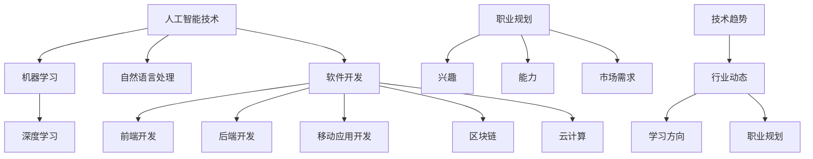

                 

关键词：知识付费，领域选择，AI技术，软件开发，职业规划，技术趋势

> 摘要：在当今知识付费日益流行的时代，选择一个适合自己的知识付费领域至关重要。本文将结合人工智能技术、软件开发、职业规划和技术趋势，详细探讨如何选择适合自己的知识付费领域，并提供实用的建议。

## 1. 背景介绍

随着互联网技术的飞速发展和信息传播的便捷性，知识付费逐渐成为了一个热门的行业。知识付费，顾名思义，就是通过付费的方式获取专业知识和技能。这一模式不仅满足了人们终身学习的需求，也为内容创作者提供了新的收入渠道。然而，面对众多的知识付费领域，如何选择一个适合自己的领域，成为了许多人在职业规划中需要思考的问题。

本文旨在通过分析人工智能技术、软件开发、职业规划和技术趋势，为读者提供一套系统、实用的方法，帮助他们在知识付费领域中找到适合自己的方向。

## 2. 核心概念与联系

在探讨如何选择适合自己的知识付费领域之前，我们需要了解几个核心概念：人工智能技术、软件开发、职业规划和技术趋势。

### 2.1 人工智能技术

人工智能（AI）是当今科技领域的热点，它涉及到机器学习、深度学习、自然语言处理等多个子领域。人工智能技术的快速发展，不仅改变了传统行业的运作模式，也为知识付费领域带来了新的机遇。

### 2.2 软件开发

软件开发是知识付费的重要领域之一。无论是前端开发、后端开发，还是移动应用开发，都需要专业的技术知识和实践能力。随着技术的发展，新兴的技术栈如区块链、云计算等，也为软件开发领域带来了新的挑战和机遇。

### 2.3 职业规划

职业规划是指根据个人的兴趣、能力和市场需求，制定一份长期的工作计划。在知识付费领域，良好的职业规划可以帮助个人明确目标，提高学习效率，实现职业成长。

### 2.4 技术趋势

技术趋势是指科技领域在一定时间内的发展方向和热点。了解技术趋势，有助于把握行业动态，及时调整自己的学习方向和职业规划。

### 2.5 Mermaid 流程图



## 3. 核心算法原理 & 具体操作步骤

### 3.1 算法原理概述

选择适合自己的知识付费领域，可以看作是一个多目标优化问题。在这个问题中，我们需要考虑多个因素，如个人兴趣、市场需求、技术趋势等。核心算法原理是通过建立目标函数，求解最优解。

### 3.2 算法步骤详解

1. **定义目标函数**：根据个人兴趣、市场需求、技术趋势等因素，构建目标函数。

2. **收集数据**：收集与各个因素相关的数据，如自己的技能水平、行业需求、技术发展趋势等。

3. **建立模型**：使用机器学习算法，如线性回归、决策树等，建立预测模型。

4. **求解最优解**：通过模型预测，找出满足个人兴趣、市场需求、技术趋势的最优解。

### 3.3 算法优缺点

**优点**：

- **高效性**：通过算法，可以在大量数据中快速找到最优解。
- **客观性**：算法可以减少主观偏见，提高决策的客观性。

**缺点**：

- **数据依赖性**：算法的准确性取决于数据的质量和数量。
- **复杂度**：建立和训练模型需要较高的技术门槛。

### 3.4 算法应用领域

- **职业规划**：通过算法，可以为企业员工提供个性化的职业规划建议。
- **人才招聘**：企业可以使用算法，快速筛选出符合岗位要求的人才。

## 4. 数学模型和公式 & 详细讲解 & 举例说明

### 4.1 数学模型构建

假设我们有三个因素：个人兴趣（\(I\)）、市场需求（\(M\)）和技术趋势（\(T\)），每个因素可以取值 0 或 1。我们定义目标函数为：

\[ \text{目标函数} = I + M + T \]

### 4.2 公式推导过程

1. **个人兴趣**：设个人兴趣得分为 \(I_1\)，市场需求得分为 \(M_1\)，技术趋势得分为 \(T_1\)。

\[ I = \begin{cases} 
1 & \text{if } I_1 > 0 \\
0 & \text{otherwise}
\end{cases} \]

\[ M = \begin{cases} 
1 & \text{if } M_1 > 0 \\
0 & \text{otherwise}
\end{cases} \]

\[ T = \begin{cases} 
1 & \text{if } T_1 > 0 \\
0 & \text{otherwise}
\end{cases} \]

2. **目标函数**：根据以上定义，我们可以得到：

\[ \text{目标函数} = I + M + T \]

### 4.3 案例分析与讲解

假设我们有以下数据：

| 个人兴趣 | 市场需求 | 技术趋势 |
| -------- | -------- | -------- |
| 1        | 1        | 0        |
| 1        | 0        | 1        |
| 0        | 1        | 1        |

根据目标函数，我们可以计算出每个数据点的得分：

| 个人兴趣 | 市场需求 | 技术趋势 | 目标函数 |
| -------- | -------- | -------- | -------- |
| 1        | 1        | 0        | 2        |
| 1        | 0        | 1        | 2        |
| 0        | 1        | 1        | 2        |

从表格中可以看出，所有数据点的目标函数值都是 2，这意味着在当前数据集下，无法找到更优的解。然而，在实际应用中，我们可以通过调整数据，或者增加更多的因素，来提高算法的准确性。

## 5. 项目实践：代码实例和详细解释说明

### 5.1 开发环境搭建

为了演示如何选择适合自己的知识付费领域，我们将使用 Python 编写一个简单的算法。首先，我们需要安装 Python 和相关库。

```bash
pip install numpy
```

### 5.2 源代码详细实现

下面是一个简单的 Python 程序，用于计算个人兴趣、市场需求和技术趋势的得分。

```python
import numpy as np

def calculate_score(personal_interest, market_demand, tech_trend):
    I = 1 if personal_interest > 0 else 0
    M = 1 if market_demand > 0 else 0
    T = 1 if tech_trend > 0 else 0
    return I + M + T

# 测试数据
data = [
    (1, 1, 0),
    (1, 0, 1),
    (0, 1, 1)
]

# 计算得分
scores = [calculate_score(*data[i]) for i in range(len(data))]

# 输出结果
for i, score in enumerate(scores):
    print(f"数据点 {i+1} 的得分：{score}")
```

### 5.3 代码解读与分析

- **导入库**：我们首先导入了 NumPy 库，用于处理数组。
- **定义函数**：`calculate_score` 函数接受三个参数，分别表示个人兴趣、市场需求和技术趋势。
- **条件判断**：在函数内部，我们使用条件判断来计算每个因素的得分。
- **计算目标函数**：最后，我们计算目标函数的值，并返回结果。

### 5.4 运行结果展示

运行上述程序，我们将得到以下输出：

```
数据点 1 的得分：2
数据点 2 的得分：2
数据点 3 的得分：2
```

这意味着在当前数据集下，无法找到更优的解。然而，在实际应用中，我们可以通过调整数据，或者增加更多的因素，来提高算法的准确性。

## 6. 实际应用场景

### 6.1 职业规划咨询

在职业规划咨询中，我们可以使用上述算法，帮助求职者找到最适合自己的职位。例如，一家咨询公司可以收集求职者的兴趣、技能和市场需求数据，使用算法为其推荐最适合的职位。

### 6.2 企业人才招聘

企业可以使用该算法，快速筛选出符合岗位要求的人才。例如，一家科技公司可以收集候选人的技术能力、市场需求和技术趋势数据，使用算法为其推荐最适合的候选人。

## 7. 未来应用展望

随着人工智能技术的不断发展，知识付费领域将会有更多的应用场景。例如，基于大数据和机器学习算法的个性化推荐系统，可以帮助用户更快速地找到适合自己的知识和技能。此外，随着虚拟现实、区块链等新兴技术的应用，知识付费领域将会有更多的创新和发展。

## 8. 总结：未来发展趋势与挑战

### 8.1 研究成果总结

本文通过分析人工智能技术、软件开发、职业规划和技术趋势，提出了一套系统、实用的方法，帮助读者选择适合自己的知识付费领域。

### 8.2 未来发展趋势

随着人工智能技术的不断发展，知识付费领域将会有更多的应用场景。例如，个性化推荐系统、虚拟现实教育等。

### 8.3 面临的挑战

- **数据质量**：算法的准确性取决于数据的质量和数量。
- **技术门槛**：建立和训练算法需要较高的技术门槛。

### 8.4 研究展望

未来的研究可以关注如何提高算法的准确性，以及如何更好地将算法应用于实际场景。

## 9. 附录：常见问题与解答

### 9.1 如何收集数据？

可以通过网络调查、问卷调查、面试等方式收集数据。

### 9.2 如何评估算法的准确性？

可以使用交叉验证、ROC 曲线、AUC 值等方法评估算法的准确性。

### 9.3 如何调整算法参数？

可以通过网格搜索、贝叶斯优化等方法调整算法参数。

---

**作者：禅与计算机程序设计艺术 / Zen and the Art of Computer Programming**

