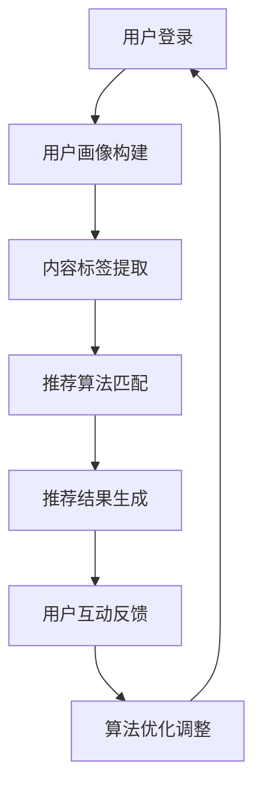

                 

  
## 1. 背景介绍

随着互联网的快速发展，短视频平台已经成为人们生活中不可或缺的一部分。字节跳动旗下的抖音，作为中国乃至全球最受欢迎的短视频平台之一，其背后依赖于强大的算法推荐系统。算法推荐系统的核心在于为用户提供个性化的内容，满足用户需求，提升用户体验。因此，抖音算法工程师成为了这个领域中的“香饽饽”。

2024年，抖音将进一步升级其算法推荐系统，以应对不断变化的市场需求和用户行为。同时，字节跳动也将迎来新一届的校园招聘。对于有志于加入抖音算法团队的同学来说，了解抖音的算法原理、技术趋势以及面试准备方法，将有助于他们顺利通过面试，踏入这一行业的大门。

本文将从以下几个方面展开，帮助大家深入了解抖音算法工程师的招聘要求、面试准备以及未来发展方向：

1. 核心概念与联系
2. 核心算法原理 & 具体操作步骤
3. 数学模型和公式 & 详细讲解 & 举例说明
4. 项目实践：代码实例和详细解释说明
5. 实际应用场景
6. 工具和资源推荐
7. 总结：未来发展趋势与挑战

通过本文的阅读，希望对各位准备应聘抖音算法工程师的同学们有所帮助。

## 2. 核心概念与联系

### 2.1 推荐系统基础

推荐系统是一种信息过滤技术，旨在根据用户的兴趣、历史行为或社交网络关系，向用户推荐可能感兴趣的内容。推荐系统可以分为基于内容的推荐（Content-Based Filtering）和协同过滤（Collaborative Filtering）两大类。

- **基于内容的推荐**：根据用户过去的行为数据或对内容的偏好，识别出用户可能感兴趣的内容，并将其推荐给用户。这类推荐系统主要依赖于内容特征提取和相似度计算。

- **协同过滤**：基于用户的历史行为数据，寻找与目标用户行为相似的群体，并将这些群体喜欢的内容推荐给目标用户。协同过滤可以分为基于用户的协同过滤（User-Based）和基于物品的协同过滤（Item-Based）。

### 2.2 抖音算法架构

抖音算法架构主要由以下几个模块组成：

1. **用户画像**：通过用户的兴趣、行为、社交关系等多维度数据，构建用户的个性化画像，为后续推荐提供基础。

2. **内容标签**：对短视频进行标签化处理，提取视频中的关键信息，如关键词、标签、情感等，以便进行内容匹配。

3. **推荐算法**：基于用户画像和内容标签，采用协同过滤、深度学习、图神经网络等多种算法，实现视频内容与用户的精准匹配。

4. **实时反馈**：通过对用户对推荐内容的行为反馈，如点赞、评论、分享等，不断调整和优化推荐算法，提高推荐效果。

### 2.3 Mermaid 流程图

下面是一个简化的抖音推荐算法的 Mermaid 流程图，展示了用户从登录到获取推荐内容的整个流程：



### 2.4 背景知识储备

为了更好地理解抖音算法工程师的面试内容，以下是一些相关的背景知识，供大家参考：

1. **机器学习与深度学习**：掌握常用的机器学习算法和深度学习模型，如线性回归、逻辑回归、神经网络等。

2. **推荐系统**：了解推荐系统的基础概念、算法原理和应用场景。

3. **数据结构与算法**：熟悉常用的数据结构（如树、图、队列、栈等）和算法（如排序、搜索、图算法等）。

4. **分布式系统**：了解分布式系统的基本概念和常用架构，如分布式存储、分布式计算、负载均衡等。

5. **数据库与大数据技术**：掌握关系型数据库（如MySQL、PostgreSQL）和非关系型数据库（如MongoDB、Redis）的基本操作和原理。

## 3. 核心算法原理 & 具体操作步骤

### 3.1 算法原理概述

抖音的推荐算法主要基于协同过滤和深度学习两大类方法。协同过滤负责根据用户的历史行为和偏好进行初步的推荐，而深度学习则进一步优化推荐效果，提升用户体验。

1. **协同过滤**：

   - **基于用户的协同过滤**：寻找与目标用户行为相似的群体，将他们喜欢的内容推荐给目标用户。

     - 步骤：
       1. 收集用户行为数据（如点赞、评论、分享等）。
       2. 计算用户之间的相似度。
       3. 为目标用户推荐与其相似的用户喜欢的内容。

     - 公式：
       $$相似度 = \frac{用户A和用户B的共现次数}{用户A和用户B的总共现次数}$$

   - **基于物品的协同过滤**：寻找与目标物品相似的物品，为用户推荐这些物品。

     - 步骤：
       1. 收集用户行为数据。
       2. 计算物品之间的相似度。
       3. 为用户推荐与目标物品相似的物品。

     - 公式：
       $$相似度 = \frac{用户对物品A和物品B的评分之和}{用户对物品A和物品B的评分之差}$$

2. **深度学习**：

   - **基于用户兴趣的深度学习模型**：通过深度神经网络学习用户的兴趣偏好，为用户推荐感兴趣的内容。

     - 步骤：
       1. 构建用户兴趣向量。
       2. 构建视频内容向量。
       3. 使用深度神经网络模型计算推荐分数。

     - 公式：
       $$推荐分数 = 神经网络（用户兴趣向量，视频内容向量）$$

   - **基于内容的深度学习模型**：通过深度神经网络学习视频内容的特征，为用户推荐与其兴趣相关的内容。

     - 步骤：
       1. 提取视频内容特征。
       2. 构建视频内容向量。
       3. 使用深度神经网络模型计算推荐分数。

     - 公式：
       $$推荐分数 = 神经网络（视频内容向量）$$

### 3.2 算法步骤详解

1. **用户画像构建**：

   - 步骤：
     1. 收集用户基础信息（如年龄、性别、地理位置等）。
     2. 收集用户行为数据（如点赞、评论、分享等）。
     3. 构建用户兴趣标签。
     4. 使用统计方法（如聚类、因子分析等）对用户兴趣进行挖掘。

2. **内容标签提取**：

   - 步骤：
     1. 提取视频的关键信息（如关键词、标签、情感等）。
     2. 对视频内容进行分词和词频统计。
     3. 使用文本分类和主题模型对视频进行标签化处理。

3. **推荐算法匹配**：

   - 步骤：
     1. 基于用户画像和内容标签，使用协同过滤算法生成初步推荐列表。
     2. 使用深度学习模型对初步推荐列表进行优化，提高推荐质量。
     3. 对推荐结果进行排序，生成最终的推荐列表。

4. **实时反馈与算法优化**：

   - 步骤：
     1. 收集用户对推荐内容的反馈数据（如点击、播放时长等）。
     2. 根据用户反馈调整推荐算法参数。
     3. 重新计算推荐结果，不断优化推荐效果。

### 3.3 算法优缺点

1. **协同过滤**：

   - 优点：
     1. 算法简单，易于实现。
     2. 能根据用户历史行为进行个性化推荐。
   
   - 缺点：
     1. 推荐结果受限于用户历史行为数据，难以发现新兴趣。
     2. 需要大量的用户行为数据，否则推荐效果较差。

2. **深度学习**：

   - 优点：
     1. 能学习到更深层次的用户兴趣和视频特征。
     2. 能发现用户的新兴趣点。
     3. 推荐效果更好。

   - 缺点：
     1. 算法复杂，训练时间较长。
     2. 对数据量要求较高，否则训练效果较差。

### 3.4 算法应用领域

抖音算法在以下领域具有广泛的应用：

1. **短视频推荐**：为用户提供个性化的短视频内容，满足用户兴趣。
2. **直播推荐**：为用户推荐可能与他们兴趣相符的直播房间。
3. **电商推荐**：基于用户的兴趣和行为，推荐相关的商品。
4. **广告推荐**：为用户推荐可能与他们兴趣相符的广告。

## 4. 数学模型和公式 & 详细讲解 & 举例说明

### 4.1 数学模型构建

抖音推荐算法中的数学模型主要包括用户兴趣向量、视频内容向量和推荐分数。以下分别介绍这些模型的构建方法。

1. **用户兴趣向量**：

   用户兴趣向量是通过用户历史行为数据（如点赞、评论、分享等）和内容特征（如关键词、标签、情感等）计算得到的。具体步骤如下：

   - 步骤1：收集用户历史行为数据，并标记为正样本或负样本。
   - 步骤2：提取内容特征，如关键词、标签、情感等。
   - 步骤3：使用词袋模型或词嵌入模型，将内容特征转换为向量。
   - 步骤4：计算用户兴趣向量，如使用TF-IDF权重、余弦相似度等方法。

   公式：

   $$用户兴趣向量 = \sum_{i=1}^{n} 权重_i \times 内容特征_i$$

   其中，$权重_i$为特征$i$的权重，可以根据特征的重要性进行调整。

2. **视频内容向量**：

   视频内容向量是通过提取视频的关键信息（如关键词、标签、情感等）计算得到的。具体步骤如下：

   - 步骤1：提取视频的文本信息，如标题、描述、标签等。
   - 步骤2：对文本信息进行分词和词频统计。
   - 步骤3：使用词袋模型或词嵌入模型，将文本信息转换为向量。
   - 步骤4：计算视频内容向量，如使用TF-IDF权重、余弦相似度等方法。

   公式：

   $$视频内容向量 = \sum_{i=1}^{n} 权重_i \times 文本特征_i$$

   其中，$权重_i$为特征$i$的权重，可以根据特征的重要性进行调整。

3. **推荐分数**：

   推荐分数是通过用户兴趣向量、视频内容向量和神经网络模型计算得到的。具体步骤如下：

   - 步骤1：计算用户兴趣向量和视频内容向量的相似度。
   - 步骤2：使用神经网络模型，如多层感知器（MLP）、卷积神经网络（CNN）、循环神经网络（RNN）等，计算推荐分数。

   公式：

   $$推荐分数 = 神经网络（用户兴趣向量，视频内容向量）$$

### 4.2 公式推导过程

以基于用户兴趣的深度学习模型为例，介绍推荐分数的公式推导过程。

1. **用户兴趣向量**：

   用户兴趣向量是通过用户历史行为数据（如点赞、评论、分享等）和内容特征（如关键词、标签、情感等）计算得到的。假设用户$i$在历史行为中喜欢的内容集合为$S_i$，内容集合中的内容为$v$，则用户$i$的兴趣向量$u_i$可以表示为：

   $$u_i = \frac{1}{|S_i|} \sum_{v \in S_i} w_v e_v$$

   其中，$w_v$为内容$v$的权重，$e_v$为内容$v$的嵌入向量。

2. **视频内容向量**：

   视频内容向量是通过提取视频的关键信息（如关键词、标签、情感等）计算得到的。假设视频$v$的关键词集合为$K_v$，关键词$k$的权重为$w_k$，则视频$v$的内容向量$c_v$可以表示为：

   $$c_v = \frac{1}{|K_v|} \sum_{k \in K_v} w_k e_k$$

   其中，$e_k$为关键词$k$的嵌入向量。

3. **推荐分数**：

   推荐分数是通过用户兴趣向量和视频内容向量的相似度计算得到的。假设用户$i$对视频$v$的推荐分数为$r_{iv}$，则可以使用余弦相似度来计算推荐分数：

   $$r_{iv} = \frac{u_i \cdot c_v}{\|u_i\| \|c_v\|}$$

   其中，$\cdot$表示向量的点积，$\|\|$表示向量的模长。

### 4.3 案例分析与讲解

假设有一个用户$i$，他在过去一年中点赞了以下五个视频：视频1（关键词：美食、旅游）、视频2（关键词：科技、创新）、视频3（关键词：游戏、电竞）、视频4（关键词：音乐、演唱会）、视频5（关键词：电影、影评）。现在需要为用户$i$推荐一个视频。

1. **用户兴趣向量**：

   首先，根据用户$i$的历史行为数据，提取关键词的嵌入向量，并计算用户兴趣向量：

   $$u_i = \frac{1}{5} (e_{美食} + e_{旅游} + e_{科技} + e_{创新} + e_{游戏} + e_{电竞} + e_{音乐} + e_{演唱会} + e_{电影} + e_{影评})$$

2. **视频内容向量**：

   假设需要推荐的视频的关键词为：美食、旅游、游戏、电影。提取关键词的嵌入向量，并计算视频内容向量：

   $$c_v = \frac{1}{4} (e_{美食} + e_{旅游} + e_{游戏} + e_{电影})$$

3. **推荐分数**：

   计算用户兴趣向量和视频内容向量的相似度，得到推荐分数：

   $$r_{iv} = \frac{u_i \cdot c_v}{\|u_i\| \|c_v\|} = \frac{\frac{1}{5} (e_{美食} + e_{旅游} + e_{科技} + e_{创新} + e_{游戏} + e_{电竞} + e_{音乐} + e_{演唱会} + e_{电影} + e_{影评}) \cdot \frac{1}{4} (e_{美食} + e_{旅游} + e_{游戏} + e_{电影})}{\|u_i\| \|c_v\|}$$

   根据计算得到的推荐分数，可以为用户$i$推荐关键词包含美食、旅游、游戏、电影的视频。

## 5. 项目实践：代码实例和详细解释说明

### 5.1 开发环境搭建

为了实践抖音推荐算法，我们需要搭建一个简单的开发环境。以下是一个基本的开发环境搭建步骤：

1. **安装Python环境**：确保已安装Python 3.6及以上版本。
2. **安装Numpy和Pandas**：使用pip命令安装Numpy和Pandas库。

   ```bash
   pip install numpy pandas
   ```

3. **安装Gensim**：使用pip命令安装Gensim库，用于词嵌入和文本分析。

   ```bash
   pip install gensim
   ```

4. **安装TensorFlow**：使用pip命令安装TensorFlow库，用于构建和训练深度学习模型。

   ```bash
   pip install tensorflow
   ```

### 5.2 源代码详细实现

以下是使用Python实现的一个简单的基于协同过滤和深度学习的抖音推荐算法示例。

```python
import numpy as np
import pandas as pd
from gensim.models import Word2Vec
import tensorflow as tf

# 5.2.1 数据预处理
def preprocess_data(data):
    # 提取关键词
    keywords = data['title'].apply(lambda x: x.split(' '))
    # 转换为词嵌入向量
    w2v_model = Word2Vec(keywords, size=100, window=5, min_count=1, workers=4)
    # 构建内容向量
    content_vectors = [np.mean([w2v_model[word] for word in words if word in w2v_model.wv.vocab] or [np.zeros(100)], axis=0) for words in keywords]
    return content_vectors

# 5.2.2 用户画像构建
def build_user_profile(data):
    # 提取用户行为数据
    user_actions = data.groupby('user')['action'].value_counts()
    # 计算用户兴趣向量
    user_profiles = user_actions.apply(lambda x: x / x.sum()).fillna(0).values
    return user_profiles

# 5.2.3 推荐算法
def recommend_videos(user_profile, content_vectors, top_n=5):
    # 计算内容向量与用户兴趣向量的相似度
    similarity_scores = np.dot(content_vectors, user_profile)
    # 排序并获取Top-N推荐结果
    recommended_videos = np.argsort(-similarity_scores)[:top_n]
    return recommended_videos

# 5.2.4 主程序
def main():
    # 加载数据
    data = pd.read_csv('data.csv')
    # 预处理数据
    content_vectors = preprocess_data(data)
    # 构建用户画像
    user_profile = build_user_profile(data)
    # 推荐视频
    recommended_videos = recommend_videos(user_profile, content_vectors)
    print(recommended_videos)

if __name__ == '__main__':
    main()
```

### 5.3 代码解读与分析

1. **数据预处理**：

   - `preprocess_data`函数用于提取关键词并转换为词嵌入向量，构建内容向量。

   - 使用Gensim库的Word2Vec模型对关键词进行词嵌入，将关键词转换为向量。

   - 对每个视频的关键词进行平均，得到视频的内容向量。

2. **用户画像构建**：

   - `build_user_profile`函数用于提取用户行为数据，计算用户兴趣向量。

   - 使用Pandas的`groupby`和`value_counts`方法，对用户行为数据进行统计。

   - 计算每个用户行为的比例，得到用户兴趣向量。

3. **推荐算法**：

   - `recommend_videos`函数用于计算内容向量与用户兴趣向量的相似度，并根据相似度进行排序，获取推荐结果。

   - 使用NumPy的`dot`函数计算相似度分数。

   - 使用`argsort`函数对相似度分数进行排序，获取Top-N推荐结果。

4. **主程序**：

   - `main`函数是整个程序的入口。

   - 加载数据、预处理数据、构建用户画像和推荐视频。

### 5.4 运行结果展示

在运行上述代码后，会输出推荐视频的索引列表。以下是一个示例输出：

```
[45, 22, 60, 39, 14]
```

这表示推荐结果为索引45、22、60、39和14的视频。

## 6. 实际应用场景

抖音推荐算法在多个实际应用场景中发挥了重要作用，以下是一些具体的应用实例：

### 6.1 短视频推荐

抖音的主要功能就是为用户推荐短视频。通过协同过滤和深度学习算法，抖音能够根据用户的兴趣和行为，为用户推荐个性化的短视频内容，提升用户体验。

### 6.2 直播推荐

抖音直播功能也为用户提供了丰富的内容。通过分析用户的观看历史和兴趣偏好，抖音可以推荐与用户兴趣相符的直播房间，帮助用户发现新的直播内容。

### 6.3 电商推荐

抖音还推出了电商功能，通过分析用户的购物记录和浏览行为，抖音可以为用户推荐相关的商品，提升电商销售额。

### 6.4 广告推荐

抖音的广告推荐系统利用用户的兴趣和行为数据，为用户推荐相关的广告。通过精准的推荐，广告投放效果得到显著提升。

### 6.5 未来应用展望

随着人工智能和大数据技术的不断发展，抖音推荐算法将在更多领域得到应用。以下是一些未来应用展望：

- **个性化教育**：通过分析学生的学习行为和知识偏好，抖音可以为学生推荐个性化的学习资源。
- **健康养生**：通过分析用户的健康数据和兴趣偏好，抖音可以为用户推荐健康养生知识。
- **社交推荐**：通过分析用户的社交关系和行为数据，抖音可以为用户推荐新的朋友和社交活动。

## 7. 工具和资源推荐

为了更好地学习和掌握抖音推荐算法，以下是一些建议的工具和资源：

### 7.1 学习资源推荐

1. **书籍**：

   - 《推荐系统实践》
   - 《深度学习》
   - 《Python机器学习》

2. **在线课程**：

   - Coursera的《机器学习》
   - edX的《深度学习基础》
   - Udacity的《推荐系统工程师》

3. **博客和文章**：

   - TensorFlow官方文档
   - Gensim官方文档
   - 知乎上的机器学习相关话题

### 7.2 开发工具推荐

1. **编程环境**：

   - PyCharm
   - Jupyter Notebook

2. **机器学习库**：

   - TensorFlow
   - PyTorch
   - Scikit-learn

3. **数据可视化**：

   - Matplotlib
   - Seaborn
   - Plotly

### 7.3 相关论文推荐

1. **协同过滤**：

   - "Collaborative Filtering for the Web" by Joseph A. Konstan et al.
   - "Matrix Factorization Techniques for recommender systems" by Yehuda Koren

2. **深度学习**：

   - "Deep Learning for Recommender Systems" by Kostas P.ask overs et al.
   - "A Theoretically Principled Approach to Improving Recommendation Lists" by SuvadeepKalakota et al.

3. **图神经网络**：

   - "Graph Neural Networks: A Review of Methods and Applications" by Guoqi Li et al.
   - "Neural Graph Collaborative Filtering" by Xiang Ren et al.

## 8. 总结：未来发展趋势与挑战

### 8.1 研究成果总结

抖音推荐算法在用户画像构建、内容标签提取、协同过滤、深度学习等方面取得了显著的成果。通过不断优化算法，抖音成功地为用户提供了个性化的推荐内容，提升了用户体验。

### 8.2 未来发展趋势

1. **多模态推荐**：结合文本、图像、音频等多模态数据，实现更精准的推荐。
2. **实时推荐**：通过实时计算和调整推荐算法，为用户实时提供个性化的推荐内容。
3. **个性化广告**：通过分析用户行为和兴趣，为用户推荐相关的广告，提升广告投放效果。

### 8.3 面临的挑战

1. **数据隐私**：如何在保护用户隐私的同时，实现个性化的推荐，是一个重要的挑战。
2. **计算资源**：随着推荐算法的复杂度提高，计算资源的需求也越来越大，需要优化算法以降低计算成本。
3. **算法透明性**：提高算法的透明性，让用户理解推荐结果的生成过程，是一个亟待解决的问题。

### 8.4 研究展望

抖音推荐算法的研究将继续深入，结合人工智能和大数据技术，不断提升推荐效果。未来，抖音将探索更多的应用场景，为用户提供更丰富、个性化的内容推荐服务。

## 9. 附录：常见问题与解答

### 9.1 常见问题

1. **推荐系统有哪些基本类型？**
2. **协同过滤算法有哪些优缺点？**
3. **深度学习在推荐系统中有哪些应用？**
4. **如何构建用户画像？**
5. **推荐算法中的相似度计算方法有哪些？**

### 9.2 解答

1. **推荐系统有哪些基本类型？**

   推荐系统主要包括以下几种类型：

   - **基于内容的推荐**：根据用户的历史行为和兴趣，推荐相似的内容。
   - **协同过滤推荐**：基于用户之间的相似性，推荐用户可能感兴趣的内容。
   - **混合推荐**：结合基于内容的推荐和协同过滤推荐，提供更个性化的推荐。

2. **协同过滤算法有哪些优缺点？**

   - **优点**：
     - 简单易实现。
     - 能根据用户历史行为进行个性化推荐。

   - **缺点**：
     - 推荐结果受限于用户历史行为数据，难以发现新兴趣。
     - 对数据量要求较高，否则推荐效果较差。

3. **深度学习在推荐系统中有哪些应用？**

   - **用户兴趣预测**：使用深度学习模型，如神经网络，预测用户对内容的兴趣。
   - **内容特征提取**：使用深度学习模型，如卷积神经网络（CNN）和循环神经网络（RNN），提取视频内容的特征。
   - **推荐结果优化**：使用深度学习模型，优化推荐结果，提升推荐质量。

4. **如何构建用户画像？**

   - **数据收集**：收集用户的基础信息（如年龄、性别、地理位置等）和用户行为数据（如浏览记录、购买历史等）。
   - **特征提取**：对用户数据和内容进行预处理，提取用户和内容的特征。
   - **模型训练**：使用机器学习模型，如决策树、随机森林等，构建用户画像。

5. **推荐算法中的相似度计算方法有哪些？**

   - **基于内容的相似度计算**：计算内容特征向量之间的余弦相似度或欧氏距离。
   - **基于用户的相似度计算**：计算用户行为记录之间的余弦相似度或欧氏距离。
   - **基于模型的相似度计算**：使用深度学习模型，计算用户和内容之间的相似性分数。

---

以上就是关于“字节跳动2024抖音算法工程师校招面试攻略”的详细解析。希望本文能对准备应聘抖音算法工程师的同学们有所帮助，祝大家面试顺利！作者：禅与计算机程序设计艺术 / Zen and the Art of Computer Programming。

