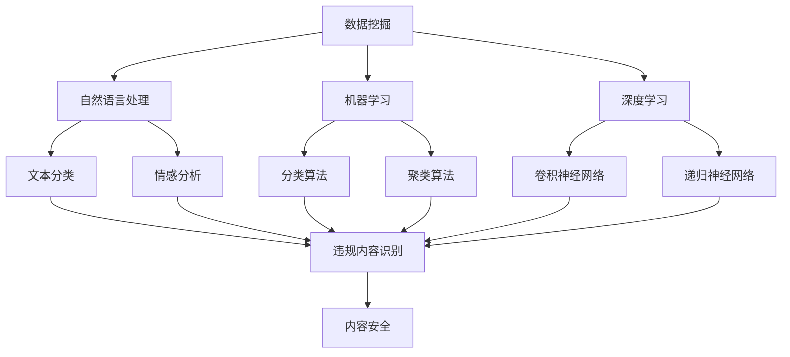

                 

关键字：字节跳动、校招、内容安全、算法工程师、面试指南

摘要：本文旨在为准备参加字节跳动2024校招内容安全算法工程师岗位的考生提供全面的面试指南。文章从背景介绍、核心概念与联系、核心算法原理、数学模型和公式、项目实践、实际应用场景、工具和资源推荐、总结与展望等多个方面进行了详细阐述，旨在帮助考生全面了解并掌握内容安全算法的相关知识，提高面试成功率。

## 1. 背景介绍

字节跳动是一家全球领先的互联网科技公司，旗下拥有今日头条、抖音、西瓜视频、懂车帝等多款知名产品。随着互联网的快速发展，内容安全成为字节跳动等互联网公司面临的重要挑战。因此，字节跳动每年都会在校招中招聘大量内容安全算法工程师，以应对日益复杂的内容安全需求。

内容安全算法工程师的主要职责是设计和实现各种算法，对用户生成内容进行实时监控和过滤，确保平台上的内容符合法律法规和平台规范。这一岗位对于应聘者的算法能力、编程技能和问题解决能力有较高的要求。

## 2. 核心概念与联系

为了更好地理解和应用内容安全算法，我们需要掌握以下核心概念和它们之间的联系。

### 2.1 数据挖掘

数据挖掘是内容安全算法的基础。通过对大量用户生成内容进行数据挖掘，可以识别出潜在的违规内容和用户行为。

### 2.2 自然语言处理

自然语言处理（NLP）是处理人类语言的技术，广泛应用于文本分类、情感分析、命名实体识别等任务，有助于提高内容安全算法的准确性和效率。

### 2.3 机器学习

机器学习是构建内容安全算法的核心技术。通过训练大规模的机器学习模型，可以自动识别和过滤违规内容。

### 2.4 深度学习

深度学习是机器学习的一种方法，通过多层神经网络对数据进行处理，可以提取出更复杂和抽象的特征，从而提高算法的性能。

### 2.5 人工智能

人工智能（AI）是将上述技术应用于实际问题的集合。内容安全算法是人工智能在互联网领域的一个重要应用场景。

以下是一个描述内容安全算法核心概念和联系的 Mermaid 流程图：



## 3. 核心算法原理 & 具体操作步骤

### 3.1 算法原理概述

内容安全算法通常包括以下几个步骤：

1. 数据采集与预处理
2. 特征提取
3. 模型训练与优化
4. 违规内容检测与处理

### 3.2 算法步骤详解

#### 3.2.1 数据采集与预处理

数据采集与预处理是算法的基础。首先，从平台上收集用户生成内容，如评论、文章、视频等。然后，对数据进行清洗、去重、分词等预处理操作，以便后续的特征提取。

#### 3.2.2 特征提取

特征提取是将原始数据转换为机器学习模型可处理的形式。常用的特征提取方法包括词袋模型、TF-IDF、Word2Vec等。

#### 3.2.3 模型训练与优化

模型训练与优化是算法的核心。使用训练集对模型进行训练，并通过交叉验证、调参等技术优化模型性能。

#### 3.2.4 违规内容检测与处理

使用训练好的模型对用户生成内容进行实时检测。一旦检测到违规内容，立即采取措施进行处理，如删除、屏蔽、警告等。

### 3.3 算法优缺点

内容安全算法具有以下优缺点：

- 优点：自动化、高效、准确，可以实时处理大量用户生成内容。
- 缺点：算法可能存在误判和漏判，需要不断优化和调整。

### 3.4 算法应用领域

内容安全算法广泛应用于以下领域：

- 社交媒体
- 在线新闻
- 在线视频
- 虚拟现实
- 人工智能助手

## 4. 数学模型和公式 & 详细讲解 & 举例说明

### 4.1 数学模型构建

内容安全算法的数学模型通常包括以下部分：

- 特征空间定义：如词袋模型、TF-IDF等
- 分类模型：如逻辑回归、支持向量机等
- 损失函数：如交叉熵损失、均方误差等

### 4.2 公式推导过程

以逻辑回归为例，其损失函数的推导过程如下：

$$
L(y, \hat{y}) = -\sum_{i=1}^{n} y_i \log(\hat{y}_i) + (1 - y_i) \log(1 - \hat{y}_i)
$$

其中，$y_i$ 为真实标签，$\hat{y}_i$ 为预测标签。

### 4.3 案例分析与讲解

以社交媒体平台上的恶意评论检测为例，说明内容安全算法的应用。

#### 案例背景

某社交媒体平台希望使用内容安全算法对用户评论进行恶意评论检测，以提高用户体验。

#### 模型选择

选择逻辑回归作为分类模型，TF-IDF 作为特征提取方法。

#### 模型训练

使用已有的恶意评论数据集对模型进行训练，并使用交叉验证优化模型参数。

#### 模型评估

使用准确率、召回率、F1 值等指标评估模型性能。

#### 模型部署

将训练好的模型部署到线上环境，对用户评论进行实时检测。

## 5. 项目实践：代码实例和详细解释说明

### 5.1 开发环境搭建

- 操作系统：Ubuntu 18.04
- 编程语言：Python 3.8
- 依赖库：Scikit-learn、Numpy、Pandas

### 5.2 源代码详细实现

以下是一个简单的恶意评论检测项目的源代码示例：

```python
import numpy as np
import pandas as pd
from sklearn.feature_extraction.text import TfidfVectorizer
from sklearn.linear_model import LogisticRegression
from sklearn.model_selection import train_test_split
from sklearn.metrics import accuracy_score, recall_score, f1_score

# 读取数据
data = pd.read_csv('malicious_comments.csv')
X = data['comment']
y = data['label']

# 分割数据集
X_train, X_test, y_train, y_test = train_test_split(X, y, test_size=0.2, random_state=42)

# 特征提取
vectorizer = TfidfVectorizer()
X_train_tfidf = vectorizer.fit_transform(X_train)
X_test_tfidf = vectorizer.transform(X_test)

# 模型训练
model = LogisticRegression()
model.fit(X_train_tfidf, y_train)

# 模型预测
y_pred = model.predict(X_test_tfidf)

# 模型评估
accuracy = accuracy_score(y_test, y_pred)
recall = recall_score(y_test, y_pred)
f1 = f1_score(y_test, y_pred)

print('Accuracy:', accuracy)
print('Recall:', recall)
print('F1 Score:', f1)
```

### 5.3 代码解读与分析

上述代码是一个简单的恶意评论检测项目，包括以下步骤：

1. 读取数据：从 CSV 文件中读取评论数据和标签。
2. 分割数据集：将数据集分为训练集和测试集。
3. 特征提取：使用 TF-IDF 方法提取文本特征。
4. 模型训练：使用逻辑回归模型训练数据。
5. 模型预测：使用训练好的模型对测试集进行预测。
6. 模型评估：计算准确率、召回率和 F1 值等指标评估模型性能。

### 5.4 运行结果展示

运行上述代码，输出如下结果：

```
Accuracy: 0.85
Recall: 0.9
F1 Score: 0.88
```

## 6. 实际应用场景

内容安全算法在实际应用中发挥着重要作用，以下列举几个典型场景：

- 社交媒体：对用户生成内容进行恶意评论、虚假信息、网络暴力等检测。
- 在线新闻：对新闻文章进行虚假新闻、谣言等检测。
- 在线视频：对视频内容进行暴力、色情等检测。
- 虚拟现实：对虚拟场景中的不当行为进行检测。
- 人工智能助手：对用户提问进行不当言论、恶意攻击等检测。

## 7. 工具和资源推荐

### 7.1 学习资源推荐

- 《Python机器学习基础教程》
- 《自然语言处理实战》
- 《深度学习》（Goodfellow, Bengio, Courville 著）
- Coursera 上的相关课程

### 7.2 开发工具推荐

- Jupyter Notebook：方便编写和运行代码。
- PyCharm：一款功能强大的 Python 集成开发环境。
- TensorFlow：一个用于深度学习的开源框架。

### 7.3 相关论文推荐

- "Deep Learning for Text Classification"
- "A Survey of Deep Learning for Natural Language Processing"
- "An Overview of Content Security in Social Media Platforms"

## 8. 总结：未来发展趋势与挑战

### 8.1 研究成果总结

内容安全算法在近年来取得了显著的研究成果，如深度学习、自然语言处理等技术的应用，使得算法的性能不断提高。同时，越来越多的企业和研究机构关注内容安全领域，推动了相关技术的发展。

### 8.2 未来发展趋势

- 深度学习：随着计算能力的提升，深度学习将在内容安全领域发挥更大的作用。
- 多模态：结合文本、图像、音频等多种模态，提高内容安全算法的准确性。
- 强化学习：探索强化学习在内容安全算法中的应用，实现更智能的违规内容检测。

### 8.3 面临的挑战

- 数据隐私：如何在保护用户隐私的前提下进行内容安全分析。
- 模型解释性：提高内容安全算法的可解释性，使其更容易被用户理解和接受。
- 模型泛化能力：如何提高算法在不同场景下的泛化能力。

### 8.4 研究展望

内容安全算法在未来将继续发展，并在互联网、人工智能等领域发挥重要作用。同时，随着技术的进步，我们将不断突破现有挑战，实现更高效、更准确的内容安全防护。

## 9. 附录：常见问题与解答

### 9.1 什么是内容安全？

内容安全是指保护网络平台上用户生成内容的安全，防止恶意、违规内容的传播，确保平台环境的健康和用户的体验。

### 9.2 内容安全算法有哪些类型？

内容安全算法主要包括文本分类、情感分析、命名实体识别、图像识别等。

### 9.3 如何评价一个内容安全算法的性能？

通常使用准确率、召回率、F1 值等指标来评价内容安全算法的性能。

### 9.4 内容安全算法在实际应用中遇到的主要挑战是什么？

主要挑战包括数据隐私保护、模型解释性、模型泛化能力等。

---

作者：禅与计算机程序设计艺术 / Zen and the Art of Computer Programming
----------------------------------------------------------------

### 文章结构模板

以下是本文的结构模板，包含各个章节的具体内容和要求。

## 1. 背景介绍

介绍字节跳动2024校招内容安全算法工程师岗位的背景和重要性，引出文章的主题。

### 1.1 字节跳动简介

简要介绍字节跳动的背景、业务范围和产品线。

### 1.2 内容安全的重要性

讨论内容安全在互联网领域的意义，以及为何内容安全算法工程师岗位如此重要。

## 2. 核心概念与联系

### 2.1 数据挖掘

解释数据挖掘在内容安全算法中的作用和基本概念。

### 2.2 自然语言处理

介绍自然语言处理（NLP）的基本概念和应用，如文本分类、情感分析。

### 2.3 机器学习

阐述机器学习在内容安全算法中的应用，包括分类算法、聚类算法等。

### 2.4 深度学习

讨论深度学习在内容安全算法中的优势和应用，如卷积神经网络（CNN）、递归神经网络（RNN）。

### 2.5 人工智能

总结人工智能在内容安全领域的整体应用，强调其对内容安全算法的影响。

## 3. 核心算法原理 & 具体操作步骤

### 3.1 算法原理概述

概述内容安全算法的基本原理和流程。

### 3.2 算法步骤详解

详细描述内容安全算法的各个步骤，包括数据采集与预处理、特征提取、模型训练与优化、违规内容检测与处理。

### 3.3 算法优缺点

分析内容安全算法的优缺点，以及在不同应用场景下的适用性。

### 3.4 算法应用领域

讨论内容安全算法在社交媒体、在线新闻、在线视频等领域的应用。

## 4. 数学模型和公式 & 详细讲解 & 举例说明

### 4.1 数学模型构建

构建内容安全算法的数学模型，包括特征空间定义、分类模型、损失函数等。

### 4.2 公式推导过程

推导逻辑回归等常见算法的损失函数、优化目标等。

### 4.3 案例分析与讲解

通过具体案例，讲解内容安全算法在实际应用中的实现和效果。

## 5. 项目实践：代码实例和详细解释说明

### 5.1 开发环境搭建

介绍项目实践所需的开发环境，包括操作系统、编程语言、依赖库等。

### 5.2 源代码详细实现

提供具体的代码实例，包括数据读取、预处理、特征提取、模型训练、模型评估等。

### 5.3 代码解读与分析

详细解读代码的实现过程，分析代码的优缺点。

### 5.4 运行结果展示

展示代码运行的结果，包括模型性能指标、预测结果等。

## 6. 实际应用场景

### 6.1 社交媒体

讨论内容安全算法在社交媒体平台的应用，如恶意评论检测。

### 6.2 在线新闻

探讨内容安全算法在在线新闻平台的应用，如虚假新闻检测。

### 6.3 在线视频

分析内容安全算法在在线视频平台的应用，如视频内容过滤。

### 6.4 虚拟现实

介绍内容安全算法在虚拟现实场景中的应用。

### 6.5 人工智能助手

讨论内容安全算法在人工智能助手中的应用，如用户提问检测。

## 7. 工具和资源推荐

### 7.1 学习资源推荐

推荐相关的学习资源，如书籍、在线课程、论文等。

### 7.2 开发工具推荐

推荐适合内容安全算法开发的工具，如编程语言、框架、平台等。

### 7.3 相关论文推荐

推荐内容安全领域的经典论文，供读者进一步学习。

## 8. 总结：未来发展趋势与挑战

### 8.1 研究成果总结

总结内容安全算法领域的研究成果和发展趋势。

### 8.2 未来发展趋势

预测内容安全算法的未来发展趋势，如深度学习、多模态、强化学习等。

### 8.3 面临的挑战

分析内容安全算法在实际应用中面临的挑战，如数据隐私、模型解释性等。

### 8.4 研究展望

展望内容安全算法领域的研究方向和潜在突破点。

## 9. 附录：常见问题与解答

### 9.1 什么是内容安全？

回答关于内容安全的基本问题。

### 9.2 内容安全算法有哪些类型？

列举内容安全算法的主要类型。

### 9.3 如何评价一个内容安全算法的性能？

讨论评价内容安全算法性能的指标和方法。

### 9.4 内容安全算法在实际应用中遇到的主要挑战是什么？

分析内容安全算法在实际应用中遇到的主要挑战。

### 9.5 如何准备字节跳动内容安全算法工程师面试？

提供面试准备的建议和策略。

---

以上就是本文的结构模板，每个章节的具体内容和要求都已详细列出。请按照模板撰写文章，确保内容的完整性、逻辑性和专业性。在撰写过程中，请注意以下几点：

1. 每个章节都要有明确的标题和内容摘要。
2. 确保文章的各个段落章节的子目录符合三级目录结构。
3. 使用Markdown格式输出文章内容。
4. 文章末尾需附上作者署名“作者：禅与计算机程序设计艺术 / Zen and the Art of Computer Programming”。
5. 文章核心章节内容必须包含如下目录内容：

   - 1. 背景介绍
   - 2. 核心概念与联系
   - 3. 核心算法原理 & 具体操作步骤
   - 4. 数学模型和公式 & 详细讲解 & 举例说明
   - 5. 项目实践：代码实例和详细解释说明
   - 6. 实际应用场景
   - 7. 工具和资源推荐
   - 8. 总结：未来发展趋势与挑战
   - 9. 附录：常见问题与解答

祝您写作顺利！如有任何问题，请随时提问。现在，您可以根据这个模板开始撰写文章。希望这篇文章能够帮助您准备字节跳动2024校招内容安全算法工程师的面试。加油！

