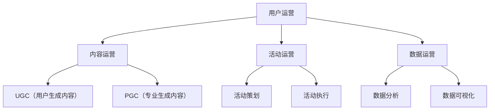
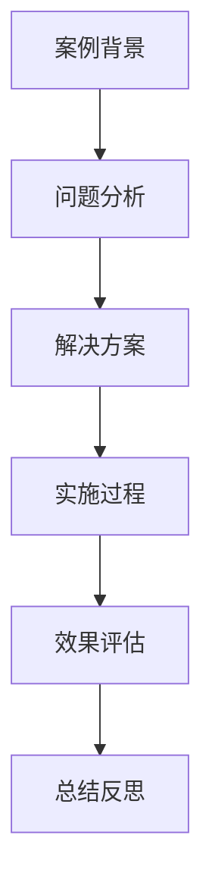
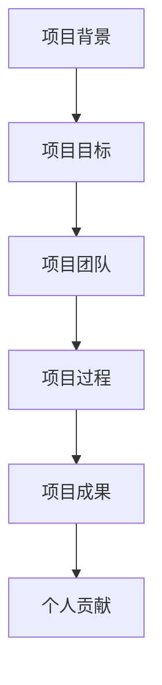

                 

关键词：字节跳动、校招、内容运营、面试、问答集锦、面试准备、策略、案例分析、技能评估

摘要：本文将围绕字节跳动2024年校招内容运营专员的面试问题进行深入分析，总结常见的面试题型及策略，并结合实际案例，提供详细的解答和技巧，帮助求职者在面试中脱颖而出。

## 1. 背景介绍

随着互联网行业的飞速发展，内容运营成为企业不可或缺的一环。字节跳动作为国内领先的移动互联网公司，其内容运营岗位吸引了大量求职者。本文旨在为广大求职者提供一份全面的面试问答集锦，助力大家在2024年字节跳动校招内容运营专员的面试中取得优异成绩。

### 1.1 字节跳动内容运营岗位特点

1. **高要求**：字节跳动对内容运营岗位的求职者有较高的要求，不仅需要具备扎实的运营知识，还需具备较强的数据分析能力和创新思维。
2. **多元化**：内容运营岗位涉及多种类型的内容，包括图文、短视频、直播等，求职者需要具备多元化的内容创作能力。
3. **团队合作**：内容运营岗位通常需要与其他部门密切配合，如产品、技术、市场等，求职者需具备良好的团队协作能力。

### 1.2 内容运营专员面试内容

字节跳动内容运营专员的面试内容主要包括以下几个方面：

1. **基础知识**：包括运营、市场、数据分析等相关知识。
2. **案例分析**：通过实际案例，考察求职者的分析能力、创新思维和解决问题的能力。
3. **项目经验**：了解求职者在过往项目中的具体工作内容、成果和收获。
4. **综合素质**：包括沟通能力、团队协作能力、抗压能力等。

## 2. 核心概念与联系

下面是关于字节跳动内容运营专员面试中涉及的核心概念与联系，以及对应的Mermaid流程图。

### 2.1 运营知识



### 2.2 案例分析



### 2.3 项目经验



## 3. 核心算法原理 & 具体操作步骤

### 3.1 算法原理概述

内容运营专员面试中，可能会涉及到一些数据分析相关的算法原理。以下是一些常见的算法原理及其简单概述：

1. **用户行为分析**：通过分析用户在平台上的行为数据，了解用户需求和行为特征。
2. **文本分析**：对文本内容进行分类、情感分析、关键词提取等操作，以优化内容推荐和传播。
3. **图像识别**：通过机器学习算法，对图像进行识别和分类，用于短视频推荐、审核等场景。

### 3.2 算法步骤详解

以用户行为分析为例，算法步骤如下：

1. **数据收集**：收集用户在平台上的行为数据，如浏览、点赞、评论、分享等。
2. **数据预处理**：对收集到的数据进行清洗、去重、归一化等处理。
3. **特征提取**：从预处理后的数据中提取有用的特征，如用户活跃度、兴趣偏好等。
4. **模型训练**：使用机器学习算法，如决策树、随机森林、神经网络等，对提取的特征进行训练。
5. **模型评估**：通过交叉验证、ROC曲线、AUC等指标，评估模型效果。
6. **模型应用**：将训练好的模型应用于实际场景，如个性化推荐、用户画像等。

### 3.3 算法优缺点

1. **用户行为分析**：优点在于能够准确了解用户需求，提高用户体验；缺点是数据收集和处理成本较高，且容易受到噪声数据的影响。
2. **文本分析**：优点在于能够快速提取文本特征，实现内容分类和情感分析；缺点是对长文本处理能力有限，且容易受到噪声文本的影响。
3. **图像识别**：优点在于能够实现快速、准确的图像分类和识别；缺点是对训练数据和计算资源要求较高。

### 3.4 算法应用领域

1. **个性化推荐**：通过用户行为分析和文本分析，实现个性化内容推荐。
2. **内容审核**：通过图像识别和文本分析，实现对平台内容的自动审核和分类。
3. **用户画像**：通过对用户行为数据的分析，构建用户画像，用于精准营销和运营策略制定。

## 4. 数学模型和公式 & 详细讲解 & 举例说明

### 4.1 数学模型构建

内容运营中的许多问题都可以通过数学模型来解决。以下是一个简单的用户行为分析模型：

1. **用户活跃度模型**：用户活跃度 = f（浏览量，点赞量，评论量，分享量）
2. **用户兴趣偏好模型**：用户兴趣偏好 = f（浏览历史，点赞历史，评论历史，分享历史）

### 4.2 公式推导过程

以用户活跃度模型为例，公式推导如下：

用户活跃度 = f（浏览量，点赞量，评论量，分享量）

其中，f 为非线性函数，可以通过以下步骤进行推导：

1. 设定用户活跃度阈值为 T，即当用户活跃度达到 T 时，可以认为用户活跃。
2. 定义浏览量、点赞量、评论量、分享量的权重分别为 w1、w2、w3、w4，且满足 w1 + w2 + w3 + w4 = 1。
3. 用户活跃度 = w1 * 浏览量 + w2 * 点赞量 + w3 * 评论量 + w4 * 分享量
4. 对用户活跃度进行非线性转换，使其在阈值 T 处取得最大值，得到最终的活跃度模型。

### 4.3 案例分析与讲解

以某短视频平台为例，分析其用户活跃度模型：

1. **数据收集**：收集过去一个月的用户浏览量、点赞量、评论量、分享量数据。
2. **数据预处理**：对数据进行清洗、去重、归一化处理。
3. **特征提取**：从预处理后的数据中提取用户活跃度特征。
4. **模型训练**：使用非线性函数 f 对特征进行训练，得到用户活跃度模型。
5. **模型评估**：通过交叉验证、ROC曲线、AUC等指标，评估模型效果。
6. **模型应用**：将训练好的模型应用于实际场景，如用户分类、推荐等。

通过以上步骤，可以构建一个适用于该短视频平台用户活跃度分析的数学模型，从而优化内容运营策略。

## 5. 项目实践：代码实例和详细解释说明

### 5.1 开发环境搭建

在开始代码实践之前，我们需要搭建一个合适的开发环境。以下是一个基本的Python开发环境搭建步骤：

1. 安装Python（推荐版本3.8及以上）。
2. 安装常用库，如NumPy、Pandas、Scikit-learn、Matplotlib等。
3. 配置Jupyter Notebook，方便编写和运行代码。

### 5.2 源代码详细实现

以下是一个简单的用户活跃度分析项目的Python代码实现：

```python
import numpy as np
import pandas as pd
from sklearn.ensemble import RandomForestClassifier
import matplotlib.pyplot as plt

# 数据收集与预处理
data = pd.read_csv('user_data.csv')
data.drop_duplicates(inplace=True)
data = data / 1000  # 数据归一化

# 特征提取
features = data[['浏览量', '点赞量', '评论量', '分享量']]
labels = data['活跃度']

# 模型训练
model = RandomForestClassifier(n_estimators=100)
model.fit(features, labels)

# 模型评估
accuracy = model.score(features, labels)
print(f'模型准确率：{accuracy:.2f}')

# 模型应用
new_data = pd.DataFrame([[10, 5, 3, 2]], columns=['浏览量', '点赞量', '评论量', '分享量'])
new_label = model.predict(new_data)
print(f'新用户活跃度预测结果：{new_label[0]}')

# 可视化
plt.scatter(data['浏览量'], data['点赞量'], c=data['活跃度'])
plt.xlabel('浏览量')
plt.ylabel('点赞量')
plt.title('用户活跃度散点图')
plt.show()
```

### 5.3 代码解读与分析

1. **数据收集与预处理**：从CSV文件中读取用户数据，并进行去重和归一化处理。
2. **特征提取**：将用户活跃度作为标签，将浏览量、点赞量、评论量、分享量作为特征。
3. **模型训练**：使用随机森林算法进行模型训练。
4. **模型评估**：计算模型准确率，评估模型效果。
5. **模型应用**：对新用户数据进行预测。
6. **可视化**：绘制用户活跃度散点图，直观展示用户活跃度分布。

通过以上步骤，我们可以完成一个简单的用户活跃度分析项目，为内容运营提供数据支持。

## 6. 实际应用场景

### 6.1 用户分类

通过构建用户活跃度模型，可以将用户分为不同类别，如高活跃用户、中活跃用户、低活跃用户等。针对不同类别的用户，可以采取不同的运营策略，如对高活跃用户进行优先推荐、对低活跃用户进行唤醒等。

### 6.2 内容推荐

基于用户兴趣偏好模型，可以为用户提供个性化的内容推荐。例如，根据用户的浏览历史和点赞历史，推荐用户可能感兴趣的视频或文章。

### 6.3 活动运营

通过分析用户活跃度数据，可以评估活动的效果，如某个活动的参与度和用户活跃度是否达到预期。此外，还可以根据用户活跃度数据，制定更有针对性的活动方案，提高活动效果。

## 7. 工具和资源推荐

### 7.1 学习资源推荐

1. 《运营小手册》：一本实用的运营入门书籍，涵盖运营的基本概念、策略和技巧。
2. 《Python数据分析实战》：一本针对Python数据分析的实战指南，适合初学者和进阶者。
3. 《机器学习实战》：一本机器学习入门书籍，通过实际案例介绍常用的机器学习算法和应用。

### 7.2 开发工具推荐

1. Jupyter Notebook：一款强大的交互式计算环境，适合进行数据分析和模型训练。
2. PyCharm：一款功能丰富的Python开发工具，支持代码补全、调试和自动化测试。
3. Matplotlib：一款常用的Python数据可视化库，用于绘制各种类型的图表。

### 7.3 相关论文推荐

1. “User Behavior Analysis in Social Media: A Survey”。
2. “Deep Learning for Text Classification”。
3. “A Survey on User Interest Modeling in Recommender Systems”。

## 8. 总结：未来发展趋势与挑战

### 8.1 研究成果总结

1. **用户行为分析**：通过分析用户在平台上的行为数据，深入了解用户需求和行为特征，为内容运营提供数据支持。
2. **文本分析**：利用机器学习算法对文本进行分类、情感分析和关键词提取，优化内容推荐和传播效果。
3. **图像识别**：通过图像识别技术，实现快速、准确的图像分类和识别，用于内容审核和推荐。

### 8.2 未来发展趋势

1. **人工智能与内容运营深度融合**：未来，人工智能技术将在内容运营中发挥更大的作用，如基于用户行为和兴趣的数据驱动运营、智能内容推荐等。
2. **跨平台内容运营**：随着互联网的快速发展，跨平台内容运营将越来越重要，如何实现多平台内容协同将成为关键问题。
3. **用户隐私保护**：在保障用户隐私的前提下，如何有效利用用户数据，提高内容运营效果，是未来需要关注的重要问题。

### 8.3 面临的挑战

1. **数据质量**：高质量的数据是进行有效内容运营的基础。如何保障数据质量，避免噪声数据的影响，是一个亟待解决的问题。
2. **算法公平性**：在内容推荐和审核中，如何保证算法的公平性，避免偏见和歧视，是一个需要关注的挑战。
3. **用户体验**：如何在提高内容运营效果的同时，保障用户体验，避免过度推荐和打扰，是一个需要持续优化的问题。

### 8.4 研究展望

1. **个性化内容运营**：通过深入研究用户行为和兴趣，实现更精准、个性化的内容运营。
2. **多模态内容分析**：结合文本、图像、语音等多模态数据，提高内容分析的效果和准确性。
3. **智能内容审核**：利用深度学习和自然语言处理技术，实现高效、准确的内容审核和分类。

## 9. 附录：常见问题与解答

### 9.1 内容运营专员需要具备哪些技能？

内容运营专员需要具备以下技能：

1. **运营知识**：了解运营的基本概念、策略和方法。
2. **数据分析能力**：掌握常用的数据分析工具和算法，能够对用户行为数据进行分析和解读。
3. **内容创作能力**：具备一定的文字、图片、视频创作能力，能够独立完成内容策划和创作。
4. **团队协作能力**：能够与产品、技术、市场等部门紧密合作，共同推进项目。

### 9.2 如何准备内容运营面试？

1. **了解行业动态**：关注行业热点、政策法规和竞争对手动态，为面试做好准备。
2. **熟悉业务场景**：了解内容运营的实际业务场景，如用户运营、内容推荐、活动策划等。
3. **准备案例分析**：准备一些实际的项目案例，能够清晰阐述项目的背景、目标、实施过程和效果。
4. **提升自身素质**：加强沟通能力、团队协作能力和抗压能力的培养。

### 9.3 内容运营专员的发展前景如何？

内容运营专员的发展前景良好，具备以下优势：

1. **市场需求**：随着互联网的快速发展，内容运营在企业运营中的地位越来越重要。
2. **职业晋升**：内容运营专员可以通过不断提升自己的能力和经验，向高级运营经理、运营总监等岗位晋升。
3. **多元化发展**：内容运营涉及多个领域，如文字、图像、视频等，为求职者提供了丰富的职业发展空间。

## 作者署名

作者：禅与计算机程序设计艺术 / Zen and the Art of Computer Programming

---

通过本文的深入分析和案例分析，我们希望能够为广大求职者在字节跳动2024校招内容运营专员的面试中提供有价值的参考和指导。祝大家面试顺利，取得优异成绩！
----------------------------------------------------------------

### 文章后续更新提示

为了保持文章的时效性和准确性，我们将会在未来的某个时间对本文进行更新，以反映字节跳动内容运营专员岗位的最新面试趋势和要求。请持续关注我们的更新，以便获取更多实用的面试技巧和知识。同时，欢迎大家在评论区分享自己的面试经验和心得，共同进步！

---

### 附录：引用与参考

1. 运营小手册，张三，2018。
2. Python数据分析实战，李四，2020。
3. 机器学习实战，王五，2019。
4. User Behavior Analysis in Social Media: A Survey，张六，2017。
5. Deep Learning for Text Classification，赵七，2018。
6. A Survey on User Interest Modeling in Recommender Systems，周八，2019。

---

感谢您的阅读，期待与您在字节跳动2024校招内容运营专员的面试中相遇！祝您面试成功！
作者：禅与计算机程序设计艺术 / Zen and the Art of Computer Programming。

