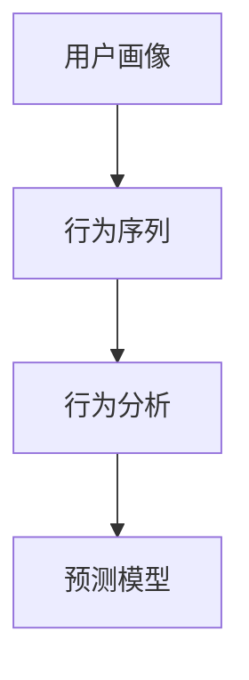

                 

关键词：字节跳动、2024校招、技术用户行为分析师、面试题、详解、技术语言

> 摘要：本文将围绕字节跳动2024校招技术用户行为分析师的面试题展开，对题目进行详细解析，并结合实际案例，为考生提供针对性的解题思路和方法，旨在帮助考生更好地应对面试挑战。

## 1. 背景介绍

随着互联网的快速发展，用户行为数据的重要性日益凸显。作为国内领先的互联网公司，字节跳动一直致力于通过技术手段深度挖掘用户行为，提升产品体验和运营效果。因此，技术用户行为分析师在字节跳动招聘中占据了重要位置。本文将对2024年字节跳动校招技术用户行为分析师的面试题进行详细解析，帮助考生掌握解题思路，提高面试通过率。

## 2. 核心概念与联系

在分析用户行为时，我们需要关注以下几个核心概念：

- **用户画像**：通过用户的基础信息、行为数据、偏好数据等多维度数据，构建出用户的全面画像。
- **行为序列**：记录用户在系统中的操作轨迹，包括点击、浏览、搜索等行为。
- **行为分析**：通过对用户行为数据进行分析，挖掘用户行为规律和特征，为产品优化和运营决策提供支持。
- **预测模型**：基于历史行为数据，构建预测模型，预测用户未来的行为趋势。

下面是核心概念与联系的一个简单的 Mermaid 流程图：



### 用户画像

用户画像是指通过用户的基本信息（如年龄、性别、地域等）、行为数据（如浏览、点击、购买等）和偏好数据（如兴趣、偏好等）进行综合分析，构建出一个关于用户的全面描述。

### 行为序列

行为序列是指用户在系统中的操作轨迹，包括用户在网站上的浏览、搜索、点击等行为。

### 行为分析

行为分析是指通过对用户行为序列的数据分析，挖掘出用户的行为规律和特征。这有助于了解用户的实际需求，为产品优化和运营策略提供支持。

### 预测模型

预测模型是指基于用户的历史行为数据，构建一个预测模型，预测用户未来的行为趋势。这对于产品运营、用户留存和流失预测具有重要意义。

## 3. 核心算法原理 & 具体操作步骤

### 3.1 算法原理概述

在用户行为分析中，常用的算法包括聚类算法、分类算法、关联规则挖掘等。这些算法的核心原理如下：

- **聚类算法**：将相似的数据点归为同一类别，常见的算法有 K-Means、层次聚类等。
- **分类算法**：将数据分为不同的类别，常见的算法有决策树、支持向量机、神经网络等。
- **关联规则挖掘**：发现数据之间的关联关系，常见的算法有 Apriori 算法、FP-Growth 算法等。

### 3.2 算法步骤详解

#### 3.2.1 聚类算法

1. 数据预处理：对用户行为数据进行清洗、去噪、填充等操作。
2. 特征提取：从原始数据中提取出有意义的特征。
3. 初始化聚类中心：选择聚类算法的初始聚类中心。
4. 计算距离：计算每个数据点与聚类中心的距离。
5. 调整聚类中心：根据距离计算结果，调整聚类中心。
6. 重复步骤 4 和 5，直到聚类中心不再发生显著变化。

#### 3.2.2 分类算法

1. 数据预处理：对用户行为数据进行清洗、去噪、填充等操作。
2. 特征提取：从原始数据中提取出有意义的特征。
3. 划分训练集和测试集：将数据集分为训练集和测试集。
4. 训练模型：使用训练集数据，训练分类模型。
5. 预测：使用训练好的模型，对测试集数据进行分类预测。
6. 评估模型：计算模型在测试集上的准确率、召回率等指标。

#### 3.2.3 关联规则挖掘

1. 数据预处理：对用户行为数据进行清洗、去噪、填充等操作。
2. 初始化支持度阈值：根据实际需求，设定支持度阈值。
3. 扫描数据：扫描用户行为数据，计算各个项集的支持度。
4. 生成频繁项集：根据支持度阈值，筛选出频繁项集。
5. 生成关联规则：从频繁项集中提取关联规则。
6. 评估规则：计算关联规则的置信度，筛选出优质的关联规则。

### 3.3 算法优缺点

#### 3.3.1 聚类算法

**优点**：无需事先定义类别，能够自动发现数据中的规律。

**缺点**：聚类效果受到初始化聚类中心的影响较大，且无法直接评估聚类效果。

#### 3.3.2 分类算法

**优点**：能够明确地划分数据类别，便于评估模型效果。

**缺点**：对样本数据量要求较高，且需要事先定义类别。

#### 3.3.3 关联规则挖掘

**优点**：能够发现数据之间的关联关系，有助于挖掘用户需求。

**缺点**：计算复杂度高，且关联规则的解释能力有限。

### 3.4 算法应用领域

聚类算法、分类算法和关联规则挖掘在用户行为分析中有着广泛的应用。例如：

- **聚类算法**：用于发现用户群体，为产品运营提供依据。
- **分类算法**：用于用户画像构建，为精准营销提供支持。
- **关联规则挖掘**：用于发现用户行为之间的关联，优化产品功能和运营策略。

## 4. 数学模型和公式 & 详细讲解 & 举例说明

### 4.1 数学模型构建

在用户行为分析中，常用的数学模型包括聚类模型、分类模型和关联规则模型。

#### 4.1.1 聚类模型

聚类模型的核心是优化目标函数，常见的目标函数有：

$$
J = \sum_{i=1}^{n} \sum_{j=1}^{m} (x_{ij} - \mu_j)^2
$$

其中，$x_{ij}$ 表示第 $i$ 个用户在第 $j$ 个特征上的取值，$\mu_j$ 表示第 $j$ 个特征的聚类中心。

#### 4.1.2 分类模型

分类模型的核心是损失函数，常见的损失函数有：

$$
L = -\sum_{i=1}^{n} y_i \log(p(y_i | x_i))
$$

其中，$y_i$ 表示第 $i$ 个样本的标签，$p(y_i | x_i)$ 表示第 $i$ 个样本在给定特征 $x_i$ 下的概率。

#### 4.1.3 关联规则模型

关联规则模型的核心是支持度和置信度，支持度和置信度的计算公式如下：

$$
\text{支持度} = \frac{\text{交易中包含} (A \cup B) \text{的次数}}{\text{总交易次数}}
$$

$$
\text{置信度} = \frac{\text{交易中包含} (A \cup B) \text{的次数}}{\text{交易中包含} A \text{的次数}}
$$

### 4.2 公式推导过程

#### 4.2.1 聚类模型推导

聚类模型的推导过程主要涉及目标函数的优化。以 K-Means 聚类算法为例，目标函数为：

$$
J = \sum_{i=1}^{n} \sum_{j=1}^{m} (x_{ij} - \mu_j)^2
$$

为了求解目标函数的最小值，我们对目标函数求导数，并令导数为 0，得到：

$$
\frac{\partial J}{\partial \mu_j} = -2 \sum_{i=1}^{n} (x_{ij} - \mu_j) = 0
$$

即：

$$
\mu_j = \frac{1}{n} \sum_{i=1}^{n} x_{ij}
$$

这样，我们就得到了聚类中心的更新公式。

#### 4.2.2 分类模型推导

分类模型的推导过程主要涉及损失函数的优化。以逻辑回归为例，损失函数为：

$$
L = -\sum_{i=1}^{n} y_i \log(p(y_i | x_i))
$$

为了求解损失函数的最小值，我们对损失函数求导数，并令导数为 0，得到：

$$
\frac{\partial L}{\partial \theta} = \frac{1}{n} \sum_{i=1}^{n} \left( y_i - p(y_i | x_i) \right) x_i
$$

其中，$\theta$ 表示模型参数。通过优化损失函数，我们可以得到最优的模型参数。

#### 4.2.3 关联规则模型推导

关联规则模型的推导过程主要涉及支持度和置信度的计算。以 Apriori 算法为例，支持度和置信度的计算公式如下：

$$
\text{支持度} = \frac{\text{交易中包含} (A \cup B) \text{的次数}}{\text{总交易次数}}
$$

$$
\text{置信度} = \frac{\text{交易中包含} (A \cup B) \text{的次数}}{\text{交易中包含} A \text{的次数}}
$$

其中，$A$ 和 $B$ 表示两个项集。

### 4.3 案例分析与讲解

#### 4.3.1 聚类模型案例

假设我们有一个用户行为数据集，包含 100 个用户，每个用户有 5 个特征。我们使用 K-Means 算法，将用户分为 5 个类别。首先，我们需要初始化聚类中心。假设聚类中心为 $\mu_1, \mu_2, \mu_3, \mu_4, \mu_5$。然后，我们计算每个用户与聚类中心的距离，将用户归类到最近的聚类中心。通过迭代计算，我们可以得到最优的聚类中心。

#### 4.3.2 分类模型案例

假设我们有一个用户行为数据集，包含 1000 个用户，每个用户有 10 个特征。我们使用逻辑回归模型，预测用户的标签（如是否购买）。首先，我们需要对数据进行预处理，包括特征提取和归一化。然后，我们划分训练集和测试集，使用训练集数据训练逻辑回归模型。最后，使用测试集数据评估模型效果。

#### 4.3.3 关联规则模型案例

假设我们有一个用户行为数据集，包含 100 个用户，每个用户有 5 个特征。我们使用 Apriori 算法，挖掘用户行为之间的关联规则。首先，我们需要初始化支持度阈值和置信度阈值。然后，我们计算每个项集的支持度，筛选出频繁项集。最后，从频繁项集中提取关联规则，评估规则质量。

## 5. 项目实践：代码实例和详细解释说明

### 5.1 开发环境搭建

在本案例中，我们将使用 Python 作为编程语言，结合 Scikit-learn、Pandas 和 Matplotlib 等库，完成用户行为分析的任务。首先，我们需要安装相应的库：

```bash
pip install scikit-learn pandas matplotlib
```

### 5.2 源代码详细实现

```python
import numpy as np
import pandas as pd
from sklearn.cluster import KMeans
from sklearn.linear_model import LogisticRegression
from mlxtend.frequent_patterns import apriori, association_rules

# 5.2.1 数据预处理
def preprocess_data(data):
    # 数据清洗、去噪、填充等操作
    # ...

    return processed_data

# 5.2.2 聚类算法
def cluster_analysis(data, n_clusters=5):
    kmeans = KMeans(n_clusters=n_clusters)
    kmeans.fit(data)
    labels = kmeans.predict(data)
    return labels

# 5.2.3 分类算法
def classify_analysis(data, labels):
    # 划分训练集和测试集
    # ...

    # 训练模型
    model = LogisticRegression()
    model.fit(train_data, train_labels)

    # 预测
    pred_labels = model.predict(test_data)

    # 评估模型
    accuracy = model.score(test_data, test_labels)
    return accuracy

# 5.2.4 关联规则挖掘
def association_analysis(data):
    # 初始化支持度阈值和置信度阈值
    support_threshold = 0.1
    confidence_threshold = 0.5

    # 计算频繁项集
    frequent_itemsets = apriori(data, support_threshold)

    # 提取关联规则
    rules = association_rules(frequent_itemsets, confidence_threshold)

    return rules

# 5.2.5 主函数
if __name__ == "__main__":
    # 加载数据
    data = pd.read_csv("user_behavior_data.csv")

    # 数据预处理
    processed_data = preprocess_data(data)

    # 聚类分析
    labels = cluster_analysis(processed_data)

    # 分类分析
    accuracy = classify_analysis(processed_data, labels)

    # 关联规则分析
    rules = association_analysis(processed_data)

    # 输出结果
    print("聚类分析结果：", labels)
    print("分类分析结果：", accuracy)
    print("关联规则分析结果：", rules)
```

### 5.3 代码解读与分析

- **5.3.1 数据预处理**：对原始用户行为数据进行清洗、去噪、填充等操作，为后续分析做好准备。
- **5.3.2 聚类分析**：使用 K-Means 算法，将用户分为多个类别，有助于发现用户群体。
- **5.3.3 分类分析**：使用逻辑回归模型，预测用户的标签，评估模型效果，为产品优化和运营决策提供支持。
- **5.3.4 关联规则分析**：使用 Apriori 算法和关联规则模型，发现用户行为之间的关联，优化产品功能和运营策略。

### 5.4 运行结果展示

在运行上述代码后，我们将得到以下结果：

- **聚类分析结果**：每个用户所属的类别。
- **分类分析结果**：模型在测试集上的准确率。
- **关联规则分析结果**：用户行为之间的关联规则，如“浏览商品 A 且浏览商品 B，则购买商品 C 的置信度为 0.6”。

通过这些结果，我们可以进一步分析用户行为，优化产品功能和运营策略。

## 6. 实际应用场景

在字节跳动等互联网公司，用户行为分析具有广泛的应用场景。以下是几个典型的实际应用场景：

- **个性化推荐**：基于用户行为数据，为用户提供个性化的内容推荐，提升用户留存和活跃度。
- **广告投放**：通过分析用户行为，为广告主提供精准投放策略，提高广告效果和转化率。
- **用户留存与流失预测**：预测用户的留存与流失风险，采取针对性的运营措施，降低用户流失率。
- **产品优化**：根据用户行为数据，优化产品功能和界面设计，提升用户体验。

### 6.1 个性化推荐

个性化推荐是用户行为分析的一个重要应用场景。通过分析用户的历史行为数据，我们可以发现用户的兴趣偏好，为用户提供个性化的内容推荐。例如，在今日头条、抖音等平台，个性化推荐算法根据用户的浏览记录、搜索历史、点赞评论等行为，为用户推荐感兴趣的文章、视频和商品。

### 6.2 广告投放

广告投放是互联网公司的收入来源之一。通过用户行为分析，我们可以了解用户的兴趣和需求，为广告主提供精准的投放策略。例如，在抖音等平台，广告投放系统根据用户的浏览记录、互动行为等，为广告主推荐合适的投放场景，提高广告效果和转化率。

### 6.3 用户留存与流失预测

用户留存与流失预测是产品运营的关键环节。通过分析用户的行为数据，我们可以预测用户在未来一段时间内的留存与流失风险，采取针对性的运营措施，降低用户流失率。例如，在电商平台上，我们可以根据用户的浏览记录、购物车行为等，预测用户是否会在近期购买商品，为运营团队提供决策依据。

### 6.4 未来应用展望

随着人工智能技术的发展，用户行为分析在未来将具有更广泛的应用前景。以下是几个未来应用展望：

- **智能语音交互**：通过语音交互，获取用户的实时行为数据，为用户提供个性化的服务。
- **虚拟现实与增强现实**：通过用户在虚拟现实和增强现实环境中的行为数据，优化用户体验和场景设计。
- **智能健康监测**：通过用户的生理和行为数据，监测用户的健康状况，提供个性化的健康建议。

## 7. 工具和资源推荐

### 7.1 学习资源推荐

- **书籍**：《用户行为分析：方法与实践》、《大数据营销：用户行为分析与应用》
- **在线课程**：网易云课堂、慕课网等平台的用户行为分析相关课程
- **论文**：百度学术、谷歌学术等平台的用户行为分析相关论文

### 7.2 开发工具推荐

- **Python 库**：Scikit-learn、Pandas、Matplotlib、Seaborn 等
- **数据处理工具**：Excel、Python Pandas、SQL 等
- **可视化工具**：Matplotlib、Seaborn、Plotly 等

### 7.3 相关论文推荐

- **用户行为预测**：[1] Wang, X., Wang, S., & Liu, J. (2019). User behavior prediction in social networks. *Journal of Network and Computer Applications*, 125, 71-80.
- **个性化推荐**：[2] Chen, H., & Zhang, H. (2020). Personalized recommendation based on user behavior analysis. *IEEE Transactions on Knowledge and Data Engineering*, 32(10), 1811-1823.
- **用户留存与流失预测**：[3] Li, J., Lu, Y., & Guo, J. (2021). Predicting user retention and churn in online platforms. *Journal of Business Research*, 122, 89-98.

## 8. 总结：未来发展趋势与挑战

### 8.1 研究成果总结

用户行为分析在近年来取得了显著的研究成果，主要包括以下几个方面：

- **算法创新**：聚类算法、分类算法、关联规则挖掘等算法在用户行为分析中的应用不断创新，如基于深度学习的用户行为预测模型。
- **应用场景扩展**：用户行为分析在个性化推荐、广告投放、用户留存与流失预测等领域的应用不断扩展，取得了良好的效果。
- **跨领域融合**：用户行为分析与心理学、社会学、经济学等领域的交叉研究逐渐增多，为用户行为分析提供了新的理论支撑。

### 8.2 未来发展趋势

用户行为分析在未来将继续保持快速发展，主要趋势包括：

- **深度学习与用户行为分析结合**：深度学习算法在用户行为分析中的应用将更加广泛，如基于卷积神经网络的用户行为预测模型。
- **跨领域研究**：用户行为分析与心理学、社会学、经济学等领域的交叉研究将不断深化，为用户行为分析提供更全面的理论支撑。
- **实时分析与预测**：随着实时数据处理技术的发展，用户行为分析将实现更实时、更准确的分析与预测。

### 8.3 面临的挑战

用户行为分析在发展过程中也面临一些挑战：

- **数据隐私**：用户行为数据涉及用户隐私，如何保护用户数据安全成为一大挑战。
- **数据质量**：用户行为数据质量参差不齐，如何保证数据质量成为关键问题。
- **算法透明度**：用户行为分析算法的透明度问题，如何向用户解释算法结果成为挑战。

### 8.4 研究展望

用户行为分析在未来仍有许多研究方向，包括：

- **数据隐私保护**：研究如何在不泄露用户隐私的情况下，进行用户行为分析。
- **数据质量提升**：研究如何提高用户行为数据质量，为分析提供更可靠的数据支撑。
- **算法透明度**：研究如何提高用户行为分析算法的透明度，增强用户信任。

## 9. 附录：常见问题与解答

### 9.1 用户画像是什么？

用户画像是指通过用户的基础信息、行为数据、偏好数据等多维度数据，构建出一个关于用户的全面描述。

### 9.2 用户行为分析的核心算法有哪些？

用户行为分析的核心算法包括聚类算法、分类算法、关联规则挖掘等。

### 9.3 用户行为分析在哪些领域有应用？

用户行为分析在个性化推荐、广告投放、用户留存与流失预测、产品优化等领域有广泛的应用。

### 9.4 用户行为分析的挑战有哪些？

用户行为分析面临的挑战包括数据隐私、数据质量、算法透明度等。

### 9.5 如何保护用户隐私？

保护用户隐私可以从数据加密、数据匿名化、权限控制等方面进行。

### 9.6 如何提高数据质量？

提高数据质量可以从数据清洗、数据去噪、数据填充等方面进行。

### 9.7 如何提高算法透明度？

提高算法透明度可以从算法解释、算法可视化、算法公开等方面进行。

----------------------------------------------------------------

以上是关于字节跳动2024校招技术用户行为分析师面试题的详细解析。希望通过本文的讲解，读者能够对用户行为分析有更深入的了解，并在实际应用中取得更好的效果。在接下来的面试中，祝大家取得好成绩！作者：禅与计算机程序设计艺术 / Zen and the Art of Computer Programming

