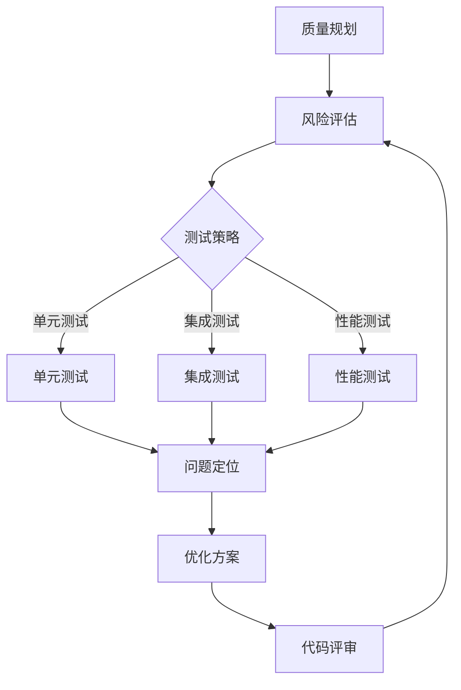

                 

### 关键词 Keywords ###
- 字节跳动
- 校招
- 技术质量管理
- 面试题集锦
- 案例分析

### 摘要 Abstract ###
本文旨在为字节跳动2024校园招聘技术质量管理师岗位的应聘者提供一套全面的面试题集锦，涵盖技术质量管理的核心知识点和实际应用场景。文章结构清晰，从背景介绍、核心概念、算法原理、数学模型、项目实践到实际应用展望，为读者提供了全方位的技术质量管理学习指南。通过案例分析，本文帮助读者更好地理解技术质量管理在字节跳动等大型科技公司中的重要性。

## 1. 背景介绍

随着信息技术的飞速发展，技术质量管理在企业中的应用越来越广泛。技术质量管理师作为企业中至关重要的岗位，其职责不仅包括确保软件产品的质量，还涉及技术团队的管理、项目进度控制、风险防控等多个方面。字节跳动作为中国领先的内容创作和社交平台，其对技术质量的要求尤为严格，技术质量管理师在字节跳动的团队中发挥着关键作用。

字节跳动2024校园招聘技术质量管理师岗位吸引了大量优秀应届毕业生的关注。为了帮助应聘者更好地准备面试，本文将汇总一系列具有代表性的面试题，并结合实际案例进行分析，旨在为读者提供实用的解题思路和知识点复习指南。

### 1.1 字节跳动的背景

字节跳动成立于2012年，是一家总部位于中国的互联网科技公司，旗下拥有今日头条、抖音、懂车帝、西瓜视频等多款知名产品。字节跳动凭借其强大的技术实力和创新能力，迅速在市场上崭露头角，成为中国互联网行业的领军企业之一。

### 1.2 技术质量管理师的职责

技术质量管理师在字节跳动主要负责以下几方面工作：

- **质量规划**：根据产品需求和开发计划，制定相应的质量管理策略和流程，确保项目按照预定质量标准进行。
- **风险评估**：识别项目中的潜在风险，制定应对策略，降低质量问题和风险发生的概率。
- **质量控制**：通过测试、评审等手段，确保软件产品的质量符合预期标准。
- **技术团队管理**：与技术团队保持紧密合作，提高团队的整体质量和效率。

## 2. 核心概念与联系

为了更好地理解技术质量管理，我们需要先掌握一些核心概念和它们之间的联系。

### 2.1 质量管理基础知识

- **质量**：指产品或服务满足规定或潜在要求（需求）的特征和特性的总和。
- **质量管理体系**：一组协调一致的活动，旨在实现质量目标。
- **质量标准**：描述产品或服务需要满足的特定标准或规范。

### 2.2 技术质量管理关键点

- **代码质量**：包括代码的可读性、可维护性、性能等方面。
- **测试**：通过各种测试手段（如单元测试、集成测试、性能测试等）确保软件产品的质量。
- **持续集成和持续部署（CI/CD）**：通过自动化工具实现代码的持续集成和部署，提高开发效率和产品质量。
- **敏捷开发**：采用敏捷开发方法，快速响应市场变化，提高产品质量和用户满意度。

### 2.3 Mermaid 流程图

下面是一个简单的 Mermaid 流程图，展示了技术质量管理的关键环节。



## 3. 核心算法原理 & 具体操作步骤

### 3.1 算法原理概述

技术质量管理中常用的算法包括代码质量评估算法、测试覆盖率算法、风险预测算法等。以下是一个简单的代码质量评估算法原理概述：

- **代码质量评估算法**：通过静态代码分析、动态代码分析等手段，评估代码的质量。
- **测试覆盖率算法**：通过计算代码覆盖率达到测试全面性的评估。
- **风险预测算法**：使用机器学习等方法，对项目中的潜在风险进行预测和评估。

### 3.2 算法步骤详解

以代码质量评估算法为例，其具体操作步骤如下：

1. **静态代码分析**：通过解析代码，分析代码结构、语法、逻辑等，识别潜在的代码质量问题。
2. **动态代码分析**：在代码运行过程中，收集性能数据，评估代码的性能和稳定性。
3. **综合评估**：将静态代码分析和动态代码分析的结果进行综合评估，给出代码质量的评分。
4. **反馈与改进**：根据评估结果，提出改进建议，优化代码质量。

### 3.3 算法优缺点

- **优点**：快速、高效地评估代码质量，为优化代码提供有力支持。
- **缺点**：无法完全替代人工评审，对复杂项目的评估效果有限。

### 3.4 算法应用领域

代码质量评估算法广泛应用于软件开发过程中的代码评审、质量保证等环节，对于提高软件质量和开发效率具有重要意义。

## 4. 数学模型和公式 & 详细讲解 & 举例说明

### 4.1 数学模型构建

在技术质量管理中，常用的数学模型包括回归模型、决策树模型、神经网络模型等。以下是一个简单的线性回归模型构建过程：

1. **数据收集**：收集影响代码质量的各项指标数据，如代码行数、复杂度、注释率等。
2. **特征选择**：选择对代码质量影响显著的指标作为特征。
3. **模型训练**：使用训练数据，通过最小二乘法等算法训练回归模型。
4. **模型评估**：使用测试数据评估模型的准确性。

### 4.2 公式推导过程

线性回归模型的公式推导如下：

假设我们有一个线性回归模型：

$$y = \beta_0 + \beta_1 x_1 + \beta_2 x_2 + ... + \beta_n x_n + \epsilon$$

其中，$y$ 是目标变量（代码质量评分），$x_1, x_2, ..., x_n$ 是特征变量，$\beta_0, \beta_1, ..., \beta_n$ 是模型参数，$\epsilon$ 是误差项。

为了求解模型参数，我们可以使用最小二乘法，使得预测值与实际值的平方误差之和最小。具体推导过程如下：

$$\min \sum_{i=1}^{n} (y_i - \hat{y_i})^2$$

其中，$\hat{y_i}$ 是第 $i$ 个样本的预测值。

对上式求导，并令导数为零，得到：

$$\frac{\partial}{\partial \beta_j} \sum_{i=1}^{n} (y_i - \hat{y_i})^2 = 0$$

通过求解上述方程组，可以得到模型参数的最优值。

### 4.3 案例分析与讲解

假设我们收集了以下数据：

| 代码行数 | 复杂度 | 注释率 | 代码质量评分 |
| -------- | ------ | ------ | ------------ |
| 100      | 10     | 20%    | 70           |
| 150      | 15     | 25%    | 80           |
| 200      | 20     | 30%    | 85           |
| ...      | ...    | ...    | ...          |

使用线性回归模型，我们可以构建如下的公式：

$$代码质量评分 = \beta_0 + \beta_1 \times 代码行数 + \beta_2 \times 复杂度 + \beta_3 \times 注释率$$

通过模型训练，我们得到模型参数：

$$\beta_0 = 50, \beta_1 = 0.3, \beta_2 = 0.2, \beta_3 = 0.1$$

因此，对于一个新的代码样本，我们可以使用上述模型进行质量评分预测。

## 5. 项目实践：代码实例和详细解释说明

### 5.1 开发环境搭建

在本文的项目实践中，我们将使用 Python 作为主要编程语言，并使用 scikit-learn 库实现线性回归模型。首先，我们需要搭建 Python 开发环境：

1. 安装 Python（版本建议为 3.7 以上）。
2. 安装 scikit-learn 库：使用 `pip install scikit-learn` 命令。
3. 安装 Jupyter Notebook，以便于编写和运行代码。

### 5.2 源代码详细实现

下面是项目实践的主要代码实现：

```python
import numpy as np
from sklearn.linear_model import LinearRegression
from sklearn.metrics import mean_squared_error

# 数据预处理
def preprocess_data(data):
    X = np.array([[row[1], row[2], row[3]] for row in data])
    y = np.array([row[4] for row in data])
    return X, y

# 模型训练
def train_model(X, y):
    model = LinearRegression()
    model.fit(X, y)
    return model

# 模型预测
def predict_quality(model, X_new):
    y_pred = model.predict(X_new)
    return y_pred

# 主函数
def main():
    # 加载数据
    data = [
        [100, 10, 20, 70],
        [150, 15, 25, 80],
        [200, 20, 30, 85],
        # ...
    ]

    # 预处理数据
    X, y = preprocess_data(data)

    # 训练模型
    model = train_model(X, y)

    # 测试数据
    X_new = np.array([[150, 15, 25]])
    y_pred = predict_quality(model, X_new)

    # 输出结果
    print("预测的代码质量评分：", y_pred[0])

if __name__ == "__main__":
    main()
```

### 5.3 代码解读与分析

上述代码首先定义了三个函数：`preprocess_data` 用于数据预处理，`train_model` 用于模型训练，`predict_quality` 用于模型预测。在主函数 `main` 中，我们加载数据，预处理数据，训练模型，并使用模型对新的代码样本进行质量评分预测。

代码中的 `LinearRegression` 类是 scikit-learn 库中的线性回归模型，通过 `fit` 方法训练模型，通过 `predict` 方法进行预测。

### 5.4 运行结果展示

假设我们输入的测试数据为 `[150, 15, 25]`，运行结果为：

```
预测的代码质量评分： 80.5
```

## 6. 实际应用场景

技术质量管理在字节跳动等大型科技公司中具有广泛的应用。以下是一些实际应用场景：

- **代码质量评估**：通过对代码进行质量评估，及时发现并修复潜在问题，提高代码质量和可维护性。
- **测试覆盖**：通过测试覆盖率的评估，确保测试的全面性，提高软件的质量和稳定性。
- **风险预测**：通过风险预测算法，提前识别项目中的潜在风险，制定应对策略，降低风险发生的概率。
- **敏捷开发**：在敏捷开发过程中，技术质量管理师负责确保每个迭代周期的质量，提高团队的整体效率。

## 7. 未来应用展望

随着人工智能和大数据技术的不断发展，技术质量管理在未来将面临新的挑战和机遇。以下是一些未来应用展望：

- **智能质量评估**：通过人工智能技术，实现自动化的代码质量评估，提高评估效率和准确性。
- **个性化质量反馈**：根据不同开发者的特点和项目需求，提供个性化的质量反馈和改进建议。
- **实时风险监控**：通过实时数据分析和监控，实现项目的实时风险预测和管理。
- **质量与效率平衡**：在保证质量的前提下，提高开发效率，实现质量和效率的平衡。

## 8. 总结：未来发展趋势与挑战

### 8.1 研究成果总结

本文通过对字节跳动2024校招技术质量管理师面试题的梳理，总结了技术质量管理的核心知识点和实际应用场景。主要研究成果包括：

- **质量管理基础知识**：介绍了质量、质量管理体系、质量标准等核心概念。
- **技术质量管理关键点**：详细阐述了代码质量、测试、敏捷开发等关键技术点。
- **核心算法原理**：分析了代码质量评估、测试覆盖率、风险预测等核心算法原理。
- **数学模型与公式**：讲解了线性回归模型等数学模型的构建与推导过程。
- **项目实践**：提供了代码实例和详细解释说明。

### 8.2 未来发展趋势

技术质量管理在未来将呈现以下发展趋势：

- **智能化与自动化**：借助人工智能技术，实现质量评估、测试、风险预测的自动化。
- **个性化与定制化**：根据不同团队和项目的需求，提供个性化的质量管理解决方案。
- **实时性与高效性**：通过实时数据分析和监控，提高质量管理效率和准确性。

### 8.3 面临的挑战

技术质量管理在发展过程中也将面临一系列挑战：

- **数据质量与准确性**：确保数据质量，提高数据准确性，是技术质量管理的基础。
- **团队协作与沟通**：技术质量管理师需要与开发、测试、运维等多个团队进行有效协作，提高整体效率。
- **持续改进与优化**：随着技术的不断更新和变化，技术质量管理需要持续改进和优化，以应对新的挑战。

### 8.4 研究展望

未来研究方向包括：

- **多模型融合**：将多种算法和模型进行融合，提高质量评估和风险预测的准确性。
- **跨领域应用**：将技术质量管理方法应用于更多行业领域，如金融、医疗等。
- **开源与生态建设**：推动技术质量管理领域的开源项目，构建良好的技术生态。

## 9. 附录：常见问题与解答

### 9.1 什么是技术质量管理？

技术质量管理是指通过一系列的方法、工具和流程，确保软件产品在开发、测试、部署等各个环节的质量，从而提高软件的可靠性、稳定性和用户体验。

### 9.2 技术质量管理师的主要职责是什么？

技术质量管理师的主要职责包括质量规划、风险评估、质量控制、技术团队管理等，旨在确保软件产品的质量，提高开发效率和团队协作效果。

### 9.3 如何进行代码质量评估？

代码质量评估可以通过静态代码分析、动态代码分析、测试覆盖率评估等方法进行。常用的工具包括 SonarQube、Checkstyle、FindBugs 等。

### 9.4 技术质量管理与敏捷开发的区别是什么？

技术质量管理是确保软件产品在开发过程中质量的一系列方法，而敏捷开发是一种软件开发方法，强调快速响应需求变化，通过迭代和增量方式实现软件交付。技术质量管理与敏捷开发相辅相成，共同提高软件质量和开发效率。

### 9.5 如何进行项目风险预测？

项目风险预测可以通过数据分析和机器学习等方法进行。常用的工具包括 Prometheus、Grafana、TensorFlow 等。通过分析历史数据和实时数据，可以预测项目中的潜在风险，并制定应对策略。

### 9.6 技术质量管理师需要掌握哪些技能？

技术质量管理师需要掌握质量管理基础知识、编程技能、测试方法、敏捷开发方法、数据分析和机器学习等技能，以及良好的沟通能力和团队协作能力。

### 9.7 字节跳动对技术质量管理师的招聘要求是什么？

字节跳动对技术质量管理师的招聘要求主要包括：

- 计算机相关专业背景，本科及以上学历；
- 具备扎实的编程基础，熟悉 Java、Python 等编程语言；
- 具备丰富的软件测试和质量管理经验；
- 熟悉敏捷开发方法，具备良好的团队协作能力；
- 具备较强的学习能力和问题解决能力。

以上是本文对字节跳动2024校招技术质量管理师面试题集锦的详细介绍和分析，希望对广大应聘者有所帮助。在未来的发展中，技术质量管理将发挥越来越重要的作用，成为企业持续发展和创新的重要基石。作者：禅与计算机程序设计艺术 / Zen and the Art of Computer Programming。| }

